# <a name="overview-of-labels"></a><span data-ttu-id="0934e-105">标签概述</span><span class="sxs-lookup"><span data-stu-id="0934e-105">Overview of labels</span></span>

<span data-ttu-id="0934e-p102">整个组织中可能有不同类型的内容。为了遵守行业法规和内部策略，必须采取不同的操作。例如，可能有：</span><span class="sxs-lookup"><span data-stu-id="0934e-p102">Across your organization, you probably have different types of content that require different actions taken on them in order to comply with industry regulations and internal policies. For example, you might have:</span></span>
  
- <span data-ttu-id="0934e-108">至少必须**保留**一段时间的纳税申报表格。</span><span class="sxs-lookup"><span data-stu-id="0934e-108">Tax forms that need to be **retained** for a minimum period of time.</span></span> 
    
- <span data-ttu-id="0934e-109">达到一定年限后必须**永久删除**的新闻材料。</span><span class="sxs-lookup"><span data-stu-id="0934e-109">Press materials that need to be **permanently deleted** when they reach a certain age.</span></span> 
    
- <span data-ttu-id="0934e-110">必须先**保留**再**永久删除**的竞争性研究。</span><span class="sxs-lookup"><span data-stu-id="0934e-110">Competitive research that needs to be both **retained** and then **permanently deleted**.</span></span> 
    
- <span data-ttu-id="0934e-111">必须**标记为记录**以免被编辑或删除的工作签证。</span><span class="sxs-lookup"><span data-stu-id="0934e-111">Work visas that must be **marked as a record** so that they can't be edited or deleted.</span></span> 
    
<span data-ttu-id="0934e-p103">在所有这些情况下，Office 365 中的标签都可有助于对正确的内容执行适当的操作。借助标签，可对整个组织中的数据进行分类以管理数据，并能根据此分类强制执行保留规则。</span><span class="sxs-lookup"><span data-stu-id="0934e-p103">In all of these cases, labels in Office 365 can help you take the right actions on the right content. With labels, you can classify data across your organization for governance, and enforce retention rules based on that classification.</span></span>
  
<span data-ttu-id="0934e-114">标签可用于：</span><span class="sxs-lookup"><span data-stu-id="0934e-114">With labels, you can:</span></span>
  
- <span data-ttu-id="0934e-p104">**方便组织用户手动将标签应用于** Outlook 网页版、Outlook 2010 及更高版本、OneDrive、SharePoint 和 Office 365 组中的内容。用户通常最了解自己处理的内容类型，因此可对数据进行分类，并应用适当策略。</span><span class="sxs-lookup"><span data-stu-id="0934e-p104">**Enable people in your organization to apply a label manually** to content in Outlook on the web, Outlook 2010 and later, OneDrive, SharePoint, and Office 365 groups. Users often know best what type of content they're working with, so they can classify it and have the appropriate policy applied.</span></span> 
    
- <span data-ttu-id="0934e-117">**将标签自动应用于符合特定条件的内容**，如内容包含：</span><span class="sxs-lookup"><span data-stu-id="0934e-117">**Apply labels to content automatically** if it matches specific conditions, such as when the content contains:</span></span> 
    
  - <span data-ttu-id="0934e-118">特定类型敏感信息。</span><span class="sxs-lookup"><span data-stu-id="0934e-118">Specific types of sensitive information.</span></span>
    
  - <span data-ttu-id="0934e-119">与所创建的查询匹配的特定关键字。</span><span class="sxs-lookup"><span data-stu-id="0934e-119">Specific keywords that match a query you create.</span></span>
    
    <span data-ttu-id="0934e-120">能否将标签自动应用于内容非常重要，这是因为：</span><span class="sxs-lookup"><span data-stu-id="0934e-120">The ability to apply labels to content automatically is important because:</span></span>
    
  - <span data-ttu-id="0934e-121">无需为用户提供有关所有分类的培训。</span><span class="sxs-lookup"><span data-stu-id="0934e-121">You don't need to train your users on all of your classifications.</span></span>
    
  - <span data-ttu-id="0934e-122">无需依赖用户，即可对全部内容进行正确分类。</span><span class="sxs-lookup"><span data-stu-id="0934e-122">You don't need to rely on users to classify all content correctly.</span></span>
    
  - <span data-ttu-id="0934e-123">用户不再需要了解数据管理策略，反而可以专注于自己的工作。</span><span class="sxs-lookup"><span data-stu-id="0934e-123">Users no longer need to know about data governance policies - they can instead focus on their work.</span></span>
    
    <span data-ttu-id="0934e-124">请注意，自动应用标签需要 Office 365 企业版 E5 订阅。</span><span class="sxs-lookup"><span data-stu-id="0934e-124">Note that auto-apply labels require an Office 365 Enterprise E5 subscription.</span></span>
    
- <span data-ttu-id="0934e-125">**将默认标签应用于 SharePoint 和 Office 365 组网站中的文档库**，让库中的所有文档都有默认标签。</span><span class="sxs-lookup"><span data-stu-id="0934e-125">**Apply a default label to a document library** in SharePoint and Office 365 group sites, so that all documents in that library get the default label.</span></span> 
    
- <span data-ttu-id="0934e-p105">**在 Office 365 中实现记录管理**，包括电子邮件和文档。可使用标签将内容分类为记录。如果这样做，既无法更改或删除标签，也无法编辑或删除内容。</span><span class="sxs-lookup"><span data-stu-id="0934e-p105">**Implement records management across Office 365**, including both email and documents. You can use a label to classify content as a record. When this happens, the label can't be changed or removed, and the content can't be edited or deleted.</span></span> 
    
<span data-ttu-id="0934e-129">标签是在 Office 365 安全与合规中心内的“标签”\*\*\*\* 页上进行创建和管理。</span><span class="sxs-lookup"><span data-stu-id="0934e-129">You create and manage labels on the **Labels** page in the Office 365 Security &amp; Compliance Center.</span></span> 
  

 
## <a name="how-labels-work-with-label-policies"></a><span data-ttu-id="0934e-131">如何结合使用标签和标签策略</span><span class="sxs-lookup"><span data-stu-id="0934e-131">How labels work with label policies</span></span>

<span data-ttu-id="0934e-p106">为组织用户提供可用于对内容进行分类的标签分为两步：第一步是创建标签，第二步是将标签发布到选定位置。在标签发布后，标签策略随之创建。</span><span class="sxs-lookup"><span data-stu-id="0934e-p106">Making labels available to people in your organization so that they can classify content is a two-step process: first you create the labels, and then you publish them to the locations you choose. When you publish labels, a label policy gets created.</span></span>
  
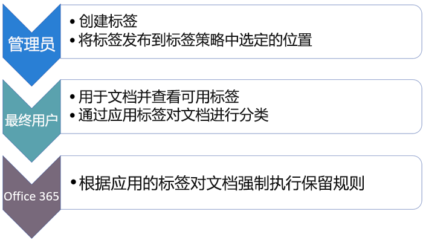
  
<span data-ttu-id="0934e-p107">标签是可重用的独立构建基块，包含在标签策略中，并发布到不同的位置。标签可跨多个策略进行重用。标签策略的主要用途是对一系列标签进行分组，并指定所需的标签显示位置。</span><span class="sxs-lookup"><span data-stu-id="0934e-p107">Labels are independent, reusable building blocks that are included in a label policy and published to different locations. Labels can be reused across many policies. The primary purpose of the label policy is to group a set of labels and specify the locations where you want those labels to appear.</span></span>
  
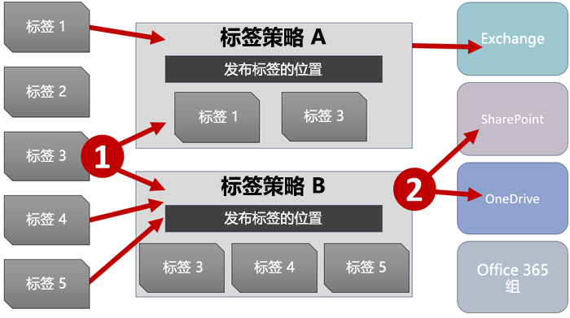
  
1. <span data-ttu-id="0934e-p108">发布的标签被纳入标签策略中。一个标签可被纳入多个策略中。</span><span class="sxs-lookup"><span data-stu-id="0934e-p108">When you publish labels, they're included in a label policy. A single label can be included in many policies.</span></span>
    
2. <span data-ttu-id="0934e-141">标签策略指定标签发布位置。</span><span class="sxs-lookup"><span data-stu-id="0934e-141">Label policies specify the locations to publish the labels.</span></span>
    
## <a name="only-one-label-at-a-time"></a><span data-ttu-id="0934e-142">一次只能分配一个标签</span><span class="sxs-lookup"><span data-stu-id="0934e-142">Only one label at a time</span></span>

<span data-ttu-id="0934e-143">请务必了解，电子邮件或文档等内容一次只能分配有一个标签：</span><span class="sxs-lookup"><span data-stu-id="0934e-143">It's important to know that content like an email or document can have only a single label assigned to it at a time:</span></span>
  
- <span data-ttu-id="0934e-144">对于最终用户手动分配的标签，用户可删除或更改已分配的标签。</span><span class="sxs-lookup"><span data-stu-id="0934e-144">For labels assigned manually by end users, people can remove or change the label that's assigned.</span></span>
    
- <span data-ttu-id="0934e-145">可将内容分配有的自动应用标签替换为最终用户手动分配的标签。</span><span class="sxs-lookup"><span data-stu-id="0934e-145">If content has an auto-apply label assigned, an auto-apply label can be replaced by a label assigned manually by an end user.</span></span>
    
- <span data-ttu-id="0934e-146">无法使用自动应用标签替换最终用户向内容手动分配的标签。</span><span class="sxs-lookup"><span data-stu-id="0934e-146">If content has a label assigned manually by an end user, an auto-apply label cannot replace the manually assigned label.</span></span>
    
- <span data-ttu-id="0934e-147">若有多个规则要分配自动应用标签，且内容满足多个规则的条件，那么分配的是年限最长规则的标签。</span><span class="sxs-lookup"><span data-stu-id="0934e-147">If there are multiple rules that assign an auto-apply label and content meets the conditions of multiple rules, the label for the oldest rule is assigned.</span></span>
    
<span data-ttu-id="0934e-p109">手动分配标签是显式分配标签；自动应用标签是隐式分配标签；显式标签优先于隐式标签。有关详细信息，请参阅下面的[保留原则或优先级](labels.md#principles)部分。</span><span class="sxs-lookup"><span data-stu-id="0934e-p109">Manually assigned labels are explicitly assigned; auto-apply labels are implicitly assigned; an explicit label takes precedence over an implicit label. For more information, see the below section on [The principles of retention, or what takes precedence?](labels.md#principles).</span></span>
  
## <a name="how-long-it-takes-for-labels-to-take-effect"></a><span data-ttu-id="0934e-150">标签需要多长时间才能生效</span><span class="sxs-lookup"><span data-stu-id="0934e-150">How long it takes for labels to take effect</span></span>

<span data-ttu-id="0934e-151">标签在发布或自动应用后不会立即生效：</span><span class="sxs-lookup"><span data-stu-id="0934e-151">When you publish or auto-apply labels, they don't take effect immediately:</span></span>
  
1. <span data-ttu-id="0934e-152">首先，需要将标签策略从安全与合规中心同步到策略中的位置。</span><span class="sxs-lookup"><span data-stu-id="0934e-152">First the label policy needs to be synced from the Security &amp; Compliance Center to the locations in the policy.</span></span>
    
2. <span data-ttu-id="0934e-p110">然后，可能需要等待一段时间，相应位置才支持最终用户分配手动标签，或将标签自动应用于内容。此过程所需的具体时间视标签的位置和类型而定。</span><span class="sxs-lookup"><span data-stu-id="0934e-p110">Then the location may require time to make manual labels available to end users or auto-apply labels to content. How long this takes depends on the location and type of label.</span></span>
    
### <a name="manual-labels"></a><span data-ttu-id="0934e-155">手动标签</span><span class="sxs-lookup"><span data-stu-id="0934e-155">Manual labels</span></span>

<span data-ttu-id="0934e-p111">如果将标签发布到 SharePoint 或 OneDrive，可能需要等待 1 天时间，这些标签才会向最终用户显示。此外，如果向 Exchange 发布标签，可能需要等待 7 天，这些标签才会向最终用户显示，并且邮箱至少必须包含 10MB 数据。</span><span class="sxs-lookup"><span data-stu-id="0934e-p111">If you publish labels to SharePoint or OneDrive, it can take one day for those labels to appear for end users. In addition, if you publish labels to Exchange, it can take 7 days for those labels to appear for end users, and the mailbox needs to contain at least 10 MB of data.</span></span>
  
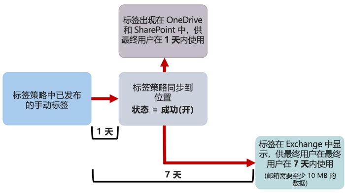
  
### <a name="auto-apply-labels"></a><span data-ttu-id="0934e-159">自动应用标签</span><span class="sxs-lookup"><span data-stu-id="0934e-159">Auto-apply labels</span></span>

<span data-ttu-id="0934e-160">如果将标签自动应用于符合特定条件的内容，可能需要等待 7 天，才能将标签应用于与条件匹配的所有内容。</span><span class="sxs-lookup"><span data-stu-id="0934e-160">If you auto-apply labels to content matching specific conditions, it can take seven days for the labels to be applied to all content that matches the conditions.</span></span>
  
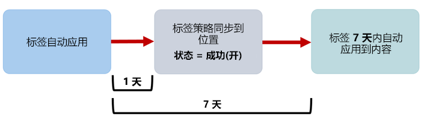
  
### <a name="how-to-check-on-the-status-of-exchange-labels"></a><span data-ttu-id="0934e-162">如何检查 Exchange 标签的状态</span><span class="sxs-lookup"><span data-stu-id="0934e-162">How to check on the status of Exchange labels</span></span>

<span data-ttu-id="0934e-p112">在 Exchange Online 中，有一个流程每 7 天运行一次，用于向最终用户提供标签。使用 Powershell，可查看此流程的上次运行时间，从而确定它何时再次运行。</span><span class="sxs-lookup"><span data-stu-id="0934e-p112">In Exchange Online, labels are made available to end users by a process that runs every seven days. By using Powershell, you can see when this process last ran and thus determine when it will run again.</span></span>
  
1. <span data-ttu-id="0934e-165">[连接到 Exchange Online PowerShell](https://go.microsoft.com/fwlink/?linkid=799773)。</span><span class="sxs-lookup"><span data-stu-id="0934e-165">[Connect to Exchange Online PowerShell](https://go.microsoft.com/fwlink/?linkid=799773).</span></span>
    
2. <span data-ttu-id="0934e-166">运行下面这些命令。</span><span class="sxs-lookup"><span data-stu-id="0934e-166">Run these commands.</span></span>
    
  ```
  $logProps = Export-MailboxDiagnosticLogs <user> -ExtendedProperties
  ```

  ```
  $xmlprops = [xml]($logProps.MailboxLog)
  ```

  ```
  $xmlprops.Properties.MailboxTable.Property | ? {$_.Name -like "ELC*"}
  ```

    <span data-ttu-id="0934e-p113">在结果中，`ELCLastSuccessTimeStamp` (UTC) 属性显示了系统上次处理邮箱的时间。如果自策略创建起邮箱一直未经处理，标签就不会显示。若要强制处理邮箱，请运行 `Start-ManagedFolderAssistant -Identity <user>`。</span><span class="sxs-lookup"><span data-stu-id="0934e-p113">In the results, the  `ELCLastSuccessTimeStamp` (UTC) property shows when the system last processed your mailbox. If it has not happened since the time you created the policy, the labels are not going to appear. To force processing, run  `Start-ManagedFolderAssistant -Identity <user>`.</span></span>
    
    <span data-ttu-id="0934e-170">如果标签没有显示在 Outlook 网页版中，但你认为标签应显示，请务必清除浏览器中的缓存 (Ctrl+F5)。</span><span class="sxs-lookup"><span data-stu-id="0934e-170">If labels aren't appearing in Outlook on the web and you think they should be, make sure to clear the cache in your browser (CTRL+F5).</span></span>
    
## <a name="label-policies-and-locations"></a><span data-ttu-id="0934e-171">标签策略和位置</span><span class="sxs-lookup"><span data-stu-id="0934e-171">Label policies and locations</span></span>

<span data-ttu-id="0934e-172">不同类型的标签可发布到不同位置，具体视标签用途而定。</span><span class="sxs-lookup"><span data-stu-id="0934e-172">Different types of labels can be published to different locations, depending on what the label does.</span></span>
  
|<span data-ttu-id="0934e-173">**如果标签…**</span><span class="sxs-lookup"><span data-stu-id="0934e-173">**If the label is…**</span></span>|<span data-ttu-id="0934e-174">**可将标签策略应用于…**</span><span class="sxs-lookup"><span data-stu-id="0934e-174">**Then the label policy can be applied to…**</span></span>|
|:-----|:-----|
|<span data-ttu-id="0934e-175">发布给最终用户</span><span class="sxs-lookup"><span data-stu-id="0934e-175">Published to end users</span></span>  <br/> |<span data-ttu-id="0934e-176">Exchange、SharePoint、OneDrive 和 Office 365 组</span><span class="sxs-lookup"><span data-stu-id="0934e-176">Exchange, SharePoint, OneDrive, Office 365 groups</span></span>  <br/> |
|<span data-ttu-id="0934e-177">根据敏感信息类型自动应用</span><span class="sxs-lookup"><span data-stu-id="0934e-177">Auto-applied based on sensitive information types</span></span>  <br/> |<span data-ttu-id="0934e-178">Exchange（仅全部邮箱）、SharePoint 和 OneDrive</span><span class="sxs-lookup"><span data-stu-id="0934e-178">Exchange (all mailboxes only), SharePoint, OneDrive</span></span>  <br/> |
|<span data-ttu-id="0934e-179">根据查询自动应用</span><span class="sxs-lookup"><span data-stu-id="0934e-179">Auto-applied based on a query</span></span>  <br/> |<span data-ttu-id="0934e-180">Exchange、SharePoint、OneDrive 和 Office 365 组</span><span class="sxs-lookup"><span data-stu-id="0934e-180">Exchange, SharePoint, OneDrive, Office 365 groups</span></span>  <br/> |
   
<span data-ttu-id="0934e-p114">请注意，在 Exchange 中，自动应用标签（根据查询和敏感信息类型自动应用）只应用于新发送的邮件（传输中的数据），而不应用于邮箱中的当前所有项（静态数据）。此外，根据敏感信息类型自动应用的标签只能应用于全部邮箱；你无法选择特定邮箱。</span><span class="sxs-lookup"><span data-stu-id="0934e-p114">Note that in Exchange, auto-apply labels (for both queries and sensitive information types) are applied only to messages newly sent (data in transit), not to all items currently in the mailbox (data at rest). Also, auto-apply labels for sensitive information types can apply only to all mailboxes; you can't select the specific mailboxes.</span></span>
  
<span data-ttu-id="0934e-183">请注意，Exchange 公用文件夹和 Skype 不支持标签。</span><span class="sxs-lookup"><span data-stu-id="0934e-183">Note that Exchange public folders and Skype do not support labels.</span></span>
  
## <a name="how-labels-enforce-retention"></a><span data-ttu-id="0934e-184">标签如何强制执行保留</span><span class="sxs-lookup"><span data-stu-id="0934e-184">How labels enforce retention</span></span>

<span data-ttu-id="0934e-p115">标签可强制执行与保留策略完全一样的所有保留操作。可使用标签实现复杂的内容计划（或文件计划）。若要详细了解保留工作原理，请参阅[保留策略概述](retention-policies.md)。</span><span class="sxs-lookup"><span data-stu-id="0934e-p115">Labels can enforce exactly the same retention actions that a retention policy can. You can use labels to implement a sophisticated content plan (or file plan). For more information on how retention works, see [Overview of retention policies](retention-policies.md).</span></span>
  
<span data-ttu-id="0934e-p116">此外，标签有两个保留选项，这两个选项只能用于标签，而不能用于保留策略。标签可用于：</span><span class="sxs-lookup"><span data-stu-id="0934e-p116">In addition, a label has two retention options that are available only in a label and not in a retention policy. With a label, you can:</span></span>
  
- <span data-ttu-id="0934e-p117">在保留期到期时触发处置评审。这样一来，必须先评审 SharePoint 和 OneDrive 文档，然后才能删除它们。有关详细信息，请参阅[处置评审概述](disposition-reviews.md)。</span><span class="sxs-lookup"><span data-stu-id="0934e-p117">Trigger a disposition review at the end of the retention period, so that SharePoint and OneDrive documents must be reviewed before they can be deleted. For more information, see [Overview of disposition reviews](disposition-reviews.md).</span></span>
    
- <span data-ttu-id="0934e-192">保留期从内容分配有标签时开始计算，而不是根据内容年限或上次修改时间计算。</span><span class="sxs-lookup"><span data-stu-id="0934e-192">Start the retention period from when the content was labeled, instead of the age of the content or when it was last modified.</span></span>
    
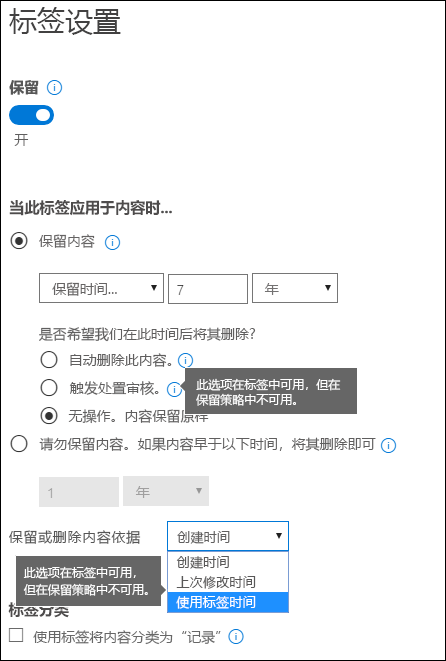
  
## <a name="where-published-labels-can-appear-to-end-users"></a><span data-ttu-id="0934e-194">在哪些位置上发布的标签可向最终用户显示</span><span class="sxs-lookup"><span data-stu-id="0934e-194">Where published labels can appear to end users</span></span>

<span data-ttu-id="0934e-195">如果标签将由最终用户分配给内容，可将标签发布到：</span><span class="sxs-lookup"><span data-stu-id="0934e-195">If your label will be assigned to content by end users, you can publish it to:</span></span>
  
- <span data-ttu-id="0934e-196">Outlook 网页版</span><span class="sxs-lookup"><span data-stu-id="0934e-196">Outlook on the web</span></span>
    
- <span data-ttu-id="0934e-197">Outlook 2010 及更高版本</span><span class="sxs-lookup"><span data-stu-id="0934e-197">Outlook 2010 and later</span></span>
    
- <span data-ttu-id="0934e-198">OneDrive</span><span class="sxs-lookup"><span data-stu-id="0934e-198">OneDrive</span></span>
    
- <span data-ttu-id="0934e-199">SharePoint</span><span class="sxs-lookup"><span data-stu-id="0934e-199">SharePoint</span></span>
    
- <span data-ttu-id="0934e-200">Office 365 组（Outlook 网页版中的组网站和组邮箱）</span><span class="sxs-lookup"><span data-stu-id="0934e-200">Office 365 groups (both the group site and group mailbox in Outlook on the web)</span></span>
    
<span data-ttu-id="0934e-201">下面各部分介绍了标签如何在不同的应用程序中向组织用户显示。</span><span class="sxs-lookup"><span data-stu-id="0934e-201">The sections below show how labels will appear in different apps to people in your organization.</span></span>
  
### <a name="outlook-on-the-web"></a><span data-ttu-id="0934e-202">Outlook 网页版</span><span class="sxs-lookup"><span data-stu-id="0934e-202">Outlook on the web</span></span>

<span data-ttu-id="0934e-203">若要在 Outlook 网页版中标记项，请右键单击项，单击“分配策略”\*\*\*\*，再选择标签。</span><span class="sxs-lookup"><span data-stu-id="0934e-203">To label an item in Outlook on the web, right-click the item \> **Assign policy** \> choose the label.</span></span> 
  
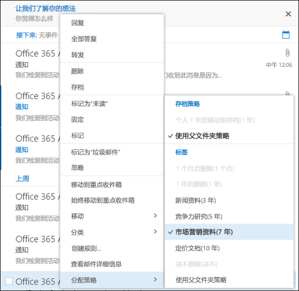
  
<span data-ttu-id="0934e-p118">在标签应用后，可在项顶部查看此标签及其执行的操作。如果电子邮件已分类且有关联的保留期，电子邮件的到期时间便一目了然。</span><span class="sxs-lookup"><span data-stu-id="0934e-p118">After the label is applied, you can view that label and what action it takes at the top of the item. If an email is classified and has an associated retention period, you can know at a glance when the email will expire.</span></span>
  
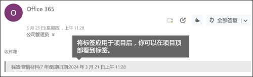
  
<span data-ttu-id="0934e-208">还可将标签应用于文件夹，在这种情况下：</span><span class="sxs-lookup"><span data-stu-id="0934e-208">You can also apply labels to folders, in which case:</span></span>
  
- <span data-ttu-id="0934e-p119">文件夹中的所有项都会自动获得相同的标签，已向其显式应用标签的项**除外**。显式标记的项保留现有标签。有关详细信息，请参阅以下关于保留原则的部分。</span><span class="sxs-lookup"><span data-stu-id="0934e-p119">All items in the folder automatically get the same label, **except** for items that have had a label applied explicitly to them. Explicitly labeled items keep their existing label. For more information, see the below section on the principles of retention.</span></span> 
    
- <span data-ttu-id="0934e-212">如果你更改或删除文件夹的默认标签，文件夹中所有项的标签都会随之更改或删除，具有显式标签的项**除外**。</span><span class="sxs-lookup"><span data-stu-id="0934e-212">If you change or remove the default label for a folder, the label's also changed or removed for all items in the folder, **except** items with explicit labels.</span></span> 
    
- <span data-ttu-id="0934e-213">如果你将具有默认标签的项从一个文件夹移至另一个具有不同默认标签的文件夹，此项会获得新的默认标签。</span><span class="sxs-lookup"><span data-stu-id="0934e-213">If you move an item with a default label from one folder to another folder with a different default label, the item will get the new default label.</span></span>
    
- <span data-ttu-id="0934e-214">如果你将具有默认标签的项从一个文件夹移至另一个没有默认标签的文件夹，旧的默认标签会被删除。</span><span class="sxs-lookup"><span data-stu-id="0934e-214">If you move an item with a default label from one folder to another folder with no default label, the old default label is removed.</span></span>
    
### <a name="outlook-2010-and-later"></a><span data-ttu-id="0934e-215">Outlook 2010 及更高版本</span><span class="sxs-lookup"><span data-stu-id="0934e-215">Outlook 2010 and later</span></span>

<span data-ttu-id="0934e-216">若要在 Outlook 2010 及更高版本中标记项，请右键单击项，单击“功能区”\*\*\*\* 上的“分配策略”\*\*\*\*，再选择标签。</span><span class="sxs-lookup"><span data-stu-id="0934e-216">To label an item in Outlook on the web, right-click the item \> on the **Ribbon** \> **Assign Policy** \> choose the label.</span></span> 
  
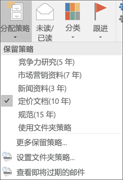
  
<span data-ttu-id="0934e-p120">在标签应用后，可在项顶部查看此标签及其执行的操作。如果电子邮件已分类且有关联的保留期，电子邮件的到期时间便一目了然。</span><span class="sxs-lookup"><span data-stu-id="0934e-p120">After the label is applied, you can view that label and what action it takes at the top of the item. If an email is classified and has an associated retention period, you can know at a glance when the email will expire.</span></span>
  
<span data-ttu-id="0934e-p121">还可将标签应用于文件夹。这在 Outlook​​ 2010 及更高版本和 Outlook 网页版中的情况都一样。请参阅上一部分，了解详细信息。</span><span class="sxs-lookup"><span data-stu-id="0934e-p121">You can also apply labels to folders. This works the same in Outlook 2010 and later as it does in Outlook on the web -- see the previous section for more info.</span></span>
  
### <a name="onedrive-and-sharepoint"></a><span data-ttu-id="0934e-222">OneDrive 和 SharePoint</span><span class="sxs-lookup"><span data-stu-id="0934e-222">OneDrive and SharePoint</span></span>

<span data-ttu-id="0934e-223">若要在 OneDrive 或 SharePoint 中标记文档（包括 OneNote 文件），请依次选择项、右上角的“打开细节窗格”\*\*\*\*、“应用标签”\*\*\*\* 和标签。</span><span class="sxs-lookup"><span data-stu-id="0934e-223">To label a document (including OneNote files) in OneDrive or SharePoint, select the item \> in the upper-right corner, choose **Open the details pane** \> **Apply label** \> choose the label.</span></span> 
  
<span data-ttu-id="0934e-224">请注意，还可将标签应用于文件夹或文档集，并能为文档库设置默认标签。有关详细信息，请参阅下面的部分。</span><span class="sxs-lookup"><span data-stu-id="0934e-224">Note that you can also apply a label to a folder or document set, and you can set a default label for a document library - see the section below for more information.</span></span>
  
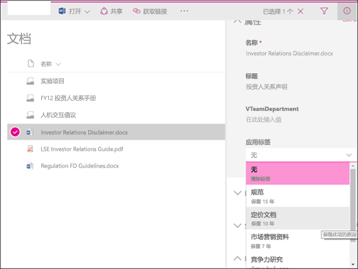
  
<span data-ttu-id="0934e-226">在标签应用于项后，可在选择项后在细节窗格中查看标签。</span><span class="sxs-lookup"><span data-stu-id="0934e-226">After a label is applied to an item, you can view it in the details pane when that item's selected.</span></span>
  
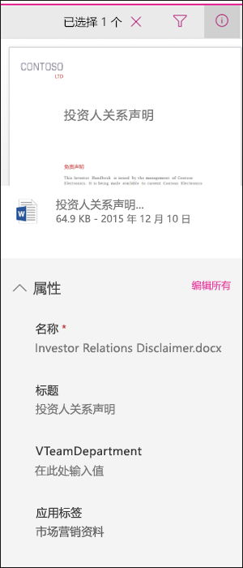
  
<span data-ttu-id="0934e-p122">还可创建包含“标签”\*\*\*\* 列或“项是记录”\*\*\*\* 列的库的视图，这样分配给所有项的标签以及作为记录的项便一目了然。不过，请注意，无法按“项是记录”\*\*\*\* 列筛选视图。</span><span class="sxs-lookup"><span data-stu-id="0934e-p122">You can also create a view of the library that contains the **Labels** column or **Item is a Record** column, so that you can see at a glance the labels assigned to all items and which items are records. Note, however, that you can't filter the view by the **Item is a Record** column.</span></span> 
  
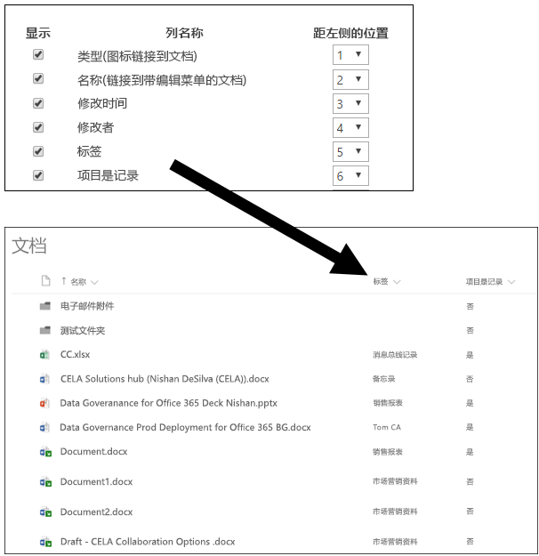
  
### <a name="office-365-groups"></a><span data-ttu-id="0934e-231">Office 365 组</span><span class="sxs-lookup"><span data-stu-id="0934e-231">Office 365 groups</span></span>

<span data-ttu-id="0934e-p123">发布到 Office 365 组的标签同时显示在 Outlook 网页版的组网站和组邮箱中。将标签应用于内容的过程与上述将标签应用于电子邮件和文档的过程完全相同。</span><span class="sxs-lookup"><span data-stu-id="0934e-p123">When you publish labels to an Office 365 group, the labels appear in both the group site and group mailbox in Outlook on the web. The experience of applying a label to content is identical to that shown above for email and documents.</span></span>
  
## <a name="applying-a-label-automatically-based-on-conditions"></a><span data-ttu-id="0934e-234">根据条件自动应用标签</span><span class="sxs-lookup"><span data-stu-id="0934e-234">Applying a label automatically based on conditions</span></span>

<span data-ttu-id="0934e-p124">标签的最强大功能之一是，能自动应用于符合特定条件的内容。在这种情况下，组织用户无需应用标签，而是由 Office 365 代劳。</span><span class="sxs-lookup"><span data-stu-id="0934e-p124">One of the most powerful features of labels is the ability to apply them automatically to content that matches certain conditions. In this case, people in your organization don't need to apply the labels - Office 365 does the work for them.</span></span>
  
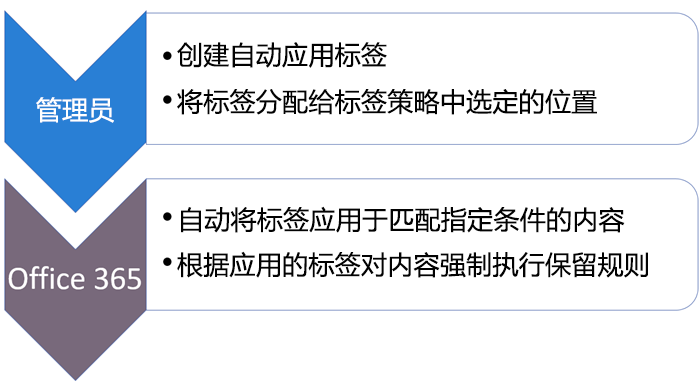
  
<span data-ttu-id="0934e-238">自动应用标签的功能非常强大，这是因为：</span><span class="sxs-lookup"><span data-stu-id="0934e-238">Auto-apply labels are powerful because:</span></span>
  
- <span data-ttu-id="0934e-239">无需为用户提供有关所有分类的培训。</span><span class="sxs-lookup"><span data-stu-id="0934e-239">You don't need to train your users on all of your classifications.</span></span>
    
- <span data-ttu-id="0934e-240">无需依赖用户，即可对全部内容进行正确分类。</span><span class="sxs-lookup"><span data-stu-id="0934e-240">You don't need to rely on users to classify all content correctly.</span></span>
    
- <span data-ttu-id="0934e-241">用户不再需要了解数据管理策略，反而可以专注于自己的工作。</span><span class="sxs-lookup"><span data-stu-id="0934e-241">Users no longer need to know about data governance policies - they can focus on their work.</span></span>
    
<span data-ttu-id="0934e-242">可选择将标签自动应用于包含以下各项的内容：</span><span class="sxs-lookup"><span data-stu-id="0934e-242">You can choose to apply labels to content automatically when that content contains:</span></span>
  
- <span data-ttu-id="0934e-243">特定类型敏感信息。</span><span class="sxs-lookup"><span data-stu-id="0934e-243">Specific types of sensitive information.</span></span>
    
- <span data-ttu-id="0934e-244">与所创建的查询匹配的特定关键字。</span><span class="sxs-lookup"><span data-stu-id="0934e-244">Specific keywords that match a query you create.</span></span>
    
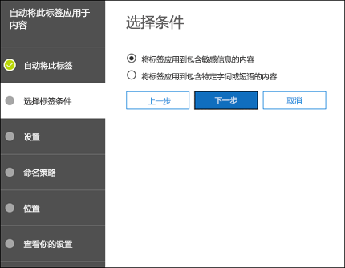
  
<span data-ttu-id="0934e-246">请注意，自动应用标签需要 Office 365 企业版 E5 订阅，最长可能需要 7 天，才能将自动应用标签应用于符合条件的所有内容（如上所述）。</span><span class="sxs-lookup"><span data-stu-id="0934e-246">Note that auto-apply labels require an Office 365 Enterprise E5 subscription, and that it can take up to seven days for auto-apply labels to be applied to all content that matches the conditions, as described above.</span></span>
  
### <a name="auto-apply-labels-to-content-with-specific-types-of-sensitive-information"></a><span data-ttu-id="0934e-247">将标签自动应用于包含特定类型敏感信息的内容</span><span class="sxs-lookup"><span data-stu-id="0934e-247">Auto-apply labels to content with specific types of sensitive information</span></span>

<span data-ttu-id="0934e-p125">创建敏感信息的自动应用标签时，可以看到在创建数据丢失防护 (DLP) 策略时显示的策略模板列表。所有策略模板都被预配置为查找特定类型敏感信息。例如，下面显示的模板查找美国 ITIN、SSN 和护照号。若要详细了解 DLP，请参阅[数据丢失防护策略概述](data-loss-prevention-policies.md)。</span><span class="sxs-lookup"><span data-stu-id="0934e-p125">When you create auto-apply labels for sensitive information, you see the same list of policy templates as when you create a data loss prevention (DLP) policy. Each policy template is preconfigured to look for specific types of sensitive information - for example, the template shown here looks for U.S. ITIN, SSN, and passport numbers. To learn more about DLP, see [Overview of data loss prevention policies](data-loss-prevention-policies.md).</span></span>
  
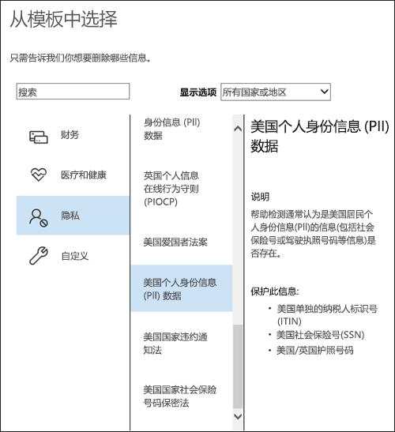
  
<span data-ttu-id="0934e-p126">选择策略模板后，既可以添加或删除任意类型敏感信息，也可以更改实例计数和匹配准确度。在下面的示例中，标签仅在以下情况下自动应用：</span><span class="sxs-lookup"><span data-stu-id="0934e-p126">After you select a policy template, you can add or remove any types of sensitive information, and you can change the instance count and match accuracy. In the example shown here, a label will be auto-applied only when:</span></span>
  
- <span data-ttu-id="0934e-p127">内容包含的这三种类型敏感信息的实例数介于 1 和 9 个之间。可删除“最大”\*\*\*\* 值，这样就会变为“任意”\*\*\*\*。</span><span class="sxs-lookup"><span data-stu-id="0934e-p127">The content contains between 1 and 9 instances of any of these three sensitive information types. You can delete the **max** value so that it changes to **any**.</span></span>
    
- <span data-ttu-id="0934e-p128">检测到的敏感信息类型的匹配准确度（或可信度）至少为 75。许多敏感信息类型都是通过多个模式进行定义，其中模式的匹配准确度越高，需要发现的证据（如关键字、日期或地址）就越多，而模式的匹配准确度越低，需要发现的证据就越少。简而言之，“最小”\*\*\*\* 匹配准确度越低，内容就越容易与条件匹配。</span><span class="sxs-lookup"><span data-stu-id="0934e-p128">The type of sensitive information that's detected has a match accuracy (or confidence level) of at least 75. Many sensitive information types are defined with multiple patterns, where a pattern with a higher match accuracy requires more evidence to be found (such as keywords, dates, or addresses), while a pattern with a lower match accuracy requires less evidence. Simply put, the lower the **min** match accuracy, the easier it is for content to match the condition.</span></span> 
    
    <span data-ttu-id="0934e-259">若要更改匹配准确度（或可信度），应使用相应敏感信息类型的模式中所用的可信度之一，如[敏感信息类型查找什么](what-the-sensitive-information-types-look-for.md)中所定义。</span><span class="sxs-lookup"><span data-stu-id="0934e-259">If you change the match accuracy (or confidence level), you should use one of confidence levels used in a pattern for that type of sensitive information, as defined in [What the sensitive information types look for](what-the-sensitive-information-types-look-for.md).</span></span>
    
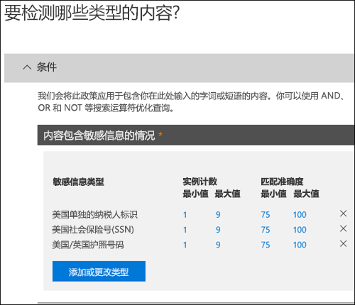
  
### <a name="auto-apply-labels-to-content-with-keywords"></a><span data-ttu-id="0934e-261">将标签自动应用于包含关键字的内容</span><span class="sxs-lookup"><span data-stu-id="0934e-261">Auto-apply labels to content with specific keywords</span></span>

<span data-ttu-id="0934e-p129">可将标签自动应用于满足特定条件的内容。目前可用的条件支持将标签应用于包含特定字词或短语的内容。可使用搜索运算符（如 AND、OR 和 NOT）优化查询。</span><span class="sxs-lookup"><span data-stu-id="0934e-p129">You can auto-apply labels to content that satisfies certain conditions. The conditions now available support applying a label to content that contains specific words, phrases, or values of searchable properties. You can refine your query by using search operators like AND, OR, and NOT.</span></span> 

<span data-ttu-id="0934e-265">有关查询语法的详细信息，请参阅：</span><span class="sxs-lookup"><span data-stu-id="0934e-265">For more information on query syntax, see:</span></span>

- [<span data-ttu-id="0934e-266">关键字查询语言 (KQL) 语法参考</span><span class="sxs-lookup"><span data-stu-id="0934e-266">Keyword Query Language (KQL) syntax reference</span></span>](https://docs.microsoft.com/zh-CN/sharepoint/dev/general-development/keyword-query-language-kql-syntax-reference)

<span data-ttu-id="0934e-267">基于查询的标签使用搜索索引来标识内容。</span><span class="sxs-lookup"><span data-stu-id="0934e-267">Note that query-based labels use the search index to identify content.</span></span>
  
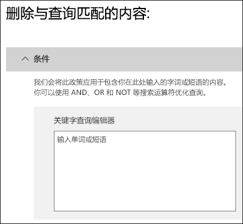
  
## <a name="applying-a-default-label-to-all-content-in-a-sharepoint-library-folder-or-document-set"></a><span data-ttu-id="0934e-269">将默认标签应用于 SharePoint 库、文件夹或文档集中的所有内容</span><span class="sxs-lookup"><span data-stu-id="0934e-269">Applying a default label to all content in a SharePoint library, folder, or document set</span></span>

<span data-ttu-id="0934e-270">除了能让用户将标签应用于各个文档之外，还能将默认标签应用于 SharePoint 库、文件夹或文档集，这样这些位置上的所有文档都会获得默认标签。</span><span class="sxs-lookup"><span data-stu-id="0934e-270">In addition to enabling people to apply a label to individual documents, you can also apply a default label to a SharePoint library, folder, or document set, so that all documents in that location get the default label.</span></span>
  
<span data-ttu-id="0934e-p130">对于文档库，此操作是在文档库的“设置”\*\*\*\* 页上完成。选择默认标签时，还可以选择将它应用于库中的任何现有项。</span><span class="sxs-lookup"><span data-stu-id="0934e-p130">For a document library, this is done on the **Library settings** page for a document library. When you choose the default label, you can also choose to apply it to any existing items in the library.</span></span> 
  
<span data-ttu-id="0934e-273">例如，若有“营销材料”标记，并且确定特定文档库仅包含这种类型内容，可将“营销材料”标记设置为此库中所有文档的默认标签。</span><span class="sxs-lookup"><span data-stu-id="0934e-273">For example, if you have a tag for marketing materials, and you know a specific document library will contain only that type of content, you can make the Marketing Materials tag the default for all documents in that library.</span></span>
  
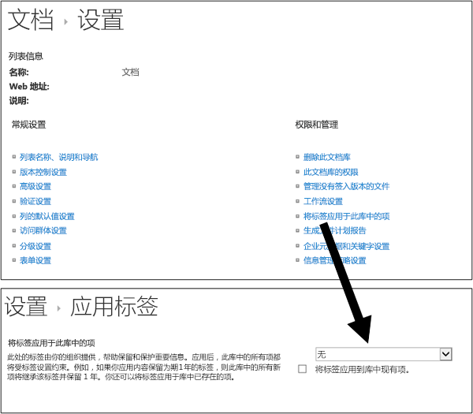
  
<span data-ttu-id="0934e-275">如果将默认标签应用于库、文件夹或文档集中的现有项：</span><span class="sxs-lookup"><span data-stu-id="0934e-275">If you apply a default label to existing items in the library, folder, or document set:</span></span>
  
- <span data-ttu-id="0934e-p131">库、文件夹或文档集中的所有项都会自动获得相同的标签，已向其显式应用标签的项**除外**。显式标记的项保留现有标签。有关详细信息，请参阅下面的[保留原则或优先级](labels.md#principles)部分。</span><span class="sxs-lookup"><span data-stu-id="0934e-p131">All items in the library, folder, or document set automatically get the same label, **except** for items that have had a label applied explicitly to them. Explicitly labeled items keep their existing label. For more information, see the below section on [The principles of retention, or what takes precedence?](labels.md#principles).</span></span>
    
- <span data-ttu-id="0934e-279">如果你更改或删除库、文件夹或文档集的默认标签，库、文件夹或文档集中所有项的标签都会随之更改或删除，具有显式标签的项**除外**。</span><span class="sxs-lookup"><span data-stu-id="0934e-279">If you change or remove the default label for a library, folder, or document set, the label's also changed or removed for all items in the library, folder, or document set, **except** items with explicit labels.</span></span> 
    
- <span data-ttu-id="0934e-280">如果你将具有默认标签的项从一个库、文件夹或文档集移至另一个库、文件夹或文档集，此项会保留现有默认标签，即使新位置的默认标签不同，也不例外。</span><span class="sxs-lookup"><span data-stu-id="0934e-280">If you move an item with a default label from one library, folder, or document set to another library, folder, or document set, the item keeps its existing default label, even if the new location has a different default label.</span></span>
    
## <a name="applying-a-label-to-email-by-using-rules"></a><span data-ttu-id="0934e-281">使用规则将标签应用于电子邮件</span><span class="sxs-lookup"><span data-stu-id="0934e-281">Applying a label to email by using rules</span></span>

<span data-ttu-id="0934e-282">在 Outlook 2010 或更高版本中，可创建用于应用标签或保留策略的规则。</span><span class="sxs-lookup"><span data-stu-id="0934e-282">In Outlook 2010 or later, you can create rules to apply a label or retention policy.</span></span>
  
<span data-ttu-id="0934e-283">例如，可创建一条规则，将特定标签应用于发送到/发送自特定通讯组的所有邮件。</span><span class="sxs-lookup"><span data-stu-id="0934e-283">For example, you can create a rule that applies a specific label to all messages sent to or from a specific distribution group.</span></span>
  
<span data-ttu-id="0934e-284">若要创建规则，请右键单击项，依次单击“规则”\*\*\*\*、“创建规则”\*\*\*\*、“高级选项”\*\*\*\* 和“规则向导”\*\*\*\*，再选中“应用保留策略”\*\*\*\*。</span><span class="sxs-lookup"><span data-stu-id="0934e-284">To create a rule, right-click an item \> **Rules** \> **Create Rule** \> **Advanced Options** \> **Rules Wizard** \> **apply retention policy**.</span></span>
  
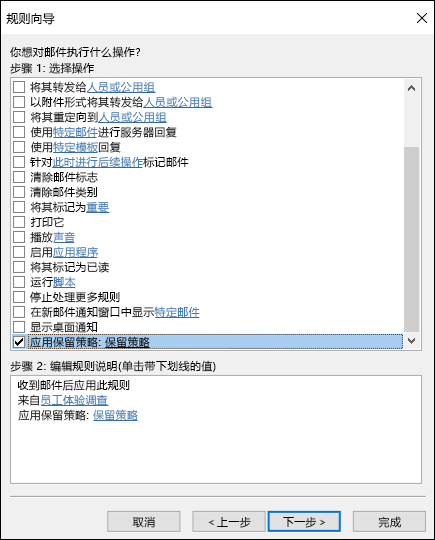
  
## <a name="classifying-content-without-applying-any-actions"></a><span data-ttu-id="0934e-286">对内容分类但不执行任何操作</span><span class="sxs-lookup"><span data-stu-id="0934e-286">Classifying content without applying any actions</span></span>

<span data-ttu-id="0934e-p132">创建标签时，可以不启用保留操作或其他任何操作，如下所示。在这种情况下，可以将标签仅用作文本标签，而不强制执行任何操作。</span><span class="sxs-lookup"><span data-stu-id="0934e-p132">When you create a label, you can do so without turning on any retention or other actions, as shown below. In this case, you can use a label simply as a text label, without enforcing any actions.</span></span>
  
<span data-ttu-id="0934e-289">例如，可创建不含任何操作的“稍后审阅”标签，再将此标签自动应用于包含敏感信息类型的内容或已查询内容。</span><span class="sxs-lookup"><span data-stu-id="0934e-289">For example, you can create a label named "Review later" with no actions, and then auto-apply that label to content with sensitive information types or queried content.</span></span>
  

  
## <a name="using-labels-for-records-management"></a><span data-ttu-id="0934e-291">使用标签实现记录管理</span><span class="sxs-lookup"><span data-stu-id="0934e-291">Using labels for records management</span></span>

<span data-ttu-id="0934e-292">记录管理的大概含义是：</span><span class="sxs-lookup"><span data-stu-id="0934e-292">At a high level, records management means that:</span></span>
  
- <span data-ttu-id="0934e-293">用户将重要内容分类为记录。</span><span class="sxs-lookup"><span data-stu-id="0934e-293">Important content is classified as a record by users.</span></span>
    
- <span data-ttu-id="0934e-294">无法修改或删除记录。</span><span class="sxs-lookup"><span data-stu-id="0934e-294">A record can't be modified or deleted.</span></span>
    
- <span data-ttu-id="0934e-295">记录最终在声明的生存期结束后被处置。</span><span class="sxs-lookup"><span data-stu-id="0934e-295">Records are finally disposed of after their stated lifetime is past.</span></span>
    
<span data-ttu-id="0934e-p133">可使用标签在 Office 365 中一致实现一种记录管理策略，而其他记录管理功能（如记录中心）仅适用于 SharePoint 内容。此外，还可以对记录强制执行保留操作，这样记录就会在生命周期结束时自动被处置。</span><span class="sxs-lookup"><span data-stu-id="0934e-p133">You can use labels to implement a single, consistent records-management strategy across Office 365, whereas other records-management features such as the Record Center apply only to SharePoint content. And you can enforce retention actions on records, so that they're disposed of automatically at the end of their lifecycle.</span></span>
  
<span data-ttu-id="0934e-298">创建标签时，可视需要使用标签将内容分类为记录。</span><span class="sxs-lookup"><span data-stu-id="0934e-298">When you create a label, you have the option to use the label to classify the content as a record.</span></span>
  
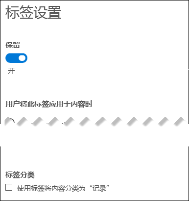
  
<span data-ttu-id="0934e-300">将项标记为记录后，需要遵循以下四项限制：</span><span class="sxs-lookup"><span data-stu-id="0934e-300">When an item is labeled as a record, four things happen:</span></span>
  
- <span data-ttu-id="0934e-301">无法永久删除项。</span><span class="sxs-lookup"><span data-stu-id="0934e-301">The item can't be permanently deleted.</span></span>
    
- <span data-ttu-id="0934e-302">无法编辑项。</span><span class="sxs-lookup"><span data-stu-id="0934e-302">The item can't be edited.</span></span>
    
- <span data-ttu-id="0934e-303">无法更改标签。</span><span class="sxs-lookup"><span data-stu-id="0934e-303">The label can't be changed.</span></span>
    
- <span data-ttu-id="0934e-304">无法删除标签。</span><span class="sxs-lookup"><span data-stu-id="0934e-304">The label can't be removed.</span></span>
    
### <a name="who-can-classify-content-as-a-record"></a><span data-ttu-id="0934e-305">谁能将内容分类为记录</span><span class="sxs-lookup"><span data-stu-id="0934e-305">Who can classify content as a record</span></span>

<span data-ttu-id="0934e-p134">对于 SharePoint 内容，默认成员组（拥有参与权限级别）中的任何用户可将记录标签应用于内容。只有网站集管理员才能删除或更改已应用的记录标签。另外，还必须手动应用将内容分类为记录的标签，此标签无法自动应用。</span><span class="sxs-lookup"><span data-stu-id="0934e-p134">For SharePoint content, any user in the default Members group (the Contribute permission level) can apply a record label to content. Only the site collection administrator can remove or change that label after it's been applied. In addition, a label that classifies content as a record needs to be applied manually; it can't be auto-applied.</span></span>
  
### <a name="records-and-folders"></a><span data-ttu-id="0934e-309">记录和文件夹</span><span class="sxs-lookup"><span data-stu-id="0934e-309">Records and folders</span></span>

<span data-ttu-id="0934e-p135">可将标签应用于 Exchange、SharePoint 或 OneDrive 中的文件夹。如果文件夹被标记为记录，那么移至此文件夹中的项也会被标记为记录。从此文件夹中移出的项会继续被标记为记录。</span><span class="sxs-lookup"><span data-stu-id="0934e-p135">You can apply a label to a folder in Exchange, SharePoint, or OneDrive. If a folder is labeled as a record, and you move an item into the folder, the item is labeled as a record. When you move the item out of the folder, the item will continue to be labeled as a record.</span></span>
  
### <a name="records-cant-be-deleted"></a><span data-ttu-id="0934e-313">记录无法删除</span><span class="sxs-lookup"><span data-stu-id="0934e-313">Records can't be deleted</span></span>

<span data-ttu-id="0934e-314">如果你尝试删除 Exchange 中的记录，相应项会移至“可恢复项”文件夹中，如[保留策略如何处理留在原处的内容](retention-policies.md#how-a-retention-policy-works-with-content-in-place)中所述。</span><span class="sxs-lookup"><span data-stu-id="0934e-314">If you attempt to delete a record in Exchange, the item is moved to the Recoverable Items folder as described in [How a retention policy works with content in place](retention-policies.md#how-a-retention-policy-works-with-content-in-place).</span></span>
  
<span data-ttu-id="0934e-315">如果尝试删除 SharePoint 中的记录，便会看到错误，提醒你注意项未删除，仍留在库中。</span><span class="sxs-lookup"><span data-stu-id="0934e-315">If you attempt to delete a record in a SharePoint, you see an error that the item wasn't deleted, and the item remains in the library.</span></span>
  
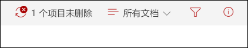
  
<span data-ttu-id="0934e-317">如果你尝试删除 OneDrive 中的记录，相应项会移至演示文稿保留库中，如[保留策略如何处理留在原处的内容](retention-policies.md#how-a-retention-policy-works-with-content-in-place)中所述。</span><span class="sxs-lookup"><span data-stu-id="0934e-317">If you attempt to delete a record in OneDrive, the item is moved to the Preservation Hold library as described in [How a retention policy works with content in place](retention-policies.md#how-a-retention-policy-works-with-content-in-place).</span></span>
  
## <a name="using-a-label-as-a-condition-in-a-dlp-policy"></a><span data-ttu-id="0934e-318">将标签用作 DLP 策略中的条件</span><span class="sxs-lookup"><span data-stu-id="0934e-318">Using a label as a condition in a DLP policy</span></span>

<span data-ttu-id="0934e-p136">标签可对内容强制执行**保留**操作。此外，还可以将标签用作数据丢失防护 (DLP) 策略中的条件。也就是说，DLP 策略可对包含特定标签的内容强制执行**保护**操作（如限制访问）。</span><span class="sxs-lookup"><span data-stu-id="0934e-p136">A label can enforce **retention** actions on content. In addition, you can use a label as a condition in a data loss prevention (DLP) policy. This means that a DLP policy can enforce **protection** actions, such as restricting access, on content that contains a specific label.</span></span> 
  
<span data-ttu-id="0934e-322">有关详细信息，请参阅[将标签用作 DLP 策略中的条件](data-loss-prevention-policies.md#using-a-label-as-a-condition-in-a-dlp-policy)。</span><span class="sxs-lookup"><span data-stu-id="0934e-322">For more information, see [Using a label as a condition in a DLP policy](data-loss-prevention-policies.md#using-a-label-as-a-condition-in-a-dlp-policy).</span></span>
  
## <a name="using-the-label-activity-explorer-and-the-data-governance-reports"></a><span data-ttu-id="0934e-323">使用标签活动资源管理器和数据管理报告</span><span class="sxs-lookup"><span data-stu-id="0934e-323">Using the Label Activity Explorer and the data governance reports</span></span>

<span data-ttu-id="0934e-p137">发布或自动应用标签后，需要验证标签是否已按预期应用于内容。若要监视标签，可使用：</span><span class="sxs-lookup"><span data-stu-id="0934e-p137">After you publish or auto-apply your labels, you'll want to verify that they're being applied to content as you intended. To monitor your labels, you can use the:</span></span>
  
- <span data-ttu-id="0934e-p138">**标签活动资源管理器**。使用此资源管理器（如下所示），可快速搜索和查看过去 30 天内 SharePoint 和 OneDrive for Business 中所有内容的标签活动。有关详细信息，请参阅[查看文档的标签活动](view-label-activity-for-documents.md)。</span><span class="sxs-lookup"><span data-stu-id="0934e-p138">**Label Activity Explorer**. With the explorer (shown below), you can quickly search and view label activity for all content across SharePoint and OneDrive for Business over the past 30 days. For more information, see [View label activity for documents](view-label-activity-for-documents.md).</span></span>
    
- <span data-ttu-id="0934e-p139">**数据管理报告**。使用这些报告，可快速查看过去 90 天内 Exchange、SharePoint 和 OneDrive for Business 中所有内容的标签趋势和活动。有关详细信息，请参阅[查看数据管理报告](view-the-data-governance-reports.md)。</span><span class="sxs-lookup"><span data-stu-id="0934e-p139">**Data governance reports**. With these reports, you can quickly view label trends and activity for all content across Exchange, SharePoint, and OneDrive for Business over the past 90 days. For more information, see [View the data governance reports](view-the-data-governance-reports.md).</span></span>
    
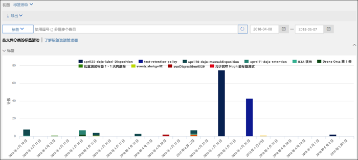
  
## <a name="using-content-search-to-find-all-content-with-a-specific-label-applied-to-it"></a><span data-ttu-id="0934e-333">使用内容搜索来查找所有已应用有特定标签的内容</span><span class="sxs-lookup"><span data-stu-id="0934e-333">Using Content Search to find all content with a specific label applied to it</span></span>

<span data-ttu-id="0934e-334">在标签分配到内容后（无论是用户分配还是自动应用），可使用安全与合规中心内的内容搜索，查找所有已使用特定标签进行分类的内容。</span><span class="sxs-lookup"><span data-stu-id="0934e-334">After labels are assigned to content, either by users or auto-applied, you can use content search in the Security &amp; Compliance Center to find all content that's classified with a specific label.</span></span>
  
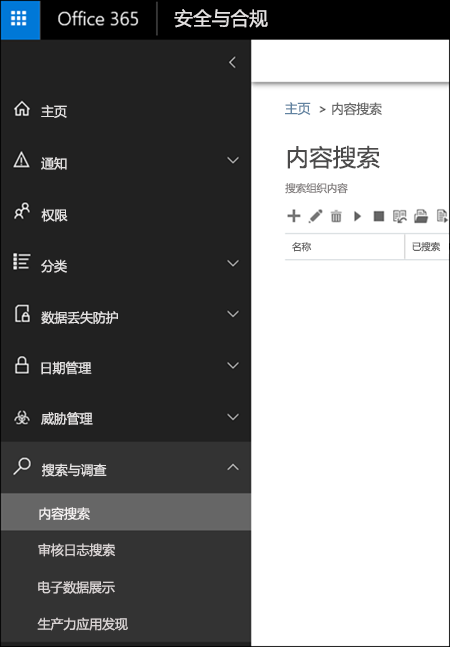
  
<span data-ttu-id="0934e-p140">创建内容搜索时，请选择“合规性标记”\*\*\*\* 条件，再输入完整或部分标签名称，并使用通配符。有关详细信息，请参阅[适用于内容搜索的关键字查询和搜索条件](keyword-queries-and-search-conditions.md)。</span><span class="sxs-lookup"><span data-stu-id="0934e-p140">When you create a content search, choose the **Compliance Tag** condition, and then enter the complete label name or part of the label name and use a wildcard. For more information, see [Keyword queries and search conditions for Content Search](keyword-queries-and-search-conditions.md).</span></span>
  
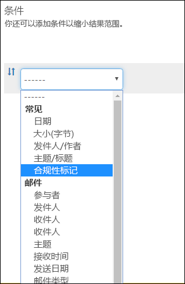
  
## <a name="the-principles-of-retention-or-what-takes-precedence"></a><span data-ttu-id="0934e-339">保留原则或优先级</span><span class="sxs-lookup"><span data-stu-id="0934e-339">The principles of retention, or what takes precedence?</span></span>

<span data-ttu-id="0934e-p141">内容可能或甚至很有可能有多个应用的保留策略，每个策略的操作（保留、删除或先保留再删除）和保留期都不同。优先级是什么？最高优先级是，一个策略保留的内容一定不得被另一个策略永久删除。</span><span class="sxs-lookup"><span data-stu-id="0934e-p141">It's possible or even likely that content might have several retention policies applied to it, each with a different action (retain, delete, or both) and retention period. What takes precedence? At the highest level, rest assured that content being retained by one policy can't be permanently deleted by another policy.</span></span>
  

  
<span data-ttu-id="0934e-344">若要了解包含保留操作的不同标签是如何应用于内容的，请注意下面这些保留原则：</span><span class="sxs-lookup"><span data-stu-id="0934e-344">To understand how different labels with retention actions are applied to content, keep these principles of retention in mind:</span></span>
  
1. <span data-ttu-id="0934e-p142">**保留优先于删除。** 假设一个保留策略要删除年限超过 3 年的 Exchange 电子邮件，而另一个保留策略则要将 Exchange 电子邮件先保留 5 年再删除。任何年限达到 3 年的内容都会被删除，并隐藏起来对用户不可见，但仍保留在“可恢复项”文件夹中，直到年限达到 5 年，内容才会被永久删除。</span><span class="sxs-lookup"><span data-stu-id="0934e-p142">**Retention wins over deletion.** Suppose that one retention policy says to delete Exchange email after three years, but another retention policy says to retain Exchange email for five years and then delete it. Any content that reaches three years old will be deleted and hidden from the users' view, but still retained in the Recoverable Items folder until the content reaches five years old, when it will be permanently deleted.</span></span> 
    
2. <span data-ttu-id="0934e-p143">**最长保留期优先。** 如果内容受多个内容保留策略约束，它会一直保留到最长保留期到期。</span><span class="sxs-lookup"><span data-stu-id="0934e-p143">**The longest retention period wins.** If content's subject to multiple policies that retain content, it will be retained until the end of the longest retention period.</span></span> 
    
3. <span data-ttu-id="0934e-p144">**显式添加的位置优先于隐式添加的位置。** 这意味着：</span><span class="sxs-lookup"><span data-stu-id="0934e-p144">**Explicit inclusion wins over implicit inclusion.** This means:</span></span> 
    
    1. <span data-ttu-id="0934e-p145">如果标签包含保留设置且是由用户手动分配给项（如 Exchange 电子邮件或 OneDrive 文档），此标签优先于在网站或邮箱一级分配的策略和由文档库分配的默认标签。例如，如果显式标签要保留内容 10 年，而分配给网站的策略只要保留内容 5 年，那么标签优先。请注意，自动应用标签被视为隐式标签，而不是显式标签，因为它们是由 Office 365 自动应用。</span><span class="sxs-lookup"><span data-stu-id="0934e-p145">If a label with retention settings is manually assigned by a user to an item, such as an Exchange email or OneDrive document, that label takes precedence over both a policy assigned at the site or mailbox level and a default label assigned by the document library. For example, if the explicit label says to retain for ten years, but the policy assigned to the site says to retain for only five years, the label takes precedence. Note that auto-apply labels are considered implicit, not explicit, because they're applied automatically by Office 365.</span></span>
    
    2. <span data-ttu-id="0934e-355">如果保留策略包含特定位置（如特定用户的邮箱或 OneDrive for Business 帐户），此策略优先于应用于所有用户邮箱或 OneDrive for Business 帐户（而不是包含具体用户邮箱）的其他保留策略。</span><span class="sxs-lookup"><span data-stu-id="0934e-355">If a retention policy includes a specific location, such as a specific user's mailbox or OneDrive for Business account, that policy takes precedence over another retention policy that applies to all users' mailboxes or OneDrive for Business accounts but doesn't specifically include that user's mailbox.</span></span>
    
4. <span data-ttu-id="0934e-p146">**最短删除期优先。** 同样，如果内容受多个内容删除策略约束（无保留），它将在最短保留期到期时被删除。</span><span class="sxs-lookup"><span data-stu-id="0934e-p146">**The shortest deletion period wins.** Similarly, if content's subject to multiple policies that delete content (with no retention), it will be deleted at the end of the shortest retention period.</span></span> 
    
<span data-ttu-id="0934e-358">请注意，保留原则就像是自上而下打破平局的流：如果所有策略或标签应用的规则在一个级别上是相同的，流就会向下移至下一个级别，以确定优先应用哪个规则。</span><span class="sxs-lookup"><span data-stu-id="0934e-358">Understand that the principles of retention work as a tie-breaking flow from top to bottom: If the rules applied by all policies or labels are the same at one level, the flow moves down to the next level to determine precedence for which rule is applied.</span></span>
  
<span data-ttu-id="0934e-p147">最后，保留策略或标签无法永久删除任何保留用于电子数据展示的内容。在此类保留释放后，内容便再次符合上文所述清理流程的条件。</span><span class="sxs-lookup"><span data-stu-id="0934e-p147">Finally, a retention policy or label cannot permanently delete any content that's on hold for eDiscovery. When the hold is released, the content again becomes eligible for the cleanup process described above.</span></span>
  
## <a name="use-labels-instead-of-these-features"></a><span data-ttu-id="0934e-361">使用标签代替类似功能</span><span class="sxs-lookup"><span data-stu-id="0934e-361">Use labels instead of these features</span></span>

<span data-ttu-id="0934e-p148">可将标签轻松应用于整个组织及其在 Office 365（包括 Exchange、SharePoint、OneDrive 和 Office 365 组）中的内容。建议使用标签在 Office 365 中的任意位置上对内容分类或管理记录。</span><span class="sxs-lookup"><span data-stu-id="0934e-p148">Labels can easily be made available to an entire organization and its content across Office 365, including Exchange, SharePoint, OneDrive, and Office 365 groups. If you need to classify content or manage records anywhere in Office 365, we recommend that you use labels.</span></span>
  
<span data-ttu-id="0934e-p149">之前还有其他几项功能用于在 Office 365 中对内容分类或管理记录。下面列出了这些功能。这些功能可继续与在安全与合规中心内创建的标签配合使用。请注意，尽管有时实现标签不同于过去的功能，但标签的演变会推动未来 Office 365 中的记录管理。因此，我们建议今后使用标签（而不是任何这些功能）来治理数据。</span><span class="sxs-lookup"><span data-stu-id="0934e-p149">There are several other features that have previously been used to classify content or manage records in Office 365. These are listed below. These features will continue to work side by side with labels created in the Security &amp; Compliance Center. Note that while there are instances where the implementation of labels differs from previous features, the evolution of labels will drive the future of records management across Office 365. Therefore, moving forward, for data governance, we recommend that you use labels instead of these features.</span></span>
  
### <a name="exchange-online"></a><span data-ttu-id="0934e-369">Exchange Online</span><span class="sxs-lookup"><span data-stu-id="0934e-369">Exchange Online</span></span>

- <span data-ttu-id="0934e-370">[保留标记和保留策略](https://go.microsoft.com/fwlink/?linkid=846125)，亦称为[邮件传递记录管理 (MRM)](https://go.microsoft.com/fwlink/?linkid=846126)（仅限删除）</span><span class="sxs-lookup"><span data-stu-id="0934e-370">[Retention tags and retention policies](https://go.microsoft.com/fwlink/?linkid=846125), also known as [messaging records management (MRM)](https://go.microsoft.com/fwlink/?linkid=846126) (Deletion only)</span></span> 
    
### <a name="sharepoint-online-and-onedrive-for-business"></a><span data-ttu-id="0934e-371">SharePoint Online 和 OneDrive for Business</span><span class="sxs-lookup"><span data-stu-id="0934e-371">SharePoint Online and OneDrive for Business</span></span>

- <span data-ttu-id="0934e-372">[配置就地记录管理](https://support.office.com/article/7707a878-780c-4be6-9cb0-9718ecde050a)（保留）</span><span class="sxs-lookup"><span data-stu-id="0934e-372">[Configuring in place records management](https://support.office.com/article/7707a878-780c-4be6-9cb0-9718ecde050a) (Retention)</span></span> 
    
- <span data-ttu-id="0934e-373">[记录中心简介](https://support.office.com/article/bae6ca5a-7b19-40e0-b433-e3613a747c2c)（保留）</span><span class="sxs-lookup"><span data-stu-id="0934e-373">[Introduction to the Records Center](https://support.office.com/article/bae6ca5a-7b19-40e0-b433-e3613a747c2c) (Retention)</span></span> 
    
- <span data-ttu-id="0934e-374">[信息管理策略](intro-to-info-mgmt-policies.md)（仅限删除）</span><span class="sxs-lookup"><span data-stu-id="0934e-374">[Information management policies](intro-to-info-mgmt-policies.md) (Deletion only)</span></span> 
    
## <a name="permissions"></a><span data-ttu-id="0934e-375">权限</span><span class="sxs-lookup"><span data-stu-id="0934e-375">Permissions</span></span>

<span data-ttu-id="0934e-p150">负责创建标签的合规性团队成员必须有权访问安全与合规中心。默认情况下，租户管理员有权访问此位置，并可向合规部主管及其他人员授予对安全与合规中心的访问权限，而不授予租户管理员的所有权限。为此，建议转到安全与合规中心内的“权限”\*\*\*\* 页，编辑“合规性管理员”\*\*\*\* 角色组，再向此角色组添加成员。</span><span class="sxs-lookup"><span data-stu-id="0934e-p150">Members of your compliance team who will create labels need permissions to the Security &amp; Compliance Center. By default, your tenant admin will have access to this location and can give compliance officers and other people access to the Security &amp; Compliance Center, without giving them all of the permissions of a tenant admin. To do this, we recommend that you go to the **Permissions** page of the Security &amp; Compliance Center, edit the **Compliance Administrator** role group, and add members to that role group.</span></span> 
  
<span data-ttu-id="0934e-378">有关详细信息，请参阅[向用户授予对 Office 365 安全与合规中心的访问权限](grant-access-to-the-security-and-compliance-center.md)。</span><span class="sxs-lookup"><span data-stu-id="0934e-378">For more information, see [Give users access to the Office 365 Security &amp; Compliance Center](grant-access-to-the-security-and-compliance-center.md).</span></span>
  
<span data-ttu-id="0934e-p151">只有在创建和应用标签时，才必须拥有这些权限。强制执行策略并不需要访问内容。</span><span class="sxs-lookup"><span data-stu-id="0934e-p151">These permissions are required only to create and apply labels and a label policy. Policy enforcement does not require access to the content.</span></span>
  
## <a name="find-the-powershell-cmdlets-for-labels"></a><span data-ttu-id="0934e-381">查找标签的 PowerShell cmdlet</span><span class="sxs-lookup"><span data-stu-id="0934e-381">Find the PowerShell cmdlets for labels</span></span>

<span data-ttu-id="0934e-382">若要使用标签 cmdlet，你需要：</span><span class="sxs-lookup"><span data-stu-id="0934e-382">To use the label cmdlets, you need to:</span></span>
  
1. [<span data-ttu-id="0934e-383">使用远程 PowerShell 连接到 Office 365 安全与合规中心</span><span class="sxs-lookup"><span data-stu-id="0934e-383">Connect to the Office 365 Security &amp; Compliance Center using remote PowerShell</span></span>](http://go.microsoft.com/fwlink/?LinkID=799771&amp;clcid=0x409)
    
2. <span data-ttu-id="0934e-384">使用这些 [Office 365 安全与合规中心 cmdlet](http://go.microsoft.com/fwlink/?LinkID=799772&amp;clcid=0x409)</span><span class="sxs-lookup"><span data-stu-id="0934e-384">Use these [Office 365 Security &amp; Compliance Center cmdlets](http://go.microsoft.com/fwlink/?LinkID=799772&amp;clcid=0x409)</span></span>
    
## <a name="more-information"></a><span data-ttu-id="0934e-385">更多信息</span><span class="sxs-lookup"><span data-stu-id="0934e-385">More information</span></span>

- [<span data-ttu-id="0934e-386">保留策略概述</span><span class="sxs-lookup"><span data-stu-id="0934e-386">Overview of retention policies</span></span>](retention-policies.md)
    

