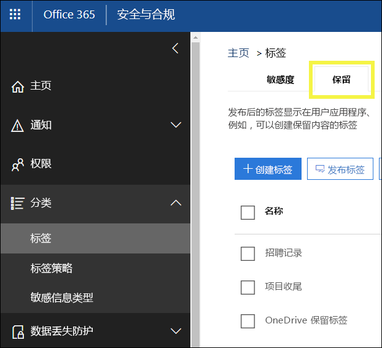

# <a name="overview-of-retention-labels"></a>保留标签概述

整个组织中可能有不同类型的内容。为了遵守行业法规和内部策略，必须采取不同的操作。例如，可能有：
  
- 至少必须**保留**一段时间的纳税申报表格。 
    
- 达到一定年限后必须**永久删除**的新闻材料。 
    
- 必须先**保留**再**永久删除**的竞争性研究。 
    
- 必须**标记为记录**以免被编辑或删除的工作签证。 
    
无论是上述哪种用途，Office 365 中的保留标签都可有助于对正确的内容执行适当的操作。借助保留标签，可对整个组织中的数据进行分类来管理数据，并根据此分类强制执行保留规则。
  
借助保留标签，你可以：
  
- **方便组织内人员手动将保留标签应用于** Outlook 网页版、Outlook 2010 及更高版本、OneDrive、SharePoint 和 Office 365 组中的内容。用户通常最了解自己处理的内容类型，因此可对数据进行分类，并应用适当策略。 
    
- **将保留标签自动应用于**符合特定条件的内容，如内容包含： 
    
  - 特定类型敏感信息。
    
  - 与所创建的查询匹配的特定关键字。
    
    能否将保留标签自动应用于内容非常重要，这是因为：
    
  - 无需为用户提供有关所有分类的培训。
    
  - 无需依赖用户，即可对全部内容进行正确分类。
    
  - 用户不再需要了解数据管理策略，反而可以专注于自己的工作。

  > [!NOTE]
  > 自动应用标签的功能需要为有权在网站或邮箱中编辑已自动标记的内容的每个用户提供一个 Office 365 企业版 E5 许可证。只有只读访问权限的用户不需要许可证。
      
- **将默认保留标签应用于 SharePoint 和 Office 365 组网站中的文档库**，让库中的所有文档都有默认保留标签。 
    
- **在 Office 365 中实现记录管理**，包括电子邮件和文档。可使用保留标签将内容分类为记录。如果这样做，既无法更改或删除保留标签，也无法编辑或删除内容。 
    
保留策略是在 Office 365 安全与合规中心内“标签”**** 页上的“保留”**** 选项卡中进行创建和管理。 
  

 
## <a name="how-retention-labels-work-with-label-policies"></a>如何结合使用保留标签和标签策略

为组织内人员提供可用于对内容进行分类的保留标签分为两步：第一步是创建标签，第二步是将标签发布到选定位置。当保留标签发布后，标签策略也会随之创建。
  

  
保留标签是标签策略中的可重用独立构建基块，发布到不同位置。可跨多个策略重用保留标签。标签策略的主要用途是对一系列保留标签进行分组，并指定所需的标签显示位置。
  

  
1. 发布的保留标签被纳入标签策略中。一个保留标签可被纳入多个策略中。
    
2. 标签策略指定保留标签发布位置。
    
## <a name="only-one-retention-label-at-a-time"></a>一次只能分配一个保留标签

请务必了解，电子邮件或文档等内容一次只能分配有一个保留标签：
  
- 对于最终用户手动分配的标签，人员可删除或更改已分配的标签。
    
- 可将内容分配有的自动应用标签替换为，最终用户手动分配的保留标签。
    
- 如果最终用户已手动向内容分配保留标签，无法使用自动应用标签来替换手动分配的保留标签。
    
- 若有多个规则要分配自动应用标签，且内容满足多个规则的条件，那么分配的是年限最长规则的保留标签。
    
手动分配标签是显式分配标签；自动应用标签是隐式分配标签；显式保留标签优先于隐式标签。有关详细信息，请参阅下面的[保留原则或优先级](#the-principles-of-retention-or-what-takes-precedence)部分。

此部分中的所有信息仅适用于保留标签。请注意，除了一个保留标签之外，内容项还可以再应用有一个敏感度标签。
  
## <a name="how-long-it-takes-for-retention-labels-to-take-effect"></a>保留标签需要多长时间才能生效

保留标签在发布或自动应用后不会立即生效：
  
1. 首先，需要将标签策略从安全与合规中心同步到策略中的位置。
    
2. 然后，可能需要等待一段时间，相应位置才支持最终用户分配手动标签，或将标签自动应用于内容。此过程所需的具体时间视标签的位置和类型而定。
    
### <a name="manual-retention-labels"></a>手动保留标签

如果将保留标签发布到 SharePoint 或 OneDrive，可能需要等待 1 天时间，这些保留标签才会向最终用户显示。此外，如果向 Exchange 发布保留标签，可能需要等待 7 天，这些保留标签才会向最终用户显示，并且邮箱至少必须包含 10MB 数据。
  

  
### <a name="auto-apply-retention-labels"></a>自动应用保留标签

如果将保留标签自动应用于符合特定条件的内容，可能需要等待 7 天，才能将保留标签应用于与条件匹配的所有内容。
  

  
### <a name="how-to-check-on-the-status-of-exchange-labels"></a>如何检查 Exchange 标签的状态

在 Exchange Online 中，有一个流程每 7 天运行一次，用于向最终用户提供保留标签。使用 PowerShell，可查看此流程的上次运行时间，从而确定它何时再次运行。
  
1. [连接到 Exchange Online PowerShell](https://go.microsoft.com/fwlink/?linkid=799773)。
    
2. 运行下面这些命令。
    
  ```
  $logProps = Export-MailboxDiagnosticLogs <user> -ExtendedProperties
  ```

  ```
  $xmlprops = [xml]($logProps.MailboxLog)
  ```

  ```
  $xmlprops.Properties.MailboxTable.Property | ? {$_.Name -like "ELC*"}
  ```

在结果中，`ELCLastSuccessTimeStamp` (UTC) 属性显示了系统上次处理邮箱的时间。如果自策略创建起邮箱一直未经处理，标签就不会显示。若要强制处理邮箱，请运行 `Start-ManagedFolderAssistant -Identity <user>`。
    
如果标签没有显示在 Outlook 网页版中，但你认为标签应显示，请务必清除浏览器中的缓存 (Ctrl+F5)。
    
## <a name="label-policies-and-locations"></a>标签策略和位置

不同类型的保留标签可发布到不同位置，具体视保留标签用途而定。
  
|**如果保留标签…**|**可将标签策略应用于…**|
|:-----|:-----|
|发布给最终用户  <br/> |Exchange、SharePoint、OneDrive 和 Office 365 组  <br/> |
|根据敏感信息类型自动应用  <br/> |Exchange（仅全部邮箱）、SharePoint 和 OneDrive  <br/> |
|根据查询自动应用  <br/> |Exchange、SharePoint、OneDrive 和 Office 365 组  <br/> |
   
请注意，在 Exchange 中，自动应用保留标签（根据查询和敏感信息类型自动应用）只应用于新发送的邮件（传输中的数据），而不应用于邮箱中的当前所有项（静态数据）。此外，根据敏感信息类型自动应用的保留标签只能应用于全部邮箱；你无法选择特定邮箱。
  
请注意，Exchange 公用文件夹和 Skype 不支持标签。
  
## <a name="how-retention-labels-enforce-retention"></a>保留标签如何强制执行保留

保留标签可强制执行与保留策略完全一样的所有保留操作。可使用保留标签实现复杂的内容计划（或文件计划）。若要详细了解保留工作原理，请参阅[保留策略概述](retention-policies.md)。
  
此外，保留标签有两个保留选项，这两个选项只能用于保留标签，而不能用于保留策略。借助保留标签，你可以：
  
- 在保留期到期时触发处置评审。这样一来，必须先评审 SharePoint 和 OneDrive 文档，然后才能删除它们。有关详细信息，请参阅[处置评审概述](disposition-reviews.md)。
    
- 保留期从内容分配有标签时开始计算，而不是根据内容年限或上次修改时间计算。
    

  
## <a name="where-published-retention-labels-can-appear-to-end-users"></a>在哪些位置上发布的保留标签可向最终用户显示

如果保留标签将由最终用户分配给内容，可将保留标签发布到：
  
- Outlook 网页版
    
- Outlook 2010 及更高版本
    
- OneDrive
    
- SharePoint
    
- Office 365 组（Outlook 网页版中的组网站和组邮箱）
    
下面各部分介绍了标签如何在不同的应用程序中向组织用户显示。
  
### <a name="outlook-on-the-web"></a>Outlook 网页版

若要在 Outlook 网页版中标记项，请右键单击项，单击“分配策略”****，再选择保留标签。 
  

  
在保留标签应用后，可在项顶部查看此保留标签及其执行的操作。如果电子邮件已分类且有关联的保留期，电子邮件的到期时间便一目了然。
  

  
还可将保留标签应用于文件夹，在这种情况下：
  
- 文件夹中的所有项都会自动获得相同的保留标签，已向其显式应用保留标签的项除外****。显式标记的项保留现有保留标签。有关详细信息，请参阅以下关于保留原则的部分。 
    
- 如果你更改或删除文件夹的默认保留标签，文件夹中所有项的保留标签都会随之更改或删除，具有显式保留标签的项除外****。 
    
- 如果你将具有默认保留标签的项从一个文件夹移至另一个具有不同默认保留标签的文件夹，此项会获得新的默认保留标签。
    
- 如果你将具有默认保留标签的项从一个文件夹移至另一个具有不同默认保留标签的文件夹，旧的默认保留标签会遭删除。
    
### <a name="outlook-2010-and-later"></a>Outlook 2010 及更高版本

若要在 Outlook 网页版中标记项，请右键单击项，单击“功能区”**** 上的“分配策略”****，再选择保留标签。 
  

  
在保留标签应用后，可在项顶部查看此保留标签及其执行的操作。如果电子邮件已分类且有关联的保留期，电子邮件的到期时间便一目了然。
  
还可将保留标签应用于文件夹。这在 Outlook​​ 2010 及更高版本和 Outlook 网页版中的情况都一样。请参阅上一部分，了解详细信息。
  
### <a name="onedrive-and-sharepoint"></a>OneDrive 和 SharePoint

若要在 OneDrive 或 SharePoint 中标记文档（包括 OneNote 文件），请依次选择项、右上角的“打开细节窗格”****、、“应用标签”**** 和保留标签。 
  
请注意，还可将保留标签应用于文件夹或文档集，并能为文档库设置默认保留标签。有关详细信息，请参阅下面的部分。
  

  
在保留标签应用于项后，可在选择项后在细节窗格中查看保留标签。
  

  
还可创建包含“标签”**** 列或“项是记录”**** 列的库的视图，这样分配给所有项的保留标签以及哪些项是记录便一目了然。不过，请注意，无法按“项是记录”**** 列筛选视图。 
  

  
### <a name="office-365-groups"></a>Office 365 组

发布到 Office 365 组的保留标签同时显示在，Outlook 网页版的组网站和组邮箱中。将保留标签应用于内容的过程，与上述将保留标签应用于电子邮件和文档的过程完全相同。

保留 Office 365 组内容需要使用 Office 365 组位置。即使 Office 365 组有 Exchange 邮箱，包含整个 Exchange 位置的保留策略也不会包含 Office 365 组邮箱中的内容。

此外，不可能通过使用 Exchange 位置来包含或排除某个组邮箱。尽管 Exchange 位置最初允许选择组邮箱，但在尝试保存保留策略时，你将收到一条错误消息，表明 RemoteGroupMailbox 不是有效的 Exchange 位置选项。
  
## <a name="applying-a-retention-label-automatically-based-on-conditions"></a>根据条件自动应用保留标签

保留标签的最强大功能之一是，能自动应用于符合特定条件的内容。在这种情况下，组织内人员无需应用保留标签，而是由 Office 365 代劳。
  

  
自动应用保留标签的功能非常强大，这是因为：
  
- 无需为用户提供有关所有分类的培训。
    
- 无需依赖用户，即可对全部内容进行正确分类。
    
- 用户不再需要了解数据管理策略，反而可以专注于自己的工作。
    
可选择将保留标签自动应用于包含以下各项的内容：
  
- 特定类型敏感信息。
    
- 与所创建的查询匹配的特定关键字。
    

  
请注意，自动应用保留标签需要 Office 365 企业版 E5 订阅，最长可能需要 7 天，才能将自动应用保留标签应用于符合条件的所有内容（如上所述）。
  
### <a name="auto-apply-retention-labels-to-content-with-specific-types-of-sensitive-information"></a>将保留标签自动应用于包含特定类型敏感信息的内容

创建敏感信息的自动应用保留标签时，可以看到在创建数据丢失防护 (DLP) 策略时显示的策略模板列表。所有策略模板都被预配置为，查找特定类型敏感信息。例如，下面显示的模板查找美国 ITIN、SSN 和护照号。若要详细了解 DLP，请参阅[数据丢失防护策略概述](data-loss-prevention-policies.md)。
  

  
选择策略模板后，既可以添加或删除任意类型敏感信息，也可以更改实例计数和匹配准确度。在下面的示例中，保留标签仅在以下情况下自动应用：
  
- 内容包含的这三种类型敏感信息的实例数介于 1 和 9 个之间。可删除“最大”**** 值，这样就会变为“任意”****。
    
- 检测到的敏感信息类型的匹配准确度（或可信度）至少为 75。许多敏感信息类型都是通过多个模式进行定义，其中模式的匹配准确度越高，需要发现的证据（如关键字、日期或地址）就越多，而模式的匹配准确度越低，需要发现的证据就越少。简而言之，“最小”**** 匹配准确度越低，内容就越容易与条件匹配。 
    
要详细了解这些选项，请参阅[微调规则以增加或降低匹配的难度](data-loss-prevention-policies.md#tuning-rules-to-make-them-easier-or-harder-to-match)。
    

  
### <a name="auto-apply-labels-to-content-with-keywords-or-searchable-properties"></a>将标签自动应用于包含关键字或可搜索属性的内容

可将标签自动应用于满足特定条件的内容。目前可用的条件支持将标签应用于包含特定字词、短语或可搜索属性值的内容。可使用搜索运算符（如 AND、OR 和 NOT）优化查询。

有关查询语法的详细信息，请参阅：

- [关键字查询语言 (KQL) 语法参考](https://docs.microsoft.com/zh-CN/sharepoint/dev/general-development/keyword-query-language-kql-syntax-reference)

基于查询的标签使用搜索索引来标识内容。有关有效可搜索属性的详细信息，请参阅：

- [内容搜索的关键字查询和搜索条件](keyword-queries-and-search-conditions.md)
- [已爬网和托管属性在 SharePoint Server 中的概述](https://docs.microsoft.com/zh-CN/SharePoint/technical-reference/crawled-and-managed-properties-overview)

示例查询：

- Exchange
    - subject:"Quarterly Financials"
    - recipients:garthf<!--nolink-->@contoso.com
- Sharepoint 和 OneDrive for Business
    - contenttype:contract
    - site:https<!--nolink-->://contoso.sharepoint.com/sites/teams/procurement AND contenttype:contract


## <a name="applying-a-default-retention-label-to-all-content-in-a-sharepoint-library-folder-or-document-set"></a>将默认保留标签应用于 SharePoint 库、文件夹或文档集中的所有内容

除了能让人员将保留标签应用于各个文档之外，还能将默认保留标签应用于 SharePoint 库、文件夹或文档集，这样这些位置上的所有文档都会获得默认保留标签。
  
对于文档库，此操作是在文档库的“设置”**** 页上完成。选择默认保留标签时，还可以选择将它应用于库中的任何现有项。 
  
例如，若有“营销材料”标记，并且确定特定文档库仅包含这种类型内容，可将“营销材料”标记设置为此库中所有文档的默认标签。
  

  
如果将默认保留标签应用于库、文件夹或文档集中的现有项：
  
- 库、文件夹或文档集中的所有项都会自动获得相同的保留标签，已向其显式应用保留标签的项除外****。显式标记的项保留现有标签。有关详细信息，请参阅下面的[保留原则或优先级](#the-principles-of-retention-or-what-takes-precedence)部分。
    
- 如果你更改或删除库、文件夹或文档集的默认保留标签，库、文件夹或文档集中所有项的保留标签都会随之更改或删除，具有显式保留标签的项除外****。 
    
- 如果你将具有默认保留标签的项从一个库、文件夹或文档集移至另一个库、文件夹或文档集，此项会保留现有默认保留标签，即使新位置的默认保留标签不同，也不例外。
    
## <a name="applying-a-retention-label-to-email-by-using-rules"></a>使用规则将保留标签应用于电子邮件

在 Outlook 2010 或更高版本中，可创建用于应用保留标签或保留策略的规则。
  
例如，可创建一条规则，将特定保留标签应用于发送到/发送自特定通讯组的所有邮件。
  
若要创建规则，请右键单击项，依次单击“规则”****、“创建规则”****、“高级选项”**** 和“规则向导”****，再选中“应用保留策略”****。
  

  
## <a name="classifying-content-without-applying-any-actions"></a>对内容分类但不执行任何操作

创建保留标签时，可以不启用保留操作或其他任何操作，如下所示。在这种情况下，可以将保留标签仅用作文本标签，而不强制执行任何操作。
  
例如，可创建不含任何操作的“稍后审阅”保留标签，再将此保留标签自动应用于包含敏感信息类型的内容或已查询内容。
  

  
## <a name="using-retention-labels-for-records-management"></a>使用保留标签实现记录管理

记录管理的大概含义是：
  
- 用户将重要内容分类为记录。
    
- 无法修改或删除记录。
    
- 记录最终在声明的生存期结束后被处置。
    
可使用保留标签在 Office 365 中一致实现一种记录管理策略，而其他记录管理功能（如记录中心）仅适用于 SharePoint 内容。此外，还可以对记录强制执行保留操作，这样记录就会在生命周期结束时自动被处置。
  
创建保留标签时，可视需要使用保留标签将内容分类为记录。
  

  
将项标记为记录后，需要遵循以下四项限制：
  
- 无法永久删除项。
    
- 无法编辑项。
    
- 无法更改标签。
    
- 无法删除标签。
    
### <a name="who-can-classify-content-as-a-record"></a>谁能将内容分类为记录

对于 SharePoint 内容，默认成员组（拥有参与权限级别）中的任何用户都可将记录标签应用于内容。只有网站集管理员才能删除或更改已应用的保留标签。另外，还必须手动应用将内容分类为记录的保留标签，此标签无法[自动应用到应用](#auto-apply-retention-labels)。
  
### <a name="records-and-folders"></a>记录和文件夹

可将保留标签应用于 Exchange、SharePoint 或 OneDrive 中的文件夹。如果文件夹被标记为记录，那么移至此文件夹中的项也会被标记为记录。从此文件夹中移出的项会继续被标记为记录。
  
### <a name="records-cant-be-deleted"></a>记录无法删除

如果你尝试删除 Exchange 中的记录，相应项会移至“可恢复项”文件夹中，如[保留策略如何处理留在原处的内容](retention-policies.md#how-a-retention-policy-works-with-content-in-place)中所述。
  
如果尝试删除 SharePoint 中的记录，便会看到错误，提醒你注意项未删除，仍留在库中。
  

  
如果你尝试删除 OneDrive 中的记录，相应项会移至演示文稿保留库中，如[保留策略如何处理留在原处的内容](retention-policies.md#how-a-retention-policy-works-with-content-in-place)中所述。
  
## <a name="using-a-retention-label-as-a-condition-in-a-dlp-policy"></a>将保留标签用作 DLP 策略中的条件

保留标签可对内容强制执行保留操作。此外，还可以将保留标签用作数据丢失防护 (DLP) 策略中的条件。也就是说，DLP 策略可对包含特定标签的内容强制执行其他操作（如限制访问）。 
  
有关详细信息，请参阅[将标签用作 DLP 策略中的条件](data-loss-prevention-policies.md#using-a-label-as-a-condition-in-a-dlp-policy)。
  
## <a name="using-the-label-activity-explorer-and-the-data-governance-reports"></a>使用标签活动资源管理器和数据管理报告

发布或自动应用保留标签后，需要验证保留标签是否已按预期应用于内容。若要监视保留标签，可使用：
  
- **标签活动资源管理器**。使用此资源管理器（如下所示），可快速搜索和查看过去 30 天内 SharePoint 和 OneDrive for Business 中所有内容的保留标签活动。有关详细信息，请参阅[查看文档的标签活动](view-label-activity-for-documents.md)。
    
- **数据管理报告**。使用这些报告，可快速查看过去 90 天内 Exchange、SharePoint 和 OneDrive for Business 中所有内容的保留标签趋势和活动。有关详细信息，请参阅[查看数据管理报告](view-the-data-governance-reports.md)。
    

  
## <a name="using-content-search-to-find-all-content-with-a-specific-retention-label-applied-to-it"></a>使用内容搜索来查找所有已应用有特定保留标签的内容

在保留标签分配到内容后（无论是用户分配还是自动应用），可使用安全与合规中心内的内容搜索，查找所有已使用特定保留标签进行分类的内容。
  

  
创建内容搜索时，请选择“合规性标记”**** 条件，再输入完整或部分标签名称，并使用通配符。有关详细信息，请参阅[适用于内容搜索的关键字查询和搜索条件](keyword-queries-and-search-conditions.md)。
  

  
## <a name="the-principles-of-retention-or-what-takes-precedence"></a>保留原则或优先级

内容可能或甚至很有可能有多个应用的保留策略，每个策略的操作（保留、删除或先保留再删除）和保留期都不同。优先级是什么？最高优先级是，一个策略保留的内容一定不得被另一个策略永久删除。
  

  
若要了解包含保留操作的不同标签是如何应用于内容的，请注意下面这些保留原则：
  
1. **保留优先于删除。** 假设一个保留策略要删除年限超过 3 年的 Exchange 电子邮件，而另一个保留策略则要将 Exchange 电子邮件先保留 5 年再删除。任何年限达到 3 年的内容都会被删除，并隐藏起来对用户不可见，但仍保留在“可恢复项”文件夹中，直到年限达到 5 年，内容才会被永久删除。 
    
2. **最长保留期优先。** 如果内容受多个内容保留策略约束，它会一直保留到最长保留期到期。 
    
3. **显式添加的位置优先于隐式添加的位置。** 也就是说： 
    
    1. 如果保留标签包含保留设置，且是由用户手动分配给项（如 Exchange 电子邮件或 OneDrive 文档），此保留标签优先于在网站或邮箱一级分配的策略，以及由文档库分配的默认保留标签。例如，如果显式保留标签要保留内容 10 年，而分配给网站的保留策略只要保留内容 5 年，那么保留标签优先。请注意，自动应用保留标签被视为隐式标签，而不是显式标签，因为它们是由 Office 365 自动应用。
    
    2. 如果保留策略包含特定位置（如特定用户的邮箱或 OneDrive for Business 帐户），此策略优先于应用于所有用户邮箱或 OneDrive for Business 帐户（而不是包含具体用户邮箱）的其他保留策略。
    
4. **最短删除期优先。** 同样，如果内容受多个内容删除策略约束（无保留），它将在最短保留期到期时被删除。 
    
请注意，保留原则就像是自上而下打破平局的流：如果所有策略或标签应用的规则在一个级别上是相同的，流就会向下移至下一个级别，以确定优先应用哪个规则。
  
最后，保留策略或标签无法永久删除任何保留用于电子数据展示的内容。在此类保留释放后，内容便再次符合上文所述清理流程的条件。
  
## <a name="use-retention-labels-instead-of-these-features"></a>使用保留标签代替类似功能

可将保留标签轻松应用于整个组织，及其在 Office 365（包括 Exchange、SharePoint、OneDrive 和 Office 365 组）中的内容。建议使用保留标签在 Office 365 中的任意位置上对内容进行分类或管理记录。
  
之前还有其他几项功能用于在 Office 365 中对内容进行分类或管理记录。下面列出了这些功能。这些功能可继续与在安全与合规中心内创建的保留标签配合使用。请注意，尽管有时实现保留标签不同于过去的功能，但保留标签的演变会推动未来 Office 365 中的记录管理。因此，建议今后使用保留标签（而不是任何这些功能）来管理数据。
  
### <a name="exchange-online"></a>Exchange Online

- [保留标记和保留策略](https://go.microsoft.com/fwlink/?linkid=846125)，亦称为[邮件传递记录管理 (MRM)](https://go.microsoft.com/fwlink/?linkid=846126)（仅限删除） 
    
### <a name="sharepoint-online-and-onedrive-for-business"></a>SharePoint Online 和 OneDrive for Business

- [配置就地记录管理](https://support.office.com/article/7707a878-780c-4be6-9cb0-9718ecde050a)（保留） 
    
- [记录中心简介](https://support.office.com/article/bae6ca5a-7b19-40e0-b433-e3613a747c2c)（保留） 
    
- [信息管理策略](intro-to-info-mgmt-policies.md)（仅限删除） 
    
## <a name="permissions"></a>权限

若为创建保留标签的合规性团队成员，必须有权访问安全与合规中心。默认情况下，租户管理员有权访问此位置，并可向合规部主管及其他人员授予对安全与合规中心的访问权限，而不授予租户管理员的所有权限。为此，建议转到安全与合规中心内的“权限”**** 页，编辑“合规性管理员”**** 角色组，再向此角色组添加成员。 
  
有关详细信息，请参阅[向用户授予对 Office 365 安全与合规中心的访问权限](grant-access-to-the-security-and-compliance-center.md)。
  
只有在创建和应用保留标签和标签策略时，才必须拥有这些权限。强制执行策略并不需要访问内容。
  
## <a name="find-the-powershell-cmdlets-for-labels"></a>查找标签适用的 PowerShell cmdlet

若要使用标签 cmdlet，你需要：
  
1. [连接到 Office 365 安全与合规中心 Powershell](https://docs.microsoft.com/powershell/exchange/office-365-scc/connect-to-scc-powershell/connect-to-scc-powershell)
    
2. 使用这些 Office 365 安全与合规中心 cmdlet：

  - [Get-ComplianceTag](https://docs.microsoft.com/powershell/module/exchange/policy-and-compliance-retention/get-compliancetag)

  - [New-ComplianceTag](https://docs.microsoft.com/powershell/module/exchange/policy-and-compliance-retention/new-compliancetag)

  - [Remove-ComplianceTag](https://docs.microsoft.com/powershell/module/exchange/policy-and-compliance-retention/remove-compliancetag)

  - [Set-ComplianceTag](https://docs.microsoft.com/powershell/module/exchange/policy-and-compliance-retention/set-compliancetag)

  - [Enable-ComplianceTagStorage](https://docs.microsoft.com/powershell/module/exchange/policy-and-compliance-retention/enable-compliancetagstorage)

  - [Get-ComplianceTagStorage](https://docs.microsoft.com/powershell/module/exchange/policy-and-compliance-retention/get-compliancetagstorage)

  - [Get-RetentionCompliancePolicy](https://docs.microsoft.com/powershell/module/exchange/policy-and-compliance-retention/get-retentioncompliancepolicy)

  - [New-RetentionCompliancePolicy](https://docs.microsoft.com/powershell/module/exchange/policy-and-compliance-retention/new-retentioncompliancepolicy)

  - [Remove-RetentionCompliancePolicy](https://docs.microsoft.com/powershell/module/exchange/policy-and-compliance-retention/remove-retentioncompliancepolicy)

  - [Set-RetentionCompliancePolicy](https://docs.microsoft.com/powershell/module/exchange/policy-and-compliance-retention/set-retentioncompliancepolicy)

  - [Get-RetentionComplianceRule](https://docs.microsoft.com/powershell/module/exchange/policy-and-compliance-retention/get-retentioncompliancerule)

  - [New-RetentionComplianceRule](https://docs.microsoft.com/powershell/module/exchange/policy-and-compliance-retention/new-retentioncompliancerule)

  - [Remove-RetentionComplianceRule](https://docs.microsoft.com/powershell/module/exchange/policy-and-compliance-retention/remove-retentioncompliancerule)

  - [Set-RetentionComplianceRule](https://docs.microsoft.com/powershell/module/exchange/policy-and-compliance-retention/set-retentioncompliancerule)

## <a name="more-information"></a>更多信息

[保留策略概述](retention-policies.md)
