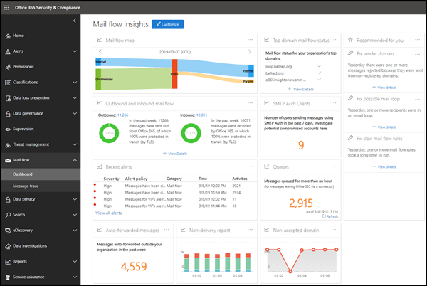

# 安全与合规中心内的邮件流见解Mail flow insights in the Security & Compliance Center

> [!NOTE]
> 本主题中所述的功能尚未部署到所有 Office 365 组织中, 可能会发生更改。The features described in this topic haven't been deployed to all Office 365 organizations, and are subject to change.

管理员可以使用安全 & 合规中心中的邮件流仪表板来发现趋势、见解并采取措施解决与 Office 365 组织中的邮件流相关的问题。Admins can use mail flow dashboard in the Security & Compliance Center to discover trends, insights and take actions to fix issues related to mail flow in their Office 365 organization.

邮件流仪表板中提供的见解、报告和小部件为:The insights, reports, and widgets that are available in the mail flow dashboard are:

- [邮件流映射报告](mfi-mail-flow-map-report.md)(此报告是新报告, 目前正在部署到 Office 365 中。)[Mail flow map report](mfi-mail-flow-map-report.md) (This report is new and is currently being deployed in Office 365.)

- [域邮件流状态洞察力](mfi-domain-mail-flow-status-insight.md)(此洞察力是新增的, 目前正在部署到 Office 365 中。)[Domain mail flow status insight](mfi-domain-mail-flow-status-insight.md) (This insight is new and is currently being deployed in Office 365.)

- [SMTP 身份验证客户端报告](mfi-smtp-auth-clients-report.md)(此报告是新报告, 目前正在部署到 Office 365 中。)[SMTP Auth clients report](mfi-smtp-auth-clients-report.md) (This report is new and is currently being deployed in Office 365.)

- [发件人域洞察力](mfi-sender-domain-insight.md)(此洞察力是新增的, 目前正在部署到 Office 365 中。)[Sender domain insight](mfi-sender-domain-insight.md) (This insight is new and is currently being deployed in Office 365.)

- [未送达报告](mfi-non-delivery-report.md)(此报告是新报告, 目前正在部署到 Office 365 中。)[Non-delivery report](mfi-non-delivery-report.md) (This report is new and is currently being deployed in Office 365.)

- [不接受的域报告](mfi-non-accepted-domain-report.md)(此报告是新报告, 目前正在部署到 Office 365 中。)[Non-accepted domain report](mfi-non-accepted-domain-report.md) (This report is new and is currently being deployed in Office 365.)

- [入站和出站邮件流Outbound and inbound mail flow](mfi-outbound-and-inbound-mail-flow.md)

- [队列警报和队列Queue alerts and Queues](mfi-queue-alerts-and-queues.md)

- [自动转发的消息报告Auto-forwarded messages report](mfi-auto-forwarded-messages-report.md)

- [邮件循环见解Mail loop insight](mfi-mail-loop-insight.md)

- [慢邮件流规则见解Slow mail flow rules insight](mfi-slow-mail-flow-rules-insight.md)

## 查看邮件流仪表板所需的权限Permissions required to view the mail flow dashboard

邮件流仪表板可用于:The mail flow dashboard is available to:

- **Office 365 全局管理员**角色的成员。Members of the **Office 365 global administrator** role.

- **Office 365 Exchange 管理员**角色的成员。Members of **Office 365 Exchange administrator** role.

- Security & 合规性中心中**邮件流管理员角色**的成员。Members of the **Mail flow administrator role** in the Security & Compliance Center. 如果此角色被明确分配给不是全局管理员或 Exchange 管理员角色成员的用户:If this role is explicitly assigned to a user who isn't a member of the global administrator or Exchange administrator roles:

  - 用户必须直接登录到 Security & 合规性中心[https://protection.office.com](https://protection.office.com)。The user must log in to the Security & Compliance Center directly at [https://protection.office.com](https://protection.office.com).

  - 用户将只具有对邮件流仪表板的只读权限。The user will only have read-only permission to the mail flow dashboard.

  - 用户将无法访问 Office 365 管理门户。The user won't have access to the Office 365 admin portal.

有关 office 365 全局管理员角色的详细信息, 请参阅[关于 office 365 管理员角色](https://docs.microsoft.com/office365/admin/add-users/about-admin-roles)。For more information about the Office 365 global administrator role, see [About Office 365 admin roles](https://docs.microsoft.com/office365/admin/add-users/about-admin-roles).

有关为用户分配安全 & 合规中心角色的信息, 请参阅[为用户提供对 Security & 合规性中心的访问权限](https://docs.microsoft.com/office365/securitycompliance/grant-access-to-the-security-and-compliance-center)。For information on assigning Security & Compliance Center roles to users, see [Give users access to the Security & Compliance Center](https://docs.microsoft.com/office365/securitycompliance/grant-access-to-the-security-and-compliance-center).

## 在何处查找邮件流仪表板Where to find the mail flow dashboard

1. 转到安全 & 合规中心, 网址[https://protection.office.com](https://protection.office.com)为。Go to the Security & Compliance Center at [https://protection.office.com](https://protection.office.com).

2. 展开 "**邮件流**", 然后选择 "**仪表板**"。Expand **Mail flow** and then select **Dashboard**.

   
