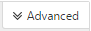

# 使用 Office 365 云应用安全管理 OAuth 应用

|评估 * *\>**|规划 * *\>**|部署 * *\>**|使用率 ***|
|:-----|:-----|:-----|:-----|
|[启动评估](office-365-cas-overview.md)   |[开始规划](get-ready-for-office-365-cas.md)   |[开始部署](turn-on-office-365-cas.md)   |在这里 ！    [后续步骤](manage-app-permissions-in-ocas.md#nextsteps)   |
   
人员喜欢的应用程序和他们通常下载这些，尤其是人员思考的应用程序将通过使其更易于获取在其工作或学校信息节省时间。但是，某些应用程序可能存在一定的安全风险到您的组织，哪些信息取决于他们访问和如何处理该信息。[Office 365 云应用程序安全性](office-365-cas-overview.md)，如果您是全局或安全管理员，您可以管理 OAuth 应用程序为您的组织。您可以查看正在使用的应用程序的人员的 Office 365 数据哪些权限这些应用程序都有和更多内容。 
  
本文介绍在哪里管理 OAuth 应用程序、 如何批准、 禁止，或报告应用程序，以及如何创建应用程序查询。
  
## 如何查找管理 OAuth 应用程序页

> [!NOTE]
> 在 Office 365 云应用程序安全性门户管理 OAuth 应用程序。您必须是要执行以下任务的全局管理员或 security 管理员程序。若要了解详细，请参阅[Permissions in Office 365 安全性&amp;合规性中心](permissions-in-the-security-and-compliance-center.md)。 
  
1. 转到[https://protection.office.com](https://protection.office.com)和 Office 365 中使用您的工作或学校帐户登录。(您将转到安全&amp;合规性中心。) 
    
2. 转到**通知** \> **管理高级通知**。
    
3. 单击 （或点击）**转到 Office 365 云应用程序安全性**。  **注意**： 如果未尚未开启 Office 365 云应用程序安全性，您可以执行的操作此页上。请参阅[为 Office 365 云应用程序安全性做好准备](get-ready-for-office-365-cas.md)。 
  
4. 选择**调查** \> **OAuth 应用程序**。  
  
## 您将看到上管理 OAuth 应用程序页

下表介绍了管理 OAuth 的应用程序页上的控件和可用选项。
  
|**项**|**说明**|
|:-----|:-----|
|应用程序查询栏中的基本图标    |选择此选项可切换到的高级视图。    （如果您看到**基本**，所使用的高级的视图）    |
|应用程序查询栏中的高级的图标    |选择此选项可切换到基本视图。    （如果您看到**高级**，您使用基本视图）。    |
|打开或关闭应用程序列表中的所有详细信息图标    |选择此图标可查看有关每个应用程序的更多或更少的详细信息。    |
|在应用程序列表的导出图标    |选择此图标可导出 CSV 文件包含列表的应用程序，每个应用程序与应用程序、 权限级别、 应用程序状态和社区使用级别关联的权限的用户数。    |
|名称    |使用此查看应用程序选择的名称的名称，以查看详细信息，例如其说明、 publisher、 应用程序网站和应用程序 id。    |
|经过授权    |使用此查看多少用户有权访问其 Office 365 帐户的应用程序。选择要查看详细信息，如用户帐户的列表的编号。    |
|权限级别    |用于查看的应用程序多少访问已对 Office 365 数据。权限级别指示**低**、**中等**或**高**，其中**低**可能表示应用程序仅访问用户的配置文件和名称。选择要查看详细信息，如权限授予对应用程序、 社区使用和[调控日志](suspend-or-restore-an-account-in-ocas.md)中的相关的活动的级别。  |
|上次授权   |用于查看的日期和时间 OAuth 应用程序已最后一个权访问您组织的 Office 365 数据。    |
|操作   |使用此要查看或将应用程序标记为已批准或 Banned，向 Microsoft 报告 OAuth 应用程序或将其保留为未确定。    |
   
## 将应用程序标记为已批准

在**管理 OAuth 应用程序**页上，找到您想要批准的应用程序，然后选择**作为标记应用程序获得批准**图标。 
  

  
图标将变为绿色，并且应用程序已获得批准对所有 Office 365 用户。
  
> [!NOTE]
> 当您将应用程序标记为已批准时，最终用户没有影响。直观地标记批准的应用程序有助于分隔它们从您尚未尚未已审阅的应用程序。 
  
## 禁止应用程序

1. 在**管理 OAuth 应用程序**页上，找到您要禁止，应用的程序，然后选择**作为标记应用程序禁止**图标。 
  
2. 在通知消息框中，保留现有的文本，按原样，或自定义的文本。选择是否让用户了解其应用程序已被禁止。   
  
3. 选择**禁止应用程序**。

## 向 Microsoft 报告 OAuth 应用程序

如果您想要 OAuth 的应用程序提交给 Microsoft 进行分析，您可以报告该应用程序。

1. 在**管理 OAuth 应用程序**页中，找到要用于分析提交应用的程序。

2. 选择的垂直省略号，然后选择**报告应用程序...**。  

3. 在**报告此应用程序**对话框中，使用下拉列表以指示您的问题。默认情况下，**此应用程序是恶意**处于选中状态。但是，您可以选择其他可用选项之一。  

4. （推荐）保留选项可与您选择，联系，确认 （或编辑） 列出的电子邮件地址。

5. 选择" **提交**"。 
    
## 创建应用程序查询

我们建议使用的高级的视图，如下所示： 

在应用程序查询栏中，请参阅**高级**，如果您正使用的基本视图。单击 （或点击）**高级**以转到的高级视图。 

    
1. 在查询栏中，使用**选择筛选器**列表选择一个选项。 
    - **应用程序**具有某些名称的应用程序
    - **应用程序状态**根据状态 （已批准、 Banned 或未确定） 的应用程序
    - **使用社区**基于社区的应用程序使用级别 （Rare、 Uncommon 或通用）
    - **权限级别**基于特定权限级别的应用程序 
    - **权限**需要哪些权限的应用程序
    - **Publisher** 从特定的发布者的应用程序
    - **用户**特定用户授权的应用程序
   
2. 选择**等于**或**不等于**，，然后指定为筛选器值。
    
3. 若要添加更多筛选器，请选择加号 （)，然后对重复步骤 2 和 3。
    
4. 若要删除筛选器，请选择 x () 旁边的筛选器名称。
    
自动应用筛选器并相应地更新应用程序列表。
  
## 后续步骤

- [查看并通知对其执行操作](review-office-365-cas-alerts.md)
    
- 查看您的[Web 流量日志和 Office 365 云应用程序安全性的数据源](web-traffic-logs-and-data-sources-for-ocas.md)
    
- 查看您[的 Office 365 云应用程序安全性的使用率活动](utilization-activities-for-ocas.md)
    

