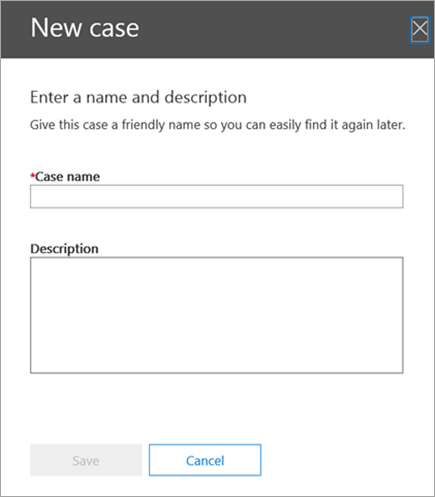
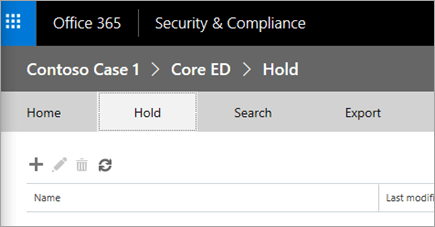

# <a name="manage-ediscovery-cases-in-the-security--compliance-center"></a><span data-ttu-id="0dc81-103">在安全与合规中心管理电子数据展示事例</span><span class="sxs-lookup"><span data-stu-id="0dc81-103">Manage eDiscovery cases in the Security & Compliance Center</span></span>

<span data-ttu-id="0dc81-104">您可以使用安全 & 合规中心中的电子数据展示事例来控制哪些用户可以在组织中创建、访问和管理电子数据展示事例。</span><span class="sxs-lookup"><span data-stu-id="0dc81-104">You can use eDiscovery cases in the Security & Compliance Center to control who can create, access, and manage eDiscovery cases in your organization.</span></span> <span data-ttu-id="0dc81-105">如果您的组织具有 office 365 E5 订阅, 您还可以使用电子数据展示事例来分析搜索结果, 方法是使用 Office 365 高级电子数据展示。</span><span class="sxs-lookup"><span data-stu-id="0dc81-105">If your organization has an Office 365 E5 subscription, you can also use eDiscovery cases to analyze search results by using Office 365 Advanced eDiscovery.</span></span>
  
<span data-ttu-id="0dc81-106">电子数据展示事例允许向事例中添加成员、控制特定事例成员可以执行的操作类型，将与案件相关的内容位置置于保留状态，以及将多个内容搜索与一个事例关联。</span><span class="sxs-lookup"><span data-stu-id="0dc81-106">An eDiscovery case allows you to add members to a case, control what types of actions that specific case members can perform, place a hold on content locations relevant to a legal case, and associate multiple Content Searches with a single case.</span></span> <span data-ttu-id="0dc81-107">您还可以导出与事例关联的任何内容搜索的结果, 或在高级电子数据展示中准备搜索结果以进行分析。</span><span class="sxs-lookup"><span data-stu-id="0dc81-107">You can also export the results of any Content Search that is associated with a case or prepare search results for analysis in Advanced eDiscovery.</span></span> <span data-ttu-id="0dc81-108">电子数据展示事例是一种可用来限制哪些人有权访问内容搜索和你组织中特定法律案件搜索结果的好方法。</span><span class="sxs-lookup"><span data-stu-id="0dc81-108">eDiscovery cases are a good way to limit who has access to Content Searches and search results for a specific legal case in your organization.</span></span>
  
<span data-ttu-id="0dc81-109">使用以下工作流在安全 & 合规性中心和高级电子数据展示中设置和使用电子数据展示事例。</span><span class="sxs-lookup"><span data-stu-id="0dc81-109">Use the following workflow to set up and use eDiscovery cases in the Security & Compliance Center and Advanced eDiscovery.</span></span>
  
[<span data-ttu-id="0dc81-110">Step 1: Assign eDiscovery permissions to potential case members</span><span class="sxs-lookup"><span data-stu-id="0dc81-110">Step 1: Assign eDiscovery permissions to potential case members</span></span>](manage-ediscovery-cases.md#step1_1)
  
[<span data-ttu-id="0dc81-111">步骤 2: 创建新事例</span><span class="sxs-lookup"><span data-stu-id="0dc81-111">Step 2: Create a new case</span></span>](manage-ediscovery-cases.md#step2_1)
  
[<span data-ttu-id="0dc81-112">步骤 3: 将成员添加到事例</span><span class="sxs-lookup"><span data-stu-id="0dc81-112">Step 3: Add members to a case</span></span>](manage-ediscovery-cases.md#step2a_1)
  
[<span data-ttu-id="0dc81-113">步骤 4: 将内容位置置于保留状态</span><span class="sxs-lookup"><span data-stu-id="0dc81-113">Step 4: Place content locations on hold</span></span>](manage-ediscovery-cases.md#step3_1)
  
[<span data-ttu-id="0dc81-114">步骤 5: 创建和运行与事例关联的内容搜索</span><span class="sxs-lookup"><span data-stu-id="0dc81-114">Step 5: Create and run a Content Search associated with a case</span></span>](manage-ediscovery-cases.md#step4_1)
  
[<span data-ttu-id="0dc81-115">步骤 6: 导出与事例关联的内容搜索的结果</span><span class="sxs-lookup"><span data-stu-id="0dc81-115">Step 6: Export the results of a Content Search associated with a case</span></span>](manage-ediscovery-cases.md#step5_1)
  
[<span data-ttu-id="0dc81-116">步骤 7: 为高级电子数据展示准备搜索结果</span><span class="sxs-lookup"><span data-stu-id="0dc81-116">Step 7: Prepare search results for Advanced eDiscovery</span></span>](manage-ediscovery-cases.md#step7_1)
  
[<span data-ttu-id="0dc81-117">步骤 8: 转到高级电子数据展示中的案例</span><span class="sxs-lookup"><span data-stu-id="0dc81-117">Step 8: Go to the case in Advanced eDiscovery</span></span>](manage-ediscovery-cases.md#gotoAeD_1)
  
[<span data-ttu-id="0dc81-118">Optional步骤 9: 关闭事例</span><span class="sxs-lookup"><span data-stu-id="0dc81-118">(Optional) Step 9: Close a case</span></span>](manage-ediscovery-cases.md#closecase_1)
  
[<span data-ttu-id="0dc81-119">Optional步骤 10: 重新打开已关闭的案例</span><span class="sxs-lookup"><span data-stu-id="0dc81-119">(Optional) Step 10: Re-open a closed case</span></span>](manage-ediscovery-cases.md#reopencase_1)
  
[<span data-ttu-id="0dc81-120">详细信息</span><span class="sxs-lookup"><span data-stu-id="0dc81-120">More information</span></span>](manage-ediscovery-cases.md#moreinfo_1)
  
## <a name="step-1-assign-ediscovery-permissions-to-potential-case-members"></a><span data-ttu-id="0dc81-121">步骤 1：向潜在事例成员分配电子数据展示权限</span><span class="sxs-lookup"><span data-stu-id="0dc81-121">Step 1: Assign eDiscovery permissions to potential case members</span></span>
<span data-ttu-id="0dc81-122"><a name="step1_1"> </a></span><span class="sxs-lookup"><span data-stu-id="0dc81-122"></span></span>

<span data-ttu-id="0dc81-123">第一步是向用户分配与电子数据展示相关的相应权限, 以便您可以将其添加到步骤2中的电子数据展示事例中。</span><span class="sxs-lookup"><span data-stu-id="0dc81-123">The first step is to assign the appropriate eDiscovery-related permissions to people so you can add them to an eDiscovery case in Step 2.</span></span> <span data-ttu-id="0dc81-124">您必须是 Security & 合规中心中的 "组织管理" 角色组 (或 "角色管理" 角色) 的成员, 才能分配电子数据展示权限。</span><span class="sxs-lookup"><span data-stu-id="0dc81-124">You have to be a member of the Organization Management role group (or be assigned the Role Management role) in the Security & Compliance Center to assign eDiscovery permissions.</span></span> <span data-ttu-id="0dc81-125">以下列表介绍了 Security & 合规性中心中与电子数据展示相关的角色组。</span><span class="sxs-lookup"><span data-stu-id="0dc81-125">The following list describes the eDiscovery-related role groups in the Security & Compliance Center.</span></span>
  
- <span data-ttu-id="0dc81-126">**审阅者**此角色组具有最受限制的与电子数据展示相关的权限。</span><span class="sxs-lookup"><span data-stu-id="0dc81-126">**Reviewer**This role group has the most restrictive eDiscovery-related permissions.</span></span> <span data-ttu-id="0dc81-127">此组的成员只能查看并打开安全 & 合规性中心中的**电子数据展示**页面上的事例列表, 它们是其成员。</span><span class="sxs-lookup"><span data-stu-id="0dc81-127">Members of this group can only see and open the list of the cases on the **eDiscovery** page in the Security & Compliance Center that they are members of.</span></span> <span data-ttu-id="0dc81-128">他们无法创建案例、向事例添加成员、创建保留、创建搜索、导出搜索结果或为高级电子数据展示准备结果。</span><span class="sxs-lookup"><span data-stu-id="0dc81-128">They can't create cases, add members to a case, create holds, create searches, export search results, or prepare results for Advanced eDiscovery.</span></span> <span data-ttu-id="0dc81-129">但是, 成员可以在高级电子数据展示中访问案例以执行分析任务。</span><span class="sxs-lookup"><span data-stu-id="0dc81-129">However, members can access cases in Advanced eDiscovery to perform analysis tasks.</span></span> 
    
- <span data-ttu-id="0dc81-130">**电子数据展示管理器**此角色组的成员可以创建和管理电子数据展示事例。</span><span class="sxs-lookup"><span data-stu-id="0dc81-130">**eDiscovery Manager**Members of this role group can create and manage eDiscovery cases.</span></span> <span data-ttu-id="0dc81-131">他们可以添加和删除成员, 将内容位置置于保留状态, 创建和编辑与案例相关的内容搜索, 导出内容搜索的结果, 并在高级电子数据展示中准备搜索结果以供分析。</span><span class="sxs-lookup"><span data-stu-id="0dc81-131">They can add and remove members, place content locations on hold, create and edit Content Searches associated with a case, export the results of a Content Search, and prepare search results for analysis in Advanced eDiscovery.</span></span> <span data-ttu-id="0dc81-132">此角色组中有两个子组。</span><span class="sxs-lookup"><span data-stu-id="0dc81-132">There are two sub-groups in this role group.</span></span> <span data-ttu-id="0dc81-133">这些子组之间的差异基于作用域。</span><span class="sxs-lookup"><span data-stu-id="0dc81-133">The difference between these subgroups is based on scope.</span></span>
    
  - <span data-ttu-id="0dc81-134">**电子数据展示管理器**可以查看和管理他们创建的或为其成员的电子数据展示事例。</span><span class="sxs-lookup"><span data-stu-id="0dc81-134">**eDiscovery Manager**Can view and manage the eDiscovery cases they create or are a member of.</span></span> <span data-ttu-id="0dc81-135">如果另一个电子数据展示管理器创建了一个事例, 但未将另一个电子数据展示管理器添加为这种情况的成员, 则第二个电子数据展示管理器将无法在 Security & 合规性中心的**电子数据展示**页面上查看或打开事例。</span><span class="sxs-lookup"><span data-stu-id="0dc81-135">If another eDiscovery Manager creates a case but doesn't add a second eDiscovery Manager as a member of that case, the second eDiscovery Manager won't be able to view or open the case on the **eDiscovery** page in the Security & Compliance Center.</span></span> <span data-ttu-id="0dc81-136">电子数据展示管理器还可以访问高级电子数据展示中的案例, 以执行分析任务。</span><span class="sxs-lookup"><span data-stu-id="0dc81-136">eDiscovery Managers can also access their cases in Advanced eDiscovery to perform analysis tasks.</span></span> 
    
  - <span data-ttu-id="0dc81-137">**电子数据展示管理员**可以执行电子数据展示管理器可以执行的所有案例管理任务。</span><span class="sxs-lookup"><span data-stu-id="0dc81-137">**eDiscovery Administrator**Can perform all case management tasks that an eDiscovery Manager can do.</span></span> <span data-ttu-id="0dc81-138">此外，电子数据展示管理员可以：</span><span class="sxs-lookup"><span data-stu-id="0dc81-138">Additionally, an eDiscovery Administrator can:</span></span>
    
  - <span data-ttu-id="0dc81-139">查看“电子数据展示”\*\*\*\* 页上列出的所有事例。</span><span class="sxs-lookup"><span data-stu-id="0dc81-139">View all cases that are listed on the **eDiscovery** page.</span></span> 
    
  - <span data-ttu-id="0dc81-140">在组织中管理任何电子数据展示事例, 然后再将自己添加为事例的成员。</span><span class="sxs-lookup"><span data-stu-id="0dc81-140">Manage any eDiscovery case in the organization after they add themself as a member of the case.</span></span>
    
  - <span data-ttu-id="0dc81-141">在高级电子数据展示中执行管理任务, 例如用于分析的处理事例数据、配置事例设置以及从高级电子数据展示导出数据。</span><span class="sxs-lookup"><span data-stu-id="0dc81-141">Perform administrative tasks in Advanced eDiscovery, such as processing case data for analysis, configuring case settings, and exporting data from Advanced eDiscovery.</span></span> <span data-ttu-id="0dc81-142">这是因为安全 & 合规中心中的电子数据展示管理员将自动添加为高级电子数据展示中的管理员。</span><span class="sxs-lookup"><span data-stu-id="0dc81-142">This is because a person who is an eDiscovery Administrator in the Security & Compliance Center is automatically added as an administrator in Advanced eDiscovery.</span></span>
    
    <span data-ttu-id="0dc81-143">请参阅[More information](manage-ediscovery-cases.md#moreinfo_1)部分，了解为什么您可能需要组织中的电子数据展示管理员。</span><span class="sxs-lookup"><span data-stu-id="0dc81-143">See the [More information](manage-ediscovery-cases.md#moreinfo_1) section for reasons why you may want an eDiscovery Administrator in your organization.</span></span> 
    
> [!IMPORTANT]
> <span data-ttu-id="0dc81-144">如果某个人不是其中一个与电子数据展示相关的角色组的成员, 或者不是分配有审阅者角色的角色组的成员, 则不能将其添加为电子数据展示事例的成员。</span><span class="sxs-lookup"><span data-stu-id="0dc81-144">If a person isn't a member of one of these eDiscovery-related role groups, or isn't a member of a role group that's assigned the Reviewer role, you can't add them as a member of an eDiscovery case.</span></span> 
  
 <span data-ttu-id="0dc81-145">**分配电子数据展示权限：**</span><span class="sxs-lookup"><span data-stu-id="0dc81-145">**To assign eDiscovery permissions:**</span></span>
  
1. <span data-ttu-id="0dc81-146">转到 [https://compliance.microsoft.com](https://compliance.microsoft.com)。</span><span class="sxs-lookup"><span data-stu-id="0dc81-146">Go to [https://compliance.microsoft.com](https://compliance.microsoft.com).</span></span>
    
2. <span data-ttu-id="0dc81-147">使用工作或学校帐户登录到 Office 365。</span><span class="sxs-lookup"><span data-stu-id="0dc81-147">Sign in to Office 365 using your work or school account.</span></span>
    
3. <span data-ttu-id="0dc81-148">在 "安全 & 合规中心" 中, 单击 "**权限**", 然后根据要分配的电子数据展示权限执行以下操作之一。</span><span class="sxs-lookup"><span data-stu-id="0dc81-148">In the Security & Compliance Center, click **Permissions**, and then do one of the following based on the eDiscovery permissions that you want to assign.</span></span>
    
  - <span data-ttu-id="0dc81-149">若要分配审阅者权限, 请选择 "**审阅者**" 角色组, 然后单击 "**成员**" 旁边的 "**编辑**"。</span><span class="sxs-lookup"><span data-stu-id="0dc81-149">To assign Reviewer permissions, select the **Reviewer** role group, and then next to **Members** click **Edit**.</span></span> <span data-ttu-id="0dc81-150">单击 "**选择成员**"  "添加图标" "**添加**" 选择要添加到审阅者角色组的用户, 然后单击 "**添加**"。</span><span class="sxs-lookup"><span data-stu-id="0dc81-150">Click **Choose members**, click  **Add** select the user that you want to add to the Reviewer role group, and then click **Add**.</span></span>
    
  - <span data-ttu-id="0dc81-151">要分配电子数据展示管理器权限, 请选择**电子数据展示管理器**角色组, 然后单击 "**电子数据展示管理器**" 旁边的 "**编辑**"</span><span class="sxs-lookup"><span data-stu-id="0dc81-151">To assign eDiscovery Manager permissions, select the **eDiscovery Manager** role group, and then next to **eDiscovery Manager**, click **Edit**.</span></span> <span data-ttu-id="0dc81-152">单击 "**选择电子数据展示管理器**", 单击 \* \* 添加 \* \*", 选择要添加为电子数据展示管理器的用户, 然后单击 "**添加**"。</span><span class="sxs-lookup"><span data-stu-id="0dc81-152">Click **Choose eDiscovery Manager**, click  \*\* Add \*\*, select the user that you want to add as an eDiscovery Manager, and then click **Add**.</span></span>
    
  - <span data-ttu-id="0dc81-153">若要分配电子数据展示管理员权限, 请选择**电子数据展示管理器**角色组, 然后单击 "**电子数据展示管理员**" 旁边的 "**编辑**"。</span><span class="sxs-lookup"><span data-stu-id="0dc81-153">To assign eDiscovery Administrator permissions, select the **eDiscovery Manager** role group, and then next to **eDiscovery Administrator**, click **Edit**.</span></span> <span data-ttu-id="0dc81-154">单击 "**选择电子数据展示管理员**",  " "**添加**", 选择要添加为电子数据展示管理员的用户, 然后单击 "**添加**"。</span><span class="sxs-lookup"><span data-stu-id="0dc81-154">Click **Choose eDiscovery Administrator**, click  **Add**, select the user that you want to add as an eDiscovery Administrator, and then click **Add**.</span></span>
    
4. <span data-ttu-id="0dc81-155">添加所有用户后, 单击 "**完成**", 再单击 "**保存**" 以保存对角色组所做的更改, 然后单击 "**关闭**"。</span><span class="sxs-lookup"><span data-stu-id="0dc81-155">After you've added all the users, click **Done**, click **Save** to save the changes to the role group, and then click **Close**.</span></span>
    

  
## <a name="step-2-create-a-new-case"></a><span data-ttu-id="0dc81-156">步骤 2: 创建新事例</span><span class="sxs-lookup"><span data-stu-id="0dc81-156">Step 2: Create a new case</span></span>
<span data-ttu-id="0dc81-157"><a name="step2_1"> </a></span><span class="sxs-lookup"><span data-stu-id="0dc81-157"></span></span>

<span data-ttu-id="0dc81-158">下一步是创建新的电子数据展示事例。</span><span class="sxs-lookup"><span data-stu-id="0dc81-158">The next step is to create a new eDiscovery case.</span></span> <span data-ttu-id="0dc81-159">你必须是电子数据展示管理员角色组的成员才能创建电子数据展示事例。</span><span class="sxs-lookup"><span data-stu-id="0dc81-159">You must be a member of the eDiscovery Managers role group to create eDiscovery cases.</span></span> <span data-ttu-id="0dc81-160">如前所述, 在安全 & 合规中心中创建新事例之后, 如果您的组织有 Office 365 E5 订阅, 则您 (和其他事例成员) 将能够在高级电子数据展示中访问这种同一种情况。</span><span class="sxs-lookup"><span data-stu-id="0dc81-160">As previously explained, after you create a new case in the Security & Compliance Center, you (and other case members) will be able to access that same case in Advanced eDiscovery if you're organization has an Office 365 E5 subscription.</span></span>
  
1. <span data-ttu-id="0dc81-161">转到 [https://compliance.microsoft.com](https://compliance.microsoft.com)。</span><span class="sxs-lookup"><span data-stu-id="0dc81-161">Go to [https://compliance.microsoft.com](https://compliance.microsoft.com).</span></span>
    
2. <span data-ttu-id="0dc81-162">使用工作或学校帐户登录到 Office 365。</span><span class="sxs-lookup"><span data-stu-id="0dc81-162">Sign in to Office 365 using your work or school account.</span></span>
    
3. <span data-ttu-id="0dc81-163">在安全 & 合规性中心中, 单击 "**电子数据** \>展示**电子数据展示**", 然后单击 "  "**创建一个事例**。</span><span class="sxs-lookup"><span data-stu-id="0dc81-163">In the Security & Compliance Center, click **eDiscovery** \> **eDiscovery**, and then click  **Create a case**.</span></span>
    
4. <span data-ttu-id="0dc81-164">在 "**新事例**" 页面上, 为事例指定名称, 键入可选说明, 然后单击 "**保存**"。</span><span class="sxs-lookup"><span data-stu-id="0dc81-164">On the **New Case** page, give the case a name, type an optional description, and then click **Save**.</span></span> <span data-ttu-id="0dc81-165">请注意, 案例名称在您的组织中必须是唯一的。</span><span class="sxs-lookup"><span data-stu-id="0dc81-165">Note that the case name must be unique in your organization.</span></span>
    
    
  
    <span data-ttu-id="0dc81-167">新事例将显示在**电子数据展示**页面上的案例列表中。</span><span class="sxs-lookup"><span data-stu-id="0dc81-167">The new case is displayed in the list of cases on the **eDiscovery** page.</span></span> <span data-ttu-id="0dc81-168">请注意, 您可以将光标悬停在事例名称上方, 以显示有关事例的信息, 包括案例的状态 (**活动**或**已关闭**)、案例说明 (在上一步中创建) 以及最后一次更改事例的时间和更改的作者。</span><span class="sxs-lookup"><span data-stu-id="0dc81-168">Note that you can hover the cursor over a case name to display information about the case, including the status of the case ( **Active** or **Closed**), the description of the case (that was created in the previous step), and when the case was changed last and who changed it.</span></span>
    
    > [!TIP]
    > <span data-ttu-id="0dc81-169">创建新事例后, 可以随时对其进行重命名。</span><span class="sxs-lookup"><span data-stu-id="0dc81-169">After you create a new case, you can rename it anytime.</span></span> <span data-ttu-id="0dc81-170">只需在**电子数据展示**页面上单击事例的名称即可。</span><span class="sxs-lookup"><span data-stu-id="0dc81-170">Just click the name of the case on the **eDiscovery** page.</span></span> <span data-ttu-id="0dc81-171">在 "**管理此案例**" 弹出页面上, 更改显示在 "**名称**" 下的框中的名称, 然后保存更改。</span><span class="sxs-lookup"><span data-stu-id="0dc81-171">On the **Manage this case** flyout page, change the name displayed in the box under **Name**, and then save the change.</span></span> 
  
## <a name="step-3-add-members-to-a-case"></a><span data-ttu-id="0dc81-172">步骤 3: 将成员添加到事例</span><span class="sxs-lookup"><span data-stu-id="0dc81-172">Step 3: Add members to a case</span></span>
<span data-ttu-id="0dc81-173"><a name="step2a_1"> </a></span><span class="sxs-lookup"><span data-stu-id="0dc81-173"></span></span>

<span data-ttu-id="0dc81-174">创建新事例后, 下一步是向事例添加成员。</span><span class="sxs-lookup"><span data-stu-id="0dc81-174">After you create a new case, the next step is to add members to the case.</span></span> <span data-ttu-id="0dc81-175">如前所述, 只有属于审阅者或电子数据展示管理者角色组成员的用户才可以添加为该事例的成员。</span><span class="sxs-lookup"><span data-stu-id="0dc81-175">As previous explained, only users that are members of the Reviewer or eDiscovery Manager role groups can be added as a member of the case.</span></span> <span data-ttu-id="0dc81-176">请注意, 创建该事例的电子数据展示管理器将自动添加为成员。</span><span class="sxs-lookup"><span data-stu-id="0dc81-176">Note that the eDiscovery Manager who created the case is automatically added as a member.</span></span>
  
1. <span data-ttu-id="0dc81-177">在安全 & 合规性中心中, 单击 "**电子数据** \>展示**电子数据**展示" 以显示组织中的案例列表。</span><span class="sxs-lookup"><span data-stu-id="0dc81-177">In the Security & Compliance Center, click **eDiscovery** \> **eDiscovery** to display the list of cases in your organization.</span></span> 
    
2. <span data-ttu-id="0dc81-178">单击要向其添加成员的事例的名称。</span><span class="sxs-lookup"><span data-stu-id="0dc81-178">Click the name of the case that you want to add members to.</span></span>
    
    <span data-ttu-id="0dc81-179">将显示 "**管理此案例**" 弹出页面。</span><span class="sxs-lookup"><span data-stu-id="0dc81-179">The **Manage this case** flyout page is displayed.</span></span> 
    
    
  
3. <span data-ttu-id="0dc81-181">在 "**管理成员**" 单击 "添加图标**添加**" 以向事例添加成员。</span><span class="sxs-lookup"><span data-stu-id="0dc81-181">Under **Manage members**, click  **Add** to add members to the case.</span></span> 
    
4. <span data-ttu-id="0dc81-182">在可以添加为案例成员的人员列表中, 单击要添加到案例的人员的姓名旁边的复选框。</span><span class="sxs-lookup"><span data-stu-id="0dc81-182">In the list of people who can be added as a member of the case, click the checkbox next to the name of the people you want to add to the case.</span></span>
    
    > [!TIP]
    > <span data-ttu-id="0dc81-183">如果您有一个很大的用户可以添加为成员的列表, 请使用**搜索**框在列表中搜索特定人员。</span><span class="sxs-lookup"><span data-stu-id="0dc81-183">If you have a large list of people who can added as members, use the **Search** box to search for a specific person in the list.</span></span> 
  
5. <span data-ttu-id="0dc81-184">选择要添加为组成员的人员后, 单击 "**添加**"。</span><span class="sxs-lookup"><span data-stu-id="0dc81-184">After you've selected the people to add as members of the group, click **Add**.</span></span>
    
    <span data-ttu-id="0dc81-185">在 "**管理此案例**" 中, 单击 "**保存**" 以保存新的事例成员列表。</span><span class="sxs-lookup"><span data-stu-id="0dc81-185">In **Manage this case**, click **Save** to save the new list of case members.</span></span> 
    
6. <span data-ttu-id="0dc81-186">单击 "**保存**" 以保存新的事例成员列表。</span><span class="sxs-lookup"><span data-stu-id="0dc81-186">Click **Save** to save the new list of case members.</span></span> 
  
## <a name="step-4-place-content-locations-on-hold"></a><span data-ttu-id="0dc81-187">步骤 4: 将内容位置置于保留状态</span><span class="sxs-lookup"><span data-stu-id="0dc81-187">Step 4: Place content locations on hold</span></span>
<span data-ttu-id="0dc81-188"><a name="step3_1"> </a></span><span class="sxs-lookup"><span data-stu-id="0dc81-188"></span></span>

<span data-ttu-id="0dc81-189">你可以使用电子数据展示事例创建保留状态以保留可能与事例相关的内容。</span><span class="sxs-lookup"><span data-stu-id="0dc81-189">You can use an eDiscovery case to create holds to preserve content that might be relevant to the case.</span></span> <span data-ttu-id="0dc81-190">在这种情况下, 您可以对用户的邮箱和 OneDrive for business 网站进行保留。</span><span class="sxs-lookup"><span data-stu-id="0dc81-190">You can place a hold on the mailboxes and OneDrive for Business sites of people who are custodians in the case.</span></span> <span data-ttu-id="0dc81-191">您还可以在 "Office 365" 组的 "组邮箱"、"SharePoint 网站" 和 "OneDrive for business" 网站上放置保留项。</span><span class="sxs-lookup"><span data-stu-id="0dc81-191">You can also place a hold on the group mailbox, SharePoint site, and OneDrive for Business site for an Office 365 Group.</span></span> <span data-ttu-id="0dc81-192">同样, 您可以在与 Microsoft 团队关联的邮箱和网站上放置保留。</span><span class="sxs-lookup"><span data-stu-id="0dc81-192">Similarly, you can place a hold on the mailbox and site that are associated with Microsoft Teams.</span></span> <span data-ttu-id="0dc81-193">将内容位置置于保留状态时, 将保留内容, 直到您从内容位置删除保留或删除保留。</span><span class="sxs-lookup"><span data-stu-id="0dc81-193">When you place content locations on hold, content is held until you remove the hold from the content location or until you delete the hold.</span></span>
  
<span data-ttu-id="0dc81-194">在创建保留时, 您可以使用以下选项来限定指定内容位置中保留的内容:</span><span class="sxs-lookup"><span data-stu-id="0dc81-194">When you create a hold, you have the following options to scope the content that is held in the specified content locations:</span></span>
  
- <span data-ttu-id="0dc81-195">将所有内容置于保留状态时创建无限保留。</span><span class="sxs-lookup"><span data-stu-id="0dc81-195">You create an infinite hold where all content is placed on hold.</span></span> <span data-ttu-id="0dc81-196">或者, 您可以创建基于查询的保留, 其中只有与搜索查询匹配的内容置于保留状态。</span><span class="sxs-lookup"><span data-stu-id="0dc81-196">Alternatively, you can create a query-based hold where only content that matches a search query is placed on hold.</span></span>
    
- <span data-ttu-id="0dc81-197">您可以指定一个日期范围, 以仅保存在该日期范围内发送、接收或创建的内容。</span><span class="sxs-lookup"><span data-stu-id="0dc81-197">You can specify a date range to hold only the content that was sent, received, or created within that date range.</span></span> <span data-ttu-id="0dc81-198">或者, 您可以保留所有内容, 而无需考虑何时发送、接收或创建。</span><span class="sxs-lookup"><span data-stu-id="0dc81-198">Alternatively, you can hold all content regardless of when it was sent, received, or created.</span></span>
    
> [!NOTE]
> <span data-ttu-id="0dc81-199">您的组织中的所有电子数据展示事例最多可以有10000个保留策略。</span><span class="sxs-lookup"><span data-stu-id="0dc81-199">You can have a maximum of 10,000 hold policies across all eDiscovery cases in your organization.</span></span> 
  
<span data-ttu-id="0dc81-200">为电子数据展示事例创建保留:</span><span class="sxs-lookup"><span data-stu-id="0dc81-200">To create a hold for an eDiscovery case:</span></span>
  
1. <span data-ttu-id="0dc81-201">在安全 & 合规性中心中, 单击 "**电子数据** \>展示**电子数据**展示" 以显示组织中的案例列表。</span><span class="sxs-lookup"><span data-stu-id="0dc81-201">In the Security & Compliance Center, click **eDiscovery** \> **eDiscovery** to display the list of cases in your organization.</span></span> 
    
2. <span data-ttu-id="0dc81-202">单击要在其中创建保留的事例旁边的 "**打开**"。</span><span class="sxs-lookup"><span data-stu-id="0dc81-202">Click **Open** next to the case that you want to create the holds in.</span></span> 
    
3. <span data-ttu-id="0dc81-203">在该事例的**主页**上, 单击 "**保留**"。</span><span class="sxs-lookup"><span data-stu-id="0dc81-203">On the **Home** page for the case, click **Hold**.</span></span>
    
    
  
4. <span data-ttu-id="0dc81-205">在 "**保留**" 页上\*\*\*\*新建添加图标"。</span><span class="sxs-lookup"><span data-stu-id="0dc81-205">On the **Hold** page, click **New**.</span></span>
    
5. <span data-ttu-id="0dc81-206">在“创建新的保留”\*\*\*\* 页上，为保留命名。</span><span class="sxs-lookup"><span data-stu-id="0dc81-206">On the **Create a new hold** page, give the hold a name.</span></span> <span data-ttu-id="0dc81-207">保留名称在你的组织中必须保持唯一。</span><span class="sxs-lookup"><span data-stu-id="0dc81-207">The name of the hold must be unique in your organization.</span></span> 
    
6. <span data-ttu-id="0dc81-208">选择要置于保留状态的内容位置。</span><span class="sxs-lookup"><span data-stu-id="0dc81-208">Choose the content locations that you want to place on hold.</span></span> <span data-ttu-id="0dc81-209">您可以将邮箱、网站和公用文件夹置于保留状态。</span><span class="sxs-lookup"><span data-stu-id="0dc81-209">You can place mailboxes, sites, and public folders on hold.</span></span>
    
    
  
1. <span data-ttu-id="0dc81-211">**邮箱**单击 "**添加**添加图标以指定要置于保留状态的邮箱。</span><span class="sxs-lookup"><span data-stu-id="0dc81-211">**Mailboxes** Click **Add** to specify mailboxes to place on hold.</span></span> <span data-ttu-id="0dc81-212">使用搜索框查找用户邮箱和通讯组 (在组成员的邮箱上放置保留) 以使其处于保留状态。</span><span class="sxs-lookup"><span data-stu-id="0dc81-212">Use the search box to find user mailboxes and distribution groups (to place a hold on the mailboxes of group members) to place on hold.</span></span> <span data-ttu-id="0dc81-213">您还可以在 Office 365 组或 Microsoft 团队的关联邮箱上放置保留。</span><span class="sxs-lookup"><span data-stu-id="0dc81-213">You can also place a hold on the associated mailbox for an Office 365 Group or a Microsoft Team.</span></span> 
    
    > [!NOTE]
    > <span data-ttu-id="0dc81-214">当您单击 "**添加**添加图标以指定要置于保留状态的邮箱时, 显示的邮箱选取器为空。</span><span class="sxs-lookup"><span data-stu-id="0dc81-214">When you click **Add** to specify mailboxes to place on hold, the mailbox picker that's displayed is empty.</span></span> <span data-ttu-id="0dc81-215">这种设计旨在增强性能。</span><span class="sxs-lookup"><span data-stu-id="0dc81-215">This is by design to enhance performance.</span></span> <span data-ttu-id="0dc81-216">若要向此列表添加人员, 请在搜索框中键入一个名称 (至少3个字符), \*\*\*\*搜索搜索" 图标。</span><span class="sxs-lookup"><span data-stu-id="0dc81-216">To add people to this list, type a name (a minimum of 3 characters) in the search box and click **Search**.</span></span> 
  
2. <span data-ttu-id="0dc81-217">**网站**单击 "**添加**添加图标可指定 SharePoint 和 OneDrive for business 网站以置于保留状态。</span><span class="sxs-lookup"><span data-stu-id="0dc81-217">**Sites** Click **Add** to specify SharePoint and OneDrive for Business sites to place on hold.</span></span> <span data-ttu-id="0dc81-218">键入要置于保留状态的每个网站的 URL。</span><span class="sxs-lookup"><span data-stu-id="0dc81-218">Type the URL for each site that you want to place on hold.</span></span> <span data-ttu-id="0dc81-219">您还可以为 Office 365 组或 Microsoft 团队添加 SharePoint 网站的 URL。</span><span class="sxs-lookup"><span data-stu-id="0dc81-219">You can also add the URL for the SharePoint site for an Office 365 Group or a Microsoft Team.</span></span> 
    
    <span data-ttu-id="0dc81-220">有关将 Office 365 组和 Microsoft 团队置于保留状态的提示, 请参阅[详细信息](https://support.office.com/article/edea80d6-20a7-40fb-b8c4-5e8c8395f6da.aspx#moreinfo_1)部分。</span><span class="sxs-lookup"><span data-stu-id="0dc81-220">See the [More information](https://support.office.com/article/edea80d6-20a7-40fb-b8c4-5e8c8395f6da.aspx#moreinfo_1) section for tips on putting Office 365 Groups and Microsoft Teams on hold.</span></span> 
    
    > [!NOTE]
    > <span data-ttu-id="0dc81-221">在极少数情况下, 某人的用户主体名称 (UPN) 发生更改时, 其 OneDrive 帐户的 URL 也将更改以包含新的 UPN。</span><span class="sxs-lookup"><span data-stu-id="0dc81-221">In the rare case that a person's user principal name (UPN) is changed, the URL for their OneDrive account will also be changed to incorporate the new UPN.</span></span> <span data-ttu-id="0dc81-222">如果发生这种情况, 您必须通过添加用户的新 OneDrive URL 并删除旧 URL 来修改保留项。</span><span class="sxs-lookup"><span data-stu-id="0dc81-222">If this happens, you'll have to modify the hold by adding the user's new OneDrive URL and removing the old one.</span></span> 
  
3. <span data-ttu-id="0dc81-223">**公用文件夹**单击 "**保留所有公用文件夹**" 将 Exchange Online 组织中的所有公用文件夹置于保留状态。</span><span class="sxs-lookup"><span data-stu-id="0dc81-223">**Public folders** Click **Hold all public folders** to put all of the public folders in your Exchange Online organization on hold.</span></span> <span data-ttu-id="0dc81-224">请注意, 不能选择将特定的公用文件夹置于保留状态。</span><span class="sxs-lookup"><span data-stu-id="0dc81-224">Note that you can't choose specific public folders to put on hold.</span></span> <span data-ttu-id="0dc81-225">如果您不想对公用文件夹进行保留, 则保留选中 "**不保留任何公用文件夹**" 选项。</span><span class="sxs-lookup"><span data-stu-id="0dc81-225">Leave the **Don't hold any public folders** option selected if you don't want to put a hold on public folders.</span></span> 
    
7. <span data-ttu-id="0dc81-226">将内容位置添加到保留后, 请单击 "**下一步**"。</span><span class="sxs-lookup"><span data-stu-id="0dc81-226">When you're done adding content locations to the hold, click **Next**.</span></span>
    
8. <span data-ttu-id="0dc81-227">若要创建基于查询的保留条件, 请完成以下。</span><span class="sxs-lookup"><span data-stu-id="0dc81-227">To create a query-based hold with conditions, complete the following.</span></span> <span data-ttu-id="0dc81-228">否则, 只需单击 "**完成**" 以保留所有内容。</span><span class="sxs-lookup"><span data-stu-id="0dc81-228">Otherwise, just click **Finish** to hold all content.</span></span> 
    
    
  
    <span data-ttu-id="0dc81-230">有关创建搜索查询和使用条件的详细信息, 请参阅[用于内容搜索的关键字查询和搜索条件](keyword-queries-and-search-conditions.md)。</span><span class="sxs-lookup"><span data-stu-id="0dc81-230">For more information about creating a search query and using conditions, see [Keyword queries and search conditions for Content Search](keyword-queries-and-search-conditions.md).</span></span>
    
1. <span data-ttu-id="0dc81-231">在 "**您希望我们如何查找？**" 下的框中, 在框中键入搜索查询, 以便在保留时仅放置满足搜索条件的内容。</span><span class="sxs-lookup"><span data-stu-id="0dc81-231">In the box under **What do you want us to look for?**, type a search query in the box so that only the content that meets the search criteria is placed on hold.</span></span> <span data-ttu-id="0dc81-232">您可以指定关键字、邮件属性或文档属性, 如文件名。</span><span class="sxs-lookup"><span data-stu-id="0dc81-232">You can specify keywords, message properties, or document properties, such as file names.</span></span> <span data-ttu-id="0dc81-233">您还可以使用更复杂的查询, 这些查询使用布尔运算符, 例如**AND**、 **or**或**NOT**。</span><span class="sxs-lookup"><span data-stu-id="0dc81-233">You can also use more complex queries that use a Boolean operator, such as **AND**, **OR**, or **NOT**.</span></span> <span data-ttu-id="0dc81-234">如果将 "关键字" 框留空, 则位于指定内容位置的所有内容都将置于保留状态。</span><span class="sxs-lookup"><span data-stu-id="0dc81-234">If you leave the keyword box empty, then all content located in the specified content locations will be placed on hold.</span></span> 
    
2. <span data-ttu-id="0dc81-235">在 "**条件**" 下, 单击 "**添加条件**" 以添加一个或多个条件以缩小保留的搜索查询。</span><span class="sxs-lookup"><span data-stu-id="0dc81-235">Under **Conditions**, click **Add condition** to add one or more conditions to narrow the search query for the hold.</span></span> <span data-ttu-id="0dc81-236">每个条件都会向在创建保留时创建并运行的 KQL 搜索查询中添加一个子句。</span><span class="sxs-lookup"><span data-stu-id="0dc81-236">Each condition adds a clause to the KQL search query that is created and run when you create the hold.</span></span> <span data-ttu-id="0dc81-237">例如, 您可以指定日期范围, 以使在日期范围内创建的电子邮件或网站文档置于保留状态。</span><span class="sxs-lookup"><span data-stu-id="0dc81-237">For example you can specify a date range so that email or site documents that were created within the date ranged are placed on hold.</span></span> <span data-ttu-id="0dc81-238">可通过使用 **AND** 运算符在逻辑上将条件连接至关键字查询（在关键字框中指定）。</span><span class="sxs-lookup"><span data-stu-id="0dc81-238">A condition is logically connected to the keyword query (specified in the keyword box) by the **AND** operator.</span></span> <span data-ttu-id="0dc81-239">这意味着项目必须同时满足关键字查询和要置于保留状态的条件。</span><span class="sxs-lookup"><span data-stu-id="0dc81-239">That means that items have to satisfy both the keyword query and the condition to be placed on hold.</span></span> 
    
9. <span data-ttu-id="0dc81-240">配置基于查询的保留后, 单击 "**完成**" 以创建保留。</span><span class="sxs-lookup"><span data-stu-id="0dc81-240">After configuring a query-based hold, click **Finish** to create the hold.</span></span> 
  
### <a name="hold-statistics"></a><span data-ttu-id="0dc81-241">保留统计信息</span><span class="sxs-lookup"><span data-stu-id="0dc81-241">Hold statistics</span></span>

<span data-ttu-id="0dc81-242">一段时间后, 有关新保留的信息将显示在所选保留的 "**保留**" 页上的 "详细信息" 窗格中。</span><span class="sxs-lookup"><span data-stu-id="0dc81-242">After a while, information about the new hold is displayed in the details pane on the **Holds** page for the selected hold.</span></span> <span data-ttu-id="0dc81-243">此信息包括保留的邮箱数和网站数以及有关保留内容的统计信息, 如置于保留状态的项目总数和最后一次计算保留统计信息的时间。</span><span class="sxs-lookup"><span data-stu-id="0dc81-243">This information includes the number of mailboxes and sites on hold and statistics about the content that was placed on hold, such as the total number and size of items placed on hold and the last time the hold statistics were calculated.</span></span> <span data-ttu-id="0dc81-244">这些保留统计信息可帮助您确定与电子数据展示事例相关的内容的数量。</span><span class="sxs-lookup"><span data-stu-id="0dc81-244">These hold statistics help you identify how much content that's related to the eDiscovery case is being held.</span></span> 
  

  
<span data-ttu-id="0dc81-246">有关保留统计信息, 请记住以下几点:</span><span class="sxs-lookup"><span data-stu-id="0dc81-246">Keep the following things in mind about hold statistics:</span></span>
  
- <span data-ttu-id="0dc81-247">"保留中的项目总数" 表示处于保留状态的所有内容源中的项目数。</span><span class="sxs-lookup"><span data-stu-id="0dc81-247">The total number of items on hold indicates the number of items from all content sources that are placed on hold.</span></span> <span data-ttu-id="0dc81-248">如果已创建基于查询的保留, 则此统计信息指示与查询匹配的项目数。</span><span class="sxs-lookup"><span data-stu-id="0dc81-248">If you've created a query-based hold, this statistic indicates the number of items that match the query.</span></span>
    
- <span data-ttu-id="0dc81-249">保留项的数目还包括在内容位置找到的未编制索引的项目。</span><span class="sxs-lookup"><span data-stu-id="0dc81-249">The number of items on hold also includes unindexed items found in the content locations.</span></span> <span data-ttu-id="0dc81-250">请注意, 如果创建基于查询的保留, 则内容位置中的所有未编制索引的项目都将置于保留状态。</span><span class="sxs-lookup"><span data-stu-id="0dc81-250">Note that if you create a query-based hold, all unindexed items in the content locations are placed on hold.</span></span> <span data-ttu-id="0dc81-251">这包括未编制索引的项目, 这些项目不符合基于查询的保留和未编制索引项目的搜索条件, 这些项目可能超出了日期范围条件。</span><span class="sxs-lookup"><span data-stu-id="0dc81-251">This includes unindexed items that don't match the search criteria of a query-based hold and unindexed items that might fall outside of a date range condition.</span></span> <span data-ttu-id="0dc81-252">这与运行内容搜索时发生的情况不同, 在这种情况下, 搜索结果中不包含与搜索查询不匹配或由日期范围条件排除的非索引项目。</span><span class="sxs-lookup"><span data-stu-id="0dc81-252">This is different than what happens when you run a Content Search, in which unindexed items that don't match the search query or are excluded by a date range condition aren't included in the search results.</span></span> <span data-ttu-id="0dc81-253">有关未编制索引的项目的详细信息, 请参阅[在 Office 365 中的内容搜索中的未编制索引项目](partially-indexed-items-in-content-search.md)。</span><span class="sxs-lookup"><span data-stu-id="0dc81-253">For more information about unindexed items, see [Unindexed items in Content Search in Office 365](partially-indexed-items-in-content-search.md).</span></span>
    
- <span data-ttu-id="0dc81-254">您可以通过单击 "**更新统计信息**" 来重新运行计算处于保留状态的当前项目数的搜索估计值, 以获取最新的保留统计信息。</span><span class="sxs-lookup"><span data-stu-id="0dc81-254">You can get the latest hold statistics by clicking **Update statistics** to re-run a search estimate that calculates the current number of items on hold.</span></span> <span data-ttu-id="0dc81-255">如有必要, \*\*\*\*中的 "刷新刷新" 图标以更新详细信息窗格中的保留统计信息。</span><span class="sxs-lookup"><span data-stu-id="0dc81-255">If necessary, click **Refresh** in the toolbar to update the hold statistics in the details pane.</span></span> 
    
- <span data-ttu-id="0dc81-256">由于邮箱或网站处于保留状态的用户通常是发送或接收新电子邮件, 以及创建新的 SharePoint 和 OneDrive for business 文档, 因此保留的项目数正常。</span><span class="sxs-lookup"><span data-stu-id="0dc81-256">It's normal for the number of items on hold to increase over time because users whose mailbox or site is on hold are typically sending or receiving new email message and creating new SharePoint and OneDrive for Business documents.</span></span>
  
## <a name="step-5-create-and-run-a-content-search-associated-with-a-case"></a><span data-ttu-id="0dc81-257">步骤 5: 创建和运行与事例关联的内容搜索</span><span class="sxs-lookup"><span data-stu-id="0dc81-257">Step 5: Create and run a Content Search associated with a case</span></span>
<span data-ttu-id="0dc81-258"><a name="step4_1"> </a></span><span class="sxs-lookup"><span data-stu-id="0dc81-258"></span></span>

<span data-ttu-id="0dc81-259">创建电子数据展示事例，并且任何与事例相关的保管人被置于保留状态后，你可以创建并运行一个或多个与该事例关联的内容搜索。</span><span class="sxs-lookup"><span data-stu-id="0dc81-259">After an eDiscovery case is created and any custodians related to the case are placed on hold, you can create and run one or more Content Searches that are associated with the case.</span></span> <span data-ttu-id="0dc81-260">与事例关联的内容搜索不会在安全 & 合规性中心的**搜索**页中列出。</span><span class="sxs-lookup"><span data-stu-id="0dc81-260">Content Searches associated with a case aren't listed on the **Search** page in the Security & Compliance Center.</span></span> <span data-ttu-id="0dc81-261">这意味着与事例关联的内容搜索只能由同时也是电子数据展示管理员角色组成员的事例成员访问。</span><span class="sxs-lookup"><span data-stu-id="0dc81-261">This means that Content Searches associated with a case can only be accessed by case members who are also members of the eDiscovery Manager role group.</span></span> 
  
1. <span data-ttu-id="0dc81-262">在安全 & 合规性中心中, 单击 "**电子数据** \>展示**电子数据**展示" 以显示组织中的案例列表。</span><span class="sxs-lookup"><span data-stu-id="0dc81-262">In the Security & Compliance Center, click **eDiscovery** \> **eDiscovery** to display the list of cases in your organization.</span></span> 
    
2. <span data-ttu-id="0dc81-263">在中, 单击要在其中创建内容搜索的事例旁边的 "**打开**"。</span><span class="sxs-lookup"><span data-stu-id="0dc81-263">Click **Open** next to the case that you want to create a Content Search in.</span></span> 
    
3. <span data-ttu-id="0dc81-264">在该案例的**主页**上, 单击 "**搜索**"。</span><span class="sxs-lookup"><span data-stu-id="0dc81-264">On the **Home** page for the case, click **Search**.</span></span>
    
    
  
4. <span data-ttu-id="0dc81-266">在 "**搜索**" 页上\*\*\*\*新建添加图标"。</span><span class="sxs-lookup"><span data-stu-id="0dc81-266">On the **Search** page, click **New**.</span></span>
    
5. <span data-ttu-id="0dc81-267">在 "**新建搜索**" 页上, 键入搜索的名称。</span><span class="sxs-lookup"><span data-stu-id="0dc81-267">On the **New search** page, type a name for the search.</span></span> <span data-ttu-id="0dc81-268">与事例关联的内容搜索必须具有在 Office 365 组织中唯一的名称。</span><span class="sxs-lookup"><span data-stu-id="0dc81-268">Content Searches associated with a case must have names that are unique within your Office 365 organization.</span></span> 
    
6. <span data-ttu-id="0dc81-269">选择要搜索的内容位置。</span><span class="sxs-lookup"><span data-stu-id="0dc81-269">Choose the content locations that you want to search.</span></span> <span data-ttu-id="0dc81-270">您可以在同一搜索中搜索邮箱、网站和公用文件夹。</span><span class="sxs-lookup"><span data-stu-id="0dc81-270">You can search mailboxes, sites, and public folders in the same search.</span></span>
    
    
  
1. <span data-ttu-id="0dc81-272">**所有事例内容**选择此选项可搜索事例中已置于保留状态的所有内容位置。</span><span class="sxs-lookup"><span data-stu-id="0dc81-272">**All case content**Select this option to search all the content locations that have been placed on hold in the case.</span></span> <span data-ttu-id="0dc81-273">如果事例包含多个保留, 则选择此选项时, 将搜索所有保留中的内容位置。</span><span class="sxs-lookup"><span data-stu-id="0dc81-273">If the case contains multiple holds, the content locations from all holds will be searched when you select this option.</span></span> <span data-ttu-id="0dc81-274">此外, 如果内容位置放置在基于查询的保留中, 则在此步骤中运行所创建的内容搜索时, 将仅搜索保留项。</span><span class="sxs-lookup"><span data-stu-id="0dc81-274">Additionally, if a content location was placed on a query-based hold, only the items that are on hold will be searched when you run the content search that you're creating in this step.</span></span> <span data-ttu-id="0dc81-275">例如, 如果用户在基于查询的案例保留中进行设置, 以保留在特定日期之前已发送或创建的项目, 则只会使用内容搜索的搜索条件搜索这些项目。</span><span class="sxs-lookup"><span data-stu-id="0dc81-275">For example, if a user was placed on query-based case hold that preserves items that were sent or created before a specific date, only those items would be searched by using the search criteria of the content search.</span></span> <span data-ttu-id="0dc81-276">这是通过使用**and**运算符连接事例保留查询和内容搜索查询来实现的。</span><span class="sxs-lookup"><span data-stu-id="0dc81-276">This is accomplished by connecting the case hold query and the content search query by an **AND** operator.</span></span> <span data-ttu-id="0dc81-277">有关搜索事例内容的更多详细信息, 请参阅本文末尾的 "[详细信息](manage-ediscovery-cases.md#moreinfo_1)" 部分。</span><span class="sxs-lookup"><span data-stu-id="0dc81-277">See the [More information](manage-ediscovery-cases.md#moreinfo_1) section at the end of this article for more details about searching case content.</span></span> 
    
2. <span data-ttu-id="0dc81-278">**搜索所有位置**选择此选项可搜索组织中的所有内容位置。</span><span class="sxs-lookup"><span data-stu-id="0dc81-278">**Search everywhere**Select this option to search all content locations in your organization.</span></span> <span data-ttu-id="0dc81-279">选择此选项时, 可以选择搜索所有 Exchange 邮箱 (包括所有 office 365 组和 Microsoft 团队的邮箱)、所有 SharePoint 和 OneDrive for business 网站 (包括所有 office 365 组和 microsoft 的网站)团队) 和所有公用文件夹。</span><span class="sxs-lookup"><span data-stu-id="0dc81-279">When you select this option, you can choose to search all Exchange mailboxes (which includes the mailboxes for all Office 365 Groups and Microsoft Teams), all SharePoint and OneDrive for Business sites (which includes the sites for all Office 365 Groups and Microsoft Teams), and all public folders.</span></span>
    
3. <span data-ttu-id="0dc81-280">**自定义位置选择**选择此选项可选择要搜索的邮箱和网站。</span><span class="sxs-lookup"><span data-stu-id="0dc81-280">**Custom location selection**Select this option to select the mailboxes and sites that you want to search.</span></span> <span data-ttu-id="0dc81-281">选择此选项时, 将预先填充邮箱和网站的列表, 其中包含在此情况下处于保留状态的内容位置。</span><span class="sxs-lookup"><span data-stu-id="0dc81-281">When you select this option, the list of mailboxes and sites is pre-populated with the content locations that are placed on hold within the case.</span></span> <span data-ttu-id="0dc81-282">您还可以选择搜索组织中的所有公用文件夹。</span><span class="sxs-lookup"><span data-stu-id="0dc81-282">You can also choose to search all public folders in your organization.</span></span>
    
    
  
    <span data-ttu-id="0dc81-284">但是, 如果您选择此选项并搜索处于保留状态的任何内容位置, 则任何来自基于查询的事例保留的查询都不会应用于搜索查询。</span><span class="sxs-lookup"><span data-stu-id="0dc81-284">But if you select this option and search any content location that's on hold, any query from a query-based case hold won't be applied to the search query.</span></span> <span data-ttu-id="0dc81-285">换言之, 搜索位置中的所有内容, 而不仅仅是基于查询的事例保留所保留的内容。</span><span class="sxs-lookup"><span data-stu-id="0dc81-285">In other words, all content in a location is searched, not just the content that is preserved by a query-based case hold.</span></span>
    
    <span data-ttu-id="0dc81-286">您可以删除预先填充的事例内容位置, 也可以添加新的。</span><span class="sxs-lookup"><span data-stu-id="0dc81-286">You can remove the pre-populated case content locations or add new ones.</span></span> <span data-ttu-id="0dc81-287">如果选择此选项, 则还可以灵活地搜索特定服务的所有内容位置 (如搜索所有 Exchange 邮箱), 也可以搜索特定的内容位置以查找服务。</span><span class="sxs-lookup"><span data-stu-id="0dc81-287">If you choose this option, you also have flexibility to search all content locations for a specific service (such as searching all Exchange mailboxes) or you can search specific content locations for a service.</span></span> <span data-ttu-id="0dc81-288">您还可以选择是否搜索组织中的公用文件夹。</span><span class="sxs-lookup"><span data-stu-id="0dc81-288">You can also choose whether or not to search the public folders in your organization.</span></span>
    
    <span data-ttu-id="0dc81-289">将内容位置添加到搜索时, 请记住以下几点:</span><span class="sxs-lookup"><span data-stu-id="0dc81-289">Keep these things in mind when adding content locations to search:</span></span>
    
  - <span data-ttu-id="0dc81-290">当您单击 "**添加**添加图标以指定要搜索的邮箱时, 显示的邮箱选取器为空。</span><span class="sxs-lookup"><span data-stu-id="0dc81-290">When you click **Add** to specify mailboxes to search, the mailbox picker that's displayed is empty.</span></span> <span data-ttu-id="0dc81-291">这种设计旨在增强性能。</span><span class="sxs-lookup"><span data-stu-id="0dc81-291">This is by design to enhance performance.</span></span> <span data-ttu-id="0dc81-292">若要将收件人添加到此列表, 请在搜索框中键入一个名称 (至少3个字符) \*\*\*\*"搜索搜索" 图标。</span><span class="sxs-lookup"><span data-stu-id="0dc81-292">To add recipients to this list, type a name (a minimum of 3 characters) in the search box and click **Search**.</span></span>
    
  - <span data-ttu-id="0dc81-293">您可以向要搜索的邮箱列表中添加非活动邮箱、Office 365 组、Microsoft 团队和通讯组。</span><span class="sxs-lookup"><span data-stu-id="0dc81-293">You can add inactive mailboxes, Office 365 Groups, Microsoft Teams, and distribution groups to the list of mailboxes to search.</span></span> <span data-ttu-id="0dc81-294">不支持动态通讯组。</span><span class="sxs-lookup"><span data-stu-id="0dc81-294">Dynamic distribution groups aren't supported.</span></span> <span data-ttu-id="0dc81-295">如果添加 Office 365 组或 Microsoft 团队, 则会搜索组或团队邮箱;不搜索组成员的邮箱。</span><span class="sxs-lookup"><span data-stu-id="0dc81-295">If you add Office 365 Groups or Microsoft Teams, the group or team mailbox is searched; the mailboxes of the group members aren't searched.</span></span>
    
  - <span data-ttu-id="0dc81-296">如果不希望在搜索中包含任何邮箱或网站, 请选择 "**选择要搜索的特定邮箱**" 或 "选择要**搜索的特定网站**", 但不要向列表中添加邮箱或网站。</span><span class="sxs-lookup"><span data-stu-id="0dc81-296">If you don't want to include any mailboxes or sites in a search, select **Choose specific mailboxes to search** or **Choose specific sites to search**, but don't add mailboxes or sites to the list.</span></span>
    
  - <span data-ttu-id="0dc81-297">若要添加网站\*\*\*\* "添加添加图标", 然后键入要搜索的每个网站的 URL。</span><span class="sxs-lookup"><span data-stu-id="0dc81-297">To add sites click **Add** and then type the URL for each site that you want to search.</span></span> <span data-ttu-id="0dc81-298">您还可以为 Office 365 组和 Microsoft 团队添加 SharePoint 网站的 URL。</span><span class="sxs-lookup"><span data-stu-id="0dc81-298">You can also add the URL for the SharePoint site for Office 365 Groups and Microsoft Teams.</span></span> 
    
7. <span data-ttu-id="0dc81-299">选择要搜索的内容位置后, 单击 "**下一步**"。</span><span class="sxs-lookup"><span data-stu-id="0dc81-299">After you selected the content locations to search, click **Next**.</span></span>
    
8. <span data-ttu-id="0dc81-300">在 "**新建搜索**" 页上, 您可以添加关键字和条件来创建搜索查询。</span><span class="sxs-lookup"><span data-stu-id="0dc81-300">On the **New search** page, you can add keywords and conditions to create the search query.</span></span> <br/><span data-ttu-id="0dc81-301"></span><span class="sxs-lookup"><span data-stu-id="0dc81-301"></span></span>
  
9. <span data-ttu-id="0dc81-302">在“您想要我们查找哪些内容”\*\*\*\* 下的框中，键入搜索查询。</span><span class="sxs-lookup"><span data-stu-id="0dc81-302">In the box under **What do you want us to look for?**, type a search query in the box.</span></span> <span data-ttu-id="0dc81-303">您可以指定关键字、邮件属性（例如发送和接收日期）或文档属性（例如文件名或上次更改文档的日期）。</span><span class="sxs-lookup"><span data-stu-id="0dc81-303">You can specify keywords, message properties such as sent and received dates, or document properties such as file names or the date that a document was last changed.</span></span> <span data-ttu-id="0dc81-304">您可以使用更复杂的查询, 这些查询使用布尔运算符, 例如**AND**、 **or**、 **NOT**、 **NEAR**或**ONEAR**。</span><span class="sxs-lookup"><span data-stu-id="0dc81-304">You can use a more complex queries that use a Boolean operator, such as **AND**, **OR**, **NOT**, **NEAR**, or **ONEAR**.</span></span> <span data-ttu-id="0dc81-305">您还可以在文档中搜索敏感信息 (如社会保险号), 或搜索在外部共享的文档。</span><span class="sxs-lookup"><span data-stu-id="0dc81-305">You can also search for sensitive information (such as social security numbers) in documents, or search for documents that have been shared externally.</span></span> <span data-ttu-id="0dc81-306">如果将 "关键字" 框留空, 则位于指定内容位置的所有内容都将包含在搜索结果中。</span><span class="sxs-lookup"><span data-stu-id="0dc81-306">If you leave the keyword box empty, all content located in the specified content locations will be included in the search results.</span></span> 
    
10. <span data-ttu-id="0dc81-307">您可以单击 "**显示关键字列表**" 复选框, 然后在每行中键入关键字。</span><span class="sxs-lookup"><span data-stu-id="0dc81-307">You can click the **Show keyword list** checkbox and the type a keyword in each row.</span></span> <span data-ttu-id="0dc81-308">如果执行此操作, 则每行上的关键字通过所创建的搜索查询中的**OR**运算符进行连接。</span><span class="sxs-lookup"><span data-stu-id="0dc81-308">If you do this, the keywords on each row are connected by the **OR** operator in the search query that's created.</span></span> 
    
    
  
    <span data-ttu-id="0dc81-310">为什么要使用关键字列表？</span><span class="sxs-lookup"><span data-stu-id="0dc81-310">Why use the keyword list?</span></span> <span data-ttu-id="0dc81-311">您可以获取显示与每个关键字匹配的项目数的统计信息。</span><span class="sxs-lookup"><span data-stu-id="0dc81-311">You can get statistics that show how many items match each keyword.</span></span> <span data-ttu-id="0dc81-312">这可以帮助您快速确定哪些关键字最有效 (最少)。</span><span class="sxs-lookup"><span data-stu-id="0dc81-312">This can help you quickly identify which keywords are the most (and least) effective.</span></span> <span data-ttu-id="0dc81-313">您还可以在行中使用关键字短语 (括在括号中)。</span><span class="sxs-lookup"><span data-stu-id="0dc81-313">You can also use a keyword phrase (surrounded by parentheses) in a row.</span></span> <span data-ttu-id="0dc81-314">有关搜索统计信息的详细信息, 请参阅[查看内容搜索结果的关键字统计](view-keyword-statistics-for-content-search.md)信息。</span><span class="sxs-lookup"><span data-stu-id="0dc81-314">For more information about search statistics, see [View keyword statistics for Content Search results](view-keyword-statistics-for-content-search.md).</span></span>
    
    <span data-ttu-id="0dc81-315">有关使用关键字列表的详细信息, 请参阅[详细信息](run-a-content-search-in-the-security-and-compliance-center.md#moreinfo)。</span><span class="sxs-lookup"><span data-stu-id="0dc81-315">For more information about using the keywords list, see [More information](run-a-content-search-in-the-security-and-compliance-center.md#moreinfo).</span></span>
    
11. <span data-ttu-id="0dc81-316">单击 "**检查查询以查找打字错误**" 以检查查询是否有不受支持的字符以及可能不大写的布尔运算符。</span><span class="sxs-lookup"><span data-stu-id="0dc81-316">Click **Check query for typos** to check your query for unsupported characters and for Boolean operators that might not be capitalized.</span></span> <span data-ttu-id="0dc81-317">不受支持的字符通常是隐藏的, 通常会导致搜索错误或返回意外的结果。</span><span class="sxs-lookup"><span data-stu-id="0dc81-317">Unsupported characters are often hidden and typically cause a search error or return unintended results.</span></span> <span data-ttu-id="0dc81-318">有关检查不受支持的字符的详细信息, 请参阅[检查内容搜索查询是否有错误](check-your-content-search-query-for-errors.md)。</span><span class="sxs-lookup"><span data-stu-id="0dc81-318">For more information about the unsupported characters that are checked, see [Check your Content Search query for errors](check-your-content-search-query-for-errors.md).</span></span>
    
12. <span data-ttu-id="0dc81-319">在 "**条件**" 下, 向搜索查询添加条件以缩小搜索范围, 并返回一组更细化的结果。</span><span class="sxs-lookup"><span data-stu-id="0dc81-319">Under **Conditions**, add conditions to a search query to narrow a search and return a more refined set of results.</span></span> <span data-ttu-id="0dc81-320">每个条件都可以将一个子句添加到 KQL 搜索查询中，该搜索查询会在开始搜索时进行创建并运行。</span><span class="sxs-lookup"><span data-stu-id="0dc81-320">Each condition adds a clause to the KQL search query that is created and run when you start the search.</span></span> <span data-ttu-id="0dc81-321">条件在逻辑上通过 **AND** 运算符连接到关键字查询（在关键字框中指定）。</span><span class="sxs-lookup"><span data-stu-id="0dc81-321">A condition is logically connected to the keyword query (specified in the keyword box) by the **AND** operator.</span></span> <span data-ttu-id="0dc81-322">这意味着，项目必须满足关键字查询和要在结果中包括的条件。</span><span class="sxs-lookup"><span data-stu-id="0dc81-322">That means that items have to satisfy both the keyword query and the condition to be included in the results.</span></span> <span data-ttu-id="0dc81-323">这就是条件如何帮助缩小结果范围的原理。</span><span class="sxs-lookup"><span data-stu-id="0dc81-323">This is how conditions help to narrow your results.</span></span> 
    
    <span data-ttu-id="0dc81-324">有关创建搜索查询和使用条件的详细信息, 请参阅[用于内容搜索的关键字查询](keyword-queries-and-search-conditions.md)。</span><span class="sxs-lookup"><span data-stu-id="0dc81-324">For more information about creating a search query and using conditions, see [Keyword queries for Content Search](keyword-queries-and-search-conditions.md).</span></span>
    
13. <span data-ttu-id="0dc81-325">单击\*\*\*\*“搜索”保存搜索设置，然后启动搜索。</span><span class="sxs-lookup"><span data-stu-id="0dc81-325">Click **Search** to save the search settings and start the search.</span></span> 
    
    <span data-ttu-id="0dc81-326">搜索即启动。</span><span class="sxs-lookup"><span data-stu-id="0dc81-326">The search is started.</span></span> <span data-ttu-id="0dc81-327">一段时间后, 会在详细信息窗格中显示搜索结果的估计值。</span><span class="sxs-lookup"><span data-stu-id="0dc81-327">After a while, an estimate of the search results is displayed in the details pane.</span></span> <span data-ttu-id="0dc81-328">估计包括与搜索条件匹配的总大小和项目数。</span><span class="sxs-lookup"><span data-stu-id="0dc81-328">The estimate includes the total size and number of items that matched the search criteria.</span></span> <span data-ttu-id="0dc81-329">搜索估计还包括搜索的内容位置中未编制索引的项目数。</span><span class="sxs-lookup"><span data-stu-id="0dc81-329">The search estimate also includes the number of the unindexed items in the content locations that were searched.</span></span> <span data-ttu-id="0dc81-330">不符合搜索条件的未编制索引项目数将包含在详细信息窗格中显示的搜索统计信息中。</span><span class="sxs-lookup"><span data-stu-id="0dc81-330">The number of unindexed items that don't meet the search criteria will be included in the search statistics displayed in the details pane.</span></span> <span data-ttu-id="0dc81-331">如果未编制索引的项目与搜索查询相匹配 (因为其他邮件或文档属性满足搜索条件), 则不会将其包含在未编制索引项目的估计数量中。</span><span class="sxs-lookup"><span data-stu-id="0dc81-331">If an unindexed item matches the search query (because other message or document properties meet the search criteria), it won't be included in the estimated number of unindexed items.</span></span> <span data-ttu-id="0dc81-332">如果搜索条件排除未编制索引的项目, 则它也不会包含在未编制索引的项目的估计中。</span><span class="sxs-lookup"><span data-stu-id="0dc81-332">If an unindexed item is excluded by the search criteria, it also won't be included in the estimate of unindexed items.</span></span>
    
    <span data-ttu-id="0dc81-333">完成搜索后，您可以预览搜索结果。</span><span class="sxs-lookup"><span data-stu-id="0dc81-333">After the search is completed, you can preview the search results.</span></span> <span data-ttu-id="0dc81-334">如有必要, \*\*\*\*刷新刷新" 图标以更新详细信息窗格中的信息。</span><span class="sxs-lookup"><span data-stu-id="0dc81-334">If necessary, click **Refresh** to update the information in the details pane.</span></span> 
  
## <a name="step-6-export-the-results-of-a-content-search-associated-with-a-case"></a><span data-ttu-id="0dc81-335">步骤 6: 导出与事例关联的内容搜索的结果</span><span class="sxs-lookup"><span data-stu-id="0dc81-335">Step 6: Export the results of a Content Search associated with a case</span></span>
<span data-ttu-id="0dc81-336"><a name="step5_1"> </a></span><span class="sxs-lookup"><span data-stu-id="0dc81-336"></span></span>

<span data-ttu-id="0dc81-337">成功运行搜索后, 您可以导出搜索结果。</span><span class="sxs-lookup"><span data-stu-id="0dc81-337">After a search is successfully run, you can export the search results.</span></span> <span data-ttu-id="0dc81-338">当您导出搜索结果时, 邮箱项目会下载到 PST 文件或单个邮件中。</span><span class="sxs-lookup"><span data-stu-id="0dc81-338">When you export search results, mailbox items are downloaded in PST files or as individual messages.</span></span> <span data-ttu-id="0dc81-339">当您从 SharePoint 和 OneDrive for business 网站导出内容时, 会导出本机 Office 文档和其他文档的副本。</span><span class="sxs-lookup"><span data-stu-id="0dc81-339">When you export content from SharePoint and OneDrive for Business sites, copies of native Office documents and other documents are exported.</span></span> <span data-ttu-id="0dc81-340">同时还会导出包含有关每个搜索结果的信息的清单文件 (以 XML 格式)。</span><span class="sxs-lookup"><span data-stu-id="0dc81-340">A manifest file (in XML format) that contains information about every search result is also exported.</span></span>
  
<span data-ttu-id="0dc81-341">您可以导出[与事例关联的单个搜索的结果](manage-ediscovery-cases.md#singlesearch_1)导出结果, 也可以导出[导出与事例相关联的多个搜索结果](manage-ediscovery-cases.md#multiplesearches_1)的结果。</span><span class="sxs-lookup"><span data-stu-id="0dc81-341">You can export the results of a [Export the results of a single search associated with a case](manage-ediscovery-cases.md#singlesearch_1) or you can export the results of [Export the results of multiple searches associated with a case](manage-ediscovery-cases.md#multiplesearches_1).</span></span>
  
### <a name="export-the-results-of-a-single-search-associated-with-a-case"></a><span data-ttu-id="0dc81-342">导出与事例关联的单个搜索的结果</span><span class="sxs-lookup"><span data-stu-id="0dc81-342">Export the results of a single search associated with a case</span></span>
<span data-ttu-id="0dc81-343"><a name="singlesearch_1"> </a></span><span class="sxs-lookup"><span data-stu-id="0dc81-343"></span></span>

1. <span data-ttu-id="0dc81-344">在安全 & 合规性中心中, 单击 "**电子数据** \>展示**电子数据**展示" 以显示组织中的案例列表。</span><span class="sxs-lookup"><span data-stu-id="0dc81-344">In the Security & Compliance Center, click **eDiscovery** \> **eDiscovery** to display the list of cases in your organization.</span></span> 
    
2. <span data-ttu-id="0dc81-345">在要从中导出搜索的事例旁边, 单击 "**打开**"。</span><span class="sxs-lookup"><span data-stu-id="0dc81-345">Click **Open** next to the case that you want to export search from.</span></span> 
    
3. <span data-ttu-id="0dc81-346">在该案例的**主页**上, 单击 "**搜索**"。</span><span class="sxs-lookup"><span data-stu-id="0dc81-346">On the **Home** page for the case, click **Search**.</span></span>
    
4. <span data-ttu-id="0dc81-347">在案例的搜索列表中, 单击要从中导出搜索结果的搜索, 单击 "**导出**, 然后单击 **"导出结果"**。</span><span class="sxs-lookup"><span data-stu-id="0dc81-347">In the list of searches for the case, click the search that you want to export search results from, click **Export**, and then click **Export the results**.</span></span>
    
    <span data-ttu-id="0dc81-348">将显示“导出搜索结果”\*\*\*\* 页。</span><span class="sxs-lookup"><span data-stu-id="0dc81-348">The **Export search results** page is displayed.</span></span> <span data-ttu-id="0dc81-349">从与事例关联的内容搜索导出结果的工作流与在“内容搜索”\*\*\*\* 页上导出搜索结果相同。</span><span class="sxs-lookup"><span data-stu-id="0dc81-349">The workflow to export the results from a Content Search associated with a case is that same as exporting the search results for a search on the **Content search** page.</span></span> <span data-ttu-id="0dc81-350">有关分步说明, 请参阅[从 Security & 合规中心导出搜索结果](export-search-results.md)。</span><span class="sxs-lookup"><span data-stu-id="0dc81-350">For step-by-step instructions, see [Export search results from the Security & Compliance Center](export-search-results.md).</span></span>
    
    > [!NOTE]
    > <span data-ttu-id="0dc81-351">当您导出搜索结果时, 您可以选择启用重复数据删除, 以便即使在搜索的邮箱中找到同一邮件的多个实例, 也只导出电子邮件的一个副本。</span><span class="sxs-lookup"><span data-stu-id="0dc81-351">When you export search results, you have the option to enable de-duplication so that only one copy of an email message is exported even though multiple instances of the same message might have been found in the mailboxes that were searched.</span></span> <span data-ttu-id="0dc81-352">有关重复数据删除和标识重复项目的详细信息, 请参阅[电子数据展示搜索结果中的重复数据](de-duplication-in-ediscovery-search-results.md)消除。</span><span class="sxs-lookup"><span data-stu-id="0dc81-352">For more information about de-duplication and how duplicate items are identified, see [De-duplication in eDiscovery search results](de-duplication-in-ediscovery-search-results.md).</span></span> 
  
5. <span data-ttu-id="0dc81-353">在开始导出后, 单击 "**导出**" 以显示该事例存在的导出作业的列表。</span><span class="sxs-lookup"><span data-stu-id="0dc81-353">After you start the export, click **Export** to display the list of export jobs that exist for that case.</span></span> 
    
    
  
    <span data-ttu-id="0dc81-355">您可能需要单击 "**刷新**图标以更新导出作业列表, 以显示您刚创建的导出作业。</span><span class="sxs-lookup"><span data-stu-id="0dc81-355">You might have to click **Refresh** to update the list of export jobs to display the export job that you just created.</span></span> <span data-ttu-id="0dc81-356">请注意, 导出作业与相应的内容搜索的名称相同, 追加到搜索名称的末尾的 **_Export** 。</span><span class="sxs-lookup"><span data-stu-id="0dc81-356">Note that export jobs have the same name as the corresponding Content Search with **_Export** appended to the end of search name.</span></span> 
    
6. <span data-ttu-id="0dc81-357">单击您刚创建的导出作业, 以在详细信息窗格中显示状态信息。</span><span class="sxs-lookup"><span data-stu-id="0dc81-357">Click the export job that you just created to display status information in the details pane.</span></span> <span data-ttu-id="0dc81-358">此信息包括已传输到 Microsoft 云中 Azure 存储区域的项目百分比。</span><span class="sxs-lookup"><span data-stu-id="0dc81-358">This information includes the percentage of items that have been transferred to an Azure storage area in the Microsoft cloud.</span></span>
    
    <span data-ttu-id="0dc81-359">在转移所有项目后, 单击 "**下载导出结果**" 以将搜索结果下载到本地计算机。</span><span class="sxs-lookup"><span data-stu-id="0dc81-359">After all items have been transferred, click **Download exported results** to download the search results to your local computer.</span></span> <span data-ttu-id="0dc81-360">有关详细信息, 请参阅[从 Security & 合规中心导出搜索结果](export-search-results.md)中的步骤2</span><span class="sxs-lookup"><span data-stu-id="0dc81-360">For more information, see Step 2 in [Export search results from the Security & Compliance Center](export-search-results.md)</span></span>
    
### <a name="export-the-results-of-multiple-searches-associated-with-a-case"></a><span data-ttu-id="0dc81-361">导出与事例关联的多个搜索的结果</span><span class="sxs-lookup"><span data-stu-id="0dc81-361">Export the results of multiple searches associated with a case</span></span>
<span data-ttu-id="0dc81-362"><a name="multiplesearches_1"> </a></span><span class="sxs-lookup"><span data-stu-id="0dc81-362"></span></span>

<span data-ttu-id="0dc81-363">作为导出与事例关联的单个内容搜索结果的替代方法, 您可以在单个导出中从同一个事例导出多个搜索的结果。</span><span class="sxs-lookup"><span data-stu-id="0dc81-363">As an alternative to exporting the results of a single Content Search associated with a case, you can export the results of multiple searches from the same case in a single export.</span></span> <span data-ttu-id="0dc81-364">导出多个搜索的结果比一次性导出搜索结果更快、更轻松。</span><span class="sxs-lookup"><span data-stu-id="0dc81-364">Exporting the results of multiple searches is faster and easier than exporting the results one search at a time.</span></span>
  
> [!NOTE]
> <span data-ttu-id="0dc81-365">如果将其中一个搜索配置为搜索所有事例内容, 则不能导出多个搜索的结果。</span><span class="sxs-lookup"><span data-stu-id="0dc81-365">You can't export the results of multiple searches if one of those searches was configured to search all case content.</span></span> <span data-ttu-id="0dc81-366">仅导出与电子数据展示事例关联的搜索的多个搜索结果。</span><span class="sxs-lookup"><span data-stu-id="0dc81-366">only export the results of multiple searches for searches that are associated with an eDiscovery case.</span></span> <span data-ttu-id="0dc81-367">您不能导出在安全 & 合规性中心的**内容搜索**页中列出的多个搜索的结果。</span><span class="sxs-lookup"><span data-stu-id="0dc81-367">You can't export the results of multiple searches listed on the **Content search** page in the Security & Compliance Center.</span></span> 
  
1. <span data-ttu-id="0dc81-368">在安全 & 合规性中心中, 单击 "**电子数据** \>展示**电子数据**展示" 以显示组织中的案例列表。</span><span class="sxs-lookup"><span data-stu-id="0dc81-368">In the Security & Compliance Center, click **eDiscovery** \> **eDiscovery** to display the list of cases in your organization.</span></span> 
    
2. <span data-ttu-id="0dc81-369">在要从中导出搜索的事例旁边, 单击 "**打开**"。</span><span class="sxs-lookup"><span data-stu-id="0dc81-369">Click **Open** next to the case that you want to export search from.</span></span> 
    
3. <span data-ttu-id="0dc81-370">在该案例的**主页**上, 单击 "**搜索**"。</span><span class="sxs-lookup"><span data-stu-id="0dc81-370">On the **Home** page for the case, click **Search**.</span></span>
    
4. <span data-ttu-id="0dc81-371">在案例的搜索列表中, 选择要从中导出搜索结果的两个或多个搜索。</span><span class="sxs-lookup"><span data-stu-id="0dc81-371">In the list of searches for the case, select two or more searches that you want to export search results from.</span></span>
    
    > [!NOTE]
    > <span data-ttu-id="0dc81-372">若要选择多个搜索, 请在按住**Ctrl**的同时单击每个搜索。</span><span class="sxs-lookup"><span data-stu-id="0dc81-372">To select multiple searches, press **Ctrl** as you click each search.</span></span> <span data-ttu-id="0dc81-373">或者, 可以通过单击第一个搜索, 按住**Shift**键, 然后单击最后一个搜索来选择多个相邻的搜索。</span><span class="sxs-lookup"><span data-stu-id="0dc81-373">Or you can select multiple adjacent searches by clicking the first search, holding down the **Shift** key, and then clicking the last search.</span></span> 
  
5. <span data-ttu-id="0dc81-374">选择搜索后, 单击 "**导出**, 然后单击 **"导出结果"**。</span><span class="sxs-lookup"><span data-stu-id="0dc81-374">After you select the searches, click **Export**, and then click **Export the results**.</span></span>
    
6. <span data-ttu-id="0dc81-375">将显示 "\* \* 导出搜索结果*n*个搜索 \* *" 页, 其中*n\*是要为其导出结果的搜索的数量。</span><span class="sxs-lookup"><span data-stu-id="0dc81-375">The \*\*Export the search results for  *n*  searches \*\* page is displayed, where  *n*  is the number of searches that you're exporting results for.</span></span> <span data-ttu-id="0dc81-376">请注意, 必须为导出作业指定名称。</span><span class="sxs-lookup"><span data-stu-id="0dc81-376">Note that you'll have to give the export job a name.</span></span> 
    
    <span data-ttu-id="0dc81-377">从与事例相关联的多个内容搜索导出结果的工作流与导出单个搜索的搜索结果相同。</span><span class="sxs-lookup"><span data-stu-id="0dc81-377">The workflow to export the results from multiple content searches associated with a case is the same as exporting the search results for a single search.</span></span> <span data-ttu-id="0dc81-378">有关分步说明, 请参阅[从 Security & 合规中心导出搜索结果](export-search-results.md)。</span><span class="sxs-lookup"><span data-stu-id="0dc81-378">For step-by-step instructions, see [Export search results from the Security & Compliance Center](export-search-results.md).</span></span>
    
    > [!NOTE]
    > <span data-ttu-id="0dc81-379">从与事例相关联的多个搜索中导出搜索结果时, 还可以选择启用重复数据删除, 以便只导出电子邮件的一个副本, 即使在中找到同一邮件的多个实例也是如此。在一个或多个搜索中搜索的邮箱。</span><span class="sxs-lookup"><span data-stu-id="0dc81-379">When you export search results from multiple searches associated with a case, you also have the option to enable de-duplication so that only one copy of an email message is exported even though multiple instances of the same message might have been found in the mailboxes that were searched in one or more of the searches.</span></span> <span data-ttu-id="0dc81-380">有关重复数据删除和标识重复项目的详细信息, 请参阅[电子数据展示搜索结果中的重复数据](de-duplication-in-ediscovery-search-results.md)消除。</span><span class="sxs-lookup"><span data-stu-id="0dc81-380">For more information about de-duplication and how duplicate items are identified, see [De-duplication in eDiscovery search results](de-duplication-in-ediscovery-search-results.md).</span></span> 
  
7. <span data-ttu-id="0dc81-381">在开始导出后, 单击 "**导出**" 以显示该事例的导出作业列表。</span><span class="sxs-lookup"><span data-stu-id="0dc81-381">After you start the export, click **Export** to display the list of export jobs that for that case.</span></span> 
    
    
  
    <span data-ttu-id="0dc81-383">您可能需要单击 "**刷新**图标以更新导出作业列表, 以显示您刚创建的导出作业。</span><span class="sxs-lookup"><span data-stu-id="0dc81-383">You might have to click **Refresh** to update the list of export jobs to display the export job that you just created.</span></span> <span data-ttu-id="0dc81-384">请注意, 在 "**搜索**" 列中列出了导出作业中包含的搜索。</span><span class="sxs-lookup"><span data-stu-id="0dc81-384">Note that the searches that were included in the export job are listed in the **Searches** column.</span></span> 
    
8. <span data-ttu-id="0dc81-385">单击您刚创建的导出作业, 以在详细信息窗格中显示状态信息。</span><span class="sxs-lookup"><span data-stu-id="0dc81-385">Click the export job that you just created to display status information in the details pane.</span></span> <span data-ttu-id="0dc81-386">此信息包括已传输到 Microsoft 云中 Azure 存储区域的项目百分比。</span><span class="sxs-lookup"><span data-stu-id="0dc81-386">This information includes the percentage of items that have been transferred to an Azure storage area in the Microsoft cloud.</span></span>
    
9. <span data-ttu-id="0dc81-387">在转移所有项目后, 单击 "**下载导出结果**" 以将搜索结果下载到本地计算机。</span><span class="sxs-lookup"><span data-stu-id="0dc81-387">After all items have been transferred, click **Download exported results** to download the search results to your local computer.</span></span> <span data-ttu-id="0dc81-388">有关详细信息, 请参阅[从 Security & 合规中心导出搜索结果](export-search-results.md)中的步骤2</span><span class="sxs-lookup"><span data-stu-id="0dc81-388">For more information, see Step 2 in [Export search results from the Security & Compliance Center](export-search-results.md)</span></span>
    
#### <a name="more-information-about-exporting-the-results-of-multiple-searches"></a><span data-ttu-id="0dc81-389">有关导出多个搜索结果的详细信息</span><span class="sxs-lookup"><span data-stu-id="0dc81-389">More information about exporting the results of multiple searches</span></span>

- <span data-ttu-id="0dc81-390">当您导出多个搜索的结果时, 将使用**OR**运算符组合来自所有搜索的搜索查询, 然后启动组合搜索。</span><span class="sxs-lookup"><span data-stu-id="0dc81-390">When you export the results of multiple searches, the search queries from all the searches are combined by using **OR** operators, and then the combined search is started.</span></span> <span data-ttu-id="0dc81-391">组合搜索的估计结果将显示在所选导出作业的详细信息窗格中。</span><span class="sxs-lookup"><span data-stu-id="0dc81-391">The estimated results of the combined search are displayed in the details pane of the selected export job.</span></span> <span data-ttu-id="0dc81-392">然后, 将搜索结果转移到 Microsoft 云中的 Azure 存储区域。</span><span class="sxs-lookup"><span data-stu-id="0dc81-392">The search results are then transferred to the Azure storage area in the Microsoft cloud.</span></span> <span data-ttu-id="0dc81-393">转移的状态也会显示在详细信息窗格中。</span><span class="sxs-lookup"><span data-stu-id="0dc81-393">The status of the transfer is also displayed in the details pane.</span></span> <span data-ttu-id="0dc81-394">如前所述, 在转移所有搜索结果后, 可以将其下载到本地计算机。</span><span class="sxs-lookup"><span data-stu-id="0dc81-394">As previously stated, after all the search results have been transferred, you can download them to your local computer.</span></span> 
    
- <span data-ttu-id="0dc81-395">要导出的所有搜索的搜索查询中的最大关键字数为500。</span><span class="sxs-lookup"><span data-stu-id="0dc81-395">The maximum number of keywords from the search queries for all searches that you want to export is 500.</span></span> <span data-ttu-id="0dc81-396">(这与单个内容搜索的限制相同)。</span><span class="sxs-lookup"><span data-stu-id="0dc81-396">(this is the same limit for a single Content Search).</span></span> <span data-ttu-id="0dc81-397">这是因为导出作业通过使用**OR**运算符组合了所有搜索查询。</span><span class="sxs-lookup"><span data-stu-id="0dc81-397">That's because the export job combines all the search queries by using the **OR** operator.</span></span> <span data-ttu-id="0dc81-398">如果超过此限制, 将返回错误。</span><span class="sxs-lookup"><span data-stu-id="0dc81-398">If you exceed this limit, an error will be returned.</span></span> <span data-ttu-id="0dc81-399">在这种情况下, 您必须从较少的搜索中导出结果或简化要导出的搜索的搜索查询。</span><span class="sxs-lookup"><span data-stu-id="0dc81-399">In this case, you'll have to export the results from fewer searches or simplify the search queries of the searches that you want to export.</span></span> 
    
- <span data-ttu-id="0dc81-400">导出的搜索结果按在中找到该项目的内容源进行组织。</span><span class="sxs-lookup"><span data-stu-id="0dc81-400">The search results that are exported are organized by the content source the item was found in.</span></span> <span data-ttu-id="0dc81-401">这意味着导出结果中的内容源可能会有不同的搜索返回的项目。</span><span class="sxs-lookup"><span data-stu-id="0dc81-401">That means a content source in the export results might have items returned by different searches.</span></span> <span data-ttu-id="0dc81-402">例如, 如果您选择在一个 pst 文件中为每个邮箱导出电子邮件, 则 PST 文件可能会有来自多个搜索的结果。</span><span class="sxs-lookup"><span data-stu-id="0dc81-402">For example, if you chose to export email messages in one PST file for each mailbox, the PST file might have results from multiple searches.</span></span>
    
- <span data-ttu-id="0dc81-403">如果您导出的多个搜索返回相同内容位置中的同一电子邮件项目或文档, 将只导出该项目的一个副本。</span><span class="sxs-lookup"><span data-stu-id="0dc81-403">If the same email item or document from the same content location is returned by more than one of the searches that you export, only one copy of the item will be exported.</span></span>
    
- <span data-ttu-id="0dc81-404">在创建多个搜索后, 不能编辑该导出。</span><span class="sxs-lookup"><span data-stu-id="0dc81-404">You can't edit an export for multiple searches after you create it.</span></span> <span data-ttu-id="0dc81-405">例如, 不能在导出中添加或删除搜索。</span><span class="sxs-lookup"><span data-stu-id="0dc81-405">For example, you can't add or remove searches from the export.</span></span> <span data-ttu-id="0dc81-406">您必须创建一个新的导出作业来更改要导出的搜索结果。</span><span class="sxs-lookup"><span data-stu-id="0dc81-406">You'll have to create a new export job to change which search results are exported.</span></span> <span data-ttu-id="0dc81-407">在创建导出作业之后, 您只可以将结果下载到计算机, 重新启动导出, 或删除导出作业。</span><span class="sxs-lookup"><span data-stu-id="0dc81-407">After a export job is created, you only can download the results to a computer, restart the export, or delete the export job.</span></span>
    
- <span data-ttu-id="0dc81-408">如果重新启动导出, 则对构成导出作业的搜索的查询所做的任何更改都不会影响将检索的搜索结果。</span><span class="sxs-lookup"><span data-stu-id="0dc81-408">If you restart the export, any changes to the queries of the searches that make up the export job won't affect the search results that will be retrieved.</span></span> <span data-ttu-id="0dc81-409">当您重新启动导出时, 在创建导出作业时运行的相同组合搜索查询作业将会重新运行。</span><span class="sxs-lookup"><span data-stu-id="0dc81-409">When you restart an export, the same combined search query job that was run when the export job was created will be run again.</span></span>
    
- <span data-ttu-id="0dc81-410">如果您在电子数据展示事例\*\*\*\* 中重新启动导出页面中的导出, 则传输到 Azure 存储区域的搜索结果将覆盖以前的结果;无法下载已转移的上一个结果。</span><span class="sxs-lookup"><span data-stu-id="0dc81-410">If you restart an export from the **Exports** page in an eDiscovery case, the search results that are transferred to the Azure storage area will overwrite the previous results; the previous results there were transferred won't be available to be downloaded.</span></span> 
    
- <span data-ttu-id="0dc81-411">在高级电子数据展示中准备搜索的多个搜索结果不可用。</span><span class="sxs-lookup"><span data-stu-id="0dc81-411">Preparing the results of multiple searches for analysis in Advanced eDiscovery isn't available.</span></span> <span data-ttu-id="0dc81-412">您只能在高级电子数据展示中准备单次搜索的结果进行分析。</span><span class="sxs-lookup"><span data-stu-id="0dc81-412">You can only prepare the results of a single search for analysis in Advanced eDiscovery.</span></span>
  
## <a name="step-7-prepare-search-results-for-advanced-ediscovery"></a><span data-ttu-id="0dc81-413">步骤 7: 为高级电子数据展示准备搜索结果</span><span class="sxs-lookup"><span data-stu-id="0dc81-413">Step 7: Prepare search results for Advanced eDiscovery</span></span>
<span data-ttu-id="0dc81-414"><a name="step7_1"> </a></span><span class="sxs-lookup"><span data-stu-id="0dc81-414"></span></span>

<span data-ttu-id="0dc81-415">如果您的组织具有 Office 365 E5 订阅, 则可以准备与事例关联的内容搜索结果, 以便在高级电子数据展示中进行分析。</span><span class="sxs-lookup"><span data-stu-id="0dc81-415">If your organization has an Office 365 E5 subscription, you can prepare the results of Content Searches associated with a case for analysis in Advanced eDiscovery.</span></span> <span data-ttu-id="0dc81-416">准备好搜索结果后, 可以转到高级电子数据展示 (请参阅[步骤 8: 转到高级电子数据展示中的事例](manage-ediscovery-cases.md#gotoAeD_1)), 并处理搜索结果数据以在高级电子数据展示中进行进一步分析。</span><span class="sxs-lookup"><span data-stu-id="0dc81-416">After you prepare search results, you can go to Advanced eDiscovery (see [Step 8: Go to the case in Advanced eDiscovery](manage-ediscovery-cases.md#gotoAeD_1)) and process the search result data for further analysis in Advanced eDiscovery.</span></span>
  
<span data-ttu-id="0dc81-417">当您为高级电子数据展示准备搜索结果时, 光学字符识别 (OCR) 功能会自动从图像中提取文本。</span><span class="sxs-lookup"><span data-stu-id="0dc81-417">When you prepare search results for Advanced eDiscovery, optical character recognition (OCR) functionality automatically extracts text from images.</span></span> <span data-ttu-id="0dc81-418">稀疏文件、电子邮件附件和嵌入图像支持 OCR。</span><span class="sxs-lookup"><span data-stu-id="0dc81-418">OCR is supported for loose files, email attachments, and embedded images.</span></span> <span data-ttu-id="0dc81-419">这使您可以将高级电子数据展示的文本分析功能 (临近重复项、电子邮件线程、主题和预测编码) 应用于图像文件中的任何文本。</span><span class="sxs-lookup"><span data-stu-id="0dc81-419">This allows you to apply the text analytic capabilities of Advanced eDiscovery (near-duplicates, email threading, themes, and predictive coding) to any text in image files.</span></span>
  
> [!NOTE]
> <span data-ttu-id="0dc81-420">若要使用高级电子数据展示分析用户的数据, 必须为用户 (数据管理员) 分配 Office 365 E5 许可证。</span><span class="sxs-lookup"><span data-stu-id="0dc81-420">To analyze a user's data using Advanced eDiscovery, the user (the custodian of the data) must be assigned an Office 365 E5 license.</span></span> <span data-ttu-id="0dc81-421">或者, 可以为具有 Office 365 E1 或 E3 许可证的用户分配高级电子数据展示独立许可证。</span><span class="sxs-lookup"><span data-stu-id="0dc81-421">Alternatively, users with an Office 365 E1 or E3 license can be assigned an Advanced eDiscovery standalone license.</span></span> <span data-ttu-id="0dc81-422">分配给案例并使用高级电子数据展示分析数据的管理员和合规性监察官不需要 E5 许可证。</span><span class="sxs-lookup"><span data-stu-id="0dc81-422">Administrators and compliance officers who are assigned to cases and use Advanced eDiscovery to analyze data don't need an E5 license.</span></span> 
  
1. <span data-ttu-id="0dc81-423">在安全 & 合规性中心中, 单击 "**电子数据** \>展示**电子数据**展示" 以显示组织中的案例列表。</span><span class="sxs-lookup"><span data-stu-id="0dc81-423">In the Security & Compliance Center, click **eDiscovery** \> **eDiscovery** to display the list of cases in your organization.</span></span> 
    
2. <span data-ttu-id="0dc81-424">在高级电子数据展示中, 单击要为分析准备搜索结果的事例旁边的 "**打开**"。</span><span class="sxs-lookup"><span data-stu-id="0dc81-424">Click **Open** next to the case that you want to prepare search results for analysis in Advanced eDiscovery.</span></span> 
    
3. <span data-ttu-id="0dc81-425">在该案例的**主页**上, 单击 "**搜索**", 然后选择 "搜索"。</span><span class="sxs-lookup"><span data-stu-id="0dc81-425">On the **Home** page for the case, click **Search**, and then select the search.</span></span>
    
4. <span data-ttu-id="0dc81-426">在详细信息窗格中, 在 "**使用高级电子数据展示分析结果**" 下, 单击 "**准备结果以供分析**"。</span><span class="sxs-lookup"><span data-stu-id="0dc81-426">In the details pane, under **Analyze results with Advanced eDiscovery**, click **Prepare results for analysis**.</span></span>
    
5. <span data-ttu-id="0dc81-427">在“准备进行分析的结果”\*\*\*\* 页面上，请执行以下操作： </span><span class="sxs-lookup"><span data-stu-id="0dc81-427">On the **Prepare results for analysis** page, do the following:</span></span> 
    
  - <span data-ttu-id="0dc81-428">选择为高级电子数据展示中的分析准备已编制索引的项目、已编制索引和未编制索引的项目或仅索引项目。</span><span class="sxs-lookup"><span data-stu-id="0dc81-428">Choose to prepare indexed items, indexed and unindexed items, or only unindexed items for analysis in Advanced eDiscovery.</span></span>
    
  - <span data-ttu-id="0dc81-429">选择是否包含在 SharePoint 上找到的符合搜索条件的所有版本的文档。</span><span class="sxs-lookup"><span data-stu-id="0dc81-429">Choose whether to include all versions of documents found on SharePoint that met the search criteria.</span></span> <span data-ttu-id="0dc81-430">仅当搜索的内容源包含网站时才会显示此选项。</span><span class="sxs-lookup"><span data-stu-id="0dc81-430">This option appears only if the content sources for the search includes sites.</span></span>
    
  - <span data-ttu-id="0dc81-431">指定在准备过程完成且数据已准备好在高级电子数据展示中进行处理时, 您是否希望向某人发送 (或复制) 通知邮件。</span><span class="sxs-lookup"><span data-stu-id="0dc81-431">Specify whether you want a notification message sent (or copied) to a person when the preparation process is completed and the data is ready to be processed in Advanced eDiscovery.</span></span>
    
6. <span data-ttu-id="0dc81-432">单击“准备”\*\*\*\*。</span><span class="sxs-lookup"><span data-stu-id="0dc81-432">Click **Prepare**.</span></span>
    
    <span data-ttu-id="0dc81-433">搜索结果已准备好使用高级电子数据展示进行分析。</span><span class="sxs-lookup"><span data-stu-id="0dc81-433">The search results are prepared for analysis with Advanced eDiscovery.</span></span>
    
7. <span data-ttu-id="0dc81-434">在 "详细信息" 窗格中, 单击 "**检查准备状态**" 以显示有关准备过程的信息。</span><span class="sxs-lookup"><span data-stu-id="0dc81-434">In the details pane, click **Check preparation status** to display information about the preparation process.</span></span> <span data-ttu-id="0dc81-435">准备过程完成后, 可以转到高级电子数据展示中的案例以处理数据以进行分析。</span><span class="sxs-lookup"><span data-stu-id="0dc81-435">When the preparation process is finished, you can go to the case in Advanced eDiscovery to process the data for analysis.</span></span> 
  
## <a name="step-8-go-to-the-case-in-advanced-ediscovery"></a><span data-ttu-id="0dc81-436">步骤 8: 转到高级电子数据展示中的案例</span><span class="sxs-lookup"><span data-stu-id="0dc81-436">Step 8: Go to the case in Advanced eDiscovery</span></span>
<span data-ttu-id="0dc81-437"><a name="gotoAeD_1"> </a></span><span class="sxs-lookup"><span data-stu-id="0dc81-437"></span></span>

<span data-ttu-id="0dc81-438">在安全 & 合规中心中创建事例之后, 可以在高级电子数据展示中转到同一事例。</span><span class="sxs-lookup"><span data-stu-id="0dc81-438">After you create a case in the Security & Compliance Center, you can go to the same case in Advanced eDiscovery.</span></span>
  
<span data-ttu-id="0dc81-439">若要转到高级电子数据展示中的案件集，请执行以下操作：</span><span class="sxs-lookup"><span data-stu-id="0dc81-439">To go to a case in Advanced eDiscovery:</span></span>
  
1. <span data-ttu-id="0dc81-440">在安全 & 合规性中心中, 单击 "**电子数据** \>展示**电子数据**展示" 以显示组织中的案例列表。</span><span class="sxs-lookup"><span data-stu-id="0dc81-440">In the Security & Compliance Center, click **eDiscovery** \> **eDiscovery** to display the list of cases in your organization.</span></span> 
    
2. <span data-ttu-id="0dc81-441">在高级电子数据展示中, 单击要转到的事例旁边的 "**打开**"。</span><span class="sxs-lookup"><span data-stu-id="0dc81-441">Click **Open** next to the case that you want to go to in Advanced eDiscovery.</span></span> 
    
3. <span data-ttu-id="0dc81-442">在此案例的**主页**上, 单击 "**切换到高级电子数据展示**"。</span><span class="sxs-lookup"><span data-stu-id="0dc81-442">On the **Home** page for the case, click **Switch to Advanced eDiscovery**.</span></span>
    
    
  
    <span data-ttu-id="0dc81-444">将显示 "**连接到高级电子数据展示**进度栏"。</span><span class="sxs-lookup"><span data-stu-id="0dc81-444">The **Connecting to Advanced eDiscovery** progress bar is displayed.</span></span> <span data-ttu-id="0dc81-445">当您连接到高级电子数据展示时, 将在页面上显示一个容器列表。</span><span class="sxs-lookup"><span data-stu-id="0dc81-445">When you're connected to Advanced eDiscovery, a list of containers is displayed on the page.</span></span> 
    
    
  
    <span data-ttu-id="0dc81-447">这些容器代表您在步骤7中的高级电子数据展示中准备进行分析的搜索结果。</span><span class="sxs-lookup"><span data-stu-id="0dc81-447">These containers represent the search results that you prepared for analysis in Advanced eDiscovery in Step 7.</span></span> <span data-ttu-id="0dc81-448">请注意, 在安全 & 合规中心的情况下, 容器名称与内容搜索同名。</span><span class="sxs-lookup"><span data-stu-id="0dc81-448">Note that the name of the container has the same name as Content Search in the case in the Security & Compliance Center.</span></span> <span data-ttu-id="0dc81-449">列表中的容器是您准备的容器。</span><span class="sxs-lookup"><span data-stu-id="0dc81-449">The containers in the list are the ones that you prepared.</span></span> <span data-ttu-id="0dc81-450">如果其他用户为高级电子数据展示准备了搜索结果, 则相应的容器将不会包含在列表中。</span><span class="sxs-lookup"><span data-stu-id="0dc81-450">If a different user prepared search results for Advanced eDiscovery, the corresponding containers won't be included in the list.</span></span>
    
4. <span data-ttu-id="0dc81-451">若要在高级电子数据展示中将容器中的搜索结果数据加载到事例, 请选择一个容器, 然后单击 "**处理**"。</span><span class="sxs-lookup"><span data-stu-id="0dc81-451">To load the search result data from a container to the case in Advanced eDiscovery, select a container and click **Process**.</span></span>
    
    <span data-ttu-id="0dc81-452">有关如何处理容器的信息, 请参阅[在 Office 365 高级电子数据展示中运行 process module 和 load data](run-the-process-module-and-load-data-in-advanced-ediscovery.md)。</span><span class="sxs-lookup"><span data-stu-id="0dc81-452">For information about how to process containers, see [Run the Process module and load data in Office 365 Advanced eDiscovery](run-the-process-module-and-load-data-in-advanced-ediscovery.md).</span></span>
    
> [!TIP]
> <span data-ttu-id="0dc81-453">单击 "**切换到电子数据展示**", 返回到安全 & 合规性中心中的同一事例。</span><span class="sxs-lookup"><span data-stu-id="0dc81-453">Click **Switch to eDiscovery** to go back to the same case in the Security & Compliance Center.</span></span> 
  
## <a name="optional-step-9-close-a-case"></a><span data-ttu-id="0dc81-454">Optional步骤 9: 关闭事例</span><span class="sxs-lookup"><span data-stu-id="0dc81-454">(Optional) Step 9: Close a case</span></span>
<span data-ttu-id="0dc81-455"><a name="closecase_1"> </a></span><span class="sxs-lookup"><span data-stu-id="0dc81-455"></span></span>

<span data-ttu-id="0dc81-456">当电子数据展示事例支持的法律案例或调查完成时, 您可以关闭该事例。</span><span class="sxs-lookup"><span data-stu-id="0dc81-456">When the legal case or investigation supported by an eDiscovery case is completed, you can close the case.</span></span> <span data-ttu-id="0dc81-457">以下是在关闭事例时将会发生的情况:</span><span class="sxs-lookup"><span data-stu-id="0dc81-457">Here's what happens when you close a case:</span></span>
  
- <span data-ttu-id="0dc81-458">如果事例包含处于保留状态的任何内容位置, 则这些保留将被禁用。</span><span class="sxs-lookup"><span data-stu-id="0dc81-458">If the case contains any content locations on hold, those holds will be turned off.</span></span> <span data-ttu-id="0dc81-459">这可能会导致用户或通过自动过程 (如删除策略) 永久删除或清除内容。</span><span class="sxs-lookup"><span data-stu-id="0dc81-459">This might result in content being permanently deleted or purged, either by the user or by an automated process, such as a deletion policy.</span></span>
    
- <span data-ttu-id="0dc81-460">仅关闭案例只会关闭与该案例相关的保留。</span><span class="sxs-lookup"><span data-stu-id="0dc81-460">Closing a case only turns off the holds that are associated with that case.</span></span> <span data-ttu-id="0dc81-461">如果将其他保留项放置在内容位置 (如诉讼保留)。</span><span class="sxs-lookup"><span data-stu-id="0dc81-461">If other holds are place on a content location (such as a Litigation Hold.</span></span> <span data-ttu-id="0dc81-462">保留策略, 或来自不同电子数据展示事例的保留项, 仍将保留这些保留项。</span><span class="sxs-lookup"><span data-stu-id="0dc81-462">a Preservation Policy, or a hold from a different eDiscovery case) those holds will still be maintained.</span></span>
    
- <span data-ttu-id="0dc81-463">该事例仍在安全 & 合规性中心的电子数据展示页面上列出。</span><span class="sxs-lookup"><span data-stu-id="0dc81-463">The case is still listed on the eDiscovery page in the Security & Compliance Center.</span></span> <span data-ttu-id="0dc81-464">已关闭事例的详细信息、保留、搜索和成员将保留。</span><span class="sxs-lookup"><span data-stu-id="0dc81-464">The details, holds, searches, and members of a closed case are retained.</span></span>
    
- <span data-ttu-id="0dc81-465">您可以在关闭案例后对其进行编辑。</span><span class="sxs-lookup"><span data-stu-id="0dc81-465">You can edit a case after it's closed.</span></span> <span data-ttu-id="0dc81-466">例如, 您可以在高级电子数据展示中添加或删除成员、创建搜索、导出搜索结果和准备搜索结果以供分析。</span><span class="sxs-lookup"><span data-stu-id="0dc81-466">For example, you can add or removing members, create searches, export search results, and prepare search result for analysis in Advanced eDiscovery.</span></span> <span data-ttu-id="0dc81-467">活动和已关闭的事例之间的主要区别是在关闭事例时, 保留功能将关闭。</span><span class="sxs-lookup"><span data-stu-id="0dc81-467">The primary difference between active and closed cases is that holds are turned off when a case is closed.</span></span>
    
<span data-ttu-id="0dc81-468">若要关闭事例:</span><span class="sxs-lookup"><span data-stu-id="0dc81-468">To close a case:</span></span>
  
1. <span data-ttu-id="0dc81-469">在安全 & 合规性中心中, 单击 "**电子数据** \>展示**电子数据**展示" 以显示组织中的案例列表。</span><span class="sxs-lookup"><span data-stu-id="0dc81-469">In the Security & Compliance Center, click **eDiscovery** \> **eDiscovery** to display the list of cases in your organization.</span></span> 
    
2. <span data-ttu-id="0dc81-470">单击要关闭的事例的名称。</span><span class="sxs-lookup"><span data-stu-id="0dc81-470">Click the name of the case that you want to close.</span></span>
    
    <span data-ttu-id="0dc81-471">将显示 "**管理此案例**" 弹出页面。</span><span class="sxs-lookup"><span data-stu-id="0dc81-471">The **Manage this case** flyout page is displayed.</span></span> 
    
3. <span data-ttu-id="0dc81-472">在 "**管理事例状态**" 删除快速查看按钮" "**关闭事例**"。</span><span class="sxs-lookup"><span data-stu-id="0dc81-472">Under **Manage case status**, click  **Close case**.</span></span>
    
4. <span data-ttu-id="0dc81-473">在 "**详细信息**" 页上, 单击 "**关闭事例**"。</span><span class="sxs-lookup"><span data-stu-id="0dc81-473">On the **Details** page, click **Close case**.</span></span>
    
    <span data-ttu-id="0dc81-474">将显示一条警告, 指出与事例关联的保留将被禁用。</span><span class="sxs-lookup"><span data-stu-id="0dc81-474">A warning is displayed saying that the holds associated with the case will be turned off.</span></span>
    
5. <span data-ttu-id="0dc81-475">单击 **"是"** 关闭该事例。</span><span class="sxs-lookup"><span data-stu-id="0dc81-475">Click **Yes** to close the case.</span></span> 
    
    <span data-ttu-id="0dc81-476">"**管理此事例**" 弹出页面上的状态从 "**活动**" 更改为 "**关闭**"。</span><span class="sxs-lookup"><span data-stu-id="0dc81-476">The status on the **Manage this case** flyout page is changed from **Active** to **Closing**.</span></span>
    
6. <span data-ttu-id="0dc81-477">关闭 "**管理此事例**"。</span><span class="sxs-lookup"><span data-stu-id="0dc81-477">Close **Manage this case**.</span></span>
    
7. <span data-ttu-id="0dc81-478">在**电子数据展示**页面上 "刷新图标**刷新**" 以更新已关闭事例的状态。</span><span class="sxs-lookup"><span data-stu-id="0dc81-478">On the **eDiscovery** page, click  **Refresh** to update the status of the closed case.</span></span> <span data-ttu-id="0dc81-479">完成关闭过程可能需要长达60分钟。</span><span class="sxs-lookup"><span data-stu-id="0dc81-479">It might take up to 60 minutes for the closing process to complete.</span></span> 
    
    <span data-ttu-id="0dc81-480">在此过程完成后, 该案例的状态将更改为 "**电子数据展示**" 页面上的 "**关闭**"。</span><span class="sxs-lookup"><span data-stu-id="0dc81-480">When the process is complete, the status of the case is changed to **Close** on the **eDiscovery** page.</span></span> <span data-ttu-id="0dc81-481">再次单击该事例的名称以显示 "**管理此案例**" 飞出页面, 其中包含有关该事例何时关闭和关闭的时间的信息。</span><span class="sxs-lookup"><span data-stu-id="0dc81-481">Click the name of the case again to display the **Manage this case** flyout page, which contains information about when the case was closed and who closed it.</span></span> 
  
## <a name="optional-step-10-re-open-a-closed-case"></a><span data-ttu-id="0dc81-482">Optional步骤 10: 重新打开已关闭的案例</span><span class="sxs-lookup"><span data-stu-id="0dc81-482">(Optional) Step 10: Re-open a closed case</span></span>
<span data-ttu-id="0dc81-483"><a name="reopencase_1"> </a></span><span class="sxs-lookup"><span data-stu-id="0dc81-483"></span></span>

<span data-ttu-id="0dc81-484">重新打开案例时, 将不会自动恢复已关闭事例的所有保留。</span><span class="sxs-lookup"><span data-stu-id="0dc81-484">When you re-open a case, any holds that were in place when the case was closed won't be automatically reinstated.</span></span> <span data-ttu-id="0dc81-485">重新打开该案例后, 必须转到 "**保留**" 页面并启用以前的保留。</span><span class="sxs-lookup"><span data-stu-id="0dc81-485">After the case is re-opened, you'll have to go to the **Hold** page and turn on the previous holds.</span></span> <span data-ttu-id="0dc81-486">若要打开保留, 请选择该保留, 然后单击 "详细信息" 窗格中的 "**打开**"。</span><span class="sxs-lookup"><span data-stu-id="0dc81-486">To turn a hold on, select it and click **Turn it on** in the details pane.</span></span> 
  
1. <span data-ttu-id="0dc81-487">在安全 & 合规性中心中, 单击 "**电子数据** \>展示**电子数据**展示" 以显示组织中的案例列表。</span><span class="sxs-lookup"><span data-stu-id="0dc81-487">In the Security & Compliance Center, click **eDiscovery** \> **eDiscovery** to display the list of cases in your organization.</span></span> 
    
2. <span data-ttu-id="0dc81-488">单击要重新打开的案例的名称。</span><span class="sxs-lookup"><span data-stu-id="0dc81-488">Click the name of the case that you want to re-open.</span></span>
    
    <span data-ttu-id="0dc81-489">将显示 "**管理此案例**" 弹出页面。</span><span class="sxs-lookup"><span data-stu-id="0dc81-489">The **Manage this case** flyout page is displayed.</span></span> 
    
3. <span data-ttu-id="0dc81-490">在 "**管理案例状态**" 下, 单击 "**重新打开事例**"。</span><span class="sxs-lookup"><span data-stu-id="0dc81-490">Under **Manage case status**, click **Reopen case**.</span></span>
    
    <span data-ttu-id="0dc81-491">将显示一条警告消息, 指出在关闭时与该事例相关联的保留不会自动打开。</span><span class="sxs-lookup"><span data-stu-id="0dc81-491">A warning is displayed saying that the holds that were associated with the case when it was close won't be turned on automatically.</span></span>
    
4. <span data-ttu-id="0dc81-492">单击 **"是"** 重新打开该案例。</span><span class="sxs-lookup"><span data-stu-id="0dc81-492">Click **Yes** to re-open the case.</span></span> 
    
    <span data-ttu-id="0dc81-493">"**管理此事例**" 弹出页面上的状态从 "**已关闭**" 更改为 "**活动**"。</span><span class="sxs-lookup"><span data-stu-id="0dc81-493">The status on the **Manage this case** flyout page is changed from **Closed** to **Active**.</span></span>
    
5. <span data-ttu-id="0dc81-494">关闭 "**管理此事例**"。</span><span class="sxs-lookup"><span data-stu-id="0dc81-494">Close **Manage this case**.</span></span>
    
6. <span data-ttu-id="0dc81-495">在 "**电子数据展示**"  , 单击 "刷新图标**刷新**" 以更新重新打开的事例的状态。</span><span class="sxs-lookup"><span data-stu-id="0dc81-495">On the **eDiscovery** page, click  **Refresh** to update the status of the re-opened case.</span></span> <span data-ttu-id="0dc81-496">重新打开过程可能需要长达60分钟的时间才能完成。</span><span class="sxs-lookup"><span data-stu-id="0dc81-496">It might take up to 60 minutes for the re-opening process to complete.</span></span> 
    
    <span data-ttu-id="0dc81-497">在此过程完成后, 将在**电子数据展示**页面上将该案例的状态更改为 "**活动**"。</span><span class="sxs-lookup"><span data-stu-id="0dc81-497">When the process is complete, the status of the case is changed to **Active** on the **eDiscovery** page.</span></span> 
  
## <a name="more-information"></a><span data-ttu-id="0dc81-498">更多信息</span><span class="sxs-lookup"><span data-stu-id="0dc81-498">More information</span></span>
<span data-ttu-id="0dc81-499"><a name="moreinfo_1"> </a></span><span class="sxs-lookup"><span data-stu-id="0dc81-499"></span></span>

- <span data-ttu-id="0dc81-500">**对于与电子数据展示事例相关联的电子数据展示案例或保留是否有任何限制？** 下表列出了电子数据展示事例和事例保留的限制。</span><span class="sxs-lookup"><span data-stu-id="0dc81-500">**Are there any limits for eDiscovery cases or holds associated with an eDiscovery case?** The following table lists the limits for eDiscovery cases and case holds.</span></span>
    
|<span data-ttu-id="0dc81-501">**限制说明**</span><span class="sxs-lookup"><span data-stu-id="0dc81-501">**Description of limit**</span></span>|<span data-ttu-id="0dc81-502">**限制**</span><span class="sxs-lookup"><span data-stu-id="0dc81-502">**Limit**</span></span>|
|:-----|:-----|
|<span data-ttu-id="0dc81-503">组织的最大事例数</span><span class="sxs-lookup"><span data-stu-id="0dc81-503">Maximum number of cases for an organization</span></span>  <br/> |<span data-ttu-id="0dc81-504">无限制</span><span class="sxs-lookup"><span data-stu-id="0dc81-504">No limit</span></span>  <br/> |
|<span data-ttu-id="0dc81-505">组织的最大事例保留数</span><span class="sxs-lookup"><span data-stu-id="0dc81-505">Maximum number of case holds for an organization</span></span>  <br/> |<span data-ttu-id="0dc81-506">10,000</span><span class="sxs-lookup"><span data-stu-id="0dc81-506">10,000</span></span>  <br/> |
|<span data-ttu-id="0dc81-507">单个事例保留中的最大邮箱数</span><span class="sxs-lookup"><span data-stu-id="0dc81-507">Maximum number of mailboxes in a single case hold</span></span>  <br/> |<span data-ttu-id="0dc81-508">1,000</span><span class="sxs-lookup"><span data-stu-id="0dc81-508">1,000</span></span>  <br/> |
|<span data-ttu-id="0dc81-509">单个事例保留中的 SharePoint 和 OneDrive for business 网站的最大数量</span><span class="sxs-lookup"><span data-stu-id="0dc81-509">Maximum number of SharePoint and OneDrive for Business sites in a single case hold</span></span>  <br/> |<span data-ttu-id="0dc81-510">100</span><span class="sxs-lookup"><span data-stu-id="0dc81-510">100</span></span>  <br/> |
   
- <span data-ttu-id="0dc81-511">在**高级电子数据展示中的案例管理页面上创建的案例是什么？** 您可以通过单击 Security & 合规性中心中的**电子数据展示**页面底部的链接来访问较旧的高级电子数据展示事例的列表。</span><span class="sxs-lookup"><span data-stu-id="0dc81-511">**What about cases that were created on the case management page in Advanced eDiscovery?** You can access a list of older Advanced eDiscovery cases by clicking the link at the bottom on the **eDiscovery** page in the Security & Compliance Center.</span></span> <span data-ttu-id="0dc81-512">但是, 若要在较旧的情况下执行任何工作, 您必须联系 Office 365 支持部门, 并请求将该事例移到安全 & 合规性中心中的新电子数据展示事例。</span><span class="sxs-lookup"><span data-stu-id="0dc81-512">However, to do any work in an older case, you have to contact Office 365 Support and request that the case be moved to a new eDiscovery case in the Security & Compliance Center.</span></span> 
    
- <span data-ttu-id="0dc81-513">**为什么要创建电子数据展示管理员？** 如前所述, 电子数据展示管理员是可查看和访问组织中的所有电子数据展示事例的电子数据展示管理器角色组的成员。</span><span class="sxs-lookup"><span data-stu-id="0dc81-513">**Why create an eDiscovery Administrator?** As previously explained, an eDiscovery Administrator is member of the eDiscovery Manager role group who can view and access all eDiscovery cases in your organization.</span></span> <span data-ttu-id="0dc81-514">访问所有电子数据展示事例这一功能有两个重要用途：</span><span class="sxs-lookup"><span data-stu-id="0dc81-514">This ability to access all the eDiscovery cases has two important purposes:</span></span>
    
  - <span data-ttu-id="0dc81-515">如果作为电子数据展示事例唯一成员的人离开了公司，就没有人（包括组织管理角色组的成员或电子数据展示管理员角色组的另一个成员）能够访问该电子数据展示事例，因为他们不是事例的成员。</span><span class="sxs-lookup"><span data-stu-id="0dc81-515">If a person who is the only member of an eDiscovery case leaves your organization, no one (including members of the Organization Management role group or another member of the eDiscovery Manager role group) can access that eDiscovery case because they aren't a member of a case.</span></span> <span data-ttu-id="0dc81-516">在这种情况下，将无法访问事例中的数据。</span><span class="sxs-lookup"><span data-stu-id="0dc81-516">In this situation, there would be no way to access the data in the case.</span></span> <span data-ttu-id="0dc81-517">但是, 因为电子数据展示管理员可以访问组织中的所有电子数据展示事例, 所以他们可以在安全 & 合规性中心中查看事例, 并将自己或其他电子数据展示管理器添加为事例的成员。</span><span class="sxs-lookup"><span data-stu-id="0dc81-517">But because an eDiscovery Administrator can access all eDiscovery cases in the organization, they can view the case in the Security & Compliance Center and add themselves or another eDiscovery manager as a member of the case.</span></span>
    
  - <span data-ttu-id="0dc81-518">由于电子数据展示管理员可以查看和访问所有电子数据展示事例, 因此他们可以审核和监控所有案例以及关联的内容搜索。</span><span class="sxs-lookup"><span data-stu-id="0dc81-518">Because an eDiscovery Administrator can view and access all eDiscovery cases, they can audit and oversee all cases and associated Content Searches.</span></span> <span data-ttu-id="0dc81-519">这可以帮助防止任何滥用内容搜索或电子数据展示事例的行为。</span><span class="sxs-lookup"><span data-stu-id="0dc81-519">This can help to prevent any misuse of Content Searches or eDiscovery cases.</span></span> <span data-ttu-id="0dc81-520">此外，因为电子数据展示管理员可以访问内容搜索结果中的潜在敏感信息，所以你应限制电子数据展示管理员的人数。</span><span class="sxs-lookup"><span data-stu-id="0dc81-520">And because eDiscovery Administrators can access potentially sensitive information in the results of a Content Search, you should limit the number of people who are eDiscovery Administrators.</span></span>
    
    <span data-ttu-id="0dc81-521">最后, 如前面所述, 安全 & 合规中心中的电子数据展示管理员将自动添加为高级电子数据展示中的管理员。</span><span class="sxs-lookup"><span data-stu-id="0dc81-521">Finally, as previous explained, eDiscovery Administrators in the Security & Compliance Center are automatically added as administrators in Advanced eDiscovery.</span></span> <span data-ttu-id="0dc81-522">这意味着, 电子数据展示管理员可以在高级电子数据展示中执行管理任务, 例如设置用户、创建事例和向事例添加数据。</span><span class="sxs-lookup"><span data-stu-id="0dc81-522">That means a person who is an eDiscovery Administrator can perform administrative tasks in Advanced eDiscovery, such as setting up users, creating cases, and adding data to cases.</span></span>
    
- <span data-ttu-id="0dc81-523">**将内容位置置于保留状态的许可要求是什么？** 通常情况下, 组织需要 Office 365 E3 订阅或更高版本将内容位置置于保留状态。</span><span class="sxs-lookup"><span data-stu-id="0dc81-523">**What are the licensing requirements to place content locations on hold?** In general, organizations require an Office 365 E3 subscription or higher to place content locations on hold.</span></span> <span data-ttu-id="0dc81-524">若要将邮箱置于保留状态, 需要 Exchange Online 计划2许可证。</span><span class="sxs-lookup"><span data-stu-id="0dc81-524">To place mailboxes on hold, an Exchange Online Plan 2 license is required.</span></span> <span data-ttu-id="0dc81-525">有关详细信息, 请参阅此[FAQ](https://support.office.com/article/9d1a29ae-b7b4-4a27-9c8c-84289023dcae.aspx#Q5)。</span><span class="sxs-lookup"><span data-stu-id="0dc81-525">For more information, see this [FAQ](https://support.office.com/article/9d1a29ae-b7b4-4a27-9c8c-84289023dcae.aspx#Q5).</span></span>

- <span data-ttu-id="0dc81-526">**有关搜索第5步中的所有事例内容, 还应了解哪些信息？** 如前所述, 您可以搜索事例中已置于保留状态的内容位置。</span><span class="sxs-lookup"><span data-stu-id="0dc81-526">**What else should you know about searching all case content in Step 5?** As previously explained, you can search the content locations that have been placed on hold in the case.</span></span> <span data-ttu-id="0dc81-527">执行此操作时, 只有与保留条件匹配的内容才会搜索。</span><span class="sxs-lookup"><span data-stu-id="0dc81-527">When you do this, only the content that matches the hold criteria is search.</span></span> <span data-ttu-id="0dc81-528">如果没有保留条件, 则搜索所有内容。</span><span class="sxs-lookup"><span data-stu-id="0dc81-528">If there is no hold criteria, all content is searched.</span></span> <span data-ttu-id="0dc81-529">如果内容在基于查询的保留中, 则仅匹配两个保留条件的内容 (从在步骤4中放置的保留) 和搜索条件 (从第5步中的搜索) 返回搜索结果。</span><span class="sxs-lookup"><span data-stu-id="0dc81-529">If contents are on a query-based hold, only the content that matches both hold criteria (from the hold placed in Step 4) and the search criteria (from the search in Step 5) is returned with the search results.</span></span>
    
    <span data-ttu-id="0dc81-530">以下是在搜索所有事例内容时需要注意的其他事项:</span><span class="sxs-lookup"><span data-stu-id="0dc81-530">Here are some other things to keep in mind when searching all case content:</span></span>
    
  - <span data-ttu-id="0dc81-531">如果内容位置是同一大小写中的多个保留的一部分, 则当您使用 "全部事例内容" 选项搜索该内容位置时, 保留查询将由**OR**运算符组合。</span><span class="sxs-lookup"><span data-stu-id="0dc81-531">If a content location is part of multiple holds within the same case, the hold queries are combined by an **OR** operator when you search that content location using the all case content option.</span></span> <span data-ttu-id="0dc81-532">同样, 如果内容位置是两个不同保留的一部分, 其中一个是基于查询的, 另一个是无限保留 (其中所有内容都处于保留状态), 则所有内容将进行搜索, 因为这是无限保留。</span><span class="sxs-lookup"><span data-stu-id="0dc81-532">Similarly, if a content location is part of two different holds, where one is query-based and the other is an infinite hold (where all content is placed on hold), then all content will be search because of the infinite hold.</span></span> 
    
  - <span data-ttu-id="0dc81-533">如果内容搜索针对的是事例, 并且您已将其配置为搜索所有事例内容, 然后更改保留 (通过添加或删除内容位置或更改保留查询), 则会使用这些更改更新搜索配置。</span><span class="sxs-lookup"><span data-stu-id="0dc81-533">If a content search is for a case and you've configured it to search all case content and then you change a hold (by adding or removing a content location or changing the hold query), the search configuration is updated with those changes.</span></span> <span data-ttu-id="0dc81-534">但是, 在更改保留后, 必须重新运行搜索以更新搜索结果。</span><span class="sxs-lookup"><span data-stu-id="0dc81-534">However, you have to re-run the search after the hold is changed to update the search results.</span></span>
    
  - <span data-ttu-id="0dc81-535">如果在电子数据展示事例中对内容位置设置了多个事例保留, 并选择搜索所有事例内容, 则该搜索查询的最大关键字数为500。</span><span class="sxs-lookup"><span data-stu-id="0dc81-535">If multiple case holds are placed on a content location in an eDiscovery case and you select to search all case content, the maximum number of keywords for that search query is 500.</span></span> <span data-ttu-id="0dc81-536">这是因为内容搜索通过使用**OR**运算符将所有基于查询的保留组合在一起。</span><span class="sxs-lookup"><span data-stu-id="0dc81-536">That's because the content search combines all the query-based holds by using the **OR** operator.</span></span> <span data-ttu-id="0dc81-537">如果在组合保留查询和内容搜索查询中有500个以上的关键字, 则会搜索邮箱中的所有内容, 而不仅仅是与基于查询的事例匹配的内容匹配。</span><span class="sxs-lookup"><span data-stu-id="0dc81-537">If there are more than 500 keywords in the combined hold queries and the content search query, then all content in the mailbox is searched, not just that content that matches the any of query-based case holds.</span></span> 
    
  - <span data-ttu-id="0dc81-538">如果案例保留状态为 "**开启**", 则您仍可以在处于保留状态时搜索事例内容位置。</span><span class="sxs-lookup"><span data-stu-id="0dc81-538">If a case hold has a status of **Turning on**, you can still search the case content locations while the hold is being turned on.</span></span>
    
  - <span data-ttu-id="0dc81-539">如前所述, 如果将搜索配置为搜索所有事例内容, 那么如果要导出多个搜索的结果, 则不能包含该搜索。</span><span class="sxs-lookup"><span data-stu-id="0dc81-539">As previously stated, if a search is configured to search all case content, then you can't include that search if you want to export the results of multiple searches.</span></span> <span data-ttu-id="0dc81-540">如果将搜索配置为搜索所有事例内容, 则必须导出该单个搜索的结果。</span><span class="sxs-lookup"><span data-stu-id="0dc81-540">If a search is configured to search all case content, then you'll have to export the results of that single search.</span></span>
    
- <span data-ttu-id="0dc81-541">**在 Office 365 组和 Microsoft 团队中放置保留会怎么样？**</span><span class="sxs-lookup"><span data-stu-id="0dc81-541">**What about placing a hold on Office 365 Groups and Microsoft Teams?**</span></span> <span data-ttu-id="0dc81-542">Microsoft 团队基于 Office 365 组构建。</span><span class="sxs-lookup"><span data-stu-id="0dc81-542">Microsoft Teams are built on Office 365 Groups.</span></span> <span data-ttu-id="0dc81-543">因此, 在电子数据展示事例中将其置于保留状态非常相似。</span><span class="sxs-lookup"><span data-stu-id="0dc81-543">Therefore, placing them on hold in an eDiscovery case is very similar.</span></span> <span data-ttu-id="0dc81-544">将 Office 365 组和 Microsoft 团队置于保留状态时, 请记住以下事项。</span><span class="sxs-lookup"><span data-stu-id="0dc81-544">Keep the following things in mind when placing Office 365 Groups and Microsoft Teams on hold.</span></span> 
    
  - <span data-ttu-id="0dc81-545">若要将位于 Office 365 组和 Microsoft 团队中的内容置于保留状态, 您必须指定与组或团队关联的邮箱和 SharePoint 网站。</span><span class="sxs-lookup"><span data-stu-id="0dc81-545">To place content located in Office 365 Groups and Microsoft Teams on hold, you have to specify the mailbox and SharePoint site that associated with a group or team.</span></span>
    
  - <span data-ttu-id="0dc81-546">在 Exchange Online 中运行**remove-unifiedgroup** cmdlet, 以查看 Office 365 组或 Microsoft 团队的属性。</span><span class="sxs-lookup"><span data-stu-id="0dc81-546">Run the **Get-UnifiedGroup** cmdlet in Exchange Online to view properties for an Office 365 Group or Microsoft Team.</span></span> <span data-ttu-id="0dc81-547">如果要获取与 Office 365 组或 Microsoft 团队相关联的网站的 URL, 这是一种很好的方法。</span><span class="sxs-lookup"><span data-stu-id="0dc81-547">This is a good way to get the URL for the site that's associated with an Office 365 Group or a Microsoft Team.</span></span> <span data-ttu-id="0dc81-548">例如, 以下命令将显示名为 "高级领导" 团队的 Office 365 组的选定属性:</span><span class="sxs-lookup"><span data-stu-id="0dc81-548">For example, the following command displays selected properties for an Office 365 Group named Senior Leadership Team:</span></span> 
    
  ```
  Get-UnifiedGroup "Senior Leadership Team" | FL DisplayName,Alias,PrimarySmtpAddress,SharePointSiteUrl
  DisplayName            : Senior Leadership Team
  Alias                  : seniorleadershipteam
  PrimarySmtpAddress     : seniorleadershipteam@contoso.onmicrosoft.com
  SharePointSiteUrl      : https://contoso.sharepoint.com/sites/seniorleadershipteam
  
  ```

    > [!NOTE]
    > <span data-ttu-id="0dc81-549">若要运行**remove-unifiedgroup** cmdlet, 您必须在 Exchange Online 中分配 "仅查看收件人" 角色, 或者是分配了 "仅查看收件人" 角色的角色组的成员。</span><span class="sxs-lookup"><span data-stu-id="0dc81-549">To run the **Get-UnifiedGroup** cmdlet, you have to be assigned the View-Only Recipients role in Exchange Online or be a member of a role group that's assigned the View-Only Recipients role.</span></span> 
  
  - <span data-ttu-id="0dc81-550">在搜索用户的邮箱时, 不会搜索用户是其成员的任何 Office 365 组或 Microsoft 团队。</span><span class="sxs-lookup"><span data-stu-id="0dc81-550">When a user's mailbox is searched, any Office 365 Group or Microsoft Team that the user is a member of won't be searched.</span></span> <span data-ttu-id="0dc81-551">同样, 当您放置 Office 365 组或 Microsoft 团队保留时, 只有组邮箱和组网站处于保留状态。除非将组成员的邮箱和 OneDrive for business 网站显式添加到保留, 否则不会将其置于保留状态。</span><span class="sxs-lookup"><span data-stu-id="0dc81-551">Similarly, when you place an Office 365 Group or Microsoft Team hold, only the group mailbox and group site are placed on hold; the mailboxes and OneDrive for Business sites of group members aren't placed on hold unless you explicitly add them to the hold.</span></span> <span data-ttu-id="0dc81-552">因此, 如果出于法律原因需要将 Office 365 组或 Microsoft 团队置于保留状态, 请考虑在同一保留中添加组成员和工作组成员的邮箱和 OneDrive for business 网站。</span><span class="sxs-lookup"><span data-stu-id="0dc81-552">Therefore, if you the need to place an Office 365 Group or Microsoft Team on hold for a legal reasons, consider adding the mailboxes and OneDrive for Business sites for group and team members on the same hold.</span></span>
    
  - <span data-ttu-id="0dc81-553">若要获取 Office 365 组或 microsoft 团队的成员列表, 可以在 Microsoft 365 管理中心的 "**家庭\>工作组**" 页上查看属性。</span><span class="sxs-lookup"><span data-stu-id="0dc81-553">To get a list of the members of a Office 365 Group or Microsoft Team, you can view the properties on the **Home \> Groups** page in the Microsoft 365 admin center.</span></span> <span data-ttu-id="0dc81-554">或者, 您可以在 Exchange Online PowerShell 中运行以下命令:</span><span class="sxs-lookup"><span data-stu-id="0dc81-554">Alternatively, you can run the following command in Exchange Online PowerShell:</span></span> 
    
  ```
  Get-UnifiedGroupLinks <group or team name> -LinkType Members | FL DisplayName,PrimarySmtpAddress 
  ```

    > [!NOTE]
    > <span data-ttu-id="0dc81-555">若要运行**UnifiedGroupLinks** cmdlet, 您必须在 Exchange Online 中分配 "仅查看收件人" 角色, 或者是分配了 "仅查看收件人" 角色的角色组的成员。</span><span class="sxs-lookup"><span data-stu-id="0dc81-555">To run the **Get-UnifiedGroupLinks** cmdlet, you have to be assigned the View-Only Recipients role in Exchange Online or be a member of a role group that's assigned the View-Only Recipients role.</span></span> 
  
  - <span data-ttu-id="0dc81-556">属于 microsoft 团队渠道的对话存储在与 microsoft 团队相关联的邮箱中。</span><span class="sxs-lookup"><span data-stu-id="0dc81-556">Conversations that are part of a Microsoft Teams channel are stored in the mailbox that's associated with the Microsoft Team.</span></span> <span data-ttu-id="0dc81-557">同样, 在频道中共享的工作组成员的文件存储在团队的 SharePoint 网站上。</span><span class="sxs-lookup"><span data-stu-id="0dc81-557">Similarly, files that team members share in a channel are stored on the team's SharePoint site.</span></span> <span data-ttu-id="0dc81-558">因此, 您必须将 Microsoft 团队邮箱和 SharePoint 网站置于保留状态, 以在频道中保留对话和文件。</span><span class="sxs-lookup"><span data-stu-id="0dc81-558">Therefore, you have to place the Microsoft Team mailbox and SharePoint site on hold to retain conversations and files in a channel.</span></span>
    
    <span data-ttu-id="0dc81-559">或者, 在 Microsoft 团队中作为聊天列表一部分的对话存储在用户参与聊天的用户的邮箱中。</span><span class="sxs-lookup"><span data-stu-id="0dc81-559">Alternatively, conversations that are part of the Chat list in Microsoft Teams are stored in the mailbox of the user's who participate in the chat.</span></span> <span data-ttu-id="0dc81-560">以及用户在聊天对话中共享的文件存储在共享该文件的用户的 OneDrive for business 网站中。</span><span class="sxs-lookup"><span data-stu-id="0dc81-560">And files that a user shares in Chat conversations are stored in the OneDrive for Business site of the user who shares the file.</span></span> <span data-ttu-id="0dc81-561">因此, 您必须将单独的用户邮箱和 OneDrive for business 网站置于保留状态, 以便在聊天列表中保留对话和文件。</span><span class="sxs-lookup"><span data-stu-id="0dc81-561">Therefore, you have to place the individual user mailboxes and OneDrive for Business sites on hold to retain conversations and files in the Chat list.</span></span> <span data-ttu-id="0dc81-562">这就是为什么除了将工作组邮箱 (和网站) 置于保留状态的情况下, 最好将保留在 Microsoft 团队成员的邮箱上保留。</span><span class="sxs-lookup"><span data-stu-id="0dc81-562">That's why it's a good idea to place a hold on the mailboxes of members of a Microsoft Team in addition to placing the team mailbox (and site) on hold.</span></span>
    
    > [!IMPORTANT]
    > <span data-ttu-id="0dc81-563">在 Microsoft 团队中加入聊天列表的用户必须具有 Exchange Online (基于云的) 邮箱, 以便在将邮箱放在电子数据展示保留时保持聊天对话。</span><span class="sxs-lookup"><span data-stu-id="0dc81-563">Users who participate in conversations that are part of the Chat list in Microsoft Teams must have an Exchange Online (cloud-based) mailbox in order to retain chat conversations when the mailbox is placed on an eDiscovery hold.</span></span> <span data-ttu-id="0dc81-564">这是因为聊天列表中的对话存储在聊天参与者的基于云的邮箱中。</span><span class="sxs-lookup"><span data-stu-id="0dc81-564">That's because conversations that are part of the Chat list are stored in the cloud-based mailboxes of the chat participants.</span></span> <span data-ttu-id="0dc81-565">如果聊天参与者没有 Exchange Online 邮箱, 将无法保留聊天对话。</span><span class="sxs-lookup"><span data-stu-id="0dc81-565">If a chat participant doesn't have an Exchange Online mailbox, you won't be able to retain chat conversations.</span></span> <span data-ttu-id="0dc81-566">例如, 在 Exchange 混合部署中, 具有本地邮箱的用户可能能够参与属于 Microsoft 团队中的聊天列表的对话。</span><span class="sxs-lookup"><span data-stu-id="0dc81-566">For example, in an Exchange hybrid deployment, users with an on-premises mailbox might be able to participate in conversations that are part of the Chat list in Microsoft Teams.</span></span> <span data-ttu-id="0dc81-567">但是在这种情况下, 无法保留这些对话中的内容, 因为用户不具有基于云的邮箱。</span><span class="sxs-lookup"><span data-stu-id="0dc81-567">However in this case, content from these conversation can't be retained because the users don't have cloud-based mailboxes.</span></span> 
  
  - <span data-ttu-id="0dc81-568">每个 Microsoft 团队或团队频道都包含用于笔记记录和协作的 Wiki。</span><span class="sxs-lookup"><span data-stu-id="0dc81-568">Every Microsoft Team or team channel contains a Wiki for note-taking and collaboration.</span></span> <span data-ttu-id="0dc81-569">Wiki 内容将自动保存到格式为 .mht 的文件中。</span><span class="sxs-lookup"><span data-stu-id="0dc81-569">The Wiki content is automatically saved to a file with a .mht format.</span></span> <span data-ttu-id="0dc81-570">此文件存储在团队的 SharePoint 网站上的 "团队 Wiki 数据" 文档库中。</span><span class="sxs-lookup"><span data-stu-id="0dc81-570">This file is stored in the Teams Wiki Data document library on the team's SharePoint site.</span></span> <span data-ttu-id="0dc81-571">您可以通过将团队的 SharePoint 网站置于保留状态, 使 Wiki 中的内容处于保留状态。</span><span class="sxs-lookup"><span data-stu-id="0dc81-571">You can place the content in the Wiki on hold by placing the team's SharePoint site on hold.</span></span>
    
    > [!NOTE]
    > <span data-ttu-id="0dc81-572">为 Microsoft 团队或团队频道保留 Wiki 内容的功能 (在将团队的 SharePoint 网站置于保留状态时) 发布在2017年6月22日。</span><span class="sxs-lookup"><span data-stu-id="0dc81-572">The capability to retain Wiki content for a Microsoft Team or team channel (when you place the team's SharePoint site on hold) was released on June 22, 2017.</span></span> <span data-ttu-id="0dc81-573">如果工作组网站处于保留状态, 则会在该日期开始保留 Wiki 内容。</span><span class="sxs-lookup"><span data-stu-id="0dc81-573">If a team site is on hold, the Wiki content will be retained starting on that date.</span></span> <span data-ttu-id="0dc81-574">但是, 如果工作组网站处于保留状态, 并且在6月22日之前删除了 wiki 内容, 则不会保留 wiki 内容。</span><span class="sxs-lookup"><span data-stu-id="0dc81-574">However, if a team site is on hold and the Wiki content was deleted before June 22, 2017, the Wiki content was not retained.</span></span> 
  
- <span data-ttu-id="0dc81-575">**如何查找 OneDrive for business 网站的 URL？**</span><span class="sxs-lookup"><span data-stu-id="0dc81-575">**How do I find the URL for OneDrive for Business sites?**</span></span> <span data-ttu-id="0dc81-576">若要收集组织中的 OneDrive for business 网站的 url 列表, 以便可以将其添加到与电子数据展示事例关联的保留或搜索, 请参阅[创建组织中所有 OneDrive 位置的列表](https://support.office.com/article/8e200cb2-c768-49cb-88ec-53493e8ad80a)。</span><span class="sxs-lookup"><span data-stu-id="0dc81-576">To collect a list of the URLs for the OneDrive for Business sites in your organization so you can add them to a hold or search associated with an eDiscovery case, see [Create a list of all OneDrive locations in your organization](https://support.office.com/article/8e200cb2-c768-49cb-88ec-53493e8ad80a).</span></span> <span data-ttu-id="0dc81-577">本文中的此脚本创建一个文本文件, 其中包含所有 OneDrive 网站的列表。</span><span class="sxs-lookup"><span data-stu-id="0dc81-577">This script in this article creates a text file that contains a list of all OneDrive sites.</span></span> <span data-ttu-id="0dc81-578">若要运行此脚本, 您必须安装并使用 SharePoint Online 命令行管理程序。</span><span class="sxs-lookup"><span data-stu-id="0dc81-578">To run this script, you'll have to install and use the SharePoint Online Management Shell.</span></span> <span data-ttu-id="0dc81-579">请务必将组织的 "我的网站" 域的 URL 追加到要搜索的每个 OneDrive 站点。</span><span class="sxs-lookup"><span data-stu-id="0dc81-579">Be sure to append the URL for your organization's MySite domain to each OneDrive site that you want to search.</span></span> <span data-ttu-id="0dc81-580">这是包含所有 OneDrive 的域;例如, `https://contoso-my.sharepoint.com`。</span><span class="sxs-lookup"><span data-stu-id="0dc81-580">This is the domain that contains all your OneDrive; for example,  `https://contoso-my.sharepoint.com`.</span></span> <span data-ttu-id="0dc81-581">下面的示例展示了用户的 OneDrive 网站的 URL: `https://contoso-my.sharepoint.com/personal/sarad_contoso_onmicrosoft.com`。</span><span class="sxs-lookup"><span data-stu-id="0dc81-581">Here's an example of a URL for a user's OneDrive site:  `https://contoso-my.sharepoint.com/personal/sarad_contoso_onmicrosoft.com`.</span></span>
