# 合规性管理器有助于在使用 Microsoft 云服务时符合数据保护和法规要求Use Compliance Manager to help meet data protection and regulatory requirements when using Microsoft cloud services

 *由世纪互联运营的 Office 365、Office 365 Germany、Office 365 U.S. Government Community High (GCC High) 或 Office 365 Department of Defense 不提供合规性管理器。**Compliance Manager isn't available in Office 365 operated by 21Vianet, Office 365 Germany, Office 365 U.S. Government Community High (GCC High), or Office 365 Department of Defense.* 
  
合规性管理器是 Microsoft [服务信任门户](https://support.office.com/article/f30e2353-0bd6-41ed-8347-eea1fb8d2662)中基于工作流的风险评估工具，可跟踪、分配和验证组织的合规性活动，这些活动与 Microsoft 专业服务和 Microsoft 云服务（如 Microsoft Office 365、Microsoft Dynamics 365 和 Microsoft Azure）相关。Compliance Manager, a workflow-based risk assessment tool in the Microsoft [Service Trust Portal](https://support.office.com/article/f30e2353-0bd6-41ed-8347-eea1fb8d2662), enables you to track, assign, and verify your organization's regulatory compliance activities related to Microsoft Professional Services and Microsoft cloud services, such as Microsoft Office 365, Microsoft Dynamics 365, and Microsoft Azure. Compliance Manager: 

合规性管理器：Compliance Manager
  
- 结合使用在根据各种标准（例如，ISO 27001、ISO 27018 和 NIST）对 Microsoft 云服务执行的各种第三方审计过程中 Microsoft 提供给审计和监管人员的详细信息，，以及 Microsoft 为遵守法规（如 HIPAA 和欧盟一般数据保护条例 (GDPR)）在内部汇编的信息，与你自己对组织遵守这些标准和法规情况的自我评估。Combines the detailed information provided by Microsoft to auditors and regulators as part of various third-party audits of Microsoft 's cloud services against various standards (for example, ISO 27001, ISO 27018, and NIST) and information that Microsoft compiles internally for its compliance with regulations (such as HIPAA and the EU General Data Protection Regulation, or GDPR) with your own self-assessment of your organization's compliance with these standards and regulations.
    
- 可便于分配、跟踪和记录合规性活动以及与评估相关的活动，这有助于组织跨越团队障碍，从而实现组织的合规性目标。Enables you to assign, track, and record compliance and assessment-related activities, which can help your organization cross team barriers to achieve your organization's compliance goals.
    
- 提供合规性分数，这有助于跟踪进度并确定审核控制措施的优先顺序，从而降低组织的风险暴露程度。Provides a Compliance Score to help you track your progress and prioritize the auditing controls that will help reduce your organization's exposure to risk.
    
- 提供安全存储库，用于上传和管理与合规性活动相关的证据及其他项目。Provides a secure repository for you to upload and manage evidence and other artifacts related to your compliance activities.
    
- 生成丰富详细的 Microsoft Excel 报告，记录 Microsoft 和组织执行的合规性活动，以提供给审计、监管人员和其他合规性利益干系人。Produces richly detailed reports in Microsoft Excel that document the compliance activities performed by Microsoft and your organization, which can be provided to auditors, regulators, and other compliance stakeholders.

有关合规性管理器的简短演示，请参阅此[合规性管理器](https://www.youtube.com/watch?v=r1vs8NdSXKQ)视频。For a brief demo of Compliance Manager, see this [Compliance Manager](https://www.youtube.com/watch?v=r1vs8NdSXKQ) video.

    
> [!IMPORTANT]
> 作为仪表板，合规性管理器汇总了数据保护和合规性状态，以及数据保护和合规性改进建议。合规性管理器中的“客户行动”就是建议；在实现前于各自监管环境中评估这些建议的有效性，完全取决于各个组织。不得将合规性管理器中的建议解读为合规性保证。Compliance Manager is a dashboard that provides a summary of your data protection and compliance stature and recommendations to improve data protection and compliance. The Customer Actions provided in Compliance Manager are recommendations; it is up to each organization to evaluate the effectiveness of these recommendations in their respective regulatory environment prior to implementation. Recommendations found in Compliance Manager should not be interpreted as a guarantee of compliance.

    
## 什么是合规性管理器？What is Compliance Manager?

合规性管理器是基于工作流的风险评估工具，旨在帮助管理云共同责任模型中的合规性。合规性管理器提供了仪表板视图，汇总了标准、法规和评估，其中包含 Microsoft 的控制措施实现详情和测试结果，以及供组织入门的客户控制措施实现指导和跟踪。合规性管理器提供了认证评估控制措施定义、控制措施实现和测试指导、控制措施风险加权评分、基于角色的访问管理和就地控制措施行动分配工作流，以便跟踪控制措施实现、测试状态和证据管理。合规性管理器可便于客户按逻辑对评估进行分组，并将评估控制措施测试应用于完全相同或相关的控制措施，同时减少了符合不同认证的完全相同控制措施要求所需的重复工作，从而优化了合规性工作负载。Compliance Manager is a workflow-based risk assessment tool designed to help you manage regulatory compliance within the shared responsibility model of the cloud. Compliance Manager provides you with a dashboard view of standards and regulations and assessments that contain Microsoft's control implementation details and test results and customer control implementation guidance and tracking for your organization to enter. Compliance Manager provides certification assessment control definitions, guidance on implementation and testing of controls, risk-weighted scoring of controls, role-based access management, and an in-place control action assignment workflow to track control implementation, testing status and evidence management. Compliance Manager optimizes compliance workload by enabling customers to logically group assessments together and apply assessment control testing to identical or related controls, reducing the duplication of effort that might otherwise be required to satisfy identical control requirements across different certifications.

## 合规性管理器中的评估Assessments in Compliance Manager

合规性管理器的核心组件称为 *“评估”*。评估是指根据认证标准或数据保护条例（如 ISO 27001:2013 和 GDPR）对 Microsoft 服务进行评估。评估有助于根据选定 Microsoft 云服务的选定行业标准认清组织的数据保护和合规性态势。评估的完成是通过实现映射到评估依据的认证标准的控制措施。The core component of Compliance Manager is called an *Assessment*. An Assessment is an assessment of a Microsoft service against a certification standard or data protection regulation (such as ISO 27001:2013, and the GDPR). Assessments help you to discern your organization's data protection and compliance posture against the selected industry standard for the selected Microsoft cloud service. Assessments are completed by the implementation of the controls that map to the certification standard being assessed. 
  
评估的结构依据为 Microsoft 和组织共同承担的责任，双方负责评估云中的安全性和合规性风险，并实现合规性标准、数据保护标准、法规或法律规定的数据保护安全措施。The structure of an Assessment is based on the responsibility that is shared between Microsoft and your organization for assessing security and compliance risks in the cloud and for implementing the data protection safeguards specified by a compliance standard, a data protection standard, a regulation, or a law.
  
评估由多个组件组成，它们分别是：An Assessment is made of several components, which are:
  
- **范围内服务** - 每项评估都适用于一组特定的 Microsoft 服务，这些服务在“范围内云服务”部分中列出。**In-Scope Services** - Each assessment applies to a specific set of Microsoft services, which are listed in the In-Scope Cloud Services section. 
    
- **Microsoft 管理的控制措施** - 对于每项云服务，Microsoft 都会在合规性流程中实现和管理一组*控制措施*，以遵守各种标准和法规。这些控制措施分为多个*控制措施系列*，这些系列与评估要遵守的相应认证或法规中的结构保持一致。对于每项 Microsoft 管理的控制措施，合规性管理器都会详细介绍 Microsoft 是如何实现控制措施的，以及独立的第三方审计如何、何时对实现进行测试和验证。**Microsoft Managed Controls** - For each cloud service, Microsoft implements and manages a set of  *controls*  as part of Microsoft's compliance with various standards and regulations. These controls are organized into  *control families*  that align with the structure from the corresponding certification or regulation that the Assessment is aligned to. For each Microsoft managed control, Compliance Manager provides details about how Microsoft implemented the control, along with how and when that implementation was tested and validated by an independent third-party auditor. 
    
    下面的示例展示了三项 Microsoft 管理的控制措施，均来自“Office 365 + GDPR”评估中的“安全”\*\*\*\* 控制措施系列。Here's an example of three Microsoft managed controls in the **Security** control family from an Assessment of Office 365 and the GDPR. 

    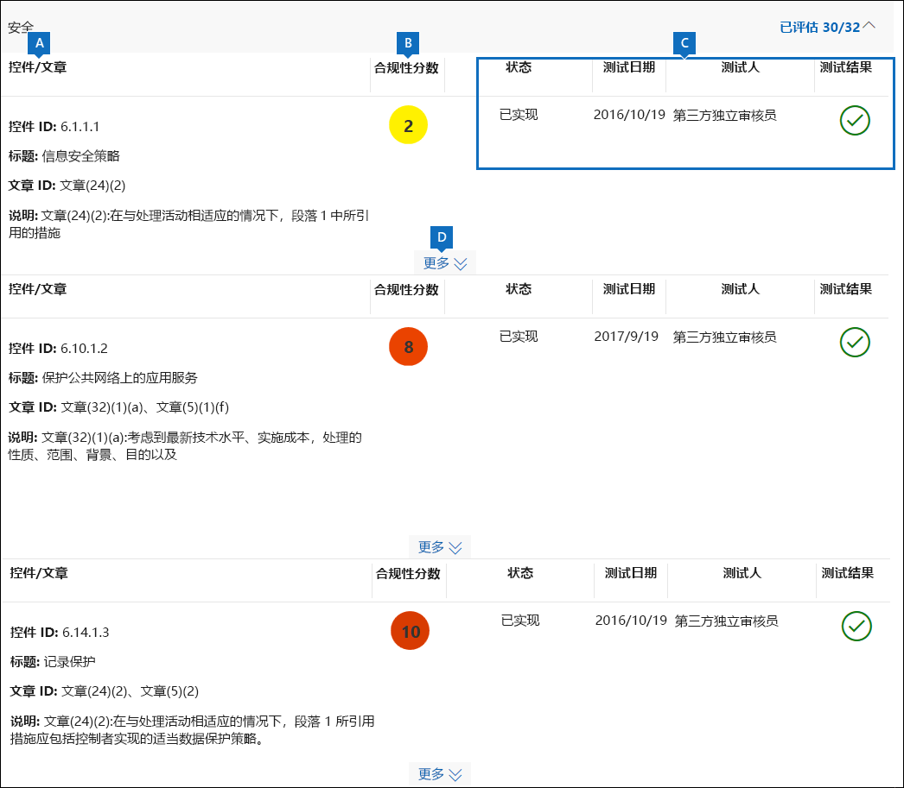
  
  a. 根据映射到 Microsoft 管理的控制措施的认证或法规，指定以下信息。a. Specifies the following information from the certification or regulation that maps to the Microsoft managed control.

  - **控制措施 ID** - 控制措施映射到的认证或法规中的节或条款编号。**Control ID** - The section or article number from the certification or regulation that the control maps to.
    
  - **标题** - 相应认证或法规的标题。**Title** - The title from the corresponding certification or regulation.
    
  - **条款 ID** - 仅当为“GDPR”评估时，才会添加此字段，因为它指定了相应 GDPR 条款编号。**Article ID** - This field is included only for GDPR assessments, as it specifies the corresponding GDPR article number.
    
  - **说明** - 映射到选定 Microsoft 管理的控制措施的标准或法规文本。**Description** - Text of the standard or regulation that maps to the selected Microsoft managed control.

  b. 控制措施的合规性分数，表示与每项 Microsoft 管理的控制措施相关联的风险级别（不合规或无法实现控制措施所带来的风险）。有关详细信息，请参阅[了解合规性分数](#understanding-the-compliance-score)。请注意，合规性分数的评分范围介于 1 和 10 之间，且有颜色标记。黄色表示低风险控制措施，橙色表示中等风险控制措施，红色表示高风险控制措施。b. The Compliance Score for the control, which indicates the level of risk (due to non-compliance or control failure) associated with each Microsoft managed control. See [Understanding the Compliance Score](#understanding-the-compliance-score) for more information. Note that Compliance Scores are rated from 1 to 10 and are color-coded. Yellow indicates low risk controls, orange indicates medium-risk controls, and red indicated high-risk controls. 
    
  c. 说明以下信息：控制措施的实现状态、控制措施的测试日期、测试者和测试结果。c. Information about the implementation status of a control, the date the control was tested, who performed the test, and the test result.
    
  d. 对于每项控制措施，可单击“更多”\*\*\*\* 查看其他信息，包括 Microsoft 的控制措施实现详情，以及独立的第三方审计如何对控制措施进行测试和验证的详细信息。d. For each control, you can click **More** to see additional information, including details about Microsoft's implementation of the control and details about how the control was tested and validated by an independent third-party auditor. 
    
- **客户管理的控制措施** - 这是由组织管理的一系列控制措施。组织负责在合规性流程中实现这些控制措施，以遵守给定标准或法规。客户管理的控制措施也分为多个映射到相应认证或法规的控制措施系列。客户管理的控制措施用于实现 Microsoft 建议的行动，作为合规性活动的一部分。组织可以在每项客户管理的控制措施中使用说明性指导和建议的客户行动，以管理相应控制措施的实现和评估流程。**Customer Managed Controls** - This is the collection of controls that are managed by your organization. Your organization is responsible for implementing these controls as part of your compliance process for a given standard or regulation. Customer managed controls are also organized into control families for the corresponding certification or regulation. Use the customer managed controls to implement the recommended actions suggested by Microsoft as part of your compliance activities. Your organization can use the prescriptive guidance and recommended Customer Actions in each customer managed control to manage the implementation and assessment process for that control.
    
    在评估中，客户管理的控制措施还内置有工作流管理功能，可用于管理和跟踪组织的评估完成进度。例如，组织中的合规部主管可以将行动项分配给 IT 管理员，后者有责任且拥有必要权限，可对控制措施执行建议行动。完成工作后，IT 管理员可以先上传实现任务的证据（例如，配置或策略设置的屏幕截图），再将行动项分配回合规部主管，以方便其评估收集到的证据，测试控制措施的实现，并在合规性管理器中记录实现日期和测试结果。有关详细信息，请参阅本文中的[管理评估流程](#managing-the-assessment-process)部分。Customer managed controls in Assessments also have built-in workflow management functionality that you can use to manage and track your organization's progress towards completing the Assessment. For example, a Compliance Officer in your organization can assign an Action Item to an IT admin who has the responsibility and necessary permissions to perform the actions that are recommended for the control. When that work is complete, the IT admin can upload evidence of their implementation tasks (for example, screen shots of configuration or policy settings) and then assign the Action Item back to the Compliance Officer to evaluate the collected evidence, test the implementation of the control, and record the implementation date and test results in Compliance Manager. For more information, see the [Managing the assessment process](#managing-the-assessment-process) section in the article. 
  
## 权限和基于角色的访问控制Permissions and role-based access control

默认情况下，组织中拥有 Office 365 或 Azure AD 帐户的每个人都有权访问合规性管理器，并能在合规性管理器中执行任何行动。必须向每个合规性管理器角色添加至少一位用户（请参阅下面的说明），才能从默认权限更改为基于角色的访问控制模型。将用户添加到角色后，执行分配给相应角色的行动所需的权限就会从所有用户的默认权限集中删除，只有预配有相应角色的用户，才能访问合规性管理器，并执行相应角色允许的行动。By default, everyone in your organization with an Office 365 or Azure AD account has access to Compliance Manager and can perform any action in Compliance Manager. To change from default permissions to the role-based access control model, at least one user must be added to each Compliance Manager role (see the following instructions). After a user is added to a role, the permissions to perform the actions assigned to that role are removed from the default set of permissions available to all users, and only users that have been provisioned that role will be able to access Compliance Manager and perform the actions allowed by that role.
  
实现了基于角色的访问控制后，任何未分配到已定义合规性管理器角色的用户都拥有来宾访问权限。Once role-based access has been implemented, any user that is not assigned to a defined Compliance Manager role will have Guest access.
  
> [!NOTE]
> 必须将用户添加到每个角色以更改默认权限，才能完全实现基于角色的访问控制，以管理谁能访问合规性管理器并执行行动。例如，如果将用户添加到允许用户管理评估的角色，那么只有此角色的成员才能管理评估。同样，如果没有将用户添加到允许用户读取评估数据的角色，那么组织中的所有用户都可以访问合规性管理器，并读取任何评估的数据。To fully implement role-based access control to manage who can access and perform actions in Compliance Manager, a user must be added to each role to change the default permissions. For example, if you add a user to the role that lets users manage Assessments, only members of that role can manage Assessments. Similarly, if you don't add a user to the role that lets users read the data in Assessments, then all users in your organization can access Compliance Manager and read data in any Assessment. 
  
下表列出了每种合规性管理器权限及其允许用户执行的行动。此表还指明了每种权限分配到的角色。The following table describes each Compliance Manager permission and what it allows the user do. The table also indicates the role that each permission is assigned to.
  
||**合规性管理器读者****Compliance Manager Reader**|**合规性管理器参与者****Compliance Manager Contributor**|**合规性管理器评估员****Compliance Manager Assessor**|**合规性管理器管理员****Compliance Manager Administrator**|**门户管理员****Portal Admin**|
|:-----|:-----|:-----|:-----|:-----|:-----|
|**读取数据** - 用户可读取但不能编辑数据。**Read data** - Users can read but not edit data.    |             |             |             |             |             |
|**编辑数据** - 用户可编辑除“测试结果”和“测试日期”字段以外的其他所有字段。**Edit data** - Users can edit all fields, except the Test Result and Test Date fields.    ||             |             |             |             |
|**编辑测试结果** - 用户可编辑“测试结果”和“测试日期”字段。**Edit test results** - Users can edit the Test Result and Test Date fields.    |||             |             |             |
|**管理评估** - 用户可创建、存档和删除评估。**Manage assessments** - Users can create, archive, and delete Assessments.    ||||             |             |
|**管理用户** - 用户可将组织中的其他用户添加到读者、参与者、评估员和管理员角色。只有组织中拥有全局管理员角色的用户，才能在门户管理员角色中添加或删除用户。**Manage users** - Users can add other users in their organization to the Reader, Contributor, Assessor, and Administrator roles. Only those users with the Global Administrator role in your organization can add or remove users from the Portal Admin role.    |||||             |
   
### 来宾访问权限Guest access
  
在合规性管理器访问权限已配置后，任何没有预配角色的用户都默认拥有**来宾访问权限**角色（这也是个人 Microsoft 帐户等所有非组织预配帐户的体验）。拥有来宾访问权限角色的用户没有对所有合规性管理器功能的完全访问权限，并且看不到组织的任何合规性评估数据，但能使用合规性管理器查看 Microsoft 的合规性评估报告和服务信任文档。若要了解可访问和不可访问的功能有哪些，请参阅下面的两张图，其中用蓝线圈出的部分表示可访问的功能，用红线圈出的部分表示不可访问的功能。After Compliance Manager access has been configured, any user that does not have a provisioned role is in the **Guest access** role by default (which is also the experience of any non-organization-provisioned accounts like personal Microsoft Accounts). Guest Access users do not have full access to all of the Compliance Manager features and are not able to see any of the organization's compliance assessment data, however they are able to use Compliance Manager to view Microsoft's compliance assessment reports and Service Trust documents. For an illustration of what is and is not accessible, see the images below where accessible features are outlined in blue and inaccessible features are outlined in red. 
  
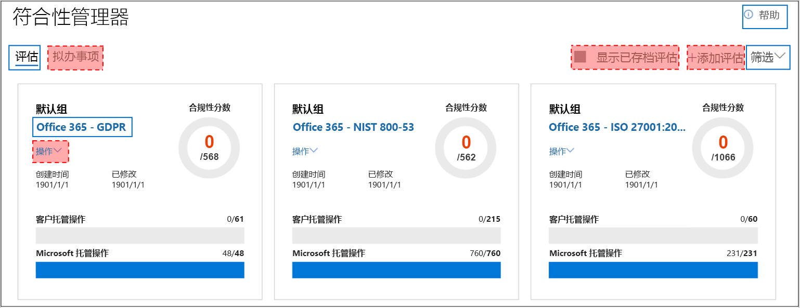
  
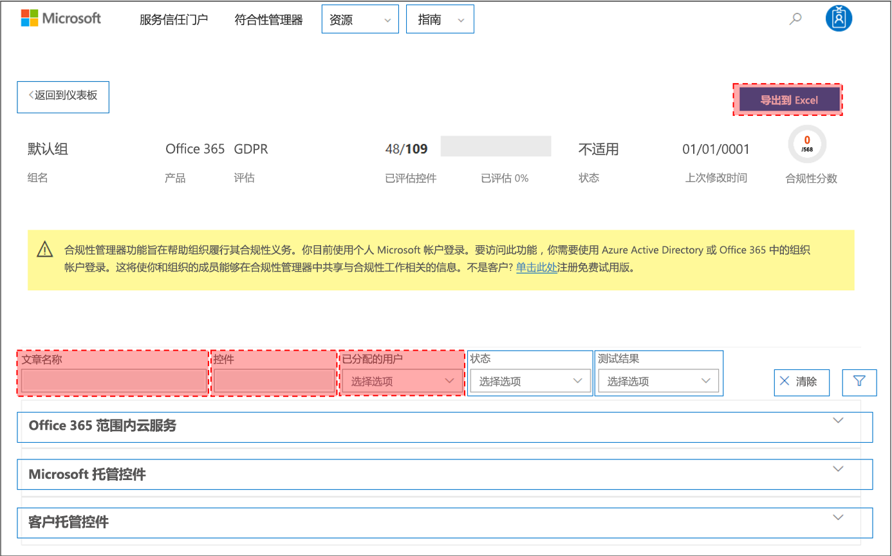

## 了解合规性分数Understanding the Compliance Score

合规性管理器仪表板在磁贴的右上角显示 Office 365 评估总得分。这是评估的总合规性分数，也是评估中所有标记为“已实现”和“已测试”的控制措施评估累积的分数。添加评估时，你会发现合规性分数已有接近满分的趋势，这是因为 Microsoft 管理的控制措施已由 Microsoft 实现，并由独立第三方测试，所以对应的分数已累积。On the Dashboard, Compliance Manager displays a total score for Office 365 assessments in the upper right hand corner of the tile. This is the overall total Compliance Score for the Assessment, and is the accumulation of points received for each control assessment that has been marked as Implemented and Tested in the Assessment. When adding an Assessment, you will see that the Compliance Score is already on the way towards completion because the points for the Microsoft managed controls that have been implemented by Microsoft and tested by independent third parties are already applied.
  
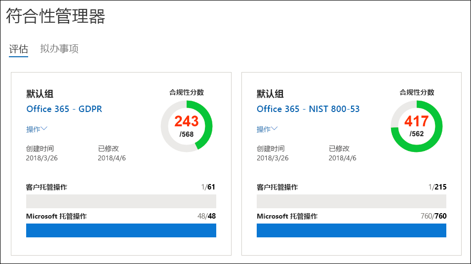
  
剩余分数来自于成功的客户控制措施评估，也来自于实现和测试客户管理的控制措施，其中每项控制措施都有特定的分值累积到总合规性分数中。The remaining points come from the successful customer control assessment, from the implementation and testing of the customer-managed controls, each of which has a specific value that contributes to the overall compliance score. 
  
每项评估均显示基于风险的合规性分数，有助于评估与评估中每项控制措施（包括 Microsoft 管理和客户管理的控制措施）相关联的风险级别（不合规或无法实现控制措施所带来的风险）。每项客户管理的控制措施都分配有可能分数（称为 *“严重程度”*），评分范围介于 1 和 10 之间。控制措施的分数越高，无法实现后的风险系数越高，反之越低。Each Assessment displays a risk-based Compliance Score to help you assess the level of risk (due to non-compliance or control failure) associated with each control (including both Microsoft managed and customer managed controls) in an Assessment. Each customer managed control is assigned a possible number of points (called a  *severity ranking*  ) on a scale from 1 to 10, where more points are awarded for controls associated with a higher risk factor if the control fails, and fewer points are awarded for lower-risk controls. 
  
例如，下面所示的“用户访问管理”评估控制措施的严重性风险级别非常高，分配到的值为 10。For example, the User Access Management assessment control shown below has a very high severity risk ranking, and displays an assigned value of 10.
  
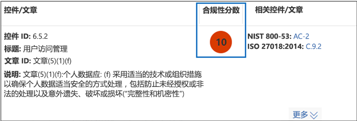
  
 相比之下，下面的“信息备份”评估控制措施的严重性风险级别较低，分配到的值为 3。By comparison, the Information Backup assessment control shown below has a lower severity risk ranking, and displays an assigned value of 3. 
  
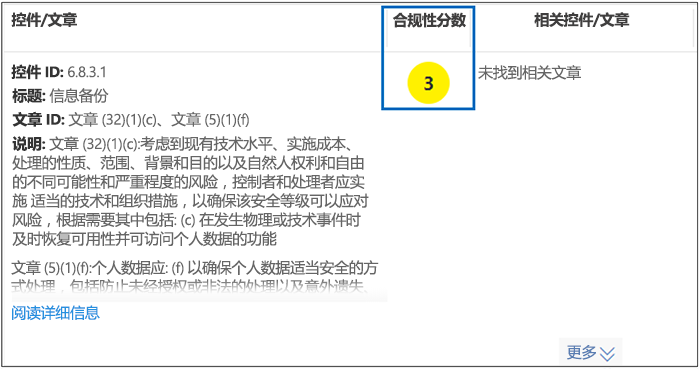
  
合规性管理器向每项控制措施分配默认的严重程度。风险级别是根据以下条件计算得出：The Compliance Manager assigns a default severity ranking to each control. Risk rankings are calculated based on the following criteria:
  
- 控制措施是阻止事件发生（最高级别），还是检测到已发生事件或纠正事件影响（最低级别）。就严重程度而言，杜绝威胁的必需控制措施分配到的分数最高；检测型或纠正型控制措施（无论是否必需）分配到的分数最低。Whether a control prevents incidents from happening (highest ranking), detects incidents that have happened, or corrects the impact of an incident (lowest ranking). In terms of severity ranking, a control that prevents a threat and is mandatory is assigned the highest number of points; controls that are detective or corrective (regardless of whether they're mandatory or discretionary) are assigned the lowest number of points.
    
- 控制措施（在实现后）是用户无法规避的必需措施（例如，用户必须重置密码，并符合密码长度和字符数要求），还是用户可规避的随意措施（例如，要求用户在计算机无人使用时锁定屏幕的业务规则）。Whether a control (after it's been implemented) is mandatory and therefore can't be by-passed by users (for example, users having to reset their password and meet password length and character requirements) or discretionary and can be by-passed by users (for example, business rules that require users to lock their screens when their computers are unattended).
    
- 控制措施与数据机密性、完整性和可用性风险的相关程度，这些风险是来自内部威胁还是来自外部威胁，威胁是恶意还是偶发。例如，与防止员工意外错误配置网络路由器设置而导致网络中断的控制措施相比，帮助防止外部攻击者破坏相应网络并访问个人身份信息的控制措施所分配到的分数更高。Controls related to risks to data confidentiality, integrity, and availability, whether these risks come from internal or external threats, and whether the threat is malicious or accidental. For example, controls that would help prevent an external attacker from breaching that network and gaining access to personally identifiable information would be assigned more points than a control related to preventing an employee from accidentally mis-configuring a network router setting that results in a network outage).
    
- 与法律和外部驱动因素相关的风险，如每项控制措施对应的合同、法规和公开承诺。Risks related to legal and external drivers, such as contracts, regulations, and public commitments, for each control.
    
控制措施的合规性分数值以通过/不通过为基准（控制措施要么得以实现并通过后续评估测试，要么未实现且未通过测试），被*整体*累积到总合规性分数中；不会累积部分实现对应的部分分数。仅当控制措施的“实现状态”\*\*\*\* 设置为“已实现”\*\*\*\*，或“替换实现”\*\*\*\* 和“测试结果”\*\*\*\* 均设置为“通过”\*\*\*\*，才会将控制措施分配到的分数计入总合规性分数。The displayed Compliance Score values for the control are applied  *in their entirety*  to the Total Compliance Score on a pass/fail basis--either the control is implemented and passes the subsequent assessment test or it does not; there is no partial credit for a partial implementation. Only when the control has its **Implementation Status** set to **Implemented** or **Alternative Implementation** and the **Test Result** is set to **Passed** are the assigned points added to the Total Compliance Score. 
  
最重要的是，合规性分数有助于确定优先重点实现哪些控制措施，因为它能指明哪些控制措施未实现后的潜在风险更高。除了便于根据风险确定优先级外，值得一提的是，如果评估控制措施与其他控制措施（无论是在同一个评估内，还是在同一评估分组中的另一个评估内）相关，成功完成一项控制措施可显著减少工作量，因为可同步控制措施测试结果。Most importantly, the Compliance Score can help you prioritize which controls to focus on for implementation by indicating which controls that have a higher potential risk if there is a failure related to a control. In addition to risk-based prioritization, it is worthwhile noting that where assessment controls are related to other controls (either within the same assessment or in another assessment that is in the same assessment grouping) completing a single control successfully can result in a significant reduction of effort based on the synchronization of control test results.
  
例如，在下图中，“Office 365 - GDPR”评估目前已评估 46%，111 项控制措施评估中已完成 51 项，总合规性分数为 289 分（满分可能为 600 分）。For example, in the image below we see that the Office 365 - GDPR Assessment is currently 46% assessed, with 51 of 111 control assessments completed for a Total Compliance score of 289 out of a possible 600.
  
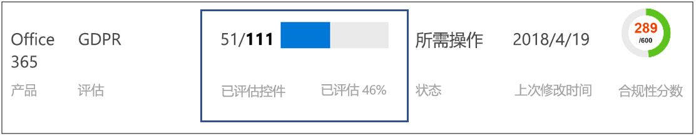
  
在“GDPR”评估中，控制措施 7.5.5 与其他 5 项控制措施（7.4.1、7.4.3、7.4.4、7.4.8 和 7.4.9）相关，其中每项控制措施的严重性风险级别分数为 6 或 8，具有中等风险到高风险。使用评估筛选器，我们选择了所有这些控制措施，以便在评估视图中显示它们。从下图可以看出，尚未对任何一项控制措施进行评估。Within the assessment GDPR control 7.5.5 is related to 5 other controls (7.4.1, 7.4.3, 7.4.4,.7.4.8, and 7.4.9) each with a moderate to high severity risk rating score of 6 or 8). Using the assessment filter, we have selected all of these controls, making them visible in the assessment view, and can see below that none of them have been assessed. 
  
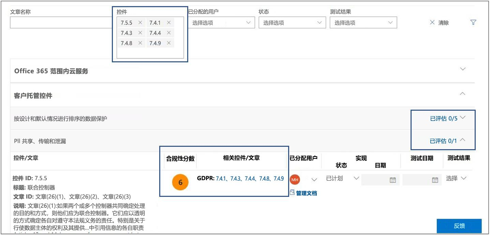 由于这 6 项控制措施相互关联，因此完成其中任何一项控制措施，都会跨此评估中的相关控制措施同步这些测试结果（就像跨同一评估分组中评估内的任何相关控制措施同步测试结果一样）。完成实现和测试 GDPR 控制措施 7.5.5 后，控制措施明细区域便会刷新显示，所有这 6 项控制措施均已获评估，已评估控制措施数会相应地增加到 57，变成已评估 51%，并且总合规性分数也会增加超过 40 分。As those 6 controls are related, the completion of any one them will result in a synchronization of those test results across the related controls within this assessment (just as it will for any related controls in an assessment that is in the same assessment grouping). Upon completion of the implementation and testing of GDPR control 7.5.5, the control detail area refreshes to show that all 6 controls have been assessed, with a corresponding increase in the number of assessed controls to 57 and 51% assessed, and a change in total Compliance Score of +40. 
  
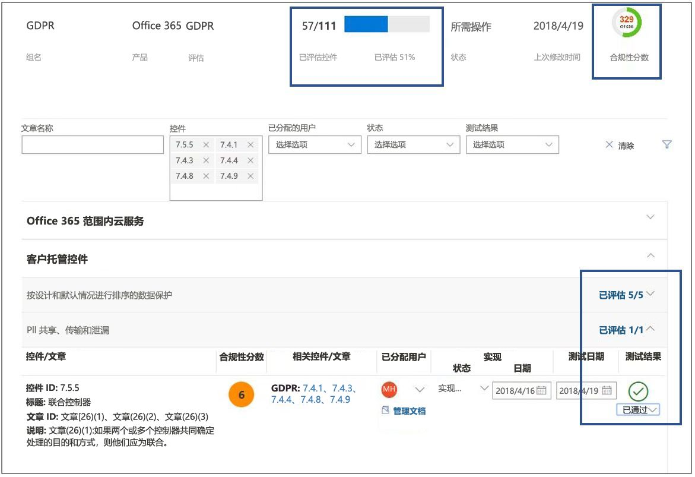
  
若要更改相关控制措施的“实现状态”，并且这会影响其他相关控制措施，就会看到下面的确认更新对话框。This confirmation update dialog box will appear if you are about to change the Implementation Status of a related control in a way that will impact the other related controls.
  
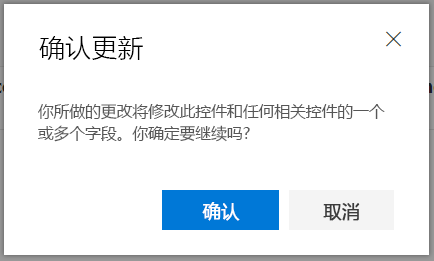
  
> [!NOTE]
> 目前，只有 Office 365 云服务的评估，才有合规性分数。对于 Azure 和 Dynamics 评估，显示的是评估状态。Currently, only Assessments for Office 365 cloud services include a Compliance Score. Assessments for Azure and Dynamics show an assessment status. 

## 合规性分数计算方法Compliance Score methodology

合规性分数（如 Microsoft 安全功能分数）类似于其他基于行为的评分系统；组织可通过执行与数据保护、隐私和安全性相关的活动，增加合规性分数。The Compliance Score, like the Microsoft Secure Score, is similar to other behavior-based scoring systems; your organization's activity can increase its Compliance Score by performing activities related to data protection, privacy, and security.
  
> [!NOTE]
> 合规性分数并不是组织遵守任何特定标准或法规情况的绝对度量。它表示执行控制措施的程度，这些控制措施可降低个人数据和个人隐私面临的风险。任何服务都无法保证遵守标准或法规，不得以任何方式将合规性分数解读为保证。The Compliance Score does not express an absolute measure of organizational compliance with any particular standard or regulation. It expresses the extent to which you have adopted controls which can reduce the risks to personal data and individual privacy. No service can guarantee that you are compliant with a standard or regulation, and the Compliance Score should not be interpreted as a guarantee in any way. 
  
合规性管理器中的评估以云计算的共同责任模型为依据。在共同责任模型中，Microsoft 和每位客户共同承担保护云中存储的客户数据的责任。Assessments in Compliance Manager are based on the shared responsibility model for cloud computing. In the shared responsibility model, Microsoft and each customer share responsibility for the protection of the customer's data when that data is stored in our cloud.
  
如下面的“Office 365 - GDPR”评估所示，Microsoft 和客户各自负责执行各种行动，这些行动旨在符合评估依据的标准或法规要求。为了合理解释和理解跨各种标准和法规的必需行动，合规性管理器将所有标准和法规都视为控制措施框架。因此，Microsoft 和客户为每项评估执行的行动涉及实现和验证各种控制措施。As shown in the Office 365 GDPR Assessment below, Microsoft and customers are each responsible for performing a variety of Actions that are designed to satisfy the requirements of the standard or regulation being assessed. To rationalize and understand the required Actions across a variety of standards and regulations, Compliance Manager treats all standards and regulations as if they were control frameworks. Thus, the Actions performed by Microsoft and by customers for each Assessment involve the implementation and validation of various controls.
  
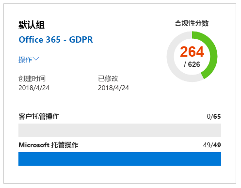
  
下面是典型行动的基本工作流：Here's the basic workflow for a typical Action:
  
1. 组织的合规部、风险部、隐私部和/或数据保护部主管将任务分配给组织中的某人，让其实现控制措施。此人可能是：The Compliance, Risk, Privacy, and/or Data Protection Officer of an organization assigns the task to someone in the organization to implement a control. That person could be:

    - 业务策略所有者A business policy owner
    
    - IT 实现者An IT implementer
    
    - 组织中另一个负责执行任务的人员Another individual in the organization who has responsibility for performing the task
    
2. 此人执行实现控制措施所需的任务，将控制措施实现证据上传到合规性管理器，并将与行动相关联的一项或多项控制措施标记为“已实现”。完成这些任务后，此人便会将行动分配给评估员以供验证。评估员可以是：That individual performs the tasks necessary to implement the control, uploads evidence of implementation into Compliance Manager, and marks the control(s) tied to the Action as implemented. Once these tasks are completed, they assign the Action to an Assessor for validation. Assessors can be:
    
    - 在组织内部验证控制措施的内部评估员Internal assessors that perform validation of controls within an organization
    
    - 检查、验证和认证合规性的外部评估员，如审核 Microsoft 云服务的第三方独立组织External assessors that examine, verify, and certify compliance, such as the third-party independent organizations that audit Microsoft's cloud services
    
3. 评估员验证控制措施并检查证据，然后将一项或多项控制措施标记为“已评估”，并记录评估结果（例如，“通过”）。The Assessor validates the control and examines the evidence and marks the control(s) as assessed and the results of the assessment (e.g., passed).
    
当与评估相关联的所有控制措施都已获评估后，便认为评估已完成。Once all the controls associated with an Assessment have been assessed, the Assessment is considered completed.
  
合规性管理器中的每项评估都预加载有信息，详细介绍了 Microsoft 为符合自己负责的控制措施的要求而执行的行动。此类信息详细介绍了 Microsoft 是如何实现每项控制措施的，以及第三方审计是如何、何时评估和验证 Microsoft 实现的控制措施。因此，每项评估的 Microsoft 管理的控制措施都标记为“已评估”，并且评估的合规性分数也反映了这一点。Every Assessment in Compliance Manager comes pre-loaded with information that provides details about the Actions taken by Microsoft to satisfy the requirements of the controls for which Microsoft is responsible. This information includes details about how Microsoft has implemented each control and how and when Microsoft's implementation was assessed and verified by a third-party auditor. For this reason, the Microsoft Managed Controls for each Assessment are marked as Assessed, and the Compliance Score for the Assessment reflects this.
  
每项评估都包含以共同责任模型为依据的总合规性分数。Microsoft 对 Office 365 控制措施的实现和测试仅占与“GDPR”评估相关联的可能满分的一部分。随着客户实现和测试每项客户行动，评估的合规性分数会递增控制措施分配到的分数值。Each Assessment includes a total Compliance Score based on the shared responsibility model. Microsoft's implementation and testing of controls for Office 365 contributes a portion of the total possible points associated with a GDPR assessment. As the customer implements and tests each of the customer Actions, the Compliance Score for the Assessment will increase by the value assigned to the control. 
  
 ### 基于风险的评分方法Risk-based scoring methodology
  
合规性管理器使用基于风险的评分方法，评分范围介于 1 和 10 之间。分数高的控制措施表示，无法实现控制措施或不合规所带来的风险高。合规性分数使用的评分系统以多个关键因素为依据，如：Compliance Manager uses a risk-based scoring methodology with a scale from 1-10 that assigns a higher value to controls that represent a higher risk in the event the control fails or is non-compliant. The scoring system used by Compliance Score is based on several key factors, such as:
  
- 控制措施的本质The essence of the control
    
- 以威胁种类为依据的控制措施风险级别The level of risk of the control based on the kinds of threats
    
- 控制措施的外部驱动因素The external drivers for the control
    
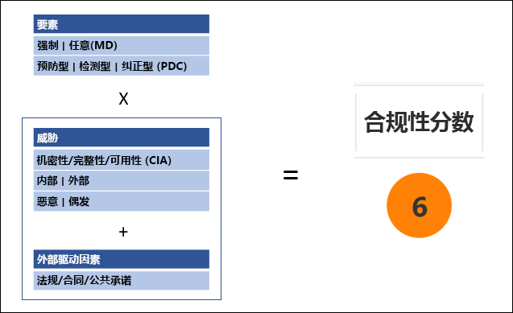
  
 ### 控制措施的本质Essence of the control
  
控制措施的本质依据的是，控制措施是必需还是随意控制措施，以及控制措施是预防型、检测型还是纠正型。The essence of the control is based on whether the control is Mandatory or Discretionary, and whether it is Preventative, Detective, or Corrective.
  
 ### 必需或随意Mandatory or discretionary
  
 *必需控制措施*是无法规避的控制措施，无论是有意还是无意。常见的必需控制措施示例是，规定必须满足密码长度、复杂程度和到期要求的集中管理密码策略。用户必须遵守这些要求，才能访问系统。*Mandatory controls*  are controls that cannot be bypassed either intentionally or accidentally. An example of a common mandatory control is a centrally-managed password policy that sets requirements for password length, complexity, and expiration. Users must comply with these requirements in order to access the system. 
  
 *随意控制措施*依赖用户了解策略并采取相应行动。例如，要求用户在离开时锁定计算机的策略就是随意控制措施，因为它依赖用户。*Discretionary controls*  rely upon users to understand policy and act accordingly. For example, a policy requiring users to lock their computer when they leave it is a discretionary control because it relies on the user. 
  
 ### 预防型、检测型或纠正型Preventative, detective, or corrective
  
 *预防型控制措施*是指防范特定风险的控制措施。例如，通过加密保护静态信息是抵御攻击、泄露等行为的预防性控制措施。职责分离是管理利益冲突和防范欺诈的预防性控制措施。*Preventative controls*  are those that prevent specific risks. For example, protecting information at rest using encryption is a preventative control against attacks, breaches, etc. Separation of duties is a preventative control to manage conflict of interest and to guard against fraud. 
  
 *检测型控制措施*是指主动监视系统以发现异常条件或行为的控制措施，这些异常条件或行为代表风险，或可用于检测入侵或确定是否出现了漏洞。例如，系统访问审核和特权管理行动审核是检测型监视控制措施；合规性审核是用于发现流程问题的检测型控制措施。*Detective controls*  are those that actively monitor systems to identify irregular conditions or behaviors that represent risk or that can be used to detect intrusions or determine if a breach has occurred. System access auditing and privileged administrative actions auditing are types of detective monitoring controls; regulatory compliance audits are a type of detective control used to find process issues. 
  
 *纠正型控制措施*是指试图将安全事件的负面影响降至最低，采取纠正措施以减少直接影响，并尽可能逆转损失的控制措施。例如，隐私事件响应是纠正型控制措施，用于在出现泄露后止损，并将系统还原到可运行状态。*Corrective controls*  are those that try to keep the adverse effects of a security incident to a minimum, take corrective action to reduce the immediate effect, and reverse the damage, if possible. Privacy incident response is a corrective control to limit damage and restore systems to an operational state after a breach. 
  
我们根据这些因素评估每项控制措施，从而确定控制措施的本质，并向它分配与之所代表的风险相关的分数值。By evaluating each control using these factors, we determine the essence of the control and assign it a value relative to the risk that it represents.
  
 **威胁****Threat**
  
||||
|:-----|:-----|:-----|
||**必需****Mandatory**   |**随意****Discretionary**   |
|**预防型****Preventative**   |高风险High risk    |中等风险Medium risk    |
|**检测型****Detective**   |中等风险Medium risk    |低风险Low risk    |
|**纠正型****Corrective**   |中等风险Medium risk    |低风险Low risk    |
   
威胁是指任何对公认的基本安全标准构成风险的要素。这一标准就是所谓数据 CIA 三概念，分别为机密性、完整性和可用性：Threat refers to anything that poses a risk to the fundamental, universally-accepted security standard known as the CIA triad for data: Confidentiality, Integrity, and Availability:
  
- 机密性是指信息只能被受信任的授权方读取和理解。Confidentiality means that information can be read and understood only by trusted, authorized parties.
    
- 完整性是指信息尚未被未授权方修改或销毁。Integrity means that information has not been modified or destroyed by unauthorized parties.
    
- 可用性是指信息可供轻松访问，并能获取优质服务。Availability means that information can be accessed readily with a high level of quality of service.
    
不符合其中任一特性都被视为影响整个系统。威胁可能来自内部源，也可能来自外部源；参与者的意图可能是偶发的，也可能是恶意的。威胁矩阵对这些因素进行估计，并为各种方案组合分配高、中等、低威胁级别。A failure of any of these characteristics is considered a compromise of the system as a whole. Threats can come from both internal and external sources, and an actor's intent can be accidental or malicious. These factors are estimated in a threat matrix that assigns threat levels of either High, Moderate, or Low to each combination of scenarios.

||**内部****Internal** ||**外部****External** ||||
|:-----|:-----|:-----|:-----|:-----|:-----|:-----|
||*恶意**Malicious* |*偶发**Accidental* |*恶意**Malicious* |*偶发**Accidental* |||
|**机密性****Confidentiality** |（高、中等或低）(H, M, or L)    |（高、中等或低）(H, M, or L)    |（高、中等或低）(H, M, or L)    |（高、中等或低）(H, M, or L)|
|**完整性****Integrity** |（高、中等或低）(H, M, or L)    |（高、中等或低）(H, M, or L)    |（高、中等或低）(H, M, or L)    |（高、中等或低）(H, M, or L)|
|**可用性****Availability** |（高、中等或低）(H, M, or L)    |（高、中等或低）(H, M, or L)    |（高、中等或低）(H, M, or L)    |（高、中等或低）(H, M, or L)|
   
 **外部驱动因素****External drivers**
  
|**合同****Contracts**|**法规****Regulations**|**公开承诺****Public commitments**|
|:-----|:-----|:-----|
|（高、中等或低）(H, M, or L)    |（高、中等或低）(H, M, or L)    |（高、中等或低）(H, M, or L)    |
   
适用法规、合同和公开承诺等外部因素可能会影响旨在保护数据和防止数据泄露的控制措施，其中每个因素都分配有风险值，或分配有高、中等、低风险级别。External factors such as applicable regulations, contracts, and public commitments can influence controls designed to protect data and prevent data breaches, and each of these factors are assigned risk values or High, Moderate or Low.
  
计算风险权重时也考虑到，在这些高、中等、低风险级别对应的风险值，在“CIA/威胁和法律/外部驱动因素”中介绍的 15 种可能风险方案内估计会出现多少次风险，即在给定值出现风险的可能性和次数，计算控制措施的严重程度时也会将这一点考虑在内。The estimated number of occurrences of these risk values of High, Moderate, or Low across the 15 possible risk scenarios represented in the CIA/Threat and Legal/External Drivers are combined to provide a risk weighting, which considers the likelihood and number of occurrences of risks at a given value as significant and is taken into consideration when calculating the severity ranking of the control.
  
根据控制措施的严重程度，控制措施分配有合规性分数值（即介于 1（低）和 10（高）之间的数字），分为以下几种风险类别：Based on the control's severity ranking, the control is assigned its compliance score value, a number between 1 (low) and 10 (high), grouped into the following categories of risk:
  
|**风险级别****Risk level**|**控制措施分数值****Control value**|
|:-----|:-----|
|低Low    |1-31-3    |
|中等Moderate    |66    |
|高High    |88    |
|严重Severe    |1010    |
   
通过按合规性分数值从高到低的顺序确定评估控制措施的优先级，组织可以最高风险项为重点，并相应地获得更高正反馈，即完成的每项控制措施评估累积到评估总合规性分数中的分数更多。By prioritizing assessment controls with the highest compliance score values, the organization will be concentrating on the highest risk items and receive proportionally higher positive feedback in the form of more points added to the total compliance score for the assessment for each control assessment completed.
  
### 评分方法总结Summmary of scoring methodology
  
合规性分数是合规性管理器帮助组织了解并管理合规性的核心组件。评估的合规性分数以数字形式展现了公司遵守给定标准或法规的情况，分数越高（满分为评估分配到的最高分数），公司的合规性态势越好。了解合规性评分方法（即向评估控制措施分配介于 1 和 10（从低到高）之间的风险严重程度值），以及完成的控制措施评估的分数如何计入总合规性分数，对组织确定行动优先级至关重要。The Compliance Score is a core component of the way that Compliance Manager helps organizations understand and manage their compliance. The Compliance Score for an assessment is an expression of the company's compliance with a given standard or regulation as a number, where the higher the score (up to the maximum number of points allocated for the Assessment), the better the company's compliance posture. Understanding the compliance scoring methodology in which assessment controls are assigned risk severity values between 1- 10 (low to high), and how completed control assessments add to the total compliance score is crucial to organizations for prioritizing their actions.

## 对评估进行分组Grouping Assessments

当你新建评估时，系统会提示你新建将评估分配到的组，或将评估分配到现有组。借助组，可以按逻辑整理评估，并在包含相同或相关客户管理的控制措施的评估之间共用公共信息和工作流任务。When you create a new Assessment, you're prompted to create a new group to assign the Assessment to or assign the Assessment to an existing group. Groups allow you to logically organize Assessments and share common information and workflow tasks between Assessments that have the same or related customer managed controls.
  
例如，可以按年份或组织内的团队、部门或机构对评估进行分组，也可以按年份进行分组。下面的示例展示了一些组及其中可能包含的评估。For example, you could group Assessments by year or teams, departments, or agencies within your organization or group them by year. Here are some examples of groups and the Assessments they might contain.
  
- “GDPR”评估 - 2018 年GDPR Assessments - 2018
    
  - Office 365 + GDPROffice 365 + GDPR
    
  - Azure + GDPRAzure + GDPR
    
  - Dynamics + GDPRDynamics + GDPR
    
- “Azure”评估 - 2018 年Azure Assessments - 2018
    
  - Azure + GDPRAzure + GDPR
    
  - Azure + ISO 27001:2013Azure + ISO 27001:2013
    
  - Azure + ISO 27018:2014Azure + ISO 27018:2014
    
- “数据安全和隐私”评估Data Security and Privacy Assessments
    
  - Office 365 + ISO 27001:2013Office 365 + ISO 27001:2013
    
  - Office 365 + ISO 27018:2014Office 365 + ISO 27018:2014
    
  - Azure + ISO 27001:2013Azure + ISO 27001:2013
    
  - Azure + ISO 27018:2014Azure + ISO 27018:2014
    
> [!TIP]
> 建议在添加新评估前，先确定组织的分组策略。We recommend that your determine a grouping strategy for your organization before adding new assessments. 
  
下面介绍了评估分组要求：These are the requirements for grouping Assessments:
  
- 组名（亦称为 *“组 ID”*）在组织中必须是唯一的。Group names (also called  *Group IDs*  ) must be unique within your organization. 
    
- 组可以包含相同认证/法规的评估，但每个组只能包含特定云服务/认证对的一个评估。例如，一个组不能包含 Office 365 和 GDPR 的两个评估。同样，一个组可以包含相同云服务的多个评估，只要每个评估对应的认证/法规不同即可。Groups can contain Assessments for the same certification/regulation, but each group can only contain one Assessment for a specific cloud service/certification pair. For example, a group can't contain two Assessments for Office 365 and GDPR. Similarly, a group can contain multiple Assessments for the same cloud service as long as the corresponding certification/regulation for each one is different.
    
一旦将评估添加到评估分组中，便无法再更改分组。可重命名评估组，这也会重命名与相应组关联的所有评估的评估分组的名称。可以新建评估和评估组，也可以从现有评估中复制信息，这实际上是在其他评估组中创建相应评估的副本。存档评估会破坏评估与评估组之间的关系；已存档评估不会再体现对其他相关评估的任何后续更新。Once an assessment has been added to an assessment grouping, the grouping cannot be changed. You can rename the assessment group, which changes the name of the assessment grouping for all of the assessments associated with that group. You can create a new assessment and a new assessment group and copy information from an existing assessment, which effectively creates a duplicate of that assessment in a different assessment group. Archiving an assessment breaks the relationship between that assessment and the assessment group; any further updates to other related assessments are no longer reflected in the archived assessment.
  
如前所述，使用组的关键优势之一是，如果同一组中的两个不同评估共用相同的客户管理的控制措施（因此每项控制措施的客户行动都是一样的），那么一项评估中控制措施的完成实现详情、测试信息和状态就会同步到这一组中其他任何评估内的相同控制措施。换言之，如果同一组中的评估共用相同的控制措施，那么只需管理一项评估中控制措施的评估流程。这项控制措施的结果会自动同步到其他评估。例如，ISO 27001 和 ISO 27018 都有与密码策略相关的控制措施。如果一项评估中控制措施的“测试状态”设置为“通过”，那么另一项评估中的控制措施也会进行更新（并标记为“通过”），只要两项评估都位于同一个评估组中即可。As previous explained, one key advantage of using groups is that when two different Assessments in the same group share the same customer managed control (and therefore the customer actions would be the same for each control), then the completion of implementation details, testing information, and status for the control in one Assessment would be synchronized to the same control in any other Assessment in the group. In other words, if Assessments share the same control and those Assessments are in the same group, you'd only have to manage the assessment process for the control in one Assessment. The results for that control will be automatically synchronized to other Assessments. For example, ISO 27001 and ISO 27018 both have a control related to password policies. If the Test Status for the control is set to "Passed" in one Assessment, the control will be updated (and marked as "Passed") in the other Assessment, as long as both assessments are part of the same Assessment Group.
  
例如，假设有两项相关的评估控制措施，分别是“Office 365 - GDPR”评估中的控制措施 6.10.1.2 和“Office 365 - NIST 800-53”评估中的控制措施 SC-13，均与公用网络上的数据加密有关。这两项相关的评估控制措施位于默认组中的两个不同评估内；最初，这两项评估都没有完成任何客户控制措施评估，如显示这两项评估的合规性管理器仪表板所示。As an example of this, consider these two related assessment controls, each having to do with encryption of data on public networks, control 6.10.1.2 in the Office 365 - GDPR assessment, and control SC-13 in the Office 365 - NIST 800-53 assessment. These are related assessment controls, in two different assessments, both in the Default Group; initially, neither assessment has completed any customer control assessments, as is displayed on the Compliance Manager Dashboard that shows these two Assessments.
  

  
单击“Office 365 - GDPR”\*\*\*\* 评估，并使用筛选器控件筛选出 GDPR 控制措施 6.10.1.2 后，就会发现 NIST 800-53 控制措施 SC-13 被列为相关控制措施。By clicking the **Office 365 - GDPR** assessment, and using the filter controls to view GDPR control 6.10.1.2, we see that NIST 800-53 control SC-13 is listed as a related control.
  
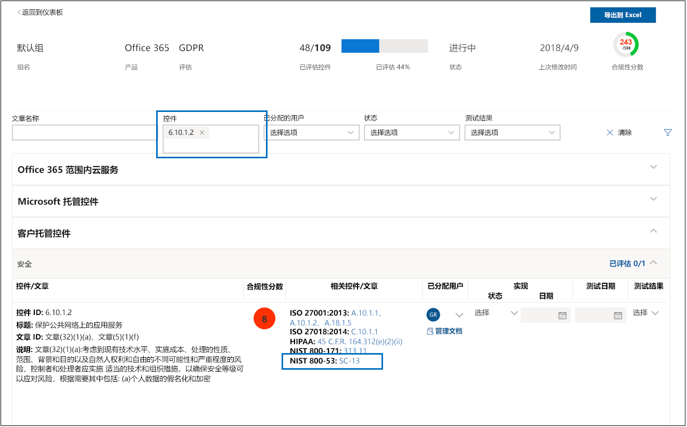
  
 下图说明 GDPR 控制措施 6.10.1.2 的实现和测试已完成。Here we show the completion of the implementation and testing of GDPR control 6.10.1.2. 
  
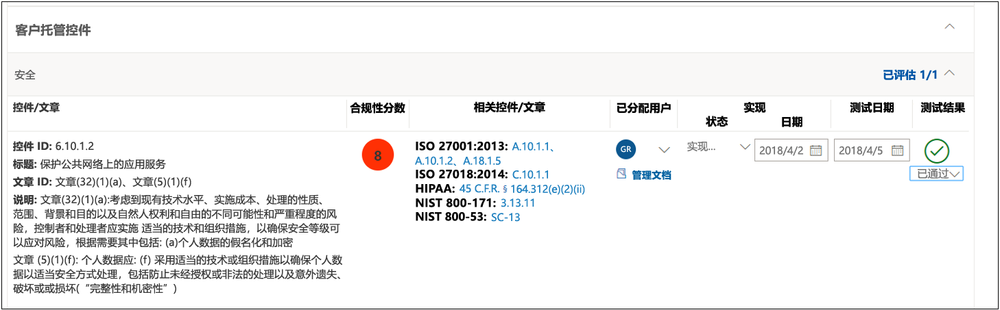
  
通过转到已分组评估中的相关控制措施，我们发现 NIST 800-53 SC-13 也已在相同的日期和时间标记为完成，无需执行其他任何实现或测试工作。By navigating to the related control in the grouped assessment, we see that NIST 800-53 SC-13 has also been marked as completed with the same date and time, with no additional implementation or testing effort.
  
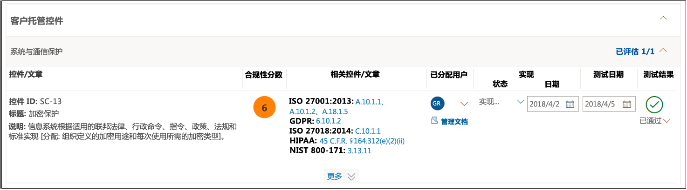
  
返回到仪表板，可以看到每项评估都完成了 1 项控制措施评估，并且每项评估的总合规性分数增加了 8 分（即共用控制措施分配到的合规性分数值）。Back at the Dashboard, we can see that each assessment has 1 control assessment completed and that the total Compliance Score for each assessment has increased by 8 (the compliance score value of that shared control).
  
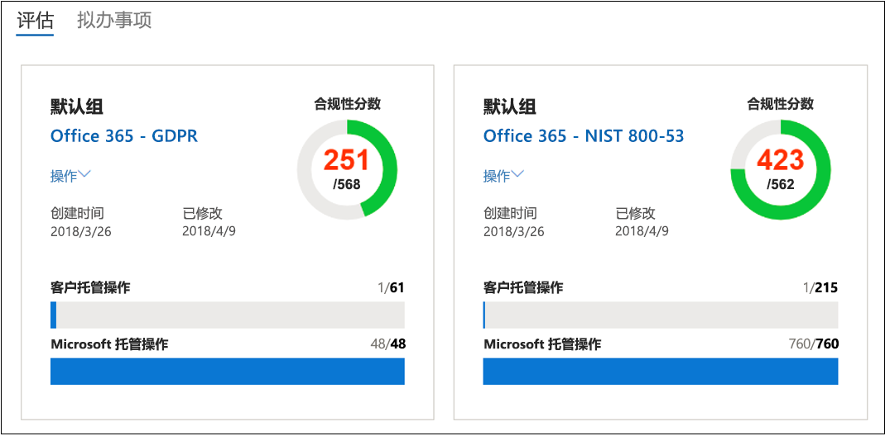

## 管理功能Administrative functions

有一些特定的管理功能只对租户管理员帐户可用，并且只有在以全局管理员身份登录时才可见。There are specific administrative functions that are only available to the tenant administrator account, and will only be visible when logged in as a global administrator.
  
> [!NOTE]
> 使用下拉列表中的“对受限文档的访问权限”，管理员可以向用户授予对 Microsoft 在服务信任门户上共享的受限文档的访问权限。“受限文档”功能暂不可用，但即将推出。The Access to Restricted Documents permission in the drop-down list will allow administrators to give users access to restricted documents that Microsoft shares on the Service Trust Portal. The Restricted Documents feature isn't available, but is coming soon. 
  
### 向用户分配合规性管理器角色Assigning Compliance Manager roles to users

每个合规性管理器角色的权限略有不同。可查看分配给每个角色的权限，也可查看哪些用户拥有哪些角色，并能通过服务信任门户在相应角色中添加或删除用户，具体方法是依次选择“管理员”\*\*\*\* 菜单项和“设置”\*\*\*\*。Each Compliance Manager role has slightly different permissions. You can view the permissions assigned to each role, see which users are in which roles, and add or remove users from that role through the Service Trust Portal by selecting the **Admin** menu item, and then choosing **Settings**. 
  

  
若要在合规性管理器角色中添加或删除用户，请执行以下操作。To add or remove users from Compliance Manager roles.
  
1. 转到 [https://servicetrust.microsoft.com](https://servicetrust.microsoft.com)。Go to [https://servicetrust.microsoft.com](https://servicetrust.microsoft.com).
    
2. 使用 Azure Active Directory 全局管理员帐户登录。Sign in with your Azure Active Directory global administrator account.
    
3. 单击服务信任门户顶部菜单栏中的“管理员”\*\*\*\*，再选择“设置”\*\*\*\*。On the Service Trust Portal top menu bar, click **Admin** and then choose **Settings**. 
    
4. 在“选择角色”\*\*\*\* 下拉列表中，单击要管理的角色。In the **Select Role** drop-down list, click the role that you want to manage. 
    
5. “选择角色”\*\*\*\* 页上会列出已添加到每个角色的用户。Users added to the each role are listed on the **Select Role** page. 
    
6. 若要将用户添加到此角色，请单击“添加”\*\*\*\*。在“添加用户”\*\*\*\* 对话框中，单击用户字段。可滚动浏览可添加用户列表，也可开始键入用户名以按搜索词筛选列表。单击用户字段即可将相应帐户添加到“添加用户”\*\*\*\* 列表中，使其预配有相应角色。若要同时添加多个用户，请先键入用户名以筛选列表，再单击要添加到列表的用户。单击“保存”\*\*\*\*，以向这些用户预配选定角色。To add users to this role, click **Add**. In the **Add Users** dialog, click the user field. You can scroll through the list of available users or begin typing the user name to filter the list based on your search term. Click the user to add that account to the **Add Users** list to be provisioned with that role. If you would like to add multiple users concurrently, begin typing a user name to filter the list, and then click the user to add to the list. Click **Save** to provision the selected role to these users. 
    
    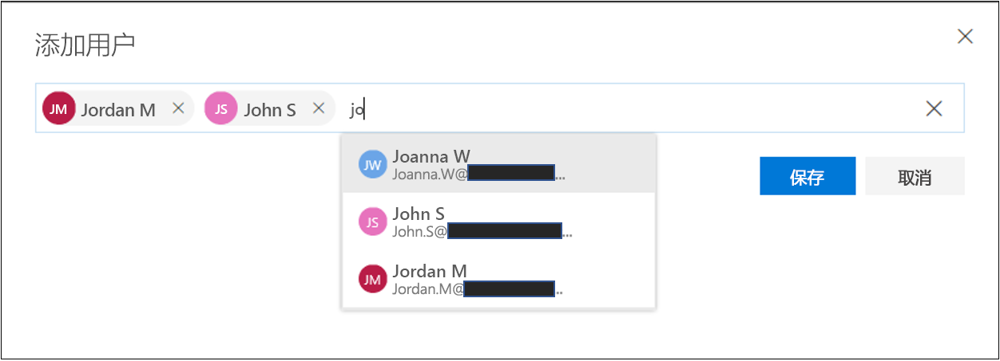
  
7. 若要从此角色中删除用户，请先选择一个或多个用户，再单击“删除”\*\*\*\*。To remove users from this role, select the user(s) and click **Delete**. 
    
    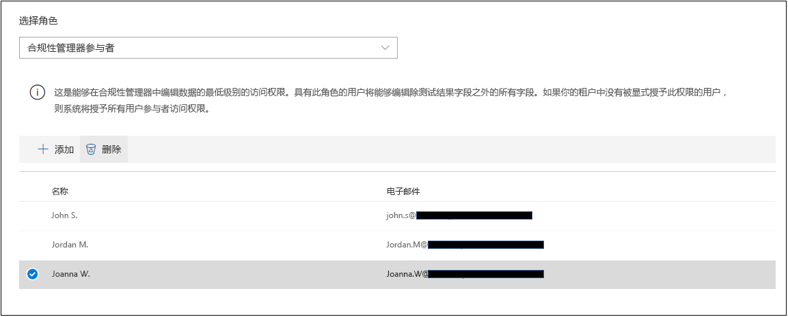
 
## 用户隐私设置User Privacy settings

一些法规要求，组织必须能够删除用户历史记录数据。为了方便组织遵守这项要求，合规性管理器提供了“用户隐私设置”\*\*\*\* 功能，可便于管理员：Certain regulations require that an organization must be able to delete user history data. To enable this, Compliance Manager provides the **User Privacy Settings** functions, that allow administrators to: 
  
- [搜索用户Search for a user](#search-for-a-user)

- [导出帐户数据历史记录报告Export a report of account data history](#export-report-of-account-data-history)

- [重新分配行动项Reassign action items](#reassign-action-items)

- [删除用户数据历史记录Delete user data history](#delete-user-data-history)
    

  
### 搜索用户Search for a user

若要搜索用户帐户，请执行以下操作：To search for a user account:
  
1. 输入别名（即 @ 符号左侧的信息），并通过单击右侧的域后缀列表来选择域名，从而输入用户电子邮件地址。如果这是有多个已注册域的租户，可仔细检查电子邮件地址域名后缀，以确保它正确无误。Enter the user email address by typing in the alias (the information to the left of the @ symbol) and choosing the domain name by clicking on the domain suffix list on the right. If this is tenant with multiple registered domains, you can double check the email address domain name suffix to ensure that it is correct.
    
2. 正确输入用户名后，单击“搜索”\*\*\*\*。When you have the username correctly entered, click **Search**. 
    
3. 如果找不到用户帐户，页面上会显示错误消息“找不到用户”。请检查用户的电子邮件地址信息是否正确。必要时，更正电子邮件地址，并单击“搜索”\*\*\*\* 重试。If the user account is not found, the error message 'User not found' will be displayed on the page. Check the user's email address information, make corrections as necessary and click **Search** to try again. 
    
4. 如果找到了用户帐户，按钮文本会从“搜索”\*\*\*\* 更改为“清除”\*\*\*\*，这表明返回的用户帐户是下方显示的附加功能的操作上下文，运行这些功能会应用于此用户帐户。If user account is found, the text of the button will change from **Search** to **Clear**, which indicates that the returned user account is the operating context for the additional functions that will be displayed below, that running those functions will apply to this user account. 
    
5. 若要清除搜索结果并搜索其他用户，请单击“清除”\*\*\*\*。To clear search results and search for a different user, click **Clear**. 
    
### 导出帐户数据历史记录报告Export a report of account data history

建议在确定用户帐户后，生成与此帐户相关联的依赖项的报告。根据此类信息，可重新分配未完成行动项，或确保有权访问之前上传的证据。Once the user account has been identified, you may wish to generate a report of dependencies that exist linked to this account. This information will allow you to reassign open action items or ensure access to previously uploaded evidence. 
  
 若要生成并导出报告，请执行以下操作：To generate and export a report:
  
1. 单击“导出”\*\*\*\*，生成并下载当前分配给已返回用户帐户的合规性管理器控制措施行动项的报告，以及此用户上传的文档列表。如果没有分配的行动或上传的文档，就会看到错误消息“此用户无数据”。Click **Export** to generate and download a report of the Compliance Manager control action items currently assigned to the returned user account, as well as the list of documents uploaded by that user. If there are no assigned actions or uploaded documents, an error message will state "No data for this user". 
    
2. 报告是在活动浏览器窗口的后台进行下载（如果没有看到下载弹出窗口，建议查看浏览器下载历史记录）。The report downloads in the background of the active browser window - if you don't see a download popup you want to check your browser download history.
    
3. 打开文档即可查看报告数据。Open the document to review the report data.
    
> [!NOTE]
> 这并不是保留和显示行动项分配历史记录状态变更的历史记录报告。生成的报告是在报告运行时分配的控制措施行动项的快照（日期和时间戳已写入报告）。例如，如果为同一用户重新生成此报告，任何后续重新分配行动项都会导致生成不同的快照报告数据。This is not a historical report that retains and displays state changes to action item assignment history. The generated report is a snapshot of the control action items assigned at the time that the report is run (date and time stamp written into the report). For instance, any subsequent reassignment of action items will result in different snapshot report data if this report is generated again for the same user. 
  
### 重新分配行动项Reassign action items

使用此功能，组织可以删除用户帐户的任何活动或未完成的依赖项，具体方法是将所有行动项所有权（包括活动和已完成的行动项）从已返回用户帐户重新分配到下面选定的新用户。此操作不会更改已返回用户帐户的文档上传历史记录。This function enables an organization to remove any active or outstanding dependencies on the user account by reassigning all action item ownership (which includes both active and completed action items) from the returned user account to a new user selected below. This action does not change document upload history for the returned user account. 
  
 若要向其他用户重新分配行动项，请执行以下操作：To reassign action items to another user:
  
1. 单击输入框，浏览并选择组织内的另一名用户，向其分配已返回用户的行动项。Click the input box to browse for and select another user within the organization to whom the returned user's action items should be assigned.
    
2. 选择“替换”\*\*\*\*，将所有控制措施行动项从已返回用户重新分配给新选择的用户。Select **Replace** to reassign all control action items from the returned user to the newly selected user. 
    
3. 此时，系统会显示确认对话框，提示“这会将所有控制措施行动项从当前用户重新分配给选定用户。此操作无法撤消。确定要继续吗?”A confirmation dialog box appear stating "This will reassign all control action items from the current user to the selected user. This action cannot be undone. Are you sure you want to continue?"
    
4. 若要继续，请单击“确定”\*\*\*\*；否则，请单击“取消”\*\*\*\*。To continue click **OK**,, otherwise click **Cancel**. 
    
> [!NOTE]
> 所有行动项（包括活动和已完成的行动项）都会分配给新选定用户。不过，此操作并不影响文档上传历史记录；以前分配的用户上传的任何文档仍会显示日期/时间，以及以前分配的用户的用户名。All action items (both active and completed) will be assigned to the newly selected user. However, this action does not affect the document upload history; any documents uploaded by the previously assigned user will still show the date/time and name of the previously assigned user. 
  
若要将文档上传历史记录更改为删除以前分配的用户，必须手动完成。在这种情况下，管理员必须执行以下操作：Changing the document upload history to remove the previously assigned user will have to be done as a manual process. In that case, the administrator will need to:
  
1. 打开以前下载的“导出”报告。Open the previously downloaded Export report.
  
2. 标识并转到相应控制措施行动项。Identify and navigate to the desired control action item.
  
3. 单击“管理文档”\*\*\*\*，以转到此控制措施的证据存储库。Click **Manage Documents** to navigate to the evidence repository for that control. 
  
4. 下载文档。Download the document.
  
5. 从证据存储库中删除此文档。Delete the document in the evidence repository.
  
6. 重新上传此文档。此时，这个文档就会显示新上传日期、时间和“上传者:用户名”。Re-upload the document. The document will now have a new upload date, time and Uploaded By username. 
  
### 删除用户数据历史记录Delete user data history

这会将分配给已返回用户的所有控制措施行动项都设置为“未分配”。此外，这还会将已返回用户上传的所有文档的“上传者”值设置为“已删除用户”。This sets control action items to 'unassigned' for all action items assigned to the returned user. This also sets uploaded by value to 'user removed' for any documents uploaded by the returned user
  
 若要删除用户帐户行动项和文档上传历史记录，请执行以下操作：To delete the user account action item and document upload history:
  
1. 单击“删除”\*\*\*\*。Click **Delete**. 

    此时，系统会显示确认对话框，提示“这会删除选定用户的所有控制措施行动项分配和文档上传历史记录。此操作无法撤消。确定要继续吗?”A confirmation dialog will be displayed, stating "This will remove all control action item assignments and the document upload history for the selected user. This action cannot be undone. Are you sure you want to continue?"
    
3. 若要继续，请单击“确定”\*\*\*\*；否则，请单击“取消”\*\*\*\*。To continue click **OK**, otherwise click **Cancel**. 
  
## 使用合规性管理器Using Compliance Manager

合规性管理器提供了各种工具，可便于分配、跟踪和记录合规性活动以及与评估相关的活动，这有助于组织跨越团队障碍，从而实现组织的合规性目标。Compliance Manager provides you with tools to assign, track, and record compliance and assessment-related activities, and to help your organization cross team barriers to achieve your organization's compliance goals.
  
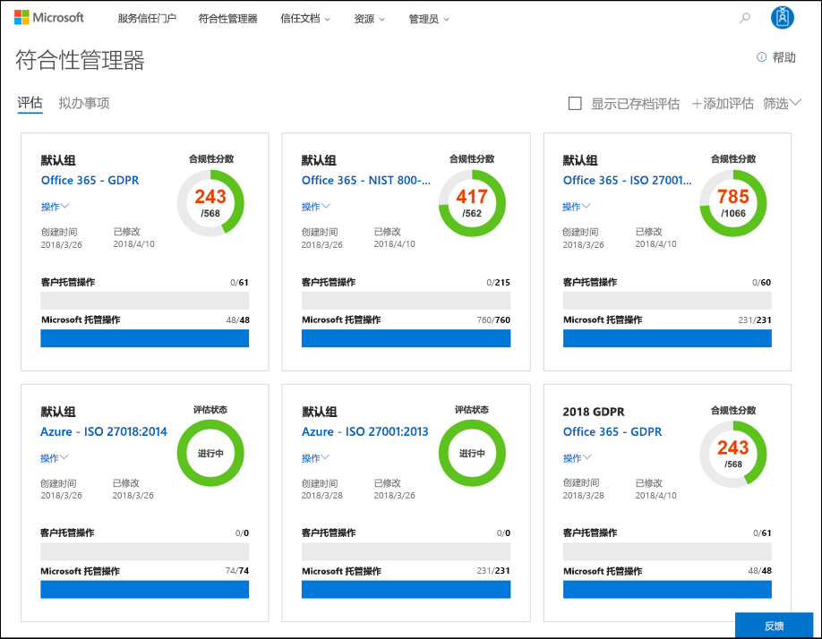

## 访问合规性管理器Accessing Compliance Manager

合规性管理器是从服务信任门户进行访问。任何拥有 Microsoft 帐户或 Azure Active Directory 组织帐户的人，都可以访问合规性管理器。You access Compliance Manager from the Service Trust Portal. Anyone with a Microsoft account or Azure Active Directory organizational account can access Compliance Manager.
  

  
1. 转到 [https://servicetrust.microsoft.com](https://servicetrust.microsoft.com/)。Go to [https://servicetrust.microsoft.com](https://servicetrust.microsoft.com/).
    
2. 使用 Azure Active Directory (Azure AD) 用户帐户登录。Sign in with your Azure Active Directory (Azure AD) user account.
    
3. 在服务信任门户中，单击“合规性管理器”\*\*\*\*。In the Service Trust Portal, click **Compliance Manager**. 
    
4. 阅读所显示的保密协议，再单击“同意”\*\*\*\* 以便继续操作。此操作只需执行一次，即可看到合规性管理器仪表板。When the Non-Disclosure Agreement is displayed, read it, and then click **Agree** to continue. You'll only have to do this once, and then the Compliance Manager dashboard is displayed. 

    为了帮助你开始使用，我们已默认添加以下评估：To get you started, we've added the following Assessments by default:
    
    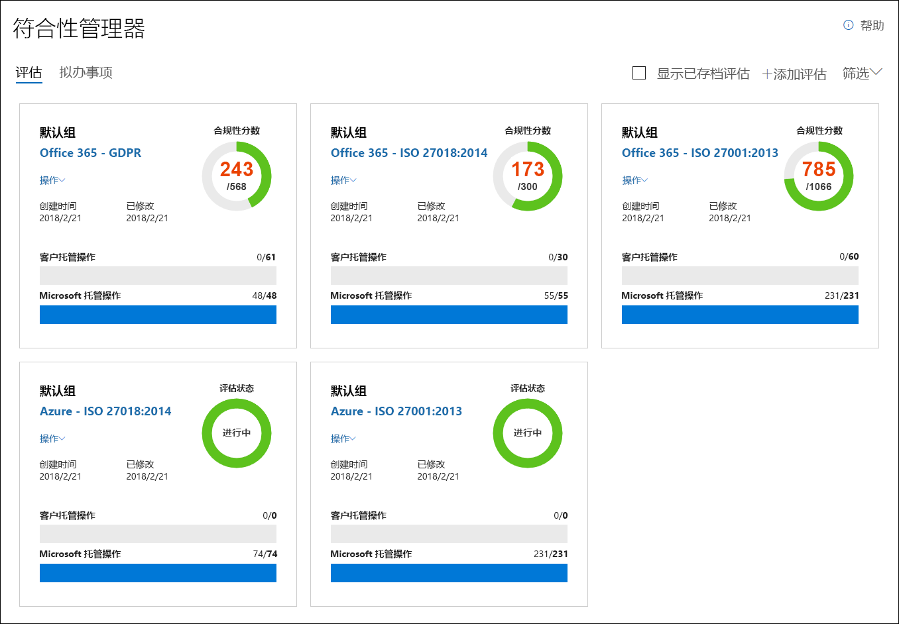
    
5. 单击 “帮助”\*\*\*\*，以观看合规性管理器的快速导览。Click  **Help** to take a short tour of Compliance Manager. 
  
## 查看行动项Viewing action items

合规性管理器提供了所有已分配控制措施评估行动项的便捷视图，方便你轻松快速地执行行动。可查看所有行动项，也可单击与相应评估相关联的选项卡，选择与特定认证对应的行动项。例如，在下图中，选择“GDPR”选项卡后，可看到与 GDPR 评估相关的控制措施。Compliance Manager provides a convenient view of all your assigned control assessment action items, enabling you to quickly and easily take action on them. You can view all action items or select the action items that correspond with a specific certification by clicking on the tab associated with that assessment. For instance, in the image below, the GDPR tab has been selected, showing controls that related to the GDPR assessment.
  
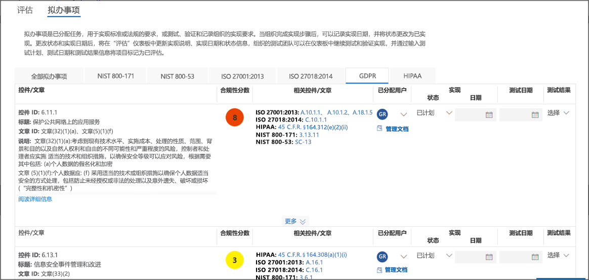
  
若要查看行动项，请执行以下操作：To view your action items:
  
1. 转到合规性管理器仪表板Go to the Compliance Manager dashboard
    
2. 单击“行动项”\*\*\*\* 链接，此时页面刷新为显示已分配给你的行动项。Click the **Action Items** link, and the page will refresh to show the action items that have been assigned to you. 
    
    默认情况下，所有行动项都会显示。若有多个认证对应的行动项，认证名称就会在评估控制措施之上的选项卡中列出。若要查看特定认证对应的行动项，请单击相应选项卡。By default, all action items are shown. If you have action items across multiple certifications, the names of the certifications will be listed in tabs across the top of the assessment control. To see the action items for a specific certification, click that tab.

## 添加评估Adding an Assessment

若要将评估添加到合规性管理器，请执行以下操作：To add an Assessment to Compliance Manager:
  
1. 在合规性管理器仪表板中，单击 “添加评估”\*\*\*\*。In the Compliance Manager dashboard, click  **Add Assessment**. 
    
2. 在“添加评估”\*\*\*\* 窗口中，可新建用于添加评估的组，也可将评估添加到现有组（名为“初始组”的内置组）中。可以键入新组的名称，也可以从下拉列表中选择现有组，具体视选择的选项而定。有关详细信息，请参阅[对评估进行分组](meet-data-protection-and-regulatory-reqs-using-microsoft-cloud.md#grouping)。In the **Add an Assessment** window, you can create a new group to add the Assessment to or you can add it to an existing group (the built-in group is named "Initial Group".) Depending on the option you choose, either type the name of a new group or select an existing group from the drop-down list. For more information, see [Grouping Assessments](meet-data-protection-and-regulatory-reqs-using-microsoft-cloud.md#grouping).
    
    如果新建组，还可以视需要将信息从现有组复制到新评估中。也就是说，要复制的组中评估内客户管理的控制措施的“实现详情”、“测试计划”和“管理响应”字段中添加的任何信息，都会复制到新评估中的相同（或相关）客户管理的控制措施。若要向现有组添加新评估，此组中评估的共用信息会复制到新评估中。有关详细信息，请参阅[从现有评估复制信息](meet-data-protection-and-regulatory-reqs-using-microsoft-cloud.md#copying)。If you create a new group, you also have the option to copy information from an existing group to the new Assessment. That means any information that was added to the Implementation Details and Test Plan and Management Response fields of customer managed controls from Assessments in the group that you're copying from are copied to the same (or related) customer managed controls in the new Assessment. If you're adding a new Assessment to an existing group, common information from Assessments in that group will be copied to the new Assessment. For more information, see [Copying information from existing Assessments](meet-data-protection-and-regulatory-reqs-using-microsoft-cloud.md#copying).
    
3. 单击“下一步”\*\*\*\*，再按照以下步骤操作：Click **Next**, and do the following:
    
    a. 从“选择产品”\*\*\*\* 下拉列表中，选择要评估合规性的 Microsoft 云服务。a. Choose a Microsoft cloud service to assess for compliance from the **Select a product** drop down list. 
    
    b. 从“选择认证”\*\*\*\* 下拉列表中，选择评估选定云服务所依据的认证。b. Choose a certification to assess the selected cloud service against from the **Select a certification** drop down list. 
    
4. 单击“添加到仪表板”\*\*\*\* 以创建评估；此时，新评估会添加到合规性管理器仪表板中，作为现有磁贴列表末尾的新磁贴。Click **Add to Dashboard** to create the Assessment; the assessment will be added to the Compliance Manager dashboard as a new tile at the end of the list of existing tiles. 
    
    合规性管理器仪表板中的**评估磁贴**显示评估分组、评估名称（自动创建为服务名称和选定认证的组合）、创建日期、上次修改时间和总合规性分数（即所有已实现、测试并通过的已分配控制措施的风险分数总和），并在底部显示指明已评估控制措施数的进度指示器。The **Assessment Tile** on the Compliance Manager dashboard, displays the assessment grouping, the name of the assessment (automatically created as a combination of the Service name and the certification selected), the date it was created and when it was last modified, the Total Compliance Score (which is the sum of all of the assigned control risk values that have been implemented, tested and passed), and progress indicators along the bottom that show the number of controls that have been assessed. 
    
5. 单击评估名称即可打开它，并查看评估的详细信息。Click the Assessment name to open it, and view the details of the Assessment.
    
6. 单击“行动”\*\*\*\* 菜单，可查看已分配的行动项、重命名评估组、导出评估报告或存档评估。Click on the **Actions** menu to view your assigned action items, rename the assessment group, export the assessment report, or archive the assessment. 
    
    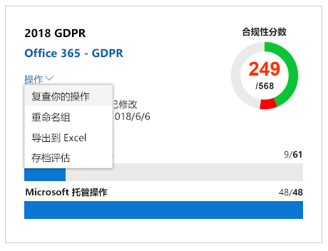

## 从现有评估复制信息Copying information from existing Assessments

如前所述，新建评估组时，可视需要将信息从现有组中的评估复制到新组中的新评估。这样一来，可将已完成的评估和测试工作应用于新评估中相同的客户管理的控制措施。例如，如果组中包含组织内所有与 GDPR 相关的评估，可以在向组中添加新评估时从现有评估工作中复制共用信息。As previously explained, when you create a new assessment group, you have the option to copy information from Assessments in an existing group to the new Assessment in the new group. This allows you to apply the assessment and testing work that's been completed to the same customer managed controls in the new Assessment. For example, if you have a group for all GDPR-related Assessments in your organization, you can copy common information from existing assessment work when add a new Assessment to the group.
  
可以将下面的信息从客户复制到新评估：You can copy the following information from customer to a new Assessment:
  
- 评估用户。评估用户是向其分配控制措施的用户。Assessment Users. An Assessment user is a user who the control is assigned to.
    
- 状态、测试日期和测试结果。Status, Test Date, and Test Results.
    
- 实现详情和测试计划信息。Implementation details and test plan information.
    
同样，同一评估组内共用的客户管理的控制措施中的信息也会进行同步。此外，同一评估内相关的客户管理的控制措施中的信息也会进行同步。Similarly, information from shared customer managed controls within the same Assessment group is synchronized. And information in related customer managed controls within the same Assessment is also synchronized.

## 查看评估Viewing Assessments

1. 查找与要查看的评估对应的评估磁贴，再单击评估名称以打开它，并查看与评估相关联的 Microsoft 管理和客户管理的控制措施，以及评估的范围内云服务列表。下面的示例展示了“Office 365 + GDPR”评估。Locate the Assessment Tile corresponding to the assessment you wish to view, then click the assessment name to open it and view the Microsoft and customer managed controls associated with the Assessment, along with a list of the cloud services that are in-scope for the Assessment. Here's an example of the Assessment for Office 365 and GDPR.
    
    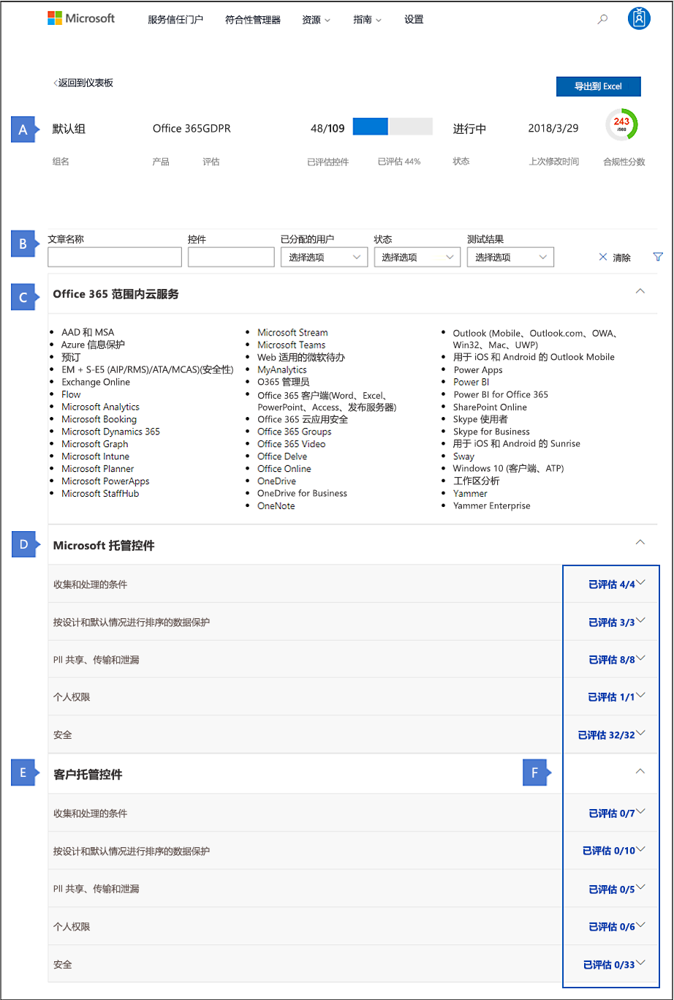
  
1. 此部分显示了评估摘要信息，包括评估分组名称、产品、评估名称和评估控制措施数This section shows the Assessment summary information, including the name of the Assessment Grouping, Product, Assessment name, number of Assess controls
    
2. 此部分显示了评估筛选器控件。若要详细了解如何使用评估筛选器控件，请参阅[管理评估流程](meet-data-protection-and-regulatory-reqs-using-microsoft-cloud.md#managecomplianceprocess_1)部分。This section shows the Assessment Filter controls. For a more detailed explanation of how to use the Assessment Filter controls see the [Managing the assessment process](meet-data-protection-and-regulatory-reqs-using-microsoft-cloud.md#managecomplianceprocess_1) section. 
    
3. 此部分显示了评估的各个范围内云服务。This section shows the individual cloud services that are in-scope for the assessment.
    
4. 此部分显示了 Microsoft 管理的控制措施。相关控制措施是按控制措施系列进行整理。单击控制措施系列，即可展开它并查看各项控制措施。This section contains Microsoft managed controls. Related controls are organized by control family. Click a control family to expand it and display individual controls.
    
5. 此部分显示了客户管理的控制措施，它们同样也是按控制措施系列进行整理。单击控制措施系列，即可展开它并查看各项控制措施。This section contains customer managed controls, which are also organized by control family. Click a control family to expand it and display individual controls.
    
6. 此部分显示了控制措施系列中的总控制措施数，以及已评估的控制措施数。合规性管理器的一项关键功能是，跟踪组织评估客户管理的控制措施的进度。有关详细信息，请参阅[了解合规性分数](meet-data-protection-and-regulatory-reqs-using-microsoft-cloud.md#compliancescore)部分。Displays the total number of controls in the control family, and how many of those controls have been assessed. A key capability of Compliance Manager is tracking your organization's progress on assessing the customer managed controls. For more information, see the [Understanding the Compliance Score](meet-data-protection-and-regulatory-reqs-using-microsoft-cloud.md#compliancescore) section. 

## 管理评估流程Managing the assessment process

最初只有评估的创建者是评估用户。对于每项客户管理的控制措施，可将行动项分配给组织中的人员，使其成为评估用户，这样他/她就能执行建议的客户行动，并能收集和上传证据。分配行动项时，可选择向此人发送包含详细信息的电子邮件，包括建议的客户行动和行动项优先级。电子邮件通知包含指向“行动项”\*\*\*\* 仪表板的链接，单击这个链接即可查看分配给此人的所有行动项。The creator of an Assessment is initially the only Assessment User. For each customer managed control, you can assign an Action Item to a person in your organization so that person becomes an Assessment User who can perform the recommended Customer Actions, and gather and upload evidence. When you assign an Action Item, you can choose to send an email to the person that contains details including the recommended Customer Actions and the Action Item priority. The email notification includes a link to the **Action Items** dashboard, which lists all Action Items assigned to that person. 
  
下面列出了使用合规性管理器的工作流功能可以执行的任务。Here's a list of tasks that you can perform using the workflow features of Compliance Manager.
  
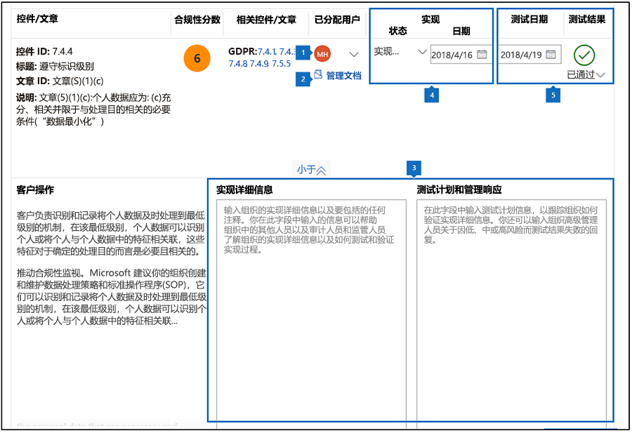
  
1. **使用筛选器选项查找特定评估控制措施** - 合规性管理器提供了**筛选器选项**，可便于选择高度细化的评估控制措施筛选条件，有助于精确定位合规性工作的特定领域。**Use the Filter Options to find specific assessment controls** - Compliance Manager provides **Filter Options**, giving you highly granular selection criteria for displaying assessment controls, helping you to precisely target specific areas of your compliance efforts. 
    
    单击页面右侧的漏斗图标，即可显示或隐藏**筛选器选项**控件。借助这些控件，可以指定筛选条件。只有符合这些条件的评估控制措施，才会显示在下方。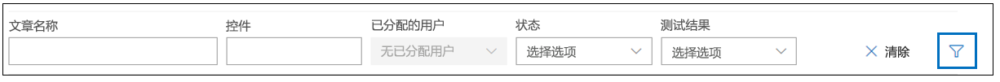Click on the funnel icon on the right hand side of the page to show or hide the **Filter Options** controls. These controls allow you to specify filter criteria, and only the assessment controls that fit those criteria will be displayed below. 
  
    - **条款** - 筛选条款名称可返回与相应条款关联的评估控制措施。例如，键入“条款(5)”可返回名称中包含此字符串的条款的选择列表，即条款 (5)(1)(a)、条款 (5)(1)(b)、条款 (5)(1)(c) 等。选择“条款(5)(1)(c)”会返回与条款 (5)(1)(c) 关联的控制措施。这是使用 OR 运算符的多值多选字段。例如，如果你先选择“条款(5)(1)(a)”，再添加“条款(5)(1)(c)”，筛选器会返回与条款 (5)(1)(a) 或条款 (5)(1)(c) 关联的控制措施。**Articles** - filters on the article name and returns the assessment controls associated to that article. For instance, typing in "Article (5)" returns a selection list of articles whose name includes that string, i.e. Article (5)(1)(a), Article (5)(1)(b), Article (5)(1)(c), etc. Selecting Article (5)(1)(c) will return the controls associated with Article (5)(1)(c). This is multiselect field that uses an OR operator with multiple values -- for instance, if you select Article (5)(1)(a) and then add Article (5)(1)(c), the filter will return controls associated with either Article (5)(1)(a) or Article (5)(1)(c). 
    
      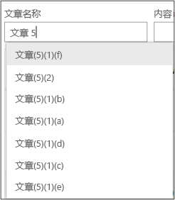
  
    - **控制措施** - 返回名称符合筛选条件的控制措施列表，即键入“7.3”返回项的选择列表，如 7.3.1、7.3.4、7.3.5 等。这是使用 OR 运算符的多值多选字段。例如，如果你先选择“7.3.1”，再添加“7.3.4”，筛选器会返回与 7.3.1 或 7.3.4 关联的控制措施。**Controls** - returns the list of controls whose names fit the filter, i.e. typing in 7.3 returns a selection list of items like 7.3.1, 7.3.4, 7.3.5, etc. This is multiselect field that uses an OR operator with multiple values -- for instance, if you select 7.3.1 and then add 7.3.4, the filter will return controls associated with either 7.3.1 or 7.3.4. 
    
      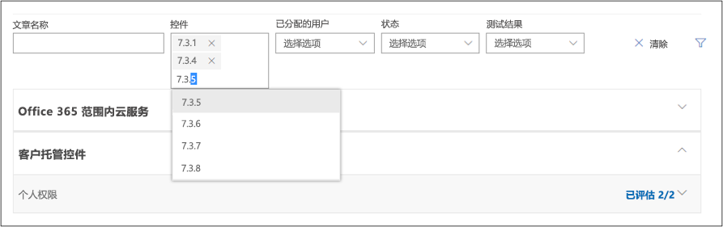
  
    - **已分配用户** - 返回包含已分配选定用户的控制措施列表。**Assigned Users** - returns the list of controls who are assigned to the selected user. 
    
    - **状态** - 返回包含选定状态的控制措施列表。**Status** - returns the list of controls with the selected status. 
    
    - **测试结果** - 返回包含选定测试结果的控制措施列表。**Test Result** - returns the list of controls with the selected test result. 
    
    当你应用筛选条件时，适用的控制措施视图会发生变化，以响应筛选条件。展开控制措施系列部分可在下面显示控制措施详情。As you apply filter conditions, the view of applicable controls will change to correspond to your filter conditions. Expand the control family sections to show the control details below. 
    
    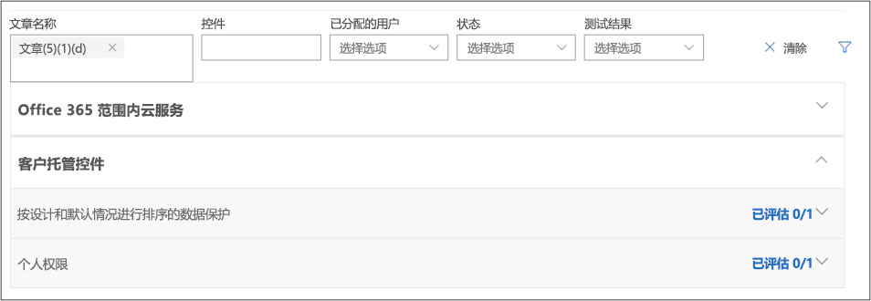
  
2. 如果在选择相应筛选器后没有任何结果显示，表示没有符合指定筛选条件的控制措施。例如，如果先选择“已分配用户”\*\*\*\*，再选择与分配给此用户的控制措施不对应的“控制措施”\*\*\*\* 名称，页面下方不会显示任何评估。If after selecting the desired filters no results are shown, that means there are no controls that correspond to the specified filter conditions. For instance, if you select a particular **Assigned User** and then choose a **Control** name that does correspond to the control assigned to that user, no assessments will be shown in the page below. 
    
3. **向用户分配行动项** - 可以向人员分配行动项，让其实现认证/法规要求，或测试、验证和记录组织的实现要求。分配行动项时，可选择向此人发送包含详细信息的电子邮件，包括建议的客户行动和行动项优先级。此外，还可以取消分配行动项，或将行动项重新分配给其他人。**Assign an Action Item to a user** - You can assign an Action Item to a person to implement the requirements of a certification/regulation, or to test, verify, and document your organization's implementation requirements. When you assign an Action Item, you can choose to send an email to the person that contains details including the recommended Customer Actions and the Action Item priority. You can also unassign or reassign an Action Item to a different person. 
    
4. **管理文档** - 在客户管理的控制措施中，也有位置可用来管理与执行实现任务相关的文档，以及与执行测试和验证任务相关的文档。有权在合规性管理器中编辑数据的任何人，都可以通过单击“管理文档”\*\*\*\* 上传文档。上传文档后，可单击“管理文档”\*\*\*\* 来查看和下载文件。**Manage documents** - Customer managed controls also have a place to manage documents that are related to performing implementation tasks and for performing testing and validation tasks. Anyone with permissions to edit data in Compliance Manager can upload documents by clicking **Manage Documents**. After a documented has been uploaded, you can click **Manage Documents** to view and download files. 
    
5. **提供实现和测试详情** - 每项客户管理的控制措施都有一个可编辑字段，便于用户添加实现详情，以记录组织为符合认证/法规要求，以及为验证和记录组织如何符合这些要求所采取的步骤。**Provide implementation and testing details** - Every customer managed control has an editable field where users can add implementation details that document the steps taken by your organization to meet the requirements of the certification/regulation, and to validate and document how your organization meets those requirements.
    
6. **设置状态** - 在评估流程中设置各项的状态。可取状态值包括“已实现”\*\*\*\*、“替换实现”\*\*\*\*、“已计划”\*\*\*\* 和“不在范围内”\*\*\*\*。**Set Status** - Set the Status for each item as part of the assessment process. Available status values are **Implemented**, **Alternative Implementation**, **Planned**, and **Not in Scope**. 
    
7. **输入测试日期和测试结果** - 拥有合规性管理器评估员角色的人员可验证是否已执行适当测试、查看实现详情、测试计划、测试结果和任何已上传的证据，并能设置“测试日期”和“测试结果”。可取测试结果值包括“通过”\*\*\*\*、“失败-低风险”\*\*\*\*、“失败-中等风险”\*\*\*\*\*\*\*\* 和“失败-高风险”\*\*\*\*。**Enter test date and test result** - The person with the Compliance Manager Assessor role can verify that proper testing performed, review the implementation details, test plan, test results, and any uploaded evidence, and then set the Test Date and Test Result. Available test result values are **Passed**, **Failed-Low Risk**, **Failed-Medium Ris** **k**, and **Failed-High Risk**. 

## 管理行动项Managing action items

组织中参与评估流程的人员可以使用合规性管理器，查看他们是其用户的所有评估中的客户管理的控制措施。登录合规性管理器并打开“行动项”\*\*\*\* 仪表板后，用户便会看到分配给他们的行动项列表。用户可以提供实现或测试详情、更新状态或分配行动项，具体视分配给他们的合规性管理器角色而定。The people involved in the assessment process in your organization can use Compliance Manager to review the customer managed controls from all Assessments for which they are users. When a user signs in to Compliance Manager and opens the **Action Items** dashboard, a list of Action Items assigned to them is displayed. Depending on the Compliance Manager role assigned to the user, they can provide implementation or test details, update the Status, or assign Action Items. 
  
由于认证控制措施通常由一个人来执行，并由另一个人进行测试，因此控制措施行动项可以最初分配给一个人以供实现，此人可在完成后将控制措施行动项重新分配给下一个人，以便测试控制措施并上传证据。这种分配/重新分配控制措施行动可由拥有足够权限的任何合规性管理器角色用户执行，这样就可以集中管理控制措施分配，或相应地从实现者到测试人员分散路由控制措施行动项。As certification controls are generally implemented by one person and tested by another, the control action item can be initially assigned to one person for implementation, and once that is complete, that person can reassign the control action item to the next person for control testing and uploading of evidence. This assignment/reassignment of control actions can be performed by any users who have a Compliance Manager role with sufficient permissions, allowing for central management of control assignments, or decentralized routing of control action items, from implementer to tester as appropriate.
  
若要分配行动项，请执行以下操作：To assign an action item:
  
1. 在合规性管理器仪表板中，找到要处理的评估的评估磁贴，再单击评估名称，以转到评估详情页。On the Compliance Manager dashboard, locate the assessment tile of the assessment you wish to work with and click on the name of the assessment to go to the assessment details page.
    
2. 可单击“筛选器”\*\*\*\*，并使用筛选器控件查找要分配的特定评估控制措施；或You can click **Filter** and use the filter controls to find the specific assessment control you wish to assign, or 
    
3. 向下滚动到“客户管理的控制措施”部分，展开控制措施系列，并滚动浏览控制措施列表，直到找到要分配的评估控制措施。Scroll down to the Customer Managed Controls section, expand the control family, and scroll through the list of control until you have located the assessment control to be assigned
    
4. 在“已分配用户”\*\*\*\* 列下，单击“分配”\*\*\*\*。Under the **Assigned User** column, click **Assign**. 
    
5. 在“分配行动项”对话框中，单击“分配到”\*\*\*\* 字段，以填充可向其分配行动的用户列表。可滚动浏览列表来查找目标用户，也可开始在字段中键入内容来搜索用户名。In the Assign Action Item dialog box, click the **Assign To** field to populate the list of users to whom the action can be assigned. You can scroll through the list to find the target user or start typing in the field to search for the username. 
    
6. 单击用户，以向其分配此行动项。Click the user to assign them this action item.
    
7. 若要向用户发送电子邮件通知，请务必选中“发送电子邮件通知”\*\*\*\* 复选框。If you wish to send an email notification to the user notifying them, ensure that the **Send Email Notification** checkbox is checked. 
    
8. 键入要向此用户显示的任何备注，再单击“分配”\*\*\*\*。Type any notes you wish to be displayed to that user and click **Assign**. 
 
    用户收到的通知中既包含行动项分配，也包含你提供的任何备注。The user will receive notification of their action item assignment and any notes you have provided.
    
与行动项相关联的备注暂留在“备注”部分中，以供下次分配行动项时使用。这些备注并不是只读文本，可由分配行动项的人员编辑、替换或删除。The notes that are associated with the action item are persisted in the notes section, available for the next time the action item is assigned. These notes are not read-only, can be edited, replaced or removed by the person assigning the action item.

## 导出评估中的信息Exporting information from an Assessment

可以将评估导出为 Excel 文件，以供组织中的合规性利益干系人查看，并提供给审计和监管人员。此评估报告是在报告生成时的评估快照，包含评估内 Microsoft 管理的控制措施和客户管理的控制措施详情（包括控制措施实现状态、控制措施测试日期和测试结果），以及指向已上传证据文档的链接。建议先导出评估报告，再存档评估，因为已存档评估不会保留指向已上传文档的链接。You can export an Assessment to an Excel file, which can be reviewed by compliance stakeholders in your organization, and provided to auditors and regulators. This assessment report is a snapshot of the assessment as of the date and time that the report is created, and it contains the details of both the Microsoft-managed controls and the customer managed controls for that assessment, including control implementation status, control test date and test results, and provides links to the uploaded evidence documents. It is recommended that you export the assessment report prior to archiving an assessment, as archived assessments do not retain their links to uploaded documents.
  
若要导出评估报告，请执行以下操作：To export an Assessment report:
  
- 在合规性管理器仪表板中要导出的评估的评估磁贴上，单击“行动”\*\*\*\*，再选择“导出为 Excel”\*\*\*\*On the Compliance Manager dashboard, click **Actions** on the tile of the assessment you wish to export, and then choose **Export to Excel**

  或者Or
    
- 若要查看评估详情页，请单击“导出为 Excel”\*\*\*\* 按钮，此按钮位于页面右上角的评估合规性分数上方。If you are viewing the Assessment details page, click on the **Export to Excel** button, which is located in the upper right hand corner of the page above the assessment's Compliance Score.
    
此时，评估报告会在浏览器会话中进行下载。如果未看到弹出窗口提示，建议查看浏览器的“下载内容”文件夹。The assessment report will be downloaded in your browser session. If you don't see a popup informing you of this, you may wish to check your browser's downloads folder.

## 存档评估Archiving an Assessment

如果已完成评估，且不再需要它来实现合规性目标，可以将它存档。已存档评估会从“评估”仪表板中删除。When you have completed an Assessment and no longer need it for compliance purposes, you can archive it. When an Assessment is archived, it is removed from Assessments dashboard.
  
> [!NOTE]
> 评估一旦存档，既无法“取消存档”，也无法还原到正在读写状态。请注意，由于已存档评估不会保留指向已上传证据文档的链接，因此强烈建议先导出评估，再存档评估，因为导出的评估报告包含指向证据文档的链接，以便于继续访问它们。When an Assessment is Archived, it cannot be 'unarchived' or restored to a read-write in progress state. Please note that Archived Assessments do not retain their links to uploaded evidence documents, so it is highly recommended that you perform an Export of the Assessment before archiving it, as the exported assessment report will contain links to the evidence documents, enabling you to continue to access them. 
  
若要存档评估，请执行以下操作：To archive an assessment:
  
1. 在相应评估的仪表板磁贴上，单击“行动”\*\*\*\*。On the dashboard tile of the desired assessment, click **Actions**. 
    
2. 选择“存档评估”\*\*\*\*。Select **Archive Assessment**. 
 
    此时，“存档评估”\*\*\*\* 对话框显示，询问是否确认要存档评估。The **Archive Assessments** dialog is displayed, asking you to confirm that you want to archive the assessment.
    
4. 若要继续存档，请单击“存档”\*\*\*\*；否则，请单击“取消”\*\*\*\*。To continue with archiving, click **Archive**, or else click **Cancel**. 
    
若要查看已存档评估，请执行以下操作：To view archived Assessments:
  
1. 在合规性管理器仪表板中，选中“显示已存档评估”\*\*\*\* 复选框。On the Compliance Manager dashboard, check the **Show Archived** checkbox. 
    
    此时，已存档评估会显示在其余活动评估下方新显示的部分中，位于标题为“已存档评估”\*\*\*\* 的栏下。The archived assessments will appear in a newly visible section below the rest of the active assessments under a bar titled **Archived Assessments**.
    
3. 单击要查看的评估的名称。Click the name of the assessment you wish to view.
    
当你查看已存档评估时，所有通常可编辑的控件（即“实现”和“测试结果”）都处于禁用状态，且看不到“管理文档”\*\*\*\* 按钮。When viewing an archived assessment, none of the normally editable controls (i.e. Implementation, Test Results) will be active, and the **Managed Documents** button will be absent.

## 使用搜索Using search

  
单击页面右上角的放大镜以展开“搜索”输入字段，输入搜索词并按 Enter。此时，“搜索”控件显示，其中搜索窗格输入字段中显示搜索词，下方显示搜索结果。Click the magnifying glass in the upper right-hand corner of the page by to expand the Search input field, enter your search terms and press Enter. The Search control will appear, with the search term in the search pane input field, and search results will appear beneath.
  
默认情况下，“搜索”返回“文档”结果，你可以使用“筛选依据”下拉列表来精简所显示的文档列表，或从视图中添加或删除搜索结果。可同时使用多个筛选器特性，将返回的文档范围缩小到特定的云服务、合规性或安全做法类别、世界区域或行业。单击文档名称链接可下载文档。By default, Search returns Document results, and you can use the Filter By dropdown lists to refine the list of documents displayed, to add or remove search results from view. You can use multiple filter attributes at the same time to narrow the returned documents to specific cloud services, categories of compliance or security practices, regions of the world, or industries. Click the document name link to download the document.
  
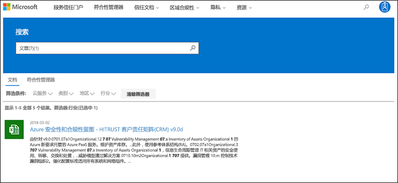
  
单击“合规性管理器”链接，可显示合规性管理器评估控制措施的搜索结果。列出的搜索结果显示评估创建日期、评估分组名称、适用云服务，以及控制措施是 Microsoft 管理还是客户管理的控制措施。Click on the Compliance Manager link to display Search results for Compliance Manager assessment controls. The listed search results show the date the assessment was created, the name of the assessment grouping, the applicable cloud service, and whether the controls is Microsoft or Customer Managed.
  
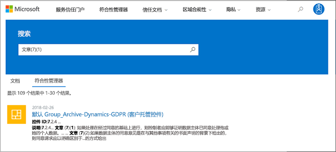
  
> [!NOTE]
> 服务信任门户报告和文档在发布后的至少 12 个月内或在新版文档发布前都可供下载。Service Trust Portal reports and documents are available to download for at least twelve months after publishing or until a new version of document becomes available. 
 
## 本地化支持Localization support

使用服务信任门户，可查看不同语言的页面内容。若要更改页面语言，只需单击页面左下角的地球图标，再选择所需语言即可。Service Trust Portal enables you to view the page content in different languages. To change the page language, simply click on the globe icon in the lower left corner of the page and select the language of your choice. 
  
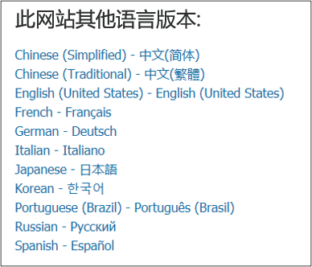

## 客户管理的控制措施的更改日志Change log for Customer Managed Controls

合规性管理器会定期进行更新，以体现法规要求和云服务的最新更改。这些更新包括对客户管理的控制措施的更改。我们提供更改日志，以帮助你了解这些更改的影响，包括要添加或更改的内容的详细信息，以及更改对现有评估的影响方面的指导。通常有以下两种类型的更改：Compliance Manager is designed to be regularly updated to keep pace with changes in regulatory requirements, as well as changes in our cloud services. These updates include changes to the Customer Managed Controls. A Change Log is provided to help you understand the impact of these changes, including the details of the content being added or changed, and guidance as to what effect the changes have on existing Assessments. Generally, there are two types of changes:
  
- **主要**更改是指客户行动的重大更改（如添加或删除控制措施或特定编号的步骤），或更改职责、建议或证据方面的指导。对于主要更改，建议重新评估受影响控制措施的实现和/或评估。A **Major** change is a significant change to a Customer Action, such as the addition or removal of a control or specific numbered steps, or a change in the guidance around responsibilities, recommendations, or evidence. For Major changes, we recommend that you re-evaluate your implementation and/or assessment of the affected control.
    
- **次要**更改是指客户行动的不重要更改，如更正拼写错误或格式化问题，或更新或纠正超链接。次要更改通常不要求重新评估控制措施；但建议查看更新后的客户行动。A **Minor** change is an insignificant change to a Customer Actions, such as fixing a typo or formatting issues, or updating or correcting hyperlinks. Minor changes generally do not require the control to be re-evaluated; however, we do recommend that you review the updated Customer Action.
  
### Office 365 客户管理的控制措施 - 2018 年 7 月更改日志Office 365 Customer Managed Controls - Change Log for July 2018

|**控制措施 ID****Control ID**|**评估****Assessment**|**更改类型****Type of change**|**更改说明****Description of change**|**建议客户采取的行动****Recommended actions for customers**|
|:-----|:-----|:-----|:-----|:-----|:-----|:-----|:-----|:-----|
|45 C.F.R. § 164.308(a)(7)(ii)(A)45 C.F.R. § 164.308(a)(7)(ii)(A)  |Office 365：HIPAAOffice 365: HIPAA|主要Major|向“Office 365 - HIPAA”评估添加了 HITECH 控制措施Added HITECH control to HIPAA Assessment for Office 365 |查看添加的控制措施和建议的客户行动Review the added control and recommended Customer Actions  |
|45 C.F.R.  164.312(a)(6)(ii)45 C.F.R.  164.312(a)(6)(ii)|Office 365：HIPAAOffice 365: HIPAA|主要Major|向“Office 365 - HIPAA”评估添加了 HITECH 控制措施Added HITECH control to HIPAA Assessment for Office 365|查看添加的控制措施和建议的客户行动Review the added control and recommended Customer Actions |
45 C.F.R. § 164.312(c)(1)45 C.F.R. § 164.312(c)(1)| Office 365：HIPAAOffice 365: HIPAA|主要Major| 向“Office 365 - HIPAA”评估添加了 HITECH 控制措施Added HITECH control to HIPAA Assessment for Office 365 |查看添加的控制措施和建议的客户行动Review the added control and recommended Customer Actions  |
45 C.F.R.  § 164.316(b)(2)(iii)45 C.F.R.  § 164.316(b)(2)(iii)| Office 365：HIPAAOffice 365: HIPAA|主要Major|向“Office 365 - HIPAA”评估添加了 HITECH 控制措施Added HITECH control to HIPAA Assessment for Office 365|查看添加的控制措施和建议的客户行动Review the added control and recommended Customer Actions |
|

### Office 365 客户管理的控制措施 - 2018 年 4 月更改日志Office 365 Customer Managed Controls - Change Log for April 2018

|**GDPR****GDPR**|**HIPAA****HIPAA**|**ISO 27001****ISO 27001**|**ISO 27018****ISO 27018**|**NIST 800-53****NIST 800-53**|**NIST 800-171****NIST 800-171**|**更改类型****Type of change**|**更改说明****Description of change**|**建议客户采取的行动****Recommended actions for customers**|
|:-----|:-----|:-----|:-----|:-----|:-----|:-----|:-----|:-----|
|6.13.26.13.2    |||C.16.1.1C.16.1.1    |||主要Major    |旧编号为 6.12.1.1。Previously numbered as 6.12.1.1.    添加了有关建议的详细信息。Added details to recommendations.    |重新评估控制措施：查看客户行动中的更新后指导，并按照建议步骤来实现和评估控制措施。Re-assess the control: Review the updated guidance in the Customer Actions and follow the recommended steps for implementing and assessing the control.    |
||||||3.1.63.1.6    |主要Major    |向包括启用审核和搜索审核日志的指导中添加了步骤。Added steps to guidance that include enabling auditing and searching audit logs.    |查看客户行动中的更新后建议。Review the updated recommendations in the Customer Actions.    |
|6.8.26.8.2    |||A.10.2A.10.2    |||主要Major    |旧编号为 6.7.2.9。Previously numbered as 6.7.2.9.    更新了指导，在其中添加了其他建议和行动项。Updated guidance with additional recommendations and action items.    |重新评估控制措施：查看客户行动中的更新后指导，并按照建议步骤来实现和评估控制措施。Re-assess the control: Review the updated guidance in the Customer Actions and follow the recommended steps for implementing and assessing the control.    |
|6.6.46.6.4    |45 C.F.R. § 164.312(a)(2)(i)45 C.F.R. § 164.312(a)(2)(i)              45 C.F.R. § 164.312(d)45 C.F.R. § 164.312(d)    |A.9.4.2A.9.4.2    ||IA-2IA-2    |3.5.13.5.1    |主要Major    |旧编号为 6.5.2.3。Previously numbered as 6.5.2.3.    更新了指导，在其中添加了其他建议和行动项。Updated guidance with additional recommendations and action items.    |重新评估控制措施：查看客户行动中的更新后指导，并按照建议步骤来实现和评估控制措施。Re-assess the control: Review the updated guidance in the Customer Actions and follow the recommended steps for implementing and assessing the control.    |
|6.13.16.13.1    |45 C.F.R. § 164.308(a)(1)(i)45 C.F.R. § 164.308(a)(1)(i)    |A.16.1A.16.1    |C.16.1C.16.1    |IR-4(a)IR-4(a)    |3.6.13.6.1    |主要Major    |旧编号为 6.12.1。Previously numbered as 6.12.1.    更新了指导，在其中添加了其他建议和行动项。Updated guidance with additional recommendations and action items.    |重新评估控制措施：查看客户行动中的更新后指导，并按照建议步骤来实现和评估控制措施。Re-assess the control: Review the updated guidance in the Customer Actions and follow the recommended steps for implementing and assessing the control.    |
|6.76.7    ||||||主要Major    |旧编号为 6.6.1.1。Previously numbered as 6.6.1.1.    更新了指导，在其中添加了其他建议和行动项。Updated guidance with additional recommendations and action items.    |重新评估控制措施：查看客户行动中的更新后指导，并按照建议步骤来实现和评估控制措施。Re-assess the control: Review the updated guidance in the Customer Actions and follow the recommended steps for implementing and assessing the control.    |
|6.6.56.6.5    |||A.10.8A.10.8    |IA-3IA-3    |3.5.23.5.2    |主要Major    |旧编号为 6.5.4.2。Previously numbered as 6.5.4.2.    更新了指导，在其中添加了其他建议和行动项。Updated guidance with additional recommendations and action items.    |重新评估控制措施：查看客户行动中的更新后指导，并按照建议步骤来实现和评估控制措施。Re-assess the control: Review the updated guidance in the Customer Actions and follow the recommended steps for implementing and assessing the control.    |
|6.15.16.15.1    ||||||主要Major    |旧编号为 6.14.1.3。Previously numbered as 6.14.1.3.    更新了指导，在其中添加了其他建议和行动项。Updated guidance with additional recommendations and action items.    |重新评估控制措施：查看客户行动中的更新后指导，并按照建议步骤来实现和评估控制措施。Re-assess the control: Review the updated guidance in the Customer Actions and follow the recommended steps for implementing and assessing the control.    |
|||||AC-2(h)(2)AC-2(h)(2)    ||次要Minor    |添加了指向“启用审核”边栏选项卡的链接。Added link to Enable Auditing blade.    |无需采取任何行动。No action necessary.    |
|||||AC-2(7)(b)AC-2(7)(b)    ||次要Minor    |添加了指向“启用审核”边栏选项卡的链接。Added link to Enable Auditing blade.    |无需采取任何行动。No action necessary.    |
|||||AC-2(h)(1)AC-2(h)(1)    ||次要Minor    |添加了指向“启用审核”边栏选项卡的链接。Added link to Enable Auditing blade.    |无需采取任何行动。No action necessary.    |
||45 C.F.R. § 164.308(a)(5)(ii)(C)45 C.F.R. § 164.308(a)(5)(ii)(C)    |||AC-2(g)AC-2(g)    ||次要Minor    |添加了指向“启用审核”边栏选项卡的链接。Added link to Enable Auditing blade.    |无需采取任何行动。No action necessary.    |
|||||AC-2(12)AC-2(12)    ||次要Minor    |添加了指向“启用审核”边栏选项卡的链接。Added link to Enable Auditing blade.    |无需采取任何行动。No action necessary.    |
||45 C.F.R. § 164.312(b)45 C.F.R. § 164.312(b)    |A.12.4.3A.12.4.3    ||AU-2(d)AU-2(d)    ||次要Minor    |添加了指向“启用审核”边栏选项卡的链接。Added link to Enable Auditing blade.    |无需采取任何行动。No action necessary.    |
|||||AC-2(4)AC-2(4)    ||次要Minor    |添加了指向“启用审核”边栏选项卡的链接。Added link to Enable Auditing blade.    |无需采取任何行动。No action necessary.    |
||||||3.1.73.1.7    |次要Minor    |添加了指向“启用审核”边栏选项卡的链接。Added link to Enable Auditing blade.    |无需采取任何行动。No action necessary.    |
|||A.16.1.7A.16.1.7    |C.12.4.2，第 2 部分C.12.4.2, Part 2    |||次要Minor    |添加了指向“启用审核”边栏选项卡的链接。Added link to Enable Auditing blade.    |无需采取任何行动。No action necessary.    |
|||||AC-2(h)(3)AC-2(h)(3)    ||次要Minor    |添加了指向“启用审核”边栏选项卡的链接。Added link to Enable Auditing blade.    |无需采取任何行动。No action necessary.    |
|||A.12.4.2A.12.4.2    ||||次要Minor    |添加了指向“启用审核”边栏选项卡的链接。Added link to Enable Auditing blade.    |无需采取任何行动。No action necessary.    |
|||A.7.2.8A.7.2.8    ||||次要Minor    |添加了指向“内容搜索”边栏选项卡和 DSR 门户的链接。Added links to Content Search blade and to DSR portal.    |无需采取任何行动。No action necessary.    |
||45 C.F.R. § 164.308(a)(3)(ii)(C)45 C.F.R. § 164.308(a)(3)(ii)(C)    |||||次要Minor    |添加了指向“启用审核”边栏选项卡和 Office 365 管理员角色支持主题的链接。Added links to Enable Auditing blade and to Office 365 admin role support topics.    |无需采取任何行动。No action necessary.    |
|5.2.15.2.1    ||||||次要Minor    |旧编号为 5.2.2。Previously numbered as 5.2.2.    在指导中阐明了客户职责。Clarified customer responsibilities within guidance.    |查看客户行动中的更新后建议。Review the updated recommendations in the Customer Actions.    |
|6.11.16.11.1    |45 C.F.R. § 164.312(e)(2)(ii)45 C.F.R. § 164.312(e)(2)(ii)    |A.10.1.1          A.10.1.2          A.18.1.5A.10.1.1          A.10.1.2          A.18.1.5    |C.10.1.1C.10.1.1    |SC-13SC-13    |3.13.113.13.11    |次要Minor    |旧编号为 6.10.1.2。Previously numbered as 6.10.1.2.    更正了拼写错误。Fixed typo.    |无需采取任何行动。No action necessary.    |
|7.5.17.5.1    ||||||次要Minor    |旧编号为 A.7.4.1。Previously numbered as A.7.4.1.    更正了拼写错误。Fixed typo.    |无需采取任何行动。No action necessary.    |
|||A.8.2.3A.8.2.3    |||3.1.33.1.3    |次要Minor    |删除了多余的不必要句子。Removed extra unnecessary sentence.    |无需采取任何行动。No action necessary.    |
||45 C.F.R. § 164.308(a)(4)(i)45 C.F.R. § 164.308(a)(4)(i)    |A.6.1.2A.6.1.2    ||AC-5(a)AC-5(a)    |3.1.2          3.1.43.1.2          3.1.4    |次要Minor    |更新了指导，在其中添加了其他建议和行动项。Updated guidance with additional recommendations and action items.    |查看客户行动中的更新后建议。Review the updated recommendations in the Customer Actions.    |
||45 C.F.R. § 164.308(a)(7)(ii)(E)45 C.F.R. § 164.308(a)(7)(ii)(E)    |||RA-2(a)RA-2(a)    ||次要Minor    |已将导入服务帮助主题链接更新为使用 FWLink。Updated import service help topic link to use FWLink.    |无需采取任何行动。No action necessary.    |
|

### GDPR 评估控制措施 ID 更改参考 - 2018 年 2 月更改日志GDPR Assessment Control ID Change Reference - Change Log for February 2018 

|**旧控制措施 ID（2017 年 11 月预览版）****Previous Control ID (November 2017 Preview)**|**新控制措施 ID（2018 年 2 月正式版）****New Control ID (February 2018 GA release)**|
|:-----|:-----|
|5.2.25.2.2    |5.2.15.2.1    |
|5.2.35.2.3    |5.2.25.2.2    |
|5.2.45.2.4    |5.2.35.2.3    |
|6.1.1.16.1.1.1    |6.26.2    |
|6.10.1.26.10.1.2    |6.11.16.11.1    |
|6.10.2.56.10.2.5    |6.11.26.11.2    |
|6.11.1.26.11.1.2    |6.126.12    |
|6.12.16.12.1    |6.13.16.13.1    |
|6.12.1.16.12.1.1    |6.13.26.13.2    |
|6.12.1.56.12.1.5    |6.13.36.13.3    |
|6.14.1.36.14.1.3    |6.15.16.15.1    |
|6.14.2.16.14.2.1    |6.15.26.15.2    |
|6.14.2.36.14.2.3    |6.15.36.15.3    |
|6.2.1.16.2.1.1    |6.36.3    |
|6.3.2.26.3.2.2    |6.46.4    |
|6.4.3.16.4.3.1    |6.5.26.5.2    |
|6.4.3.26.4.3.2    |6.8.16.8.1    |
|6.4.3.36.4.3.3    |6.5.36.5.3    |
|6.5.26.5.2    |6.6.16.6.1    |
|6.5.2.16.5.2.1    |6.6.26.6.2    |
|6.5.2.26.5.2.2    |6.6.36.6.3    |
|6.5.2.36.5.2.3    |6.6.46.6.4    |
|6.5.4.26.5.4.2    |6.6.56.6.5    |
|6.6.1.16.6.1.1    |6.76.7      |
|6.7.2.76.7.2.7    |6.8.16.8.1    |
|6.7.2.96.7.2.9    |6.8.26.8.2    |
|6.8.1.46.8.1.4    |6.9.16.9.1    |
|6.8.4.16.8.4.1    |6.9.36.9.3    |
|6.8.4.26.8.4.2    |6.9.46.9.4    |
|6.9.2.16.9.2.1    |6.10.16.10.1   |
|6.9.2.36.9.2.3    |6.10.26.10.2   |
|A.7.1.1A.7.1.1    |7.2.17.2.1    |
|A.7.1.2A.7.1.2    |7.2.27.2.2    |
|A.7.1.3A.7.1.3    |7.2.37.2.3    |
|A.7.1.4A.7.1.4    |7.2.47.2.4    |
|A.7.1.5A.7.1.5    |7.2.57.2.5    |
|A.7.1.6A.7.1.6    |7.2.67.2.6    |
|A.7.1.7A.7.1.7    |7.2.77.2.7    |
|A.7.2.1A.7.2.1    |7.3.17.3.1    |
|A.7.2.10A.7.2.10   |7.3.97.3.9    |
|A.7.2.11A.7.2.11   |7.3.107.3.10   |
|A.7.2.2A.7.2.2    |7.3.27.3.2    |
|A.7.2.3A.7.2.3    |7.3.37.3.3    |
|A.7.2.4A.7.2.4    |7.3.47.3.4    |
|A.7.2.5A.7.2.5    |7.3.57.3.5    |
|A.7.2.6A.7.2.6    |7.3.67.3.6    |
|A.7.2.7A.7.2.7    |7.3.77.3.7    |
|A.7.2.8A.7.2.8    |7.3.87.3.8    |
|A.7.3.1A.7.3.1    |7.4.17.4.1    |
|A.7.3.10A.7.3.10   |7.4.107.4.10   |
|A.7.3.2A.7.3.2    |7.4.27.4.2    |
|A.7.3.3A.7.3.3    |7.4.37.4.3    |
|A.7.3.4A.7.3.4    |7.4.47.4.4    |
|A.7.3.5A.7.3.5    |7.4.57.4.5    |
|A.7.3.6A.7.3.6    |7.4.67.4.6    |
|A.7.3.7A.7.3.7    |7.4.77.4.7    |
|A.7.3.8A.7.3.8    |7.4.87.4.8    |
|A.7.3.9A.7.3.9    |7.4.97.4.9    |
|A.7.4.1A.7.4.1    |7.5.17.5.1    |
|A.7.4.2A.7.4.2    |7.5.27.5.2    |
|A.7.4.3A.7.4.3    |7.5.37.5.3    |
|A.7.4.4A.7.4.4    |7.5.47.5.4    |
|A.7.4.5A.7.4.5    |7.5.57.5.5    |
|B.8.1.1B.8.1.1    |8.2.18.2.1    |
|B.8.1.2B.8.1.2    |8.2.28.2.2    |
|B.8.1.3B.8.1.3    |8.2.38.2.3    |
|B.8.1.4B.8.1.4    |8.2.48.2.4    |
|B.8.1.5B.8.1.5    |8.2.58.2.5    |
|B.8.1.6B.8.1.6    |8.2.68.2.6    |
|B.8.2.1B.8.2.1    |8.3.18.3.1    |
|B.8.3.1B.8.3.1    |8.4.18.4.1    |
|B.8.3.2B.8.3.2    |8.4.28.4.2    |
|B.8.3.3B.8.3.3    |8.4.38.4.3    |
|B.8.4.1B.8.4.1    |8.5.18.5.1    |
|B.8.4.2B.8.4.2    |8.5.28.5.2    |
|B.8.4.3B.8.4.3    |8.5.48.5.4    |
|B.8.4.4B.8.4.4    |8.5.58.5.5    |
|B.8.4.5B.8.4.5    |8.5.38.5.3    |
|B.8.4.6B.8.4.6    |8.5.68.5.6    |
|B.8.4.7B.8.4.7    |8.5.78.5.7    |
|B.8.4.8B.8.4.8    |8.5.88.5.8    |
|
   
## 另请参阅See also

- [合规性管理器交互指南Compliance Manager Interactive guide](https://content.cloudguides.com/guides/Compliance%20Manager)

- [宣布合规性管理器正式推出Announcing Compliance Manager general availability](https://techcommunity.microsoft.com/t5/Security-Privacy-and-Compliance/Announcing-Compliance-Manager-general-availability/ba-p/161922)

- [Microsoft 365 提供有助于遵守 GDPR 的信息保护策略Microsoft 365 provides an information protection strategy to help with the GDPR](https://blogs.office.com/zh-CN/2018/02/22/microsoft-365-provides-an-information-protection-strategy-to-help-with-the-gdpr)
