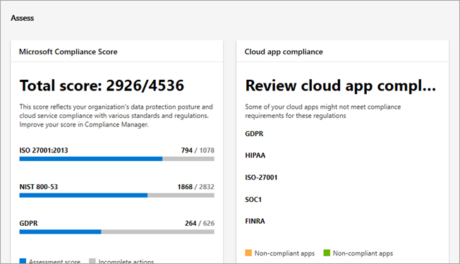

# 全新 Microsoft 365 合规性中心概述Overview of the all-new Microsoft 365 compliance center

## 概述Overview

如果你对组织的合规性状况感兴趣, 你将喜欢新的[Microsoft 365 合规性中心](https://compliance.microsoft.com)。If you're interested in your organization's compliance posture, you're going to love the new [Microsoft 365 compliance center](https://compliance.microsoft.com). Microsoft 365 合规性中心可轻松访问您需要管理的数据和工具, 以满足您组织的合规性需求。The Microsoft 365 compliance center provides easy access to the data and tools you need to manage to your organization's compliance needs. 

阅读本文, 了解 Microsoft 365 合规性中心、[如何获取它](#how-do-i-get-this)、常见问题以及[后续步骤](#next-steps)。Read this article to get acquainted with the Microsoft 365 compliance center, [how to get it](#how-do-i-get-this), [frequently asked questions](#frequently-asked-questions), and your [next steps](#next-steps).

## 欢迎使用 Microsoft 365 合规性Welcome to Microsoft 365 compliance

当您首次转到 Microsoft 365 合规性中心时, 将使用以下欢迎消息 greeted:When you go to your Microsoft 365 compliance center for the first time, you'll be greeted with the following welcome message:

欢迎横幅为您提供了有关如何入门的一些说明, 以及接下来的步骤和邀请以向我们提供反馈。The welcome banner gives you some pointers on how to get started, with next steps and an invitation for you to give us feedback.

## "评估" 部分The Assess section

主页上的 "**评估**" 部分显示组织在[数据保护和合规性](protect-access-to-data-and-services.md)方面的进展情况。The **Assess** section on the home page shows you at a glance how your organization is doing with respect to [data protection and compliance](protect-access-to-data-and-services.md).

从这里, 你可以转到 Microsoft 合规性记分卡, 这将引导你进入[合规性管理器](meet-data-protection-and-regulatory-reqs-using-microsoft-cloud.md), 您可以在其中查看或编辑你的配置, 并可能改进你的总体合规性分数。From here, you can go to the Microsoft Compliance Score card, which leads you to [Compliance Manager](meet-data-protection-and-regulatory-reqs-using-microsoft-cloud.md), where you can review or edit your configurations and potentially improve your overall compliance score.

你将看到更多的卡片, 如显示你的组织的云应用合规性的其他卡片, 另一个显示有关使用共享文件的用户的数据的链接, 其中包含可在其中浏览数据的[云应用安全](https://docs.microsoft.com/cloud-app-security/)或其他工具的链接。You'll see additional cards, such as one showing your organization's cloud app compliance, and another showing data about users with shared files, with links to [Cloud App Security](https://docs.microsoft.com/cloud-app-security/) or other tools where you can explore data.

## "保护" 部分The Protect section

主页上的 "**保护**" 部分包含的卡片为您提供有关[标签](labels.md)、[数据丢失防护 (DLP)](data-loss-prevention-policies.md)、使用中的第三方应用、共享文件、阴影 IT 应用程序等的高级信息。The **Protect** section on the home page contains cards that provide you with high-level information about [labels](labels.md), [data loss prevention (DLP)](data-loss-prevention-policies.md), third-party apps in use, shared files, shadow IT apps, and so on. 

每张卡片都有一个报告或其他信息的链接, 您可以从中了解详细信息。Each card has a link to a report or additional information where you can learn more.

## "响应" 部分The Respond section

主页上的 "**响应**" 部分显示了要查看的[警报](alerts.md)和[挂起的处理](disposition-reviews.md), 并可能对其进行操作。The **Respond** section on the home page surfaces [alerts](alerts.md) and [pending dispositions](disposition-reviews.md) that you'll want to review and potentially act upon.

卡片 (如活动的[警报](alerts.md)卡) 包含一个链接, 可在其中查看更详细的信息, 如严重性、状态、类别等。Cards, such as the [Active alerts](alerts.md) card, include a link to a page where you can view more detailed information, such as Severity, Status, Category, and more.

 

## 轻松导航到更符合性特性和功能Easy navigation to more compliance features and capabilities

除了主页上的卡片中的链接, 您还可以在屏幕左侧找到导航窗格, 使您能够轻松访问您的[通知](alerts.md)、[报告](reports-in-security-and-compliance.md)、[策略](alert-policies.md)、合规性解决方案等。In addition to links in cards on the home page, you'll find a navigation pane on the left side of the screen that gives you easy access to your [alerts](alerts.md), [reports](reports-in-security-and-compliance.md), [policies](alert-policies.md), compliance solutions, and more. 

|  |  |
|---------|---------|
|  |   转到 "**通知**" 以查看和解决[通知](alerts.md)Go to **Alerts** to view and resolve [alerts](alerts.md)  访问**监视 & 报告**可查看有关[标签使用和保留](sensitivity-labels.md)的数据[、DLP 策略匹配和替代](view-the-dlp-reports.md)、[共享文件](https://docs.microsoft.com/cloud-app-security/file-filters)、[使用中的第三方应用程序](https://docs.microsoft.com/cloud-app-security/discovered-apps)等。Visit **Monitoring & reports** to view data about [label usage and retention](sensitivity-labels.md), [DLP policy matches and overrides](view-the-dlp-reports.md), [shared files](https://docs.microsoft.com/cloud-app-security/file-filters), [third-party apps in use](https://docs.microsoft.com/cloud-app-security/discovered-apps), and more.  展开 "**分类**" 部分以访问您的[标签](labels.md)、[标签策略](sensitivity-labels.md#what-label-policies-can-do)、[敏感信息类型](what-the-sensitive-information-types-look-for.md)和[标签分析](view-label-activity-for-documents.md)。Expand the **Classification** section to access your [labels](labels.md), [label policies](sensitivity-labels.md#what-label-policies-can-do), [sensitive information types](what-the-sensitive-information-types-look-for.md), and [label analytics](view-label-activity-for-documents.md).  转到 "**策略**" 以查看[警报](alerts.md)并访问你的[DLP](data-loss-prevention-policies.md)和[保留](retention-policies.md)策略。Go to **Policies** to view [alerts](alerts.md) and to access your [DLP](data-loss-prevention-policies.md) and [retention](retention-policies.md) policies.   使用 "**解决方案**" 部分中的链接可访问组织的合规性解决方案。Use the links in the **Solutions** section to access your organization's compliance solutions. 具体包括：These include:  [数据调控 > 处置Data governance > Dispositions](disposition-reviews.md) [电子数据展示 (预览)eDiscovery (preview)](compliance20/overview-ediscovery-20.md) [监控Supervision](supervision-policies.md) [数据调查Data investigations](datainvestigations/overview-data-investigations.md) [数据主体请求Data subject requests](manage-gdpr-data-subject-requests-with-the-dsr-case-tool.md)        |

## 如何获取此功能？How do I get this?

- 如果你还没有新的 Microsoft 365 合规性中心, 你将很快拥有。If you don't have the new Microsoft 365 compliance center already, you will have it soon. 现在,[新的 Microsoft 365 合规性中心](microsoft-security-and-compliance.md#microsoft-365-compliance-center)将正式推出。The [new Microsoft 365 compliance center](microsoft-security-and-compliance.md#microsoft-365-compliance-center) will be generally available now.

- 若要访问 Microsoft 365 合规性中心, 作为全局管理员或合规性管理员, 请[https://compliance.microsoft.com](https://compliance.microsoft.com)转到并登录。To visit the Microsoft 365 compliance center, as a global administrator or compliance administrator, go to [https://compliance.microsoft.com](https://compliance.microsoft.com) and sign in. 

- 若要了解有关要求的详细信息, 请参阅[必需的许可证和权限](microsoft-security-and-compliance.md#required-licenses-and-permissions)。To learn more about requirements, see [Required licenses and permissions](microsoft-security-and-compliance.md#required-licenses-and-permissions).

## 常见问题Frequently asked questions

### 为什么我转到 Office 365 安全 & 合规中心来执行某些任务, 如定义某些策略？Why am I taken to the Office 365 Security & Compliance Center to perform some tasks, such as defining certain policies?

我们仍在开发 Microsoft 365 合规性中心, 我们将在将来的几个月中添加更多功能和解决方案。We are still developing the Microsoft 365 compliance center, and we'll be adding more functionality and solutions over the coming months. 同时, 还必须在 Office 365 Security & 合规中心 ([https://protection.office.com](https://protection.office.com)) 中执行一些任务。In the meantime, there are some tasks that must be performed in the Office 365 Security & Compliance Center ([https://protection.office.com](https://protection.office.com)). 在这些情况下, 你将自动转到你可以在其中执行任务的位置, 例如创建或编辑监督策略。In those cases, you'll be directed automatically to the location where you can perform the task at hand, such as creating or editing a supervision policy.

### 为什么我还看不到新的 Microsoft 365 合规中心？Why don't I see the new Microsoft 365 compliance center yet?

首先, 请确保您具有适当的[许可证和权限](microsoft-security-and-compliance.md#required-licenses-and-permissions)。First, make sure you have the appropriate [licenses and permissions](microsoft-security-and-compliance.md#required-licenses-and-permissions). 然后, 在处[https://compliance.microsoft.com](https://compliance.microsoft.com)登录。Then, sign in at [https://compliance.microsoft.com](https://compliance.microsoft.com). 如果你还没有看到新的合规性中心, 你将很快拥有。If you don't see the new compliance center yet, you will have it soon.

### 我找不到某些合规性设置。I can't find some of my compliance settings. What do I do?What do I do?

我们仍在向 Microsoft 365 合规性中心添加功能。We are still adding functionality to the Microsoft 365 compliance center. 如果找不到任何内容 (如审核日志搜索), 请尝试导航到 Office 365 Security & 合规中心[https://protection.office.com](https://protection.office.com)()。If you can't find something, such as audit log search, try navigating to the Office 365 Security & Compliance Center ([https://protection.office.com](https://protection.office.com)). 您的配置将在现有的 Office 365 安全 & 合规中心和新的 Microsoft 365 合规性中心中自动保存。Your configurations will be saved in both the existing Office 365 Security & Compliance Center and in the new Microsoft 365 compliance center automatically.

## 后续步骤Next steps

- **查看 Microsoft 合规性分数**, 并使用合规性管理器提高成绩。**Review your Microsoft Compliance Score**, and use Compliance Manager to improve your score. 若要了解详细信息, 请参阅[使用合规性管理器帮助满足在使用 Microsoft 云服务时的数据保护和法规要求](meet-data-protection-and-regulatory-reqs-using-microsoft-cloud.md)。To learn more, see [Use Compliance Manager to help meet data protection and regulatory requirements when using Microsoft cloud services](meet-data-protection-and-regulatory-reqs-using-microsoft-cloud.md).

- **查看组织的数据丢失防护策略**并根据需要进行必要的调整。**Review your organization's Data Loss Prevention policies** and make required adjustments as necessary. 若要了解详细信息, 请参阅[数据丢失防护策略概述](data-loss-prevention-policies.md)。To learn more about, see [Overview of data loss prevention policies](data-loss-prevention-policies.md). 

- **了解并设置 Microsoft 云应用安全性**。**Get acquainted with and set up Microsoft Cloud App Security**. 请参阅[快速入门: Microsoft 云应用安全入门](https://docs.microsoft.com/cloud-app-security/getting-started-with-cloud-app-security)。See [Quickstart: Get started with Microsoft Cloud App Security](https://docs.microsoft.com/cloud-app-security/getting-started-with-cloud-app-security).  

- 请**经常访问 Microsoft 365 合规性中心**, 并确保查看可能出现的任何警报或潜在风险。**Visit your Microsoft 365 compliance center often**, and make sure to review any alerts or potential risks that might arise. 转到[https://compliance.microsoft.com](https://compliance.microsoft.com)并登录。Go to [https://compliance.microsoft.com](https://compliance.microsoft.com) and sign in.