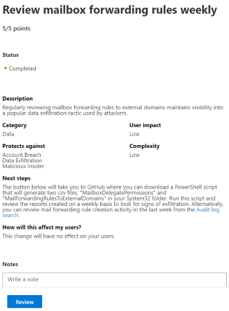

# Microsoft 安全功能分数

[!include[Prerelease�information](prerelease.md)]

通过 microsoft 365 安全中心中的 microsoft 安全评分, 可以更好地查看和控制组织的安全状况。 通过集中式仪表板, 可以监视和提高 Microsoft 365 标识、数据、应用程序、设备和基础结构的安全性。

Microsoft 安全分数为您提供了强健的可视化效果、与其他 Microsoft 产品的集成、与其他公司的分数比较、按类别筛选, 以及更多。 使用此工具, 您可以在组织内完成安全改进操作并跟踪分数的历史记录。 分数还可以反映第三方解决方案解决建议的改进操作的时间。  

## 工作原理

为您提供配置推荐安全功能、执行与安全相关的任务 (如查看报告) 或使用第三方应用程序或软件解决改进操作的相关积分。 某些操作在部分完成时被评分, 例如为您的用户启用多重身份验证 (MFA)。 安全应始终平衡可用性, 而不是每个建议都适用于您的环境。

## 必需的权限

目前, 若要查看 Microsoft 安全分数, 您必须在 Azure Active Directory 中分配以下角色之一:

* 全局管理员
* Security Administrator
* 安全读者

## 丰富的体验 & 其他安全建议

在 Microsoft 安全分数中, 我们已从 azure AD、Intune 和云应用程序安全性中添加了建议, 其中包含来自 azure 安全中心和 Windows Defender ATP 的建议。 我们还添加了更为多的 Office 365 安全建议。 通过其他见解并更好地了解更广泛的一组 Microsoft 产品和服务, 您可以放心地报告有关组织安全运行状况的管理。 您还可以使用[Microsoft Graph API](https://docs.microsoft.com/graph/api/resources/securescores?view=graph-rest-beta)获取成绩。

为了帮助您更快地了解所需的信息, Microsoft 建议已分成组:

* 标识 (Azure AD 帐户和角色的保护状态)
* 数据 (Office 365 文档的保护状态)
* 设备 (设备的保护状态;即将推出 Windows Defender ATP 改进操作)
* 应用 (电子邮件和云应用的保护状态)
* 基础结构 (Azure 资源的保护状态; 即将推出)

在 "Microsoft 安全分数概述" 页中, 您可以看到在这些组之间如何拆分点以及哪些点可用。 [! 注意] 概述页面也是获取总分和基准对比的安全分数的历史趋势的完整视图的位置, 以及可采取的优先改进措施以提高成绩。 您可以使用此数据进行操作, 并对安全状态进行重大差别。  

*图 1: Microsoft 安全分数概述页面*

## 采取行动以提高成绩

"改进操作" 选项卡列出了适用于你的租户的所有安全建议及其状态 (已完成、未完成、已通过第三方解决, 并将被忽略)。 您可以搜索、筛选和分组所有控件。  排名基于 Microsoft 对安全价值和努力完成的评估。

Microsoft 安全分数不会跟踪标记为 [未评分] 的操作。 你仍可以采取措施, 但完成这些操作不会影响你的分数。 如果某个操作在将来被 Microsoft 安全得分跟踪, 并且您已完成该操作, 则安全得分将自动反映所做的更改。

当您单击 "改进" 操作时, 将显示 "飞出"。 若要完成此操作, 您有几个选项:

1. 选择 "**查看设置**" 以转到配置屏幕并进行更改。 然后, 您将获得该操作所需要的要点, 在飞出的顶部可见。点可能需要长达24小时才能更新。

2. 选择 "**通过第三方解决**", 因为改进操作已由第三方应用程序或软件解决。 你将获得该操作所需要的要点, 因此你的安全得分更好地反映了你的总体安全状况。 如果第三方不再涵盖该控件, 则可以将 "改进" 操作标记为 "不完成"。 请注意, 如果将改进操作标记为通过第三方解决, 则 Microsoft 将无法了解是否符合评分要求。

3. 选择 "**忽略**", 因为您已决定接受风险而不执行改进操作。 忽略 "改进" 操作后, 您可以达到的安全分数点总数将减少。 您可以在历史记录中查看此操作, 也可以随时撤消。

4. 选择 "**审阅**", 因为改进操作要求您定期查看环境的一部分以获取和保留点。 例如, 应每周查看邮箱转发规则, 以确保不会从您的网络中泄露数据。 您无需进行任何更改, 但需要执行操作。 如果您定期查看规则, 您将收到要点。 如果不是, 分数将减少。

 

*图 2 & 3: 改进操作 flyouts*

## 随着时间的推移监视改进

您可以在 "**历史记录**" 选项卡中查看组织的分数在一段时间内的关系图。此视图包含全局平均值、行业平均和相似的座位计数, 以及在所选时间范围内执行的所有操作。 您还可以自定义日期范围并按类别进行筛选。

分数每日计算一次 (大约 1:00 AM PST)。 如果对已衡量的操作进行了更改, 则分数将自动更新到下一天。 另外, 请务必注意, 其他一些门户会显示 Microsoft 安全分数的一部分 (如 Windows Defender 安全中心)。 如果你完成了改进操作, 这些门户中的得分增加了, 则在 Microsoft 365 安全中心中显示更新的分数可能需要长达24小时。  

## 风险感知

Microsoft 安全分数是基于系统配置、用户行为和其他安全相关度量的安全状态的数字摘要;它并不是对系统或数据受到破坏的可能性的绝对度量。 相反, 它表示您在 Microsoft 环境中已采用安全控制的程度, 这有助于抵消受到破坏的风险。 无在线服务完全不受安全破坏, 并且安全分数不应以任何方式解释为保证安全。

## 我们希望收到你的来信

如果您有任何问题, 请通过在[Security、隐私权 & 合规](https://techcommunity.microsoft.com/t5/Security-Privacy-Compliance/bd-p/security_privacy)社区中发布来告知我们。 我们正在监视社区, 并将提供帮助。