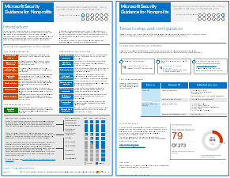

# Microsoft 针对政治宣传活动、非营利组织和其他敏捷型组织的安全指南Microsoft Security Guidance for Political Campaigns, Nonprofits, and Other Agile Organizations

 **摘要：** 针对发展迅速且配置文件威胁不断增加的组织的计划和实现指南。**Summary:** Planning and implementation guidance for fast-moving organizations that have an increased threat profile.
  
如果你所在组织是敏捷型组织，而由你领导一个小的 IT 团队，且威胁配置文件高于平均值，那么本指南对你特别适用。 此解决方案演示如何从头开始快速构建包含安全控件的基本云服务环境。 本指南提供有关保护来自移动设备的数据、标识、电子邮件和访问的说明性安全建议。If your organization is agile, you have a small IT team, and your threat profile is higher than average, this guidance is designed for you. This solution demonstrates how to quickly build an environment with essential cloud services that include secure controls from the start. This guidance includes prescriptive security recommendations for protecting data, identities, email, and access from mobile devices.
  
## 安全解决方案指南Security solution guidance

本指南介绍了如何实现安全的云环境。 该解决方案指南可供任何组织使用。 并且对带有 BYOD 访问权限和来宾帐户的敏捷型组织提供了更多帮助。 可使用本指南作为设计自己环境的起点。 我们欢迎你在 [CloudAdopt@microsoft.com](mailto:CloudAdopt@microsoft.com) 上提供反馈。This guidance describes how to implement a secure cloud environment. The solution guidance can be used by any organization. It includes extra help for agile organizations with BYOD access and guest accounts. You can use this guidance as a starting-point for designing your own environment. We welcome your feedback at [CloudAdopt@microsoft.com](mailto:CloudAdopt@microsoft.com). 
  
|||
|:-----|:-----|
|**项****Item**   |**描述****Description**   |
|**Microsoft 针对政治宣传活动的安全指南****Microsoft Security Guidance for Political Campaigns**   [          ](http://download.microsoft.com/download/B/4/D/B4D520C3-4D0C-4B4D-BFB9-09F0651C2775/MSFT_Cloud_architecture_security%20for%20political%20campaigns.pdf)[          ](http://download.microsoft.com/download/B/4/D/B4D520C3-4D0C-4B4D-BFB9-09F0651C2775/MSFT_Cloud_architecture_security%20for%20political%20campaigns.pdf)   [PDF](http://download.microsoft.com/download/B/4/D/B4D520C3-4D0C-4B4D-BFB9-09F0651C2775/MSFT_Cloud_architecture_security%20for%20political%20campaigns.pdf)  \| [Visio](http://download.microsoft.com/download/B/4/D/B4D520C3-4D0C-4B4D-BFB9-09F0651C2775/MSFT_Cloud_architecture_security%20for%20political%20campaigns.vsdx)[PDF](http://download.microsoft.com/download/B/4/D/B4D520C3-4D0C-4B4D-BFB9-09F0651C2775/MSFT_Cloud_architecture_security%20for%20political%20campaigns.pdf)  \| [Visio](http://download.microsoft.com/download/B/4/D/B4D520C3-4D0C-4B4D-BFB9-09F0651C2775/MSFT_Cloud_architecture_security%20for%20political%20campaigns.vsdx)   |本指南以政治宣传活动的组织为例，可将本指南用作任何环境的起点。This guidance uses a political campaign organization as an example. Use this guidance as a starting point for any environment.    |
|**Microsoft 针对非营利组织的安全指南****Microsoft Security Guidance for Nonprofits**   [          ](http://download.microsoft.com/download/9/4/3/94389612-C679-4061-8DF2-D9A15D72B65F/Microsoft_Cloud%20Architecture_Security%20for%20Nonprofits.pdf)[          ](http://download.microsoft.com/download/9/4/3/94389612-C679-4061-8DF2-D9A15D72B65F/Microsoft_Cloud%20Architecture_Security%20for%20Nonprofits.pdf)   [PDF](http://download.microsoft.com/download/9/4/3/94389612-C679-4061-8DF2-D9A15D72B65F/Microsoft_Cloud%20Architecture_Security%20for%20Nonprofits.pdf)  \| [Visio](http://download.microsoft.com/download/9/4/3/94389612-C679-4061-8DF2-D9A15D72B65F/Microsoft_Cloud%20Architecture_Security%20for%20Nonprofits.vsdx)[PDF](http://download.microsoft.com/download/9/4/3/94389612-C679-4061-8DF2-D9A15D72B65F/Microsoft_Cloud%20Architecture_Security%20for%20Nonprofits.pdf)  \| [Visio](http://download.microsoft.com/download/9/4/3/94389612-C679-4061-8DF2-D9A15D72B65F/Microsoft_Cloud%20Architecture_Security%20for%20Nonprofits.vsdx)   |本指南经过略微修订，适用于非盈利组织。例如，引入了 Office 365 非盈利组织版计划。该技术指南与政治宣传活动解决方案指南相同。This guide is slightly revised for nonprofit organizations. For example, it references Office 365 Nonprofit plans. The technical guidance is the same as the political campaign solution guide.    |
   
## 测试实验室指南Test Lab Guides

要创建此解决方案的开发/测试环境，请使用以下测试实验室指南：To create a dev/test environment for this solution, use the following test lab guides: 
  
- [为政治宣传活动开发/测试环境配置组和用户Configure groups and users for a political campaign dev/test environment](https://docs.microsoft.com/office365/enterprise/configure-groups-and-users-for-a-political-campaign-dev-test-environment)
    
     为 Office 365 和 EMS 创建试用订阅，然后为具有代表性的政治宣传活动创建组和用户。Create trial subscriptions for Office 365 and EMS and then create groups and users for a representative political campaign.
    
- [在政治宣传活动开发/测试环境中创建团队网站Create team sites in a political campaign dev/test environment](https://docs.microsoft.com/office365/enterprise/create-team-sites-in-a-political-campaign-dev-test-environment)
    
    创建四个具有内部、专用、敏感和高度机密级别的 SharePoint Online 团队网站。Create four SharePoint Online team sites with Internal, Private, Sensitive, and Highly Confidential levels of security.
    
有关演示或概念证明的其他安全功能，请参阅 [Office 365 测试实验室指南](http://aka.ms/o365tlgs)。For additional security features for demonstration or proof of concept, see [Office 365 Test Lab Guides](http://aka.ms/o365tlgs).
  
## 另请参阅See Also

[云采用测试实验室指南 (TLG)Cloud adoption Test Lab Guides (TLGs)](https://docs.microsoft.com/office365/enterprise/cloud-adoption-test-lab-guides-tlgs)
  
[Microsoft 云 IT 体系结构资源Microsoft Cloud IT architecture resources](https://docs.microsoft.com/office365/enterprise/microsoft-cloud-it-architecture-resources)

