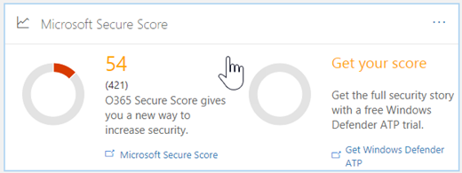

# Office 365 安全功能分数

**摘要**想知道如何安全组织真的是 Office 365 中？安全分数此处以帮助。安全分数分析基于您的正则活动和 Office 365 中的安全设置的组织的安全性，并分配分数。阅读这篇文章，获取安全分数和如何使用它的概述。
  
## 如何获取安全分数

如果您的组织具有订阅包含[Office 365 企业版](https://docs.microsoft.com/office365/enterprise/)、 [Microsoft 365 企业版](https://docs.microsoft.com/microsoft-365/business/)或 Office 365 企业高级版，并且您所需的权限，则可以查看贵组织的安全分数，请访问[https://securescore.office.com](https://securescore.office.com)。 

此外，您可以访问安全性和合规性中心 ([https://protection.office.com](https://protection.office.com))，将在其中找到您当前的分数为您提供一个安全分数构件。

小部件包含指向 Microsoft 安全分数，这将您带到安全分数仪表板的 Office 365 的链接。

> [!NOTE]
> 您必须是 Office 365 管理员，如全局管理员或安全管理员、 访问安全分数。
  
## 如何工作

安全分数找出 Office 365 服务，然后您将 （如 OneDrive、 SharePoint 和 Exchange） 查看您的设置和活动并到一个比较基准建立由 Microsoft 对它们进行比较。您将获取基于您在与最佳安全做法如何对齐的分数。
  
您还将建议上以提高组织的分数可采取的步骤。 
  

  
展开要了解有关什么步骤，它将帮助保护，从您的威胁和多少 points 您分数会增加后遵循建议的操作。
  

  
若要对贵组织的安全性，请参阅您的操作的影响，选择**分数分析器**选项卡，并查看历史记录。 
  

  
下面的图表中，您将看到分数和操作的列表，按类别。
  

  
## 如何帮助保护分数

使用安全分数有助于提高组织的安全性鼓励您可以在 Office 365 （其中许多您已购买，但可能不知道的） 中使用的内置安全功能。若要了解有关这些功能使用工具会帮助您应注意，您采取右步骤保护您的组织免受威胁段。
  
但不只是为其相信我们所说。使用安全分数客户已看到其分数增加 5 次比客户不使用它。（及其分数增加对应于在组织中使用的安全功能）。
  
> [!NOTE]
> 安全分数不 express 绝对的度量单位的方式可能要获取破坏。它表示您采用控件可以偏移正在看见的风险的程度。没有服务都无法保证，您将不违反，和安全分数不应视为以任何方式保证。 
  
## 常见问题

### 谁可以使用安全分数？

具有管理员权限 （全局管理员或自定义管理角色） 的 Office 365 企业版、 Microsoft 365 业务或 Office 365 企业高级版订阅，可以访问在安全分数的人[https://securescore.office.com](https://securescore.office.com)。未分配管理员角色的用户将无法访问 Secure 分数。但是，管理员可以使用该工具与组织中的其他人共享其结果。我们要看包括权限列表中的其他，非管理员角色将来。如果您希望我们要考虑的特定角色，让我们知道中发布[Office 安全、 隐私&amp;合规性社区](https://techcommunity.microsoft.com/t5/Security-Privacy-Compliance/bd-p/security_privacy)。
  
### 用途 [不对评分] 意味着？

标记为 **[不对评分]** 的操作是您可以在您的组织中执行，但因为它们不在 （尚未 ！） 工具挂钩不分数。因此，您仍可以提高安全性，但不会立即获取这些操作的 credit。 
  
### 分数更新的频率

分数计算每一天 (大约 1:00 PST) 一次。如果您更改了测量操作，分数将自动更新一天。计 48 小时才能反映您分数的更改。
  
### 哪些人可以看到我的结果？

结果进行筛选可以仅对您的组织中的人员，被分配管理员角色 （全局管理员或自定义管理角色） 显示分数。
  
### 我分数更改。如何明白为什么？

上**分数分析器**页上，单击某一天，数据点，然后向下滚动到的已完成并不完整的操作，以找出哪些该天的更改，请参阅。 
  
### 安全分数是否测量获取看见我的风险？

在短，否。安全分数不 express 绝对的度量单位的方式可能要获取破坏。它表示您采用可以偏移正在看见的风险的功能的范围。没有服务都无法保证，您将不违反，和安全分数不应视为以任何方式保证。
  
### 应解释分数的方式

您正在配置的给定点，推荐安全功能或执行与安全性相关的任务 （如查看报告）。某些操作进行评分部分完成，例如，让您的用户的多因素身份验证 (MFA)。您安全 Score 直接是代表您使用的 Microsoft 安全服务。请记住安全应始终平衡与可用性。所有安全控件都具有用户影响组件。使用较低的用户的影响的控件都应有用户的日常操作很少不起作用。
  
若要查看您分数的历史记录，请转到**分数分析器**页。选择要查看哪些控件已启用的日期和什么 points 您挣对每个特定日期。 
  
### 我有另一个控件主意。如何让您知道是什么？

我们很乐意倾听中。请在发布您的想法[Office 安全、 隐私&amp;合规性社区](https://go.microsoft.com/fwlink/?linkid=836898)。我们正在侦听，并希望安全分数，包括对您重要的所有选项。
  
### 内容失效。我应与谁联系？

如果您有任何问题，请让我们知道中发布[Office 安全、 隐私&amp;合规性社区](hhttps://techcommunity.microsoft.com/t5/Security-Privacy-Compliance/bd-p/security_privacy)。我们正在监视社区，并将提供帮助。
  
### 我的组织只有某些安全功能。这将影响分数？

安全分数计算您根据您购买的服务的分数。例如，如果仅购买 Exchange Online 的计划，您不被计分 SharePoint Online 的安全功能。分数的分母，为是适用于您购买的产品的控件的所有比较基准的总数。分子是为其所有控件的已完成或部分已完成的操作，以满足该控件的总和。

## 相关主题

[安全仪表板概述 （英文)](security-dashboard.md)

[我订阅了哪些产品？](https://docs.microsoft.com/office365/admin/admin-overview/what-subscription-do-i-have?view=o365-worldwide)
  

