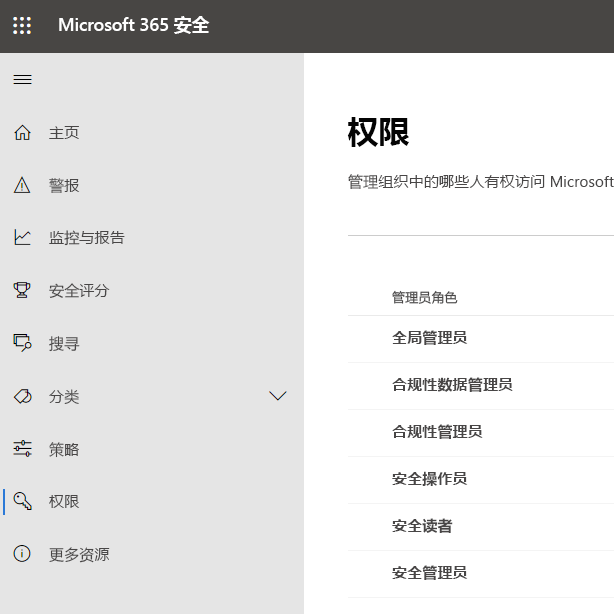
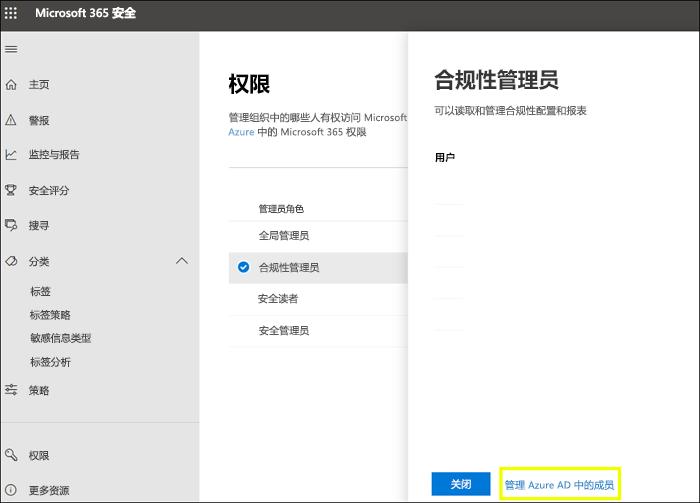
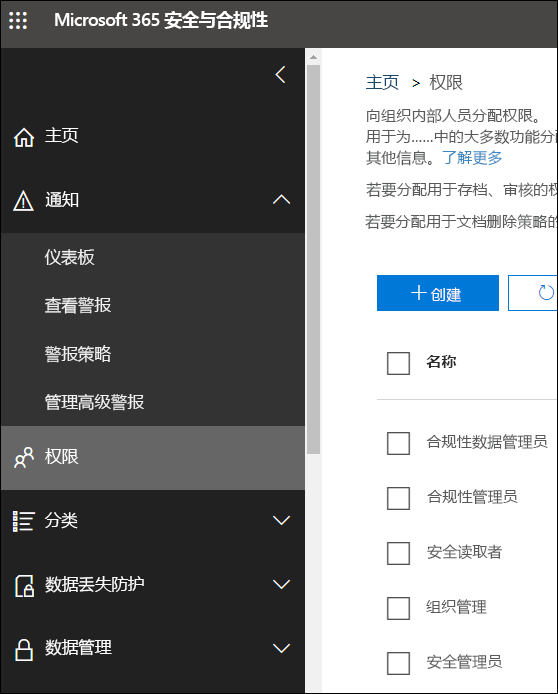

# Microsoft 365 合规中心和 Microsoft 365 安全中心中的权限

组织需要管理跨所有 Microsoft 365 服务的安全和合规性方案。 并且你需要灵活地向组织 IT 组中的正确人员授予正确的管理员权限。 使用 Microsoft 365 安全中心或 Microsoft 365 合规中心，可以集中管理与安全或合规性相关的所有任务的权限。

在全局管理员分配这些管理员角色后，这些管理员可以访问跨 Microsoft 365 中所有服务（例如，Microsoft 365 安全中心、Microsoft 365 合规中心、Azure、Office 365 和企业移动性 + 安全性）的功能和数据。

## Microsoft 365 角色是什么

Microsoft 365 合规中心和 Microsoft 365 安全中心中显示的角色均为 Azure Active Directory 角色。 这些角色旨在与组织 IT 组中的工作职能保持一致，从而可以轻松地使人员获得完成其工作所需的所有权限。

|**角色**|**说明**|
|:-----|:-----|
|**全局管理员**|具有此角色的用户可以访问所有 Microsoft 365 服务中的所有管理功能。 只有全局管理员才能分配其他管理员角色。|
|**合规性数据管理员**|具有此角色的用户可以在 Microsoft 365 中跟踪组织的数据，确保数据受到保护，并深入了解任何问题以帮助缓解风险。|
|**合规性管理员**|具有此角色的用户可以帮助组织遵守任何法规要求，管理电子数据展示案例，并维护 Microsoft 365 位置、标识和应用中的数据治理策略。|
|**安全操作员**|具有此角色的用户可以查看、调查和响应对 Microsoft 365 用户、设备和内容的活动威胁。|
|**安全读者**|具有此角色的用户可以查看和调查对 Microsoft 365 用户、设备和内容的活动威胁，但（不同于安全操作员）他们无权采取措施来进行响应。|
|**安全管理员**|具有此角色的用户可通过管理安全策略、查看 Microsoft 365 产品中的安全分析和报告以及及时了解威胁形势来控制组织的总体安全。|

## Microsoft 365 角色有权访问的内容

可用角色及分配到这些角色的用户可执行的操作如下：

### 全局管理员

具有此角色的用户有权访问 Azure Active Directory 以及使用 Azure Active Directory 标识的服务（例如 Microsoft 365 安全中心、Microsoft 365 合规中心、Exchange Online、SharePoint Online 和 Skype for Business Online）中的所有管理功能。 注册 Azure Active Directory 租户的人员将成为全局管理员。 只有全局管理员才能分配其他管理员角色。 公司中可以有多个全局管理员。 全局管理员可以为任何用户和所有其他管理员重置密码。

### 合规性管理员

具有此角色的用户有权管理 Microsoft 365 合规中心、Microsoft 365 管理中心、Azure 和 Office 365 安全与合规中心中的合规性相关功能。 这些用户还可以管理 Exchange 管理中心、Teams 和 Skype for Business 管理中心内的所有功能，并可创建适用于 Azure 和 Microsoft 365 的支持票证。

|**在此服务中...**|**合规性管理员可以...**|
|:-----|:-----|
|[**Microsoft 365 合规性中心**](https://compliance.microsoft.com/)|跨 Microsoft 365 服务保护和管理组织数据。    管理合规性警报。|
|[**合规性管理器**](https://docs.microsoft.com/office365/securitycompliance/meet-data-protection-and-regulatory-reqs-using-microsoft-cloud)|跟踪、分配并验证组织的法规合规性活动。|
|[**Office 365 安全与合规中心**](https://support.office.com/article/About-Office-365-admin-roles-da585eea-f576-4f55-a1e0-87090b6aaa9d)|管理数据治理。    执行法律和数据调查。    管理数据主体请求。|
|[**Intune**](https://docs.microsoft.com/intune/role-based-access-control)|查看所有 Intune 审核数据。|
|[**云应用安全**](https://docs.microsoft.com/cloud-app-security/manage-admins)|拥有只读权限，可以管理警报。    可以创建和修改文件策略并允许执行文件管理操作。    可以查看数据管理下的所有内置报告。|

### 合规性数据管理员

具有此角色的用户有权保护和跟踪 Microsoft 365 合规中心、Microsoft 365 管理中心和 Azure 中的数据。 这些用户还可以管理 Exchange 管理中心、Compliance Manager、Teams 和 Skype for Business 管理中心内的所有功能，并可创建适用于 Azure 和 Microsoft 365 的支持票证。

|**在此服务中...**|**合规性数据管理员可以...**|
|:-----|:-----|
|[**Microsoft 365 合规性中心**](https://compliance.microsoft.com/)|跨 Microsoft 365 服务保护和管理组织数据。    管理合规性警报。    管理敏感度标签|
|[**合规性管理器**](https://docs.microsoft.com/office365/securitycompliance/meet-data-protection-and-regulatory-reqs-using-microsoft-cloud)|跟踪、分配并验证组织的法规合规性活动。|
|[**Office 365 安全与合规中心**](https://support.office.com/article/About-Office-365-admin-roles-da585eea-f576-4f55-a1e0-87090b6aaa9d)|管理数据治理。    执行法律和数据调查。    管理数据主体请求。    管理敏感度标签|
|[**Intune**](https://docs.microsoft.com/intune/role-based-access-control)（即将推出）|查看所有 Intune 审核数据。|
|[**云应用安全**](https://docs.microsoft.com/cloud-app-security/manage-admins)|使用只读权限查看信息。  管理警报。    创建和修改文件策略并允许执行文件管理操作。    查看数据管理下的所有内置报告。|

### 安全管理员

具有此角色的用户有权管理 Microsoft 365 安全中心、Azure Active Directory Identity Protection、Azure 信息保护和 Office 365 安全与合规中心中与安全相关的功能。

|**在此服务中...**|**安全管理员...**|
|:-----|:-----|
|[**Microsoft 365 安全中心**](https://security.microsoft.com/)|跨 Microsoft 365 服务监视与安全相关的策略。     管理安全威胁和警报。    查看报告。    管理敏感度标签。|
|**Identity Protection 中心**|执行“安全读者”角色可以执行的所有操作，此外，还执行所有 Identity Protection 中心操作，但不可重置密码。|
|[**Privileged Identity Management**](https://docs.microsoft.com/azure/active-directory/privileged-identity-management/pim-configure)|执行“安全读者”角色可执行的所有操作。    **无法**管理 Azure AD 角色分配或设置。|
|[**Office 365 安全与合规中心**](https://support.office.com/article/About-Office-365-admin-roles-da585eea-f576-4f55-a1e0-87090b6aaa9d)|管理安全策略。    查看、调查和响应安全威胁    查看报告。    管理敏感度标签。|
|**Azure 高级威胁防护**|监视和响应可疑安全活动。|
|**Windows Defender ATP 和 EDR**|分配角色。    管理计算机组。    配置终结点威胁检测和自动修正。    查看、调查并响应警报。|
|[**Intune**](https://docs.microsoft.com/intune/role-based-access-control)|视图用户、设备、注册、配置和应用程序信息。    **无法**对 Intune 进行更改。|
|[**云应用安全**](https://docs.microsoft.com/cloud-app-security/manage-admins)|添加管理员、添加策略和设置、上传日志以及执行管理操作。|
|[**Azure 安全中心**](https://docs.microsoft.com/azure/role-based-access-control/built-in-roles)（即将支持）|查看安全策略、查看安全状态、编辑安全策略、查看警报和建议、关闭警报和建议。|
|[**Office 365 服务运行状况**](https://docs.microsoft.com/office365/enterprise/view-service-health)|查看 Office 365 服务的运行状况。|

### 安全操作员

具有此角色的用户可以管理警报，对安全相关的功能具有全局只读访问权限，包括 Microsoft 365 安全中心、Azure Active Directory、Identity Protection、Privileged Identity Management 中的所有信息，并且能够阅读 Azure Active Directory 登录报告和审核日志，还授予了对 Office 365 安全与合规中心的只读权限。

|**在此服务中...**|**安全操作员可以...**|
|:-----|:-----|
|[**Microsoft 365 安全中心**](https://security.microsoft.com/)|执行“安全读者”角色可执行的所有操作。    查看、调查和响应安全警报。|
|**Identity Protection 中心**（即将支持）|执行“安全读者”角色可执行的所有操作。|
|[**Privileged Identity Management**](https://docs.microsoft.com/azure/active-directory/privileged-identity-management/pim-configure)|执行“安全读者”角色可执行的所有操作。|
|[**Office 365 安全与合规中心**](https://support.office.com/article/About-Office-365-admin-roles-da585eea-f576-4f55-a1e0-87090b6aaa9d)|执行“安全读者”角色可执行的所有操作。    查看、调查和响应安全威胁|
|**Windows Defender ATP 和 EDR**|执行“安全读者”角色可执行的所有操作。    查看、调查并响应警报。|
|[**Intune**](https://docs.microsoft.com/intune/role-based-access-control)|视图用户、设备、注册、配置和应用程序信息。    **无法**对 Intune 进行更改。|
|[**云应用安全**](https://docs.microsoft.com/cloud-app-security/manage-admins)|执行“安全读者”角色可以执行的所有操作，此外，还可以查看和关闭警报。|
|[**Office 365 服务运行状况**](https://docs.microsoft.com/office365/enterprise/view-service-health)|查看 Office 365 服务的运行状况。|

### 安全读者

具有此角色的用户对安全相关的功能具有全局只读访问权限，包括 Microsoft 365 安全中心、Azure Active Directory、Identity Protection、Privileged Identity Management 中的所有信息，并且能够阅读 Azure Active Directory 登录报告和审核日志，还授予了对 Office 365 安全与合规中心的只读权限。

|**在此服务中...**|**安全读者可以...**|
|:-----|:-----|
|[**Microsoft 365 安全中心**](https://security.microsoft.com/)|跨 Microsoft 365 服务查看与安全相关的策略。    查看安全威胁和警报。    查看报告。|
|**Identity Protection 中心**|阅读有关安全功能的所有安全报告和设置信息：反垃圾邮件、加密、数据丢失防护 (DLP)、反恶意软件、高级威胁防护 (ATP)、反网络钓鱼和邮件流规则（也称为传输规则）。|
|[**Privileged Identity Management**](https://docs.microsoft.com/azure/active-directory/privileged-identity-management/pim-configure)|使用只读访问权限查看 Azure AD PIM 中显示的所有信息：Azure AD 角色分配的策略和报告、安全审核以及（以后）Azure AD 角色分配以外的方案的策略数据和报告。    **无法**注册 Azure AD PIM 或对其进行任何更改。 担任此角色的人员可以在 PIM 门户中或通过 PowerShell 为符合条件的用户激活其他角色（例如，全局管理员或特权角色管理员）。|
|[**Office 365 安全与合规中心**](https://support.office.com/article/About-Office-365-admin-roles-da585eea-f576-4f55-a1e0-87090b6aaa9d)|查看安全策略。    查看和调查安全威胁。    查看报告。|
|**Windows Defender ATP 和 EDR**|查看和调查警报。|
|[**Intune**](https://docs.microsoft.com/intune/role-based-access-control)|视图用户、设备、注册、配置和应用程序信息。    **无法**对 Intune 进行更改。|
|[**云应用安全**](https://docs.microsoft.com/cloud-app-security/manage-admins)|使用只读权限查看信息。    管理警报。|
|[**Azure 安全中心**](https://docs.microsoft.com/azure/role-based-access-control/built-in-roles)|查看建议和警报。    查看安全策略。    查看安全状态，但无法进行更改。|
|[**Office 365 服务运行状况**](https://docs.microsoft.com/office365/enterprise/view-service-health)|查看 Office 365 服务的运行状况。|

## 全局管理员可以管理 Azure Active Directory 中的角色。

在 Microsoft 365 合规中心和 Microsoft 365 安全中心中，选择一个角色后，可查看其分配。 但若要管理这些分配，需要转到 Azure Active Directory。

有关详细信息，请参阅[查看和分配 Azure Active Directory 中的管理员角色](https://docs.microsoft.com/azure/active-directory/users-groups-roles/directory-manage-roles-portal)。

## 管理服务中的角色，而不是 Azure Active Directory 中的角色

Microsoft 365 合规中心和 Microsoft 365 安全中心中显示的角色也会显示在他们拥有权限的服务中。 例如，可以在 Office 365 安全与合规中心中看到这些角色。

### 中断继承

在 Azure Active Directory 中管理这些角色时，你是在为**所有** Microsoft 365 服务集中管理这些角色，了解这一点非常重要。 然而，在管理特定服务（例如 Office 365 安全与合规中心），所管理的角色**仅**针对特定服务。 服务中角色的分配和权限覆盖授予 Azure Active Directory 角色的任何权限。

这可能很有用，例如，如果一个人被分配为安全管理员角色，那么他就无权管理事件。 但是，你可以使用 Windows Defender 高级威胁防护中的权限来为该服务中的事件管理提供特定的权限。

## 在何处查找每个 Microsoft 365 服务的角色信息

通过将用户分配到 Microsoft 365 合规性或安全管理员角色之一，你可以授予该用户对一系列 Microsoft 365 服务的权限。 使用下面的链接可以找到关于每个服务中角色特定权限的更多信息。

|**Microsoft 365 服务**|**角色信息**|
|:-----|:-----|
|Office 365 和 Microsoft 365 业务计划中的管理员角色|[Office 365 管理员角色](https://docs.microsoft.com/office365/admin/add-users/about-admin-roles?view=o365-worldwide)|
|Azure Active Directory (Azure AD) 和 Azure AD Identity Protection|[Azure AD 管理员角色](https://docs.microsoft.com/azure/active-directory/users-groups-roles/directory-assign-admin-roles)|
|Azure 高级威胁防护|[Azure ATP 角色组](https://docs.microsoft.com/azure-advanced-threat-protection/atp-role-groups)|
|Azure 信息保护|[Azure AD 管理员角色](https://docs.microsoft.com/azure/active-directory/users-groups-roles/directory-assign-admin-roles)|
|合规性管理器|[合规性管理器角色](https://docs.microsoft.com/office365/securitycompliance/meet-data-protection-and-regulatory-reqs-using-microsoft-cloud#permissions-and-role-based-access-control)|
|Exchange Online|[Exchange 基于角色的访问控制](https://docs.microsoft.com/exchange/understanding-role-based-access-control-exchange-2013-help)|
|Intune|[Intune 基于角色的访问控制](https://docs.microsoft.com/intune/role-based-access-control)|
|托管桌面|[Azure AD 管理员角色](https://docs.microsoft.com/azure/active-directory/users-groups-roles/directory-assign-admin-roles)|
|Microsoft Cloud App Security|[基于角色的访问控制](https://docs.microsoft.com/cloud-app-security/manage-admins)|
|Office 365 安全与合规中心|[Office 365 管理员角色](https://docs.microsoft.com/office365/SecurityCompliance/permissions-in-the-security-and-compliance-center)|
|Privileged Identity Management|[Azure AD 管理员角色](https://docs.microsoft.com/azure/active-directory/users-groups-roles/directory-assign-admin-roles)|
|安全功能分数|[Azure AD 管理员角色](https://docs.microsoft.com/azure/active-directory/users-groups-roles/directory-assign-admin-roles)|
|SharePoint Online|[Azure AD 管理员角色](https://docs.microsoft.com/azure/active-directory/users-groups-roles/directory-assign-admin-roles)    [关于 Office 365 中的 SharePoint 管理员角色](https://docs.microsoft.com/sharepoint/sharepoint-admin-role)|
|Teams/Skype for Business|[Azure AD 管理员角色](https://docs.microsoft.com/azure/active-directory/users-groups-roles/directory-assign-admin-roles)|
|Windows Defender 高级威胁防护|[Windows Defender ATP 基于角色的访问控制](https://docs.microsoft.com/windows/security/threat-protection/windows-defender-atp/rbac-windows-defender-advanced-threat-protection)|

## 即将支持的功能

我们仍在研究 Microsoft 365 合规中心和 Microsoft 365 安全中心中的权限。 例如，我们目前正致力于支持以下功能：

- 管理 Microsoft 365 合规中心和 Microsoft 365 安全中心中的角色，而不是转到 Azure Active Directory。

- 通过添加或删除特定权限来自定义角色。

- 创建具有所选权限的自定义角色。
