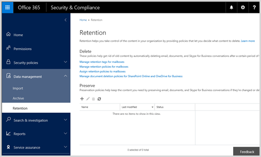
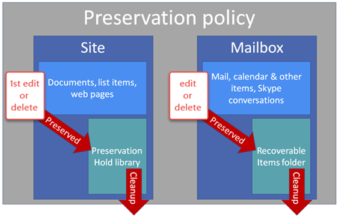

# 保留策略概述Overview of preservation policies

> [!IMPORTANT]
> 如果您已使用保留策略，该策略具有已自动转换为是一项新功能的所有保留策略的作用的保留策略和更多内容。保留策略将继续工作，并保留内容，而无需从您的任何更改。您可以安全中**保留**在页面上找到这些策略&amp;合规性中心。有关详细信息，请参阅[保留策略发生了什么变化？](retention-policies.md#what-happened-to-preservation-policies)If you were using a preservation policy, that policy has been automatically converted to a retention policy, which is a new feature that does everything a preservation policy does and more. The preservation policy will continue to work and preserve your content without requiring any changes from you. You can find these policies on the **Retention** page in the Security &amp; Compliance Center. For more information, see [What happened to preservation policies?](retention-policies.md#what-happened-to-preservation-policies)
  
为遵守行业法规或内部的策略，组织希望某段时间内保留内容。与 Office 365 中的保留策略，可以保留无限期或特定的持续时间的网站、 邮箱和公用文件夹中的内容。您还可以筛选通过提供关键字或日期范围以缩小结果的范围将被保留的内容。To comply with industry regulations or internal policies, organizations want to preserve content for a certain period of time. With a preservation policy in Office 365, you can preserve content in sites, mailboxes, and public folders indefinitely or for a specific duration. You can also filter the content that will be preserved by supplying keywords or a date range to narrow the results.
  
例如，您可以保留中特定邮箱和 7 年属于 Sales 部门的网站的内容，并通过反映您想要保留仅包含特定的内容从过去两年进一步缩小范围策略的作用域客户端的名称。For example, you can preserve the content in specific mailboxes and sites belonging to the Sales Department for seven years, and further narrow the scope of the policy by saying that you want to preserve only content from the last two years that contains a specific client's name.
  
受保留策略内容时，用户可以继续编辑并使用的内容，就好像 nothing 已更改内容的保留其原始位置中的位置，因为。但是，如果某人编辑或删除属于策略的内容，将副本保存到一个安全的位置，其中保留策略生效时。When content is subject to a preservation policy, people can continue to edit and work with the content as if nothing's changed because the content's preserved in place, in its original location. But if someone edits or deletes content that's subject to the policy, a copy is saved to a secure location where it's preserved while the policy is in effect.
  
最后，某些组织可能需要符合规则定义如证券交易委员会 （秒） 规则 17a-4，这需要的保留策略已打开后，它无法关闭或进行限制较少的管理机构。为了满足此要求，您可以使用保留锁。策略的锁定后，没有人 — 包括管理员 — 可关闭该策略，或者使其限制较少。Finally, some organizations may need to comply with rules defined by regulatory bodies such as the Securities and Exchange Commission (SEC) Rule 17a-4, which requires that after a preservation policy is turned on, it cannot be turned off or made less restrictive. To meet this requirement, you can use Preservation Lock. After a policy's been locked, no one—including the administrator—can turn off the policy or make it less restrictive.
  
创建和管理 Office 365 安全性保留页上的保留策略&amp;合规性中心。You create and manage preservation policies on the Retention page in the Office 365 Security &amp; Compliance Center.
  

  
> [!NOTE]
> 若要保留策略中包括 Exchange Online 邮箱，邮箱必须分配的 Exchange Online 计划 2 许可证。如果邮箱已分配的 Exchange Online 计划 1 许可证，您必须将其分配单独 Exchange Online Archiving 的许可证包括在保留策略。To include an Exchange Online mailbox in a preservation policy, the mailbox must be assigned an Exchange Online Plan 2 license. If a mailbox is assigned an Exchange Online Plan 1 license, you would have to assign it a separate Exchange Online Archiving license to include it in a preservation policy. 
  
## 保留策略就地处理内容的方式How a preservation policy works with content in place

当您在保留策略中包含网站、 邮箱或公用文件夹时，内容保留在其原始位置。人员可以继续使用他们的文档或邮件，但作为它的内容的副本时启动策略存在保留。对于网站，演示文稿保留库内容的保留为邮箱和公用文件夹，内容的保留在可恢复邮件文件夹中。这些安全的位置和保留的内容看不到大多数人。使用保留策略，人员不甚至需要知道其内容受制策略。When you include a site, mailbox, or public folder in a preservation policy, the content remains in its original location. People can continue to work with their documents or mail, but a copy of the content as it existed when you initiated the policy is preserved. For sites, content's preserved in the Preservation Hold library; for mailboxes and public folders, content's preserved in the Recoverable Items folder. These secure locations and the preserved content are not visible to most people. With a preservation policy, people do not even need to know their content is subject to the policy.
  

  
### 网站内容Site content

保留策略应用于网站的级别。当您在保留策略中包括网站时，会创建一个保留保留的库，如果尚不存在。大多数用户无法查看演示文稿保留库，因为它是仅对网站集所有者可见。A preservation policy is applied at the level of a site. When you include a site in a preservation policy, a Preservation Hold library is created, if one doesn't already exist. Most users can't view the Preservation Hold library because it's visible only to site collection owners.
  
如果联系人尝试更改或删除受保留策略的网站中的内容，首先策略检查内容的自应用策略以来已更改。如果这是第一次更改，因为应用保留策略，该策略将内容复制到演示文稿保留库中，并允许更改或删除原始内容的人员。请注意网站中的任何内容，可以复制到演示文稿保留库中，即使内容不能匹配的查询使用保留策略的筛选器。If a person attempts to change or delete content in a site that's subject to a preservation policy, first the policy checks whether the content's been changed since the policy was applied. If this is the first change since the preservation policy was applied, the policy copies the content to the Preservation Hold library, and then allows the person to change or delete the original content. Note that any content in the site can be copied to the Preservation Hold library, even if the content does not match the filter of the query used by the preservation policy.
  
然后，计时器作业将清理保存保留库。计时器作业会定期运行，并将保存保留库中的所有内容与网站上的保留策略使用的筛选器进行比较。除非内容与其中至少一个筛选器匹配，否则计时器作业会永久删除保存保留库中的内容。Then a timer job cleans up the Preservation Hold library. The timer job runs periodically and compares all content in the Preservation Hold library to the filters used by the preservation policies on the site. Unless content matches at least one of the filters, the timer job permanently deletes the content from the Preservation Hold library.
  
以前应用于应用保留策略时存在的内容。此外，将删除后保留创建或添加到网站，它包含在策略之后的任何新内容。但是，新的内容不复制到其进行编辑，仅当它被删除时的演示文稿保留库第一个时间。若要保留的所有文件版本，您需要启用版本控制 — 版本控制，请参阅一节。The previous applies to content that exists when the preservation policy is applied. In addition, any new content that's created or added to the site after it was included in the policy will be preserved after deletion. However, new content isn't copied to the Preservation Hold library the first time it's edited, only when it's deleted. To preserve versions for all files, you need to turn on versioning—see the later section on versioning.
  
### 邮箱和公用文件夹内容Mailbox and public folder content

对于用户的邮件和其他项目，保留策略在邮箱级别应用。对于公用文件夹，在文件夹级别（而不是邮箱级别）应用保留策略。邮箱和公用文件夹都使用“可恢复的项目”文件夹来保留邮件。只有已分配电子数据展示权限的人员才可以查看其他用户的“可恢复的项目”文件夹。 For a user's mail and other items, a preservation policy is applied at the level of a mailbox. For a public folder, a preservation policy is applied at the folder level, not the mailbox level. Both a mailbox and a public folder use the Recoverable Items folder to preserve items. Only people that have been assigned eDiscovery permissions can view another user's Recoverable Items folder. 
  
默认情况下，联系人从已删除邮件文件夹中，之外的文件夹中删除一条消息时邮件会移到已删除邮件文件夹中。当联系人从已删除邮件文件夹中删除项目时，邮件被移动到可恢复邮件文件夹，并将从用户的视图中消失。此外，联系人可以软删除任何文件夹，其中绕过已删除邮件文件夹，并将项目放在可恢复邮件文件夹中直接中的项目 (SHIFT + DELETE)。By default, when a person deletes a message from a folder other than the Deleted Items folder, the message is moved to the Deleted Items folder. When a person deletes an item from the Deleted Items folder, the message is moved to the Recoverable Items folder and disappears from the user's view. In addition, a person can soft delete an item (SHIFT+DELETE) in any folder, which bypasses the Deleted Items folder and places the item directly in the Recoverable Items folder.
  
将邮箱包含在保留策略中之后，已删除邮件会移动到“可恢复的项目”文件夹内的“DiscoveryHold”文件夹中。当邮箱助理定期处理邮箱时，将评估此文件夹中的邮件。除非内容与保留策略使用的至少一个筛选器匹配，否则邮箱助理会从“可恢复的项目”文件夹中永久删除该内容。When a mailbox is included in a preservation policy, deleted items are moved to the DiscoveryHold folder inside the Recoverable Items folder. When the mailbox assistant periodically processes the mailbox, it evaluates messages in this folder. Unless content matches at least one of the filters used by a preservation policy, the mailbox assistant permanently deletes the content from the Recoverable Items folder.
  
可恢复邮件文件夹还包含版本文件夹。当某人尝试更改邮箱项目的某些属性 — 主题，例如 body，附件、 发件人和收件人，或发送或接收邮件的日期 — 提交更改之前的原始项目副本保存到版本文件夹。每个后续更改发生这种情况。删除保留策略后，通过邮箱助理移除版本文件夹中的副本。The Recoverable Items folder also contains a Versions folder. When a person attempts to change certain properties of a mailbox item—such as the subject, body, attachments, senders and recipients, or date sent or received for a message—a copy of the original item is saved to the Versions folder before the change is committed. This happens for each subsequent change. After the preservation policy is removed, copies in the Versions folder are removed by the mailbox assistant.
  
### 保留策略的存储位置Where a preservation policy is stored

创建保留策略时，将集中存储安全中&amp;合规性中心，然后将其部署到不同的内容源，其中包括策略，如网站、 邮箱和公用文件夹。When you create a preservation policy, it's stored centrally in the Security &amp; Compliance Center and then deployed to the different content sources that the policy includes, such as sites, mailboxes, and public folders.
  
将保留策略部署到这些内容源后，策略的工作方式将与电子数据展示就地保留完全相同。有关就地保留的详细信息，请参阅：After a preservation policy is deployed to those content sources, the policy works exactly the same as an eDiscovery in-place hold. For more information on in-place holds, see:
  
- [电子数据展示和就地保留的概述](https://go.microsoft.com/fwlink/p/?LinkID=404352)(SharePoint Online)[Overview of eDiscovery and in-place holds](https://go.microsoft.com/fwlink/p/?LinkID=404352) (SharePoint Online) 
    
- [就地保留和诉讼保留](https://go.microsoft.com/fwlink/p/?LinkID=404353)(Exchange Online)[In-Place Hold and Litigation Hold](https://go.microsoft.com/fwlink/p/?LinkID=404353) (Exchange Online) 
    
- [可恢复的项目文件夹](https://go.microsoft.com/fwlink/p/?LinkID=404354)(Exchange Online)[Recoverable Items Folder](https://go.microsoft.com/fwlink/p/?LinkID=404354) (Exchange Online) 
    
### 与电子数据展示保留的保留策略Preservation policy vs. eDiscovery hold

尽管这些功能的保留内容，这些功能不能混淆因为它们提供不同的用途：While it's true that both of these features hold content, these features should not be confused because they serve different purposes:
  
- **如果您需要保留内容保留要求的一部分，请使用保留策略。** 例如，如果您需要将保留内容七个年作为保留计划的一部分，请使用保留策略。保留策略可以为特定时间段，保留内容和时间段末尾的内容自动释放从策略。策略还可将锁定，以便没有可关闭该策略，或者使其限制较少。电子数据展示保留不能被锁定，或者指定的时间段。此外，保留策略通常具有年中，日志记录操作持续而 eDiscovery 保留项是临时，通常会持续仅的法律案件持续时间。**If you need to preserve content as part of a retention requirement, use a preservation policy.** For example, if you need to retain content for seven years as part of your retention plan, use a preservation policy. A preservation policy can preserve content for a specific time period, and at the end of that time period, the content's automatically released from the policy. The policy can also be locked so that no one can turn off the policy or make it less restrictive. An eDiscovery hold cannot be locked or specify a time period. Also, a preservation policy commonly has a duration of years, while an eDiscovery hold is temporary and commonly lasts only the duration of a legal case. 
    
    此外，您可以创建保留策略不可能需要电子数据展示，例如创建情况下，添加成员，或执行内容搜索的其他步骤。In addition, you can create a preservation policy without the additional steps that eDiscovery may require, such as creating cases, adding members, or doing content searches.
    
- **如果您需要的法律或电子数据展示要求一部分保留内容，请使用 eDiscovery 保留项。** 例如，如果您需要作为法律请求的一部分中特定位置保留内容，请使用 eDiscovery 保留项。在电子数据展示，与案例相关的内容为通常敏感内容或者特权，因此不同情况下可限制为不同的成员。另外，电子数据展示支持可以保存、 预览、 使用高级电子数据展示，分析的内容搜索或导出结果。**If you need to hold content as part of a legal or eDiscovery requirement, use an eDiscovery hold.** For example, if you need to hold content in specific locations as part of a legal request, use an eDiscovery hold. In eDiscovery, the content relevant to a case is typically sensitive or privileged, so different cases can be restricted to different members. In addition, eDiscovery supports content searches that can be saved, previewed, analyzed with Advanced eDiscovery, or have the results exported. 
    
    与保留策略，请在不同 eDiscovery 保留项不能指定时间段-之前将其关闭或将其删除电子数据展示保留为生效。另外，电子数据展示保留不能被锁定。Unlike a preservation policy, an eDiscovery hold cannot specify a time period - an eDiscovery hold is in effect until you turn it off or delete it. Also, an eDiscovery hold cannot be locked.
    
## 保留策略处理网站中文档版本的方式How a preservation policy works with document versions in a site

保留策略不自动保留网站中文档的所有版本。为此，您需要启用版本控制网站中的文档库。有关详细信息，请参阅[启用和配置版本控制的列表或库](https://go.microsoft.com/fwlink/p/?LinkID=404350)。A preservation policy doesn't automatically preserve all versions of a document in a site. To do so, you need to turn on versioning for the document libraries in the site. For more information, see [Enable and configure versioning for a list or library](https://go.microsoft.com/fwlink/p/?LinkID=404350).
  
如果从要保留的网站中删除文档库启用文档版本控制，会保留已删除文档的所有版本。If a document is deleted from a site that's being preserved and document versioning is turned on for the library, all versions of the deleted document are preserved. 
  
如果不启用文档版本控制和项目受制于多个保留策略，保留的版本是每个保留策略生效时的当前的一个。例如，如果版本 27 项目的最新网站将保留第一个时间和版本 51 时最新网站时保留第二次版本 27 和 51 会保留。If document versioning isn't turned on and an item is subject to several preservation policies, the version that's preserved is the one that's current when each preservation policy takes effect. For example, if version 27 of an item is the most recent when the site is preserved the first time, and version 51 is the most recent when the site is preserved the second time, versions 27 and 51 are preserved.
  
## 筛选保留策略Filtering a preservation policy

您可以通过向策略中添加关键字或日期范围来缩小受保留策略限制的内容的范围。You can narrow down the content subject to a preservation policy by adding keywords or a date range to the policy. 
  

  
### 使用关键字进行筛选Filter by using keywords

保留策略支持关键字查询语言 (KQL)。例如，您可以使用基本运算符 like 和和或，以及您可以操作邻近搜索其中"wingtip NEAR(30) marketing"标识结果"wingtip"所在中的"marketing"的 30 个字符。关键字查询可帮助您确定并保留与相关的内容。A preservation policy supports Keyword Query Language (KQL). For example, you can use basic operators like AND and OR, and you can do a proximity search where "wingtip NEAR(30) marketing" identifies results where "wingtip" is within 30 characters of "marketing". A keyword query helps you to identify and preserve just the relevant content.
  
### 使用日期范围进行筛选Filter by using a date range

您还可以筛选保留，从而仅保留特定日期范围内的内容。对于邮件，该日期与接收日期相关；对于文档和网站，该日期与修改日期相关。这意味着，您可以保留包含特定日期范围内、开始或结束日期之前或之后的已接收邮件和已修改文档的内容。You can also filter the policy so that it preserves only content within a specific date range. For messages, the date is relative to the received date, and for documents and sites, the date is relative to the modified date. This means you can preserve content that includes mail received and documents modified within a specific date range or before or after a start or end date.
  
## 保留特定时间段的内容Preserving content for a specific period of time

通过保留策略，您可以无限期保留内容或保留特定天数、月数或年数。请注意，内容保留的时长是根据内容年龄进行计算，而不是根据保留策略的创建时间进行计算。With a preservation policy, you can preserve content indefinitely or for a specific number of days, months, or years. Note that the duration for how long content is preserved is calculated from the age of the content, not from when the preservation policy is created. 
  
例如，如果您想要保留的七年中，网站中的内容和中的文档六个年中未被修改该网站中，如果没有修改将仅另一年时间保留文档。如果再次编辑文档，文档的时间的计算中的新的上次修改日期，并它将被保留的另一个七年。For example, if you want to preserve content in a site for seven years, and a document in that site hasn't been modified in six years, the document will be preserved for only another year if it's not modified. If the document is edited again, the age of the document is calculated from the new last modified date, and it will be preserved for another seven years.
  
同样，如果您希望将邮箱中的内容保留 7 年，而某个邮件发送于 6 年前，则该邮件将仅保留 1 年，除非修改了接收日期。在此情况下，邮件的新版本将保存到“可恢复邮件”文件夹中（该版本与修改前存在的版本相同)，而且邮件年龄按新的接收日期计算，并将再保留 7 年。Similarly, if you want to preserve content in a mailbox for seven years, and a message was sent six years ago, the message will be preserved for only one year unless the date received is modified. In this case, a new version of the message as it existed before it was edited is preserved in the Recoverable Items folder, and the age of the message is calculated from the new date received, and it will be preserved for another seven years.
  

  
## 锁定保留策略Locking a preservation policy

某些组织可能需要符合规则定义如证券交易委员会 （秒） 规则 17a-4，这需要的保留策略已打开后，它无法关闭或进行限制较少的管理机构。保留锁定后，您可以将锁定策略，以便没有 — 包括管理员 — 可关闭该策略，或者使其限制较少。Some organizations may need to comply with rules defined by regulatory bodies such as the Securities and Exchange Commission (SEC) Rule 17a-4, which requires that after a preservation policy is turned on, it cannot be turned off or made less restrictive. With Preservation Lock, you can lock the policy so that no one—including the administrator—can turn off the policy or make it less restrictive.
  
策略的锁定后，没有人可以将其关闭，或从策略中删除内容。并不能修改或删除保留期受制策略的内容。策略的锁定后，您可以修改保留策略的唯一方法是通过向其添加内容或扩展其持续时间。锁定的策略可增加或扩展，但不是能减少或关闭。After a policy's been locked, no one can turn it off or remove content from the policy. And it's not possible to modify or delete content that's subject to the policy during the preservation period. After the policy's been locked, the only ways you can modify the preservation policy are by adding content to it or extending its duration. A locked policy can be increased or extended, but it can't be reduced or turned off.
  
因此，您锁定的保留策略之前，很关键您了解您组织的合规性要求，直到您确信，它是您需要哪种产品不会锁定策略。Therefore, before you lock a preservation policy, it's critical that you understand your organization's compliance requirements, and that you do not lock a policy until you are certain that it's what you need.
  

  
## 关闭的保留策略Turning off a preservation policy

如果您选择不锁定的保留策略，您可以在任何时候，包括该策略指定的时间段结束之前对其进行释放。若要执行此操作，只需关闭该策略。If you choose not to lock the preservation policy, you can release it at any time, including before the end of the time period specified by the policy. To do so, just turn off the policy.
  

  
但是，不能删除保留策略，该策略的仍处于活动状态时。若要删除保留策略，请先关闭，然后删除该策略。However, you can't delete a preservation policy while the policy's still active. To delete a preservation policy, first turn off and then delete the policy.
  
关闭的保留策略后，受演示文稿保留库或可恢复的项目文件夹中的策略的所有项都都适合前面所述的标准的清理过程。请注意，这意味着，不会立即删除释放从策略项目;相反，它们保留在演示文稿保留库或可恢复的项目文件夹直到过程定期清除库或文件夹。After you turn off a preservation policy, all items subject to that policy in the Preservation Hold library or Recoverable Items folder are eligible for the standard cleanup process described earlier. Note that this means that items released from a policy are not immediately deleted; instead, they remain in the Preservation Hold library or Recoverable Items folder until the process periodically cleans up the library or folder.
  
## 将保留策略与邮箱保留策略和文档删除策略结合使用Using preservation policies with retention policies and document deletion policies

保留策略可确保无限期保留内容或保留特定时间段，而邮箱的保留策略和网站的文档删除策略可确保在特定时间段后删除内容。如果需要将内容保留固定时间段，则可以将保留策略与保留或删除策略结合使用。A preservation policy ensures that content is preserved indefinitely or for a specific period of time, while a retention policy for a mailbox and a document deletion policy for a site ensures that content is deleted after a specific period of time. If you need to retain content for a fixed period of time, you can use a preservation policy in conjunction with a retention or deletion policy. 
  
### 网站内容Site content

对于网站，您可以将保留策略与文档删除策略结合使用。例如，您可以在修改文档后将其保留 5 年，然后设置删除策略，以在最后一次修改 5 年后将其删除。For a site, you can use a preservation policy in conjunction with a document deletion policy. For example, you could preserve documents for five years after they are modified, and then set up a deletion policy to delete them five years after they were last modified.
  
如果文档删除策略中删除受保留策略的内容，演示文稿保留库中仍会保留内容。例如，如果保留策略的两年中，保留内容，但文件删除策略一年后删除内容，仍会保留中删除任何内容。有关详细信息，请参阅[Overview of 文档删除策略](https://support.office.com/article/55e8d858-f278-482b-a198-2e62d6a2e6e5)。If a document deletion policy deletes content that's subject to a preservation policy, the content will still be preserved in the Preservation Hold library. For example, if a preservation policy preserves content for two years, but a document deletion policy deletes content after one year, any content that's deleted will still be preserved. For more information, see [Overview of document deletion policies](https://support.office.com/article/55e8d858-f278-482b-a198-2e62d6a2e6e5).
  
### 邮箱内容Mailbox content

为邮箱，您可以组合具有已单个默认策略标记的保留策略的保留策略。例如，无法 7 年保留邮箱项目，然后设置保留策略以将其删除七年后收到 （对邮件） 或 （针对不发送，如注释的项） 创建它们。保留策略确保获取已删除的项目的保留为至少指定的持续时间，而保留策略确保该时间段末尾删除的邮箱项目。有关详细信息，请参阅[保留标记和保留策略](https://go.microsoft.com/fwlink/p/?LinkID=404351)。For a mailbox, you can combine a preservation policy with a retention policy that has a single default policy tag. For example, you could preserve mailbox items for seven years, and then set up a retention policy to delete them seven years after they were received (for messages) or created (for items that aren't sent, like notes). The preservation policy ensures that items that get deleted are preserved for at least the specified duration, while the retention policy ensures that mailbox items are deleted at the end of that period. For more information, see [Retention tags and retention policies](https://go.microsoft.com/fwlink/p/?LinkID=404351).
  
## 权限Permissions

将使用安全的合规性团队成员&amp;合规性中心创建保留策略需要的权限:Members of your compliance team who will use the Security &amp; Compliance Center to create preservation policies need permissions to the:
  
-  Office 365 安全性&amp;合规性中心Office 365 Security &amp; Compliance Center 
    
- 包含需要保留的内容的网站Sites with content that needs to be preserved
    
- 包含需要保留的内容的邮箱Mailboxes with content that needs to be preserved
    
### Office 365 安全性&amp;合规性中心Office 365 Security &amp; Compliance Center

要为租户管理员能够为安全性合规部主管和其他人访问&amp;合规性中心，但不授予所有的租户管理员权限有关详细信息，请参阅[Permissions in Office 365 安全性&amp;合规性中心](permissions-in-the-security-and-compliance-center.md)。As a tenant admin, you want to be able to give compliance officers and other people access to the Security &amp; Compliance Center, without giving them all of the permissions of a tenant admin. For more information, see [Permissions in the Office 365 Security &amp; Compliance Center](permissions-in-the-security-and-compliance-center.md).
  
### 站点Sites

创建保留策略的合规性团队成员需要具有策略将要应用的网站集权限：此外，如果合规部主管还创建文档删除策略，则需要创建并存储文档删除策略的合规性策略中心网站集权限。我们建议您：Members of your compliance team who create preservation policies need permissions to the site collections to which policies will be applied. In addition, if compliance officers also create document deletion policies, they need permissions to the Compliance Policy Center site collection where document deletion policies are created and stored. We recommend that you:
  
1. 创建安全组包含合规性策略中心的所有用户 — 可能最合规性策略管理团队。有关详细信息，请参阅[Manage Mail-Enabled 安全组](https://go.microsoft.com/fwlink/p/?LinkID=404345)。Create a security group that contains all users of the Compliance Policy Center — most likely your compliance policy-management team. See [Manage Mail-Enabled Security Groups](https://go.microsoft.com/fwlink/p/?LinkID=404345) for more information. 
    
2. 在合规性策略中心中，将安全组添加到网站集所有者组。有关详细信息，请参阅[网站集管理员权限](https://go.microsoft.com/fwlink/p/?LinkID=404346)。In the Compliance Policy Center, add the security group to the site collection Owners group. See [Permissions for site collection administrators](https://go.microsoft.com/fwlink/p/?LinkID=404346) for more information. 
    
3. 在您需要分配保留策略的每个网站集中，将安全组添加到网站集的访问者组（只读权限）。In each site collection to which you need to assign preservation policies, add the security group to the site collection Visitors group (read permissions).
    
### 邮箱和公用文件夹Mailboxes and public folders

要将保留策略应用到邮箱，合规部主管至少需要具有该邮箱的只读权限。To apply a preservation policy to a mailbox, compliance officers need at least read permissions for that mailbox. 
  
要将保留策略应用到公用文件夹，合规部主管至少需要具有所有公用文件夹的读取权限。To apply a preservation policy to a public folder, compliance officers need at least read permissions for all of the public folders.
  

