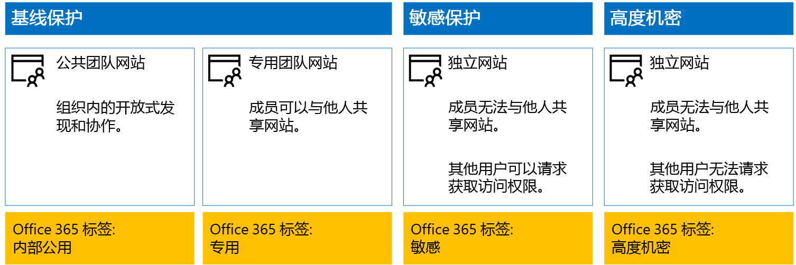
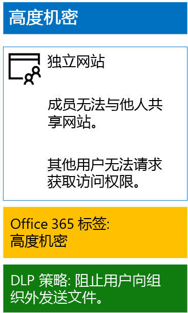

# <a name="protect-sharepoint-online-files-with-office-365-labels-and-dlp"></a>使用 Office 365 标签和 DLP 保护 SharePoint Online 文件

 **摘要：** 为具有各级别信息保护的 SharePoint Online 团队网站应用 Office 365 标签和数据丢失防护 (DLP) 策略。
  
使用本文中的步骤针对基线、敏感和高度机密的 SharePoint Online 团队网站设计并部署 Office 365 标签和 DLP 策略。有关三层保护的详细信息，请参阅[保护 SharePoint Online 网站和文件](secure-sharepoint-online-sites-and-files.md)。
  
## <a name="how-this-works"></a>工作原理
1. 创建并发布所需标签。最长可能需要 12 小时，才能发布这些标签。
2. 对于所需 SharePoint 网站，将文档库设置编辑为，向库中项应用标签。
3. 创建根据标签执行操作的 DLP 策略。

当用户向库中添加某个文档时，默认情况下该文档会收到分配的标签。如果需要的话，用户可以更改标签。当用户在组织外部共享文档时，DLP 将检查是否分配了标签，如果某个 DLP 策略与该标签匹配，则采取行动。DLP 还将查找其他策略匹配，例如保护包含信用卡号的文件（如果配置了这类型的策略）。 

## <a name="office-365-labels-for-your-sharepoint-online-sites"></a>SharePoint Online 网站的 Office 365 标签

创建并向 SharePoint Online 团队网站分配 Office 365 标签分以下三个阶段。
  
### <a name="phase-1-determine-the-office-365-label-names"></a>阶段 1：确定 Office 365 标签名称

在此阶段，对于应用到 SharePoint Online 团队网站的四个级别的信息保护，确定 Office 365 标签的名称。 下表列出了针对每个级别建议的名称。
  
|**SharePoint Online 团队网站保护级别**|**标签名称**|
|:-----|:-----|
|基线 - 公用  <br/> |内部公用  <br/> |
|基线 - 专用  <br/> |Private  <br/> |
|敏感  <br/> |敏感  <br/> |
|高度机密  <br/> |高度机密  <br/> |
   
### <a name="phase-2-create-the-office-365-labels"></a>阶段 2：创建 Office 365 标签

在此阶段中，针对不同的信息保护级别创建并发布确定的标签。
  
若要创建标签，可以使用 Office 365 管理中心或 Microsoft PowerShell。
  
### <a name="create-office-365-labels-with-the-office-365-admin-center"></a>使用 Office 365 管理中心创建 Office 365 标签

1. 使用具有安全管理员或公司管理员角色的帐户登录到 Office 365 门户。有关帮助信息，请参阅[在何处登录到 Office 365](https://support.office.com/Article/Where-to-sign-in-to-Office-365-e9eb7d51-5430-4929-91ab-6157c5a050b4)。
    
2. 在“Microsoft Office 主页”**** 标签页中，单击“管理员”磁贴****。
    
3. 在浏览器的新“Office 管理中心”**** 标签页中，单击“管理中心”>“安全&amp;合规性”****。
    
4. 在浏览器的新“主页 -安全&amp;合规性”**** 标签页中，单击“分类”>“标签”****。
    
5. 从“主页”>“标签”**** 窗格中，单击“保留”****”选项卡，然后再单击“创建标签”****。
    
6. 在“命名标签”**** 窗格中，键入标签的名称和管理员及用户描述，然后单击“下一步”****。

7. 在“标签设置”窗格中，单击“下一步”********。
    
8. 在“查看设置”**** 窗格中，单击“创建”****，然后单击“关闭”****。
    
9. 对其他标签重复步骤 5-8。
    
### <a name="create-office-365-labels-with-powershell"></a>使用 PowerShell 创建 Office 365 标签

1. [使用远程 PowerShell 连接到 Office 365 安全性&amp;合规性中心](http://go.microsoft.com/fwlink/?LinkID=799771&amp;clcid=0x409)，并指定具有安全管理员或公司管理员角色的帐户凭据。
    
2. 填写标签名称列表，然后在 PowerShell 命令提示符下运行以下命令：
    
  ```
  $labelNames=@(<list of label names, each enclosed in quotes and separated by commas>)
ForEach ($element in $labelNames){ New-ComplianceTag -Name $element }
  ```

### <a name="publish-your-new-labels"></a>发布新标签

接下来，使用以下步骤发布新的 Office 365 标签。
  
1. 在“安全性&amp;合规性”中心的“主页”>“标签”**** 窗格中，单击“保留”**** 选项卡，然后再单击“发布标签”****。
    
2. 在“选择要发布的标签”**** 窗格中，单击“选择要发布的标签”****。
    
3. 在“选择标签”窗格中，单击“添加”并选择全部四个标签********。
    
4. 单击“完成”****。
    
5. 在“选择要发布的标签”窗格中，单击“下一步”********。
    
6. 在“选择位置”窗格中，单击“下一步”********。
    
7. 在“命名策略”**** 窗格中，在“名称”**** 中键入标签组的名称，然后单击“下一步”****。
    
8. 在“查看设置”**** 窗格中，单击“发布标签”****，然后单击“关闭”****。

    
### <a name="phase-3-apply-the-office-365-labels-to-your-sharepoint-online-sites"></a>阶段 3：将 Office 365 标签应用到 SharePoint Online 网站

使用这些步骤将 Office 365 标签应用到 SharePoint Online 团队网站的文档文件夹。
  
1. 在浏览器的“Microsoft Office 主页”标签页中，单击“SharePoint”磁贴********。
    
2. 在浏览器的新“SharePoint”标签页中，单击需要分配 Office 365 标签的网站****。
    
3. 在浏览器的新“SharePoint 网站”标签页中，单击“文档”****。
    
4. 单击设置图标，然后单击“库设置”****。
    
5. 在“权限和管理”下，单击“向此库中的项应用标签”********。
    
6. 在“设置-应用标签”**** 中，选择相应的标签，然后单击“保存”****。
    
7. 关闭 SharePoint Online 网站的选项卡。
    
8. 重复步骤 3-8，将 Office 365 标签分配给其他 SharePoint Online 网站。
    
下面是生成的配置。
  

  
## <a name="dlp-policies-for-your-sharepoint-online-sites"></a>适用于 SharePoint Online 网站的 DLP 策略

使用以下步骤配置 DLP 策略，该策略可在用户在组织外共享关于 SharePoint Online 敏感团队网站的文档时进行通知。

1. 在“Microsoft Office 主页”**** 标签页中，单击“管理员”磁贴****。
    
2. 在浏览器的新“Office 管理中心”**** 标签页中，单击“管理中心”>“安全&amp;合规性”****。
    
3. 在浏览器的新“安全&amp;合规性”**** 标签页中，单击“数据丢失防护”>“策略”****。
    
4. 在“数据丢失防护”窗格中，单击“+ 创建策略”********。
    
5. 在“从模板开始或创建自定义策略”**** 窗格中，单击“自定义”****，然后单击“下一步”****。
    
5. 在“命名策略”**** 窗格中，在“名称”**** 中键入敏感级别 DLP 策略的名称，然后单击“下一步”****。
    
6. 在“选择位置”窗格中，单击“允许选择特定位置”，然后单击“下一步”************。
    
7. 在位置列表中，禁用“Exchange 电子邮件”**** 和“OneDrive 帐户位置”****，然后单击“下一步”****。
    
8. 在“**自定义要保护的敏感信息类型**”窗格中，单击“**编辑**”。
    
9. 在“选择要保护的内容类型”**** 窗格中，单击下拉框中的“添加”****，然后单击“标签”****。
    
10. 在“标签”**** 窗格中，单击“+ 添加”****，选择“敏感”**** 标签，然后依次单击“添加”**** 和“完成”****。
    
11. 在“选择要保护的内容类型”窗格中，单击“保存”********。
    
12. 在“**自定义要保护的敏感信息类型**”窗格中，单击“**下一步**”。

13. 在“如果检测到敏感信息，希望采取什么操作?”窗格中，单击“自定义提示和电子邮件”********。
    
14. 在“自定义策略提示和电子邮件通知”**** 窗格中，单击“自定义策略提示文本”****。
    
15. 在文本框中，键入或粘贴以下提示之一，具体取决于是否已实现 Azure 信息保护来保护高度机密文件：
    
  - 要与组织外部的用户共享，请下载并打开文件。 依次单击“文件”、“保护文档”、“使用密码加密”，然后指定强密码。 通过单独的电子邮件或其他通信方式发送密码。
  - 高度机密文件已获加密保护。只有 IT 部门向其授予对这些文件的相应权限的外部用户，才能读取这些文件。
    
    或键入或粘贴自己的策略提示，指示用户如何在组织外共享文件。
    
16. 单击“确定”****。
    
17. 在“如果检测到敏感信息，希望采取什么操作?”**** 窗格中，单击“下一步”****。
    
18. 在“是否希望立即启用策略或先进行测试?”**** 窗格中，单击“是，立即启用”****，然后单击“下一步”****。
    
19. 在“查看设置”**** 窗格中，单击“创建”****，然后单击“关闭”****。
    
以下为敏感 SharePoint Online 团队网站的配置结果。
  

  
接下来，使用以下步骤配置 DLP 策略，该策略可在用户在组织外共享关于 SharePoint Online 高度机密团队网站的文档时阻止用户。
  
1. 在浏览器的“Microsoft Office 主页”**** 标签页中，单击“安全&amp;合规性”**** 磁贴。
    
2. 在浏览器的新“安全&amp;合规性”**** 标签页中，单击“数据丢失防护”>“策略”****。
    
3. 在“数据丢失防护”窗格中，单击“+ 创建策略”********。
    
4. 在“从模板开始或创建自定义策略”**** 窗格中，单击“自定义”****，然后单击“下一步”****。
    
5. 在“命名策略”**** 窗格中，在“名称”**** 中键入高度敏感级别 DLP 策略的名称，然后单击“下一步”****。
    
6. 在“选择位置”窗格中，单击“允许选择特定位置”，然后单击“下一步”************。
    
7. 在位置列表中，禁用“Exchange 电子邮件”**** 和“OneDrive 帐户位置”****，然后单击“下一步”****。
    
8. 在“自定义要保护的敏感信息类型”窗格中，单击“编辑”********。
    
9. 在“选择要保护的内容类型”**** 窗格中，单击下拉框中的“添加”****，然后单击“标签”****。
    
10. 在“标签”**** 窗格中，单击“+ 添加”****，选择“高度机密”标签****，然后依次单击“添加”**** 和“完成”****。
    
11. 在“选择要保护的内容类型”窗格中，单击“保存”********。
    
12. 在“自定义要保护的敏感信息类型”窗格中，单击“下一步”********。
    
13. 在“如果检测到敏感信息，希望采取什么操作?”窗格中，单击“自定义提示和电子邮件”********。
    
14. 在“自定义策略提示和电子邮件通知”窗格中，单击“自定义策略提示文本”********。
    
15. 在文本框中，键入或粘贴以下内容：
    
  - 要与组织外部的用户共享，请下载并打开文件。 依次单击“文件”、“保护文档”、“使用密码加密”，然后指定强密码。 通过单独的电子邮件或其他通信方式发送密码。
    
    或者，键入或粘贴自己的策略提示，指示用户如何在组织外共享文件。
    
16. 单击“确定”****。
    
17. 在“如果检测到敏感信息，希望采取什么操作?”**** 窗格中，单击“下一步”****。
    
18. 在“是否希望立即启用策略或先进行测试?”**** 窗格中，单击“是，立即启用”****，然后单击“下一步”****。
    
19. 在“查看设置”**** 窗格中，单击“创建”****，然后单击“关闭”****。
    
以下为高度机密的 SharePoint Online 团队网站的配置结果。
  

  
## <a name="next-step"></a>后续步骤

[使用 Azure 信息保护来保护 SharePoint Online 文件](protect-sharepoint-online-files-with-azure-information-protection.md)
    
## <a name="see-also"></a>另请参阅

[保护 SharePoint Online 网站和文件](secure-sharepoint-online-sites-and-files.md)
  
[在开发/测试环境中保护 SharePoint Online 网站](secure-sharepoint-online-sites-in-a-dev-test-environment.md)
  
[Microsoft 针对政治宣传活动、非营利组织和其他敏捷性组织的安全指南](microsoft-security-guidance-for-political-campaigns-nonprofits-and-other-agile-o.md)
  
[云应用和混合解决方案](https://docs.microsoft.com/office365/enterprise/cloud-adoption-and-hybrid-solutions)


