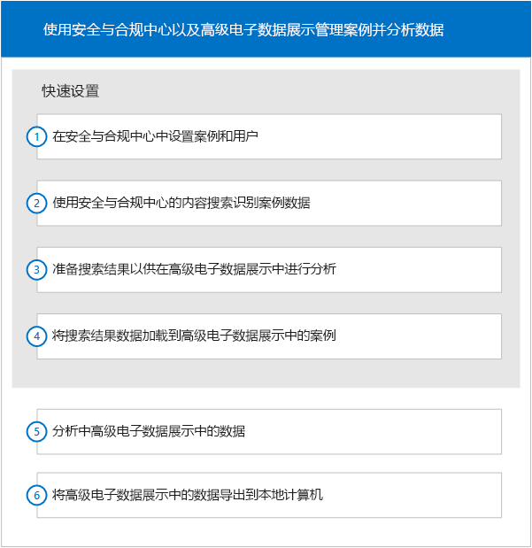

# Office 365 高级电子数据展示快速设置

阅读本设置部分，Microsoft 365 安全与合规中心电子数据展示管理员可了解如何开始使用高级电子数据展示。 若要更好地理解本部分，需要对这两种工具都有一定的了解。
  
> [!NOTE]
> 若要使用高级电子数据展示，组织必须订阅随附高级合规性加载项的 Office 365 E3，或订阅 E5。如果没有此计划，但又要试用高级电子数据展示，可以[注册 Office 365 企业版 E5 试用版](https://go.microsoft.com/fwlink/p/?LinkID=698279)。 
  
## 访问高级电子数据展示中的案件集

可以从安全与合规中心访问高级电子数据展示。必须是安全与合规中心内电子数据展示案件集的成员，才能访问高级电子数据展示中的案件集。若要了解如何分配电子数据展示案件集权限，以及如何将用户添加到电子数据展示案件集，请参阅[在 Office 365 中管理电子数据展示案件集](manage-ediscovery-cases.md)。 
  
若要转到高级电子数据展示中的案件集，请执行以下操作： 
  
1. [转到 Office 365 安全与合规中心](go-to-the-securitycompliance-center.md)。 
    
2. 在安全与合规中心内，依次单击“搜索和调查”**** 和“电子数据展示”****，以显示组织中的案件集列表。 
    
3. 在“电子数据展示”**** 页上，单击要在高级电子数据展示中转到的案件集旁边的“打开”****。 
    
4. 在此案件集的“主页”**** 上，单击“高级电子数据展示”****。
    
    此时，“正在连接到高级电子数据展示”**** 进度栏显示。一旦连接，此案件集便会在高级电子数据展示中打开。 
    
## 工作流

下图展示了在安全与合规中心和高级电子数据展示中管理和使用电子数据展示案件集的常用工作流。 
  

  
本设置部分展示了工作流中的前四步。若要了解工作流中的其他步骤，请参阅以下内容。
  
## 分析

[分析案件集数据](analyze-case-data-with-advanced-ediscovery.md)：可通过各种参数标识和整理文件，允许使用主题，并能显示结果。用户可自定义分析功能，以获得更优质的结果。 
  
## 相关性设置和相关性

[相关性设置](manage-relevance-setup-in-advanced-ediscovery.md)和[使用相关性模块](use-relevance-in-advanced-ediscovery.md)：可根据随机文件样本执行评估和相关性定型，并能使用它们将决策应用于预测编码过程。可计算并显示中期结果，同时监视过程的统计有效性。可显示有助于制定审阅决策的结果。 
  
## 导出

[导出案件集数据](export-case-data-in-advanced-ediscovery.md)：可导出高级电子数据展示内容和结果，以供外部审阅。 
  
## 报告

[生成报告](run-reports-in-advanced-ediscovery.md)：可生成与高级电子数据展示处理相关的选定报告。 
  
## 另请参阅

[Office 365 高级电子数据展示](office-365-advanced-ediscovery.md)
  
[设置用户和案件集](set-up-users-and-cases-in-advanced-ediscovery.md)
  
[准备数据](prepare-data-for-advanced-ediscovery.md)

