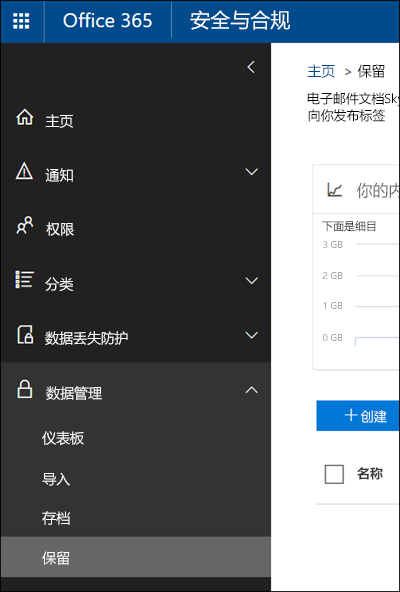
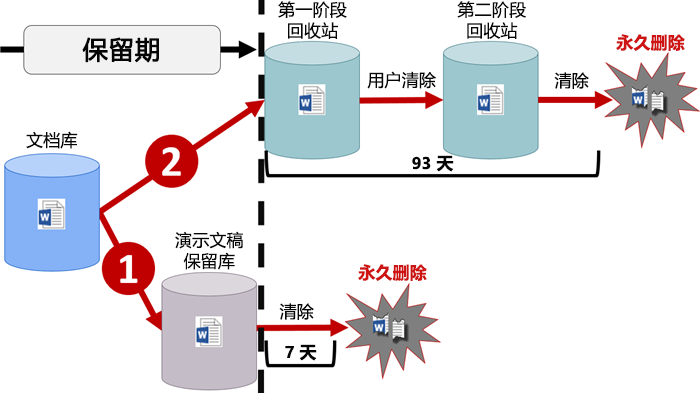

# 保留策略概述

对于大多数组织，数据量和数据复杂性每天都在增加，包括电子邮件、文档、即时消息等。有效管理或管理此类信息非常重要，因为要：
  
- **主动遵守规定至少必须在一段时间内保留内容的行业法规和内部策略**：例如，《萨班斯-奥克斯利法案》规定，必须保留特定类型的内容七年。 
    
- **降低发生诉讼或出现安全漏洞的风险**：通过永久删除不再需要保留的旧内容。 
    
- **帮助组织有效共享知识并提高敏捷性**：通过确保用户仅处理与自己相关的最新内容。 
    
Office 365 中的保留策略可有助于实现所有这些目标。管理内容通常需要执行以下两项操作：
  
- **保留**内容，这样除非保留期到期，否则无法永久删除内容。 
    
- 在保留期到期时永久**删除**内容。 
    
借助保留策略，你可以：
  
- 主动决定是保留内容还是删除内容，亦或是先保留再删除内容。
    
- 将一个策略应用于整个组织，或只应用于特定位置或用户。
    
- 将策略应用于所有内容，或只应用于满足特定条件（如包含特定关键字或[特定类型敏感信息](what-the-sensitive-information-types-look-for.md)）的内容。
    
如果内容受保留策略约束，用户可以继续编辑和处理内容，就像什么都没改变一样，因为内容留在原处。但若有人编辑或删除受保留策略约束的内容，内容副本就会保存到内容的安全保留位置上，直至策略失效。
  
最后，一些组织可能需要遵守法规，如美国证券交易委员会 (SEC) 法规 17a-4，这条法规要求在启用保留策略后，不得禁用保留策略或削弱它的限制性。为了遵守这项要求，可以使用保留锁定。保留策略一旦锁定，包括管理员在内的任何人都无法禁用保留策略或削弱它的限制性。
  
保留策略是在 Office 365 安全与合规中心内的“保留”**** 页上进行创建和管理。 
  

  
  
## 保留策略如何处理留在原处的内容

如果在保留策略中添加网站或邮箱等位置，内容仍留在原处。用户可以继续处理文档或邮件，就像什么都没改变一样。但若用户编辑或删除受保留策略约束的内容，将会保留在策略应用时存在的内容的副本。
  
对于 Sharepoint 网站集，如果用户编辑或删除内容，原始内容的副本保留到保留库中；对于电子邮件或公用文件夹，副本保留到“可恢复项”文件夹中。这些安全位置和已保留内容对大多数用户都不可见。用户甚至都无需知晓其内容受保留策略约束。
  
注意：
  
- Skype 内容存储在 Exchange 中，其中策略根据消息类型（电子邮件或对话）进行应用。
    
- 应用于 Office 365 组的保留策略包含组的邮箱和网站。
    
### OneDrive 帐户和 SharePoint 网站中的内容

保留策略是在网站集级别进行应用。在保留策略中添加 SharePoint 网站集或 OneDrive 帐户后，便会创建保留库（若尚不存在）。你可在网站集的最顶级网站中的“**网站内容**”上查看此库。大多数用户都无法查看保留库，因为此库仅对网站集管理员可见。
  
如果用户尝试更改或删除受保留策略约束的网站内容，保留策略会先检查自策略应用起内容是否有变更。如果这是自策略应用起的首次更改，保留策略会先将内容复制到保留库中，再允许用户更改或删除原始内容。请注意，所有网站集都可复制到保留库中，即使内容与保留策略使用的查询不匹配也不例外。
  
然后，计时器作业清理演示文稿保留库。计时器作业定期运行，并将演示文稿保留库中的所有内容与网站上的保留策略使用的所有查询进行比较。除非内容与至少一个查询匹配，否则计时器作业会永久删除演示文稿保留库中的内容。
  
上述情况适用于在保留策略应用时存在的内容。此外，对于在保留策略中添加网站集后在该集合中创建或添加的所有新内容，它们在被删除后获得保留。不过，只有在被删除后，新内容才会被复制到保留库中，首次获得编辑时并不会被复制。若要保留一个文件的所有不同版本，需要启用版本控制（请参阅以下关于版本控制的部分）。
  
请注意，如果用户尝试删除受到保留策略约束的库、列表、文件夹或网站，则会收到错误。如果用户先移动或删除受到该策略约束的文件夹的所有文件，则可删除该文件夹。另请注意，仅在需要将第一个项目复制到库时才创建保留库（而不是在创建保留策略时）。因此，要测试该策略，你首先需要编辑或删除受到该策略约束的网站中的文档，然后浏览到该保留库以查看所保留的副本。
  

  
向 OneDrive 帐户或 SharePoint 网站分配保留策略后，内容有两条路可走：
  
1. **如果用户在保留期内修改或删除内容**：在演示文稿保留库中创建在保留策略分配时存在的原始内容的副本。随后，计时器作业定期运行，并确定保留期到期的项，这些项在保留期到期后的 7 天内被永久删除。 
    
2. **如果用户在保留期内未修改或删除内容**：内容会在保留期到期时移至第一阶段回收站。如果用户从中删除内容或清空此回收站（亦称为“清除”），文档会移至第二阶段回收站。93 天保留期包含在第一阶段和第二阶段回收站中的保留时间。93 天过后，文档会从其驻留的任何位置（第一阶段或第二阶段回收站）被永久删除。请注意，由于未将回收站编入索引，因此无法搜索查找内容。也就是说，电子数据展示保留无法保留内容，因为在回收站中找不到任何内容。 
    
### 邮箱和公用文件夹中的内容

对于用户的邮件、日历和其他项，保留策略是在邮箱一级进行应用。对于公用文件夹，保留策略是在文件夹一级（而不是邮箱一级）进行应用。邮箱和公用文件夹都使用“可恢复项”文件夹来保留项。只有拥有电子数据展示权限的用户，才能查看其他用户的“可恢复项”文件夹中的项。
  
默认情况下，如果用户从除“已删除项”文件夹以外的文件夹中删除邮件，邮件移至“已删除项”文件夹中。如果用户从“已删除项”文件夹中删除项，项移至“可恢复项”文件夹中。此外，用户还可以软删除 (SHIFT+DELETE) 任何文件夹中的项，这会避开“已删除项”文件夹，直接将项移至“可恢复项”文件夹中。
  
有一个流程定期评估“可恢复项”文件夹中的项。除非某项与至少一个保留策略的规则匹配，否则就会从“可恢复项”文件夹中永久删除（亦称为“硬删除”）。
  
如果用户尝试更改邮箱邮件的特定属性（如主题、正文、附件、发件人和收件人或邮件发送日期/接收日期），原始邮件的副本会在更改提交前保存到“可恢复项”文件夹中。之后每次更改都会这样保留。在保留期到期时，“可恢复项”文件夹中的副本会被永久删除。
  
如果离开组织的用户的邮箱已纳入保留策略中，邮箱在用户的 Office 365 帐户被删除时成为非活动邮箱。非活动邮箱中的内容仍受在邮箱处于非活动状态前对邮箱应用的所有保留策略约束，并且可通过电子数据展示搜索找到这些内容。有关详细信息，请参阅 [Exchange Online 中的非活动邮箱](https://go.microsoft.com/fwlink/?linkid=846909)。
  

  
向邮箱或公用文件夹分配保留策略后，内容有两条路可走：
  
1. **如果用户在保留期内修改或永久删除项**（按 SHIFT+DELETE 或从“已删除项”文件夹中删除）：项移至（如果用户编辑项，则项复制到）“可恢复项”文件夹中。随后，有一个流程会定期运行，并确定保留期到期的项，这些项在保留期到期后的 14 天内被永久删除。请注意，默认设置为 14 天，但也可最多配置为 30 天。 
    
2. **如果用户在保留期内未修改或删除项**：同一流程定期对邮箱中的所有文件夹运行，并确定保留期到期的项，这些项在保留期到期后的 14 天内被永久删除。请注意，默认设置为 14 天，但也可最多配置为 30 天。 
    
## 保留策略如何处理网站集中的文档版本

版本控制是 SharePoint Online 和 OneDrive for Business 中所有文档库的一项功能。默认情况下，版本控制至少保留 500 个主要版本，但可以提高此限制。有关详细信息，请参阅[为列表或库启用和配置版本控制](https://support.office.com/article/1555d642-23ee-446a-990a-bcab618c7a37)。
  
保留策略保留 SharePoint 网站集或 OneDrive 帐户中文档的所有版本。每当用户编辑或删除受保留策略约束的文档时，一版文档就会被复制到保留库中。保留库中的每一版文档都是有自己保留期的独立项：
  
- 如果保留策略以内容创建时间为依据，每一版文档的到期日期都与原始文档相同。原始文档及其各版本全都在同一时间到期。
    
- 如果保留策略以内容的上次修改时间为依据，每一版文档都有自己的到期时间（依据为修改原始文档以创建相应版本的时间）。原始文档及其各版本的到期互不相干。
    
## 将内容保留一段特定时间

使用保留策略，可以无限期地保留内容，也可以将内容保留特定天数、几个月或几年。请注意，内容保留持续时间是从内容年限开始计算，而不是从保留策略应用时开始计算。可以选择年限是以内容创建时间为依据，还是（对于 OneDrive 和 SharePoint）以上次修改时间为依据。
  
例如，若要将网站集自上次修改起保留 7 年，且网站集中的某文档已有 6 年未经修改，那么此文档只能再保留 1 年，前提是仍未经修改。如果文档再获编辑，文档年限会从最后一次修改日期开始计算，并再保留 7 年。
  
同样，若要将邮箱内容保留 7 年，且某邮件是在 6 年前发送，那么此邮件只能再保留 1 年。对于 Exchange 内容，年限始终以接收日期或发送日期（两个日期相同）为依据。以上次修改时间为依据保留内容仅适用于 OneDrive 和 SharePoint 中的网站内容。
  
可以选择是否要在保留期到期时永久删除内容。保留策略也可以直接删除旧内容，而不保留它（请参阅下一部分）。
  

  
## 删除超过特定年限的内容

保留策略既可以先保留再删除内容，也可以直接删除旧内容，而不保留它。
  
如果保留策略删除内容，请务必了解为保留策略指定的时间期限是从文件创建或修改时开始计算，而不是从策略分配时开始计算。
  

  
例如，假设创建的保留策略删除年限超过 3 年的内容，且保留策略分配给所有 OneDrive 帐户，其中包含许多在四五年前创建的内容。在此示例中，许多内容会在保留策略首次分配后很快就被删除。因此，**删除内容的保留策略可能会对内容产生相当大的影响**。 
  
因此，首次将保留策略分配到网站集之前，应先考虑现有内容的年限，以及保留策略可能会对此内容产生的影响。我们还建议在分配策略前向用户传达新策略，让用户有时间评估策略可能会产生的影响。请注意，在创建保留策略前检查策略设置时会看到以下警告。
  

  
## 将保留策略只应用于满足特定条件的内容的高级设置

保留策略可应用于其中所含位置上的全部内容，你也可以选择将保留策略只应用于包含特定关键字或[特定类型敏感信息](what-the-sensitive-information-types-look-for.md)的内容。
  

  
### 保留包含特定关键字的内容

可以将保留策略只应用于满足特定条件的内容，再对相应内容执行保留操作。目前可用的条件支持将保留策略应用于包含特定字词或短语的内容。可使用搜索运算符（如 AND、OR 和 NOT）优化查询。若要详细了解这些运算符，请参阅[适用于内容搜索的关键字查询和搜索条件](keyword-queries-and-search-conditions.md)。
  
即将支持添加可搜索属性（例如，**subject:**）。
  
请注意，基于查询的保留策略使用搜索索引来标识内容。
  

  
### 保留包含敏感信息的内容

此外，还可以将保留策略只应用于包含[特定类型敏感信息](what-the-sensitive-information-types-look-for.md)的内容。例如，可选择将唯一保留要求只应用于包含个人身份信息（PII，如纳税人标识号、身份证号或护照号）的内容。
  

  
注意：
  
- 敏感信息的高级保留设置不适用于 Exchange 公用文件夹或 Skype for Business，因为这些位置不支持敏感信息类型。
    
- 你应该明白，Exchange Online 使用邮件流规则（也称为传输规则）来标识敏感信息，因此这仅适用于传输中的邮件，并不适用于邮箱中已存储的所有邮件。对于 Exchange Online，这意味着保留策略可标识敏感信息，并仅对在策略应用于邮箱**后**收到的邮件执行保留操作。（请注意，上一部分中介绍的基于查询的保留没有此限制，因为它使用搜索索引来标识内容）。 
    
## 将保留策略应用于整个组织或特定位置

可以将保留策略轻松地应用于整个组织、位置整体，或只应用于特定位置或用户。
  
### 组织范围策略

保留策略的最强大功能之一是，它默认应用于 Office 365 中的所有位置，包括：
  
- Exchange 电子邮件
    
- SharePoint 网站集
    
- OneDrive 帐户
    
- Office 365 组（适用于组的邮箱、网站和文档内容。即将推出对 Planner、Yammer 和 CRM 中内容的支持。）
    
- Exchange 公用文件夹
    

  
组织范围保留策略的其他重要功能包括：
  
- 策略可包含任意多个邮箱或网站。
    
- 对于 Exchange，在保留策略应用后新建的任何邮箱都会自动继承策略。
  
### 应用于位置整体的策略

选择位置时，可以轻松添加或排除位置整体（如 Exchange 电子邮件或 OneDrive 帐户）。为此，只需将相应位置的“状态”**** 切换为“开”或“关”即可。 
  
与组织范围策略一样，如果策略应用于任意组合的位置整体，策略可包含任意多个邮箱或网站。例如，如果策略包含所有 Exchange 电子邮件和所有 SharePoint 网站，那么全部网站和邮箱都会包含在内，无论有多少个。对于 Exchange，在保留策略应用后新建的任何邮箱都会自动继承策略。
 

  
### 包含或排除特定位置、用户或组的策略

此外，还可以将保留策略应用于特定用户。为此，请先将相应位置的“状态”**** 切换为“开”，再使用链接来添加或排除特定用户、Office 365 组或位置。 
  
不过，请注意，包含或排除超过 1,000 位特定用户的保留策略存在以下限制：
  
- 此类保留策略最多可包含 1,000 个邮箱和 100 个网站集。
    
- 租户最多可包含 10,000 个保留策略。
    
尽管有这些限制，但需要明白的是，仍可应用组织范围策略或位置整体策略来克服这些限制。
  
### Skype 位置

与 Exchange 电子邮件不同，只将 Skype 位置的状态切换为“开”并不能添加所有用户，而是要先启用相应位置，再手动选择要保留哪些用户的对话。
  
选择 Skype for Business 用户时，可通过选中列标题中的“姓名”**** 框来快速添加所有用户。不过，请务必了解，每个用户都是策略中包含的特定用户。因此，如果策略包含超过 1,000 位用户，那么上一部分中介绍的限制适用。这里的选择所有 Skype 用户并不等同于组织范围策略默认可以包含所有 Skype 用户。 
  

  
请注意，Outlook 中的“对话历史记录”**** 文件夹是一项与 Skype 存档无关的功能。“对话历史记录”**** 可以由最终用户禁用，但 Skype 存档是通过将 Skype 对话副本存储在用户无法访问但电子数据展示可访问的隐藏文件夹中而完成。

### Office 365 组位置

保留 Office 365 组内容需要使用 Office 365 组位置。即使 Office 365 组有 Exchange 邮箱，包含整个 Exchange 位置的保留策略也不会包含 Office 365 组邮箱中的内容。应用于 Office 365 组的保留策略涵盖组邮箱和站点这两个位置。

此外，不可能通过使用 Exchange 位置来包含或排除某个组邮箱。尽管 Exchange 位置最初允许选择组邮箱，但在尝试保存保留策略时，你将收到一条错误消息，表明 RemoteGroupMailbox 不是有效的 Exchange 位置选项。 
  
### Teams 位置

保留策略可用于保留 Teams 中的聊天和信道消息。Teams 聊天存储在聊天中每位用户的邮箱的隐藏文件夹中，而 Teams 信道消息则存储在团队的组邮箱的类似隐藏文件夹中。不过，请务必了解 Teams 使用的是 Azure 助力聊天服务，这项服务也存储此类数据，且默认永久存储数据。因此，强烈建议使用 Teams 位置来保留和删除 Teams 数据。使用 Teams 位置将从 Exchange 邮箱和 Azure 助力基础聊天服务中永久删除数据。有关详细信息，请参阅 [Microsoft Teams 中的安全与合规概述](https://go.microsoft.com/fwlink/?linkid=871258)。
  
请注意，Teams 聊天和信道消息不受应用于 Exchange 或 Office 365 组位置上用户或组邮箱的保留策略影响。即使 Teams 聊天和信道消息存储在 Exchange 中，它们也只受应用于 Teams 位置的保留策略影响。
  
我们仍在努力改进 Teams 中的保留，即将推出其他功能。在此期间，请注意下面的一些限制：
  
- **Teams 必须有单独的保留策略**：创建保留策略并启用 Teams 位置后，其他所有位置都会遭禁用。应用于 Teams 的保留策略只能包含 Teams 位置，而不得包含其他任何位置。 
    
- **组织范围策略不包含 Teams 位置**：若要创建组织范围策略，其中不会包含 Teams 位置，因为 Teams 必须有单独的保留策略。 
    
- **Teams 不支持高级保留**：如果在创建保留策略时选择[将策略只应用于满足特定条件的内容的高级设置](retention-policies.md#advanced)，就无法使用 Teams 位置。目前，应用于 Teams 的保留策略适用于所有聊天和信道消息内容。
    
- **只能删除年限不短于 30 天的 Teams 内容**：暂不支持创建删除年限不足 30 天的 Teams 内容的策略。若要将此策略应用于 Teams 内容，请指定不短于 30 天的保留期。 
    
- **Teams 最长可能需要 30 天才能清理完已保留内容**：应用于 Teams 的保留策略从所有相关存储位置删除内容。不过，在保留策略发布后，Teams 客户端最长可能需要 30 天，才能根据策略清理完内容。然而，即使内容仍出现在 Teams 客户端中，在保留期到期后也不会出现在内容搜索或电子数据展示中。 
    
在团队中，聊天中共享的文件存储在共享文件的用户的 OneDrive 帐户中。上传到信道的文件存储在团队的 SharePoint 网站中。因此，若要保留或删除团队中的文件，必须创建应用于 SharePoint 和 OneDrive 位置的保留策略。若要将保留策略只应用于特定团队的文件，可以选择团队的 SharePoint 网站和团队用户的 OneDrive 帐户。
  
应用于 Teams 的保留策略可使用[保留锁定](retention-policies.md#locking)。
  

  
## 从保留策略中排除特定类型的 Exchange 项
使用 PowerShell，可以从保留策略中排除特定类型的 Exchange 项。例如，可以排除语音邮件、IM 对话和邮箱中的其他 Skype for Business Online 内容。此外，还可以排除日历、笔记和任务项。此功能只能通过 PowerShell 使用；无法在创建保留策略时的 UI 中使用它。
  
为此，请使用 `New-RetentionComplianceRule` 和 `Set-RetentionComplianceRule` cmdlet 的 `ExcludedItemClasses` 参数。若要详细了解 PowerShell，请参阅下面的[查找保留策略的 PowerShell cmdlet](#find-the-powershell-cmdlets-for-retention-policies) 部分。
  
## 锁定保留策略
一些组织可能需要遵守监管机构法规，如美国证券交易委员会 (SEC) 法规 17a-4，这条法规要求在启用保留策略后，不得禁用保留策略或削弱它的限制性。使用保留锁定，可以锁定保留策略，包括管理员在内的任何人都无法禁用保留策略或削弱它的限制性。
  
在保留策略被锁定后，任何人都无法禁用它，也无法从策略中删除位置。此外，还无法修改或删除在保留期内受策略约束的内容。锁定策略后，只能执行以下保留策略修改操作：向策略添加位置或延长其保留持续时间。可以向已锁定策略添加位置或延长保留期，但不能减少位置或禁用策略。
  
因此，锁定保留策略前，请**务必**了解组织的合规性要求，并且仅在确定必须这样做后，才**锁定策略**。

### 使用 PowerShell 锁定保留策略
  
你只能使用 PowerShell 来锁定保留策略。

首先，[连接到 Office 365 安全与合规中心 PowerShell](http://go.microsoft.com/fwlink/p/?LinkID=799771)。

其次，若要查看保留策略列表并找到要锁定的策略的名称，请运行 `Get-RetentionCompliancePolicy`。

第三，若要在保留策略上启用保留锁定，请运行 `Set-RetentionCompliancePolicy` 并将 `RestrictiveRetention` 参数设置为 true -- 例如：

`Set-RetentionCompliancePolicy -Identity “<Name of Policy>” – RestrictiveRetention $true`

运行该 cmdlet 后，你将看到确认提示。选择“**全是**”。

现在已在保留策略上启用保留锁定。如果运行 `Get-RetentionCompliancePolicy`，则需要将 `RestrictiveRetention` 参数设置为 true -- 例如：

`Get-RetentionCompliancePolicy -Identity “<Name of Policy>” |Fl`

  
## 保留原则或优先级

内容可能或甚至很有可能有多个应用的保留策略，每个策略的操作（保留、删除或先保留再删除）和保留期都不同。优先级是什么？最高优先级是，一个策略保留的内容一定不得被另一个策略永久删除。
  

  
若要了解不同保留策略是如何应用于内容的，请注意下面这些保留原则：
  
1. **保留优先于删除。** 假设一个保留策略要删除年限超过 3 年的 Exchange 电子邮件，而另一个保留策略则要将 Exchange 电子邮件先保留 5 年再删除。任何年限达到 3 年的内容都会被删除，并隐藏起来对用户不可见，但仍保留在“可恢复项”文件夹中，直到年限达到 5 年，内容才会被永久删除。 
    
2. **最长保留期优先。** 如果内容受多个内容保留策略约束，它会一直保留到最长保留期到期。 
    
3. **显式添加的位置优先于隐式添加的位置。** 这意味着： 
    
    1. 如果标签包含保留设置且是由用户手动分配给项（如 Exchange 电子邮件或 OneDrive 文档），此标签优先于在网站或邮箱一级分配的策略和由文档库分配的默认标签。例如，如果显式标签要保留内容 10 年，而分配给网站的策略只要保留内容 5 年，那么标签优先。请注意，自动应用标签被视为隐式标签，而不是显式标签，因为它们是由 Office 365 自动应用。
    
    2. 如果保留策略包含特定位置（如特定用户的邮箱或 OneDrive for Business 帐户），此策略优先于应用于所有用户邮箱或 OneDrive for Business 帐户（而不是包含具体用户邮箱）的其他保留策略。
    
4. **最短删除期优先。** 同样，如果内容受多个内容删除策略约束（无保留），它将在最短保留期到期时被删除。 
    
请注意，保留原则就像是自上而下打破平局的流：如果所有策略或标签应用的规则在一个级别上是相同的，流就会向下移至下一个级别，以确定优先应用哪个规则。
  
最后，保留策略或标签无法永久删除任何保留用于电子数据展示的内容。在此类保留释放后，内容便再次符合上文所述清理流程的条件。
  
## 使用保留策略代替类似功能

可以将一个保留策略轻松应用于整个组织和 Office 365 中的各位置，包括 Exchange Online、SharePoint Online、OneDrive for Business 和 Office 365 组。如果你需要保留或删除 Office 365 中任意位置上的内容，我们建议使用保留策略。（还可以使用包含保留设置的标签。有关详细信息，请参阅[标签概述](labels.md)。）
  
之前还有其他几项功能用于保留或删除 Office 365 中的内容。下面列出了这些功能。这些功能可继续与在安全与合规中心内创建的保留策略和标签配合使用。但我们建议今后使用保留策略或标签（而不是任何这些功能）来管理数据。保留策略是唯一一项能同时保留和删除 Office 365 中内容的功能。
  
### Exchange Online

- [在 Office 365 安全与合规中心内管理电子数据展示案件集](https://support.office.com/article/edea80d6-20a7-40fb-b8c4-5e8c8395f6da)（电子数据展示保留） 
    
- [就地保留和诉讼保留](https://go.microsoft.com/fwlink/?linkid=846124)（电子数据展示保留） 
    
- [保留标记和保留策略](https://go.microsoft.com/fwlink/?linkid=846125)，亦称为[邮件传递记录管理 (MRM)](https://go.microsoft.com/fwlink/?linkid=846126)（仅限删除） 
    
### SharePoint Online 和 OneDrive for Business

- [在 Office 365 安全与合规中心内管理电子数据展示案件集](https://support.office.com/article/edea80d6-20a7-40fb-b8c4-5e8c8395f6da)（电子数据展示保留） 
    
- [在电子数据展示中心内将内容添加到案件集并保留源](https://support.office.com/article/54d70de9-1ec2-4325-84f3-aeb588554479)（电子数据展示保留） 
    
- [文档删除策略概述](https://support.office.com/article/55e8d858-f278-482b-a198-2e62d6a2e6e5)（仅限删除） 
    
- [配置就地记录管理](https://support.office.com/article/7707a878-780c-4be6-9cb0-9718ecde050a)（保留） 
    
- [使用网站关闭和删除策略](https://support.office.com/article/a8280d82-27fd-48c5-9adf-8a5431208ba5)（仅限删除） 
    
- [信息管理策略](intro-to-info-mgmt-policies.md)（仅限删除） 
    
请注意，如果之前使用过任何电子数据展示保留来管理数据，应改用保留策略，以主动遵守法规。在安全与合规中心内创建的保留应仅用于电子数据展示。
  
### 保留策略替代信息管理策略

SharePoint 网站可能在使用[信息管理策略](intro-to-info-mgmt-policies.md)保留内容。如果将在安全与合规中心内创建的保留策略应用于已使用列表或库适用内容类型策略或信息管理策略的网站，这些策略在保留策略生效期间被忽略。 
  
## 旧保留策略有何变化？

如果使用的是旧保留策略，此策略已自动转换为保留策略，且仅执行保留操作，而不会删除内容。旧保留策略将继续处理和保留内容，你无需执行任何更改。可以在安全与合规中心内的“保留”**** 页上找到这些策略。可以通过编辑旧保留策略来更改保留期，但无法进行其他任何更改（如添加或删除位置）。 
  
## 权限

负责创建保留策略的合规性团队成员必须有权访问安全与合规中心。默认情况下，租户管理员有权访问此位置，并可向合规部主管及其他人员授予对安全与合规中心的访问权限，而不授予租户管理员的所有权限。为此，建议转到安全与合规中心内的“权限”**** 页，编辑“合规性管理员”**** 角色组，再向此角色组添加成员。 
  
有关详细信息，请参阅[向用户授予对 Office 365 安全与合规中心的访问权限](grant-access-to-the-security-and-compliance-center.md)。
  
只有在创建和应用保留策略时，才必须拥有这些权限。强制执行策略并不需要访问内容。
  
## 查找保留策略的 PowerShell cmdlet

若要使用保留策略 cmdlet，你需要：
  
1. [使用远程 PowerShell 连接到 Office 365 安全与合规中心](http://go.microsoft.com/fwlink/?LinkID=799771&amp;clcid=0x409)
    
2. 使用这些 [Office 365 安全与合规中心 cmdlet](http://go.microsoft.com/fwlink/?LinkID=799772&amp;clcid=0x409)
    
## 更多信息

- [标签概述](labels.md)
    

