# 保留策略概述Overview of retention policies

对于大多数组织，数据量和数据复杂性每天都在增加，包括电子邮件、文档、即时消息等。有效管理或管理此类信息非常重要，因为要：For most organizations, the volume and complexity of their data is increasing daily - email, documents, instant messages, and more. Effectively managing or governing this information is important because you need to:
  
- **主动遵守规定至少必须在一段时间内保留内容的行业法规和内部策略**：例如，《萨班斯-奥克斯利法案》规定，必须保留特定类型的内容七年。**Comply proactively with industry regulations and internal policies** that require you to retain content for a minimum period of time - for example, the Sarbanes-Oxley Act might require you to retain certain types of content for seven years. 
    
- **降低发生诉讼或出现安全漏洞的风险**：通过永久删除不再需要保留的旧内容。**Reduce your risk in the event of litigation or a security breach** by permanently deleting old content that you're no longer required to keep. 
    
- **帮助组织有效共享知识并提高敏捷性**：通过确保用户仅处理与自己相关的最新内容。**Help your organization to share knowledge effectively and be more agile** by ensuring that your users work only with content that's current and relevant to them. 
    
保留策略可有助于实现所有这些目标。管理内容通常需要执行以下两项操作：A retention policy can help you achieve all of these goals. Managing content commonly requires two actions:
  
- **保留**内容，这样除非保留期到期，否则无法永久删除内容。**Retaining** content so that it can't be permanently deleted before the end of the retention period. 
    
- 在保留期到期时永久**删除**内容。**Deleting** content permanently at the end of the retention period. 
    
借助保留策略，你可以：With a retention policy, you can:
  
- 主动决定是保留内容还是删除内容，亦或是先保留再删除内容。Decide proactively whether to retain content, delete content, or both - retain and then delete the content.
    
- 将一个策略应用于整个组织，或只应用于特定位置或用户。Apply a single policy to the entire organization or just specific locations or users.
    
- 将策略应用于所有内容，或只应用于满足特定条件（如包含特定关键字或[特定类型敏感信息](what-the-sensitive-information-types-look-for.md)）的内容。Apply a policy to all content or just content meeting certain conditions, such as content containing specific keywords or [specific types of sensitive information](what-the-sensitive-information-types-look-for.md).
    
如果内容受保留策略约束，用户可以继续编辑和处理内容，就像什么都没改变一样，因为内容留在原处。但若有人编辑或删除受保留策略约束的内容，内容副本就会保存到内容的安全保留位置上，直至策略失效。When content is subject to a retention policy, people can continue to edit and work with the content as if nothing's changed because the content is retained in place, in its original location. But if someone edits or deletes content that's subject to the policy, a copy is saved to a secure location where it's retained while the policy is in effect.
  
最后，一些组织可能需要遵守法规，如美国证券交易委员会 (SEC) 法规 17a-4，这条法规要求在启用保留策略后，不得禁用保留策略或削弱它的限制性。为了遵守这项要求，可以使用保留锁定。保留策略一旦锁定，包括管理员在内的任何人都无法禁用保留策略或削弱它的限制性。Finally, some organizations might need to comply with regulations such as Securities and Exchange Commission (SEC) Rule 17a-4, which requires that after a retention policy is turned on, it cannot be turned off or made less restrictive. To meet this requirement, you can use Preservation Lock. After a policy's been locked, no one—including the administrator—can turn off the policy or make it less restrictive.
  
在下述位置创建和管理保留策略：You create and manage retention policies on the:

- [Microsoft 365 合规中心](https://compliance.microsoft.com/)内的“**策略**”页面。**Policies** page in the Microsoft 365 compliance center.
- [Office 365 安全与合规中心](https://protection.office.com/)内“**数据管理**”下的“**保留**”页面。**Retention** page under **Data governance** in the Office 365 Security &amp; Compliance Center.
  
## 保留策略如何处理留在原处的内容How a retention policy works with content in place

如果在保留策略中添加网站或邮箱等位置，内容仍留在原处。用户可以继续处理文档或邮件，就像什么都没改变一样。但若用户编辑或删除受保留策略约束的内容，将会保留在策略应用时存在的内容的副本。When you include a location such as a site or mailbox in a retention policy, the content remains in its original location. People can continue to work with their documents or mail as if nothing's changed. But if they edit or delete content that's included in the policy, a copy of the content as it existed when you applied the policy is retained.
  
对于 SharePoint 网站集，如果用户编辑或删除内容，原始内容的副本保留到保留库中；对于电子邮件或公用文件夹，副本保留到“可恢复项”文件夹中。这些安全位置和已保留内容对大多数用户都不可见。用户甚至都无需知晓其内容受保留策略约束。For Sharepoint site collections, a copy of the original content is retained in the Preservation Hold library when users edit or delete it; for email and public folders, the copy is retained in the Recoverable Items folder. These secure locations and the retained content are not visible to most people. With a retention policy, people do not even need to know that their content is subject to the policy.
  
注意：Notes:
  
- Teams（聊天）内容存储在 Exchange 中，其中策略根据消息类型（电子邮件或对话）进行应用。Skype content is stored in Exchange, where the policy is applied based on message type (email or conversation).
    
- 应用于 Office 365 组的保留策略包含组的邮箱和网站。A retention policy applied to an Office 365 group includes both the group mailbox and site.
    
### OneDrive 帐户和 SharePoint 网站中的内容Content in OneDrive accounts and SharePoint sites

保留策略是在网站集级别进行应用。在保留策略中添加 SharePoint 网站集或 OneDrive 帐户后，便会创建保留库（若尚不存在）。你可在网站集的最顶级网站中的“**网站内容**”上查看此库。大多数用户都无法查看保留库，因为此库仅对网站集管理员可见。A retention policy is applied at the level of a site collection. When you include a SharePoint site collection or OneDrive account in a retention policy, a Preservation Hold library will be created, if one doesn't already exist. You can view this library on the **Site contents** page in the top-level site of the site collection. Most users can't view the Preservation Hold library because it's visible only to site collection administrators.
  
如果用户尝试更改或删除受保留策略约束的网站内容，保留策略会先检查自策略应用起内容是否有变更。如果这是自策略应用起的首次更改，保留策略会先将内容复制到保留库中，再允许用户更改或删除原始内容。请注意，所有网站集都可复制到保留库中，即使内容与保留策略使用的查询不匹配也不例外。If a person attempts to change or delete content in a site that's subject to a retention policy, first the policy checks whether the content's been changed since the policy was applied. If this is the first change since the policy was applied, the retention policy copies the content to the Preservation Hold library, and then allows the person to change or delete the original content. Note that any content in the site collection can be copied to the Preservation Hold library, even if the content does not match the query used by the retention policy.
  
然后，计时器作业清理演示文稿保留库。计时器作业定期运行，并将演示文稿保留库中的所有内容与网站上的保留策略使用的所有查询进行比较。除非内容与至少一个查询匹配，否则计时器作业会永久删除演示文稿保留库中的内容。Then a timer job cleans up the Preservation Hold library. The timer job runs periodically and compares all content in the Preservation Hold library to all of the queries used by the retention policies on the site. Unless content matches at least one of the queries, the timer job permanently deletes the content from the Preservation Hold library.
  
上述情况适用于在保留策略应用时存在的内容。此外，对于在保留策略中添加网站集后在该集合中创建或添加的所有新内容，它们在被删除后获得保留。不过，只有在被删除后，新内容才会被复制到保留库中，首次获得编辑时并不会被复制。若要保留一个文件的所有不同版本，需要启用版本控制（请参阅以下关于版本控制的部分）。The previous applies to content that exists when the retention policy is applied. In addition, any new content that's created or added to the site collection after it was included in the policy will be retained after deletion. However, new content isn't copied to the Preservation Hold library the first time it's edited, only when it's deleted. To retain all versions of a file, you need to turn on versioning — see the below section on versioning.
  
请注意，如果用户尝试删除受到保留策略约束的库、列表、文件夹或网站，则会收到错误。如果用户先移动或删除受到该策略约束的文件夹的所有文件，则可删除该文件夹。另请注意，仅在需要将第一个项目复制到库时才创建保留库（而不是在创建保留策略时）。因此，要测试该策略，你首先需要编辑或删除受到该策略约束的网站中的文档，然后浏览到该保留库以查看所保留的副本。Note that a user will receive an error if they try to delete a library, list, folder, or site that's subject to a retention policy. A user can delete a folder if they first move or delete any files in the folder that are subject to the policy. Also note that the Preservation Hold library is created only when the first item needs to be copied to the library - not when you create the retention policy. Therefore, to test your policy, you first need to edit or delete a document in a site subject to the policy, and then browse to the Preservation Hold library to view the retained copy.
  
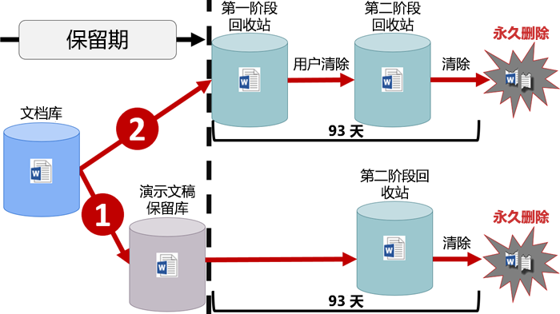
  
向 OneDrive 帐户或 SharePoint 网站分配保留策略后，内容有两条路可走：After a retention policy is assigned to a OneDrive account or SharePoint site, content can follow one of two paths:
  
1. **如果内容在保持期内遭修改或删除**：则会在保留库中创建在分配保留策略时存在的原始内容的副本。**If the content is modified or deleted** during the retention period, a copy of the original content as it existed when the retention policy was assigned is created in the Preservation Hold library. There, a timer job runs periodically and identifies items whose retention period has expired, and these items are permanently deleted within seven days of the end of the retention period. 此时，计时器作业会定期运行，并发现保持期已到期的项，并将这些项移到第二阶段回收站（其中的项在第 93 天结束时永久删除）。There, a timer job runs periodically and identifies items whose retention period has expired, and those items are moved to the second-stage Recycle Bin, where they're permanently deleted at the end of 93 days. 请注意，第二阶段回收站对最终用户不可见（仅第一阶段回收站可见），但网站集管理员可以在其中查看和还原内容。Note that the second-stage Recycle Bin is not visible to end users (only the first-stage Recycle Bin is), but site collection admins can view and restore content from there.

    > [!NOTE]
    > 我们最近更改了从保留库中删除内容的方式。We've recently changed how content is deleted from the Preservation Hold library. 为了防止意外的数据丢失，不再从保留库中永久删除内容。To help prevent inadvertent data loss, we no longer permanently delete content from the Preservation Hold library. 相反，只从回收站中永久删除内容，因此保留库中的所有内容现在都要移到第二阶段回收站。Instead, we permanently delete content only from the Recycle Bin, so all content from the Preservation Hold library now goes through the second-stage Recycle Bin.
    
2. **如果用户在保留期内未修改或删除内容**：内容会在保留期到期时移至第一阶段回收站。如果用户从中删除内容或清空此回收站（亦称为“清除”），文档会移至第二阶段回收站。93 天保留期包含在第一阶段和第二阶段回收站中的保留时间。93 天过后，文档会从其驻留的任何位置（第一阶段或第二阶段回收站）被永久删除。请注意，由于未将回收站编入索引，因此无法搜索查找内容。也就是说，电子数据展示保留无法保留内容，因为在回收站中找不到任何内容。**If the content is not modified or deleted** during the retention period, it's moved to the first-stage Recycle Bin at the end of the retention period. If a user deletes the content from there or empties this Recycle Bin (also known as purging), the document is moved to the second-stage Recycle Bin. A 93-day retention period spans both the first- and second-stage recycle bins. At the end of 93 days, the document is permanently deleted from wherever it resides, in either the first- or second-stage Recycle Bin. Note that the Recycle Bin is not indexed and therefore searches do not find content there. This means that an eDiscovery hold can't locate any content in the Recycle Bin in order to hold it. 
    
### 邮箱和公用文件夹中的内容Content in mailboxes and public folders

对于用户的邮件、日历和其他项，保留策略是在邮箱一级进行应用。对于公用文件夹，保留策略是在文件夹一级（而不是邮箱一级）进行应用。邮箱和公用文件夹都使用“可恢复项”文件夹来保留项。只有拥有电子数据展示权限的用户，才能查看其他用户的“可恢复项”文件夹中的项。For a user's mail, calendar, and other items, a retention policy is applied at the level of a mailbox. For a public folder, a retention policy is applied at the folder level, not the mailbox level. Both a mailbox and a public folder use the Recoverable Items folder to retain items. Only people whom have been assigned eDiscovery permissions can view items in another user's Recoverable Items folder.
  
默认情况下，如果用户从除“已删除项”文件夹以外的文件夹中删除邮件，邮件移至“已删除项”文件夹中。如果用户从“已删除项”文件夹中删除项，项移至“可恢复项”文件夹中。此外，用户还可以软删除 (SHIFT+DELETE) 任何文件夹中的项，这会避开“已删除项”文件夹，直接将项移至“可恢复项”文件夹中。By default, when a person deletes a message in a folder other than the Deleted Items folder, the message is moved to the Deleted Items folder. When a person deletes an item in the Deleted Items folder, the message is moved to the Recoverable Items folder. In addition, a person can soft delete an item (SHIFT+DELETE) in any folder, which bypasses the Deleted Items folder and moves the item directly to the Recoverable Items folder.
  
有一个流程定期评估“可恢复项”文件夹中的项。除非某项与至少一个保留策略的规则匹配，否则就会从“可恢复项”文件夹中永久删除（亦称为“硬删除”）。A process periodically evaluates items in the Recoverable Items folder. If an item doesn't match the rules of at least one retention policy, the item is permanently deleted (also called hard deleted) from the Recoverable Items folder.
  
如果用户尝试更改邮箱邮件的特定属性（如主题、正文、附件、发件人和收件人或邮件发送日期/接收日期），原始邮件的副本会在更改提交前保存到“可恢复项”文件夹中。之后每次更改都会这样保留。在保留期到期时，“可恢复项”文件夹中的副本会被永久删除。When a person attempts to change certain properties of a mailbox item — such as the subject, body, attachments, senders and recipients, or date sent or received for a message — a copy of the original item is saved to the Recoverable Items folder before the change is committed. This happens for each subsequent change. At the end of the retention period, copies in the Recoverable Items folder are permanently deleted.
  
如果离开组织的用户的邮箱已纳入保留策略中，邮箱在用户的 Office 365 帐户被删除时成为非活动邮箱。非活动邮箱中的内容仍受在邮箱处于非活动状态前对邮箱应用的所有保留策略约束，并且可通过电子数据展示搜索找到这些内容。有关详细信息，请参阅 [Exchange Online 中的非活动邮箱](inactive-mailboxes-in-office-365.md)。If a user leaves your organization, and their mailbox is included in a retention policy, the mailbox becomes an inactive mailbox when the user's Office 365 account is deleted. The contents of an inactive mailbox are still subject to any retention policy that was placed on the mailbox before it was made inactive, and the contents are available to an eDiscovery search. For more information, see [Inactive mailboxes in Exchange Online](inactive-mailboxes-in-office-365.md).
  
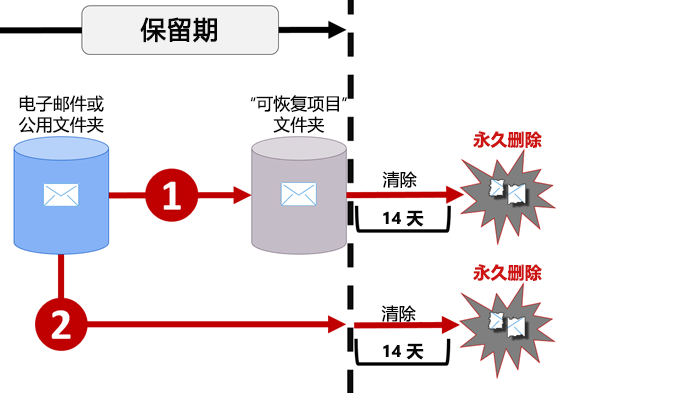
  
向邮箱或公用文件夹分配保留策略后，内容有两条路可走：After a retention policy is assigned to a mailbox or public folder, content can follow one of two paths:
  
1. **如果用户在保留期内修改或永久删除项**（按 SHIFT+DELETE 或从“已删除项”文件夹中删除）：项移至（如果用户编辑项，则项复制到）“可恢复项”文件夹中。随后，有一个流程会定期运行，并确定保留期到期的项，这些项在保留期到期后的 14 天内被永久删除。请注意，默认设置为 14 天，但也可最多配置为 30 天。**If the item is modified or permanently deleted** by the user (either SHIFT+DELETE or deleted from Deleted Items) during the retention period, the item is moved (or copied, in the case of edit) to the Recoverable Items folder. There, a process runs periodically and identifies items whose retention period has expired, and these items are permanently deleted within 14 days of the end of the retention period. Note that 14 days is the default setting, but it can be configured up to 30 days.
    
2. **如果用户在保留期内未修改或删除项**：同一流程定期对邮箱中的所有文件夹运行，并确定保留期到期的项，这些项在保留期到期后的 14 天内被永久删除。请注意，默认设置为 14 天，但也可最多配置为 30 天。**If the item is not modified or deleted** during the retention period, the same process runs periodically on all folders in the mailbox and identifies items whose retention period has expired, and these items are permanently deleted within 14 days of the end of the retention period. Note that 14 days is the default setting but it can be configured up to 30 days. 
    
## 保留策略如何处理网站集中的文档版本How a retention policy works with document versions in a site collection

版本控制是 SharePoint Online 和 OneDrive for Business 中所有文档库的一项功能。默认情况下，版本控制至少保留 500 个主要版本，但可以提高此限制。有关详细信息，请参阅[为列表或库启用和配置版本控制](https://support.office.com/article/1555d642-23ee-446a-990a-bcab618c7a37)。Versioning is a feature of all document libraries in SharePoint Online and OneDrive for Business. By default, versioning retains a minimum of five hundred major versions, though you can increase this limit. For more information, see [Enable and configure versioning for a list or library](https://support.office.com/article/1555d642-23ee-446a-990a-bcab618c7a37).
  
保留策略保留 SharePoint 网站集或 OneDrive 帐户中文档的所有版本。每当用户编辑或删除受保留策略约束的文档时，一版文档就会被复制到保留库中。保留库中的每一版文档都是有自己保留期的独立项：A retention policy retains all versions of a document in a SharePoint site collection or OneDrive account. Each time a document subject to a retention policy is edited or deleted, a version is copied to the Preservation Hold library. Each version of a document in the Preservation Hold library exists as a separate item with its own retention period:
  
- 如果保留策略以内容创建时间为依据，每一版文档的到期日期都与原始文档相同。原始文档及其各版本全都在同一时间到期。If the retention policy is based on when the content was created, each version has the same expiration date as the original document. The original document and its versions all expire at the same time.
    
- 如果保留策略以内容的上次修改时间为依据，每一版文档都有自己的到期时间（依据为修改原始文档以创建相应版本的时间）。原始文档及其各版本的到期互不相干。If the retention policy is based on when the content was last modified, each version has its own expiration date based on when the original document was modified to create that version. The original documents and its versions expire independently of each other.
    
## 将内容保留一段特定时间Retaining content for a specific period of time

使用保留策略，可以无限期地保留内容，也可以将内容保留特定天数、几个月或几年。请注意，内容保留持续时间是从内容年限开始计算，而不是从保留策略应用时开始计算。可以选择年限是以内容创建时间为依据，还是（对于 OneDrive 和 SharePoint）以上次修改时间为依据。With a retention policy, you can retain content indefinitely or for a specific number of days, months, or years. Note that the duration for how long content is retained is calculated from the age of the content, not from when the retention policy is applied. You can choose whether the age is based on when the content was created or (for OneDrive and SharePoint) when it was last modified.
  
例如，若要将网站集自上次修改起保留 7 年，且网站集中的某文档已有 6 年未经修改，那么此文档只能再保留 1 年，前提是仍未经修改。如果文档再获编辑，文档年限会从最后一次修改日期开始计算，并再保留 7 年。For example, if you want to retain content in a site collection for seven years since it was last modified, and a document in that site collection hasn't been modified in six years, the document will be retained for only another year if it's not modified. If the document is edited again, the age of the document is calculated from the new last modified date, and it will be retained for another seven years.
  
同样，若要将邮箱内容保留 7 年，且某邮件是在 6 年前发送，那么此邮件只能再保留 1 年。对于 Exchange 内容，年限始终以接收日期或发送日期（两个日期相同）为依据。以上次修改时间为依据保留内容仅适用于 OneDrive 和 SharePoint 中的网站内容。Similarly, if you want to retain content in a mailbox for seven years, and a message was sent six years ago, the message will be retained for only one year. For Exchange content, the age is always based on the date received or sent (they are the same). Retaining content based on when it was last modified applies only to site content in OneDrive and SharePoint.
  
可以选择是否要在保留期到期时永久删除内容。保留策略也可以直接删除旧内容，而不保留它（请参阅下一部分）。You can choose whether you want the content to be permanently deleted at the end of the retention period. A retention policy can also simply delete old content without retaining it - see the next section.
  
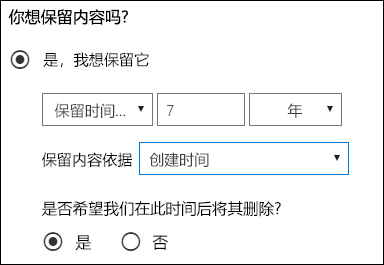
  
## 删除超过特定年限的内容Deleting content that's older than a specific age

保留策略既可以先保留再删除内容，也可以直接删除旧内容，而不保留它。A retention policy can both retain and then delete content, or simply delete old content without retaining it.
  
如果保留策略删除内容，请务必了解为保留策略指定的时间期限是从文件创建或修改时开始计算，而不是从策略分配时开始计算。If your retention policy deletes content, it's important to understand that the time period specified for a retention policy is calculated from the time when the content was created or modified, not the time since the policy was assigned.
  
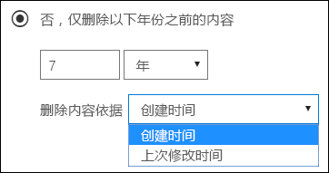
  
例如，假设创建的保留策略删除年限超过 3 年的内容，且保留策略分配给所有 OneDrive 帐户，其中包含许多在四五年前创建的内容。在此示例中，许多内容会在保留策略首次分配后很快就被删除。因此，**删除内容的保留策略可能会对内容产生相当大的影响**。For example, suppose that you create a retention policy that deletes content after three years, and then assign that policy to all OneDrive accounts, which contain a lot of content that was created four or five years ago. In this case, a lot of content will be deleted soon after assigning the retention policy for the first time. For this reason, **a retention policy that deletes content can have a considerable impact on your content**. 
  
因此，首次将保留策略分配到网站集之前，应先考虑现有内容的年限，以及保留策略可能会对此内容产生的影响。我们还建议在分配策略前向用户传达新策略，让用户有时间评估策略可能会产生的影响。请注意，在创建保留策略前检查策略设置时会看到以下警告。Therefore, before you assign a retention policy to a site collection for the first time, you should first consider the age of the existing content and how the policy may impact that content. You may also want to communicate the new policy to your users before assigning it, to give them time to assess the possible impact. Note this warning that appears when you review the settings for your retention policy just before creating it.
  
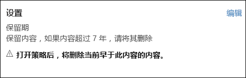
  
## 将保留策略只应用于满足特定条件的内容的高级设置Advanced settings that apply a policy only to content that meets certain conditions

保留策略可应用于其中所含位置上的全部内容，你也可以选择将保留策略只应用于包含特定关键字或[特定类型敏感信息](what-the-sensitive-information-types-look-for.md)的内容。A retention policy can apply to all content in the locations that it includes, or you can choose to apply a retention policy only to content that contains specific keywords or [specific types of sensitive information](what-the-sensitive-information-types-look-for.md).
  
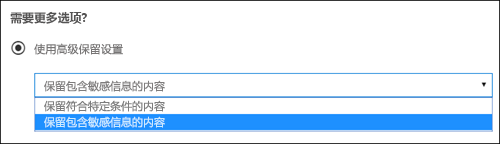
  
### 保留包含特定关键字的内容Retain content that contains specific keywords

可以将保留策略只应用于满足特定条件的内容，再对相应内容执行保留操作。目前可用的条件支持将保留策略应用于包含特定字词或短语的内容。可使用搜索运算符（如 AND、OR 和 NOT）优化查询。若要详细了解这些运算符，请参阅[适用于内容搜索的关键字查询和搜索条件](keyword-queries-and-search-conditions.md)。You can apply a retention policy only to content that satisfies certain conditions, and then take retention actions on just that content. The conditions available now support applying a retention policy to content that contains specific words or phrases. You can refine your query by using search operators like AND, OR, and NOT. For more information on these operators, see [Keyword queries and search conditions for Content Search](keyword-queries-and-search-conditions.md).
  
即将支持添加可搜索属性（例如，**subject:**）。Support for adding searchable properties (for example, **subject:**) is coming soon.
  
请注意，基于查询的保留策略使用搜索索引来标识内容。Note that query-based retention uses the search index to identify content.
  
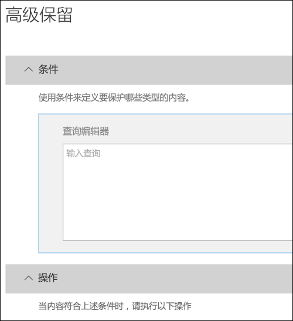
  
### 保留包含敏感信息的内容Retain content that contains sensitive information

此外，还可以将保留策略只应用于包含[特定类型敏感信息](what-the-sensitive-information-types-look-for.md)的内容。例如，可选择将唯一保留要求只应用于包含个人身份信息（PII，如纳税人标识号、身份证号或护照号）的内容。You can also apply a retention policy only to content that contains [specific types of sensitive information](what-the-sensitive-information-types-look-for.md). For example, you can choose to apply unique retention requirements only to content that contains personally identifiable information (PII) such as taxpayer identification numbers, social security numbers, or passport numbers.
  
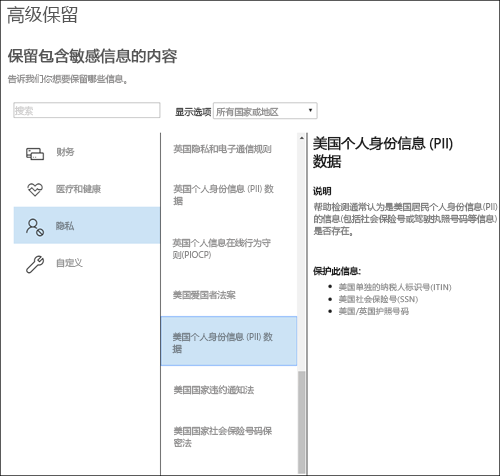
  
注意：Notes:
  
- 敏感信息的高级保留设置不适用于 Exchange 公用文件夹或 Skype for Business，因为这些位置不支持敏感信息类型。Advanced retention for sensitive information doesn't apply to Exchange public folders or Skype for Business because those locations don't support sensitive information types.
    
- 你应该明白，Exchange Online 使用邮件流规则（也称为传输规则）来标识敏感信息，因此这仅适用于传输中的邮件，并不适用于邮箱中已存储的所有邮件。对于 Exchange Online，这意味着保留策略可标识敏感信息，并仅对在策略应用于邮箱**后**收到的邮件执行保留操作。（请注意，上一部分中介绍的基于查询的保留没有此限制，因为它使用搜索索引来标识内容）。You should understand that Exchange Online uses mail flow rules (also known as transport rules) to identify sensitive information, so this works only on messages in transit — not on all items already stored in a mailbox. For Exchange Online, this means that a retention policy can identify sensitive information and take retention actions only on messages that are received **after** the policy is applied to the mailbox. (Note that query-based retention described in the previous section doesn't have this limitation because it uses the search index to identify content.) 
    
## 将保留策略应用于整个组织或特定位置Applying a retention policy to an entire organization or specific locations

可以将保留策略轻松地应用于整个组织、位置整体，或只应用于特定位置或用户。You can easily apply a retention policy to an entire organization, entire locations, or only to specific locations or users.
  
### 组织范围策略Org-wide policy

保留策略的最强大功能之一是，它默认应用于 Office 365 中的所有位置，包括：One of the most powerful features of a retention policy is that by default it applies to locations across Office 365, including:
  
- Exchange 电子邮件Exchange email
    
- SharePoint 网站集SharePoint site collections
    
- OneDrive 帐户OneDrive accounts
    
- Office 365 组（适用于组的邮箱、网站和文档中的内容。）Office 365 groups (applies to content in the group's mailbox, site, and documents. Support for content in Planner, Yammer, and CRM is coming soon.)
    
- Exchange 公用文件夹Exchange public folders
    
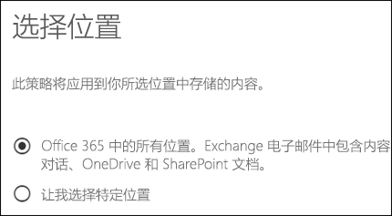
  
组织范围保留策略的其他重要功能包括：Other important features of an org-wide retention policy include:
  
- 策略可包含任意多个邮箱或网站。There is no limit to the number of mailboxes or sites the policy can include.
    
- 对于 Exchange，在保留策略应用后新建的任何邮箱都会自动继承策略。For Exchange, any new mailbox created after the policy is applied will automatically inherit the policy.

  
### 应用于位置整体的策略A policy that applies to entire locations

选择位置时，可以轻松添加或排除位置整体（如 Exchange 电子邮件或 OneDrive 帐户）。为此，只需将相应位置的“状态”\*\*\*\* 切换为“开”或“关”即可。When you choose locations, you can easily include or exclude an entire location, such as Exchange email or OneDrive accounts. To do so, simply toggle the **Status** of that location on or off. 
  
与组织范围策略一样，如果策略应用于任意组合的位置整体，策略可包含任意多个邮箱或网站。例如，如果策略包含所有 Exchange 电子邮件和所有 SharePoint 网站，那么全部网站和邮箱都会包含在内，无论有多少个。对于 Exchange，在保留策略应用后新建的任何邮箱都会自动继承策略。Like an org-wide policy, if a policy applies to any combination of entire locations, there is no limit to the number of mailboxes or sites the policy can include. For example, if a policy includes all Exchange email and all SharePoint sites, all sites and mailboxes will be included, no matter how many. And for Exchange, any new mailbox created after the policy is applied will automatically inherit the policy.
 

  
### 包含或排除特定位置、用户或组的策略A policy with specific inclusions or exclusions

此外，还可以将保留策略应用于特定用户。为此，请先将相应位置的“状态”\*\*\*\* 切换为“开”，再使用链接来添加或排除特定用户、Office 365 组或位置。You can also apply a retention policy to specific users. To do so, toggle the **Status** of that location on, and then use the links to include or exclude specific users, Office 365 groups, or locations. 
  
不过，请注意，包含或排除超过 1,000 位特定用户的保留策略存在以下限制：However, note that the following limits exist for a retention policy that includes or excludes over 1,000 specific users:
  
- 此类保留策略最多可包含 1,000 个邮箱和 100 个网站集。Such a retention policy can contain no more than 1,000 mailboxes and 100 site collections.
    
- 租户最多可包含 10,000 个保留策略。A tenant can contain no more than 10,000 retention policies.
    
尽管有这些限制，但需要明白的是，仍可应用组织范围策略或位置整体策略来克服这些限制。Although these limits exist, understand that you can get over these limits by applying either an org-wide policy or a policy that applies to entire locations.
  
### Skype 位置Skype locations

与 Exchange 电子邮件不同，只将 Skype 位置的状态切换为“开”并不能添加所有用户，而是要先启用相应位置，再手动选择要保留哪些用户的对话。Unlike Exchange email, you can't simply toggle the status of the Skype location on to include all users, but you can turn on that location and then manually choose the users whose conversations you want to retain.
  
选择 Skype for Business 用户时，可通过选中列标题中的“姓名”\*\*\*\* 框来快速添加所有用户。不过，请务必了解，每个用户都是策略中包含的特定用户。因此，如果策略包含超过 1,000 位用户，那么上一部分中介绍的限制适用。这里的选择所有 Skype 用户并不等同于组织范围策略默认可以包含所有 Skype 用户。When you choose Skype for Business users, you can quickly include all users by selecting the **Name** box in the column header - however, it's important to understand that each user counts as a specific inclusion in the policy. Therefore, if you include over 1,000 users, the limits noted in the previous section apply. Selecting all Skype users here is not the same as if an org-wide policy were able to include all Skype users by default. 
  
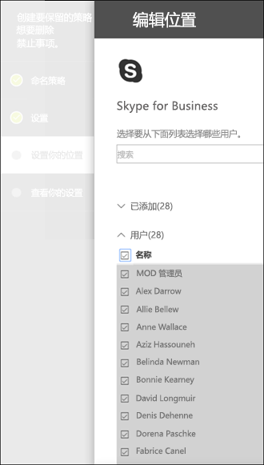
  
请注意，Outlook 中的“对话历史记录”\*\*\*\* 文件夹是一项与 Skype 存档无关的功能。“对话历史记录”\*\*\*\* 可以由最终用户禁用，但 Skype 存档是通过将 Skype 对话副本存储在用户无法访问但电子数据展示可访问的隐藏文件夹中而完成。Note that **Conversation History**, a folder in Outlook, is a feature that has nothing to do with Skype archiving. **Conversation History** can be turned off by the end user, but archiving for Skype is done by storing a copy of Skype conversations in a hidden folder that is inaccessible to the user but available to eDiscovery.

### Office 365 组位置Office 365 groups locations

要保留 Office 365 组的内容，需要使用 Office 365 组位置。To retain content for an Office 365 group, you need to use the Office 365 groups location. 即使 Office 365 组有 Exchange 邮箱，涵盖整个 Exchange 位置的保留策略也不会包含 Office 365 组邮箱中的内容。To retain content for an Office 365 group, you need to use the Office 365 groups location. Even though an Office 365 group has an Exchange mailbox, a retention policy that includes the entire Exchange location won't include content in Office 365 group mailboxes. 应用于 Office 365 组的保留策略涵盖组的邮箱和网站。A retention policy applied to an Office 365 group includes both the group mailbox and site. 应用于 Office 365 组的保留策略将保护由 Office 365 组（包括 Microsoft Teams）创建的资源。A retention policy applied to an Office 365 group will protect the resources created by an Office 365 group, which would include Microsoft Teams.

此外，不可能通过使用 Exchange 位置来包含或排除某个组邮箱。尽管 Exchange 位置最初允许选择组邮箱，但在尝试保存保留策略时，你将收到一条错误消息，表明 RemoteGroupMailbox 不是有效的 Exchange 位置选项。In addition, it's not possible to use the Exchange location to include or exclude a specific group mailbox. Although the Exchange location initially allows a group mailbox to be selected, when you try to save the retention policy, you'll receive an error that "RemoteGroupMailbox" is not a valid selection for the Exchange location. 
  
### Teams 位置Teams locations

保留策略可用于保留 Teams 中的聊天和信道消息。Teams 聊天存储在聊天中每位用户的邮箱的隐藏文件夹中，而 Teams 信道消息则存储在团队的组邮箱的类似隐藏文件夹中。不过，请务必了解 Teams 使用的是 Azure 助力聊天服务，这项服务也存储此类数据，且默认永久存储数据。因此，强烈建议使用 Teams 位置来保留和删除 Teams 数据。使用 Teams 位置将从 Exchange 邮箱和 Azure 助力基础聊天服务中永久删除数据。有关详细信息，请参阅 [Microsoft Teams 中的安全与合规概述](https://go.microsoft.com/fwlink/?linkid=871258)。You can use a retention policy to retain chats and channel messages in Teams. Teams chats are stored in a hidden folder in the mailbox of each user included in the chat, and Teams channel messages are stored in a similar hidden folder in the group mailbox for the team. However, it's important to understand that Teams uses an Azure-powered chat service that also stores this data, and by default this service stores the data forever. For this reason, we strongly recommend that you use the Teams location to retain and delete Teams data. Using the Teams location will permanently delete data from both the Exchange mailboxes and the underlying Azure-powered chat service. For more information, see [Overview of security and compliance in Microsoft Teams](https://go.microsoft.com/fwlink/?linkid=871258).
  
请注意，Teams 聊天和信道消息不受应用于 Exchange 或 Office 365 组位置上用户或组邮箱的保留策略影响。即使 Teams 聊天和信道消息存储在 Exchange 中，它们也只受应用于 Teams 位置的保留策略影响。Note that Teams chats and channel messages are not affected by retention policies applied to user or group mailboxes in the Exchange or Office 365 groups locations. Even though Teams chats and channel messages are stored in Exchange, they're affected only by a retention policy that's applied to the Teams location.
  
我们仍在努力改进 Teams 中的保留，即将推出其他功能。在此期间，请注意下面的一些限制：We're still working on retention in Teams, and additional features are coming. In the meantime, here are a few limitations to be aware of:
  
- **Teams 必须有单独的保留策略**：创建保留策略并启用 Teams 位置后，其他所有位置都会遭禁用。应用于 Teams 的保留策略只能包含 Teams 位置，而不得包含其他任何位置。**Teams require a separate retention policy** When you create a retention policy and toggle on the Teams location, all other locations toggle off. A retention policy that includes Teams can include only Teams and no other locations. 
    
- **组织范围策略不包含 Teams 位置**：若要创建组织范围策略，其中不会包含 Teams 位置，因为 Teams 必须有单独的保留策略。**Teams are not included in an org-wide policy** If you create an org-wide policy, Teams are not included because they require a separate retention policy. 
    
- **Teams 不支持高级保留**：如果在创建保留策略时选择[将策略只应用于满足特定条件的内容的高级设置](#advanced-settings-that-apply-a-policy-only-to-content-that-meets-certain-conditions)，就无法使用 Teams 位置。目前，应用于 Teams 的保留策略适用于所有聊天和信道消息内容。**Teams doesn't support advanced retention** When you create a retention policy, if you choose the [Advanced settings that apply a policy only to content that meets certain conditions](#advanced-settings-that-apply-a-policy-only-to-content-that-meets-certain-conditions), the Teams location is not available. At this time, retention in Teams applies to all of the chat and channel message content.
    
- **只能删除年限不短于 30 天的 Teams 内容**：暂不支持创建删除年限不足 30 天的 Teams 内容的策略。若要将此策略应用于 Teams 内容，请指定不短于 30 天的保留期。**Teams content must be at least 30 days old to be deleted** At this time, creating a policy to delete Teams content that's less than 30 days old is not supported. If you want this policy to apply to Teams content, specify a retention period that's equal to or greater than 30 days. 
    
- **Teams 最长可能需要 30 天才能清理完已保留内容**：应用于 Teams 的保留策略从所有相关存储位置删除内容。不过，在保留策略发布后，Teams 客户端最长可能需要 30 天，才能根据策略清理完内容。然而，即使内容仍出现在 Teams 客户端中，在保留期到期后也不会出现在内容搜索或电子数据展示中。**Teams may take up to 30 days to clean up retained content** A retention policy applied to Teams will delete the content from all relevant storage locations. However, immediately after launch, it may take up to 30 days for Teams clients to clean up content based on the retention policy. But even though content still appears in the Teams clients, that content will not appear in content search or eDiscovery after the end of the retention period. 
    
在团队中，聊天中共享的文件存储在共享文件的用户的 OneDrive 帐户中。In a Team, files that are shared in chat are stored in the OneDrive account of the user who shared the file. 上传到频道的文件存储在团队的 SharePoint 网站中。Files that are uploaded into channels are stored in the SharePoint site for the Team. 因此，要保留或删除团队中的文件，需要创建专门适用于 SharePoint 和 OneDrive 位置的保留策略。Therefore, to retain or delete files in a Team, you need to create a retention policy that applies to the SharePoint and OneDrive locations specifically. 如果希望仅将策略应用于特定团队的文件，可选择该团队的 SharePoint 网站以及该团队中用户的 OneDrive 帐户。If you want to apply a policy to the files of just a specific team, you can choose the SharePoint site for the Team and the OneDrive accounts of users in the Team.
  
应用于 Teams 的保留策略可使用[保留锁定](#locking-a-retention-policy)。A retention policy that applies to Teams can use [Preservation Lock](#locking-a-retention-policy).
  
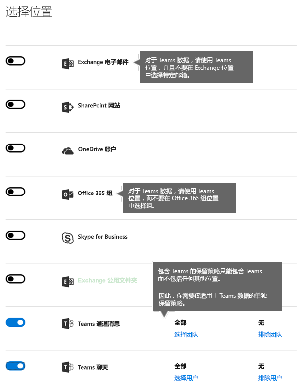
  
## 从保留策略中排除特定类型的 Exchange 项Excluding specific types of Exchange items from a retention policy
使用 PowerShell，可以从保留策略中排除特定类型的 Exchange 项。例如，可以排除语音邮件、IM 对话和邮箱中的其他 Skype for Business Online 内容。此外，还可以排除日历、笔记和任务项。此功能只能通过 PowerShell 使用；无法在创建保留策略时的 UI 中使用它。By using PowerShell, you can exclude specific types of Exchange items from a retention policy. For example, you can exclude voicemail messages, IM conversations, and other Skype for Business Online content in mailboxes. You can also exclude calendar, note, and task items. This capability is available only by using PowerShell; it's not available in the UI when you create a retention policy.
  
为此，请使用 `New-RetentionComplianceRule` 和 `Set-RetentionComplianceRule` cmdlet 的 `ExcludedItemClasses` 参数。若要详细了解 PowerShell，请参阅下面的[查找保留策略的 PowerShell cmdlet](#find-the-powershell-cmdlets-for-retention-policies) 部分。To do this, use the  `ExcludedItemClasses` parameter of the  `New-RetentionComplianceRule` and  `Set-RetentionComplianceRule` cmdlets. For more information about PowerShell, see the below section [Find the PowerShell cmdlets for retention policies](#find-the-powershell-cmdlets-for-retention-policies).

## 锁定保留策略Locking a retention policy
一些组织可能需要遵守监管机构法规，如美国证券交易委员会 (SEC) 法规 17a-4，这条法规要求在启用保留策略后，不得禁用保留策略或削弱它的限制性。使用保留锁定，可以锁定保留策略，包括管理员在内的任何人都无法禁用保留策略或削弱它的限制性。Some organizations may need to comply with rules defined by regulatory bodies such as the Securities and Exchange Commission (SEC) Rule 17a-4, which requires that after a retention policy is turned on, it cannot be turned off or made less restrictive. With Preservation Lock, you can lock the policy so that no one — including the administrator — can turn off the policy or make it less restrictive.
  
在保留策略被锁定后，任何人都无法禁用它，也无法从策略中删除位置。此外，还无法修改或删除在保留期内受策略约束的内容。锁定策略后，只能执行以下保留策略修改操作：向策略添加位置或延长其保留持续时间。可以向已锁定策略添加位置或延长保留期，但不能减少位置或禁用策略。After a policy's been locked, no one can turn it off or remove locations from the policy. And it's not possible to modify or delete content that's subject to the policy during the retention period. After the policy's been locked, the only ways you can modify the retention policy are by adding locations to it or extending its duration. A locked policy can be increased or extended, but it can't be reduced or turned off.
  
因此，锁定保留策略前，请**务必**了解组织的合规性要求，并且仅在确定必须这样做后，才**锁定策略**。Therefore, before you lock a retention policy, it's **critical** that you understand your organization's compliance requirements, and that **you do not lock a policy** until you're certain that's what you need.

### 使用 PowerShell 锁定保留策略Lock a retention policy by using PowerShell
  
你只能使用 PowerShell 来锁定保留策略。You can lock a retention policy only by using PowerShell.

首先，[连接到 Office 365 安全与合规中心 PowerShell](http://go.microsoft.com/fwlink/p/?LinkID=799771)。First, [connect to Office 365 Security & Compliance Center PowerShell](http://go.microsoft.com/fwlink/p/?LinkID=799771).

其次，若要查看保留策略列表并找到要锁定的策略的名称，请运行 `Get-RetentionCompliancePolicy`。Second, to view a list of your retention policies and find the name of the policy that you want to lock, run `Get-RetentionCompliancePolicy`.

第三，若要在保留策略上启用保留锁定，请运行 `Set-RetentionCompliancePolicy` 并将 `RestrictiveRetention` 参数设置为 true -- 例如：Third, to place a Preservation Lock on the retention policy, run `Set-RetentionCompliancePolicy` with the `RestrictiveRetention` parameter set to true -- for example:

`Set-RetentionCompliancePolicy -Identity “<Name of Policy>” – RestrictiveRetention $true`

运行该 cmdlet 后，你将看到确认提示。选择“**全是**”。After you run that cmdlet, you see a confirmation prompt. Choose **Yes to All**.

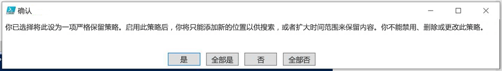

现在已在保留策略上启用保留锁定。如果运行 `Get-RetentionCompliancePolicy`，则需要将 `RestrictiveRetention` 参数设置为 true -- 例如：A Preservation Lock is now placed on the retention policy. If you run `Get-RetentionCompliancePolicy`, the `RestrictiveRetention` parameter is set to true -- for example:

`Get-RetentionCompliancePolicy -Identity “<Name of Policy>” |Fl`

  
## 解除保留策略Locking a retention policy

可随时禁用或删除保留策略。You can turn off a DLP policy at any time. 当你这样做时，任何被保留在保留库中的 SharePoint 或 OneDrive 内容都不会立即遭永久删除。When you do so, any SharePoint or OneDrive content that's being retained in the Preservation Hold library is not immediately and permanently deleted. 相反，为了防止意外的数据丢失，我们设置了 30 天的宽限期。在此期间，相应策略的内容不会在保留库中到期，所以你可以根据需要从其中还原任何内容。Instead, to help prevent inadvertent data loss, there is a 30-day grace period, during which content expiration for that policy does not happen in the Preservation Hold library, so that you can restore any content from there, if needed. 还可以在宽限期内重新启用保留策略，相应策略的任何内容都不会遭删除。You can also turn on the retention policy again during the grace period, and no content will be deleted for that policy.

SharePoint 和 OneDrive 中的此 30 天宽限期对应于 Exchange 中的 30 天延迟保留。This 30-day grace period in SharePoint and OneDrive corresponds to the 30-day delay hold in Exchange. 有关详细信息，请参阅[管理延迟保留的邮箱](https://docs.microsoft.com/zh-CN/office365/securitycompliance/identify-a-hold-on-an-exchange-online-mailbox#managing-mailboxes-on-delay-hold)。For more information, see [Place all mailboxes on hold](https://docs.microsoft.com/zh-CN/office365/securitycompliance/identify-a-hold-on-an-exchange-online-mailbox#managing-mailboxes-on-delay-hold).

## 保留原则或优先级The principles of retention, or what takes precedence?

内容可能或甚至很有可能有多个应用的保留策略，每个策略的操作（保留、删除或先保留再删除）和保留期都不同。优先级是什么？最高优先级是，一个策略保留的内容一定不得被另一个策略永久删除。It's possible or even likely that content might have several retention policies applied to it, each with a different action (retain, delete, or both) and retention period. What takes precedence? At the highest level, rest assured that content being retained by one policy can't be permanently deleted by another policy.
  

  
若要了解不同保留策略是如何应用于内容的，请注意下面这些保留原则：To understand how different retention policies are applied to content, keep these principles of retention in mind:
  
1. **保留优先于删除。** 假设一个保留策略要删除年限超过 3 年的 Exchange 电子邮件，而另一个保留策略则要将 Exchange 电子邮件先保留 5 年再删除。任何年限达到 3 年的内容都会被删除，并隐藏起来对用户不可见，但仍保留在“可恢复项”文件夹中，直到年限达到 5 年，内容才会被永久删除。**Retention wins over deletion.** Suppose that one retention policy says to delete Exchange email after three years, but another retention policy says to retain Exchange email for five years and then delete it. Any content that reaches three years old will be deleted and hidden from the users' view, but still retained in the Recoverable Items folder until the content reaches five years old, when it will be permanently deleted. 
    
2. **最长保留期优先。** 如果内容受多个内容保留策略约束，它会一直保留到最长保留期到期。**The longest retention period wins.** If content's subject to multiple policies that retain content, it will be retained until the end of the longest retention period. 
    
3. **显式添加的位置优先于隐式添加的位置。** 这意味着：**Explicit inclusion wins over implicit inclusion.** This means: 
    
    1. 如果标签包含保留设置且是由用户手动分配给项（如 Exchange 电子邮件或 OneDrive 文档），此标签优先于在网站或邮箱一级分配的策略和由文档库分配的默认标签。例如，如果显式标签要保留内容 10 年，而分配给网站的策略只要保留内容 5 年，那么标签优先。请注意，自动应用标签被视为隐式标签，而不是显式标签，因为它们是由 Office 365 自动应用。If a label with retention settings is manually assigned by a user to an item, such as an Exchange email or OneDrive document, that label takes precedence over both a policy assigned at the site or mailbox level and a default label assigned by the document library. For example, if the explicit label says to retain for ten years, but the policy assigned to the site says to retain for only five years, the label takes precedence. Note that auto-apply labels are considered implicit, not explicit, because they're applied automatically by Office 365.
    
    2. 如果保留策略包含特定位置（如特定用户的邮箱或 OneDrive for Business 帐户），此策略优先于应用于所有用户邮箱或 OneDrive for Business 帐户（而不是包含具体用户邮箱）的其他保留策略。If a retention policy includes a specific location, such as a specific user's mailbox or OneDrive for Business account, that policy takes precedence over another retention policy that applies to all users' mailboxes or OneDrive for Business accounts but doesn't specifically include that user's mailbox.
    
4. **最短删除期优先。** 同样，如果内容受多个内容删除策略约束（无保留），它将在最短保留期到期时被删除。**The shortest deletion period wins.** Similarly, if content's subject to multiple policies that delete content (with no retention), it will be deleted at the end of the shortest retention period. 
    
请注意，保留原则就像是自上而下打破平局的流：如果所有策略或标签应用的规则在一个级别上是相同的，流就会向下移至下一个级别，以确定优先应用哪个规则。Understand that the principles of retention work as a tie-breaking flow from top to bottom: If the rules applied by all policies or labels are the same at one level, the flow moves down to the next level to determine precedence for which rule is applied.
  
最后，保留策略或标签无法永久删除任何保留用于电子数据展示的内容。在此类保留释放后，内容便再次符合上文所述清理流程的条件。Finally, a retention policy or label cannot permanently delete any content that's on hold for eDiscovery. When the hold is released, the content again becomes eligible for the cleanup process described above.
  
## 使用保留策略代替类似功能Use a retention policy instead of these features

可以将一个保留策略轻松应用于整个组织和 Office 365 中的各位置，包括 Exchange Online、SharePoint Online、OneDrive for Business 和 Office 365 组。如果你需要保留或删除 Office 365 中任意位置上的内容，我们建议使用保留策略。（还可以使用包含保留设置的标签。有关详细信息，请参阅[标签概述](labels.md)。）A single retention policy can easily apply to an entire organization and locations across Office 365, including Exchange Online, SharePoint Online, OneDrive for Business, and Office 365 groups. If you need to retain or delete content anywhere in Office 365, we recommend that you use a retention policy. (You can also use labels with retention settings - for more information, see [Overview of labels](labels.md).)
  
还有其他几项先前用于在 Office 365 中保留或删除内容的功能。There are several other features that have previously been used to retain or delete content in Office 365. 其如下所示。These are listed below. 这些功能将继续与保留策略和保留标签配合使用。These features will continue to work side by side with retention policies and retention labels. 但在以后的工作中，对于数据管理，建议使用保留策略或标签，而不使用任何这些功能。But moving forward, for data governance, we recommend that you use a retention policy or labels instead of all of these features. 保留策略是能够在 Office 365 中同时保留和删除内容的唯一功能。A retention policy is the only feature that can both retain and delete content across Office 365.
  
### Exchange OnlineExchange Online

- [在 Office 365 安全与合规中心内管理电子数据展示案件集](https://support.office.com/article/edea80d6-20a7-40fb-b8c4-5e8c8395f6da)（电子数据展示保留）[Manage eDiscovery cases in the Office 365 Security &amp; Compliance Center](https://support.office.com/article/edea80d6-20a7-40fb-b8c4-5e8c8395f6da) (eDiscovery hold) 
    
- [就地保留和诉讼保留](https://go.microsoft.com/fwlink/?linkid=846124)（电子数据展示保留）[In-Place Hold and Litigation Hold](https://go.microsoft.com/fwlink/?linkid=846124) (eDiscovery hold) 

- [如何识别为 Exchange Online 邮箱设置的保留类型How to identify the type of hold placed on an Exchange Online mailbox](https://docs.microsoft.com/office365/securitycompliance/identify-a-hold-on-an-exchange-online-mailbox)
    
- [保留标记和保留策略](https://go.microsoft.com/fwlink/?linkid=846125)，亦称为[邮件传递记录管理 (MRM)](https://go.microsoft.com/fwlink/?linkid=846126)（仅限删除）[Retention tags and retention policies](https://go.microsoft.com/fwlink/?linkid=846125), also known as [messaging records management (MRM)](https://go.microsoft.com/fwlink/?linkid=846126) (Deletion only) 
    
### SharePoint Online 和 OneDrive for BusinessSharePoint Online and OneDrive for Business

- [在 Office 365 安全与合规中心内管理电子数据展示案件集](https://support.office.com/article/edea80d6-20a7-40fb-b8c4-5e8c8395f6da)（电子数据展示保留）[Manage eDiscovery cases in the Office 365 Security &amp; Compliance Center](https://support.office.com/article/edea80d6-20a7-40fb-b8c4-5e8c8395f6da) (eDiscovery hold) 
    
- [在电子数据展示中心内将内容添加到案件集并保留源](https://support.office.com/article/54d70de9-1ec2-4325-84f3-aeb588554479)（电子数据展示保留）[Add content to a case and place sources on hold in the eDiscovery Center](https://support.office.com/article/54d70de9-1ec2-4325-84f3-aeb588554479) (eDiscovery hold) 
    
- [文档删除策略概述](https://support.office.com/article/55e8d858-f278-482b-a198-2e62d6a2e6e5)（仅限删除）[Overview of document deletion policies](https://support.office.com/article/55e8d858-f278-482b-a198-2e62d6a2e6e5) (Deletion only) 
    
- [配置就地记录管理](https://support.office.com/article/7707a878-780c-4be6-9cb0-9718ecde050a)（保留）[Configuring in place records management](https://support.office.com/article/7707a878-780c-4be6-9cb0-9718ecde050a) (Retention) 
    
- [使用网站关闭和删除策略](https://support.office.com/article/a8280d82-27fd-48c5-9adf-8a5431208ba5)（仅限删除）[Use policies for site closure and deletion](https://support.office.com/article/a8280d82-27fd-48c5-9adf-8a5431208ba5) (Deletion only) 
    
- [信息管理策略](intro-to-info-mgmt-policies.md)（仅限删除）[Information management policies](intro-to-info-mgmt-policies.md) (Deletion only) 
    
请注意，如果之前使用了任何电子数据展示保留进行数据管理，请改为使用保留策略，以实现主动合规。Note that if you've previously used any of the eDiscovery holds for the purpose of data governance, you should instead use a retention policy for proactive compliance. 应仅对电子数据展示使用保留策略。You should use a hold only for eDiscovery.
  
### 保留策略替代信息管理策略Retention policies override information management policies

你可能在 SharePoint 网站中使用[信息管理策略](intro-to-info-mgmt-policies.md)保留内容。In SharePoint sites, you may be using [information management policies](intro-to-info-mgmt-policies.md) to retain content. 如果保留策略所应用到的网站已使用内容类型策略或针对列表或库的信息管理策略，则这些策略会在保留策略生效时被忽略。If you apply a retention policy to a site that already uses content type policies or information management policies for a list or library, those policies are ignored while the retention policy is in effect. 
  
## 旧保留策略有何变化？What happened to preservation policies?

如果之前在使用保存策略，则保存策略已自动转换为保留策略 - 只会保留内容，而不会删除内容。If you were using a preservation policy, that policy has been automatically converted to a retention policy that uses only the retain action - the policy won't delete content. 保存策略会继续处理和保存内容，而无需任何改动。The preservation policy will continue to work and preserve your content without requiring any changes from you. 有关这些策略，可查看 [Microsoft 365 合规中心](https://compliance.microsoft.com/)的“**策略**”页面，或者[安全与合规中心](https://protection.office.com/)内“**数据管理**”下的“**保留**”页面。You can find these policies on the **Policies** page in the Microsoft 365 compliance center, or on the **Retention** page under **Data governance** in the Security &amp; Compliance Center. 可以编辑保存策略，以更改保存期限，但是无法进行添加或移动位置等其他更改。You can edit a preservation policy to change the retention period, but you can't make other changes, such as adding or removing locations. 
  
## 权限Permissions

负责创建保留策略的合规性团队成员必须有权访问[安全与合规中心](https://protection.office.com/)。Members of your compliance team who will create DLP policies need permissions to the Compliance Center. 默认情况下，租户管理员有权访问此位置，并可向合规部主管及其他人员授予对[安全与合规中心](https://protection.office.com/)的访问权限，而不授予租户管理员的所有权限。为此，建议转到[安全与合规中心](https://protection.office.com/)内的“**权限**”页，编辑“**合规性管理员**”角色组，再向此角色组添加成员。Members of your compliance team who will create retention policies need permissions to the Security  Compliance Center. By default, your tenant admin will have access to this location and can give compliance officers and other people access to the Security &amp; Compliance Center, without giving them all of the permissions of a tenant admin. To do this, we recommend that you go to the **Permissions** page of the Security &amp; Compliance Center, edit the **Compliance Administrator** role group, and add members to that role group. 
  
有关详细信息，请参阅[向用户授予对 Office 365 安全与合规中心的访问权限](grant-access-to-the-security-and-compliance-center.md)。For more information, see [Give users access to the Office 365 Security &amp; Compliance Center](grant-access-to-the-security-and-compliance-center.md).
  
只有在创建和应用保留策略时，才必须拥有这些权限。强制执行策略并不需要访问内容。These permissions are required only to create and apply a retention policy. Policy enforcement does not require access to the content.
  
## 查找保留策略的 PowerShell cmdletFind the PowerShell cmdlets for retention policies

若要使用保留策略 cmdlet，你需要：To use the retention policy cmdlets, you need to:
  
1. [使用远程 PowerShell 连接到 Office 365 安全与合规中心Connect to the Office 365 Security &amp; Compliance Center using remote PowerShell](http://go.microsoft.com/fwlink/?LinkID=799771&amp;clcid=0x409)
    
2. 使用这些 [Office 365 安全与合规中心 cmdlet](http://go.microsoft.com/fwlink/?LinkID=799772&amp;clcid=0x409)Use these [Office 365 Security &amp; Compliance Center cmdlets](http://go.microsoft.com/fwlink/?LinkID=799772&amp;clcid=0x409)
    
## 更多信息More information

- [标签概述Overview of labels](labels.md)
- [SharePoint Online 限制SharePoint Online Limits](https://docs.microsoft.com/office365/servicedescriptions/sharepoint-online-service-description/sharepoint-online-limits)
- [Microsoft Teams 的限制和规范Limits and specifications for Microsoft Teams](https://docs.microsoft.com/zh-CN/microsoftteams/limits-specifications-teams) 
    

