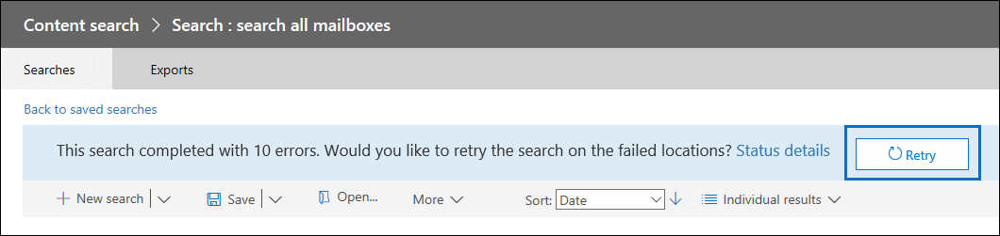

# <a name="retry-a-content-search-to-resolve-a-content-location-error"></a>重试内容搜索来解决内容位置错误

当您使用 Office 365 安全性和合规性中心中的内容搜索搜索非常大 （例如，搜索 100,000 邮箱或在单个内容搜索的详细信息） 的邮箱数时，您可能会收到类似于以下的搜索错误：

```
Error

The search on the following locations failed:

User1@contoso.com: Problem in processing the request. Please try again later. If you keep getting this error, contact your admin. (CS008-009)

User2@contoso.com: Application error occurred. Please try again later. (CS012-002)
```

这些错误 （错误代码的 CS008 009 和 CS012 002） 指示内容搜索未能搜索特定内容的位置;本示例中，或者没有搜索的两个邮箱。内容搜索状态的详细信息弹出页上显示这些错误。

## <a name="cause-of-content-location-errors"></a>内容位置错误的原因

搜索数量较大的邮箱时, 的搜索分布数千个 Microsoft 数据中心中的服务器。在任何时候，特定服务器可能是在重新启动状态或进行故障转移到的冗余副本的过程。在这些情况下，用于检索数据的内容搜索的请求将会超时。在上面的示例中，失败的邮箱的错误是搜索超时的结果。

## <a name="resolving-content-location-errors"></a>解决内容位置错误

重新启动搜索通常会导致在不同服务器上的类似错误。而不是重新启动搜索，单击显示在搜索结果页的顶部的**重试**按钮。



这将导致重试失败的邮箱搜索。如果重试搜索，将会保留其他已成功返回的结果。

## <a name="tips-to-avoid-content-location-errors"></a>若要避免内容位置错误的提示

下面是添加内容位置错误原因和一些提示可帮助您避免这些搜索大量的邮箱时。

- 要搜索的邮箱可能由于用户活动忙。在这种情况下，搜索服务可能限制自身不可用时阻止邮箱。若要避免此问题，请尝试运行在非工作时间内的搜索。

- 搜索查询可能从邮箱检索太多内容。如果可能，请尝试使用关键字、 日期范围和搜索条件缩小搜索范围。

- 太多关键字或关键字短语时创建搜索查询使用[关键字列表](view-keyword-statistics-for-content-search.md#get-keyword-statistics-for-content-searches)。运行搜索查询使用关键字列表时，运行该服务本质上是每个行单独的搜索关键字列表中，以便可以生成统计信息。如果您在搜索查询中使用关键字列表，最小化的关键字列表中的行数或号码关键字分成较小的列表和创建不同的搜索对于每个关键字列表。

  > [!NOTE]
  > 为了帮助减少所导致的大型关键字列表问题，您现在限制为最多个关键字列表中的搜索查询的 20 行。

- 太多正在执行搜索的同一邮箱上一次。如果可能，请尝试在任何一个邮箱上一次运行一个搜索。

- 在单个搜索中搜索太多的邮箱。搜索的邮箱数量非常大时，会增加内容位置错误的概率。如果可能，请尝试运行多个搜索，以便每个搜索包括您的组织中邮箱的子集。

- 正在对邮箱执行所需的维护。该原因可能不经常发生，但有点等待时后接收内容位置错误，然后重新尝试搜索。
