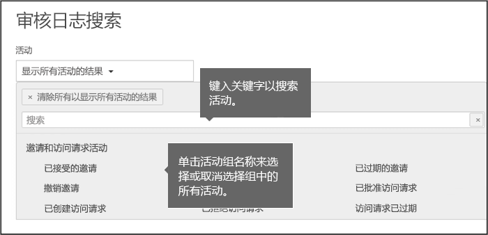
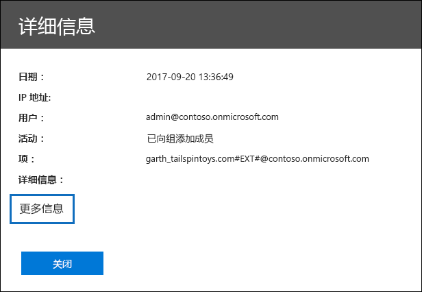
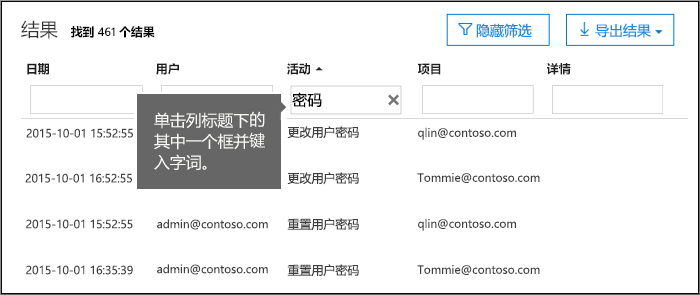
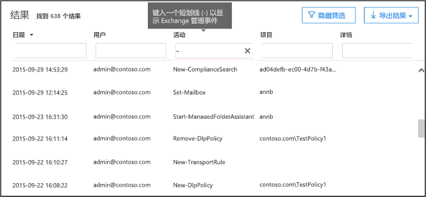

# <a name="search-the-audit-log-in-the-security--compliance-center"></a><span data-ttu-id="a587e-103">在 Security & 合规性中心中搜索审核日志</span><span class="sxs-lookup"><span data-stu-id="a587e-103">Search the audit log in the Security & Compliance Center</span></span>

## <a name="introduction"></a><span data-ttu-id="a587e-104">简介</span><span class="sxs-lookup"><span data-stu-id="a587e-104">Introduction</span></span>

<span data-ttu-id="a587e-105">需要查找用户是否查看了特定文档或清除了其邮箱中的项目？</span><span class="sxs-lookup"><span data-stu-id="a587e-105">Need to find if a user viewed a specific document or purged an item from their mailbox?</span></span> <span data-ttu-id="a587e-106">如果是这样, 您可以使用 office 365 安全&amp;合规中心搜索统一审核日志, 以查看 Office 365 组织中的用户和管理员活动。</span><span class="sxs-lookup"><span data-stu-id="a587e-106">If so, you can use the Office 365 Security &amp; Compliance Center to search the unified audit log to view user and administrator activity in your Office 365 organization.</span></span> <span data-ttu-id="a587e-107">为什么要使用统一审核日志？</span><span class="sxs-lookup"><span data-stu-id="a587e-107">Why a unified audit log?</span></span> <span data-ttu-id="a587e-108">由于您可以在 Office 365 中搜索以下类型的用户和管理员活动:</span><span class="sxs-lookup"><span data-stu-id="a587e-108">Because you can search for the following types of user and admin activity in Office 365:</span></span>
  
- <span data-ttu-id="a587e-109">SharePoint Online 和 OneDrive for business 中的用户活动</span><span class="sxs-lookup"><span data-stu-id="a587e-109">User activity in SharePoint Online and OneDrive for Business</span></span>
    
- <span data-ttu-id="a587e-110">exchange Online 中的用户活动 (exchange 邮箱审核日志记录)</span><span class="sxs-lookup"><span data-stu-id="a587e-110">User activity in Exchange Online (Exchange mailbox audit logging)</span></span>
    
    > [!IMPORTANT]
    > <span data-ttu-id="a587e-111">必须为每个用户邮箱启用邮箱审核日志记录, 然后才会记录 Exchange Online 中的用户活动。</span><span class="sxs-lookup"><span data-stu-id="a587e-111">Mailbox audit logging must be turned on for each user mailbox before user activity in Exchange Online will be logged.</span></span> <span data-ttu-id="a587e-112">有关详细信息, 请参阅[在 Office 365 中启用邮箱审核](enable-mailbox-auditing.md)。</span><span class="sxs-lookup"><span data-stu-id="a587e-112">For more information, see [Enable mailbox auditing in Office 365](enable-mailbox-auditing.md).</span></span>
  
- <span data-ttu-id="a587e-113">SharePoint Online 中的管理员活动</span><span class="sxs-lookup"><span data-stu-id="a587e-113">Admin activity in SharePoint Online</span></span>
    
- <span data-ttu-id="a587e-114">Azure Active Directory 中的管理活动 (Office 365 的目录服务)</span><span class="sxs-lookup"><span data-stu-id="a587e-114">Admin activity in Azure Active Directory (the directory service for Office 365)</span></span>
    
- <span data-ttu-id="a587e-115">exchange Online 中的管理员活动 (exchange 管理员审核日志记录)</span><span class="sxs-lookup"><span data-stu-id="a587e-115">Admin activity in Exchange Online (Exchange admin audit logging)</span></span>
    
- <span data-ttu-id="a587e-116">Sway 中的用户和管理员活动</span><span class="sxs-lookup"><span data-stu-id="a587e-116">User and admin activity in Sway</span></span>
    
- <span data-ttu-id="a587e-117">安全与合规中心中的电子数据展示活动</span><span class="sxs-lookup"><span data-stu-id="a587e-117">eDiscovery activities in the security and compliance center</span></span>
    
- <span data-ttu-id="a587e-118">Power BI 中的用户和管理员活动</span><span class="sxs-lookup"><span data-stu-id="a587e-118">User and admin activity in Power BI</span></span>
    
- <span data-ttu-id="a587e-119">Microsoft 团队中的用户和管理员活动</span><span class="sxs-lookup"><span data-stu-id="a587e-119">User and admin activity in Microsoft Teams</span></span>

- <span data-ttu-id="a587e-120">Dynamics 365 中的用户和管理员活动</span><span class="sxs-lookup"><span data-stu-id="a587e-120">User and admin activity in Dynamics 365</span></span>
    
- <span data-ttu-id="a587e-121">Yammer 中的用户和管理员活动</span><span class="sxs-lookup"><span data-stu-id="a587e-121">User and admin activity in Yammer</span></span>
 
- <span data-ttu-id="a587e-122">Microsoft Flow 中的用户和管理员活动</span><span class="sxs-lookup"><span data-stu-id="a587e-122">User and admin activity in Microsoft Flow</span></span>
    
- <span data-ttu-id="a587e-123">Microsoft Stream 中的用户和管理员活动</span><span class="sxs-lookup"><span data-stu-id="a587e-123">User and admin activity in Microsoft Stream</span></span>

- <span data-ttu-id="a587e-124">Microsoft 工作区分析中的分析师和管理员活动</span><span class="sxs-lookup"><span data-stu-id="a587e-124">Analyst and admin activity in Microsoft Workplace Analytics</span></span>

- <span data-ttu-id="a587e-125">Microsoft PowerApps 中的用户和管理员活动</span><span class="sxs-lookup"><span data-stu-id="a587e-125">User and admin activity in Microsoft PowerApps</span></span>
    
   
## <a name="before-you-begin"></a><span data-ttu-id="a587e-126">准备工作</span><span class="sxs-lookup"><span data-stu-id="a587e-126">Before you begin</span></span>

<span data-ttu-id="a587e-127">在开始搜索 Office 365 审核日志之前, 请务必阅读以下各项。</span><span class="sxs-lookup"><span data-stu-id="a587e-127">Be sure to read the following items before you start searching the Office 365 audit log.</span></span>
  
- <span data-ttu-id="a587e-128">您 (或另一个管理员) 必须先启用审核日志记录, 然后才能开始搜索 Office 365 审核日志。</span><span class="sxs-lookup"><span data-stu-id="a587e-128">You (or another admin) must first turn on audit logging before you can start searching the Office 365 audit log.</span></span> <span data-ttu-id="a587e-129">若要打开它, 只需单击安全 & 合规性中心中的 "**审核日志搜索**" 页上的 "**开始记录用户和管理员活动**"。</span><span class="sxs-lookup"><span data-stu-id="a587e-129">To turn it on, just click **Start recording user and admin activity** on the **Audit log search** page in the Security & Compliance Center.</span></span> <span data-ttu-id="a587e-130">(如果看不到此链接, 表明已为您的组织启用了审核。)打开后, 会显示一条消息, 指出正在准备审核日志, 并且您可以在准备完成后的几小时内运行搜索。</span><span class="sxs-lookup"><span data-stu-id="a587e-130">(If you don't see this link, auditing has already been turned on for your organization.) After you turn it on, a message is displayed that says the audit log is being prepared and that you can run a search in a couple of hours after the preparation is complete.</span></span> <span data-ttu-id="a587e-131">您只需执行一次此操作。</span><span class="sxs-lookup"><span data-stu-id="a587e-131">You only have to do this once.</span></span> 
    
    > [!NOTE]
    > <span data-ttu-id="a587e-132">默认情况下, 我们正在启用审核。</span><span class="sxs-lookup"><span data-stu-id="a587e-132">We're in the process of turning on auditing by default.</span></span> <span data-ttu-id="a587e-133">在此之前, 你可以按照前面所述将其打开。</span><span class="sxs-lookup"><span data-stu-id="a587e-133">Until then, you can turn it on as previously described.</span></span> 
  
- <span data-ttu-id="a587e-134">您必须在 Exchange Online 中向您分配 "仅查看审核日志" 或 "审核日志" 角色, 才能搜索 Office 365 审核日志。</span><span class="sxs-lookup"><span data-stu-id="a587e-134">You have to be assigned the View-Only Audit Logs or Audit Logs role in Exchange Online to search the Office 365 audit log.</span></span> <span data-ttu-id="a587e-135">默认情况下, 将这些角色分配给 Exchange 管理中心中 "**权限**" 页上的 "合规性管理" 和 "组织管理" 角色组。</span><span class="sxs-lookup"><span data-stu-id="a587e-135">By default, these roles are assigned to the Compliance Management and Organization Management role groups on the **Permissions** page in the Exchange admin center.</span></span> <span data-ttu-id="a587e-136">请注意, Office 365 和 Microsoft 365 中的全局管理员将自动添加为 Exchange Online 中的 "组织管理" 角色组的成员。</span><span class="sxs-lookup"><span data-stu-id="a587e-136">Note that global administrators in Office 365 and Microsoft 365 are automatically added as members of the Organization Management role group in Exchange Online.</span></span> <span data-ttu-id="a587e-137">若要使用户能够使用最低级别的权限搜索 Office 365 审核日志, 您可以在 Exchange Online 中创建自定义角色组, 添加仅查看审核日志或审核日志角色, 然后将该用户添加为新角色组的成员。</span><span class="sxs-lookup"><span data-stu-id="a587e-137">To give a user the ability to search the Office 365 audit log with the minimum level of privileges, you can create a custom role group in Exchange Online, add the View-Only Audit Logs or Audit Logs role, and then add the user as a member of the new role group.</span></span> <span data-ttu-id="a587e-138">有关详细信息, 请参阅[在 Exchange Online 中管理角色组](https://go.microsoft.com/fwlink/p/?LinkID=730688)。</span><span class="sxs-lookup"><span data-stu-id="a587e-138">For more information, see [Manage role groups in Exchange Online](https://go.microsoft.com/fwlink/p/?LinkID=730688).</span></span>
    
    > [!IMPORTANT]
    > <span data-ttu-id="a587e-139">如果在 Security & 合规性中心的 "**权限**" 页上为用户分配 "仅查看审核日志" 或 "审核日志" 角色, 则他们将无法搜索 Office 365 审核日志。</span><span class="sxs-lookup"><span data-stu-id="a587e-139">If you assign a user the View-Only Audit Logs or Audit Logs role on the **Permissions** page in the Security & Compliance Center, they won't be able to search the Office 365 audit log.</span></span> <span data-ttu-id="a587e-140">您必须在 Exchange Online 中分配权限。</span><span class="sxs-lookup"><span data-stu-id="a587e-140">You have to assign the permissions in Exchange Online.</span></span> <span data-ttu-id="a587e-141">这是因为用于搜索审核日志的基础 cmdlet 是 Exchange Online cmdlet。</span><span class="sxs-lookup"><span data-stu-id="a587e-141">This is because the underlying cmdlet used to search the audit log is an Exchange Online cmdlet.</span></span> 
  
- <span data-ttu-id="a587e-142">当用户或管理员执行了审核的活动时, 将生成审核记录并将其存储在组织的 Office 365 审核日志中。</span><span class="sxs-lookup"><span data-stu-id="a587e-142">When an audited activity is performed by a user or admin, an audit record is generated and stored in the Office 365 audit log for your organization.</span></span> <span data-ttu-id="a587e-143">审核记录保留的时间长度 (并可在审核日志中搜索) 取决于您的 Office 365 订阅, 以及分配给特定用户的许可证类型。</span><span class="sxs-lookup"><span data-stu-id="a587e-143">The length of time that an audit record is retained (and searchable in the audit log) depends on your Office 365 subscription, and specifically the type of the license that is assigned to a specific user.</span></span>

     - <span data-ttu-id="a587e-144">**Office 365 E3** -审核记录保留90天。</span><span class="sxs-lookup"><span data-stu-id="a587e-144">**Office 365 E3** - Audit records are retained for 90 days.</span></span> <span data-ttu-id="a587e-145">这意味着, 您可以在审核日志中搜索在过去的90天内执行的活动。</span><span class="sxs-lookup"><span data-stu-id="a587e-145">That means you can search the audit log for activities that were performed within the last 90 days.</span></span>

     - <span data-ttu-id="a587e-146">**Office 365 E5** -审核记录保留365天 (一年)。</span><span class="sxs-lookup"><span data-stu-id="a587e-146">**Office 365 E5** - Audit records are retained for 365 days (one year).</span></span> <span data-ttu-id="a587e-147">这意味着您可以在审核日志中搜索在上一年中执行的活动。</span><span class="sxs-lookup"><span data-stu-id="a587e-147">That means you can search the audit log for activities that were performed within the last year.</span></span> <span data-ttu-id="a587e-148">对于分配了 E3/Exchange Online 计划1许可证并拥有 Office 365 高级合规性附加许可证的用户, 保留一年的审核记录也是可用的。</span><span class="sxs-lookup"><span data-stu-id="a587e-148">Retaining audit records for one year is also available for users that are assigned an E3/Exchange Online Plan 1 license and have an Office 365 Advanced Compliance add-on license.</span></span>

        > [!NOTE]
        > <span data-ttu-id="a587e-149">对于 E5 组织, 审核记录的为期一年的保留期 (或具有高级合规性附加许可证的 E3 组织) 当前仅在专用预览计划中可用。</span><span class="sxs-lookup"><span data-stu-id="a587e-149">The one-year retention period for audit records for E5 organizations (or E3 organizations that have Advanced Compliance add-on licenses) is currently available only as part of a private preview program.</span></span> <span data-ttu-id="a587e-150">若要注册此预览计划, 请为[Microsoft 支持](https://docs.microsoft.com/en-us/office365/admin/contact-support-for-business-products?redirectSourcePath=%252fen-us%252farticle%252fcontact-support-for-business-products-admin-help-32a17ca7-6fa0-4870-8a8d-e25ba4ccfd4b&view=o365-worldwide&tabs=online)文件提供请求, 并将以下内容作为您需要帮助的说明, 包括以下内容: "长期 Office 365 审核日志专用预览"。</span><span class="sxs-lookup"><span data-stu-id="a587e-150">To enroll in this preview program, please file a request with [Microsoft Support](https://docs.microsoft.com/en-us/office365/admin/contact-support-for-business-products?redirectSourcePath=%252fen-us%252farticle%252fcontact-support-for-business-products-admin-help-32a17ca7-6fa0-4870-8a8d-e25ba4ccfd4b&view=o365-worldwide&tabs=online) and include the following as the description of what you need help with: "Long-term Office 365 audit log private preview".</span></span>

- <span data-ttu-id="a587e-151">如果要关闭组织的 Office 365 中的审核日志搜索, 可以在连接到 Exchange Online 组织的远程 PowerShell 中运行以下命令:</span><span class="sxs-lookup"><span data-stu-id="a587e-151">If you want to turn off audit log search in Office 365 for your organization, you can run the following command in remote PowerShell connected to your Exchange Online organization:</span></span>
    
  ```
  Set-AdminAuditLogConfig -UnifiedAuditLogIngestionEnabled $false
  ```

    <span data-ttu-id="a587e-152">若要再次启用审核搜索, 您可以在 Exchange Online PowerShell 中运行以下命令:</span><span class="sxs-lookup"><span data-stu-id="a587e-152">To turn on audit search again, you can run the following command in Exchange Online PowerShell:</span></span>
    
  ```
  Set-AdminAuditLogConfig -UnifiedAuditLogIngestionEnabled $true
  ```

    <span data-ttu-id="a587e-153">有关详细信息, 请参阅[在 Office 365 中关闭审核日志搜索](turn-audit-log-search-on-or-off.md)。</span><span class="sxs-lookup"><span data-stu-id="a587e-153">For more information, see [Turn off audit log search in Office 365](turn-audit-log-search-on-or-off.md).</span></span>
    
- <span data-ttu-id="a587e-154">如前面所述, 用于搜索审核日志的基础 cmdlet 是**UnifiedAuditLog**的 Exchange Online cmdlet。</span><span class="sxs-lookup"><span data-stu-id="a587e-154">As previously stated, the underlying cmdlet used to search the audit log is an Exchange Online cmdlet, which is **Search-UnifiedAuditLog**.</span></span> <span data-ttu-id="a587e-155">这意味着您可以使用此 cmdlet 搜索 Office 365 审核日志, 而不是使用安全 & 合规性中心中的 "**审核日志搜索**" 页。</span><span class="sxs-lookup"><span data-stu-id="a587e-155">That means you can use this cmdlet to search the Office 365 audit log instead of using the **Audit log search** page in the Security & Compliance Center.</span></span> <span data-ttu-id="a587e-156">您必须在连接到 Exchange Online 组织的远程 PowerShell 中运行此 cmdlet。</span><span class="sxs-lookup"><span data-stu-id="a587e-156">You have to run this cmdlet in remote PowerShell connected to your Exchange Online organization.</span></span> <span data-ttu-id="a587e-157">有关详细信息, 请参阅[UnifiedAuditLog](https://go.microsoft.com/fwlink/p/?linkid=834776)。</span><span class="sxs-lookup"><span data-stu-id="a587e-157">For more information, see [Search-UnifiedAuditLog](https://go.microsoft.com/fwlink/p/?linkid=834776).</span></span>
    
- <span data-ttu-id="a587e-158">如果要以编程方式从 Office 365 审核日志中下载数据, 我们建议使用 office 365 管理活动 API, 而不是使用 PowerShell 脚本。</span><span class="sxs-lookup"><span data-stu-id="a587e-158">If you want to programmatically download data from the Office 365 audit log, we recommend that you use the Office 365 Management Activity API instead of using a PowerShell script.</span></span> <span data-ttu-id="a587e-159">Office 365 管理活动 API 是 REST web 服务, 可用于为组织开发操作、安全性和合规性监视解决方案。</span><span class="sxs-lookup"><span data-stu-id="a587e-159">The Office 365 Management Activity API is a REST web service that you can use to develop operations, security, and compliance monitoring solutions for your organization.</span></span> <span data-ttu-id="a587e-160">有关详细信息, 请参阅[Office 365 管理活动 API 参考](https://go.microsoft.com/fwlink/?linkid=852309)。</span><span class="sxs-lookup"><span data-stu-id="a587e-160">For more information, see [Office 365 Management Activity API reference](https://go.microsoft.com/fwlink/?linkid=852309).</span></span>
    
- <span data-ttu-id="a587e-161">在事件发生后, 将在搜索结果中显示相应的审核日志条目, 最长可能需要30分钟或最长24小时。</span><span class="sxs-lookup"><span data-stu-id="a587e-161">It can take up to 30 minutes or up to 24 hours after an event occurs for the corresponding audit log entry to be displayed in the search results.</span></span> <span data-ttu-id="a587e-162">下表显示了 Office 365 中的不同服务所需的时间。</span><span class="sxs-lookup"><span data-stu-id="a587e-162">The following table shows the time it takes for the different services in Office 365.</span></span>
    
    |**<span data-ttu-id="a587e-163">Office 365 服务</span><span class="sxs-lookup"><span data-stu-id="a587e-163">Office 365 service</span></span>**|**<span data-ttu-id="a587e-164">30 分钟</span><span class="sxs-lookup"><span data-stu-id="a587e-164">30 minutes</span></span>**|**<span data-ttu-id="a587e-165">24 小时制</span><span class="sxs-lookup"><span data-stu-id="a587e-165">24 hours</span></span>**|
    |:-----|:-----|:-----|
    |<span data-ttu-id="a587e-166">高级威胁防护和威胁智能</span><span class="sxs-lookup"><span data-stu-id="a587e-166">Advanced Threat Protection and Threat Intelligence</span></span>  <br/> || |
    |<span data-ttu-id="a587e-168">Azure Active Directory (用户登录事件)</span><span class="sxs-lookup"><span data-stu-id="a587e-168">Azure Active Directory (user login events)</span></span>  <br/> ||           <br/> |
    |<span data-ttu-id="a587e-170">Azure Active Directory (管理员事件)</span><span class="sxs-lookup"><span data-stu-id="a587e-170">Azure Active Directory (admin events)</span></span>  <br/> || |
    |<span data-ttu-id="a587e-172">数据丢失防护</span><span class="sxs-lookup"><span data-stu-id="a587e-172">Data Loss Prevention</span></span>  <br/> |       <br/>| |
    |<span data-ttu-id="a587e-174">Dynamics 365 CRM</span><span class="sxs-lookup"><span data-stu-id="a587e-174">Dynamics 365 CRM</span></span> <br/> |           <br/>| |
    |<span data-ttu-id="a587e-176">电子数据展示</span><span class="sxs-lookup"><span data-stu-id="a587e-176">eDiscovery</span></span>  <br/> |           <br/>| |
    |<span data-ttu-id="a587e-178">Exchange Online</span><span class="sxs-lookup"><span data-stu-id="a587e-178">Exchange Online</span></span>  <br/> |           <br/> ||
    |<span data-ttu-id="a587e-180">Microsoft Flow</span><span class="sxs-lookup"><span data-stu-id="a587e-180">Microsoft Flow</span></span>  <br/> |           <br/>| |
    |<span data-ttu-id="a587e-182">Microsoft Forms</span><span class="sxs-lookup"><span data-stu-id="a587e-182">Microsoft Forms</span></span>  <br/> |           <br/>| |
    |<span data-ttu-id="a587e-184">Microsoft Project</span><span class="sxs-lookup"><span data-stu-id="a587e-184">Microsoft Project</span></span>  <br/> |           <br/>| |
    |<span data-ttu-id="a587e-186">Microsoft Stream</span><span class="sxs-lookup"><span data-stu-id="a587e-186">Microsoft Stream</span></span>  <br/> |           <br/>| |
    |<span data-ttu-id="a587e-188">Microsoft Teams</span><span class="sxs-lookup"><span data-stu-id="a587e-188">Microsoft Teams</span></span>  <br/> |           <br/> ||
    |<span data-ttu-id="a587e-190">Power BI</span><span class="sxs-lookup"><span data-stu-id="a587e-190">Power BI</span></span>  <br/> |           <br/>| |
    |<span data-ttu-id="a587e-192">安全与合规中心</span><span class="sxs-lookup"><span data-stu-id="a587e-192">Security & Compliance Center</span></span>  <br/> |           <br/> ||
    |<span data-ttu-id="a587e-194">SharePoint Online 和 OneDrive for Business</span><span class="sxs-lookup"><span data-stu-id="a587e-194">SharePoint Online and OneDrive for Business</span></span>  <br/> |           <br/> ||
    |<span data-ttu-id="a587e-196">Sway</span><span class="sxs-lookup"><span data-stu-id="a587e-196">Sway</span></span>  <br/> ||           <br/> |
    |<span data-ttu-id="a587e-198">工作区分析</span><span class="sxs-lookup"><span data-stu-id="a587e-198">Workplace Analytics</span></span><br/> |           <br/> || 
    |<span data-ttu-id="a587e-200">Yammer</span><span class="sxs-lookup"><span data-stu-id="a587e-200">Yammer</span></span>  <br/> ||           <br/> |
   
- <span data-ttu-id="a587e-202">azure Active Directory (azure AD) 是 Office 365 的目录服务。</span><span class="sxs-lookup"><span data-stu-id="a587e-202">Azure Active Directory (Azure AD) is the directory service for Office 365.</span></span> <span data-ttu-id="a587e-203">统一审核日志包含在 Microsoft 365 管理中心或在 Azure 管理门户中执行的用户、组、应用程序、域和目录活动。</span><span class="sxs-lookup"><span data-stu-id="a587e-203">The unified audit log contains user, group, application, domain, and directory activities performed in the Microsoft 365 admin center or in the in Azure management portal.</span></span> <span data-ttu-id="a587e-204">有关 azure AD 事件的完整列表, 请参阅[azure Active Directory 审核报告事件](https://go.microsoft.com/fwlink/p/?LinkID=616549)。</span><span class="sxs-lookup"><span data-stu-id="a587e-204">For a complete list of Azure AD events, see [Azure Active Directory Audit Report Events](https://go.microsoft.com/fwlink/p/?LinkID=616549).</span></span>
    
- <span data-ttu-id="a587e-205">exchange Online 审核日志包含两种类型的事件: Exchange 管理员事件 (由管理员执行的操作) 和邮箱事件 (由用户对邮箱执行的操作)。</span><span class="sxs-lookup"><span data-stu-id="a587e-205">Exchange Online audit logs consist of two types of events: Exchange admin events (actions taken by administrators) and mailbox events (actions taken by users on mailboxes).</span></span> <span data-ttu-id="a587e-206">请注意, 默认情况下不启用邮箱审核。</span><span class="sxs-lookup"><span data-stu-id="a587e-206">Note that mailbox auditing isn't enabled by default.</span></span> <span data-ttu-id="a587e-207">必须为每个用户邮箱启用邮箱事件, 然后才能在 Office 365 审核日志中搜索邮箱事件。</span><span class="sxs-lookup"><span data-stu-id="a587e-207">It must be enable for each user mailbox before mailbox events can be searched for in the Office 365 audit log.</span></span> <span data-ttu-id="a587e-208">有关邮箱审核和所记录的邮箱审核操作的详细信息, 请参阅[在 Office 365 中启用邮箱审核](enable-mailbox-auditing.md)。</span><span class="sxs-lookup"><span data-stu-id="a587e-208">For more information about mailbox auditing and the mailbox auditing actions that are logged, see [Enable mailbox auditing in Office 365](enable-mailbox-auditing.md).</span></span>
    
- <span data-ttu-id="a587e-209">Power BI 的审核日志记录默认情况下不启用。</span><span class="sxs-lookup"><span data-stu-id="a587e-209">Audit logging for Power BI isn't enabled by default.</span></span> <span data-ttu-id="a587e-210">若要在 Office 365 审核日志中搜索 Power bi 活动, 您必须在 Power BI 管理门户中启用审核。</span><span class="sxs-lookup"><span data-stu-id="a587e-210">To search for Power BI activities in the Office 365 audit log, you have to enable auditing in the Power BI admin portal.</span></span> <span data-ttu-id="a587e-211">有关说明, 请参阅[Power BI 管理门户](https://docs.microsoft.com/power-bi/service-admin-portal#audit-logs)中的 "审核日志" 部分。</span><span class="sxs-lookup"><span data-stu-id="a587e-211">For instructions, see the "Audit logs" section in [Power BI admin portal](https://docs.microsoft.com/power-bi/service-admin-portal#audit-logs).</span></span>
    
    
## <a name="search-the-audit-log"></a><span data-ttu-id="a587e-212">搜索审核日志</span><span class="sxs-lookup"><span data-stu-id="a587e-212">Search the audit log</span></span>

<span data-ttu-id="a587e-213">以下是在 Office 365 中搜索审核日志的过程。</span><span class="sxs-lookup"><span data-stu-id="a587e-213">Here's the process for searching the audit log in Office 365.</span></span>
  
[<span data-ttu-id="a587e-214">步骤 1: 运行审核日志搜索</span><span class="sxs-lookup"><span data-stu-id="a587e-214">Step 1: Run an audit log search</span></span>](#step-1-run-an-audit-log-search)
  
[<span data-ttu-id="a587e-215">步骤 2: 查看搜索结果</span><span class="sxs-lookup"><span data-stu-id="a587e-215">Step 2: View the search results</span></span>](#step-2-view-the-search-results)

[<span data-ttu-id="a587e-216">步骤 3: 筛选搜索结果</span><span class="sxs-lookup"><span data-stu-id="a587e-216">Step 3: Filter the search results</span></span>](#step-3-filter-the-search-results)

[<span data-ttu-id="a587e-217">步骤 4: 将搜索结果导出到文件</span><span class="sxs-lookup"><span data-stu-id="a587e-217">Step 4: Export the search results to a file</span></span>](#step-4-export-the-search-results-to-a-file)
  
### <a name="step-1-run-an-audit-log-search"></a><span data-ttu-id="a587e-218">步骤 1: 运行审核日志搜索</span><span class="sxs-lookup"><span data-stu-id="a587e-218">Step 1: Run an audit log search</span></span>

1. <span data-ttu-id="a587e-219">转到 [https://protection.office.com](https://protection.office.com)。</span><span class="sxs-lookup"><span data-stu-id="a587e-219">Go to [https://protection.office.com](https://protection.office.com).</span></span>
    
    > [!TIP]
    > <span data-ttu-id="a587e-220">使用专用浏览会话 (而非常规会话) 访问安全 & 合规性中心, 因为这将阻止当前登录的凭据正在使用。</span><span class="sxs-lookup"><span data-stu-id="a587e-220">Use a private browsing session (not a regular session) to access the Security & Compliance Center because this will prevent the credential that you are currently logged on with from being used.</span></span> <span data-ttu-id="a587e-221">若要在 Internet Explorer 或 Microsoft Edge 中打开 InPrivate 浏览会话, 只需按 CTRL + SHIFT + P。</span><span class="sxs-lookup"><span data-stu-id="a587e-221">To open an InPrivate Browsing session in Internet Explorer or Microsoft Edge, just press CTRL+SHIFT+P.</span></span> <span data-ttu-id="a587e-222">若要在 Google Chrome 中打开一个专用浏览会话 (称为 incognito 窗口), 请按 CTRL + SHIFT + N。</span><span class="sxs-lookup"><span data-stu-id="a587e-222">To open a private browsing session in Google Chrome (called an incognito window), press CTRL+SHIFT+N.</span></span> 
  
2. <span data-ttu-id="a587e-223">使用工作或学校帐户登录到 Office 365。</span><span class="sxs-lookup"><span data-stu-id="a587e-223">Sign in to Office 365 using your work or school account.</span></span>
    
3. <span data-ttu-id="a587e-224">在安全 & 合规性中心的左侧窗格中, 单击 "**搜索**", 然后单击 "**审核日志搜索**"。</span><span class="sxs-lookup"><span data-stu-id="a587e-224">In the left pane of the Security & Compliance Center, click **Search**, and then click **Audit log search**.</span></span>
    
    <span data-ttu-id="a587e-225">将显示 "**审核日志搜索**" 页。</span><span class="sxs-lookup"><span data-stu-id="a587e-225">The **Audit log search** page is displayed.</span></span> 
    
    
  
    > [!NOTE]
    > <span data-ttu-id="a587e-227">您必须先启用审核日志记录, 然后才能运行审核日志搜索。</span><span class="sxs-lookup"><span data-stu-id="a587e-227">You have to first turn on audit logging before you can run an audit log search.</span></span> <span data-ttu-id="a587e-228">如果显示 "**开始记录用户和管理员活动**" 链接, 请单击它以启用审核。</span><span class="sxs-lookup"><span data-stu-id="a587e-228">If the **Start recording user and admin activity** link is displayed, click it to turn on auditing.</span></span> <span data-ttu-id="a587e-229">如果您看不到此链接, 表明已为您的组织启用了审核。</span><span class="sxs-lookup"><span data-stu-id="a587e-229">If you don't see this link, auditing has already been turned on for your organization.</span></span> 
  
4. <span data-ttu-id="a587e-230">配置以下搜索条件:</span><span class="sxs-lookup"><span data-stu-id="a587e-230">Configure the following search criteria:</span></span>
    
    <span data-ttu-id="a587e-231">a.</span><span class="sxs-lookup"><span data-stu-id="a587e-231">a.</span></span> <span data-ttu-id="a587e-232">**活动**单击下拉列表以显示您可以搜索的活动。</span><span class="sxs-lookup"><span data-stu-id="a587e-232">**Activities** Click the drop-down list to display the activities that you can search for.</span></span> <span data-ttu-id="a587e-233">用户和管理员活动组织到相关活动的组中。</span><span class="sxs-lookup"><span data-stu-id="a587e-233">User and admin activities are organized in to groups of related activities.</span></span> <span data-ttu-id="a587e-234">您可以选择特定的活动, 也可以单击活动组名称以选择组中的所有活动。</span><span class="sxs-lookup"><span data-stu-id="a587e-234">You can select specific activities or you can click the activity group name to select all activities in the group.</span></span> <span data-ttu-id="a587e-235">您还可以单击所选活动以清除所选内容。</span><span class="sxs-lookup"><span data-stu-id="a587e-235">You can also click a selected activity to clear the selection.</span></span> <span data-ttu-id="a587e-236">运行搜索后, 仅显示所选活动的审核日志条目。</span><span class="sxs-lookup"><span data-stu-id="a587e-236">After you run the search, only the audit log entries for the selected activities are displayed.</span></span> <span data-ttu-id="a587e-237">选择 "**显示所有活动的结果**" 将显示所选用户或用户组执行的所有活动的结果。</span><span class="sxs-lookup"><span data-stu-id="a587e-237">Selecting **Show results for all activities** will display results for all activities performed by the selected user or group of users.</span></span> 
    
    <span data-ttu-id="a587e-238">100以上的用户和管理员活动记录在 Office 365 审核日志中。</span><span class="sxs-lookup"><span data-stu-id="a587e-238">Over 100 user and admin activities are logged in the Office 365 audit log.</span></span> <span data-ttu-id="a587e-239">单击本文主题中的 "已**审核的活动**" 选项卡, 查看每个不同的 Office 365 服务中的每个活动的说明。</span><span class="sxs-lookup"><span data-stu-id="a587e-239">Click the **Audited activities** tab at the topic of this article to see the descriptions of every activity in each of the different Office 365 services.</span></span> 
    
    <span data-ttu-id="a587e-240">b.</span><span class="sxs-lookup"><span data-stu-id="a587e-240">b.</span></span> <span data-ttu-id="a587e-241">默认情况下, 将选择 "**开始日期**" 和 "**结束日期**" 最后七天。</span><span class="sxs-lookup"><span data-stu-id="a587e-241">**Start date** and **End date** The last seven days are selected by default.</span></span> <span data-ttu-id="a587e-242">选择要显示在该时间段内发生的事件的日期和时间范围。</span><span class="sxs-lookup"><span data-stu-id="a587e-242">Select a date and time range to display the events that occurred within that period.</span></span> <span data-ttu-id="a587e-243">日期和时间以协调通用时间 (UTC) 格式显示。</span><span class="sxs-lookup"><span data-stu-id="a587e-243">The date and time are presented in Coordinated Universal Time (UTC) format.</span></span> <span data-ttu-id="a587e-244">您可以指定的最大日期范围为90天。</span><span class="sxs-lookup"><span data-stu-id="a587e-244">The maximum date range that you can specify is 90 days.</span></span> <span data-ttu-id="a587e-245">如果所选日期范围大于90天, 则显示错误。</span><span class="sxs-lookup"><span data-stu-id="a587e-245">An error is displayed if the selected date range is greater than 90 days.</span></span> 
    
    > [!TIP]
    > <span data-ttu-id="a587e-246">如果使用的最大日期范围是90天, 请选择 "**开始日期**" 的当前时间。</span><span class="sxs-lookup"><span data-stu-id="a587e-246">If you're using the maximum date range of 90 days, select the current time for the **Start date**.</span></span> <span data-ttu-id="a587e-247">否则, 您将收到一条错误消息, 指出开始日期早于结束日期。</span><span class="sxs-lookup"><span data-stu-id="a587e-247">Otherwise, you'll receive an error saying that the start date is earlier than the end date.</span></span> <span data-ttu-id="a587e-248">如果您在最近90天内启用了审核, 则在启用审核的日期之前, 最大日期范围无法开始。</span><span class="sxs-lookup"><span data-stu-id="a587e-248">If you've turned on auditing within the last 90 days, the maximum date range can't start before the date that auditing was turned on.</span></span> 
  
    <span data-ttu-id="a587e-249">c.</span><span class="sxs-lookup"><span data-stu-id="a587e-249">c.</span></span> <span data-ttu-id="a587e-250">**用户**在此框中单击, 然后选择要为其显示搜索结果的一个或多个用户。</span><span class="sxs-lookup"><span data-stu-id="a587e-250">**Users** Click in this box and then select one or more users to display search results for.</span></span> <span data-ttu-id="a587e-251">您在此框中选择的用户执行的选定活动的审核日志条目将显示在结果列表中。</span><span class="sxs-lookup"><span data-stu-id="a587e-251">The audit log entries for the selected activity performed by the users you select in this box are displayed in the list of results.</span></span> <span data-ttu-id="a587e-252">将此框保留为空将返回组织中所有用户 (和服务帐户) 的条目。</span><span class="sxs-lookup"><span data-stu-id="a587e-252">Leave this box blank to return entries for all users (and service accounts) in your organization.</span></span> 
    
    <span data-ttu-id="a587e-253">d.</span><span class="sxs-lookup"><span data-stu-id="a587e-253">d.</span></span> <span data-ttu-id="a587e-254">**文件、文件夹或网站**键入文件或文件夹名称的部分或全部, 以搜索与包含指定关键字的文件夹文件相关的活动。</span><span class="sxs-lookup"><span data-stu-id="a587e-254">**File, folder, or site** Type some or all of a file or folder name to search for activity related to the file of folder that contains the specified keyword.</span></span> <span data-ttu-id="a587e-255">您还可以指定文件或文件夹的 URL。</span><span class="sxs-lookup"><span data-stu-id="a587e-255">You can also specify a URL of a file or folder.</span></span> <span data-ttu-id="a587e-256">如果使用 URL, 请确保键入完整的 url 路径, 或者如果只键入 url 的一部分, 则不要包含任何特殊字符或空格。</span><span class="sxs-lookup"><span data-stu-id="a587e-256">If you use a URL, be sure the type the full URL path or if you just type a portion of the URL, don't include any special characters or spaces.</span></span> 
    
    <span data-ttu-id="a587e-257">将此框保留为空将返回组织中的所有文件和文件夹的条目。</span><span class="sxs-lookup"><span data-stu-id="a587e-257">Leave this box blank to return entries for all files and folders in your organization.</span></span>
    
    > [!TIP]
    > <span data-ttu-id="a587e-258">如果要查找与**网站**相关的所有活动, 请在 URL 后面添加通配符 (\*) 以返回该网站的所有条目;例如, **https://contoso-my.sharepoint.com/personal/"\*"**。</span><span class="sxs-lookup"><span data-stu-id="a587e-258">If you're looking for all activities related to a **site**, add the wildcard symbol (\*) after the URL to return all entries for that site; for example, **"https://contoso-my.sharepoint.com/personal/\*"**.</span></span>
    
5. <span data-ttu-id="a587e-259">单击 "**搜索**" 以使用搜索条件运行搜索。</span><span class="sxs-lookup"><span data-stu-id="a587e-259">Click **Search** to run the search using your search criteria.</span></span> 
    
    <span data-ttu-id="a587e-260">搜索结果将被加载, 并在几分钟后显示在 "**结果**" 下。</span><span class="sxs-lookup"><span data-stu-id="a587e-260">The search results are loaded, and after a few moments they are displayed under **Results**.</span></span> <span data-ttu-id="a587e-261">搜索完成后, 将显示找到的结果数。</span><span class="sxs-lookup"><span data-stu-id="a587e-261">When the search is finished, the number of results found is displayed.</span></span> <span data-ttu-id="a587e-262">请注意, 在**结果**窗格中最多可显示5000个事件, 并增加150个事件;如果超过5000个事件满足搜索条件, 则显示最新的5000事件。</span><span class="sxs-lookup"><span data-stu-id="a587e-262">Note that a maximum of 5,000 events will be displayed in the **Results** pane in increments of 150 events; if more than 5,000 events meet the search criteria, the most recent 5,000 events are displayed.</span></span> 
    
    
  
  
#### <a name="tips-for-searching-the-audit-log"></a><span data-ttu-id="a587e-264">有关搜索审核日志的提示</span><span class="sxs-lookup"><span data-stu-id="a587e-264">Tips for searching the audit log</span></span>

- <span data-ttu-id="a587e-265">您可以通过单击活动名称来选择要搜索的特定活动。</span><span class="sxs-lookup"><span data-stu-id="a587e-265">You can select specific activities to search for by clicking on the activity name.</span></span> <span data-ttu-id="a587e-266">或者, 您可以通过单击组名称来搜索组中的所有活动 (如**文件和文件夹活动**)。</span><span class="sxs-lookup"><span data-stu-id="a587e-266">Or you can search for all activities in a group (such as **File and folder activities**) by clicking on the group name.</span></span> <span data-ttu-id="a587e-267">如果已选择活动, 则可以单击它以取消选择。</span><span class="sxs-lookup"><span data-stu-id="a587e-267">If an activity is selected, you can click it to cancel the selection.</span></span> <span data-ttu-id="a587e-268">您还可以使用搜索框显示包含您键入的关键字的活动。</span><span class="sxs-lookup"><span data-stu-id="a587e-268">You can also use the search box to display the activities that contain the keyword that you type.</span></span>
    
    
  
- <span data-ttu-id="a587e-270">您必须在 "**活动**" 列表中选择 "**显示所有活动的结果**" 以显示 Exchange 管理员审核日志中的事件。</span><span class="sxs-lookup"><span data-stu-id="a587e-270">You have to select **Show results for all activities** in the **Activities** list to display events from the Exchange admin audit log.</span></span> <span data-ttu-id="a587e-271">此审核日志中的事件在结果的 "**活动**" 列中显示 cmdlet 名称 (例如, "**集-邮箱**")。</span><span class="sxs-lookup"><span data-stu-id="a587e-271">Events from this audit log display a cmdlet name (for example, **Set-Mailbox** ) in the **Activity** column in the results.</span></span> <span data-ttu-id="a587e-272">有关详细信息, 请单击本主题中的 "已**审核的活动**" 选项卡, 然后单击 " **Exchange 管理活动**"。</span><span class="sxs-lookup"><span data-stu-id="a587e-272">For more information, click the **Audited activities** tab in this topic and then click **Exchange admin activities**.</span></span>
    
    <span data-ttu-id="a587e-273">同样, 有些审核活动在 "**活动**" 列表中没有对应的项。</span><span class="sxs-lookup"><span data-stu-id="a587e-273">Similarly, there are some auditing activities that don't have a corresponding item in the **Activities** list.</span></span> <span data-ttu-id="a587e-274">如果您知道这些活动的操作的名称, 则可以搜索所有活动, 然后通过在 "**活动**" 列的框中键入操作的名称来筛选结果。</span><span class="sxs-lookup"><span data-stu-id="a587e-274">If you know the name of the operation for these activities, you can search for all activities, then filter the results by typing the name of the operation in the box for the **Activity** column.</span></span> <span data-ttu-id="a587e-275">有关筛选结果的详细信息, 请参阅[第3步: 筛选搜索结果](#step-3-filter-the-search-results)。</span><span class="sxs-lookup"><span data-stu-id="a587e-275">See [Step 3: Filter the search results](#step-3-filter-the-search-results) for more information about filtering the results.</span></span> 
    
- <span data-ttu-id="a587e-276">单击 "**清除**" 以清除当前搜索条件。</span><span class="sxs-lookup"><span data-stu-id="a587e-276">Click **Clear** to clear the current search criteria.</span></span> <span data-ttu-id="a587e-277">日期范围将恢复为最近七天的默认值。</span><span class="sxs-lookup"><span data-stu-id="a587e-277">The date range returns to the default of the last seven days.</span></span> <span data-ttu-id="a587e-278">您还可以单击 "全部**清除" 以显示所有活动的结果**, 以取消所有选定活动。</span><span class="sxs-lookup"><span data-stu-id="a587e-278">You can also click **Clear all to show results for all activities** to cancel all selected activities.</span></span> 
    
- <span data-ttu-id="a587e-279">如果找到了5000结果, 可能假设有超过5000个事件满足搜索条件。</span><span class="sxs-lookup"><span data-stu-id="a587e-279">If 5,000 results are found, you can probably assume there are more than 5,000 events that met the search criteria.</span></span> <span data-ttu-id="a587e-280">您可以优化搜索条件, 然后重新运行搜索以返回较少的结果, 也可以通过选择 "**导出结果** \> " "**下载所有结果**" 来导出所有搜索结果。</span><span class="sxs-lookup"><span data-stu-id="a587e-280">You can either refine the search criteria and rerun the search to return fewer results, or you can export all of the search results by selecting **Export results** \> **Download all results**.</span></span>

  
### <a name="step-2-view-the-search-results"></a><span data-ttu-id="a587e-281">步骤 2: 查看搜索结果</span><span class="sxs-lookup"><span data-stu-id="a587e-281">Step 2: View the search results</span></span>

<span data-ttu-id="a587e-282">审核日志搜索的结果将显示在 "**审核日志搜索**" 页上的 "**结果**" 下。</span><span class="sxs-lookup"><span data-stu-id="a587e-282">The results of an audit log search are displayed under **Results** on the **Audit log search** page.</span></span> <span data-ttu-id="a587e-283">如前所述, 最大值为 5000 (最新) 事件以150个事件为增量显示。</span><span class="sxs-lookup"><span data-stu-id="a587e-283">As previously stated a maximum of 5,000 (newest) events are displayed in increments of 150 events.</span></span> <span data-ttu-id="a587e-284">若要显示更多事件, 可以使用 "**结果**" 窗格中的滚动条, 也可以按**Shift + End**显示接下来的150事件。</span><span class="sxs-lookup"><span data-stu-id="a587e-284">To display more events you can use the scroll bar in the **Results** pane or you can press **Shift + End** to display the next 150 events.</span></span> 
  
<span data-ttu-id="a587e-285">结果中包含有关搜索返回的每个事件的以下信息。</span><span class="sxs-lookup"><span data-stu-id="a587e-285">The results contain the following information about each event returned by the search.</span></span>
  
- <span data-ttu-id="a587e-286">**日期:** 事件发生时的日期和时间 (采用 UTC 格式)。</span><span class="sxs-lookup"><span data-stu-id="a587e-286">**Date:** The date and time (in UTC format) when the event occurred.</span></span> 
    
- <span data-ttu-id="a587e-287">**IP 地址:** 记录活动时使用的设备的 IP 地址。</span><span class="sxs-lookup"><span data-stu-id="a587e-287">**IP address:** The IP address of the device that was used when the activity was logged.</span></span> <span data-ttu-id="a587e-288">IP 地址显示为 IPv4 或 IPv6 地址格式。</span><span class="sxs-lookup"><span data-stu-id="a587e-288">The IP address is displayed in either an IPv4 or IPv6 address format.</span></span> 
    
- <span data-ttu-id="a587e-289">**用户:** 执行触发事件的操作的用户 (或服务帐户)。</span><span class="sxs-lookup"><span data-stu-id="a587e-289">**User:** The user (or service account) who performed the action that triggered the event.</span></span> 
    
- <span data-ttu-id="a587e-290">**活动:** 用户执行的活动。</span><span class="sxs-lookup"><span data-stu-id="a587e-290">**Activity:** The activity performed by the user.</span></span> <span data-ttu-id="a587e-291">此值与您在 "**活动**" 下拉列表中选择的活动相对应。</span><span class="sxs-lookup"><span data-stu-id="a587e-291">This value corresponds to the activities that you selected in the **Activities** drop down list.</span></span> <span data-ttu-id="a587e-292">对于来自 exchange 管理员审核日志的事件, 此列中的值为 exchange cmdlet。</span><span class="sxs-lookup"><span data-stu-id="a587e-292">For an event from the Exchange admin audit log, the value in this column is an Exchange cmdlet.</span></span> 
    
- <span data-ttu-id="a587e-293">**项:** 作为对应活动的结果创建或修改的对象。</span><span class="sxs-lookup"><span data-stu-id="a587e-293">**Item:** The object that was created or modified as a result of the corresponding activity.</span></span> <span data-ttu-id="a587e-294">例如, 已查看或修改的文件或已更新的用户帐户。</span><span class="sxs-lookup"><span data-stu-id="a587e-294">For example, the file that was viewed or modified or the user account that was updated.</span></span> <span data-ttu-id="a587e-295">此列中并非所有活动都具有值。</span><span class="sxs-lookup"><span data-stu-id="a587e-295">Not all activities have a value in this column.</span></span> 
    
- <span data-ttu-id="a587e-296">**详细信息:** 有关活动的其他详细信息。</span><span class="sxs-lookup"><span data-stu-id="a587e-296">**Detail:** Additional detail about an activity.</span></span> <span data-ttu-id="a587e-297">同样, 并非所有活动都具有值。</span><span class="sxs-lookup"><span data-stu-id="a587e-297">Again, not all activities will have a value.</span></span> 
    
> [!TIP]
> <span data-ttu-id="a587e-298">单击 "**结果**" 下的列标题以对结果进行排序。</span><span class="sxs-lookup"><span data-stu-id="a587e-298">Click a column header under **Results** to sort the results.</span></span> <span data-ttu-id="a587e-299">您可以按从 A 到 z 或从 z 到 a 对结果进行排序。单击**日期**标头可将结果从 "最旧" 或 "降序" 更新为 "最旧"。</span><span class="sxs-lookup"><span data-stu-id="a587e-299">You can sort the results from A to Z or Z to A. Click the **Date** header to sort the results from oldest to newest or newest to oldest.</span></span> 
  
#### <a name="view-the-details-for-a-specific-event"></a><span data-ttu-id="a587e-300">查看特定事件的详细信息</span><span class="sxs-lookup"><span data-stu-id="a587e-300">View the details for a specific event</span></span>

<span data-ttu-id="a587e-301">您可以通过单击搜索结果列表中的事件记录来查看有关事件的更多详细信息。</span><span class="sxs-lookup"><span data-stu-id="a587e-301">You can view more details about an event by clicking the event record in the list of search results.</span></span> <span data-ttu-id="a587e-302">将显示 "**详细信息**" 页, 其中包含事件记录中的详细属性。</span><span class="sxs-lookup"><span data-stu-id="a587e-302">A **Details** page is displayed that contains the detailed properties from the event record.</span></span> <span data-ttu-id="a587e-303">显示的属性取决于事件发生时所采用的 Office 365 服务。</span><span class="sxs-lookup"><span data-stu-id="a587e-303">The properties that are displayed depend on the Office 365 service in which the event occurs.</span></span> <span data-ttu-id="a587e-304">若要显示这些详细信息, 请单击 "**详细信息**"。</span><span class="sxs-lookup"><span data-stu-id="a587e-304">To display these details, click **More information**.</span></span> <span data-ttu-id="a587e-305">有关说明, 请参阅[Office 365 审核日志中的详细属性](detailed-properties-in-the-office-365-audit-log.md)。</span><span class="sxs-lookup"><span data-stu-id="a587e-305">For descriptions, see [Detailed properties in the Office 365 audit log](detailed-properties-in-the-office-365-audit-log.md).</span></span>
  


  
### <a name="step-3-filter-the-search-results"></a><span data-ttu-id="a587e-307">步骤 3: 筛选搜索结果</span><span class="sxs-lookup"><span data-stu-id="a587e-307">Step 3: Filter the search results</span></span>

<span data-ttu-id="a587e-308">除了排序之外, 您还可以筛选审核日志搜索的结果。</span><span class="sxs-lookup"><span data-stu-id="a587e-308">In addition to sorting, you can also filter the results of an audit log search.</span></span> <span data-ttu-id="a587e-309">这是一个很好的功能, 可帮助您快速筛选特定用户或活动的结果。</span><span class="sxs-lookup"><span data-stu-id="a587e-309">This is a great feature that can help you quickly filter the results for a specific user or activity.</span></span> <span data-ttu-id="a587e-310">您可以先创建宽搜索, 然后快速筛选结果以查看特定事件。</span><span class="sxs-lookup"><span data-stu-id="a587e-310">You can initially create a wide search and then quickly filter the results to see specific events.</span></span> <span data-ttu-id="a587e-311">然后, 您可以缩小搜索条件, 并重新运行搜索以返回更简单、更简明的结果集。</span><span class="sxs-lookup"><span data-stu-id="a587e-311">Then you can narrow the search criteria and re-run the search to return a smaller, more concise set of results.</span></span>
  
<span data-ttu-id="a587e-312">筛选结果:</span><span class="sxs-lookup"><span data-stu-id="a587e-312">To filter the results:</span></span>
  
1. <span data-ttu-id="a587e-313">运行审核日志搜索。</span><span class="sxs-lookup"><span data-stu-id="a587e-313">Run an audit log search.</span></span>
    
2. <span data-ttu-id="a587e-314">显示结果后, 单击 "**筛选结果**"。</span><span class="sxs-lookup"><span data-stu-id="a587e-314">When the results are displayed, click **Filter results**.</span></span>
    
    <span data-ttu-id="a587e-315">关键字框显示在每个列标题下。</span><span class="sxs-lookup"><span data-stu-id="a587e-315">Keyword boxes are displayed under each column header.</span></span>
    
3. <span data-ttu-id="a587e-316">单击列标题下的一个框, 并根据要筛选的列键入一个词或短语。</span><span class="sxs-lookup"><span data-stu-id="a587e-316">Click one of the boxes under a column header and type a word or phrase, depending on the column you're filtering on.</span></span> <span data-ttu-id="a587e-317">结果将会动态调整, 以显示与您的筛选器匹配的事件。</span><span class="sxs-lookup"><span data-stu-id="a587e-317">The results will dynamically readjust to display the events that match your filter.</span></span>
    
    
  
4. <span data-ttu-id="a587e-319">若要清除筛选器, 请单击 "筛选器" 框中的 " **X** " 或只单击 "**隐藏筛选**"。</span><span class="sxs-lookup"><span data-stu-id="a587e-319">To clear a filter, click the **X** in the filter box or just click **Hide filtering**.</span></span>
    
> [!TIP]
> <span data-ttu-id="a587e-320">若要显示 Exchange 管理员审核日志中的事件, 请**-** 在 "**活动**筛选器" 框中键入 a (短线)。</span><span class="sxs-lookup"><span data-stu-id="a587e-320">To display events from the Exchange admin audit log, type a **-** (dash) in the **Activity** filter box.</span></span> <span data-ttu-id="a587e-321">这将显示在 Exchange 管理员事件的 "**活动**" 列中显示的 cmdlet 名称。</span><span class="sxs-lookup"><span data-stu-id="a587e-321">This will display cmdlet names, which are displayed in the **Activity** column for Exchange admin events.</span></span> <span data-ttu-id="a587e-322">然后, 您可以按字母顺序对 cmdlet 名称进行排序。</span><span class="sxs-lookup"><span data-stu-id="a587e-322">Then you can sort the cmdlet names in alphabetical order.</span></span> 

### <a name="step-4-export-the-search-results-to-a-file"></a><span data-ttu-id="a587e-323">步骤 4: 将搜索结果导出到文件</span><span class="sxs-lookup"><span data-stu-id="a587e-323">Step 4: Export the search results to a file</span></span>

<span data-ttu-id="a587e-324">您可以将审核日志搜索的结果导出到本地计算机上的逗号分隔值 (CSV) 文件中。</span><span class="sxs-lookup"><span data-stu-id="a587e-324">You can export the results of an audit log search to a comma separated value (CSV) file on your local computer.</span></span> <span data-ttu-id="a587e-325">可以在 Microsoft Excel 中打开此文件, 并使用诸如搜索、排序、筛选和拆分单个列 (包含多值单元格) 的多个列中的功能。</span><span class="sxs-lookup"><span data-stu-id="a587e-325">You can open this file in Microsoft Excel and use features such as search, sorting, filtering, and splitting a single column (that contains multi-value cells) into multiple columns.</span></span>
  
1. <span data-ttu-id="a587e-326">运行审核日志搜索, 然后修改搜索条件, 直到获得所需的结果。</span><span class="sxs-lookup"><span data-stu-id="a587e-326">Run an audit log search, and then revise the search criteria until you have the desired results.</span></span>
    
2. <span data-ttu-id="a587e-327">单击 "**导出结果**", 然后选择下列选项之一:</span><span class="sxs-lookup"><span data-stu-id="a587e-327">Click **Export results** and select one of the following options:</span></span> 
    
  - <span data-ttu-id="a587e-328">**保存加载的结果**如果选择此选项, 则仅导出在 \* \* 审核日志搜索 \* \* 页面的**结果**下显示的条目。</span><span class="sxs-lookup"><span data-stu-id="a587e-328">**Save loaded results** Choose this option to export only the entries that are displayed under **Results** on the \*\* Audit log search \*\* page.</span></span> <span data-ttu-id="a587e-329">下载的 CSV 文件包含页面上显示的相同列 (和数据) (日期、用户、活动、项和详细信息)。</span><span class="sxs-lookup"><span data-stu-id="a587e-329">The CSV file that is downloaded contains the same columns (and data) displayed on the page (Date, User, Activity, Item, and Details).</span></span> <span data-ttu-id="a587e-330">包含来自审核日志条目的详细信息的 CSV 文件中包含其他列 (称为 "**更多**")。</span><span class="sxs-lookup"><span data-stu-id="a587e-330">An additional column (named **More**) is included in the CSV file that contains more information from the audit log entry.</span></span> <span data-ttu-id="a587e-331">因为您要导出的结果与在**审核日志搜索**页面上加载 (和查看) 的结果相同, 所以最多可以导出5000个条目。</span><span class="sxs-lookup"><span data-stu-id="a587e-331">Because you're exporting the same results that are loaded (and viewable) on the **Audit log search** page, a maximum of 5,000 entries are exported.</span></span> 
    
  - <span data-ttu-id="a587e-332">**下载所有结果**选择此选项可导出符合搜索条件的 Office 365 审核日志中的所有条目。</span><span class="sxs-lookup"><span data-stu-id="a587e-332">**Download all results** Choose this option to export all entries from the Office 365 audit log that meet the search criteria.</span></span> <span data-ttu-id="a587e-333">对于较大的搜索结果集, 请选择此选项从审核日志中下载所有条目, 除了可在 "**审核日志搜索**" 页上显示的5000结果。</span><span class="sxs-lookup"><span data-stu-id="a587e-333">For a large set of search results, choose this option to download all entries from the audit log in addition to the 5,000 results that can be displayed on the **Audit log search** page.</span></span> <span data-ttu-id="a587e-334">此选项将从审核日志中将原始数据下载到 CSV 文件, 并包含来自名为**AuditData**的列中的审核日志条目的其他信息。</span><span class="sxs-lookup"><span data-stu-id="a587e-334">This option will download the raw data from the audit log to a CSV file, and contains additional information from the audit log entry in a column named **AuditData**.</span></span> <span data-ttu-id="a587e-335">如果选择此导出选项, 可能需要较长时间下载文件, 因为如果选择其他选项, 文件可能会比下载的文件大得多。</span><span class="sxs-lookup"><span data-stu-id="a587e-335">It may take longer to download the file if you choose this export option because the file may be much larger than the one that's downloaded if you choose the other option.</span></span>
    
    > [!IMPORTANT]
    > <span data-ttu-id="a587e-336">您可以从单个审核日志搜索中最多将50000个条目下载到 CSV 文件中。</span><span class="sxs-lookup"><span data-stu-id="a587e-336">You can download a maximum of 50,000 entries to a CSV file from a single audit log search.</span></span> <span data-ttu-id="a587e-337">如果将50000条目下载到 CSV 文件中, 您可能会假定有超过50000个事件满足搜索条件。</span><span class="sxs-lookup"><span data-stu-id="a587e-337">If 50,000 entries are downloaded to the CSV file, you can probably assume there are more than 50,000 events that met the search criteria.</span></span> <span data-ttu-id="a587e-338">若要导出超过此限制, 请尝试使用日期范围来减少审核日志条目的数量。</span><span class="sxs-lookup"><span data-stu-id="a587e-338">To export more than this limit, try using a date range to reduce the number of audit log entries.</span></span> <span data-ttu-id="a587e-339">您可能需要运行包含较小日期范围的多个搜索以导出50000个以上的条目。</span><span class="sxs-lookup"><span data-stu-id="a587e-339">You might have to run multiple searches with smaller date ranges to export more than 50,000 entries.</span></span> 
  
3. <span data-ttu-id="a587e-340">选择 "导出" 选项后, 将在窗口底部显示一条消息, 提示您打开 CSV 文件, 将其保存到 "下载" 文件夹中, 或将其保存到特定文件夹中。</span><span class="sxs-lookup"><span data-stu-id="a587e-340">After you select an export option, a message is displayed at the bottom of the window that prompts you to open the CSV file, save it to the Downloads folder, or save it to a specific folder.</span></span>

  
#### <a name="more-information-about-exporting-audit-log-search-results"></a><span data-ttu-id="a587e-341">有关导出审核日志搜索结果的详细信息</span><span class="sxs-lookup"><span data-stu-id="a587e-341">More information about exporting audit log search results</span></span>

- <span data-ttu-id="a587e-342">"**下载所有结果**" 选项将原始数据从 Office 365 审核日志下载到 CSV 文件。</span><span class="sxs-lookup"><span data-stu-id="a587e-342">The **Download all results** option downloads the raw data from the Office 365 audit log to a CSV file.</span></span> <span data-ttu-id="a587e-343">如果您选择 "**保存加载的结果**" 选项, 则此文件包含的列名称 (CreationDate、UserIds、Operation、AuditData) 不同。</span><span class="sxs-lookup"><span data-stu-id="a587e-343">This file contains different column names (CreationDate, UserIds, Operation, AuditData) than the file that's downloaded if you select the **Save loaded results** option.</span></span> <span data-ttu-id="a587e-344">同一活动的两个不同的 CSV 文件中的值也可能不同。</span><span class="sxs-lookup"><span data-stu-id="a587e-344">The values in the two different CSV files for the same activity may also be different.</span></span> <span data-ttu-id="a587e-345">例如, CSV 文件的 "**操作**" 列中的活动和 "用户友好" 版本的值可能与**审核日志搜索**页上的 "**活动**" 列中显示的版本不同;例如, mailboxlogin 该值与登录到邮箱的用户。</span><span class="sxs-lookup"><span data-stu-id="a587e-345">For example, the activity in the **Action** column in the CSV file and may have a different value than the "user-friendly" version that's displayed in the **Activity** column on the **Audit log search** page; for example, MailboxLogin vs. User signed in to mailbox.</span></span>
    
- <span data-ttu-id="a587e-346">如果下载所有结果, 则 CSV 文件包含一个名为 " **AuditData**" 的列, 其中包含有关每个事件的其他信息。</span><span class="sxs-lookup"><span data-stu-id="a587e-346">If you download all results, the CSV file contains a column named **AuditData**, which contains additional information about each event.</span></span> <span data-ttu-id="a587e-347">正如前面所述, 此列包含审核日志记录中多个属性的多值属性。</span><span class="sxs-lookup"><span data-stu-id="a587e-347">As previously stated, this column contains a multi-value property for multiple properties from the audit log record.</span></span> <span data-ttu-id="a587e-348">此多值属性中的每个**属性: 值**对都用逗号分隔开。</span><span class="sxs-lookup"><span data-stu-id="a587e-348">Each of the **property:value** pairs in this multi-value property are separated by a comma.</span></span> <span data-ttu-id="a587e-349">您可以使用 Excel 中的 Power Query 将此列拆分为多个列, 这样每个属性都将拥有自己的列。</span><span class="sxs-lookup"><span data-stu-id="a587e-349">You can use the Power Query in Excel to split this column into multiple columns so that each property will have its own column.</span></span> <span data-ttu-id="a587e-350">这将允许您对其中一个或多个属性进行排序和筛选。</span><span class="sxs-lookup"><span data-stu-id="a587e-350">This will let you sort and filter on one or more of these properties.</span></span> <span data-ttu-id="a587e-351">若要了解如何执行此操作, 请参阅[拆分一列文本 (Power Query)](https://support.office.com/article/5282d425-6dd0-46ca-95bf-8e0da9539662)中的 "按分隔符拆分列" 一节。</span><span class="sxs-lookup"><span data-stu-id="a587e-351">To learn how to do this, see the "Split a column by delimiter" section in [Split a column of text (Power Query)](https://support.office.com/article/5282d425-6dd0-46ca-95bf-8e0da9539662).</span></span>
    
    <span data-ttu-id="a587e-352">拆分**AuditData**列后, 可以在 "**操作**" 列上进行筛选, 以显示特定类型的活动的详细属性。</span><span class="sxs-lookup"><span data-stu-id="a587e-352">After you split the **AuditData** column, you can filter on the **Operations** column to display the detailed properties for a specific type of activity.</span></span> 
    
- <span data-ttu-id="a587e-353">对于审核记录的 " **AuditData** " 字段中显示的数据, 有一个3060字符的限制。</span><span class="sxs-lookup"><span data-stu-id="a587e-353">There's a 3,060-character limit for the data that's displayed in the **AuditData** field for an audit record.</span></span> <span data-ttu-id="a587e-354">如果超出了3060字符的限制, 此字段中的数据将被截断。</span><span class="sxs-lookup"><span data-stu-id="a587e-354">If the 3,060-character limit is exceeded, the data in this field is truncated.</span></span> 
    
- <span data-ttu-id="a587e-355">从包含来自不同 Office 365 服务的事件的搜索查询中下载所有结果时, CSV 文件中的 " **AuditData** " 列包含不同的属性, 具体取决于执行操作所使用的服务。</span><span class="sxs-lookup"><span data-stu-id="a587e-355">When you download all results from a search query that contains events from different Office 365 services, the **AuditData** column in the CSV file contains different properties depending on which service the action was performed in.</span></span> <span data-ttu-id="a587e-356">例如, Exchange 和 Azure AD 审核日志中的条目包含一个名为**ResultStatus**的属性, 用于指示操作是否成功。</span><span class="sxs-lookup"><span data-stu-id="a587e-356">For example, entries from Exchange and Azure AD audit logs include a property named **ResultStatus** that indicates if the action was successful or not.</span></span> <span data-ttu-id="a587e-357">此属性不包含在 SharePoint 中的事件中。</span><span class="sxs-lookup"><span data-stu-id="a587e-357">This property isn't included for events in SharePoint.</span></span> <span data-ttu-id="a587e-358">同样, SharePoint 事件具有一个属性, 用于标识与文件和文件夹相关的活动的网站 URL。</span><span class="sxs-lookup"><span data-stu-id="a587e-358">Similarly, SharePoint events have a property that identifies the site URL for file and folder related activities.</span></span> <span data-ttu-id="a587e-359">若要缓解此行为, 请考虑使用不同的搜索从单个服务中导出活动的结果。</span><span class="sxs-lookup"><span data-stu-id="a587e-359">To mitigate this behavior, consider using different searches to export the results for activities from a single service.</span></span> 
    
    <span data-ttu-id="a587e-360">有关在下载所有结果和每个结果适用的服务时, 在 CSV 文件的**AuditData**列中列出的属性的说明, 请参阅[Office 365 审核日志中的详细属性](detailed-properties-in-the-office-365-audit-log.md)。</span><span class="sxs-lookup"><span data-stu-id="a587e-360">For a description of the properties that are listed in the **AuditData** column in the CSV file when you download all results, and the service each one applies to, see [Detailed properties in the Office 365 audit log](detailed-properties-in-the-office-365-audit-log.md).</span></span>

## <a name="audited-activities"></a><span data-ttu-id="a587e-361">审核的活动</span><span class="sxs-lookup"><span data-stu-id="a587e-361">Audited activities</span></span>

<span data-ttu-id="a587e-362">本节中的表介绍了在 Office 365 中审核的活动。</span><span class="sxs-lookup"><span data-stu-id="a587e-362">The tables in this section describe the activities that are audited in Office 365.</span></span> <span data-ttu-id="a587e-363">您可以通过在安全与合规中心中搜索审核日志来搜索这些事件。</span><span class="sxs-lookup"><span data-stu-id="a587e-363">You can search for these events by searching the audit log in the security and compliance center.</span></span>
  
<span data-ttu-id="a587e-364">这些表对相关活动或特定 Office 365 服务中的活动进行分组。</span><span class="sxs-lookup"><span data-stu-id="a587e-364">These tables group related activities or the activities from a specific Office 365 service.</span></span> <span data-ttu-id="a587e-365">这些表包括在 "**活动**" 下拉列表中显示的友好名称, 以及在导出搜索结果时, 在审核记录的详细信息和 CSV 文件中显示的相应操作的名称。</span><span class="sxs-lookup"><span data-stu-id="a587e-365">The tables include the friendly name that's displayed in the **Activities** drop-down list and the name of the corresponding operation that appears in the detailed information of an audit record and in the CSV file when you export the search results.</span></span> <span data-ttu-id="a587e-366">有关详细信息的说明, 请参阅[Office 365 审核日志中的详细属性](detailed-properties-in-the-office-365-audit-log.md)。</span><span class="sxs-lookup"><span data-stu-id="a587e-366">For descriptions of the detailed information, see [Detailed properties in the Office 365 audit log](detailed-properties-in-the-office-365-audit-log.md).</span></span>
  
<span data-ttu-id="a587e-367">单击下列链接之一以转到特定表。</span><span class="sxs-lookup"><span data-stu-id="a587e-367">Click one of the following links to go to a specific table.</span></span>
  
||||
|:-----|:-----|:-----|
|[<span data-ttu-id="a587e-368">文件和页面活动</span><span class="sxs-lookup"><span data-stu-id="a587e-368">File and page activities</span></span>](#file-and-page-activities)<br/> |[<span data-ttu-id="a587e-369">文件夹活动</span><span class="sxs-lookup"><span data-stu-id="a587e-369">Folder activities</span></span>](#folder-activities)<br/> |[<span data-ttu-id="a587e-370">共享和访问请求活动</span><span class="sxs-lookup"><span data-stu-id="a587e-370">Sharing and access request activities</span></span>](#sharing-and-access-request-activities)<br/> |
|[<span data-ttu-id="a587e-371">同步活动</span><span class="sxs-lookup"><span data-stu-id="a587e-371">Synchronization activities</span></span>](#synchronization-activities)<br/> |[<span data-ttu-id="a587e-372">网站管理活动</span><span class="sxs-lookup"><span data-stu-id="a587e-372">Site administration activities</span></span>](#site-administration-activities)<br/> |[<span data-ttu-id="a587e-373">Exchange 邮箱活动</span><span class="sxs-lookup"><span data-stu-id="a587e-373">Exchange mailbox activities</span></span>](#exchange-mailbox-activities)<br/> |
|[<span data-ttu-id="a587e-374">Sway 活动</span><span class="sxs-lookup"><span data-stu-id="a587e-374">Sway activities</span></span>](#sway-activities) <br/> |[<span data-ttu-id="a587e-375">用户管理活动</span><span class="sxs-lookup"><span data-stu-id="a587e-375">User administration activities</span></span>](#user-administration-activities) <br/> |[<span data-ttu-id="a587e-376">Azure AD 组管理活动</span><span class="sxs-lookup"><span data-stu-id="a587e-376">Azure AD group administration activities</span></span>](#azure-ad-group-administration-activities) <br/> 
|[<span data-ttu-id="a587e-377">应用程序管理活动</span><span class="sxs-lookup"><span data-stu-id="a587e-377">Application administration activities</span></span>](#application-administration-activities) <br/> |[<span data-ttu-id="a587e-378">角色管理活动</span><span class="sxs-lookup"><span data-stu-id="a587e-378">Role administration activities</span></span>](#role-administration-activities) <br/> |[<span data-ttu-id="a587e-379">目录管理活动</span><span class="sxs-lookup"><span data-stu-id="a587e-379">Directory administration activities</span></span>](#directory-administration-activities) <br/>| 
|[<span data-ttu-id="a587e-380">电子数据展示活动</span><span class="sxs-lookup"><span data-stu-id="a587e-380">eDiscovery activities</span></span>](#ediscovery-activities) <br/> |[<span data-ttu-id="a587e-381">Power BI 活动</span><span class="sxs-lookup"><span data-stu-id="a587e-381">Power BI activities</span></span>](#power-bi-activities) <br/> |[<span data-ttu-id="a587e-382">Microsoft 工作区分析</span><span class="sxs-lookup"><span data-stu-id="a587e-382">Microsoft Workplace Analytics</span></span>](#microsoft-workplace-analytics-activities)<br/>|
|[<span data-ttu-id="a587e-383">Microsoft 团队活动</span><span class="sxs-lookup"><span data-stu-id="a587e-383">Microsoft Teams activities</span></span>](#microsoft-teams-activities) <br/> |[<span data-ttu-id="a587e-384">Yammer 活动</span><span class="sxs-lookup"><span data-stu-id="a587e-384">Yammer activities</span></span>](#yammer-activities) <br/> |[<span data-ttu-id="a587e-385">Microsoft 流活动</span><span class="sxs-lookup"><span data-stu-id="a587e-385">Microsoft Flow activities</span></span>](#microsoft-flow-activities) <br/>|
|[<span data-ttu-id="a587e-386">Microsoft PowerApps 活动</span><span class="sxs-lookup"><span data-stu-id="a587e-386">Microsoft PowerApps activities</span></span>](#microsoft-powerapps)<br/>|[<span data-ttu-id="a587e-387">Microsoft Stream 活动</span><span class="sxs-lookup"><span data-stu-id="a587e-387">Microsoft Stream activities</span></span>](#microsoft-stream-activities) <br/>|[<span data-ttu-id="a587e-388">Exchange 管理活动</span><span class="sxs-lookup"><span data-stu-id="a587e-388">Exchange admin activities</span></span>](#exchange-admin-audit-log)<br/>|
||||
   
  
### <a name="file-and-page-activities"></a><span data-ttu-id="a587e-389">文件和页面活动</span><span class="sxs-lookup"><span data-stu-id="a587e-389">File and page activities</span></span>
  
<span data-ttu-id="a587e-390">下表介绍了 SharePoint Online 和 OneDrive for business 中的文件和页面活动。</span><span class="sxs-lookup"><span data-stu-id="a587e-390">The following table describes the file and page activities in SharePoint Online and OneDrive for Business.</span></span>
  
|**<span data-ttu-id="a587e-391">友好名称</span><span class="sxs-lookup"><span data-stu-id="a587e-391">Friendly name</span></span>**|**<span data-ttu-id="a587e-392">Operation</span><span class="sxs-lookup"><span data-stu-id="a587e-392">Operation</span></span>**|**<span data-ttu-id="a587e-393">说明</span><span class="sxs-lookup"><span data-stu-id="a587e-393">Description</span></span>**|
|:-----|:-----|:-----|
|<span data-ttu-id="a587e-394">访问的文件</span><span class="sxs-lookup"><span data-stu-id="a587e-394">Accessed file</span></span>  <br/> |<span data-ttu-id="a587e-395">FileAccessed</span><span class="sxs-lookup"><span data-stu-id="a587e-395">FileAccessed</span></span>  <br/> |<span data-ttu-id="a587e-396">用户或系统帐户访问文件。</span><span class="sxs-lookup"><span data-stu-id="a587e-396">User or system account accesses a file.</span></span>  <br/> |
|<span data-ttu-id="a587e-397">（无）</span><span class="sxs-lookup"><span data-stu-id="a587e-397">(none)</span></span>  <br/> |<span data-ttu-id="a587e-398">FileAccessedExtended</span><span class="sxs-lookup"><span data-stu-id="a587e-398">FileAccessedExtended</span></span>  <br/> |<span data-ttu-id="a587e-399">这与 "访问的文件" (FileAccessed) 活动相关。</span><span class="sxs-lookup"><span data-stu-id="a587e-399">This is related to the "Accessed file" (FileAccessed) activity.</span></span> <span data-ttu-id="a587e-400">当同一人持续访问一个文件长时间 (最长为3小时) 时, 将记录 FileAccessedExtended 事件。</span><span class="sxs-lookup"><span data-stu-id="a587e-400">A FileAccessedExtended event is logged when the same person continually accesses a file for an extended period of time (up to 3 hours).</span></span> <span data-ttu-id="a587e-401">记录 FileAccessedExtended 事件的目的是减少在连续访问文件时记录的 FileAccessed 事件数。</span><span class="sxs-lookup"><span data-stu-id="a587e-401">The purpose of logging FileAccessedExtended events is to reduce the number of FileAccessed events that are logged when a file is continually accessed.</span></span> <span data-ttu-id="a587e-402">这有助于减少多个 FileAccessed 记录在本质上是相同的用户活动的噪音, 并让您重点关注最初的 (更重要的) FileAccessed 事件。</span><span class="sxs-lookup"><span data-stu-id="a587e-402">This helps reduce the noise of multiple FileAccessed records for what is essentially the same user activity, and lets you focus on the initial (and more important) FileAccessed event.</span></span>  <br/> |
|<span data-ttu-id="a587e-403">签入文件</span><span class="sxs-lookup"><span data-stu-id="a587e-403">Checked in file</span></span>  <br/> |<span data-ttu-id="a587e-404">FileCheckedIn</span><span class="sxs-lookup"><span data-stu-id="a587e-404">FileCheckedIn</span></span>  <br/> |<span data-ttu-id="a587e-405">用户签入文档库中签出的文档。</span><span class="sxs-lookup"><span data-stu-id="a587e-405">User checks in a document that they checked out from a document library.</span></span>  <br/> |
|<span data-ttu-id="a587e-406">签出文件</span><span class="sxs-lookup"><span data-stu-id="a587e-406">Checked out file</span></span>  <br/> |<span data-ttu-id="a587e-407">FileCheckedOut</span><span class="sxs-lookup"><span data-stu-id="a587e-407">FileCheckedOut</span></span>  <br/> |<span data-ttu-id="a587e-408">用户签出位于文档库中的文档。</span><span class="sxs-lookup"><span data-stu-id="a587e-408">User checks out a document located in a document library.</span></span> <span data-ttu-id="a587e-409">用户可以对与其共享的文档执行签出和更改操作。</span><span class="sxs-lookup"><span data-stu-id="a587e-409">Users can check out and make changes to documents that have been shared with them.</span></span>  <br/> |
|<span data-ttu-id="a587e-410">复制的文件</span><span class="sxs-lookup"><span data-stu-id="a587e-410">Copied file</span></span>  <br/> |<span data-ttu-id="a587e-411">FileCopied</span><span class="sxs-lookup"><span data-stu-id="a587e-411">FileCopied</span></span>  <br/> |<span data-ttu-id="a587e-412">用户从网站复制文档。</span><span class="sxs-lookup"><span data-stu-id="a587e-412">User copies a document from a site.</span></span> <span data-ttu-id="a587e-413">可以将复制的文件保存到网站上的另一个文件夹。</span><span class="sxs-lookup"><span data-stu-id="a587e-413">The copied file can be saved to another folder on the site.</span></span>  <br/> |
|<span data-ttu-id="a587e-414">删除的文件</span><span class="sxs-lookup"><span data-stu-id="a587e-414">Deleted file</span></span>  <br/> |<span data-ttu-id="a587e-415">FileDeleted</span><span class="sxs-lookup"><span data-stu-id="a587e-415">FileDeleted</span></span>  <br/> |<span data-ttu-id="a587e-416">用户从网站中删除文档。</span><span class="sxs-lookup"><span data-stu-id="a587e-416">User deletes a document from a site.</span></span>  <br/> |
|<span data-ttu-id="a587e-417">从回收站删除的文件</span><span class="sxs-lookup"><span data-stu-id="a587e-417">Deleted file from recycle bin</span></span>  <br/> |<span data-ttu-id="a587e-418">FileDeletedFirstStageRecycleBin</span><span class="sxs-lookup"><span data-stu-id="a587e-418">FileDeletedFirstStageRecycleBin</span></span>  <br/> |<span data-ttu-id="a587e-419">用户从网站的回收站中删除文件。</span><span class="sxs-lookup"><span data-stu-id="a587e-419">User deletes a file from the recycle bin of a site.</span></span>  <br/> |
|<span data-ttu-id="a587e-420">从第二阶段回收站删除的文件</span><span class="sxs-lookup"><span data-stu-id="a587e-420">Deleted file from second-stage recycle bin</span></span>  <br/> |<span data-ttu-id="a587e-421">FileDeletedSecondStageRecycleBin</span><span class="sxs-lookup"><span data-stu-id="a587e-421">FileDeletedSecondStageRecycleBin</span></span>  <br/> |<span data-ttu-id="a587e-422">用户从网站的第二阶段回收站中删除文件。</span><span class="sxs-lookup"><span data-stu-id="a587e-422">User deletes a file from the second-stage recycle bin of a site.</span></span>  <br/> |
|<span data-ttu-id="a587e-423">在文件中检测到恶意软件</span><span class="sxs-lookup"><span data-stu-id="a587e-423">Detected malware in file</span></span>  <br/> |<span data-ttu-id="a587e-424">FileMalwareDetected</span><span class="sxs-lookup"><span data-stu-id="a587e-424">FileMalwareDetected</span></span>  <br/> |<span data-ttu-id="a587e-425">SharePoint 防病毒引擎可检测文件中的恶意软件。</span><span class="sxs-lookup"><span data-stu-id="a587e-425">SharePoint anti-virus engine detects malware in a file.</span></span>  <br/> |
|<span data-ttu-id="a587e-426">放弃文件签出</span><span class="sxs-lookup"><span data-stu-id="a587e-426">Discarded file checkout</span></span>  <br/> |<span data-ttu-id="a587e-427">FileCheckOutDiscarded</span><span class="sxs-lookup"><span data-stu-id="a587e-427">FileCheckOutDiscarded</span></span>  <br/> |<span data-ttu-id="a587e-p154">用户放弃（或撤消）签出的文件。这意味着将放弃签出文件时对其所做的更改，而不将其保存到文档库中的文档版本。</span><span class="sxs-lookup"><span data-stu-id="a587e-p154">User discards (or undos) a checked out file. That means any changes they made to the file when it was checked out are discarded, and not saved to the version of the document in the document library.</span></span>  <br/> |
|<span data-ttu-id="a587e-430">下载文件</span><span class="sxs-lookup"><span data-stu-id="a587e-430">Downloaded file</span></span>  <br/> |<span data-ttu-id="a587e-431">FileDownloaded</span><span class="sxs-lookup"><span data-stu-id="a587e-431">FileDownloaded</span></span>  <br/> |<span data-ttu-id="a587e-432">用户从网站下载文档。</span><span class="sxs-lookup"><span data-stu-id="a587e-432">User downloads a document from a site.</span></span>  <br/> |
|<span data-ttu-id="a587e-433">修改的文件</span><span class="sxs-lookup"><span data-stu-id="a587e-433">Modified file</span></span>  <br/> |<span data-ttu-id="a587e-434">FileModified</span><span class="sxs-lookup"><span data-stu-id="a587e-434">FileModified</span></span>  <br/> |<span data-ttu-id="a587e-435">用户或系统帐户修改位于网站上的文档的内容或属性。</span><span class="sxs-lookup"><span data-stu-id="a587e-435">User or system account modifies the content or the properties of a document located on a site.</span></span>  <br/> |
|<span data-ttu-id="a587e-436">（无）</span><span class="sxs-lookup"><span data-stu-id="a587e-436">(none)</span></span>  <br/> |<span data-ttu-id="a587e-437">FileModifiedExtended</span><span class="sxs-lookup"><span data-stu-id="a587e-437">FileModifiedExtended</span></span>  <br/> |<span data-ttu-id="a587e-438">这与 "修改的文件" (FileModified) 活动相关。</span><span class="sxs-lookup"><span data-stu-id="a587e-438">This is related to the "Modified file" (FileModified) activity.</span></span> <span data-ttu-id="a587e-439">当同一人持续修改一个文件长时间 (最长为3小时) 时, 将记录 FileModifiedExtended 事件。</span><span class="sxs-lookup"><span data-stu-id="a587e-439">A FileModifiedExtended event is logged when the same person continually modifies a file for an extended period of time (up to 3 hours).</span></span> <span data-ttu-id="a587e-440">记录 FileModifiedExtended 事件的目的是减少文件被连续修改时记录的 FileModified 事件的数量。</span><span class="sxs-lookup"><span data-stu-id="a587e-440">The purpose of logging FileModifiedExtended events is to reduce the number of FileModified events that are logged when a file is continually modified.</span></span> <span data-ttu-id="a587e-441">这有助于减少多个 FileModified 记录在本质上是相同的用户活动的噪音, 并让您重点关注最初的 (更重要的) FileModified 事件。</span><span class="sxs-lookup"><span data-stu-id="a587e-441">This helps reduce the noise of multiple FileModified records for what is essentially the same user activity, and lets you focus on the initial (and more important) FileModified event.</span></span>  <br/> |
|<span data-ttu-id="a587e-442">移动的文件</span><span class="sxs-lookup"><span data-stu-id="a587e-442">Moved file</span></span>  <br/> |<span data-ttu-id="a587e-443">FileMoved</span><span class="sxs-lookup"><span data-stu-id="a587e-443">FileMoved</span></span>  <br/> |<span data-ttu-id="a587e-444">用户将文档从其在网站上的当前位置移动到新位置。</span><span class="sxs-lookup"><span data-stu-id="a587e-444">User moves a document from its current location on a site to a new location.</span></span>  <br/> |
|<span data-ttu-id="a587e-445">已回收文件的所有次要版本</span><span class="sxs-lookup"><span data-stu-id="a587e-445">Recycled all minor versions of file</span></span>  <br/> |<span data-ttu-id="a587e-446">FileVersionsAllMinorsRecycled</span><span class="sxs-lookup"><span data-stu-id="a587e-446">FileVersionsAllMinorsRecycled</span></span>  <br/> |<span data-ttu-id="a587e-447">用户从文件的版本历史记录中删除所有次要版本。</span><span class="sxs-lookup"><span data-stu-id="a587e-447">User deletes all minor versions from the version history of a file.</span></span> <span data-ttu-id="a587e-448">已删除的版本将移至网站的回收站。</span><span class="sxs-lookup"><span data-stu-id="a587e-448">The deleted versions are moved to the site's recycle bin.</span></span>  <br/> |
|<span data-ttu-id="a587e-449">文件的所有版本都已回收</span><span class="sxs-lookup"><span data-stu-id="a587e-449">Recycled all versions of file</span></span>  <br/> |<span data-ttu-id="a587e-450">FileVersionsAllRecycled</span><span class="sxs-lookup"><span data-stu-id="a587e-450">FileVersionsAllRecycled</span></span>  <br/> |<span data-ttu-id="a587e-451">用户从文件的版本历史记录中删除所有版本。</span><span class="sxs-lookup"><span data-stu-id="a587e-451">User deletes all versions from the version history of a file.</span></span> <span data-ttu-id="a587e-452">已删除的版本将移至网站的回收站。</span><span class="sxs-lookup"><span data-stu-id="a587e-452">The deleted versions are moved to the site's recycle bin.</span></span>  <br/> |
|<span data-ttu-id="a587e-453">文件的已回收版本</span><span class="sxs-lookup"><span data-stu-id="a587e-453">Recycled version of file</span></span>  <br/> |<span data-ttu-id="a587e-454">FileVersionRecycled</span><span class="sxs-lookup"><span data-stu-id="a587e-454">FileVersionRecycled</span></span>  <br/> |<span data-ttu-id="a587e-455">用户从文件的版本历史记录中删除版本。</span><span class="sxs-lookup"><span data-stu-id="a587e-455">User deletes a version from the version history of a file.</span></span> <span data-ttu-id="a587e-456">删除的版本将移至网站的回收站。</span><span class="sxs-lookup"><span data-stu-id="a587e-456">The deleted version is moved to the site's recycle bin.</span></span>  <br/> |
|<span data-ttu-id="a587e-457">重命名文件</span><span class="sxs-lookup"><span data-stu-id="a587e-457">Renamed file</span></span>  <br/> |<span data-ttu-id="a587e-458">FileRenamed</span><span class="sxs-lookup"><span data-stu-id="a587e-458">FileRenamed</span></span>  <br/> |<span data-ttu-id="a587e-459">用户重命名网站上的文档。</span><span class="sxs-lookup"><span data-stu-id="a587e-459">User renames a document on a site.</span></span>  <br/> |
|<span data-ttu-id="a587e-460">还原的文件</span><span class="sxs-lookup"><span data-stu-id="a587e-460">Restored file</span></span>  <br/> |<span data-ttu-id="a587e-461">FileRestored</span><span class="sxs-lookup"><span data-stu-id="a587e-461">FileRestored</span></span>  <br/> |<span data-ttu-id="a587e-462">用户从网站的回收站还原文档。</span><span class="sxs-lookup"><span data-stu-id="a587e-462">User restores a document from the recycle bin of a site.</span></span>  <br/> |
|<span data-ttu-id="a587e-463">上载的文件</span><span class="sxs-lookup"><span data-stu-id="a587e-463">Uploaded file</span></span>  <br/> |<span data-ttu-id="a587e-464">FileUploaded</span><span class="sxs-lookup"><span data-stu-id="a587e-464">FileUploaded</span></span>  <br/> |<span data-ttu-id="a587e-465">用户将文档上载到网站上的文件夹。</span><span class="sxs-lookup"><span data-stu-id="a587e-465">User uploads a document to a folder on a site.</span></span>  <br/> |
|<span data-ttu-id="a587e-466">查看页面</span><span class="sxs-lookup"><span data-stu-id="a587e-466">Viewed page</span></span>  <br/> |<span data-ttu-id="a587e-467">PageViewed</span><span class="sxs-lookup"><span data-stu-id="a587e-467">PageViewed</span></span>  <br/> |<span data-ttu-id="a587e-468">用户查看网站上的页面。</span><span class="sxs-lookup"><span data-stu-id="a587e-468">User views a page on a site.</span></span> <span data-ttu-id="a587e-469">这不包括使用 Web 浏览器查看位于文档库中的文件。</span><span class="sxs-lookup"><span data-stu-id="a587e-469">This doesn't include using a Web browser to view files located in a document library.</span></span>  <br/> |
|<span data-ttu-id="a587e-470">（无）</span><span class="sxs-lookup"><span data-stu-id="a587e-470">(none)</span></span>  <br/> |<span data-ttu-id="a587e-471">PageViewedExtended</span><span class="sxs-lookup"><span data-stu-id="a587e-471">PageViewedExtended</span></span>  <br/> |<span data-ttu-id="a587e-472">这与 "查看过的页面" (PageViewed) 活动相关。</span><span class="sxs-lookup"><span data-stu-id="a587e-472">This is related to the "Viewed page" (PageViewed) activity.</span></span> <span data-ttu-id="a587e-473">当同一人持续查看某个网页长时间 (最长为3小时) 时, 将记录 PageViewedExtended 事件。</span><span class="sxs-lookup"><span data-stu-id="a587e-473">A PageViewedExtended event is logged when the same person continually views a web page for an extended period of time (up to 3 hours).</span></span> <span data-ttu-id="a587e-474">记录 PageViewedExtended 事件的目的是减少在连续查看页面时记录的 PageViewed 事件数。</span><span class="sxs-lookup"><span data-stu-id="a587e-474">The purpose of logging PageViewedExtended events is to reduce the number of PageViewed events that are logged when a page is continually viewed.</span></span> <span data-ttu-id="a587e-475">这有助于减少多个 PageViewed 记录在本质上是相同的用户活动的噪音, 并让您重点关注最初的 (更重要的) PageViewed 事件。</span><span class="sxs-lookup"><span data-stu-id="a587e-475">This helps reduce the noise of multiple PageViewed records for what is essentially the same user activity, and lets you focus on the initial (and more important) PageViewed event.</span></span>  <br/> |
||||
  
### <a name="folder-activities"></a><span data-ttu-id="a587e-476">文件夹活动</span><span class="sxs-lookup"><span data-stu-id="a587e-476">Folder activities</span></span>
  
<span data-ttu-id="a587e-477">下表介绍了 SharePoint Online 和 OneDrive for business 中的文件夹活动。</span><span class="sxs-lookup"><span data-stu-id="a587e-477">The following table describes the folder activities in SharePoint Online and OneDrive for Business.</span></span>
  
|**<span data-ttu-id="a587e-478">友好名称</span><span class="sxs-lookup"><span data-stu-id="a587e-478">Friendly name</span></span>**|**<span data-ttu-id="a587e-479">Operation</span><span class="sxs-lookup"><span data-stu-id="a587e-479">Operation</span></span>**|**<span data-ttu-id="a587e-480">说明</span><span class="sxs-lookup"><span data-stu-id="a587e-480">Description</span></span>**|
|:-----|:-----|:-----|
|<span data-ttu-id="a587e-481">复制的文件夹</span><span class="sxs-lookup"><span data-stu-id="a587e-481">Copied folder</span></span>  <br/> |<span data-ttu-id="a587e-482">FolderCopied</span><span class="sxs-lookup"><span data-stu-id="a587e-482">FolderCopied</span></span>  <br/> |<span data-ttu-id="a587e-483">用户将文件夹从网站复制到 SharePoint 或 OneDrive for business 中的其他位置。</span><span class="sxs-lookup"><span data-stu-id="a587e-483">User copies a folder from a site to another location in SharePoint or OneDrive for Business.</span></span>  <br/> |
|<span data-ttu-id="a587e-484">创建的文件夹</span><span class="sxs-lookup"><span data-stu-id="a587e-484">Created folder</span></span>  <br/> |<span data-ttu-id="a587e-485">FolderCreated</span><span class="sxs-lookup"><span data-stu-id="a587e-485">FolderCreated</span></span>  <br/> |<span data-ttu-id="a587e-486">用户在网站上创建一个文件夹。</span><span class="sxs-lookup"><span data-stu-id="a587e-486">User creates a folder on a site.</span></span>  <br/> |
|<span data-ttu-id="a587e-487">已删除文件夹</span><span class="sxs-lookup"><span data-stu-id="a587e-487">Deleted folder</span></span>  <br/> |<span data-ttu-id="a587e-488">FolderDeleted</span><span class="sxs-lookup"><span data-stu-id="a587e-488">FolderDeleted</span></span>  <br/> |<span data-ttu-id="a587e-489">用户从网站中删除文件夹。</span><span class="sxs-lookup"><span data-stu-id="a587e-489">User deletes a folder from a site.</span></span>  <br/> |
|<span data-ttu-id="a587e-490">回收站中已删除的文件夹</span><span class="sxs-lookup"><span data-stu-id="a587e-490">Deleted folder from recycle bin</span></span>  <br/> |<span data-ttu-id="a587e-491">FolderDeletedFirstStageRecycleBin</span><span class="sxs-lookup"><span data-stu-id="a587e-491">FolderDeletedFirstStageRecycleBin</span></span>  <br/> |<span data-ttu-id="a587e-492">用户从网站的回收站中删除文件夹。</span><span class="sxs-lookup"><span data-stu-id="a587e-492">User deletes a folder from the recycle bin on a site.</span></span>  <br/> |
|<span data-ttu-id="a587e-493">从第二阶段回收站删除的文件夹</span><span class="sxs-lookup"><span data-stu-id="a587e-493">Deleted folder from second-stage recycle bin</span></span>  <br/> |<span data-ttu-id="a587e-494">FolderDeletedSecondStageRecycleBin</span><span class="sxs-lookup"><span data-stu-id="a587e-494">FolderDeletedSecondStageRecycleBin</span></span>  <br/> |<span data-ttu-id="a587e-495">用户从网站的第二阶段回收站中删除文件夹。</span><span class="sxs-lookup"><span data-stu-id="a587e-495">User deletes a folder from the second-stage recycle bin on a site.</span></span>  <br/> |
|<span data-ttu-id="a587e-496">修改的文件夹</span><span class="sxs-lookup"><span data-stu-id="a587e-496">Modified folder</span></span>  <br/> |<span data-ttu-id="a587e-497">FolderModified</span><span class="sxs-lookup"><span data-stu-id="a587e-497">FolderModified</span></span>  <br/> |<span data-ttu-id="a587e-498">用户修改网站上的文件夹。</span><span class="sxs-lookup"><span data-stu-id="a587e-498">User modifies a folder on a site.</span></span> <span data-ttu-id="a587e-499">这包括更改文件夹元数据, 例如更改标记和属性。</span><span class="sxs-lookup"><span data-stu-id="a587e-499">This includes changing the folder metadata, such as changing tags and properties.</span></span>  <br/> |
|<span data-ttu-id="a587e-500">移动文件夹</span><span class="sxs-lookup"><span data-stu-id="a587e-500">Moved folder</span></span>  <br/> |<span data-ttu-id="a587e-501">FolderMoved</span><span class="sxs-lookup"><span data-stu-id="a587e-501">FolderMoved</span></span>  <br/> |<span data-ttu-id="a587e-502">用户将文件夹移动到网站上的其他位置。</span><span class="sxs-lookup"><span data-stu-id="a587e-502">User moves a folder to a different location on a site.</span></span>  <br/> |
|<span data-ttu-id="a587e-503">重命名文件夹</span><span class="sxs-lookup"><span data-stu-id="a587e-503">Renamed folder</span></span>  <br/> |<span data-ttu-id="a587e-504">FolderRenamed</span><span class="sxs-lookup"><span data-stu-id="a587e-504">FolderRenamed</span></span>  <br/> |<span data-ttu-id="a587e-505">用户重命名网站上的文件夹。</span><span class="sxs-lookup"><span data-stu-id="a587e-505">User renames a folder on a site.</span></span>  <br/> |
|<span data-ttu-id="a587e-506">已还原文件夹</span><span class="sxs-lookup"><span data-stu-id="a587e-506">Restored folder</span></span>  <br/> |<span data-ttu-id="a587e-507">FolderRestored</span><span class="sxs-lookup"><span data-stu-id="a587e-507">FolderRestored</span></span>  <br/> |<span data-ttu-id="a587e-508">用户从网站的回收站还原已删除文件夹。</span><span class="sxs-lookup"><span data-stu-id="a587e-508">User restores a deleted folder from the recycle bin on a site.</span></span>  <br/> |
||||
  
### <a name="sharing-and-access-request-activities"></a><span data-ttu-id="a587e-509">共享和访问请求活动</span><span class="sxs-lookup"><span data-stu-id="a587e-509">Sharing and access request activities</span></span>
  
<span data-ttu-id="a587e-510">下表介绍了 SharePoint Online 和 OneDrive for business 中的用户共享和访问请求活动。</span><span class="sxs-lookup"><span data-stu-id="a587e-510">The following table describes the user sharing and access request activities in SharePoint Online and OneDrive for Business.</span></span> <span data-ttu-id="a587e-511">对于共享事件, "**结果**" 下的 "**详细信息**" 列标识与该项目共享的用户或组的名称, 以及该用户或组是否为组织中的成员或来宾。</span><span class="sxs-lookup"><span data-stu-id="a587e-511">For sharing events, the **Detail** column under **Results** identifies the name of the user or group the item was shared with and whether that user or group is a member or guest in your organization.</span></span> <span data-ttu-id="a587e-512">有关详细信息, 请参阅[在 Office 365 审核日志中使用共享审核](use-sharing-auditing.md)。</span><span class="sxs-lookup"><span data-stu-id="a587e-512">For more information, see [Use sharing auditing in the Office 365 audit log](use-sharing-auditing.md).</span></span>
  
> [!NOTE]
> <span data-ttu-id="a587e-513">根据 user 对象的 UserType 属性, 用户可以是*成员*或*来宾*。</span><span class="sxs-lookup"><span data-stu-id="a587e-513">Users can be either  *members*  or  *guests*  based on the UserType property of the user object.</span></span> <span data-ttu-id="a587e-514">成员通常是员工, 而来宾通常是组织外部的合作者。</span><span class="sxs-lookup"><span data-stu-id="a587e-514">A member is usually an employee, and a guest is usually a collaborator outside of your organization.</span></span> <span data-ttu-id="a587e-515">当用户接受共享邀请 (而不是组织的一部分) 时, 将在组织的目录中为其创建来宾帐户。</span><span class="sxs-lookup"><span data-stu-id="a587e-515">When a user accepts a sharing invitation (and isn't already part of your organization), a guest account is created for them in your organization's directory.</span></span> <span data-ttu-id="a587e-516">一旦来宾用户在目录中拥有帐户, 资源就可以直接与他们共享 (无需邀请)。</span><span class="sxs-lookup"><span data-stu-id="a587e-516">Once the guest user has an account in your directory, resources may be shared directly with them (without requiring an invitation).</span></span> 
  
|**<span data-ttu-id="a587e-517">友好名称</span><span class="sxs-lookup"><span data-stu-id="a587e-517">Friendly name</span></span>**|**<span data-ttu-id="a587e-518">Operation</span><span class="sxs-lookup"><span data-stu-id="a587e-518">Operation</span></span>**|**<span data-ttu-id="a587e-519">说明</span><span class="sxs-lookup"><span data-stu-id="a587e-519">Description</span></span>**|
|:-----|:-----|:-----|
|<span data-ttu-id="a587e-520">接受的访问请求</span><span class="sxs-lookup"><span data-stu-id="a587e-520">Accepted access request</span></span>  <br/> |<span data-ttu-id="a587e-521">AccessRequestAccepted</span><span class="sxs-lookup"><span data-stu-id="a587e-521">AccessRequestAccepted</span></span>  <br/> |<span data-ttu-id="a587e-522">接受对网站、文件夹或文档的访问请求, 并向请求用户授予访问权限。</span><span class="sxs-lookup"><span data-stu-id="a587e-522">An access request to a site, folder, or document was accepted and the requesting user has been granted access.</span></span>  <br/> |
|<span data-ttu-id="a587e-523">接受的共享邀请</span><span class="sxs-lookup"><span data-stu-id="a587e-523">Accepted sharing invitation</span></span>  <br/> |<span data-ttu-id="a587e-524">SharingInvitationAccepted</span><span class="sxs-lookup"><span data-stu-id="a587e-524">SharingInvitationAccepted</span></span>  <br/> |<span data-ttu-id="a587e-525">用户 (成员或来宾) 接受了共享邀请, 并且已被授予对资源的访问权限。</span><span class="sxs-lookup"><span data-stu-id="a587e-525">User (member or guest) accepted a sharing invitation and was granted access to a resource.</span></span> <span data-ttu-id="a587e-526">此事件包括受邀的用户的相关信息, 以及用于接受邀请的电子邮件地址 (可以是不同的)。</span><span class="sxs-lookup"><span data-stu-id="a587e-526">This event includes information about the user who was invited and the email address that was used to accept the invitation (they could be different).</span></span> <span data-ttu-id="a587e-527">此活动通常附带第二个事件, 该事件描述了如何向用户授予对资源的访问权限, 例如, 将用户添加到有权访问该资源的组。</span><span class="sxs-lookup"><span data-stu-id="a587e-527">This activity is often accompanied by a second event that describes how the user was granted access to the resource, for example, adding the user to a group that has access to the resource.</span></span>  <br/> |
|<span data-ttu-id="a587e-528">向网站集添加了权限级别</span><span class="sxs-lookup"><span data-stu-id="a587e-528">Added permission level to site collection</span></span>  <br/> |<span data-ttu-id="a587e-529">PermissionLevelAdded</span><span class="sxs-lookup"><span data-stu-id="a587e-529">PermissionLevelAdded</span></span>  <br/> |<span data-ttu-id="a587e-530">向网站集添加了权限级别。</span><span class="sxs-lookup"><span data-stu-id="a587e-530">A permission level was added to a site collection.</span></span>  <br/> |
|<span data-ttu-id="a587e-531">用户已添加到安全链接</span><span class="sxs-lookup"><span data-stu-id="a587e-531">User added to secure link</span></span>  <br/> |<span data-ttu-id="a587e-532">AddedToSecureLink</span><span class="sxs-lookup"><span data-stu-id="a587e-532">AddedToSecureLink</span></span>  <br/> |<span data-ttu-id="a587e-533">已将用户添加到可使用此安全共享链接的实体列表中。</span><span class="sxs-lookup"><span data-stu-id="a587e-533">A user was added to the list of entities who can use this secure sharing link.</span></span>  <br/> |
|<span data-ttu-id="a587e-534">阻止的共享邀请</span><span class="sxs-lookup"><span data-stu-id="a587e-534">Blocked sharing invitation</span></span>  <br/> |<span data-ttu-id="a587e-535">SharingInvitationBlocked</span><span class="sxs-lookup"><span data-stu-id="a587e-535">SharingInvitationBlocked</span></span>  <br/> | <span data-ttu-id="a587e-536">由于外部共享策略允许或拒绝基于目标用户的域的外部共享, 因此组织中的用户发送的共享邀请被阻止。</span><span class="sxs-lookup"><span data-stu-id="a587e-536">A sharing invitation sent by a user in your organization is blocked because of an external sharing policy that either allows or denies external sharing based on the domain of the target user.</span></span> <span data-ttu-id="a587e-537">在这种情况下, 共享邀请被阻止, 因为:</span><span class="sxs-lookup"><span data-stu-id="a587e-537">In this case, the sharing invitation was blocked because:</span></span>  <br/>  <span data-ttu-id="a587e-538">目标用户的域不包含在允许的域的列表中。</span><span class="sxs-lookup"><span data-stu-id="a587e-538">The target user's domain isn't included in the list of allowed domains.</span></span>  <br/>  <span data-ttu-id="a587e-539">或</span><span class="sxs-lookup"><span data-stu-id="a587e-539">Or</span></span>  <br/>  <span data-ttu-id="a587e-540">目标用户的域包含在阻止域的列表中。</span><span class="sxs-lookup"><span data-stu-id="a587e-540">The target user's domain is included in the list of blocked domains.</span></span>  <br/>  <span data-ttu-id="a587e-541">有关允许或阻止基于域的外部共享的详细信息, 请参阅[SharePoint Online 和 OneDrive for business 中的受限制域共享](https://support.office.com/article/5d7589cd-0997-4a00-a2ba-2320ec49c4e9)。</span><span class="sxs-lookup"><span data-stu-id="a587e-541">For more information about allowing or blocking external sharing based on domains, see [Restricted domains sharing in SharePoint Online and OneDrive for Business](https://support.office.com/article/5d7589cd-0997-4a00-a2ba-2320ec49c4e9).</span></span>  <br/> |
|<span data-ttu-id="a587e-542">中断权限级别继承</span><span class="sxs-lookup"><span data-stu-id="a587e-542">Broke permission level inheritance</span></span>  <br/> |<span data-ttu-id="a587e-543">PermissionLevelsInheritanceBroken</span><span class="sxs-lookup"><span data-stu-id="a587e-543">PermissionLevelsInheritanceBroken</span></span>  <br/> |<span data-ttu-id="a587e-544">更改了某个项目, 因此它不再继承其父项的权限级别。</span><span class="sxs-lookup"><span data-stu-id="a587e-544">An item was changed so that it no longer inherits permission levels from its parent.</span></span>  <br/> |
|<span data-ttu-id="a587e-545">中断共享继承</span><span class="sxs-lookup"><span data-stu-id="a587e-545">Broke sharing inheritance</span></span>  <br/> |<span data-ttu-id="a587e-546">SharingInheritanceBroken</span><span class="sxs-lookup"><span data-stu-id="a587e-546">SharingInheritanceBroken</span></span>  <br/> |<span data-ttu-id="a587e-547">更改了某个项目, 因此它不再继承其父项的共享权限。</span><span class="sxs-lookup"><span data-stu-id="a587e-547">An item was changed so that it no longer inherits sharing permissions from its parent.</span></span>  <br/> |
|<span data-ttu-id="a587e-548">创建公司可共享的链接</span><span class="sxs-lookup"><span data-stu-id="a587e-548">Created a company shareable link</span></span>  <br/> |<span data-ttu-id="a587e-549">CompanyLinkCreated</span><span class="sxs-lookup"><span data-stu-id="a587e-549">CompanyLinkCreated</span></span>  <br/> |<span data-ttu-id="a587e-550">用户创建了指向资源的公司范围的链接。</span><span class="sxs-lookup"><span data-stu-id="a587e-550">User created a company-wide link to a resource.</span></span> <span data-ttu-id="a587e-551">公司范围内的链接仅可由组织中的成员使用。</span><span class="sxs-lookup"><span data-stu-id="a587e-551">company-wide links can only be used by members in your organization.</span></span> <span data-ttu-id="a587e-552">来宾无法使用它们。</span><span class="sxs-lookup"><span data-stu-id="a587e-552">They can't be used by guests.</span></span>  <br/> |
|<span data-ttu-id="a587e-553">创建的访问请求</span><span class="sxs-lookup"><span data-stu-id="a587e-553">Created access request</span></span>  <br/> |<span data-ttu-id="a587e-554">AccessRequestCreated</span><span class="sxs-lookup"><span data-stu-id="a587e-554">AccessRequestCreated</span></span>  <br/> |<span data-ttu-id="a587e-555">用户请求访问网站、文件夹或文档不具有访问权限的权限。</span><span class="sxs-lookup"><span data-stu-id="a587e-555">User requests access to a site, folder, or document they don't have permissions to access.</span></span>  <br/> |
|<span data-ttu-id="a587e-556">创建了匿名链接</span><span class="sxs-lookup"><span data-stu-id="a587e-556">Created an anonymous link</span></span>  <br/> |<span data-ttu-id="a587e-557">AnonymousLinkCreated</span><span class="sxs-lookup"><span data-stu-id="a587e-557">AnonymousLinkCreated</span></span>  <br/> |<span data-ttu-id="a587e-558">用户创建了指向资源的匿名链接。</span><span class="sxs-lookup"><span data-stu-id="a587e-558">User created an anonymous link to a resource.</span></span> <span data-ttu-id="a587e-559">具有此链接的任何人都可以访问该资源, 而无需进行身份验证。</span><span class="sxs-lookup"><span data-stu-id="a587e-559">Anyone with this link can access the resource without having to be authenticated.</span></span>  <br/> |
|<span data-ttu-id="a587e-560">已创建安全链接</span><span class="sxs-lookup"><span data-stu-id="a587e-560">Created secure link</span></span>  <br/> |<span data-ttu-id="a587e-561">SecureLinkCreated</span><span class="sxs-lookup"><span data-stu-id="a587e-561">SecureLinkCreated</span></span>  <br/> |<span data-ttu-id="a587e-562">已创建对此项目的安全共享链接。</span><span class="sxs-lookup"><span data-stu-id="a587e-562">A secure sharing link was created to this item.</span></span>  <br/> |
|<span data-ttu-id="a587e-563">已创建共享邀请</span><span class="sxs-lookup"><span data-stu-id="a587e-563">Created sharing invitation</span></span>  <br/> |<span data-ttu-id="a587e-564">SharingInvitationCreated</span><span class="sxs-lookup"><span data-stu-id="a587e-564">SharingInvitationCreated</span></span>  <br/> |<span data-ttu-id="a587e-565">用户在 SharePoint Online 或 OneDrive for business 中共享了与组织目录中不存在的用户的资源。</span><span class="sxs-lookup"><span data-stu-id="a587e-565">User shared a resource in SharePoint Online or OneDrive for Business with a user who isn't in your organization's directory.</span></span>  <br/> |
|<span data-ttu-id="a587e-566">已删除安全链接</span><span class="sxs-lookup"><span data-stu-id="a587e-566">Deleted secure link</span></span>  <br/> |<span data-ttu-id="a587e-567">SecureLinkDeleted</span><span class="sxs-lookup"><span data-stu-id="a587e-567">SecureLinkDeleted</span></span>  <br/> |<span data-ttu-id="a587e-568">已删除安全共享链接。</span><span class="sxs-lookup"><span data-stu-id="a587e-568">A secure sharing link was deleted.</span></span>  <br/> |
|<span data-ttu-id="a587e-569">拒绝访问请求</span><span class="sxs-lookup"><span data-stu-id="a587e-569">Denied access request</span></span>  <br/> |<span data-ttu-id="a587e-570">AccessRequestDenied</span><span class="sxs-lookup"><span data-stu-id="a587e-570">AccessRequestDenied</span></span>  <br/> |<span data-ttu-id="a587e-571">对网站、文件夹或文档的访问请求被拒绝。</span><span class="sxs-lookup"><span data-stu-id="a587e-571">An access request to a site, folder, or document was denied.</span></span>  <br/> |
|<span data-ttu-id="a587e-572">网站集上的修改的权限级别</span><span class="sxs-lookup"><span data-stu-id="a587e-572">Modified permission level on site collection</span></span>  <br/> |<span data-ttu-id="a587e-573">PermissionLevelModified</span><span class="sxs-lookup"><span data-stu-id="a587e-573">PermissionLevelModified</span></span>  <br/> |<span data-ttu-id="a587e-574">在网站集上更改了权限级别。</span><span class="sxs-lookup"><span data-stu-id="a587e-574">A permission level was changed on a site collection.</span></span>  <br/> |
|<span data-ttu-id="a587e-575">删除了公司可共享的链接</span><span class="sxs-lookup"><span data-stu-id="a587e-575">Removed a company shareable link</span></span>  <br/> |<span data-ttu-id="a587e-576">CompanyLinkRemoved</span><span class="sxs-lookup"><span data-stu-id="a587e-576">CompanyLinkRemoved</span></span>  <br/> |<span data-ttu-id="a587e-577">用户已删除指向资源的公司范围的链接。</span><span class="sxs-lookup"><span data-stu-id="a587e-577">User removed a company-wide link to a resource.</span></span> <span data-ttu-id="a587e-578">无法再使用该链接访问该资源。</span><span class="sxs-lookup"><span data-stu-id="a587e-578">The link can no longer be used to access the resource.</span></span>  <br/> |
|<span data-ttu-id="a587e-579">删除了匿名链接</span><span class="sxs-lookup"><span data-stu-id="a587e-579">Removed an anonymous link</span></span>  <br/> |<span data-ttu-id="a587e-580">AnonymousLinkRemoved</span><span class="sxs-lookup"><span data-stu-id="a587e-580">AnonymousLinkRemoved</span></span>  <br/> |<span data-ttu-id="a587e-581">用户删除了指向资源的匿名链接。</span><span class="sxs-lookup"><span data-stu-id="a587e-581">User removed an anonymous link to a resource.</span></span> <span data-ttu-id="a587e-582">无法再使用该链接访问该资源。</span><span class="sxs-lookup"><span data-stu-id="a587e-582">The link can no longer be used to access the resource.</span></span>  <br/> |
|<span data-ttu-id="a587e-583">从网站集删除权限级别</span><span class="sxs-lookup"><span data-stu-id="a587e-583">Removed permission level from site collection</span></span>  <br/> |<span data-ttu-id="a587e-584">PermissionLevelRemoved</span><span class="sxs-lookup"><span data-stu-id="a587e-584">PermissionLevelRemoved</span></span>  <br/> |<span data-ttu-id="a587e-585">从网站集中删除了权限级别。</span><span class="sxs-lookup"><span data-stu-id="a587e-585">A permission level was removed from a site collection.</span></span>  <br/> |
|<span data-ttu-id="a587e-586">已还原的共享继承</span><span class="sxs-lookup"><span data-stu-id="a587e-586">Restored sharing inheritance</span></span>  <br/> |<span data-ttu-id="a587e-587">SharingInheritanceReset</span><span class="sxs-lookup"><span data-stu-id="a587e-587">SharingInheritanceReset</span></span>  <br/> |<span data-ttu-id="a587e-588">进行了更改, 以便项目继承其父级的共享权限。</span><span class="sxs-lookup"><span data-stu-id="a587e-588">A change was made so that an item inherits sharing permissions from its parent.</span></span>  <br/> |
|<span data-ttu-id="a587e-589">共享文件、文件夹或网站</span><span class="sxs-lookup"><span data-stu-id="a587e-589">Shared file, folder, or site</span></span>  <br/> |<span data-ttu-id="a587e-590">SharingSet</span><span class="sxs-lookup"><span data-stu-id="a587e-590">SharingSet</span></span>  <br/> |<span data-ttu-id="a587e-591">用户 (成员或来宾) 在 SharePoint 或 OneDrive for business 中与组织目录中的用户共享文件、文件夹或网站。</span><span class="sxs-lookup"><span data-stu-id="a587e-591">User (member or guest) shared a file, folder, or site in SharePoint or OneDrive for Business with a user in your organization's directory.</span></span> <span data-ttu-id="a587e-592">此活动的**详细信息**列中的值标识了与之共享资源的用户的名称, 以及此用户是否为成员或来宾。</span><span class="sxs-lookup"><span data-stu-id="a587e-592">The value in the **Detail** column for this activity identifies the name of the user the resource was shared with and whether this user is a member or a guest.</span></span> <span data-ttu-id="a587e-593">此活动通常附带第二个事件, 该事件描述了如何向用户授予对资源的访问权限;例如, 将用户添加到有权访问该资源的组中。</span><span class="sxs-lookup"><span data-stu-id="a587e-593">This activity is often accompanied by a second event that describes how the user was granted access to the resource; for example, adding the user to a group that has access to the resource.</span></span>  <br/> |
|<span data-ttu-id="a587e-594">更新了访问请求</span><span class="sxs-lookup"><span data-stu-id="a587e-594">Updated access request</span></span>  <br/> |<span data-ttu-id="a587e-595">AccessRequestUpdated</span><span class="sxs-lookup"><span data-stu-id="a587e-595">AccessRequestUpdated</span></span>  <br/> |<span data-ttu-id="a587e-596">更新了对项目的访问请求。</span><span class="sxs-lookup"><span data-stu-id="a587e-596">An access request to an item was updated.</span></span>  <br/> |
|<span data-ttu-id="a587e-597">更新了匿名链接</span><span class="sxs-lookup"><span data-stu-id="a587e-597">Updated an anonymous link</span></span>  <br/> |<span data-ttu-id="a587e-598">AnonymousLinkUpdated</span><span class="sxs-lookup"><span data-stu-id="a587e-598">AnonymousLinkUpdated</span></span>  <br/> |<span data-ttu-id="a587e-599">用户更新了指向资源的匿名链接。</span><span class="sxs-lookup"><span data-stu-id="a587e-599">User updated an anonymous link to a resource.</span></span> <span data-ttu-id="a587e-600">当您导出搜索结果时, 更新的字段包含在 EventData 属性中。</span><span class="sxs-lookup"><span data-stu-id="a587e-600">The updated field is included in the EventData property when you export the search results.</span></span>  <br/> |
|<span data-ttu-id="a587e-601">更新了共享邀请</span><span class="sxs-lookup"><span data-stu-id="a587e-601">Updated sharing invitation</span></span>  <br/> |<span data-ttu-id="a587e-602">SharingInvitationUpdated</span><span class="sxs-lookup"><span data-stu-id="a587e-602">SharingInvitationUpdated</span></span>  <br/> |<span data-ttu-id="a587e-603">更新了外部共享邀请。</span><span class="sxs-lookup"><span data-stu-id="a587e-603">An external sharing invitation was updated.</span></span>  <br/> |
|<span data-ttu-id="a587e-604">使用匿名链接</span><span class="sxs-lookup"><span data-stu-id="a587e-604">Used an anonymous link</span></span>  <br/> |<span data-ttu-id="a587e-605">AnonymousLinkUsed</span><span class="sxs-lookup"><span data-stu-id="a587e-605">AnonymousLinkUsed</span></span>  <br/> |<span data-ttu-id="a587e-606">匿名用户通过使用匿名链接访问资源。</span><span class="sxs-lookup"><span data-stu-id="a587e-606">An anonymous user accessed a resource by using an anonymous link.</span></span> <span data-ttu-id="a587e-607">用户的标识可能是未知的, 但您可以获取其他详细信息, 如用户的 IP 地址。</span><span class="sxs-lookup"><span data-stu-id="a587e-607">The user's identity might be unknown, but you can get other details such as the user's IP address.</span></span>  <br/> |
|<span data-ttu-id="a587e-608">非共享文件、文件夹或网站</span><span class="sxs-lookup"><span data-stu-id="a587e-608">Unshared file, folder, or site</span></span>  <br/> |<span data-ttu-id="a587e-609">SharingRevoked</span><span class="sxs-lookup"><span data-stu-id="a587e-609">SharingRevoked</span></span>  <br/> |<span data-ttu-id="a587e-610">用户 (成员或来宾) 取消共享以前与其他用户共享的文件、文件夹或网站。</span><span class="sxs-lookup"><span data-stu-id="a587e-610">User (member or guest) unshared a file, folder, or site that was previously shared with another user.</span></span>  <br/> |
|<span data-ttu-id="a587e-611">使用公司可共享的链接</span><span class="sxs-lookup"><span data-stu-id="a587e-611">Used a company shareable link</span></span>  <br/> |<span data-ttu-id="a587e-612">CompanyLinkUsed</span><span class="sxs-lookup"><span data-stu-id="a587e-612">CompanyLinkUsed</span></span>  <br/> |<span data-ttu-id="a587e-613">用户使用公司范围的链接访问资源。</span><span class="sxs-lookup"><span data-stu-id="a587e-613">User accessed a resource by using a company-wide link.</span></span>  <br/> |
|<span data-ttu-id="a587e-614">使用的安全链接</span><span class="sxs-lookup"><span data-stu-id="a587e-614">Used secure link</span></span>  <br/> |<span data-ttu-id="a587e-615">SecureLinkUsed</span><span class="sxs-lookup"><span data-stu-id="a587e-615">SecureLinkUsed</span></span>  <br/> |<span data-ttu-id="a587e-616">用户使用安全链接。</span><span class="sxs-lookup"><span data-stu-id="a587e-616">A user used a secure link.</span></span>  <br/> |
|<span data-ttu-id="a587e-617">用户已添加到安全链接</span><span class="sxs-lookup"><span data-stu-id="a587e-617">User added to secure link</span></span>  <br/> |<span data-ttu-id="a587e-618">AddedToSecureLink</span><span class="sxs-lookup"><span data-stu-id="a587e-618">AddedToSecureLink</span></span>  <br/> |<span data-ttu-id="a587e-619">已将用户添加到可以使用安全共享链接的实体列表中。</span><span class="sxs-lookup"><span data-stu-id="a587e-619">A user was added to the list of entities who can use a secure sharing link.</span></span>  <br/> |
|<span data-ttu-id="a587e-620">用户已从安全链接中删除</span><span class="sxs-lookup"><span data-stu-id="a587e-620">User removed from secure link</span></span>  <br/> |<span data-ttu-id="a587e-621">RemovedFromSecureLink</span><span class="sxs-lookup"><span data-stu-id="a587e-621">RemovedFromSecureLink</span></span>  <br/> |<span data-ttu-id="a587e-622">从可以使用安全共享链接的实体列表中删除了用户。</span><span class="sxs-lookup"><span data-stu-id="a587e-622">A user was removed from the list of entities who can use a secure sharing link.</span></span>  <br/> |
|<span data-ttu-id="a587e-623">Withdrew 共享邀请</span><span class="sxs-lookup"><span data-stu-id="a587e-623">Withdrew sharing invitation</span></span>  <br/> |<span data-ttu-id="a587e-624">SharingInvitationRevoked</span><span class="sxs-lookup"><span data-stu-id="a587e-624">SharingInvitationRevoked</span></span>  <br/> |<span data-ttu-id="a587e-625">用户 withdrew 对资源的共享邀请。</span><span class="sxs-lookup"><span data-stu-id="a587e-625">User withdrew a sharing invitation to a resource.</span></span>  <br/> |
||||
  
### <a name="synchronization-activities"></a><span data-ttu-id="a587e-626">同步活动</span><span class="sxs-lookup"><span data-stu-id="a587e-626">Synchronization activities</span></span>
  
<span data-ttu-id="a587e-627">下表列出了 SharePoint Online 和 OneDrive for business 中的文件同步活动。</span><span class="sxs-lookup"><span data-stu-id="a587e-627">The following table lists file synchronization activities in SharePoint Online and OneDrive for Business.</span></span>
  
|**<span data-ttu-id="a587e-628">友好名称</span><span class="sxs-lookup"><span data-stu-id="a587e-628">Friendly name</span></span>**|**<span data-ttu-id="a587e-629">Operation</span><span class="sxs-lookup"><span data-stu-id="a587e-629">Operation</span></span>**|**<span data-ttu-id="a587e-630">说明</span><span class="sxs-lookup"><span data-stu-id="a587e-630">Description</span></span>**|
|:-----|:-----|:-----|
|<span data-ttu-id="a587e-631">允许的计算机同步文件</span><span class="sxs-lookup"><span data-stu-id="a587e-631">Allowed computer to sync files</span></span>  <br/> |<span data-ttu-id="a587e-632">ManagedSyncClientAllowed</span><span class="sxs-lookup"><span data-stu-id="a587e-632">ManagedSyncClientAllowed</span></span>  <br/> |<span data-ttu-id="a587e-633">用户与网站成功建立同步关系。</span><span class="sxs-lookup"><span data-stu-id="a587e-633">User successfully establishes a sync relationship with a site.</span></span> <span data-ttu-id="a587e-634">同步关系成功, 因为用户的计算机是已添加到可以访问组织中的文档库的域列表 (称为 "*安全收件人列表*") 的域的成员。</span><span class="sxs-lookup"><span data-stu-id="a587e-634">The sync relationship is successful because the user's computer is a member of a domain that's been added to the list of domains (called the  *safe recipients list*  ) that can access document libraries in your organization.</span></span>  <br/> <span data-ttu-id="a587e-635">有关此功能的详细信息，请参阅[使用 Windows PowerShell cmdlet 为安全收件人列表中的域启用 OneDrive 同步](https://go.microsoft.com/fwlink/p/?LinkID=534609)。</span><span class="sxs-lookup"><span data-stu-id="a587e-635">For more information about this feature, see [Use Windows PowerShell cmdlets to enable OneDrive sync for domains that are on the safe recipients list](https://go.microsoft.com/fwlink/p/?LinkID=534609).</span></span>  <br/> |
|<span data-ttu-id="a587e-636">阻止的计算机同步文件</span><span class="sxs-lookup"><span data-stu-id="a587e-636">Blocked computer from syncing files</span></span>  <br/> |<span data-ttu-id="a587e-637">UnmanagedSyncClientBlocked</span><span class="sxs-lookup"><span data-stu-id="a587e-637">UnmanagedSyncClientBlocked</span></span>  <br/> |<span data-ttu-id="a587e-638">用户尝试与不是组织域成员的计算机或域的成员建立同步关系, 而该计算机尚未添加到可以访问文档的域列表 (称为*安全收件人列表)* 。组织中的库。</span><span class="sxs-lookup"><span data-stu-id="a587e-638">User tries to establish a sync relationship with a site from a computer that isn't a member of your organization's domain or is a member of a domain that hasn't been added to the list of domains (called the  *safe recipients list)*  that can access document libraries in your organization.</span></span> <span data-ttu-id="a587e-639">不允许同步关系，并阻止用户计算机在文档库上同步、下载或上传文件。</span><span class="sxs-lookup"><span data-stu-id="a587e-639">The sync relationship is not allowed, and the user's computer is blocked from syncing, downloading, or uploading files on a document library.</span></span>  <br/> <span data-ttu-id="a587e-640">有关此功能的信息，请参阅[使用 Windows PowerShell cmdlet 为安全收件人列表中的域启用 OneDrive 同步](https://go.microsoft.com/fwlink/p/?LinkID=534609)。</span><span class="sxs-lookup"><span data-stu-id="a587e-640">For information about this feature, see [Use Windows PowerShell cmdlets to enable OneDrive sync for domains that are on the safe recipients list](https://go.microsoft.com/fwlink/p/?LinkID=534609).</span></span>  <br/> |
|<span data-ttu-id="a587e-641">将文件下载到计算机</span><span class="sxs-lookup"><span data-stu-id="a587e-641">Downloaded files to computer</span></span>  <br/> |<span data-ttu-id="a587e-642">FileSyncDownloadedFull</span><span class="sxs-lookup"><span data-stu-id="a587e-642">FileSyncDownloadedFull</span></span>  <br/> |<span data-ttu-id="a587e-643">用户建立同步关系, 并首次成功从文档库中将文件下载到其计算机。</span><span class="sxs-lookup"><span data-stu-id="a587e-643">User establishes a sync relationship and successfully downloads files for the first time to their computer from a document library.</span></span>  <br/> |
|<span data-ttu-id="a587e-644">已将文件更改下载到计算机</span><span class="sxs-lookup"><span data-stu-id="a587e-644">Downloaded file changes to computer</span></span>  <br/> |<span data-ttu-id="a587e-645">FileSyncDownloadedPartial</span><span class="sxs-lookup"><span data-stu-id="a587e-645">FileSyncDownloadedPartial</span></span>  <br/> |<span data-ttu-id="a587e-646">用户成功地从文档库中下载对文件所做的任何更改。</span><span class="sxs-lookup"><span data-stu-id="a587e-646">User successfully downloads any changes to files from a document library.</span></span> <span data-ttu-id="a587e-647">此活动指示对文档库中的文件所做的任何更改都将下载到用户的计算机上。</span><span class="sxs-lookup"><span data-stu-id="a587e-647">This activity indicates that any changes that were made to files in the document library were downloaded to the user's computer.</span></span> <span data-ttu-id="a587e-648">仅下载了所做的更改, 因为文档库先前已由用户下载 (由**下载的文件到计算机**活动中所示)。</span><span class="sxs-lookup"><span data-stu-id="a587e-648">Only changes were downloaded because the document library was previously downloaded by the user (as indicated by the **Downloaded files to computer** activity).</span></span>  <br/> |
|<span data-ttu-id="a587e-649">将文件上载到文档库</span><span class="sxs-lookup"><span data-stu-id="a587e-649">Uploaded files to document library</span></span>  <br/> |<span data-ttu-id="a587e-650">FileSyncUploadedFull</span><span class="sxs-lookup"><span data-stu-id="a587e-650">FileSyncUploadedFull</span></span>  <br/> |<span data-ttu-id="a587e-651">用户建立同步关系, 并将第一次成功地将文件从计算机上载到文档库。</span><span class="sxs-lookup"><span data-stu-id="a587e-651">User establishes a sync relationship and successfully uploads files for the first time from their computer to a document library.</span></span>  <br/> |
|<span data-ttu-id="a587e-652">将文件更改上载到文档库</span><span class="sxs-lookup"><span data-stu-id="a587e-652">Uploaded file changes to document library</span></span>  <br/> |<span data-ttu-id="a587e-653">FileSyncUploadedPartial</span><span class="sxs-lookup"><span data-stu-id="a587e-653">FileSyncUploadedPartial</span></span>  <br/> |<span data-ttu-id="a587e-654">用户成功地将更改上载到文档库上的文件。</span><span class="sxs-lookup"><span data-stu-id="a587e-654">User successfully uploads changes to files on a document library.</span></span> <span data-ttu-id="a587e-655">此事件表明对文档库文件的本地版本所做的任何更改都已成功上传到文档库。</span><span class="sxs-lookup"><span data-stu-id="a587e-655">This event indicates that any changes made to the local version of a file from a document library are successfully uploaded to the document library.</span></span> <span data-ttu-id="a587e-656">仅卸载更改, 因为用户之前已上传了这些文件 (由 \* \* 上载的文件到文档库 \* \* 活动)。</span><span class="sxs-lookup"><span data-stu-id="a587e-656">Only changes are unloaded because those files were previously uploaded by the user (as indicated by the \*\* Uploaded files to document library \*\* activity).</span></span>  <br/> |
||||
  
### <a name="site-administration-activities"></a><span data-ttu-id="a587e-657">网站管理活动</span><span class="sxs-lookup"><span data-stu-id="a587e-657">Site administration activities</span></span>
  
<span data-ttu-id="a587e-658">下表列出了 SharePoint Online 中的网站管理任务所产生的事件。</span><span class="sxs-lookup"><span data-stu-id="a587e-658">The following table lists the events that result from site administration tasks in SharePoint Online.</span></span>
  
|**<span data-ttu-id="a587e-659">友好名称</span><span class="sxs-lookup"><span data-stu-id="a587e-659">Friendly name</span></span>**|**<span data-ttu-id="a587e-660">Operation</span><span class="sxs-lookup"><span data-stu-id="a587e-660">Operation</span></span>**|**<span data-ttu-id="a587e-661">说明</span><span class="sxs-lookup"><span data-stu-id="a587e-661">Description</span></span>**|
|:-----|:-----|:-----|
|<span data-ttu-id="a587e-662">添加了豁免用户代理</span><span class="sxs-lookup"><span data-stu-id="a587e-662">Added exempt user agent</span></span>  <br/> |<span data-ttu-id="a587e-663">ExemptUserAgentSet</span><span class="sxs-lookup"><span data-stu-id="a587e-663">ExemptUserAgentSet</span></span>  <br/> |<span data-ttu-id="a587e-664">sharepoint 或全局管理员向 sharepoint 管理中心内的豁免用户代理列表添加用户代理。</span><span class="sxs-lookup"><span data-stu-id="a587e-664">A SharePoint or global administrator adds a user agent to the list of exempt user agents in the SharePoint admin center.</span></span>  <br/> |
|<span data-ttu-id="a587e-665">添加了网站集管理员</span><span class="sxs-lookup"><span data-stu-id="a587e-665">Added site collection admin</span></span>  <br/> |<span data-ttu-id="a587e-666">SiteCollectionAdminAdded</span><span class="sxs-lookup"><span data-stu-id="a587e-666">SiteCollectionAdminAdded</span></span>  <br/> |<span data-ttu-id="a587e-667">网站集管理员或所有者向网站的网站集管理员添加人员。</span><span class="sxs-lookup"><span data-stu-id="a587e-667">Site collection administrator or owner adds a person as a site collection administrator for a site.</span></span> <span data-ttu-id="a587e-668">网站集管理员具有网站集和所有子网站的完全控制权限。</span><span class="sxs-lookup"><span data-stu-id="a587e-668">Site collection administrators have full control permissions for the site collection and all subsites.</span></span> <span data-ttu-id="a587e-669">当管理员为自己提供了对用户的 OneDrive 帐户的访问权限 (通过在 SharePoint 管理中心中编辑用户配置文件或[使用 Microsoft 365 管理中心](https://docs.microsoft.com/office365/admin/add-users/get-access-to-and-back-up-a-former-user-s-data#part-1---get-access-to-the-former-employees-onedrive-for-business-documents)) 时, 也会记录此活动。</span><span class="sxs-lookup"><span data-stu-id="a587e-669">This activity is also logged when an admin gives themselves access to a user's OneDrive account (by editing the user profile in the SharePoint admin center or  [by using the Microsoft 365 admin center](https://docs.microsoft.com/office365/admin/add-users/get-access-to-and-back-up-a-former-user-s-data#part-1---get-access-to-the-former-employees-onedrive-for-business-documents)).</span></span> <br/> |
|<span data-ttu-id="a587e-670">（无）</span><span class="sxs-lookup"><span data-stu-id="a587e-670">(none)</span></span>  <br/> |<span data-ttu-id="a587e-671">SiteCollectionAdminRemoved</span><span class="sxs-lookup"><span data-stu-id="a587e-671">SiteCollectionAdminRemoved</span></span> <br/> |<span data-ttu-id="a587e-672">网站集管理员或所有者将用户作为网站的网站集管理员删除。</span><span class="sxs-lookup"><span data-stu-id="a587e-672">Site collection administrator or owner removes a person as a site collection administrator for a site.</span></span> <span data-ttu-id="a587e-673">当管理员从用户的 OneDrive 帐户的网站集管理员列表中删除自己 (通过在 SharePoint 管理中心中编辑用户配置文件) 时, 也会记录此活动。</span><span class="sxs-lookup"><span data-stu-id="a587e-673">This activity is also logged when an admin removes themselves from the list of site collection administrators for a user's OneDrive account (by editing the user profile in the SharePoint admin center).</span></span>  <span data-ttu-id="a587e-674">请注意, 若要在审核日志搜索结果中返回此活动, 您必须搜索所有活动。</span><span class="sxs-lookup"><span data-stu-id="a587e-674">Note that to return this activity in the audit log search results, you have to search for all activities.</span></span> <br/> |
|<span data-ttu-id="a587e-675">向 SharePoint 组添加用户或组</span><span class="sxs-lookup"><span data-stu-id="a587e-675">Added user or group to SharePoint group</span></span>  <br/> |<span data-ttu-id="a587e-676">AddedToGroup</span><span class="sxs-lookup"><span data-stu-id="a587e-676">AddedToGroup</span></span>  <br/> |<span data-ttu-id="a587e-677">用户向 SharePoint 组添加了成员或来宾。</span><span class="sxs-lookup"><span data-stu-id="a587e-677">User added a member or guest to a SharePoint group.</span></span> <span data-ttu-id="a587e-678">这可能是一个有意的操作, 也可能是另一个活动 (如共享事件) 的结果。</span><span class="sxs-lookup"><span data-stu-id="a587e-678">This might have been an intentional action or the result of another activity, such as a sharing event.</span></span>  <br/> |
|<span data-ttu-id="a587e-679">允许用户创建组</span><span class="sxs-lookup"><span data-stu-id="a587e-679">Allowed user to create groups</span></span>  <br/> |<span data-ttu-id="a587e-680">AllowGroupCreationSet</span><span class="sxs-lookup"><span data-stu-id="a587e-680">AllowGroupCreationSet</span></span>  <br/> |<span data-ttu-id="a587e-681">网站管理员或所有者向网站添加权限级别, 允许分配该权限的用户为该网站创建组。</span><span class="sxs-lookup"><span data-stu-id="a587e-681">Site administrator or owner adds a permission level to a site that allows a user assigned that permission to create a group for that site.</span></span>  <br/> |
|<span data-ttu-id="a587e-682">取消的网站地理位置移动</span><span class="sxs-lookup"><span data-stu-id="a587e-682">Cancelled site geo move</span></span>  <br/> |<span data-ttu-id="a587e-683">SiteGeoMoveCancelled</span><span class="sxs-lookup"><span data-stu-id="a587e-683">SiteGeoMoveCancelled</span></span>  <br/> |<span data-ttu-id="a587e-684">sharepoint 或全局管理员成功取消 sharepoint 或 OneDrive 站点地理位置移动。</span><span class="sxs-lookup"><span data-stu-id="a587e-684">A SharePoint or global administrator successfully cancels a SharePoint or OneDrive site geo move.</span></span> <span data-ttu-id="a587e-685">多地理位置功能可让 Office 365 组织跨多个 office 365 数据中心地理位置, 这些地理位置称为信息。</span><span class="sxs-lookup"><span data-stu-id="a587e-685">The Multi-Geo capability lets an Office 365 organization span multiple Office 365 datacenter geographies, which are called geos.</span></span> <span data-ttu-id="a587e-686">有关详细信息, 请参阅[Office 365 中的 OneDrive 和 SharePoint Online 中的多地理位置功能](https://go.microsoft.com/fwlink/?linkid=860840)。</span><span class="sxs-lookup"><span data-stu-id="a587e-686">For more information, see [Multi-Geo Capabilities in OneDrive and SharePoint Online in Office 365](https://go.microsoft.com/fwlink/?linkid=860840).</span></span>  <br/> |
|<span data-ttu-id="a587e-687">更改了共享策略</span><span class="sxs-lookup"><span data-stu-id="a587e-687">Changed a sharing policy</span></span>  <br/> |<span data-ttu-id="a587e-688">SharingPolicyChanged</span><span class="sxs-lookup"><span data-stu-id="a587e-688">SharingPolicyChanged</span></span>  <br/> |<span data-ttu-id="a587e-689">sharepoint 或全局管理员使用 Office 365 管理门户、sharepoint 管理门户或 sharepoint Online 命令行管理程序更改了 SharePoint 共享策略。</span><span class="sxs-lookup"><span data-stu-id="a587e-689">A SharePoint or global administrator changed a SharePoint sharing policy by using the Office 365 admin portal, SharePoint admin portal, or SharePoint Online Management Shell.</span></span> <span data-ttu-id="a587e-690">将记录对组织中共享策略中的设置所做的任何更改。</span><span class="sxs-lookup"><span data-stu-id="a587e-690">Any change to the settings in the sharing policy in your organization will be logged.</span></span> <span data-ttu-id="a587e-691">已更改的策略在事件记录的详细属性中的 " **ModifiedProperties** " 字段中进行标识。</span><span class="sxs-lookup"><span data-stu-id="a587e-691">The policy that was changed is identified in the **ModifiedProperties** field in the detailed properties of the event record.</span></span>  <br/> |
|<span data-ttu-id="a587e-692">已更改设备访问策略</span><span class="sxs-lookup"><span data-stu-id="a587e-692">Changed device access policy</span></span>  <br/> |<span data-ttu-id="a587e-693">DeviceAccessPolicyChanged</span><span class="sxs-lookup"><span data-stu-id="a587e-693">DeviceAccessPolicyChanged</span></span>  <br/> |<span data-ttu-id="a587e-694">SharePoint 或全局管理员更改了贵组织的非托管设备策略。</span><span class="sxs-lookup"><span data-stu-id="a587e-694">A SharePoint or global administrator changed the unmanaged devices policy for your organization.</span></span> <span data-ttu-id="a587e-695">此策略可控制不加入您的组织的设备对 SharePoint、OneDrive 和 Office 365 的访问权限。</span><span class="sxs-lookup"><span data-stu-id="a587e-695">This policy controls access to SharePoint, OneDrive, and Office 365 from devices that aren't joined to your organization.</span></span> <span data-ttu-id="a587e-696">配置此策略需要企业移动性 + 安全性订阅。</span><span class="sxs-lookup"><span data-stu-id="a587e-696">Configuring this policy requires an Enterprise Mobility + Security subscription.</span></span> <span data-ttu-id="a587e-697">有关详细信息，请参阅[控制非托管设备的访问](https://support.office.com/article/5ae550c4-bd20-4257-847b-5c20fb053622)。</span><span class="sxs-lookup"><span data-stu-id="a587e-697">For more information, see [Control access from unmanaged devices](https://support.office.com/article/5ae550c4-bd20-4257-847b-5c20fb053622).</span></span>  <br/> |
|<span data-ttu-id="a587e-698">已更改的豁免用户代理</span><span class="sxs-lookup"><span data-stu-id="a587e-698">Changed exempt user agents</span></span>  <br/> |<span data-ttu-id="a587e-699">CustomizeExemptUsers</span><span class="sxs-lookup"><span data-stu-id="a587e-699">CustomizeExemptUsers</span></span>  <br/> |<span data-ttu-id="a587e-700">sharepoint 或全局管理员自定义了 sharepoint 管理中心内的豁免用户代理列表。</span><span class="sxs-lookup"><span data-stu-id="a587e-700">A SharePoint or global administrator customized the list of exempt user agents in the SharePoint admin center.</span></span> <span data-ttu-id="a587e-701">您可以指定哪些用户代理免于接收整个网页进行索引编制。</span><span class="sxs-lookup"><span data-stu-id="a587e-701">You can specify which user agents to exempt from receiving an entire web page to index.</span></span> <span data-ttu-id="a587e-702">这意味着当您指定为豁免的用户代理遇到 InfoPath 表单时, 该表单将作为 XML 文件而不是整个网页返回。</span><span class="sxs-lookup"><span data-stu-id="a587e-702">This means when a user agent you've specified as exempt encounters an InfoPath form, the form will be returned as an XML file, instead of an entire web page.</span></span> <span data-ttu-id="a587e-703">这可以加速对 InfoPath 表单编制索引。</span><span class="sxs-lookup"><span data-stu-id="a587e-703">This makes indexing InfoPath forms faster.</span></span>  <br/> |
|<span data-ttu-id="a587e-704">更改了网络访问策略</span><span class="sxs-lookup"><span data-stu-id="a587e-704">Changed network access policy</span></span>  <br/> |<span data-ttu-id="a587e-705">NetworkAccessPolicyChanged</span><span class="sxs-lookup"><span data-stu-id="a587e-705">NetworkAccessPolicyChanged</span></span>  <br/> |<span data-ttu-id="a587e-706">sharepoint 或全局管理员在 sharepoint 管理中心或通过使用 SharePoint Online PowerShell 更改了基于位置的访问策略 (也称为 "受信任的网络边界")。</span><span class="sxs-lookup"><span data-stu-id="a587e-706">A SharePoint or global administrator changed the location-based access policy (also called a trusted network boundary) in the SharePoint admin center or by using SharePoint Online PowerShell.</span></span> <span data-ttu-id="a587e-707">此类型的策略控制谁可以根据您指定的授权 IP 地址范围访问组织中的 SharePoint 和 OneDrive 资源。</span><span class="sxs-lookup"><span data-stu-id="a587e-707">This type of policy controls who can access SharePoint and OneDrive resources in your organization based on authorized IP address ranges that you specify.</span></span> <span data-ttu-id="a587e-708">有关详细信息, 请参阅[基于网络位置控制对 SharePoint Online 和 OneDrive 数据的访问](https://support.office.com/article/b5a5f1f1-1174-4c6b-91d0-9273a6b6971f)。</span><span class="sxs-lookup"><span data-stu-id="a587e-708">For more information, see [Control access to SharePoint Online and OneDrive data based on network location](https://support.office.com/article/b5a5f1f1-1174-4c6b-91d0-9273a6b6971f).</span></span>  <br/> |
|<span data-ttu-id="a587e-709">完成的网站地理位置移动</span><span class="sxs-lookup"><span data-stu-id="a587e-709">Completed site geo move</span></span>  <br/> |<span data-ttu-id="a587e-710">SiteGeoMoveCompleted</span><span class="sxs-lookup"><span data-stu-id="a587e-710">SiteGeoMoveCompleted</span></span>  <br/> |<span data-ttu-id="a587e-711">组织中的全局管理员安排的网站地理位置移动已成功完成。</span><span class="sxs-lookup"><span data-stu-id="a587e-711">A site geo move that was scheduled by a global administrator in your organization was successfully completed.</span></span> <span data-ttu-id="a587e-712">多地理位置功能可让 Office 365 组织跨多个 office 365 数据中心地理位置, 这些地理位置称为信息。</span><span class="sxs-lookup"><span data-stu-id="a587e-712">The Multi-Geo capability lets an Office 365 organization span multiple Office 365 datacenter geographies, which are called geos.</span></span> <span data-ttu-id="a587e-713">有关详细信息, 请参阅[Office 365 中的 OneDrive 和 SharePoint Online 中的多地理位置功能](https://go.microsoft.com/fwlink/?linkid=860840)。</span><span class="sxs-lookup"><span data-stu-id="a587e-713">For more information, see [Multi-Geo Capabilities in OneDrive and SharePoint Online in Office 365](https://go.microsoft.com/fwlink/?linkid=860840).</span></span>  <br/> |
|<span data-ttu-id="a587e-714">创建的组</span><span class="sxs-lookup"><span data-stu-id="a587e-714">Created group</span></span>  <br/> |<span data-ttu-id="a587e-715">GroupAdded</span><span class="sxs-lookup"><span data-stu-id="a587e-715">GroupAdded</span></span>  <br/> |<span data-ttu-id="a587e-716">网站管理员或所有者为网站创建一个组, 或执行一项将导致组创建的任务。</span><span class="sxs-lookup"><span data-stu-id="a587e-716">Site administrator or owner creates a group for a site, or performs a task that results in a group being created.</span></span> <span data-ttu-id="a587e-717">例如，当用户首次创建共享文件的链接时，系统组会被添加到用户的 OneDrive for Business 网站中。</span><span class="sxs-lookup"><span data-stu-id="a587e-717">For example, the first time a user creates a link to share a file, a system group is added to the user's OneDrive for Business site.</span></span> <span data-ttu-id="a587e-718">此事件也可以是用户使用编辑权限创建共享文件链接的结果。</span><span class="sxs-lookup"><span data-stu-id="a587e-718">This event can also be a result of a user creating a link with edit permissions to a shared file.</span></span>  <br/> |
|<span data-ttu-id="a587e-719">已创建发送到连接</span><span class="sxs-lookup"><span data-stu-id="a587e-719">Created Sent To connection</span></span>  <br/> |<span data-ttu-id="a587e-720">SendToConnectionAdded</span><span class="sxs-lookup"><span data-stu-id="a587e-720">SendToConnectionAdded</span></span>  <br/> |<span data-ttu-id="a587e-721">sharepoint 或全局管理员在 SharePoint 管理中心的 "记录管理" 页上创建新的 "发送至" 连接。</span><span class="sxs-lookup"><span data-stu-id="a587e-721">A SharePoint or global administrator creates a new Send To connection on the Records management page in the SharePoint admin center.</span></span> <span data-ttu-id="a587e-722">“发送至”连接指定文档存储库或记录中心设置。</span><span class="sxs-lookup"><span data-stu-id="a587e-722">A Send To connection specifies settings for a document repository or a records center.</span></span> <span data-ttu-id="a587e-723">创建“发送至”连接时，内容管理器可以将文档提交到指定位置。</span><span class="sxs-lookup"><span data-stu-id="a587e-723">When you create a Send To connection, a Content Organizer can submit documents to the specified location.</span></span>  <br/> |
|<span data-ttu-id="a587e-724">创建的网站集</span><span class="sxs-lookup"><span data-stu-id="a587e-724">Created site collection</span></span>  <br/> |<span data-ttu-id="a587e-725">SiteCollectionCreated</span><span class="sxs-lookup"><span data-stu-id="a587e-725">SiteCollectionCreated</span></span>  <br/> |<span data-ttu-id="a587e-726">sharepoint 或全局管理员在您的 SharePoint Online 组织中创建新的网站集, 或者用户预配其 OneDrive for business 网站。</span><span class="sxs-lookup"><span data-stu-id="a587e-726">A SharePoint or global administrator creates a new site collection in your SharePoint Online organization or a user provisions their OneDrive for Business site.</span></span>  <br/> |
|<span data-ttu-id="a587e-727">删除的组</span><span class="sxs-lookup"><span data-stu-id="a587e-727">Deleted group</span></span>  <br/> |<span data-ttu-id="a587e-728">GroupRemoved</span><span class="sxs-lookup"><span data-stu-id="a587e-728">GroupRemoved</span></span>  <br/> |<span data-ttu-id="a587e-729">用户从网站中删除组。</span><span class="sxs-lookup"><span data-stu-id="a587e-729">User deletes a group from a site.</span></span>  <br/> |
|<span data-ttu-id="a587e-730">删除已发送到连接</span><span class="sxs-lookup"><span data-stu-id="a587e-730">Deleted Sent To connection</span></span>  <br/> |<span data-ttu-id="a587e-731">SendToConnectionRemoved</span><span class="sxs-lookup"><span data-stu-id="a587e-731">SendToConnectionRemoved</span></span>  <br/> |<span data-ttu-id="a587e-732">sharepoint 或全局管理员在 SharePoint 管理中心的 "记录管理" 页上删除 "发送至" 连接。</span><span class="sxs-lookup"><span data-stu-id="a587e-732">A SharePoint or global administrator deletes a Send To connection on the Records management page in the SharePoint admin center.</span></span>  <br/> |
|<span data-ttu-id="a587e-733">删除的网站</span><span class="sxs-lookup"><span data-stu-id="a587e-733">Deleted site</span></span>  <br/> |<span data-ttu-id="a587e-734">SiteDeleted</span><span class="sxs-lookup"><span data-stu-id="a587e-734">SiteDeleted</span></span>  <br/> |<span data-ttu-id="a587e-735">网站管理员删除网站。</span><span class="sxs-lookup"><span data-stu-id="a587e-735">Site administrator deletes a site.</span></span>  <br/> |
|<span data-ttu-id="a587e-736">启用文档预览</span><span class="sxs-lookup"><span data-stu-id="a587e-736">Enabled document preview</span></span>  <br/> |<span data-ttu-id="a587e-737">PreviewModeEnabledSet</span><span class="sxs-lookup"><span data-stu-id="a587e-737">PreviewModeEnabledSet</span></span>  <br/> |<span data-ttu-id="a587e-738">网站管理员启用网站的文档预览。</span><span class="sxs-lookup"><span data-stu-id="a587e-738">Site administrator enables document preview for a site.</span></span>  <br/> |
|<span data-ttu-id="a587e-739">已启用旧版工作流</span><span class="sxs-lookup"><span data-stu-id="a587e-739">Enabled legacy workflow</span></span>  <br/> |<span data-ttu-id="a587e-740">LegacyWorkflowEnabledSet</span><span class="sxs-lookup"><span data-stu-id="a587e-740">LegacyWorkflowEnabledSet</span></span>  <br/> |<span data-ttu-id="a587e-741">网站管理员或所有者将 SharePoint 2013 工作流任务内容类型添加到网站。</span><span class="sxs-lookup"><span data-stu-id="a587e-741">Site administrator or owner adds the SharePoint 2013 Workflow Task content type to the site.</span></span> <span data-ttu-id="a587e-742">全局管理员还可以在 SharePoint 管理中心中启用整个组织的工作流。</span><span class="sxs-lookup"><span data-stu-id="a587e-742">Global administrators can also enable work flows for the entire organization in the SharePoint admin center.</span></span>  <br/> |
|<span data-ttu-id="a587e-743">启用 Office on Demand</span><span class="sxs-lookup"><span data-stu-id="a587e-743">Enabled Office on Demand</span></span>  <br/> |<span data-ttu-id="a587e-744">OfficeOnDemandSet</span><span class="sxs-lookup"><span data-stu-id="a587e-744">OfficeOnDemandSet</span></span>  <br/> |<span data-ttu-id="a587e-745">网站管理员启用 Office on Demand，允许用户访问最新版本的 Office 桌面应用程序。</span><span class="sxs-lookup"><span data-stu-id="a587e-745">Site administrator enables Office on Demand, which lets users access the latest version of Office desktop applications.</span></span> <span data-ttu-id="a587e-746">SharePoint 管理中心启用了 Office on Demand，并需要包括全套已安装的 Office 应用程序的 Office 365 订阅。</span><span class="sxs-lookup"><span data-stu-id="a587e-746">Office on Demand is enabled in the SharePoint admin center and requires an Office 365 subscription that includes full, installed Office applications.</span></span>  <br/> |
|<span data-ttu-id="a587e-747">已启用 RSS 源</span><span class="sxs-lookup"><span data-stu-id="a587e-747">Enabled RSS feeds</span></span>  <br/> |<span data-ttu-id="a587e-748">NewsFeedEnabledSet</span><span class="sxs-lookup"><span data-stu-id="a587e-748">NewsFeedEnabledSet</span></span>  <br/> |<span data-ttu-id="a587e-749">网站管理员或所有者为网站启用 RSS 源。</span><span class="sxs-lookup"><span data-stu-id="a587e-749">Site administrator or owner enables RSS feeds for a site.</span></span> <span data-ttu-id="a587e-750">全局管理员可以在 SharePoint 管理中心中对整个组织启用 RSS 源。</span><span class="sxs-lookup"><span data-stu-id="a587e-750">Global administrators can enable RSS feeds for the entire organization in the SharePoint admin center.</span></span>  <br/> |
|<span data-ttu-id="a587e-751">修改的访问请求设置</span><span class="sxs-lookup"><span data-stu-id="a587e-751">Modified access request setting</span></span>  <br/> |<span data-ttu-id="a587e-752">WebRequestAccessModified</span><span class="sxs-lookup"><span data-stu-id="a587e-752">WebRequestAccessModified</span></span>  <br/> |<span data-ttu-id="a587e-753">已在网站上修改访问请求设置。</span><span class="sxs-lookup"><span data-stu-id="a587e-753">The access request settings were modified on a site.</span></span>  <br/> |
|<span data-ttu-id="a587e-754">已修改成员可以共享设置</span><span class="sxs-lookup"><span data-stu-id="a587e-754">Modified Members Can Share setting</span></span>  <br/> |<span data-ttu-id="a587e-755">WebMembersCanShareModified</span><span class="sxs-lookup"><span data-stu-id="a587e-755">WebMembersCanShareModified</span></span>  <br/> |<span data-ttu-id="a587e-756">**成员可以共享**设置已在网站上修改。</span><span class="sxs-lookup"><span data-stu-id="a587e-756">The **Members Can Share** setting was modified on a site.</span></span>  <br/> |
|<span data-ttu-id="a587e-757">修改的网站权限</span><span class="sxs-lookup"><span data-stu-id="a587e-757">Modified site permissions</span></span>  <br/> |<span data-ttu-id="a587e-758">SitePermissionsModified</span><span class="sxs-lookup"><span data-stu-id="a587e-758">SitePermissionsModified</span></span>  <br/> |<span data-ttu-id="a587e-759">网站管理员或所有者 (或系统帐户) 更改分配给网站上的组的权限级别。</span><span class="sxs-lookup"><span data-stu-id="a587e-759">Site administrator or owner (or system account) changes the permission level that are assigned to a group on a site.</span></span> <span data-ttu-id="a587e-760">如果从组中删除了所有权限, 也会记录此活动。</span><span class="sxs-lookup"><span data-stu-id="a587e-760">This activity is also logged if all permissions are removed from a group.</span></span>  <br/> <span data-ttu-id="a587e-761">> [!NOTE]> 此操作已在 SharePoint Online 中弃用。</span><span class="sxs-lookup"><span data-stu-id="a587e-761">> [!NOTE]> This operation has been deprecated in SharePoint Online.</span></span> <span data-ttu-id="a587e-762">若要查找相关事件, 可以搜索其他与权限相关的活动, 如**添加的网站集管理员**、向**SharePoint 组添加用户或组**、**允许用户创建组**、**创建组**和**删除组。**</span><span class="sxs-lookup"><span data-stu-id="a587e-762">To find related events, you can search for other permission-related activities such as **Added site collection admin**, **Added user or group to SharePoint group**, **Allowed user to create groups**, **Created group**, and **Deleted group.**</span></span>         |
|<span data-ttu-id="a587e-763">从 SharePoint 组中删除了用户或组</span><span class="sxs-lookup"><span data-stu-id="a587e-763">Removed user or group from SharePoint group</span></span>  <br/> |<span data-ttu-id="a587e-764">RemovedFromGroup</span><span class="sxs-lookup"><span data-stu-id="a587e-764">RemovedFromGroup</span></span>  <br/> |<span data-ttu-id="a587e-765">用户从 SharePoint 组中删除了成员或来宾。</span><span class="sxs-lookup"><span data-stu-id="a587e-765">User removed a member or guest from a SharePoint group.</span></span> <span data-ttu-id="a587e-766">这可能是一个有意的操作, 也可能是另一个活动的结果, 如 "取消共享" 事件。</span><span class="sxs-lookup"><span data-stu-id="a587e-766">This might have been an intentional action or the result of another activity, such as an unsharing event.</span></span>  <br/> |
|<span data-ttu-id="a587e-767">重命名网站</span><span class="sxs-lookup"><span data-stu-id="a587e-767">Renamed site</span></span>  <br/> |<span data-ttu-id="a587e-768">SiteRenamed</span><span class="sxs-lookup"><span data-stu-id="a587e-768">SiteRenamed</span></span>  <br/> |<span data-ttu-id="a587e-769">网站管理员或所有者重命名网站</span><span class="sxs-lookup"><span data-stu-id="a587e-769">Site administrator or owner renames a site</span></span>  <br/> |
|<span data-ttu-id="a587e-770">请求的网站管理员权限</span><span class="sxs-lookup"><span data-stu-id="a587e-770">Requested site admin permissions</span></span>  <br/> |<span data-ttu-id="a587e-771">SiteAdminChangeRequest</span><span class="sxs-lookup"><span data-stu-id="a587e-771">SiteAdminChangeRequest</span></span>  <br/> |<span data-ttu-id="a587e-772">要添加为网站集的网站集管理员的用户请求。</span><span class="sxs-lookup"><span data-stu-id="a587e-772">User requests to be added as a site collection administrator for a site collection.</span></span> <span data-ttu-id="a587e-773">网站集管理员具有网站集和所有子网站的完全控制权限。</span><span class="sxs-lookup"><span data-stu-id="a587e-773">Site collection administrators have full control permissions for the site collection and all subsites.</span></span>  <br/> |
|<span data-ttu-id="a587e-774">计划的网站地理位置移动</span><span class="sxs-lookup"><span data-stu-id="a587e-774">Scheduled site geo move</span></span>  <br/> |<span data-ttu-id="a587e-775">SiteGeoMoveScheduled</span><span class="sxs-lookup"><span data-stu-id="a587e-775">SiteGeoMoveScheduled</span></span>  <br/> |<span data-ttu-id="a587e-776">sharepoint 或全局管理员成功安排 SharePoint 或 OneDrive 站点地理位置移动。</span><span class="sxs-lookup"><span data-stu-id="a587e-776">A SharePoint or global administrator successfully schedules a SharePoint or OneDrive site geo move.</span></span> <span data-ttu-id="a587e-777">多地理位置功能可让 Office 365 组织跨多个 office 365 数据中心地理位置, 这些地理位置称为信息。</span><span class="sxs-lookup"><span data-stu-id="a587e-777">The Multi-Geo capability lets an Office 365 organization span multiple Office 365 datacenter geographies, which are called geos.</span></span> <span data-ttu-id="a587e-778">有关详细信息, 请参阅[Office 365 中的 OneDrive 和 SharePoint Online 中的多地理位置功能](https://go.microsoft.com/fwlink/?linkid=860840)。</span><span class="sxs-lookup"><span data-stu-id="a587e-778">For more information, see [Multi-Geo Capabilities in OneDrive and SharePoint Online in Office 365](https://go.microsoft.com/fwlink/?linkid=860840).</span></span>  <br/> |
|<span data-ttu-id="a587e-779">设置主机网站</span><span class="sxs-lookup"><span data-stu-id="a587e-779">Set host site</span></span>  <br/> |<span data-ttu-id="a587e-780">HostSiteSet</span><span class="sxs-lookup"><span data-stu-id="a587e-780">HostSiteSet</span></span>  <br/> |<span data-ttu-id="a587e-781">SharePoint 或全局管理员将指定的网站更改为托管个人或 OneDrive for business 网站。</span><span class="sxs-lookup"><span data-stu-id="a587e-781">A SharePoint or global administrator changes the designated site to host personal or OneDrive for Business sites.</span></span>  <br/> |
|<span data-ttu-id="a587e-782">更新的组</span><span class="sxs-lookup"><span data-stu-id="a587e-782">Updated group</span></span>  <br/> |<span data-ttu-id="a587e-783">GroupUpdated</span><span class="sxs-lookup"><span data-stu-id="a587e-783">GroupUpdated</span></span>  <br/> |<span data-ttu-id="a587e-784">网站管理员或所有者更改网站组的设置。</span><span class="sxs-lookup"><span data-stu-id="a587e-784">Site administrator or owner changes the settings of a group for a site.</span></span> <span data-ttu-id="a587e-785">这可能包括更改组名、可以查看或编辑组成员身份的人员，以及成员身份请求的处理方式。</span><span class="sxs-lookup"><span data-stu-id="a587e-785">This can include changing the group's name, who can view or edit the group membership, and how membership requests are handled.</span></span>  <br/> |
||||
  
### <a name="exchange-mailbox-activities"></a><span data-ttu-id="a587e-786">Exchange 邮箱活动</span><span class="sxs-lookup"><span data-stu-id="a587e-786">Exchange mailbox activities</span></span>
  
<span data-ttu-id="a587e-787">下表列出了邮箱审核日志记录可以记录的活动。</span><span class="sxs-lookup"><span data-stu-id="a587e-787">The following table lists the activities that can be logged by mailbox audit logging.</span></span> <span data-ttu-id="a587e-788">记录邮箱所有者、委派用户或管理员执行的邮箱活动。</span><span class="sxs-lookup"><span data-stu-id="a587e-788">Mailbox activities performed by the mailbox owner, a delegated user, or an administrator are logged.</span></span> <span data-ttu-id="a587e-789">默认情况下, 未打开 Office 365 中的邮箱审核。</span><span class="sxs-lookup"><span data-stu-id="a587e-789">By default, mailbox auditing in Office 365 isn't turned on.</span></span> <span data-ttu-id="a587e-790">必须为每个邮箱启用邮箱审核日志记录, 然后才会记录邮箱活动。</span><span class="sxs-lookup"><span data-stu-id="a587e-790">Mailbox audit logging must be turned on for each mailbox before mailbox activity will be logged.</span></span> <span data-ttu-id="a587e-791">有关详细信息, 请参阅[在 Office 365 中启用邮箱审核](https://go.microsoft.com/fwlink/p/?LinkID=626109)。</span><span class="sxs-lookup"><span data-stu-id="a587e-791">For more information, see [Enable mailbox auditing in Office 365](https://go.microsoft.com/fwlink/p/?LinkID=626109).</span></span>
  
|**<span data-ttu-id="a587e-792">友好名称</span><span class="sxs-lookup"><span data-stu-id="a587e-792">Friendly name</span></span>**|**<span data-ttu-id="a587e-793">Operation</span><span class="sxs-lookup"><span data-stu-id="a587e-793">Operation</span></span>**|**<span data-ttu-id="a587e-794">说明</span><span class="sxs-lookup"><span data-stu-id="a587e-794">Description</span></span>**|
|:-----|:-----|:-----|
|<span data-ttu-id="a587e-795">添加了委派邮箱权限</span><span class="sxs-lookup"><span data-stu-id="a587e-795">Added delegate mailbox permissions</span></span>  <br/> |<span data-ttu-id="a587e-796">外接 add-mailboxpermission</span><span class="sxs-lookup"><span data-stu-id="a587e-796">Add-MailboxPermission</span></span>  <br/> |<span data-ttu-id="a587e-797">管理员向其他人的邮箱分配了对用户 (称为代理) 的 FullAccess 邮箱权限。</span><span class="sxs-lookup"><span data-stu-id="a587e-797">An administrator assigned the FullAccess mailbox permission to a user (known as a delegate) to another person's mailbox.</span></span> <span data-ttu-id="a587e-798">FullAccess 权限允许代理打开其他人的邮箱, 并读取和管理邮箱的内容。</span><span class="sxs-lookup"><span data-stu-id="a587e-798">The FullAccess permission allows the delegate to open the other person's mailbox, and read and manage the contents of the mailbox.</span></span>  <br/> |
|<span data-ttu-id="a587e-799">将邮件分类为记录</span><span class="sxs-lookup"><span data-stu-id="a587e-799">Classified message as a record</span></span>  <br/> |<span data-ttu-id="a587e-800">ApplyRecordLabel</span><span class="sxs-lookup"><span data-stu-id="a587e-800">ApplyRecordLabel</span></span><br/> |<span data-ttu-id="a587e-801">邮件被分类为记录。</span><span class="sxs-lookup"><span data-stu-id="a587e-801">A message was classified as a record.</span></span> <span data-ttu-id="a587e-802">当手动或自动应用将内容分类为记录时, 将发生这种情况。</span><span class="sxs-lookup"><span data-stu-id="a587e-802">This occurs when a retention label that classifies content as a record is manually or automatically applied to a message.</span></span><br/> |
|<span data-ttu-id="a587e-803">将邮件复制到另一个文件夹</span><span class="sxs-lookup"><span data-stu-id="a587e-803">Copied messages to another folder</span></span>  <br/> |<span data-ttu-id="a587e-804">Copy</span><span class="sxs-lookup"><span data-stu-id="a587e-804">Copy</span></span>  <br/> |<span data-ttu-id="a587e-805">已将某个邮件复制到另一个文件夹。</span><span class="sxs-lookup"><span data-stu-id="a587e-805">A message was copied to another folder.</span></span>  <br/> |
|<span data-ttu-id="a587e-806">创建的邮箱项目</span><span class="sxs-lookup"><span data-stu-id="a587e-806">Created mailbox item</span></span>  <br/> |<span data-ttu-id="a587e-807">Create</span><span class="sxs-lookup"><span data-stu-id="a587e-807">Create</span></span>  <br/> |<span data-ttu-id="a587e-808">在邮箱的日历、联系人、备注或任务文件夹中创建项目；例如，创建新的会议请求。</span><span class="sxs-lookup"><span data-stu-id="a587e-808">An item is created in the Calendar, Contacts, Notes, or Tasks folder in the mailbox; for example, a new meeting request is created.</span></span> <span data-ttu-id="a587e-809">请注意, 不会审核创建、发送或接收邮件。</span><span class="sxs-lookup"><span data-stu-id="a587e-809">Note that creating, sending, or receiving a message isn't audited.</span></span> <span data-ttu-id="a587e-810">此外, 还不会审核创建邮箱文件夹的情况。</span><span class="sxs-lookup"><span data-stu-id="a587e-810">Also, creating a mailbox folder is not audited.</span></span>  <br/> |
|<span data-ttu-id="a587e-811">在 Outlook web app 中创建了新的收件箱规则</span><span class="sxs-lookup"><span data-stu-id="a587e-811">Created new inbox rule in Outlook web app</span></span>  <br/> |<span data-ttu-id="a587e-812">NewInboxRule</span><span class="sxs-lookup"><span data-stu-id="a587e-812">NewInboxRule</span></span><br/> |<br/> |
|<span data-ttu-id="a587e-813">从 "已删除邮件" 文件夹中删除邮件</span><span class="sxs-lookup"><span data-stu-id="a587e-813">Deleted messages from Deleted Items folder</span></span>  <br/> |<span data-ttu-id="a587e-814">SoftDelete</span><span class="sxs-lookup"><span data-stu-id="a587e-814">SoftDelete</span></span>  <br/> |<span data-ttu-id="a587e-815">邮件已从 "已删除邮件" 文件夹中永久删除或删除。</span><span class="sxs-lookup"><span data-stu-id="a587e-815">A message was permanently deleted or deleted from the Deleted Items folder.</span></span> <span data-ttu-id="a587e-816">这些项目将移动到 "可恢复的项目" 文件夹中。</span><span class="sxs-lookup"><span data-stu-id="a587e-816">These items are moved to the Recoverable Items folder.</span></span> <span data-ttu-id="a587e-817">当用户选择邮件并按**Shift + Delete**时, 邮件也会移动到 "可恢复的项目" 文件夹中。</span><span class="sxs-lookup"><span data-stu-id="a587e-817">Messages are also moved to the Recoverable Items folder when a user selects it and presses **Shift+Delete**.</span></span>  <br/> |
|<span data-ttu-id="a587e-818">将邮件移动到另一个文件夹</span><span class="sxs-lookup"><span data-stu-id="a587e-818">Moved messages to another folder</span></span>  <br/> |<span data-ttu-id="a587e-819">Move</span><span class="sxs-lookup"><span data-stu-id="a587e-819">Move</span></span>  <br/> |<span data-ttu-id="a587e-820">已将某个邮件移至另一个文件夹。</span><span class="sxs-lookup"><span data-stu-id="a587e-820">A message was moved to another folder.</span></span>  <br/> |
|<span data-ttu-id="a587e-821">将邮件移动到 "已删除邮件" 文件夹</span><span class="sxs-lookup"><span data-stu-id="a587e-821">Moved messages to Deleted Items folder</span></span>  <br/> |<span data-ttu-id="a587e-822">MoveToDeletedItems</span><span class="sxs-lookup"><span data-stu-id="a587e-822">MoveToDeletedItems</span></span>  <br/> |<span data-ttu-id="a587e-823">邮件已被删除并移动到 "已删除邮件" 文件夹。</span><span class="sxs-lookup"><span data-stu-id="a587e-823">A message was deleted and moved to the Deleted Items folder.</span></span>  <br/> |
|<span data-ttu-id="a587e-824">修改的文件夹权限</span><span class="sxs-lookup"><span data-stu-id="a587e-824">Modified folder permission</span></span>  <br/> |<span data-ttu-id="a587e-825">UpdateFolderPermissions</span><span class="sxs-lookup"><span data-stu-id="a587e-825">UpdateFolderPermissions</span></span>  <br/> |<span data-ttu-id="a587e-826">更改了文件夹权限。</span><span class="sxs-lookup"><span data-stu-id="a587e-826">A folder permission was changed.</span></span> <span data-ttu-id="a587e-827">文件夹权限控制组织中的哪些用户可以访问邮箱文件夹和文件夹中的邮件。</span><span class="sxs-lookup"><span data-stu-id="a587e-827">Folder permissions control which users in your organization can access mailbox folders and the messages in the folder.</span></span>  <br/> |
|<span data-ttu-id="a587e-828">已清除邮箱中的邮件</span><span class="sxs-lookup"><span data-stu-id="a587e-828">Purged messages from the mailbox</span></span>  <br/> |<span data-ttu-id="a587e-829">HardDelete</span><span class="sxs-lookup"><span data-stu-id="a587e-829">HardDelete</span></span>  <br/> |<span data-ttu-id="a587e-830">从 "可恢复的项目" 文件夹中清除邮件 (从邮箱中永久删除)。</span><span class="sxs-lookup"><span data-stu-id="a587e-830">A message was purged from the Recoverable Items folder (permanently deleted from the mailbox).</span></span>  <br/> |
|<span data-ttu-id="a587e-831">已删除委派邮箱权限</span><span class="sxs-lookup"><span data-stu-id="a587e-831">Removed delegate mailbox permissions</span></span>  <br/> |<span data-ttu-id="a587e-832">add-mailboxpermission</span><span class="sxs-lookup"><span data-stu-id="a587e-832">Remove-MailboxPermission</span></span>  <br/> |<span data-ttu-id="a587e-833">管理员从某人的邮箱中删除了 FullAccess 权限 (已分配给代理)。</span><span class="sxs-lookup"><span data-stu-id="a587e-833">An administrator removed the FullAccess permission (that was assigned to a delegate) from a person's mailbox.</span></span> <span data-ttu-id="a587e-834">删除 FullAccess 权限后, 代理将无法打开其他人的邮箱或访问其中的任何内容。</span><span class="sxs-lookup"><span data-stu-id="a587e-834">After the FullAccess permission is removed, the delegate can't open the other person's mailbox or access any content in it.</span></span>  <br/> |
|<span data-ttu-id="a587e-835">使用 "代理发送" 权限发送邮件</span><span class="sxs-lookup"><span data-stu-id="a587e-835">Sent message using Send As permissions</span></span>  <br/> |<span data-ttu-id="a587e-836">SendAs</span><span class="sxs-lookup"><span data-stu-id="a587e-836">SendAs</span></span>  <br/> |<span data-ttu-id="a587e-837">邮件是使用 SendAs 权限发送的。</span><span class="sxs-lookup"><span data-stu-id="a587e-837">A message was sent using the SendAs permission.</span></span> <span data-ttu-id="a587e-838">这表示另一个用户发送了邮件，而该邮件就好像来自于邮箱所有者。</span><span class="sxs-lookup"><span data-stu-id="a587e-838">This means another user sent the message as though it came from the mailbox owner.</span></span>  <br/> |
|<span data-ttu-id="a587e-839">使用 "代表发送" 权限发送的邮件</span><span class="sxs-lookup"><span data-stu-id="a587e-839">Sent message using Send On Behalf permissions</span></span>  <br/> |<span data-ttu-id="a587e-840">SendOnBehalf</span><span class="sxs-lookup"><span data-stu-id="a587e-840">SendOnBehalf</span></span>  <br/> |<span data-ttu-id="a587e-841">邮件是使用 SendOnBehalf 权限发送的。</span><span class="sxs-lookup"><span data-stu-id="a587e-841">A message was sent using the SendOnBehalf permission.</span></span> <span data-ttu-id="a587e-842">这表示另一个用户代表邮箱所有者发送了邮件。</span><span class="sxs-lookup"><span data-stu-id="a587e-842">This means another user sent the message on behalf of the mailbox owner.</span></span> <span data-ttu-id="a587e-843">该邮件指示收件人代表发送邮件的收件人和实际发送邮件的收件人。</span><span class="sxs-lookup"><span data-stu-id="a587e-843">The message indicates to the recipient who the message was sent on behalf of and who actually sent the message.</span></span>  <br/> |
|<span data-ttu-id="a587e-844">更新了对 "日历" 文件夹的代理访问</span><span class="sxs-lookup"><span data-stu-id="a587e-844">Updated delegate access to calendar folder</span></span>  <br/> |<span data-ttu-id="a587e-845">UpdateCalendarDelegation</span><span class="sxs-lookup"><span data-stu-id="a587e-845">UpdateCalendarDelegation</span></span>  <br/> |<span data-ttu-id="a587e-846">向邮箱分配了日历委派。</span><span class="sxs-lookup"><span data-stu-id="a587e-846">A calendar delegation was assigned to a mailbox.</span></span> <span data-ttu-id="a587e-847">日历委派向同一组织中的其他人授予对邮箱所有者日历的管理权限。</span><span class="sxs-lookup"><span data-stu-id="a587e-847">Calendar delegation gives someone else in the same organization permissions to manage the mailbox owner's calendar.</span></span>  <br/> |
|<span data-ttu-id="a587e-848">更新的邮件</span><span class="sxs-lookup"><span data-stu-id="a587e-848">Updated message</span></span>  <br/> |<span data-ttu-id="a587e-849">更新</span><span class="sxs-lookup"><span data-stu-id="a587e-849">Update</span></span>  <br/> |<span data-ttu-id="a587e-850">更改了邮件或其属性。</span><span class="sxs-lookup"><span data-stu-id="a587e-850">A message or its properties was changed.</span></span>  <br/> |
|<span data-ttu-id="a587e-851">登录到邮箱的用户</span><span class="sxs-lookup"><span data-stu-id="a587e-851">User signed in to mailbox</span></span>  <br/> |<span data-ttu-id="a587e-852">mailboxlogin 该值</span><span class="sxs-lookup"><span data-stu-id="a587e-852">MailboxLogin</span></span>  <br/> |<span data-ttu-id="a587e-853">用户登录其邮箱。</span><span class="sxs-lookup"><span data-stu-id="a587e-853">The user signed in to their mailbox.</span></span>  <br/> |
|<span data-ttu-id="a587e-854">（无）</span><span class="sxs-lookup"><span data-stu-id="a587e-854">(none)</span></span>  <br/> |<span data-ttu-id="a587e-855">UpdateInboxRules</span><span class="sxs-lookup"><span data-stu-id="a587e-855">UpdateInboxRules</span></span>  <br/> |<span data-ttu-id="a587e-856">已添加、删除或更改收件箱规则。</span><span class="sxs-lookup"><span data-stu-id="a587e-856">An inbox rule has been added, removed, or changed.</span></span> <span data-ttu-id="a587e-857">"收件箱" 规则用于根据指定的条件处理用户收件箱中的邮件, 并在满足规则条件时采取操作, 例如将邮件移动到指定文件夹或删除邮件。</span><span class="sxs-lookup"><span data-stu-id="a587e-857">Inbox rules are used to process messages in the user's Inbox based on the specified conditions and take actions when the conditions of a rule are met, such as moving a message to a specified folder or deleting a message.</span></span>  <br/> <span data-ttu-id="a587e-858">若要返回收件箱规则活动的条目, 您必须在 "**活动**" 列表中选择 "**显示所有活动的结果**"。</span><span class="sxs-lookup"><span data-stu-id="a587e-858">To return entries for inbox rule activities, you have to select **Show results for all activities** in the **Activities** list.</span></span> <span data-ttu-id="a587e-859">使用 "日期范围" 框和 "**用户**" 列表缩小搜索结果的范围。</span><span class="sxs-lookup"><span data-stu-id="a587e-859">Use the date range boxes and the **Users** list to narrow the search results.</span></span>  <br/> |
||||

### <a name="sway-activities"></a><span data-ttu-id="a587e-860">Sway 活动</span><span class="sxs-lookup"><span data-stu-id="a587e-860">Sway activities</span></span>
  
<span data-ttu-id="a587e-861">下表列出了 Sway 中的用户和管理员活动。</span><span class="sxs-lookup"><span data-stu-id="a587e-861">The following table lists user and admin activities in Sway.</span></span> <span data-ttu-id="a587e-862">Sway 是 Office 365 应用程序, 可帮助用户在基于 web 的交互式画布上收集、格式化和共享想法、情景和演示文稿。</span><span class="sxs-lookup"><span data-stu-id="a587e-862">Sway is an Office 365 app that helps users gather, format, and share ideas, stories, and presentations on an interactive, web-based canvas.</span></span> <span data-ttu-id="a587e-863">有关详细信息, 请参阅[有关 Sway 的常见问题-管理员帮助](https://support.office.com/article/446380fa-25bf-47b2-996c-e12cb2f9d075)。</span><span class="sxs-lookup"><span data-stu-id="a587e-863">For more information, see [Frequently asked questions about Sway - Admin Help](https://support.office.com/article/446380fa-25bf-47b2-996c-e12cb2f9d075).</span></span>
  
|**<span data-ttu-id="a587e-864">友好名称</span><span class="sxs-lookup"><span data-stu-id="a587e-864">Friendly name</span></span>**|**<span data-ttu-id="a587e-865">Operation</span><span class="sxs-lookup"><span data-stu-id="a587e-865">Operation</span></span>**|**<span data-ttu-id="a587e-866">说明</span><span class="sxs-lookup"><span data-stu-id="a587e-866">Description</span></span>**|
|:-----|:-----|:-----|
|<span data-ttu-id="a587e-867">更改了 Sway 共享级别</span><span class="sxs-lookup"><span data-stu-id="a587e-867">Changed Sway share level</span></span>  <br/> |<span data-ttu-id="a587e-868">SwayChangeShareLevel</span><span class="sxs-lookup"><span data-stu-id="a587e-868">SwayChangeShareLevel</span></span>  <br/> |<span data-ttu-id="a587e-869">用户更改 Sway 的共享级别。</span><span class="sxs-lookup"><span data-stu-id="a587e-869">User changes the share level of a Sway.</span></span> <span data-ttu-id="a587e-870">此事件将捕获用户更改与 Sway 关联的共享范围;例如, 公共与组织内部。</span><span class="sxs-lookup"><span data-stu-id="a587e-870">This event captures the user changing the scope of sharing associated with a Sway; for example, public versus inside the organization.</span></span>  <br/> |
|<span data-ttu-id="a587e-871">已创建 Sway</span><span class="sxs-lookup"><span data-stu-id="a587e-871">Created Sway</span></span>  <br/> |<span data-ttu-id="a587e-872">SwayCreate</span><span class="sxs-lookup"><span data-stu-id="a587e-872">SwayCreate</span></span>  <br/> |<span data-ttu-id="a587e-873">用户创建 Sway。</span><span class="sxs-lookup"><span data-stu-id="a587e-873">User creates a Sway.</span></span>  <br/> |
|<span data-ttu-id="a587e-874">删除的 Sway</span><span class="sxs-lookup"><span data-stu-id="a587e-874">Deleted Sway</span></span>  <br/> |<span data-ttu-id="a587e-875">SwayDelete</span><span class="sxs-lookup"><span data-stu-id="a587e-875">SwayDelete</span></span>  <br/> |<span data-ttu-id="a587e-876">用户删除 Sway。</span><span class="sxs-lookup"><span data-stu-id="a587e-876">User deletes a Sway.</span></span>  <br/> |
|<span data-ttu-id="a587e-877">禁用 Sway 复制</span><span class="sxs-lookup"><span data-stu-id="a587e-877">Disabled Sway duplication</span></span>  <br/> |<span data-ttu-id="a587e-878">SwayDisableDuplication</span><span class="sxs-lookup"><span data-stu-id="a587e-878">SwayDisableDuplication</span></span>  <br/> |<span data-ttu-id="a587e-879">用户禁用重复的 Sway。</span><span class="sxs-lookup"><span data-stu-id="a587e-879">User disables duplication of a Sway.</span></span>  <br/> |
|<span data-ttu-id="a587e-880">重复的 Sway</span><span class="sxs-lookup"><span data-stu-id="a587e-880">Duplicated Sway</span></span>  <br/> |<span data-ttu-id="a587e-881">SwayDuplicate</span><span class="sxs-lookup"><span data-stu-id="a587e-881">SwayDuplicate</span></span>  <br/> |<span data-ttu-id="a587e-882">用户复制 Sway。</span><span class="sxs-lookup"><span data-stu-id="a587e-882">User duplicates a Sway.</span></span>  <br/> |
|<span data-ttu-id="a587e-883">编辑 Sway</span><span class="sxs-lookup"><span data-stu-id="a587e-883">Edited Sway</span></span>  <br/> |<span data-ttu-id="a587e-884">SwayEdit</span><span class="sxs-lookup"><span data-stu-id="a587e-884">SwayEdit</span></span>  <br/> |<span data-ttu-id="a587e-885">用户编辑 Sway。</span><span class="sxs-lookup"><span data-stu-id="a587e-885">User edits a Sway.</span></span>  <br/> |
|<span data-ttu-id="a587e-886">启用 Sway 复制</span><span class="sxs-lookup"><span data-stu-id="a587e-886">Enabled Sway duplication</span></span>  <br/> |<span data-ttu-id="a587e-887">EnableDuplication</span><span class="sxs-lookup"><span data-stu-id="a587e-887">EnableDuplication</span></span>  <br/> |<span data-ttu-id="a587e-888">用户启用 Sway 的复制;默认情况下启用用户启用 Sway 复制的功能。</span><span class="sxs-lookup"><span data-stu-id="a587e-888">User enables duplication of a Sway; the ability for a user to enable duplication of a Sway is enabled by default.</span></span>  <br/> |
|<span data-ttu-id="a587e-889">吊销的 Sway 共享</span><span class="sxs-lookup"><span data-stu-id="a587e-889">Revoked Sway sharing</span></span>  <br/> |<span data-ttu-id="a587e-890">SwayRevokeShare</span><span class="sxs-lookup"><span data-stu-id="a587e-890">SwayRevokeShare</span></span>  <br/> |<span data-ttu-id="a587e-891">用户通过撤销对 Sway 的访问来停止共享该 Sway。</span><span class="sxs-lookup"><span data-stu-id="a587e-891">User stops sharing a Sway by revoking access to it.</span></span> <span data-ttu-id="a587e-892">撤销访问更改与 Sway 关联的链接。</span><span class="sxs-lookup"><span data-stu-id="a587e-892">Revoking access changes the links associated with a Sway.</span></span>  <br/> |
|<span data-ttu-id="a587e-893">共享 Sway</span><span class="sxs-lookup"><span data-stu-id="a587e-893">Shared Sway</span></span>  <br/> |<span data-ttu-id="a587e-894">SwayShare</span><span class="sxs-lookup"><span data-stu-id="a587e-894">SwayShare</span></span>  <br/> |<span data-ttu-id="a587e-895">用户打算共享 Sway。</span><span class="sxs-lookup"><span data-stu-id="a587e-895">User intends to share a Sway.</span></span> <span data-ttu-id="a587e-896">此事件将捕获在 Sway 共享菜单中单击特定共享目标的用户操作。</span><span class="sxs-lookup"><span data-stu-id="a587e-896">This event captures the user action of clicking a specific share destination within the Sway share menu.</span></span> <span data-ttu-id="a587e-897">该事件并不指示用户是否已完成共享操作。</span><span class="sxs-lookup"><span data-stu-id="a587e-897">The event doesn't indicate whether the user completed the share action.</span></span>  <br/> |
|<span data-ttu-id="a587e-898">关闭 Sway 的外部共享</span><span class="sxs-lookup"><span data-stu-id="a587e-898">Turned off external sharing of Sway</span></span>  <br/> |<span data-ttu-id="a587e-899">SwayExternalSharingOff</span><span class="sxs-lookup"><span data-stu-id="a587e-899">SwayExternalSharingOff</span></span>  <br/> |<span data-ttu-id="a587e-900">管理员使用 Microsoft 365 管理中心为整个组织禁用外部 Sway 共享。</span><span class="sxs-lookup"><span data-stu-id="a587e-900">Administrator disables external Sway sharing for the entire organization by using the Microsoft 365 admin center.</span></span>  <br/> |
|<span data-ttu-id="a587e-901">已启用 Sway 的外部共享</span><span class="sxs-lookup"><span data-stu-id="a587e-901">Turned on external sharing of Sway</span></span>  <br/> |<span data-ttu-id="a587e-902">SwayExternalSharingOn</span><span class="sxs-lookup"><span data-stu-id="a587e-902">SwayExternalSharingOn</span></span>  <br/> |<span data-ttu-id="a587e-903">管理员使用 Microsoft 365 管理中心为整个组织启用外部 Sway 共享。</span><span class="sxs-lookup"><span data-stu-id="a587e-903">Administrator enables external Sway sharing for the entire organization by using the Microsoft 365 admin center.</span></span>  <br/> |
|<span data-ttu-id="a587e-904">已关闭 Sway 服务</span><span class="sxs-lookup"><span data-stu-id="a587e-904">Turned off Sway service</span></span>  <br/> |<span data-ttu-id="a587e-905">SwayServiceOff</span><span class="sxs-lookup"><span data-stu-id="a587e-905">SwayServiceOff</span></span>  <br/> |<span data-ttu-id="a587e-906">管理员通过使用 Microsoft 365 管理中心为整个组织禁用 Sway。</span><span class="sxs-lookup"><span data-stu-id="a587e-906">Administrator disables Sway for the entire organization by using the Microsoft 365 admin center.</span></span>  <br/> |
|<span data-ttu-id="a587e-907">已启用 Sway 服务</span><span class="sxs-lookup"><span data-stu-id="a587e-907">Turned on Sway service</span></span>  <br/> |<span data-ttu-id="a587e-908">SwayServiceOn</span><span class="sxs-lookup"><span data-stu-id="a587e-908">SwayServiceOn</span></span>  <br/> |<span data-ttu-id="a587e-909">管理员使用 Microsoft 365 管理中心为整个组织启用 sway (默认情况下, Sway 服务处于启用状态)。</span><span class="sxs-lookup"><span data-stu-id="a587e-909">Administrator enables Sway for the entire organization by using the Microsoft 365 admin center (Sway service is enabled by default).</span></span>  <br/> |
|<span data-ttu-id="a587e-910">查看 Sway</span><span class="sxs-lookup"><span data-stu-id="a587e-910">Viewed Sway</span></span>  <br/> |<span data-ttu-id="a587e-911">SwayView</span><span class="sxs-lookup"><span data-stu-id="a587e-911">SwayView</span></span>  <br/> |<span data-ttu-id="a587e-912">用户查看 Sway。</span><span class="sxs-lookup"><span data-stu-id="a587e-912">User views a Sway.</span></span>  <br/> |
||||

  
### <a name="user-administration-activities"></a><span data-ttu-id="a587e-913">用户管理活动</span><span class="sxs-lookup"><span data-stu-id="a587e-913">User administration activities</span></span>
  
<span data-ttu-id="a587e-914">下表列出了在管理员使用 Microsoft 365 管理中心或 Azure 管理门户添加或更改用户帐户时记录的用户管理活动。</span><span class="sxs-lookup"><span data-stu-id="a587e-914">The following table lists user administration activities that are logged when an admin adds or changes a user account by using the Microsoft 365 admin center or the Azure management portal.</span></span>
  
|**<span data-ttu-id="a587e-915">活动</span><span class="sxs-lookup"><span data-stu-id="a587e-915">Activity</span></span>**|**<span data-ttu-id="a587e-916">Operation</span><span class="sxs-lookup"><span data-stu-id="a587e-916">Operation</span></span>**|**<span data-ttu-id="a587e-917">说明</span><span class="sxs-lookup"><span data-stu-id="a587e-917">Description</span></span>**|
|:-----|:-----|:-----|
|<span data-ttu-id="a587e-918">添加了用户</span><span class="sxs-lookup"><span data-stu-id="a587e-918">Added user</span></span>  <br/> |<span data-ttu-id="a587e-919">添加用户</span><span class="sxs-lookup"><span data-stu-id="a587e-919">Add user</span></span>  <br/> |<span data-ttu-id="a587e-920">已创建 Office 365 用户帐户。</span><span class="sxs-lookup"><span data-stu-id="a587e-920">An Office 365 user account was created.</span></span>  <br/> |
|<span data-ttu-id="a587e-921">更改的用户许可证</span><span class="sxs-lookup"><span data-stu-id="a587e-921">Changed user license</span></span>  <br/> |<span data-ttu-id="a587e-922">更改用户许可证</span><span class="sxs-lookup"><span data-stu-id="a587e-922">Change user license</span></span>  <br/> |<span data-ttu-id="a587e-923">分配给用户的许可证已更改。</span><span class="sxs-lookup"><span data-stu-id="a587e-923">The license assigned to a user what changed.</span></span> <span data-ttu-id="a587e-924">若要查看更改了哪些许可证, 请参阅相应**更新的用户**活动。</span><span class="sxs-lookup"><span data-stu-id="a587e-924">To see what licenses were changes, see the corresponding **Updated user** activity.</span></span>  <br/> |
|<span data-ttu-id="a587e-925">更改了用户密码</span><span class="sxs-lookup"><span data-stu-id="a587e-925">Changed user password</span></span>  <br/> |<span data-ttu-id="a587e-926">更改用户密码</span><span class="sxs-lookup"><span data-stu-id="a587e-926">Change user password</span></span>  <br/> |<span data-ttu-id="a587e-927">管理员更改了用户的密码。</span><span class="sxs-lookup"><span data-stu-id="a587e-927">Administrator changed the password the password for a user.</span></span>  <br/> |
|<span data-ttu-id="a587e-928">删除的用户</span><span class="sxs-lookup"><span data-stu-id="a587e-928">Deleted user</span></span>  <br/> |<span data-ttu-id="a587e-929">删除用户</span><span class="sxs-lookup"><span data-stu-id="a587e-929">Delete user</span></span>  <br/> |<span data-ttu-id="a587e-930">删除了 Office 365 用户帐户。</span><span class="sxs-lookup"><span data-stu-id="a587e-930">An Office 365 user account was deleted.</span></span>  <br/> |
|<span data-ttu-id="a587e-931">重置用户密码</span><span class="sxs-lookup"><span data-stu-id="a587e-931">Reset user password</span></span>  <br/> |<span data-ttu-id="a587e-932">重置用户密码</span><span class="sxs-lookup"><span data-stu-id="a587e-932">Reset user password</span></span>  <br/> |<span data-ttu-id="a587e-933">管理员重置用户的密码。</span><span class="sxs-lookup"><span data-stu-id="a587e-933">Administrator reset the password for a user.</span></span>  <br/> |
|<span data-ttu-id="a587e-934">设置强制用户更改密码的属性</span><span class="sxs-lookup"><span data-stu-id="a587e-934">Set property that forces user to change password</span></span>  <br/> |<span data-ttu-id="a587e-935">设置强制更改用户密码</span><span class="sxs-lookup"><span data-stu-id="a587e-935">Set force change user password</span></span>  <br/> |<span data-ttu-id="a587e-936">管理员设置强制用户在用户下次登录 Office 365 时更改其密码的属性。</span><span class="sxs-lookup"><span data-stu-id="a587e-936">Administrator set the property that forces a user to change their password the next time the user sign in to Office 365.</span></span>  <br/> |
|<span data-ttu-id="a587e-937">设置许可证属性</span><span class="sxs-lookup"><span data-stu-id="a587e-937">Set license properties</span></span>  <br/> |<span data-ttu-id="a587e-938">设置许可证属性</span><span class="sxs-lookup"><span data-stu-id="a587e-938">Set license properties</span></span>  <br/> |<span data-ttu-id="a587e-939">管理员修改已分配给用户的已授权属性。</span><span class="sxs-lookup"><span data-stu-id="a587e-939">Administrator modifies the properties of a licensed assigned to a user.</span></span>  <br/> |
|<span data-ttu-id="a587e-940">更新的用户</span><span class="sxs-lookup"><span data-stu-id="a587e-940">Updated user</span></span>  <br/> |<span data-ttu-id="a587e-941">更新用户</span><span class="sxs-lookup"><span data-stu-id="a587e-941">Update user</span></span>  <br/> |<span data-ttu-id="a587e-942">管理员更改用户帐户的一个或多个属性。</span><span class="sxs-lookup"><span data-stu-id="a587e-942">Administrator changes one or more properties of a user account.</span></span> <span data-ttu-id="a587e-943">有关可更新的用户属性的列表, 请参阅[Azure Active Directory 审核报告事件](https://go.microsoft.com/fwlink/p/?LinkID=616549)中的 "更新用户属性" 一节。</span><span class="sxs-lookup"><span data-stu-id="a587e-943">For a list of the user properties that can be updated, see the "Update user attributes" section in [Azure Active Directory Audit Report Events](https://go.microsoft.com/fwlink/p/?LinkID=616549).</span></span>  <br/> |
||||
  
### <a name="azure-ad-group-administration-activities"></a><span data-ttu-id="a587e-944">Azure AD 组管理活动</span><span class="sxs-lookup"><span data-stu-id="a587e-944">Azure AD group administration activities</span></span>
  
<span data-ttu-id="a587e-945">下表列出了在管理员或用户创建或更改 Office 365 组时或者当管理员使用 Microsoft 365 管理中心或 Azure 管理门户创建安全组时记录的组管理活动。</span><span class="sxs-lookup"><span data-stu-id="a587e-945">The following table lists group administration activities that are logged when an admin or a user creates or changes an Office 365 group or when an admin creates a security group by using the Microsoft 365 admin center or the Azure management portal.</span></span> <span data-ttu-id="a587e-946">有关 Office 365 中的组的详细信息, 请参阅在[Microsoft 365 管理中心中查看、创建和删除组](https://support.office.com/article/a6360120-2fc4-46af-b105-6a04dc5461c7)。</span><span class="sxs-lookup"><span data-stu-id="a587e-946">For more information about groups in Office 365, see [View, create, and delete Groups in the Microsoft 365 admin center](https://support.office.com/article/a6360120-2fc4-46af-b105-6a04dc5461c7).</span></span>
  
|**<span data-ttu-id="a587e-947">友好名称</span><span class="sxs-lookup"><span data-stu-id="a587e-947">Friendly name</span></span>**|**<span data-ttu-id="a587e-948">Operation</span><span class="sxs-lookup"><span data-stu-id="a587e-948">Operation</span></span>**|**<span data-ttu-id="a587e-949">说明</span><span class="sxs-lookup"><span data-stu-id="a587e-949">Description</span></span>**|
|:-----|:-----|:-----|
|<span data-ttu-id="a587e-950">添加了组</span><span class="sxs-lookup"><span data-stu-id="a587e-950">Added group</span></span>  <br/> |<span data-ttu-id="a587e-951">添加组</span><span class="sxs-lookup"><span data-stu-id="a587e-951">Add group</span></span>  <br/> |<span data-ttu-id="a587e-952">已创建组。</span><span class="sxs-lookup"><span data-stu-id="a587e-952">A group was created.</span></span>  <br/> |
|<span data-ttu-id="a587e-953">向组添加了成员</span><span class="sxs-lookup"><span data-stu-id="a587e-953">Added member to group</span></span>  <br/> |<span data-ttu-id="a587e-954">将成员添加到组</span><span class="sxs-lookup"><span data-stu-id="a587e-954">Add member to group</span></span>  <br/> |<span data-ttu-id="a587e-955">向组添加成员。</span><span class="sxs-lookup"><span data-stu-id="a587e-955">A member was added to a group.</span></span>  <br/> |
|<span data-ttu-id="a587e-956">删除的组</span><span class="sxs-lookup"><span data-stu-id="a587e-956">Deleted group</span></span>  <br/> |<span data-ttu-id="a587e-957">删除组</span><span class="sxs-lookup"><span data-stu-id="a587e-957">Delete group</span></span>  <br/> |<span data-ttu-id="a587e-958">组已删除。</span><span class="sxs-lookup"><span data-stu-id="a587e-958">A group was deleted.</span></span>  <br/> |
|<span data-ttu-id="a587e-959">已从组中删除成员</span><span class="sxs-lookup"><span data-stu-id="a587e-959">Removed member from group</span></span>  <br/> |<span data-ttu-id="a587e-960">从组中删除成员</span><span class="sxs-lookup"><span data-stu-id="a587e-960">Remove member from group</span></span>  <br/> |<span data-ttu-id="a587e-961">成员已从组中删除。</span><span class="sxs-lookup"><span data-stu-id="a587e-961">A member was removed from a group.</span></span>  <br/> |
|<span data-ttu-id="a587e-962">更新的组</span><span class="sxs-lookup"><span data-stu-id="a587e-962">Updated group</span></span>  <br/> |<span data-ttu-id="a587e-963">更新组</span><span class="sxs-lookup"><span data-stu-id="a587e-963">Update group</span></span>  <br/> |<span data-ttu-id="a587e-964">更改了组的属性。</span><span class="sxs-lookup"><span data-stu-id="a587e-964">A property of a group was changed.</span></span>  <br/> |
||||
   
### <a name="application-administration-activities"></a><span data-ttu-id="a587e-965">应用程序管理活动</span><span class="sxs-lookup"><span data-stu-id="a587e-965">Application administration activities</span></span>
  
<span data-ttu-id="a587e-966">下表列出了在管理员添加或更改在 Azure AD 中注册的应用程序时记录的应用程序管理活动。</span><span class="sxs-lookup"><span data-stu-id="a587e-966">The following table lists application admin activities that are logged when an admin adds or changes an application that's registered in Azure AD.</span></span> <span data-ttu-id="a587e-967">必须在目录中注册依赖 Azure AD 进行身份验证的任何应用程序。</span><span class="sxs-lookup"><span data-stu-id="a587e-967">Any application that relies on Azure AD for authentication must be registered in the directory.</span></span>
  
|**<span data-ttu-id="a587e-968">友好名称</span><span class="sxs-lookup"><span data-stu-id="a587e-968">Friendly name</span></span>**|**<span data-ttu-id="a587e-969">Operation</span><span class="sxs-lookup"><span data-stu-id="a587e-969">Operation</span></span>**|**<span data-ttu-id="a587e-970">说明</span><span class="sxs-lookup"><span data-stu-id="a587e-970">Description</span></span>**|
|:-----|:-----|:-----|
|<span data-ttu-id="a587e-971">添加了委派条目</span><span class="sxs-lookup"><span data-stu-id="a587e-971">Added delegation entry</span></span>  <br/> |<span data-ttu-id="a587e-972">添加委派条目</span><span class="sxs-lookup"><span data-stu-id="a587e-972">Add delegation entry</span></span>  <br/> |<span data-ttu-id="a587e-973">已创建/授予 Azure AD 中的应用程序的身份验证权限。</span><span class="sxs-lookup"><span data-stu-id="a587e-973">A authentication permission was created/granted to an application in Azure AD.</span></span>  <br/> |
|<span data-ttu-id="a587e-974">添加了服务主体</span><span class="sxs-lookup"><span data-stu-id="a587e-974">Added service principal</span></span>  <br/> |<span data-ttu-id="a587e-975">添加服务主体</span><span class="sxs-lookup"><span data-stu-id="a587e-975">Add service principal</span></span>  <br/> |<span data-ttu-id="a587e-976">在 Azure AD 中注册应用程序。</span><span class="sxs-lookup"><span data-stu-id="a587e-976">An application was registered in Azure AD.</span></span> <span data-ttu-id="a587e-977">应用程序由目录中的服务主体表示。</span><span class="sxs-lookup"><span data-stu-id="a587e-977">An application is represented by a service principal in the directory.</span></span>  <br/> |
|<span data-ttu-id="a587e-978">向服务主体添加了凭据</span><span class="sxs-lookup"><span data-stu-id="a587e-978">Added credentials to a service principal</span></span>  <br/> |<span data-ttu-id="a587e-979">添加服务主体凭据</span><span class="sxs-lookup"><span data-stu-id="a587e-979">Add service principal credentials</span></span>  <br/> |<span data-ttu-id="a587e-980">向 Azure AD 中的服务主体添加了凭据。</span><span class="sxs-lookup"><span data-stu-id="a587e-980">Credentials were added to a service principal in Azure AD.</span></span> <span data-ttu-id="a587e-981">服务主体表示目录中的应用程序。</span><span class="sxs-lookup"><span data-stu-id="a587e-981">A service principle represents an application in the directory.</span></span>  <br/> |
|<span data-ttu-id="a587e-982">已删除委派条目</span><span class="sxs-lookup"><span data-stu-id="a587e-982">Removed delegation entry</span></span>  <br/> |<span data-ttu-id="a587e-983">删除委派条目</span><span class="sxs-lookup"><span data-stu-id="a587e-983">Remove delegation entry</span></span>  <br/> |<span data-ttu-id="a587e-984">从 Azure AD 中的应用程序中删除了身份验证权限。</span><span class="sxs-lookup"><span data-stu-id="a587e-984">A authentication permission was removed from an application in Azure AD.</span></span>  <br/> |
|<span data-ttu-id="a587e-985">从目录中删除了服务主体</span><span class="sxs-lookup"><span data-stu-id="a587e-985">Removed a service principal from the directory</span></span>  <br/> |<span data-ttu-id="a587e-986">删除服务主体</span><span class="sxs-lookup"><span data-stu-id="a587e-986">Remove service principal</span></span>  <br/> |<span data-ttu-id="a587e-987">从 Azure AD 删除/注销了应用程序。</span><span class="sxs-lookup"><span data-stu-id="a587e-987">An application was deleted/unregistered from Azure AD.</span></span> <span data-ttu-id="a587e-988">应用程序由目录中的服务主体表示。</span><span class="sxs-lookup"><span data-stu-id="a587e-988">An application is represented by a service principal in the directory.</span></span>  <br/> |
|<span data-ttu-id="a587e-989">从服务主体删除凭据</span><span class="sxs-lookup"><span data-stu-id="a587e-989">Removed credentials from a service principal</span></span>  <br/> |<span data-ttu-id="a587e-990">删除服务主体凭据</span><span class="sxs-lookup"><span data-stu-id="a587e-990">Remove service principal credentials</span></span>  <br/> |<span data-ttu-id="a587e-991">凭据已从 Azure AD 中的服务主体中删除。</span><span class="sxs-lookup"><span data-stu-id="a587e-991">Credentials were removed from a service principal in Azure AD.</span></span> <span data-ttu-id="a587e-992">服务主体表示目录中的应用程序。</span><span class="sxs-lookup"><span data-stu-id="a587e-992">A service principle represents an application in the directory.</span></span>  <br/> |
|<span data-ttu-id="a587e-993">设置委派项</span><span class="sxs-lookup"><span data-stu-id="a587e-993">Set delegation entry</span></span>  <br/> |<span data-ttu-id="a587e-994">设置委派项</span><span class="sxs-lookup"><span data-stu-id="a587e-994">Set delegation entry</span></span>  <br/> |<span data-ttu-id="a587e-995">为 Azure AD 中的应用程序更新了身份验证权限。</span><span class="sxs-lookup"><span data-stu-id="a587e-995">An authentication permission was updated for an application in Azure AD.</span></span>  <br/> |
||||

### <a name="role-administration-activities"></a><span data-ttu-id="a587e-996">角色管理活动</span><span class="sxs-lookup"><span data-stu-id="a587e-996">Role administration activities</span></span>
  
<span data-ttu-id="a587e-997">下表列出了在管理员管理 Microsoft 365 管理中心或 Azure 管理门户中的管理员角色时记录的 Azure AD 角色管理活动。</span><span class="sxs-lookup"><span data-stu-id="a587e-997">The following table lists Azure AD role administration activities that are logged when an admin manages admin roles in the Microsoft 365 admin center or in the Azure management portal.</span></span>
  
|**<span data-ttu-id="a587e-998">友好名称</span><span class="sxs-lookup"><span data-stu-id="a587e-998">Friendly name</span></span>**|**<span data-ttu-id="a587e-999">Operation</span><span class="sxs-lookup"><span data-stu-id="a587e-999">Operation</span></span>**|**<span data-ttu-id="a587e-1000">说明</span><span class="sxs-lookup"><span data-stu-id="a587e-1000">Description</span></span>**|
|:-----|:-----|:-----|
|<span data-ttu-id="a587e-1001">将成员添加到角色</span><span class="sxs-lookup"><span data-stu-id="a587e-1001">Add member to Role</span></span>  <br/> |<span data-ttu-id="a587e-1002">向角色添加角色成员</span><span class="sxs-lookup"><span data-stu-id="a587e-1002">Add role member to role</span></span>  <br/> |<span data-ttu-id="a587e-1003">向 Office 365 中的管理员角色添加了用户。</span><span class="sxs-lookup"><span data-stu-id="a587e-1003">Added a user to an admin role in Office 365.</span></span>  <br/> |
|<span data-ttu-id="a587e-1004">从目录角色中删除了用户</span><span class="sxs-lookup"><span data-stu-id="a587e-1004">Removed a user from a directory role</span></span>  <br/> |<span data-ttu-id="a587e-1005">从角色中删除角色成员</span><span class="sxs-lookup"><span data-stu-id="a587e-1005">Remove role member from role</span></span>  <br/> |<span data-ttu-id="a587e-1006">从 Office 365 中的管理员角色中删除了用户。</span><span class="sxs-lookup"><span data-stu-id="a587e-1006">Removed a user to from an admin role in Office 365.</span></span>  <br/> |
|<span data-ttu-id="a587e-1007">设置公司联系人信息</span><span class="sxs-lookup"><span data-stu-id="a587e-1007">Set company contact information</span></span>  <br/> |<span data-ttu-id="a587e-1008">设置公司联系人信息</span><span class="sxs-lookup"><span data-stu-id="a587e-1008">Set company contact information</span></span>  <br/> |<span data-ttu-id="a587e-1009">更新了 Office 365 组织的公司级别联系人首选项。</span><span class="sxs-lookup"><span data-stu-id="a587e-1009">Updated the company-level contact preferences for your Office 365 organization.</span></span> <span data-ttu-id="a587e-1010">这包括 office 365 发送的与订阅相关的电子邮件的电子邮件地址, 以及有关 office 365 服务的技术通知。</span><span class="sxs-lookup"><span data-stu-id="a587e-1010">This includes email addresses for subscription-related email sent by Office 365, as well as technical notifications about Office 365 services.</span></span>  <br/> |
||||
   
### <a name="directory-administration-activities"></a><span data-ttu-id="a587e-1011">目录管理活动</span><span class="sxs-lookup"><span data-stu-id="a587e-1011">Directory administration activities</span></span>
  
<span data-ttu-id="a587e-1012">下表列出了管理员在 Microsoft 365 管理中心或 Azure 管理门户中管理其 Office 365 组织时记录的 Azure AD 目录和与域相关的活动。</span><span class="sxs-lookup"><span data-stu-id="a587e-1012">The following table lists Azure AD directory and domain related activities that are logged when an administrator manages their Office 365 organization in the Microsoft 365 admin center or in the Azure management portal.</span></span>
  
|**<span data-ttu-id="a587e-1013">友好名称</span><span class="sxs-lookup"><span data-stu-id="a587e-1013">Friendly name</span></span>**|**<span data-ttu-id="a587e-1014">Operation</span><span class="sxs-lookup"><span data-stu-id="a587e-1014">Operation</span></span>**|**<span data-ttu-id="a587e-1015">说明</span><span class="sxs-lookup"><span data-stu-id="a587e-1015">Description</span></span>**|
|:-----|:-----|:-----|
|<span data-ttu-id="a587e-1016">向公司添加了域</span><span class="sxs-lookup"><span data-stu-id="a587e-1016">Added domain to company</span></span>  <br/> |<span data-ttu-id="a587e-1017">向公司添加域</span><span class="sxs-lookup"><span data-stu-id="a587e-1017">Add domain to company</span></span>  <br/> |<span data-ttu-id="a587e-1018">向 Office 365 组织添加了域。</span><span class="sxs-lookup"><span data-stu-id="a587e-1018">Added a domain to your Office 365 organization.</span></span>  <br/> |
|<span data-ttu-id="a587e-1019">向目录添加了合作伙伴</span><span class="sxs-lookup"><span data-stu-id="a587e-1019">Added a partner to the directory</span></span>  <br/> |<span data-ttu-id="a587e-1020">向公司添加合作伙伴</span><span class="sxs-lookup"><span data-stu-id="a587e-1020">Add partner to company</span></span>  <br/> |<span data-ttu-id="a587e-1021">向 Office 365 组织添加了合作伙伴 (委派管理员)。</span><span class="sxs-lookup"><span data-stu-id="a587e-1021">Added a partner (delegated administrator) to your Office 365 organization.</span></span>  <br/> |
|<span data-ttu-id="a587e-1022">从公司中删除了域</span><span class="sxs-lookup"><span data-stu-id="a587e-1022">Removed domain from company</span></span>  <br/> |<span data-ttu-id="a587e-1023">从公司中删除域</span><span class="sxs-lookup"><span data-stu-id="a587e-1023">Remove domain from company</span></span>  <br/> |<span data-ttu-id="a587e-1024">从 Office 365 组织中删除了一个域。</span><span class="sxs-lookup"><span data-stu-id="a587e-1024">Removed a domain from your Office 365 organization.</span></span>  <br/> |
|<span data-ttu-id="a587e-1025">从目录中删除了合作伙伴</span><span class="sxs-lookup"><span data-stu-id="a587e-1025">Removed a partner from the directory</span></span>  <br/> |<span data-ttu-id="a587e-1026">从公司中删除合作伙伴</span><span class="sxs-lookup"><span data-stu-id="a587e-1026">Remove partner from company</span></span>  <br/> |<span data-ttu-id="a587e-1027">从 Office 365 组织中删除合作伙伴 (委派管理员)。</span><span class="sxs-lookup"><span data-stu-id="a587e-1027">Removed a partner (delegated administrator) from your Office 365 organization.</span></span>  <br/> |
|<span data-ttu-id="a587e-1028">设置公司信息</span><span class="sxs-lookup"><span data-stu-id="a587e-1028">Set company information</span></span>  <br/> |<span data-ttu-id="a587e-1029">设置公司信息</span><span class="sxs-lookup"><span data-stu-id="a587e-1029">Set company information</span></span>  <br/> |<span data-ttu-id="a587e-1030">更新了 Office 365 组织的公司信息。</span><span class="sxs-lookup"><span data-stu-id="a587e-1030">Updated the company information for your Office 365 organization.</span></span> <span data-ttu-id="a587e-1031">这包括 office 365 发送的与订阅相关的电子邮件的电子邮件地址, 以及有关 office 365 服务的技术通知。</span><span class="sxs-lookup"><span data-stu-id="a587e-1031">This includes email addresses for subscription-related email sent by Office 365, as well as technical notifications about Office 365 services.</span></span>  <br/> |
|<span data-ttu-id="a587e-1032">设置域身份验证</span><span class="sxs-lookup"><span data-stu-id="a587e-1032">Set domain authentication</span></span>  <br/> |<span data-ttu-id="a587e-1033">设置域身份验证</span><span class="sxs-lookup"><span data-stu-id="a587e-1033">Set domain authentication</span></span>  <br/> |<span data-ttu-id="a587e-1034">更改了 Office 365 组织的域身份验证设置。</span><span class="sxs-lookup"><span data-stu-id="a587e-1034">Changed the domain authentication setting for your Office 365 organization.</span></span>  <br/> |
|<span data-ttu-id="a587e-1035">更新了域的联合身份验证设置</span><span class="sxs-lookup"><span data-stu-id="a587e-1035">Updated the federation settings for a domain</span></span>  <br/> |<span data-ttu-id="a587e-1036">在域上设置联盟设置</span><span class="sxs-lookup"><span data-stu-id="a587e-1036">Set federation settings on domain</span></span>  <br/> |<span data-ttu-id="a587e-1037">更改了 Office 365 组织的联合身份验证 (外部共享) 设置。</span><span class="sxs-lookup"><span data-stu-id="a587e-1037">Changed the federation (external sharing) settings for your Office 365 organization.</span></span>  <br/> |
|<span data-ttu-id="a587e-1038">设置密码策略</span><span class="sxs-lookup"><span data-stu-id="a587e-1038">Set password policy</span></span>  <br/> |<span data-ttu-id="a587e-1039">设置密码策略</span><span class="sxs-lookup"><span data-stu-id="a587e-1039">Set password policy</span></span>  <br/> |<span data-ttu-id="a587e-1040">更改了 Office 365 组织中用户密码的长度和字符约束。</span><span class="sxs-lookup"><span data-stu-id="a587e-1040">Changed the length and character constraints for user passwords in your Office 365 organization.</span></span>  <br/> |
|<span data-ttu-id="a587e-1041">已启用 Azure AD 同步</span><span class="sxs-lookup"><span data-stu-id="a587e-1041">Turned on Azure AD sync</span></span>  <br/> |<span data-ttu-id="a587e-1042">在公司上设置 DirSyncEnabled 标志</span><span class="sxs-lookup"><span data-stu-id="a587e-1042">Set DirSyncEnabled flag on company</span></span>  <br/> |<span data-ttu-id="a587e-1043">设置为 Azure AD 同步启用目录的属性。</span><span class="sxs-lookup"><span data-stu-id="a587e-1043">Set the property that enables a directory for Azure AD Sync.</span></span>  <br/> |
|<span data-ttu-id="a587e-1044">更新域</span><span class="sxs-lookup"><span data-stu-id="a587e-1044">Updated domain</span></span>  <br/> |<span data-ttu-id="a587e-1045">更新域</span><span class="sxs-lookup"><span data-stu-id="a587e-1045">Update domain</span></span>  <br/> |<span data-ttu-id="a587e-1046">更新了 Office 365 组织中的域的设置。</span><span class="sxs-lookup"><span data-stu-id="a587e-1046">Updated the settings of a domain in your Office 365 organization.</span></span>  <br/> |
|<span data-ttu-id="a587e-1047">验证域</span><span class="sxs-lookup"><span data-stu-id="a587e-1047">Verified domain</span></span>  <br/> |<span data-ttu-id="a587e-1048">验证域</span><span class="sxs-lookup"><span data-stu-id="a587e-1048">Verify domain</span></span>  <br/> |<span data-ttu-id="a587e-1049">已验证您的组织是否为域的所有者。</span><span class="sxs-lookup"><span data-stu-id="a587e-1049">Verified that your organization is the owner of a domain.</span></span>  <br/> |
|<span data-ttu-id="a587e-1050">已验证电子邮件验证域</span><span class="sxs-lookup"><span data-stu-id="a587e-1050">Verified email verified domain</span></span>  <br/> |<span data-ttu-id="a587e-1051">验证电子邮件验证域</span><span class="sxs-lookup"><span data-stu-id="a587e-1051">Verify email verified domain</span></span>  <br/> |<span data-ttu-id="a587e-1052">使用电子邮件验证来验证您的组织是否为域的所有者。</span><span class="sxs-lookup"><span data-stu-id="a587e-1052">Used email verification to verify that your organization is the owner of a domain.</span></span>  <br/> |
||||
   
### <a name="ediscovery-activities"></a><span data-ttu-id="a587e-1053">电子数据展示活动</span><span class="sxs-lookup"><span data-stu-id="a587e-1053">eDiscovery activities</span></span>
  
<span data-ttu-id="a587e-1054">在安全与合规中心中或通过运行相应的 PowerShell cmdlet 在审核日志中执行的内容搜索和电子数据展示相关的活动将记录在审核日志中。</span><span class="sxs-lookup"><span data-stu-id="a587e-1054">Content Search and eDiscovery-related activities that are performed in the security and compliance center or by running the corresponding PowerShell cmdlets are logged in the audit log.</span></span> <span data-ttu-id="a587e-1055">这包括以下活动:</span><span class="sxs-lookup"><span data-stu-id="a587e-1055">This includes the following activities:</span></span>
  
- <span data-ttu-id="a587e-1056">创建和管理电子数据展示事例</span><span class="sxs-lookup"><span data-stu-id="a587e-1056">Creating and managing eDiscovery cases</span></span>
    
- <span data-ttu-id="a587e-1057">创建、启动和编辑内容搜索</span><span class="sxs-lookup"><span data-stu-id="a587e-1057">Creating, starting, and editing Content Searches</span></span>
    
- <span data-ttu-id="a587e-1058">执行内容搜索操作, 如预览、导出和删除搜索结果</span><span class="sxs-lookup"><span data-stu-id="a587e-1058">Performing Content Search actions, such as previewing, exporting, and deleting search results</span></span>
    
- <span data-ttu-id="a587e-1059">配置内容搜索的权限筛选</span><span class="sxs-lookup"><span data-stu-id="a587e-1059">Configuring permissions filtering for Content Search</span></span>
    
- <span data-ttu-id="a587e-1060">管理电子数据展示管理员角色</span><span class="sxs-lookup"><span data-stu-id="a587e-1060">Managing the eDiscovery Administrator role</span></span>
    
<span data-ttu-id="a587e-1061">有关记录的电子数据展示活动的列表和详细说明, 请参阅[在 Office 365 审核日志中搜索电子数据展示活动](search-for-ediscovery-activities-in-the-audit-log.md)。</span><span class="sxs-lookup"><span data-stu-id="a587e-1061">For a list and detailed description of the eDiscovery activities that are logged, see [Search for eDiscovery activities in the Office 365 audit log](search-for-ediscovery-activities-in-the-audit-log.md).</span></span>
  
> [!NOTE]
> <span data-ttu-id="a587e-1062">在搜索结果中显示的 "**活动**" 下拉列表中的 "**电子数据展示活动**" 下列出的活动最长需要30分钟的时间。</span><span class="sxs-lookup"><span data-stu-id="a587e-1062">It takes up to 30 minutes for events that result from the activities listed under **eDiscovery activities** in the **Activities** drop-down list to be displayed in the search results.</span></span> <span data-ttu-id="a587e-1063">相反, 电子数据展示 cmdlet 活动中的相应事件需要长达24小时才会显示在搜索结果中。</span><span class="sxs-lookup"><span data-stu-id="a587e-1063">Conversely, it takes up to 24 hours for the corresponding events from eDiscovery cmdlet activities to appear in the search results.</span></span> 
  
### <a name="power-bi-activities"></a><span data-ttu-id="a587e-1064">Power BI 活动</span><span class="sxs-lookup"><span data-stu-id="a587e-1064">Power BI activities</span></span>
  
<span data-ttu-id="a587e-1065">可以在审核日志中搜索 Power BI 中的活动。</span><span class="sxs-lookup"><span data-stu-id="a587e-1065">You can search the audit log for activities in Power BI.</span></span> <span data-ttu-id="a587e-1066">有关 Power bi 活动的信息, 请参阅在[组织中使用审核](https://docs.microsoft.com/power-bi/service-admin-auditing#activities-audited-by-power-bi)中的 "power power BI 审核的活动" 部分。</span><span class="sxs-lookup"><span data-stu-id="a587e-1066">For information about Power BI activities, see the "Activities audited by Power Power BI" section in [Using auditing within your organization](https://docs.microsoft.com/power-bi/service-admin-auditing#activities-audited-by-power-bi).</span></span>
  
<span data-ttu-id="a587e-1067">请注意, Power BI 的审核日志记录在默认情况下不启用。</span><span class="sxs-lookup"><span data-stu-id="a587e-1067">Note that audit logging for Power BI isn't enabled by default.</span></span> <span data-ttu-id="a587e-1068">若要在 Office 365 审核日志中搜索 Power bi 活动, 您必须在 Power BI 管理门户中启用审核。</span><span class="sxs-lookup"><span data-stu-id="a587e-1068">To search for Power BI activities in the Office 365 audit log, you have to enable auditing in the Power BI admin portal.</span></span> <span data-ttu-id="a587e-1069">有关说明, 请参阅[Power BI 管理门户](https://docs.microsoft.com/power-bi/service-admin-portal#audit-logs)中的 "审核日志" 部分。</span><span class="sxs-lookup"><span data-stu-id="a587e-1069">For instructions, see the "Audit logs" section in [Power BI admin portal](https://docs.microsoft.com/power-bi/service-admin-portal#audit-logs).</span></span>
  
### <a name="microsoft-workplace-analytics-activities"></a><span data-ttu-id="a587e-1070">Microsoft Workplace Analytics 活动</span><span class="sxs-lookup"><span data-stu-id="a587e-1070">Microsoft Workplace Analytics activities</span></span>

<span data-ttu-id="a587e-1071">工作区分析可深入了解如何在您的 Office 365 组织中进行组协作。</span><span class="sxs-lookup"><span data-stu-id="a587e-1071">Workplace Analytics provides insight into how groups collaborate across your Office 365 organization.</span></span> <span data-ttu-id="a587e-1072">下表列出了在工作区分析中分配了管理员角色或分析师角色的用户所执行的活动。</span><span class="sxs-lookup"><span data-stu-id="a587e-1072">The following table lists activities performed by users that are assigned the Administrator role or the Analyst roles in Workplace Analytics.</span></span> <span data-ttu-id="a587e-1073">分配了分析员角色的用户具有对所有服务功能的完全访问权限, 并使用产品进行分析。</span><span class="sxs-lookup"><span data-stu-id="a587e-1073">Users assigned the Analyst role have full access to all service features and use the product to do analysis.</span></span> <span data-ttu-id="a587e-1074">分配了管理员角色的用户可以配置隐私设置和系统默认设置, 并可以准备、上传和验证工作区分析中的组织数据。</span><span class="sxs-lookup"><span data-stu-id="a587e-1074">Users assigned the Administrator role can configure privacy settings and system defaults, and can prepare, upload, and verify organizational data in Workplace Analytics.</span></span> <span data-ttu-id="a587e-1075">有关详细信息, 请参阅[Workplace Analytics](https://docs.microsoft.com/en-us/workplace-analytics/index-orig)。</span><span class="sxs-lookup"><span data-stu-id="a587e-1075">For more information, see [Workplace Analytics](https://docs.microsoft.com/en-us/workplace-analytics/index-orig).</span></span>

|**<span data-ttu-id="a587e-1076">友好名称</span><span class="sxs-lookup"><span data-stu-id="a587e-1076">Friendly name</span></span>**|**<span data-ttu-id="a587e-1077">Operation</span><span class="sxs-lookup"><span data-stu-id="a587e-1077">Operation</span></span>**|**<span data-ttu-id="a587e-1078">说明</span><span class="sxs-lookup"><span data-stu-id="a587e-1078">Description</span></span>**|
|:-----|:-----|:-----|
|<span data-ttu-id="a587e-1079">访问过的 OData 链接</span><span class="sxs-lookup"><span data-stu-id="a587e-1079">Accessed OData link</span></span> <br/> |<span data-ttu-id="a587e-1080">AccessedOdataLink</span><span class="sxs-lookup"><span data-stu-id="a587e-1080">AccessedOdataLink</span></span> <br/> |<span data-ttu-id="a587e-1081">分析师访问了查询的 OData 链接。</span><span class="sxs-lookup"><span data-stu-id="a587e-1081">Analyst accessed the OData link for a query.</span></span>|
|<span data-ttu-id="a587e-1082">已取消查询</span><span class="sxs-lookup"><span data-stu-id="a587e-1082">Canceled query</span></span> <br/> |<span data-ttu-id="a587e-1083">CanceledQuery</span><span class="sxs-lookup"><span data-stu-id="a587e-1083">CanceledQuery</span></span> <br/> |<span data-ttu-id="a587e-1084">分析师取消了一个正在运行的查询。</span><span class="sxs-lookup"><span data-stu-id="a587e-1084">Analyst canceled a running query.</span></span>|
|<span data-ttu-id="a587e-1085">已创建会议排除</span><span class="sxs-lookup"><span data-stu-id="a587e-1085">Created meeting exclusion</span></span> <br/> |<span data-ttu-id="a587e-1086">MeetingExclusionCreated</span><span class="sxs-lookup"><span data-stu-id="a587e-1086">MeetingExclusionCreated</span></span> <br/> |<span data-ttu-id="a587e-1087">分析师创建了新的会议排除规则。</span><span class="sxs-lookup"><span data-stu-id="a587e-1087">Analyst created a new meeting exclusion rule.</span></span>|
|<span data-ttu-id="a587e-1088">删除的结果</span><span class="sxs-lookup"><span data-stu-id="a587e-1088">Deleted result</span></span> <br/> |<span data-ttu-id="a587e-1089">DeletedResult</span><span class="sxs-lookup"><span data-stu-id="a587e-1089">DeletedResult</span></span> <br/> |<span data-ttu-id="a587e-1090">分析师删除了查询结果。</span><span class="sxs-lookup"><span data-stu-id="a587e-1090">Analyst deleted a query result.</span></span>|
|<span data-ttu-id="a587e-1091">已下载报告</span><span class="sxs-lookup"><span data-stu-id="a587e-1091">Downloaded report</span></span> <br/> |<span data-ttu-id="a587e-1092">DownloadedReport</span><span class="sxs-lookup"><span data-stu-id="a587e-1092">DownloadedReport</span></span> <br/> |<span data-ttu-id="a587e-1093">分析师下载了一个查询结果文件。</span><span class="sxs-lookup"><span data-stu-id="a587e-1093">Analyst downloaded a query result file.</span></span>|
|<span data-ttu-id="a587e-1094">执行的查询</span><span class="sxs-lookup"><span data-stu-id="a587e-1094">Executed query</span></span> <br/> |<span data-ttu-id="a587e-1095">ExecutedQuery</span><span class="sxs-lookup"><span data-stu-id="a587e-1095">ExecutedQuery</span></span> <br/> |<span data-ttu-id="a587e-1096">分析师运行查询。</span><span class="sxs-lookup"><span data-stu-id="a587e-1096">Analyst ran a query.</span></span>|
|<span data-ttu-id="a587e-1097">更新的数据访问设置</span><span class="sxs-lookup"><span data-stu-id="a587e-1097">Updated data access setting</span></span> <br/> |<span data-ttu-id="a587e-1098">UpdatedDataAccessSetting</span><span class="sxs-lookup"><span data-stu-id="a587e-1098">UpdatedDataAccessSetting</span></span> <br/> |<span data-ttu-id="a587e-1099">管理员更新的数据访问设置。</span><span class="sxs-lookup"><span data-stu-id="a587e-1099">Admin updated data access settings.</span></span>|
|<span data-ttu-id="a587e-1100">更新的隐私设置</span><span class="sxs-lookup"><span data-stu-id="a587e-1100">Updated privacy setting</span></span> <br/> |<span data-ttu-id="a587e-1101">UpdatedPrivacySetting</span><span class="sxs-lookup"><span data-stu-id="a587e-1101">UpdatedPrivacySetting</span></span> <br/> |<span data-ttu-id="a587e-1102">管理员更新的隐私设置;例如, 最小组大小。</span><span class="sxs-lookup"><span data-stu-id="a587e-1102">Admin updated privacy settings; for example,  minimum group size.</span></span>|
|<span data-ttu-id="a587e-1103">已上载的组织数据</span><span class="sxs-lookup"><span data-stu-id="a587e-1103">Uploaded organization data</span></span> <br/> |<span data-ttu-id="a587e-1104">UploadedOrgData</span><span class="sxs-lookup"><span data-stu-id="a587e-1104">UploadedOrgData</span></span> <br/> |<span data-ttu-id="a587e-1105">管理员已上载组织数据文件。</span><span class="sxs-lookup"><span data-stu-id="a587e-1105">Admin uploaded organizational data file.</span></span>|
|<span data-ttu-id="a587e-1106">查看浏览</span><span class="sxs-lookup"><span data-stu-id="a587e-1106">Viewed Explore</span></span> <br/> |<span data-ttu-id="a587e-1107">ViewedExplore</span><span class="sxs-lookup"><span data-stu-id="a587e-1107">ViewedExplore</span></span> <br/> |<span data-ttu-id="a587e-1108">分析家在一个或多个浏览页选项卡中查看了可视化项。</span><span class="sxs-lookup"><span data-stu-id="a587e-1108">Analyst viewed visualizations in one or more Explore page tabs.</span></span>|
||||

### <a name="microsoft-teams-activities"></a><span data-ttu-id="a587e-1109">Microsoft 团队活动</span><span class="sxs-lookup"><span data-stu-id="a587e-1109">Microsoft Teams activities</span></span>
  
<span data-ttu-id="a587e-1110">下表列出了 Microsoft 团队中记录的 Office 365 审核日志中的用户和管理员活动。</span><span class="sxs-lookup"><span data-stu-id="a587e-1110">The following table lists the user and admin activities in Microsoft Teams that are logged in the Office 365 audit log.</span></span> <span data-ttu-id="a587e-1111">Microsoft 团队是 Office 365 中一个聊天中心的工作区。</span><span class="sxs-lookup"><span data-stu-id="a587e-1111">Microsoft Teams is a chat-centered workspace in Office 365.</span></span> <span data-ttu-id="a587e-1112">它将团队的对话、会议、文件和笔记集中在一个位置。</span><span class="sxs-lookup"><span data-stu-id="a587e-1112">It brings a team's conversations, meetings, files and notes together into a single place.</span></span> <span data-ttu-id="a587e-1113">有关详细信息和指向帮助主题的链接, 请参阅:</span><span class="sxs-lookup"><span data-stu-id="a587e-1113">For more information and links to help topics, see:</span></span>
  
- [<span data-ttu-id="a587e-1114">有关 Microsoft 团队的常见问题-管理员帮助</span><span class="sxs-lookup"><span data-stu-id="a587e-1114">Frequently asked questions about Microsoft Teams - Admin Help</span></span>](https://support.office.com/article/05cbe533-2181-4e95-a4b0-52cd7695fafc)
    
- [<span data-ttu-id="a587e-1115">Microsoft 团队帮助</span><span class="sxs-lookup"><span data-stu-id="a587e-1115">Microsoft Teams help</span></span>](https://support.office.com/article/23156c0c-2c6e-49dd-8b7b-7c564b76508c)
    
|**<span data-ttu-id="a587e-1116">友好名称</span><span class="sxs-lookup"><span data-stu-id="a587e-1116">Friendly name</span></span>**|**<span data-ttu-id="a587e-1117">Operation</span><span class="sxs-lookup"><span data-stu-id="a587e-1117">Operation</span></span>**|**<span data-ttu-id="a587e-1118">说明</span><span class="sxs-lookup"><span data-stu-id="a587e-1118">Description</span></span>**|
|:-----|:-----|:-----|
|<span data-ttu-id="a587e-1119">向团队添加了机器人</span><span class="sxs-lookup"><span data-stu-id="a587e-1119">Added bot to team</span></span>  <br/> |<span data-ttu-id="a587e-1120">BotAddedToTeam</span><span class="sxs-lookup"><span data-stu-id="a587e-1120">BotAddedToTeam</span></span>  <br/> |<span data-ttu-id="a587e-1121">用户向团队中添加机器人。</span><span class="sxs-lookup"><span data-stu-id="a587e-1121">A user adds a bot to a team.</span></span>  <br/> |
|<span data-ttu-id="a587e-1122">添加了频道</span><span class="sxs-lookup"><span data-stu-id="a587e-1122">Added channel</span></span>  <br/> |<span data-ttu-id="a587e-1123">ChannelAdded</span><span class="sxs-lookup"><span data-stu-id="a587e-1123">ChannelAdded</span></span>  <br/> |<span data-ttu-id="a587e-1124">用户向团队添加频道。</span><span class="sxs-lookup"><span data-stu-id="a587e-1124">A user adds a channel to a team.</span></span>  <br/> |
|<span data-ttu-id="a587e-1125">添加了连接器</span><span class="sxs-lookup"><span data-stu-id="a587e-1125">Added connector</span></span>  <br/> |<span data-ttu-id="a587e-1126">ConnectorAdded</span><span class="sxs-lookup"><span data-stu-id="a587e-1126">ConnectorAdded</span></span>  <br/> |<span data-ttu-id="a587e-1127">用户将连接器添加到频道。</span><span class="sxs-lookup"><span data-stu-id="a587e-1127">A user adds a connector to a channel.</span></span>  <br/> |
|<span data-ttu-id="a587e-1128">向团队添加了成员</span><span class="sxs-lookup"><span data-stu-id="a587e-1128">Added members to team</span></span>  <br/> |<span data-ttu-id="a587e-1129">MemberAdded</span><span class="sxs-lookup"><span data-stu-id="a587e-1129">MemberAdded</span></span>  <br/> |<span data-ttu-id="a587e-1130">团队所有者向团队添加成员。</span><span class="sxs-lookup"><span data-stu-id="a587e-1130">A team owner adds member(s) to a team.</span></span>  <br/> |
|<span data-ttu-id="a587e-1131">添加了选项卡</span><span class="sxs-lookup"><span data-stu-id="a587e-1131">Added tab</span></span>  <br/> |<span data-ttu-id="a587e-1132">TabAdded</span><span class="sxs-lookup"><span data-stu-id="a587e-1132">TabAdded</span></span>  <br/> |<span data-ttu-id="a587e-1133">用户将选项卡添加到频道。</span><span class="sxs-lookup"><span data-stu-id="a587e-1133">A user adds a tab to a channel.</span></span>  <br/> |
|<span data-ttu-id="a587e-1134">更改了频道设置</span><span class="sxs-lookup"><span data-stu-id="a587e-1134">Changed channel setting</span></span>  <br/> |<span data-ttu-id="a587e-1135">ChannelSettingChanged</span><span class="sxs-lookup"><span data-stu-id="a587e-1135">ChannelSettingChanged</span></span>  <br/> | <span data-ttu-id="a587e-1136">当团队成员执行以下活动时, 将记录 ChannelSettingChanged 操作。</span><span class="sxs-lookup"><span data-stu-id="a587e-1136">The ChannelSettingChanged operation is logged when the following activities are performed by a team member.</span></span> <span data-ttu-id="a587e-1137">对于这些活动中的每个活动, 在审核日志搜索结果的 "**项目**" 列中显示了已更改的设置 (如下面的括号中所示) 的说明。</span><span class="sxs-lookup"><span data-stu-id="a587e-1137">For each of these activities, a description of the setting that was changed (shown in parenthesis below) is displayed in the **Item** column in the audit log search results.</span></span>  <br/> <br/><span data-ttu-id="a587e-1138">-更改团队频道的名称 (**通道名称**)。</span><span class="sxs-lookup"><span data-stu-id="a587e-1138">- Changes the name of a team channel ( **Channel name**).</span></span>  <br/>  <br/><span data-ttu-id="a587e-1139">-更改团队频道的说明 (**通道说明**)。</span><span class="sxs-lookup"><span data-stu-id="a587e-1139">- Changes the description of a team channel ( **Channel description**).</span></span>  <br/> |
|<span data-ttu-id="a587e-1140">已更改的组织设置</span><span class="sxs-lookup"><span data-stu-id="a587e-1140">Changed organization setting</span></span>  <br/> |<span data-ttu-id="a587e-1141">TeamsTenantSettingChanged</span><span class="sxs-lookup"><span data-stu-id="a587e-1141">TeamsTenantSettingChanged</span></span>  <br/> | <span data-ttu-id="a587e-1142">当全局管理员 (使用 Microsoft 365 管理中心) 执行以下活动时, 将记录 TeamsTenantSettingChanged 操作。请注意, 这些活动会影响组织范围的 Microsoft 团队设置。</span><span class="sxs-lookup"><span data-stu-id="a587e-1142">The TeamsTenantSettingChanged operation is logged when the following activities are performed by a global admin (using the Microsoft 365 admin center); note that these activities affect organization-wide Microsoft Teams settings.</span></span> <span data-ttu-id="a587e-1143">有关详细信息, 请参阅[Microsoft 团队的管理员设置](https://support.office.com/article/3966a3f5-7e0f-4ea9-a402-41888f455ba2)。</span><span class="sxs-lookup"><span data-stu-id="a587e-1143">For more information, see [Administrator settings for Microsoft Teams](https://support.office.com/article/3966a3f5-7e0f-4ea9-a402-41888f455ba2).</span></span>  <br/>  <span data-ttu-id="a587e-1144">对于这些活动中的每个活动, 在审核日志搜索结果的 "**项目**" 列中显示了已更改的设置 (如下面的括号中所示) 的说明。</span><span class="sxs-lookup"><span data-stu-id="a587e-1144">For each of these activities, a description of the setting that was changed (shown in parenthesis below) is displayed in the **Item** column in the audit log search results.</span></span>  <br/><br/><span data-ttu-id="a587e-1145">-为组织 ( **microsoft 团队**) 启用或禁用 Microsoft 团队。</span><span class="sxs-lookup"><span data-stu-id="a587e-1145">- Enables or disables Microsoft Teams for the organization ( **Microsoft Teams**).</span></span>  <br/><br/><span data-ttu-id="a587e-1146">-为组织启用或禁用 Microsoft 团队和 skype for business 之间的互操作性 ( **Skype for business 互操作性**)。</span><span class="sxs-lookup"><span data-stu-id="a587e-1146">- Enables or disables interoperability between Microsoft Teams and Skype for Business for the organization ( **Skype for Business interoperability**).</span></span><br/><br/><span data-ttu-id="a587e-1147">-启用或禁用 Microsoft 团队客户端 (**组织图表视图**) 中的组织结构图视图。</span><span class="sxs-lookup"><span data-stu-id="a587e-1147">- Enables or disables the organizational chart view in Microsoft Teams clients ( **Org chart view**).</span></span>  <br/><br/><span data-ttu-id="a587e-1148">-启用或禁用工作组成员安排私人会议的能力 (**私人会议计划**)。</span><span class="sxs-lookup"><span data-stu-id="a587e-1148">-  Enables or disables the ability for team members to schedule private meetings ( **Private meeting scheduling**).</span></span>  <br/><br/><span data-ttu-id="a587e-1149">-启用或禁用工作组成员安排频道会议的能力 (**渠道会议计划**)。</span><span class="sxs-lookup"><span data-stu-id="a587e-1149">- Enables or disables the ability for team members to schedule channel meetings ( **Channel meeting scheduling**).</span></span>  <br/><br/><span data-ttu-id="a587e-1150">-启用或禁用团队会议中的视频呼叫 ( **Skype 会议的视频**)。</span><span class="sxs-lookup"><span data-stu-id="a587e-1150">- Enables or disables video calling in Teams meetings ( **Video for Skype meetings**).</span></span>  <br/><br/><span data-ttu-id="a587e-1151">-在 Microsoft 团队 meetups for the 组织启用或禁用屏幕共享 ( **Skype 会议的屏幕共享**)。</span><span class="sxs-lookup"><span data-stu-id="a587e-1151">- Enables or disables screen sharing in Microsoft Teams meetups for the organization ( **Screen sharing for Skype meetings**).</span></span>  <br/><br/><span data-ttu-id="a587e-1152">-启用或禁用将动画图像 (称为 giphy) 添加到团队对话 (**动画图像**) 的功能。</span><span class="sxs-lookup"><span data-stu-id="a587e-1152">- Enables or disables that ability to add animated images (called Giphys) to Teams conversations ( **Animated images**).</span></span>  <br/><br/><span data-ttu-id="a587e-1153">-更改组织的内容评级设置 (**内容评级**)。</span><span class="sxs-lookup"><span data-stu-id="a587e-1153">- Changes the content rating setting for the organization ( **Content rating**).</span></span> <span data-ttu-id="a587e-1154">内容分级限制可在对话中显示的动画图像的类型。</span><span class="sxs-lookup"><span data-stu-id="a587e-1154">The content rating restricts the type of animated image that can be displayed in conversations.</span></span>  <br/><br/><span data-ttu-id="a587e-1155">-启用或禁用团队成员从 internet 向团队对话中添加可自定义的图像 (称为自定义 meme) 的功能 (**来自 internet 的可自定义图像**)。</span><span class="sxs-lookup"><span data-stu-id="a587e-1155">-   Enables or disables the ability for team members to add customizable images (called custom memes) from the Internet to team conversations ( **Customizable images from the Internet**).</span></span>  <br/><br/><span data-ttu-id="a587e-1156">-启用或禁用工作组成员向团队对话 (**可编辑的图像**) 中添加可编辑图像 (称为不干胶标签) 的功能。</span><span class="sxs-lookup"><span data-stu-id="a587e-1156">- Enables or disables the ability for team members to add editable images (called stickers) to team conversations ( **Editable images**).</span></span><br/><br/><span data-ttu-id="a587e-1157">-启用或禁用团队成员在 Microsoft 团队聊天和频道 (**组织范围内的 bot**) 中使用 bot 的功能。</span><span class="sxs-lookup"><span data-stu-id="a587e-1157">- Enables or disables that ability for team members to use bots in Microsoft Teams chats and channels ( **Org-wide bots**).</span></span><br/><br/><span data-ttu-id="a587e-1158">-为 Microsoft 团队启用特定的 bot;这不包括 t-机器人, 这是在为组织 (**单个 bot**) 启用 bot 时可使用的团队的帮助机器人。</span><span class="sxs-lookup"><span data-stu-id="a587e-1158">- Enables specific bots for Microsoft Teams; this doesn't include the T-Bot, which is Teams help bot that's available when bots are enabled for the organization ( **Individual bots**).</span></span>  <br/><br/><span data-ttu-id="a587e-1159">-启用或禁用工作组成员添加分机或选项卡 (**分机或选项卡**) 的功能。</span><span class="sxs-lookup"><span data-stu-id="a587e-1159">- Enables or disables the ability for team members to add extensions or tabs ( **Extensions or tabs**).</span></span>  <br/><br/><span data-ttu-id="a587e-1160">-启用或禁用 Microsoft 团队的专用 bot 的侧面加载 ( **bot 的侧面加载**)。</span><span class="sxs-lookup"><span data-stu-id="a587e-1160">- Enables or disables the side-loading of proprietary Bots for Microsoft Teams ( **Side loading of Bots**).</span></span>  <br/><br/><span data-ttu-id="a587e-1161">-启用或禁用用户向 Microsoft 团队频道 (**通道电子邮件**) 发送电子邮件的功能。</span><span class="sxs-lookup"><span data-stu-id="a587e-1161">- Enables or disables the ability for users to send email messages to a Microsoft Teams channel ( **Channel email**).</span></span>  <br/> |
|<span data-ttu-id="a587e-1162">更改了团队中成员的角色</span><span class="sxs-lookup"><span data-stu-id="a587e-1162">Changed role of members in team</span></span>  <br/> |<span data-ttu-id="a587e-1163">MemberRoleChanged</span><span class="sxs-lookup"><span data-stu-id="a587e-1163">MemberRoleChanged</span></span>  <br/> |<span data-ttu-id="a587e-1164">团队所有者在团队中更改成员的角色。</span><span class="sxs-lookup"><span data-stu-id="a587e-1164">A team owner changes the role of member(s) in a team.</span></span> <span data-ttu-id="a587e-1165">以下值表示分配给用户的角色类型。</span><span class="sxs-lookup"><span data-stu-id="a587e-1165">The following values indicate the Role type assigned to the user.</span></span>  <br/><br/><br/> <span data-ttu-id="a587e-1166">**1** -指示所有者角色。</span><span class="sxs-lookup"><span data-stu-id="a587e-1166">**1** - Indicates the Owner role.</span></span><br/><span data-ttu-id="a587e-1167">**2** -指示成员角色。</span><span class="sxs-lookup"><span data-stu-id="a587e-1167">**2** -   Indicates the Member role.</span></span> <br/><span data-ttu-id="a587e-1168">**3** -指示来宾角色。</span><span class="sxs-lookup"><span data-stu-id="a587e-1168">**3** - Indicates the Guest role.</span></span> <br/><span data-ttu-id="a587e-1169">Members 属性还包括您的组织的名称和成员的电子邮件地址。</span><span class="sxs-lookup"><span data-stu-id="a587e-1169">The Members property also includes the name of your organization, and the member's email address.</span></span>  <br/> |
|<span data-ttu-id="a587e-1170">更改了团队设置</span><span class="sxs-lookup"><span data-stu-id="a587e-1170">Changed team setting</span></span>  <br/> |<span data-ttu-id="a587e-1171">TeamSettingChanged</span><span class="sxs-lookup"><span data-stu-id="a587e-1171">TeamSettingChanged</span></span>  <br/> | <span data-ttu-id="a587e-1172">当团队所有者执行以下活动时, 将记录 TeamSettingChanged 操作。</span><span class="sxs-lookup"><span data-stu-id="a587e-1172">The TeamSettingChanged operation is logged when the following activities are performed by a team owner.</span></span> <span data-ttu-id="a587e-1173">对于这些活动中的每个活动, 在审核日志搜索结果的 "**项目**" 列中显示了已更改的设置 (如下面的括号中所示) 的说明。</span><span class="sxs-lookup"><span data-stu-id="a587e-1173">For each of these activities, a description of the setting that was changed (shown in parenthesis below) is displayed in the **Item** column in the audit log search results.</span></span>  <br/><br/><span data-ttu-id="a587e-1174">-更改团队的访问类型。</span><span class="sxs-lookup"><span data-stu-id="a587e-1174">- Changes the access type for a team.</span></span> <span data-ttu-id="a587e-1175">可以将团队设置为私有或公共 (**团队访问类型**)。</span><span class="sxs-lookup"><span data-stu-id="a587e-1175">Teams can be set as Private or Public ( **Team access type**).</span></span> <span data-ttu-id="a587e-1176">当团队为私有时 (默认设置), 用户只能通过邀请访问团队。</span><span class="sxs-lookup"><span data-stu-id="a587e-1176">When a team is private (the default setting), users can access the team only by invitation.</span></span> <span data-ttu-id="a587e-1177">如果团队是公共的, 则任何人都能发现。</span><span class="sxs-lookup"><span data-stu-id="a587e-1177">When a team is public, it's discoverable by anyone.</span></span>  <br/><br/><span data-ttu-id="a587e-1178">-更改团队的信息分类 (**团队分类**)。</span><span class="sxs-lookup"><span data-stu-id="a587e-1178">- Changes the information classification of a team ( **Team classification**).</span></span>  <br/>  <span data-ttu-id="a587e-1179">例如, 可以将团队数据分类为业务影响高、业务影响或业务影响较低。</span><span class="sxs-lookup"><span data-stu-id="a587e-1179">For example, team data can be classified as high business impact, medium business impact, or low business impact.</span></span><br/><br/><span data-ttu-id="a587e-1180">-更改团队的名称 (**团队名称**)。</span><span class="sxs-lookup"><span data-stu-id="a587e-1180">- Changes the name of a team ( **Team name**).</span></span>  <br/><br/><span data-ttu-id="a587e-1181">-更改团队说明 (**工作组说明**)。</span><span class="sxs-lookup"><span data-stu-id="a587e-1181">- Changes the team description ( **Team description**).</span></span> <br/><br/><span data-ttu-id="a587e-1182">-对任何团队设置所做的更改。</span><span class="sxs-lookup"><span data-stu-id="a587e-1182">- Changes made to any of the team settings.</span></span> <span data-ttu-id="a587e-1183">团队所有者可以通过右键单击团队, 单击 "**管理团队**", 然后单击 "**设置**" 选项卡来访问团队客户端中的这些设置。对于这些活动, 已更改的设置的名称将显示在审核日志搜索结果中的**项目**列中。</span><span class="sxs-lookup"><span data-stu-id="a587e-1183">A team owner can access these settings in a Teams client by right-clicking a team, clicking **Manage team**, and then clicking the **Settings** tab. For these activities, the name of the setting that was changed is displayed in the **Item** column in the audit log search results.</span></span>  <br/> |
|<span data-ttu-id="a587e-1184">创建的团队</span><span class="sxs-lookup"><span data-stu-id="a587e-1184">Created team</span></span>  <br/> |<span data-ttu-id="a587e-1185">TeamCreated</span><span class="sxs-lookup"><span data-stu-id="a587e-1185">TeamCreated</span></span>  <br/> |<span data-ttu-id="a587e-1186">用户创建一个新团队。</span><span class="sxs-lookup"><span data-stu-id="a587e-1186">A user creates a new team.</span></span>  <br/> |
|<span data-ttu-id="a587e-1187">删除的频道</span><span class="sxs-lookup"><span data-stu-id="a587e-1187">Deleted channel</span></span>  <br/> |<span data-ttu-id="a587e-1188">ChannelDeleted</span><span class="sxs-lookup"><span data-stu-id="a587e-1188">ChannelDeleted</span></span>  <br/> |<span data-ttu-id="a587e-1189">用户从团队中删除频道。</span><span class="sxs-lookup"><span data-stu-id="a587e-1189">A user deletes a channel from a team.</span></span>  <br/> |
|<span data-ttu-id="a587e-1190">已删除团队</span><span class="sxs-lookup"><span data-stu-id="a587e-1190">Deleted team</span></span>  <br/> |<span data-ttu-id="a587e-1191">TeamDeleted</span><span class="sxs-lookup"><span data-stu-id="a587e-1191">TeamDeleted</span></span>  <br/> |<span data-ttu-id="a587e-1192">团队所有者删除团队。</span><span class="sxs-lookup"><span data-stu-id="a587e-1192">A team owner deletes a team.</span></span>  <br/> |
|<span data-ttu-id="a587e-1193">从团队中删除机器人</span><span class="sxs-lookup"><span data-stu-id="a587e-1193">Removed bot from team</span></span>  <br/> |<span data-ttu-id="a587e-1194">BotRemovedFromTeam</span><span class="sxs-lookup"><span data-stu-id="a587e-1194">BotRemovedFromTeam</span></span>  <br/> |<span data-ttu-id="a587e-1195">用户从团队中删除机器人。</span><span class="sxs-lookup"><span data-stu-id="a587e-1195">A user removes a bot from a team.</span></span>  <br/> |
|<span data-ttu-id="a587e-1196">已删除连接器</span><span class="sxs-lookup"><span data-stu-id="a587e-1196">Removed connector</span></span>  <br/> |<span data-ttu-id="a587e-1197">ConnectorRemoved</span><span class="sxs-lookup"><span data-stu-id="a587e-1197">ConnectorRemoved</span></span>  <br/> |<span data-ttu-id="a587e-1198">用户从频道中删除连接器。</span><span class="sxs-lookup"><span data-stu-id="a587e-1198">A user removes connector from a channel.</span></span>  <br/> |
|<span data-ttu-id="a587e-1199">从团队中删除了成员</span><span class="sxs-lookup"><span data-stu-id="a587e-1199">Removed members from team</span></span>  <br/> |<span data-ttu-id="a587e-1200">MemberRemoved</span><span class="sxs-lookup"><span data-stu-id="a587e-1200">MemberRemoved</span></span>  <br/> |<span data-ttu-id="a587e-1201">团队所有者从团队中删除成员。</span><span class="sxs-lookup"><span data-stu-id="a587e-1201">A team owner removes member(s) from a team.</span></span>  <br/> |
|<span data-ttu-id="a587e-1202">已删除选项卡</span><span class="sxs-lookup"><span data-stu-id="a587e-1202">Removed tab</span></span>  <br/> |<span data-ttu-id="a587e-1203">TabRemoved</span><span class="sxs-lookup"><span data-stu-id="a587e-1203">TabRemoved</span></span>  <br/> |<span data-ttu-id="a587e-1204">用户从频道中删除选项卡。</span><span class="sxs-lookup"><span data-stu-id="a587e-1204">A user removes a tab from a channel.</span></span>  <br/> |
|<span data-ttu-id="a587e-1205">更新的连接器</span><span class="sxs-lookup"><span data-stu-id="a587e-1205">Updated connector</span></span>  <br/> |<span data-ttu-id="a587e-1206">ConnectorUpdated</span><span class="sxs-lookup"><span data-stu-id="a587e-1206">ConnectorUpdated</span></span>  <br/> |<span data-ttu-id="a587e-1207">用户修改了频道中的连接器。</span><span class="sxs-lookup"><span data-stu-id="a587e-1207">A user modified a connector in a channel.</span></span>  <br/> |
|<span data-ttu-id="a587e-1208">更新的选项卡</span><span class="sxs-lookup"><span data-stu-id="a587e-1208">Updated tab</span></span>  <br/> |<span data-ttu-id="a587e-1209">TabUpdated</span><span class="sxs-lookup"><span data-stu-id="a587e-1209">TabUpdated</span></span>  <br/> |<span data-ttu-id="a587e-1210">用户修改了频道中的选项卡。</span><span class="sxs-lookup"><span data-stu-id="a587e-1210">A user modified a tab in a channel.</span></span>  <br/> |
|<span data-ttu-id="a587e-1211">用户已登录到团队</span><span class="sxs-lookup"><span data-stu-id="a587e-1211">User signed in to Teams</span></span>  <br/> |<span data-ttu-id="a587e-1212">TeamsSessionStarted</span><span class="sxs-lookup"><span data-stu-id="a587e-1212">TeamsSessionStarted</span></span>  <br/> |<span data-ttu-id="a587e-1213">用户登录到 Microsoft 团队客户端。</span><span class="sxs-lookup"><span data-stu-id="a587e-1213">A user signs in to a Microsoft Teams client.</span></span>  <br/> |
||||

### <a name="yammer-activities"></a><span data-ttu-id="a587e-1214">Yammer 活动</span><span class="sxs-lookup"><span data-stu-id="a587e-1214">Yammer activities</span></span>
  
<span data-ttu-id="a587e-1215">下表列出了 Yammer 中记录的 Office 365 审核日志中的用户和管理员活动。</span><span class="sxs-lookup"><span data-stu-id="a587e-1215">The following table lists the user and admin activities in Yammer that are logged in the Office 365 audit log.</span></span> <span data-ttu-id="a587e-1216">若要从 Office 365 审核日志中返回 Yammer 相关的活动, 必须在 "**活动**" 列表中选择 "**显示所有活动的结果**"。</span><span class="sxs-lookup"><span data-stu-id="a587e-1216">To return Yammer-related activities from the Office 365 audit log, you have to select **Show results for all activities** in the **Activities** list.</span></span> <span data-ttu-id="a587e-1217">使用 "日期范围" 框和 "**用户**" 列表缩小搜索结果的范围。</span><span class="sxs-lookup"><span data-stu-id="a587e-1217">Use the date range boxes and the **Users** list to narrow the search results.</span></span> 
  
|**<span data-ttu-id="a587e-1218">友好名称</span><span class="sxs-lookup"><span data-stu-id="a587e-1218">Friendly name</span></span>**|**<span data-ttu-id="a587e-1219">Operation</span><span class="sxs-lookup"><span data-stu-id="a587e-1219">Operation</span></span>**|**<span data-ttu-id="a587e-1220">说明</span><span class="sxs-lookup"><span data-stu-id="a587e-1220">Description</span></span>**|
|:-----|:-----|:-----|
|<span data-ttu-id="a587e-1221">已更改的数据保留策略</span><span class="sxs-lookup"><span data-stu-id="a587e-1221">Changed data retention policy</span></span>  <br/> |<span data-ttu-id="a587e-1222">SoftDeleteSettingsUpdated</span><span class="sxs-lookup"><span data-stu-id="a587e-1222">SoftDeleteSettingsUpdated</span></span>  <br/> |<span data-ttu-id="a587e-1223">已验证管理员将网络数据保留策略的设置更新为 "硬删除" 或 "软删除"。</span><span class="sxs-lookup"><span data-stu-id="a587e-1223">Verified admin updates the setting for the network data retention policy to either Hard Delete or Soft Delete.</span></span> <span data-ttu-id="a587e-1224">只有经过验证的管理员才能执行此操作。</span><span class="sxs-lookup"><span data-stu-id="a587e-1224">Only verified admins can perform this operation.</span></span>  <br/> |
|<span data-ttu-id="a587e-1225">更改了网络配置</span><span class="sxs-lookup"><span data-stu-id="a587e-1225">Changed network configuration</span></span>  <br/> |<span data-ttu-id="a587e-1226">NetworkConfigurationUpdated</span><span class="sxs-lookup"><span data-stu-id="a587e-1226">NetworkConfigurationUpdated</span></span>  <br/> |<span data-ttu-id="a587e-1227">网络或经验证的管理员更改 Yammer 网络的配置。</span><span class="sxs-lookup"><span data-stu-id="a587e-1227">Network or verified admin changes the Yammer network's configuration.</span></span> <span data-ttu-id="a587e-1228">这包括设置导出数据和启用聊天的时间间隔。</span><span class="sxs-lookup"><span data-stu-id="a587e-1228">This includes setting the interval for exporting data and enabling chat.</span></span>  <br/> |
|<span data-ttu-id="a587e-1229">更改了网络配置文件设置</span><span class="sxs-lookup"><span data-stu-id="a587e-1229">Changed network profile settings</span></span>  <br/> |<span data-ttu-id="a587e-1230">ProcessProfileFields</span><span class="sxs-lookup"><span data-stu-id="a587e-1230">ProcessProfileFields</span></span>  <br/> |<span data-ttu-id="a587e-1231">网络或经验证的管理员更改网络用户网络的成员配置文件上显示的信息。</span><span class="sxs-lookup"><span data-stu-id="a587e-1231">Network or verified admin changes the information that appears on member profiles for network users network.</span></span>  <br/> |
|<span data-ttu-id="a587e-1232">更改了私人内容模式</span><span class="sxs-lookup"><span data-stu-id="a587e-1232">Changed private content mode</span></span>  <br/> |<span data-ttu-id="a587e-1233">SupervisorAdminToggled</span><span class="sxs-lookup"><span data-stu-id="a587e-1233">SupervisorAdminToggled</span></span>  <br/> |<span data-ttu-id="a587e-1234">已验证管理员打开或关闭 "*私人内容模式*"。</span><span class="sxs-lookup"><span data-stu-id="a587e-1234">Verified admin turns  *Private Content Mode*  on or off.</span></span> <span data-ttu-id="a587e-1235">此模式允许管理员查看专用组中的内容, 并查看单个用户 (或用户组) 之间的专用消息。</span><span class="sxs-lookup"><span data-stu-id="a587e-1235">This mode lets an admin view posts in private groups and view private messages between individual users (or groups of users).</span></span> <span data-ttu-id="a587e-1236">仅经过验证的管理员才可以执行此操作。</span><span class="sxs-lookup"><span data-stu-id="a587e-1236">Only verified admins only can perform this operation.</span></span>  <br/> |
|<span data-ttu-id="a587e-1237">更改了安全配置</span><span class="sxs-lookup"><span data-stu-id="a587e-1237">Changed security configuration</span></span>  <br/> |<span data-ttu-id="a587e-1238">NetworkSecurityConfigurationUpdated</span><span class="sxs-lookup"><span data-stu-id="a587e-1238">NetworkSecurityConfigurationUpdated</span></span>  <br/> |<span data-ttu-id="a587e-1239">经过验证的管理员将更新 Yammer 网络的安全配置。</span><span class="sxs-lookup"><span data-stu-id="a587e-1239">Verified admin updates the Yammer network's security configuration.</span></span> <span data-ttu-id="a587e-1240">这包括设置密码过期策略和对 IP 地址的限制。</span><span class="sxs-lookup"><span data-stu-id="a587e-1240">This includes setting password expiration policies and restrictions on IP addresses.</span></span> <span data-ttu-id="a587e-1241">只有经过验证的管理员才能执行此操作。</span><span class="sxs-lookup"><span data-stu-id="a587e-1241">Only verified admins can perform this operation.</span></span>  <br/> |
|<span data-ttu-id="a587e-1242">创建的文件</span><span class="sxs-lookup"><span data-stu-id="a587e-1242">Created file</span></span>  <br/> |<span data-ttu-id="a587e-1243">FileCreated</span><span class="sxs-lookup"><span data-stu-id="a587e-1243">FileCreated</span></span>  <br/> |<span data-ttu-id="a587e-1244">用户上传文件。</span><span class="sxs-lookup"><span data-stu-id="a587e-1244">User uploads a file.</span></span>  <br/> |
|<span data-ttu-id="a587e-1245">创建的组</span><span class="sxs-lookup"><span data-stu-id="a587e-1245">Created group</span></span>  <br/> |<span data-ttu-id="a587e-1246">GroupCreation</span><span class="sxs-lookup"><span data-stu-id="a587e-1246">GroupCreation</span></span>  <br/> |<span data-ttu-id="a587e-1247">用户创建一个新组。</span><span class="sxs-lookup"><span data-stu-id="a587e-1247">User creates a new group.</span></span>  <br/> |
|<span data-ttu-id="a587e-1248">删除的组</span><span class="sxs-lookup"><span data-stu-id="a587e-1248">Deleted group</span></span>  <br/> |<span data-ttu-id="a587e-1249">GroupDeletion</span><span class="sxs-lookup"><span data-stu-id="a587e-1249">GroupDeletion</span></span>  <br/> |<span data-ttu-id="a587e-1250">将从 Yammer 中删除组。</span><span class="sxs-lookup"><span data-stu-id="a587e-1250">A group is deleted from Yammer.</span></span>  <br/> |
|<span data-ttu-id="a587e-1251">已删除邮件</span><span class="sxs-lookup"><span data-stu-id="a587e-1251">Deleted message</span></span>  <br/> |<span data-ttu-id="a587e-1252">MessageDeleted</span><span class="sxs-lookup"><span data-stu-id="a587e-1252">MessageDeleted</span></span>  <br/> |<span data-ttu-id="a587e-1253">用户删除邮件。</span><span class="sxs-lookup"><span data-stu-id="a587e-1253">User deletes a message.</span></span>  <br/> |
|<span data-ttu-id="a587e-1254">下载文件</span><span class="sxs-lookup"><span data-stu-id="a587e-1254">Downloaded file</span></span>  <br/> |<span data-ttu-id="a587e-1255">FileDownloaded</span><span class="sxs-lookup"><span data-stu-id="a587e-1255">FileDownloaded</span></span>  <br/> |<span data-ttu-id="a587e-1256">用户下载文件。</span><span class="sxs-lookup"><span data-stu-id="a587e-1256">User downloads a file.</span></span>  <br/> |
|<span data-ttu-id="a587e-1257">导出的数据</span><span class="sxs-lookup"><span data-stu-id="a587e-1257">Exported data</span></span>  <br/> |<span data-ttu-id="a587e-1258">DataExport</span><span class="sxs-lookup"><span data-stu-id="a587e-1258">DataExport</span></span>  <br/> |<span data-ttu-id="a587e-1259">已验证管理员导出 Yammer 网络数据。</span><span class="sxs-lookup"><span data-stu-id="a587e-1259">Verified admin exports Yammer network data.</span></span> <span data-ttu-id="a587e-1260">只有经过验证的管理员才能执行此操作。</span><span class="sxs-lookup"><span data-stu-id="a587e-1260">Only verified admins can perform this operation.</span></span>  <br/> |
|<span data-ttu-id="a587e-1261">共享文件</span><span class="sxs-lookup"><span data-stu-id="a587e-1261">Shared file</span></span>  <br/> |<span data-ttu-id="a587e-1262">FileShared</span><span class="sxs-lookup"><span data-stu-id="a587e-1262">FileShared</span></span>  <br/> |<span data-ttu-id="a587e-1263">用户与其他用户共享文件。</span><span class="sxs-lookup"><span data-stu-id="a587e-1263">User shares a file with another user.</span></span>  <br/> |
|<span data-ttu-id="a587e-1264">挂起的网络用户</span><span class="sxs-lookup"><span data-stu-id="a587e-1264">Suspended network user</span></span>  <br/> |<span data-ttu-id="a587e-1265">NetworkUserSuspended</span><span class="sxs-lookup"><span data-stu-id="a587e-1265">NetworkUserSuspended</span></span>  <br/> |<span data-ttu-id="a587e-1266">网络或经认证的管理员挂起 (停用) Yammer 中的用户。</span><span class="sxs-lookup"><span data-stu-id="a587e-1266">Network or verified admin suspends (deactivates) a user from Yammer.</span></span>  <br/> |
|<span data-ttu-id="a587e-1267">挂起的用户</span><span class="sxs-lookup"><span data-stu-id="a587e-1267">Suspended user</span></span>  <br/> |<span data-ttu-id="a587e-1268">UserSuspension</span><span class="sxs-lookup"><span data-stu-id="a587e-1268">UserSuspension</span></span>  <br/> |<span data-ttu-id="a587e-1269">用户帐户已挂起 (已停用)。</span><span class="sxs-lookup"><span data-stu-id="a587e-1269">User account is suspended (deactivated).</span></span>  <br/> |
|<span data-ttu-id="a587e-1270">更新的文件说明</span><span class="sxs-lookup"><span data-stu-id="a587e-1270">Updated file description</span></span>  <br/> |<span data-ttu-id="a587e-1271">FileUpdateDescription</span><span class="sxs-lookup"><span data-stu-id="a587e-1271">FileUpdateDescription</span></span>  <br/> |<span data-ttu-id="a587e-1272">用户更改文件的说明。</span><span class="sxs-lookup"><span data-stu-id="a587e-1272">User changes the description of a file.</span></span>  <br/> |
|<span data-ttu-id="a587e-1273">更新的文件名</span><span class="sxs-lookup"><span data-stu-id="a587e-1273">Updated file name</span></span>  <br/> |<span data-ttu-id="a587e-1274">FileUpdateName</span><span class="sxs-lookup"><span data-stu-id="a587e-1274">FileUpdateName</span></span>  <br/> |<span data-ttu-id="a587e-1275">用户更改文件的名称。</span><span class="sxs-lookup"><span data-stu-id="a587e-1275">User changes the name of a file.</span></span>  <br/> |
|<span data-ttu-id="a587e-1276">查看文件</span><span class="sxs-lookup"><span data-stu-id="a587e-1276">Viewed file</span></span>  <br/> |<span data-ttu-id="a587e-1277">FileVisited</span><span class="sxs-lookup"><span data-stu-id="a587e-1277">FileVisited</span></span>  <br/> |<span data-ttu-id="a587e-1278">用户查看文件。</span><span class="sxs-lookup"><span data-stu-id="a587e-1278">User views a file.</span></span>  <br/> |
||||
   
### <a name="microsoft-flow-activities"></a><span data-ttu-id="a587e-1279">Microsoft 流活动</span><span class="sxs-lookup"><span data-stu-id="a587e-1279">Microsoft Flow activities</span></span>

<span data-ttu-id="a587e-1280">可以在审核日志中搜索 Microsoft Flow 中的活动。</span><span class="sxs-lookup"><span data-stu-id="a587e-1280">You can search the audit log for activities in Microsoft Flow.</span></span> <span data-ttu-id="a587e-1281">这些活动包括创建、编辑和删除流以及更改流权限。</span><span class="sxs-lookup"><span data-stu-id="a587e-1281">These activities include creating, editing and deleting flows, and changing flow permissions.</span></span> <span data-ttu-id="a587e-1282">有关流活动审核的信息, 请参阅现已[在安全 & 合规中心中提供的博客 Microsoft 流审核事件](https://flow.microsoft.com/blog/security-and-compliance-center)。</span><span class="sxs-lookup"><span data-stu-id="a587e-1282">For information about auditing for Flow activities, see the blog  [Microsoft Flow audit events now available in Security & Compliance Center](https://flow.microsoft.com/blog/security-and-compliance-center).</span></span>

### <a name="microsoft-powerapps"></a><span data-ttu-id="a587e-1283">Microsoft PowerApps</span><span class="sxs-lookup"><span data-stu-id="a587e-1283">Microsoft PowerApps</span></span>

<span data-ttu-id="a587e-1284">您可以在 PowerApps 中搜索与应用程序相关的活动的审核日志。</span><span class="sxs-lookup"><span data-stu-id="a587e-1284">You can search the audit log for app-related activities in PowerApps.</span></span> <span data-ttu-id="a587e-1285">这些活动包括创建、启动和发布应用程序。</span><span class="sxs-lookup"><span data-stu-id="a587e-1285">These activities include creating, launching, and publishing an app.</span></span> <span data-ttu-id="a587e-1286">还会审核对应用程序分配权限。</span><span class="sxs-lookup"><span data-stu-id="a587e-1286">Assigning permissions to apps is also audited.</span></span> <span data-ttu-id="a587e-1287">有关所有 powerapps 活动的说明, 请参阅[powerapps 的活动日志记录](https://docs.microsoft.com/en-us/power-platform/admin/logging-powerapps#what-events-are-audited)。</span><span class="sxs-lookup"><span data-stu-id="a587e-1287">For a description of all PowerApps activities, see [Activity logging for PowerApps](https://docs.microsoft.com/en-us/power-platform/admin/logging-powerapps#what-events-are-audited).</span></span>

### <a name="microsoft-stream-activities"></a><span data-ttu-id="a587e-1288">Microsoft Stream 活动</span><span class="sxs-lookup"><span data-stu-id="a587e-1288">Microsoft Stream activities</span></span>
  
<span data-ttu-id="a587e-1289">可以在审核日志中搜索 Microsoft Stream 中的活动。</span><span class="sxs-lookup"><span data-stu-id="a587e-1289">You can search the audit log for activities in Microsoft Stream.</span></span> <span data-ttu-id="a587e-1290">这些活动包括用户执行的视频活动、组频道活动和管理活动, 如管理用户、管理组织设置和导出报告。</span><span class="sxs-lookup"><span data-stu-id="a587e-1290">These activities include video activities performed by users, group channel activities, and admin activities such as managing users, managing organization settings, and exporting reports.</span></span> <span data-ttu-id="a587e-1291">有关这些活动的说明, 请参阅[microsoft stream 中的审核日志](https://docs.microsoft.com/stream/audit-logs)中的 "microsoft stream 中记录的活动" 部分。</span><span class="sxs-lookup"><span data-stu-id="a587e-1291">For a description of these activities, see the "Activities logged in Microsoft Stream" section in [Audit Logs in Microsoft Stream](https://docs.microsoft.com/stream/audit-logs).</span></span>

### <a name="exchange-admin-audit-log"></a><span data-ttu-id="a587e-1292">Exchange 管理员审核日志</span><span class="sxs-lookup"><span data-stu-id="a587e-1292">Exchange admin audit log</span></span>
  
<span data-ttu-id="a587e-1293">exchange 管理员审核日志记录 (默认情况下在 office 365 中启用) 在管理员 (或已分配管理权限的用户) 在 Exchange Online 组织中进行更改时, 会在 office 365 审核日志中记录一个事件。</span><span class="sxs-lookup"><span data-stu-id="a587e-1293">Exchange administrator audit logging—which is enabled by default in Office 365—logs an event in the Office 365 audit log when an administrator (or a user who has been assigned administrative permissions) makes a change in your Exchange Online organization.</span></span> <span data-ttu-id="a587e-1294">通过使用 exchange 管理中心或通过在 Windows PowerShell 中运行 cmdlet 所做的更改将记录在 Exchange 管理员审核日志中。</span><span class="sxs-lookup"><span data-stu-id="a587e-1294">Changes made by using the Exchange admin center or by running a cmdlet in Windows PowerShell are logged in the Exchange admin audit log.</span></span> <span data-ttu-id="a587e-1295">有关 Exchange 中的管理员审核日志记录的更多详细信息, 请参阅[管理员审核日志记录](https://go.microsoft.com/fwlink/p/?LinkID=619225)。</span><span class="sxs-lookup"><span data-stu-id="a587e-1295">For more detailed information about admin audit logging in Exchange, see [Administrator audit logging](https://go.microsoft.com/fwlink/p/?LinkID=619225).</span></span>
  
<span data-ttu-id="a587e-1296">以下是在 Exchange 管理员审核日志中搜索活动的一些提示:</span><span class="sxs-lookup"><span data-stu-id="a587e-1296">Here are some tips for searching for activity in the Exchange admin audit log:</span></span>
  
- <span data-ttu-id="a587e-1297">若要从 Exchange 管理员审核日志中返回条目, 您必须在 "**活动**" 列表中选择 "**显示所有活动的结果**"。</span><span class="sxs-lookup"><span data-stu-id="a587e-1297">To return entries from the Exchange admin audit log, you have to select **Show results for all activities** in the **Activities** list.</span></span> <span data-ttu-id="a587e-1298">使用 "日期范围" 框和 "**用户**" 列表可缩小特定日期范围内特定 Exchange 管理员运行的 cmdlet 的搜索结果。</span><span class="sxs-lookup"><span data-stu-id="a587e-1298">Use the date range boxes and the **Users** list to narrow the search results for cmdlets run by a specific Exchange administrator within a specific date range.</span></span> 
    
- <span data-ttu-id="a587e-1299">若要显示来自 Exchange 管理员审核日志的事件, 请筛选搜索结果并在**-** "**活动**筛选器" 框中键入 a (划线)。</span><span class="sxs-lookup"><span data-stu-id="a587e-1299">To display events from the Exchange admin audit log, filter the search results and type a **-** (dash) in the **Activity** filter box.</span></span> <span data-ttu-id="a587e-1300">这将显示在 Exchange 管理员事件的 "**活动**" 列中显示的 cmdlet 名称。</span><span class="sxs-lookup"><span data-stu-id="a587e-1300">This will display cmdlet names, which are displayed in the **Activity** column for Exchange admin events.</span></span> <span data-ttu-id="a587e-1301">然后, 您可以按字母顺序对 cmdlet 名称进行排序。</span><span class="sxs-lookup"><span data-stu-id="a587e-1301">Then you can sort the cmdlet names in alphabetical order.</span></span> 
    
    
  
- <span data-ttu-id="a587e-1303">若要获取有关运行什么 cmdlet、使用的参数和参数值以及受影响的对象的信息, 您必须导出搜索结果并选择 "**下载所有结果**" 选项。</span><span class="sxs-lookup"><span data-stu-id="a587e-1303">To get information about what cmdlet was run, which parameters and parameter values were used, and what objects were affected, you will have to export the search results and select the **Download all results** option.</span></span> 
    
- <span data-ttu-id="a587e-1304">您还可以使用 exchange 管理中心查看 exchange 管理员审核日志中的事件。</span><span class="sxs-lookup"><span data-stu-id="a587e-1304">You can also view events in the Exchange admin audit log by using the Exchange admin center.</span></span> <span data-ttu-id="a587e-1305">有关说明, 请参阅[查看管理员审核日志](https://technet.microsoft.com/library/dn342832%28v=exchg.150%29.aspx)。</span><span class="sxs-lookup"><span data-stu-id="a587e-1305">For instructions, see [View the administrator audit log](https://technet.microsoft.com/library/dn342832%28v=exchg.150%29.aspx).</span></span>
  
## <a name="frequently-asked-questions"></a><span data-ttu-id="a587e-1306">常见问题</span><span class="sxs-lookup"><span data-stu-id="a587e-1306">Frequently asked questions</span></span>

**<span data-ttu-id="a587e-1307">在哪里可以找到由 Office 365 中的审计服务提供的功能？</span><span class="sxs-lookup"><span data-stu-id="a587e-1307">Where can I find about the features offered by the auditing service in Office 365?</span></span>**

<span data-ttu-id="a587e-1308">有关 office 365 中提供的审核和报告功能的详细信息, 请参阅[office 365 中的审核和报告](office-365-auditing-and-reporting-overview.md)。</span><span class="sxs-lookup"><span data-stu-id="a587e-1308">For more information about the auditing and reporting features available in Office 365, see [Auditing and Reporting in Office 365](office-365-auditing-and-reporting-overview.md).</span></span> 

**<span data-ttu-id="a587e-1309">目前已审核的 Office 365 服务有什么不同？</span><span class="sxs-lookup"><span data-stu-id="a587e-1309">What are different Office 365 services that are currently audited?</span></span>**

<span data-ttu-id="a587e-1310">审核最常用的 Office 365 服务, 如 Exchange online、SharePoint online、OneDrive for business、Azure Active Directory、Microsoft 团队、Dynamics 365、高级威胁防护和 Power BI。</span><span class="sxs-lookup"><span data-stu-id="a587e-1310">The most used Office 365 services like Exchange Online, SharePoint Online, OneDrive for Business, Azure Active Directory, Microsoft Teams, Dynamics 365, Advanced Threat Protection, and Power BI are audited.</span></span> <span data-ttu-id="a587e-1311">若要审核的服务列表, 请参阅[本文的开头部分](search-the-audit-log-in-security-and-compliance.md)。</span><span class="sxs-lookup"><span data-stu-id="a587e-1311">See the [beginning of this article](search-the-audit-log-in-security-and-compliance.md) for a list of services that are audited.</span></span>

**<span data-ttu-id="a587e-1312">哪些活动由 Office 365 中的审核服务进行审核？</span><span class="sxs-lookup"><span data-stu-id="a587e-1312">What activities are audited by auditing service in Office 365?</span></span>**

<span data-ttu-id="a587e-1313">请参阅本文中的 "[审核的活动](#audited-activities)" 一节, 以获取 Office 365 中审核的活动的列表和说明。</span><span class="sxs-lookup"><span data-stu-id="a587e-1313">See the [Audited activities](#audited-activities) section in this article for a list and description of the activities that are audited in Office 365.</span></span>

**<span data-ttu-id="a587e-1314">在事件发生后, 审核记录需要多长时间才能使用？</span><span class="sxs-lookup"><span data-stu-id="a587e-1314">How long does it take for an auditing record to be available after an event has occurred?</span></span>**

<span data-ttu-id="a587e-1315">大多数审核数据在30分钟内可用, 但在事件发生后, 可能需要长达24小时才能在搜索结果中显示相应的审核日志条目。</span><span class="sxs-lookup"><span data-stu-id="a587e-1315">Most auditing data is available within 30 minutes but it may take up to 24 hours after an event occurs for the corresponding audit log entry to be displayed in the search results.</span></span> <span data-ttu-id="a587e-1316">请参阅本文的 "[开始之前](#before-you-begin)" 一节中的表, 其中显示了不同 Office 365 服务中的事件所需的时间。</span><span class="sxs-lookup"><span data-stu-id="a587e-1316">See the table in the [Before you begin](#before-you-begin) section of this article that shows the time it takes for events in the different Office 365 services to be available.</span></span>

**<span data-ttu-id="a587e-1317">审核记录保留多长时间？</span><span class="sxs-lookup"><span data-stu-id="a587e-1317">How long are the audit records retained for?</span></span>**

<span data-ttu-id="a587e-1318">正如前面所述, 审核记录的保留期取决于组织的 Office 365 订阅。</span><span class="sxs-lookup"><span data-stu-id="a587e-1318">As previously explained, the retention period for audit records depends on your organization's Office 365 subscription.</span></span>  

- <span data-ttu-id="a587e-1319">**Office 365 E3** -审核记录保留90天。</span><span class="sxs-lookup"><span data-stu-id="a587e-1319">**Office 365 E3** - Audit records are retained for 90 days.</span></span>

- <span data-ttu-id="a587e-1320">**Office 365 E5** -审核记录保留365天 (一年)。</span><span class="sxs-lookup"><span data-stu-id="a587e-1320">**Office 365 E5** - Audit records are retained for 365 days (one year).</span></span> <span data-ttu-id="a587e-1321">对于具有 E3 订阅和 Office 365 高级合规性附加订阅的组织, 也可以保留一年的审核记录。</span><span class="sxs-lookup"><span data-stu-id="a587e-1321">Retaining audit records for one year is also available for organizations that have an E3 subscription and an Office 365 Advanced Compliance add-on subscription.</span></span>

     > [!NOTE]
     > <span data-ttu-id="a587e-1322">如前所述, 对于 E5 组织 (或具有高级合规性附加许可证的 E3 组织) 的审核记录的一年保留期, 目前仅作为专用预览计划的一部分可用。</span><span class="sxs-lookup"><span data-stu-id="a587e-1322">As previously explained, the one-year retention period for audit records for E5 organizations (or E3 organizations that have Advanced Compliance add-on licenses) is currently available only as part of a private preview program.</span></span> <span data-ttu-id="a587e-1323">若要注册此预览计划, 请为[Microsoft 支持](https://docs.microsoft.com/en-us/office365/admin/contact-support-for-business-products?redirectSourcePath=%252fen-us%252farticle%252fcontact-support-for-business-products-admin-help-32a17ca7-6fa0-4870-8a8d-e25ba4ccfd4b&view=o365-worldwide&tabs=online)文件提供请求, 并将以下内容作为您需要帮助的说明, 包括以下内容: "长期 Office 365 审核日志专用预览"。</span><span class="sxs-lookup"><span data-stu-id="a587e-1323">To enroll in this preview program, please file a request with [Microsoft Support](https://docs.microsoft.com/en-us/office365/admin/contact-support-for-business-products?redirectSourcePath=%252fen-us%252farticle%252fcontact-support-for-business-products-admin-help-32a17ca7-6fa0-4870-8a8d-e25ba4ccfd4b&view=o365-worldwide&tabs=online) and include the following as the description of what you need help with: "Long-term Office 365 audit log private preview".</span></span>

<span data-ttu-id="a587e-1324">另请注意, 审核记录的保留期的持续时间基于每用户许可。</span><span class="sxs-lookup"><span data-stu-id="a587e-1324">Also note that the duration of the retention period for audit records is based on per-user licensing.</span></span> <span data-ttu-id="a587e-1325">例如, 如果为组织中的某个用户分配了 Office 365 E3 许可证, 则该用户执行的活动的审核记录将保留90天。</span><span class="sxs-lookup"><span data-stu-id="a587e-1325">For example, if a user in your organization is assigned an Office 365 E3 license, then the audit records for activities performed by that user are retained for 90 days.</span></span> <span data-ttu-id="a587e-1326">如果为其他用户分配了 Office 365 E5 许可证, 则其审核记录将保留一年。</span><span class="sxs-lookup"><span data-stu-id="a587e-1326">If a different user is assigned an Office 365 E5 license, their audit records are retained for one year.</span></span> 

**<span data-ttu-id="a587e-1327">我是否可以以编程方式访问审核数据？</span><span class="sxs-lookup"><span data-stu-id="a587e-1327">Can I access the auditing data programmatically?</span></span>**

<span data-ttu-id="a587e-1328">是。</span><span class="sxs-lookup"><span data-stu-id="a587e-1328">Yes.</span></span> <span data-ttu-id="a587e-1329">Office 365 管理活动 API 用于以编程方式提取审核日志。</span><span class="sxs-lookup"><span data-stu-id="a587e-1329">The Office 365 Management Activity API is used to fetch the audit logs programmatically.</span></span>  <span data-ttu-id="a587e-1330">若要开始, 请参阅[Office 365 管理 api](https://docs.microsoft.com/office/office-365-management-api/get-started-with-office-365-management-apis)入门。</span><span class="sxs-lookup"><span data-stu-id="a587e-1330">To get started, see [Get started with Office 365 Management APIs](https://docs.microsoft.com/office/office-365-management-api/get-started-with-office-365-management-apis).</span></span>

**<span data-ttu-id="a587e-1331">是否有其他方法可以获取除使用安全和合规中心或 Office 365 管理活动 API 之外的审核日志？</span><span class="sxs-lookup"><span data-stu-id="a587e-1331">Are there other ways to get auditing logs other than using the security and compliance center or the Office 365 Management Activity API?</span></span>**

<span data-ttu-id="a587e-1332">不可以。</span><span class="sxs-lookup"><span data-stu-id="a587e-1332">No.</span></span> <span data-ttu-id="a587e-1333">下面是从 Office 365 审核服务中获取数据的两种方法。</span><span class="sxs-lookup"><span data-stu-id="a587e-1333">These are the only two ways to get data from the Office 365 auditing service.</span></span> 

**<span data-ttu-id="a587e-1334">我是否需要在每个要为其捕获审核日志的服务中单独启用审核？</span><span class="sxs-lookup"><span data-stu-id="a587e-1334">Do I need to individually enable auditing in each service that I want to capture audit logs for?</span></span>**

<span data-ttu-id="a587e-1335">在大多数 office 365 服务中, 在您最初为 Office 365 组织启用审核 (如本文的 "[开始之前](#before-you-begin)" 一节中所述) 后, 默认情况下将启用审核功能。</span><span class="sxs-lookup"><span data-stu-id="a587e-1335">In most Office 365 services, auditing is enabled by default after you initially turn on auditing for your Office 365 organization (as described in the [Before you begin](#before-you-begin) section in this article).</span></span> <span data-ttu-id="a587e-1336">但是, 您必须为要审核的每个邮箱在 Exchange Online 中启用邮箱审核。</span><span class="sxs-lookup"><span data-stu-id="a587e-1336">However, you have to enable mailbox auditing in Exchange Online for each mailbox that you want to audit.</span></span>   <span data-ttu-id="a587e-1337">我们正在努力为 Office 365 组织中的所有邮箱默认启用邮箱审核。</span><span class="sxs-lookup"><span data-stu-id="a587e-1337">We are working on enabling mailbox auditing by default for all mailboxes in an Office 365 organization.</span></span> <span data-ttu-id="a587e-1338">有关详细信息，请参阅 [Microsoft 安全性、隐私与合规性博客](https://techcommunity.microsoft.com/t5/Security-Privacy-and-Compliance/Exchange-Mailbox-Auditing-will-be-enabled-by-default/ba-p/215171)中的“Exchange 邮箱审核将默认处于启用状态”。</span><span class="sxs-lookup"><span data-stu-id="a587e-1338">For more information, see "Exchange mailbox auditing will be enabled by default" in the [Microsoft Security, Privacy, and Compliance blog](https://techcommunity.microsoft.com/t5/Security-Privacy-and-Compliance/Exchange-Mailbox-Auditing-will-be-enabled-by-default/ba-p/215171).</span></span>

**<span data-ttu-id="a587e-1339">Office 365 审核服务是否支持对记录进行重复数据消除？</span><span class="sxs-lookup"><span data-stu-id="a587e-1339">Does the Office 365 auditing service support de-duplication of records?</span></span>**

<span data-ttu-id="a587e-1340">不可以。</span><span class="sxs-lookup"><span data-stu-id="a587e-1340">No.</span></span> <span data-ttu-id="a587e-1341">审核服务管道接近实时, 因此无法支持重复数据消除。</span><span class="sxs-lookup"><span data-stu-id="a587e-1341">The auditing service pipeline is near real time, and therefore can't support de-duplication.</span></span>
 
**<span data-ttu-id="a587e-1342">Office 365 是否跨地理位置审核数据流？</span><span class="sxs-lookup"><span data-stu-id="a587e-1342">Does Office 365 auditing data flow across geographies?</span></span>**

<span data-ttu-id="a587e-1343">不可以。</span><span class="sxs-lookup"><span data-stu-id="a587e-1343">No.</span></span> <span data-ttu-id="a587e-1344">我们目前在 NA (北美)、EMEA (欧洲、中东和非洲) 和 APAC (亚太地区) 区域中审核管道部署。</span><span class="sxs-lookup"><span data-stu-id="a587e-1344">We currently have auditing pipeline deployments in the NA (North America), EMEA (Europe, Middle east and Africa) and APAC (Asia Pacific) regions.</span></span> <span data-ttu-id="a587e-1345">但是, 我们可能会在这些区域之间传输数据以进行负载平衡, 并且仅在实时站点问题中流动。</span><span class="sxs-lookup"><span data-stu-id="a587e-1345">However, we may flow the data across these regions for load-balancing and only during live-site issues.</span></span> <span data-ttu-id="a587e-1346">当我们执行这些活动时, 将对传输中的数据进行加密。</span><span class="sxs-lookup"><span data-stu-id="a587e-1346">When we do perform these activities, the data in transit is encrypted.</span></span>   
 
**<span data-ttu-id="a587e-1347">审核数据是否已加密？</span><span class="sxs-lookup"><span data-stu-id="a587e-1347">Is auditing data encrypted?</span></span>**

<span data-ttu-id="a587e-1348">审核数据存储在部署审核管道的同一区域中的 Exchange 邮箱 (静态数据) 中。</span><span class="sxs-lookup"><span data-stu-id="a587e-1348">Auditing data is stored in Exchange mailboxes (data at rest) in the same region where the auditing pipeline is deployed.</span></span> <span data-ttu-id="a587e-1349">此数据不加密。</span><span class="sxs-lookup"><span data-stu-id="a587e-1349">This data is not encrypted.</span></span> <span data-ttu-id="a587e-1350">但是, 传输中的数据总是加密的。</span><span class="sxs-lookup"><span data-stu-id="a587e-1350">However, data in transit is always encrypted.</span></span> 
