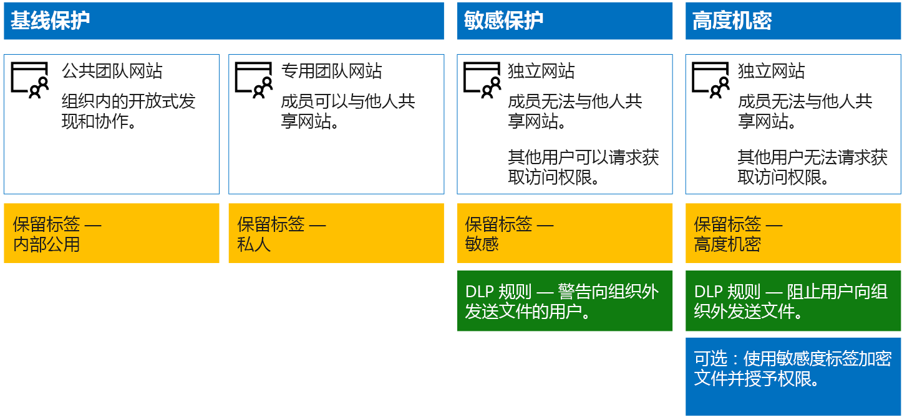

# 保护 SharePoint Online 网站和文件

 **摘要：** 用于保护 SharePoint Online 和 Office 365 中的文件的配置建议。
  
本文就如何配置 SharePoint Online 团队网站并在平衡安全性与易于协作的同时如何进行文件保护方面提供了相关建议。本文定义了四个不同的配置，首先是具有最开放共享策略的组织内的公共网站。每个额外配置均表示一个有意义的保护设置，但对资源的访问和协作被限定为一组相关用户。以这些建议为出发点，并调整配置以满足组织的需要。 
  
本文中的配置符合 Microsoft 针对数据、标识和设备的三层保护的建议：
  
- 基线保护
    
- 敏感保护
    
- 高度机密保护
    
有关这些保护层以及针对每层建议的功能的详细信息，请参阅以下资源。 
  
- [Office 365 的标识和设备保护](https://docs.microsoft.com/office365/enterprise/microsoft-cloud-it-architecture-resources#BKMK_O365IDP)
    
- [Office 365 中的文件保护解决方案](https://docs.microsoft.com/office365/enterprise/microsoft-cloud-it-architecture-resources#BKMK_O365fileprotect)
    
## 功能概述

针对各种 Microsoft 365 功能的 SharePoint Online 团队网站绘制的建议。 下图显示了针对四个 SharePoint Online 团队网站的建议配置。

如图所示：
  
- 基线保护包含针对 SharePoint Online 团队网站的两个选项 - 公共网站和专用网站。 组织中的任何人均可发现和访问公共网站。 只有网站成员可以发现和访问专用网站。 这两个网站配置均允许组外共享。 
    
- 敏感保护和高度机密的保护的网站是专用网站，只有特定组的成员才具有相关访问权限。
    
- [保留标签](labels.md)提供了一种对网站内的文件进行分类的方法。 每个 SharePoint Online 团队网站均被配置为使用网站的默认保留标签自动标记文档库中的文件。 与四个网站配置相对应，此示例中的标签分别为内部公开、专用、敏感和高度机密。 用户可以更改标签，但此配置可确保所有文件均接收默认的标签。
    
- 为敏感和高度机密保留标签配置[数据丢失防护](data-loss-prevention-policies.md) (DLP) 策略，在其试图向组织外部发送这些类型的文件时警告或阻止用户。
    
- 如果方案需要，可以使用[敏感度标签](sensitivity-labels.md)来通过加密和权限来保护高度机密文件。 对于 Azure 信息保护客户，你可以在 Microsoft 365 合规中心内使用 Azure 信息保护标签。如果你选择执行其他配置或高级配置，这些标签便会与 Azure 门户同步。 Azure 信息保护标签和 Office 365 敏感度标签彼此完全相互兼容。 也就是说，例如，如果内容已有 Azure 信息保护标签，无需重新对此内容进行分类或标记。并非所有客户都需要此级别的保护。 
    
## SharePoint Online 和 OneDrive for Business 的租户范围内设置

SharePoint Online 和 OneDrive for Business 包括影响所有网站和用户的租户范围内设置。 其中一些设置也可在网站级别进行调整，使其更具有（而不是更不具有）限制性。 本部分讨论影响安全性和协作的租户范围内设置。 
  
### 共享

对于此解决方案，建议使用以下租户范围内设置：
  
- 保留允许所有与所有帐户类型共享（包括匿名共享）的默认共享策略。
    
- 如果需要，请将匿名链接设置为过期。
    
- 将共享的默认链接类型更改为“内部”。 这有助于防止数据意外泄露到组织外部。
    
虽然允许外部共享可能看起来有悖常理，但相较于通过电子邮件发送文件，此方法可更好地控制文件共享。 SharePoint Online 和 Outlook 彼此协作，提供安全的文件协作。 
  
- 默认情况下，Outlook 共享文件链接，而不是通过电子邮件发送文件。 
    
- SharePoint Online 和 OneDrive for Business 可轻松实现与组织内外部的参与者共享文件链接
    
用户还可进行控制，帮助管理外部共享。 例如，你能够：
  
- 禁用匿名来宾链接。
    
- 撤销用户对网站的访问权限。
    
- 查看谁有权访问特定网站或文档。
    
- 将匿名共享链接设置为过期（租户设置）。
    
- 限制可与之共享的组织外部用户（租户设置）。
    
### 配合使用外部共享与数据丢失预防 (DLP)

如果不允许外部共享，则有业务需求的用户需要寻找备用工具和方法。Microsoft 建议结合使用外部共享和 DLP 策略来保护敏感和高度机密的文件。
  
### 设备访问设置

SharePoint Online 和 OneDrive for Business 的设备访问设置可确定是否已将访问权限限制为仅限浏览器（不能下载文件）或访问被阻止。 有关详细信息，请参阅[控制非托管设备的访问](https://docs.microsoft.com/zh-CN/sharepoint/control-access-from-unmanaged-devices)。 

若要在 Azure Active Directory 中使用具有推荐条件访问策略的设备访问设置，请参阅[用于保护 SharePoint 网站和文件的策略建议](https://docs.microsoft.com/zh-CN/microsoft-365/enterprise/sharepoint-file-access-policies)。
  
### OneDrive for Business

访问这些设置，确定是否要更改 OneDrive for Business 网站的默认设置。目前，共享和设备访问设置与 SharePoint Online 管理中心重复，并适用于这两个环境。
  
## SharePoint 团队网站配置

下表总结了本文前面所述的每个团队网站的配置。使用这些配置作为起点建议并调整网站类型和配置，以满足组织的需求。不是每个组织都需要每种类型的网站。只有少许组织需要高度机密的保护。
  
||||||
|:-----|:-----|:-----|:-----|:-----|
||**基线保护 #1**   |**基线保护 #2**   |**敏感保护**   |**高度机密**   |
|描述    |组织内的开放式发现和协作。    |允许在组外部共享的专用网站和组。    |独立网站，该网站中的访问级别由特定组中的成员身份进行定义。仅允许网站成员进行共享。DLP 在用户试图向组织外发送文件时警告用户。    |启用 Azure 信息保护的独立网站和文件及权限。DLP 阻止用户向组织外发送文件。    |
|专用或公用团队网站    |公用    |Private    |Private    |Private    |
|谁可以访问？    |组织中的任何人，包括 B2B 用户和来宾用户。    |仅限网站成员。其他人可以请求访问。    |仅限网站成员。其他人可以请求访问。    |仅限成员。其他人无法请求访问。    |
|网站级共享控制    |允许与任何人共享。默认设置。    |允许与任何人共享。默认设置。    |成员无法共享对网站的访问权限。    非成员可以请求访问该网站，但需要由网站管理员对这些请求进行寻址。    |成员无法共享对网站的访问权限。    非成员无法请求访问网站或内容。    |
|网站级别的设备访问控制    |无任何额外控制。    |无任何额外控制。    |防止用户将文件下载到不符合或未加入域的设备。使所有其他设备仅限浏览器访问。    |阻止将文件下载到不符合或未加入域的设备。    |
|保留标签    |内部公用    |Private    |敏感    |高度机密    |
|DLP 策略    |||在用户向组织外发送标记为“敏感”的文件时进行警告。    要阻止外部共享敏感数据类型，如信用卡号或其他个人数据，可以针对这些数据类型（包括所配置的自定义数据类型）配置其他 DLP 策略。    |阻止用户向组织外发送标记为“高度机密”的文件。允许用户通过提供他们与之共享的对象等理由来替代此行为。    |
|敏感度标签    ||||使用敏感度标签自动加密和授予文件权限。 敏感度标签使用 Azure 信息保护来加密文件。 此保护将始终伴随文件，以防其泄露。    Office 365 无法读取使用 Azure 信息保护加密的文件。此外，DLP 策略只能与元数据（包括标签）一起使用，但并不能处理这些文件的内容（如文件内的信用卡号）。    |
   
有关如何部署此解决方案中四种不同类型的 SharePoint Online 团队网站的步骤，请参阅[部署具有三层保护的 SharePoint Online 网站](deploy-sharepoint-online-sites-for-three-tiers-of-protection.md)。 
  
## Office 365 保留标签

对于具有敏感数据的环境，建议使用保留标签。 在配置和发布保留标签后：
  
- 可以将默认标签应用于 SharePoint Online 团队网站中的文档库，以便该库中的所有文档都能获取默认标签。 
    
- 只要标签与特定条件匹配，就可以将其自动应用到内容。
    
- 你可以应用基于保留标签的 DLP 策略。
    
- 组织中的用户可手动将标签应用于 Outlook 网页版、Outlook 2010 及更高版本、OneDrive for Business、SharePoint Online 以及 Office 365 组。用户通常都很了解他们处理的内容类型，以便可以对其进行分类并应用相应的 DLP 策略。
    

  
如图所示，此解决方案包括创建以下保留标签：
  
- 高度机密
    
- 敏感
    
- Private
    
- 内部公用
    
这些标签均映射到本文前述插图和图表中建议的网站。本解决方案建议配置 DLP 策略，以帮助防止泄露标记为“敏感”和“高度机密”的文件。
  
有关在此解决方案中配置保留标签和 DLP 策略的步骤，请参阅[使用保留标签和 DLP 保护 SharePoint Online文件](protect-sharepoint-online-files-with-office-365-labels-and-dlp.md)。
  
## 敏感度标签 

如果你的安全方案需要保护，则可以使用敏感度标签应用与文件如影随形的保护。 Microsoft 365 合规中心内的敏感度标签与 Azure 信息保护标签是相同的。 对于此解决方案，建议使用作用域内 Azure 信息保护策略和“高度机密”标签的子标签来加密需要最高级别安全性保护的文件并授予相应权限。 
  
请注意，将 Azure 信息保护加密应用于 Office 365 中存储的文件时，该服务无法处理这些文件的内容。 共同创作、电子数据展示、搜索、Delve 和其他协作功能将无法正常使用。 DLP 策略只适用于元数据（包括保留标签），但并不适用于这些文件的内容（如文件内的信用卡号）。

有关详细信息，请参阅[敏感度标签概述](sensitivity-labels.md)。

    
### 添加外部用户的权限

可通过两种方式授予使用 Azure 信息保护进行保护的文件外部用户访问权限。在这两种情况下，外部用户均须具有 Azure AD 帐户。如果外部用户不是使用 Azure AD 的组织的成员，他们可以通过使用此注册页面以个人身份获得 Azure AD 帐户：[https://aka.ms/aip-signup](https://aka.ms/aip-signup)。
  
- 将外部用户添加到用于配置标签保护的 Azure AD 组
    
     你需要先将该帐户作为 B2B 用户添加到目录中。[通过 Azure 权限管理缓存组成员资格](https://docs.microsoft.com/information-protection/plan-design/prepare#group-membership-caching-by-azure-rights-management)可能需要几个小时的时间。使用此方法，可将权限授予使用标签保护的所有现有文件（甚至在将用户添加到 Azure AD 组之前受保护的文件）。
    
- 将外部用户直接添加到标签保护
    
     你可以添加组织（例如 Fabrikam.com）、Azure AD 组（如组织内的财务组）中的所有用户或单个用户。例如，可以将监管机构的外部团队添加到标签保护中。使用此方法，可仅向在外部实体添加到保护后使用标签进行保护的文件授予权限。
    
### 部署并使用 Azure 信息保护

有关配置此解决方案中的 Azure 信息保护的步骤，请参阅[使用 Azure 信息保护来保护 SharePoint Online 文件](protect-sharepoint-online-files-with-azure-information-protection.md)。
  
## 另请参阅

[Microsoft 针对政治宣传活动、非营利组织和其他敏捷性组织的安全指南](microsoft-security-guidance-for-political-campaigns-nonprofits-and-other-agile-o.md)
  
[云应用和混合解决方案](https://docs.microsoft.com/office365/enterprise/cloud-adoption-and-hybrid-solutions)
  
