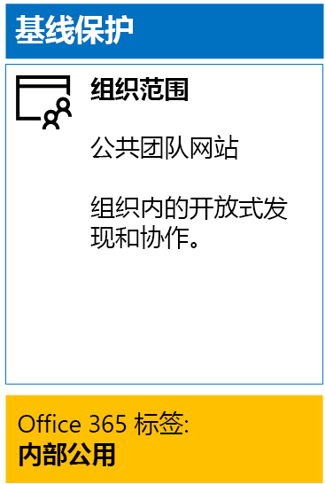
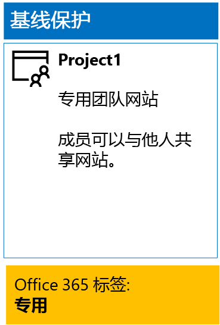
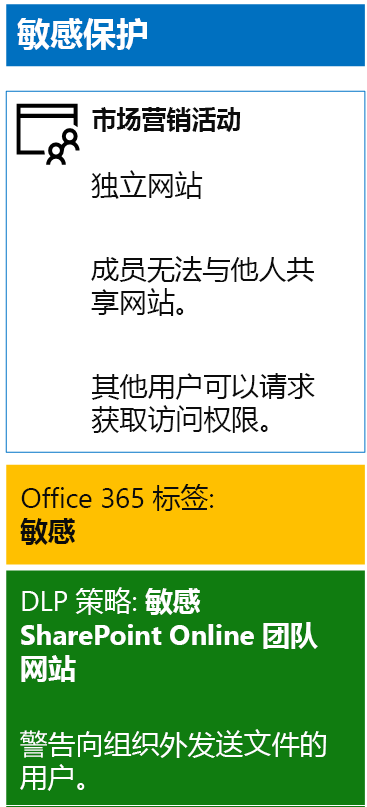
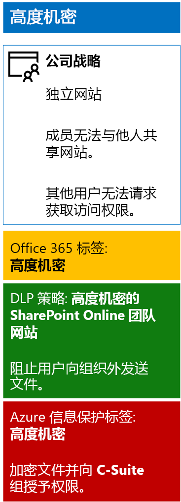

# <a name="secure-sharepoint-online-sites-in-a-devtest-environment"></a><span data-ttu-id="21c41-103">在开发/测试环境中保护 SharePoint Online 网站</span><span class="sxs-lookup"><span data-stu-id="21c41-103">Secure SharePoint Online sites in a dev/test environment</span></span>

 <span data-ttu-id="21c41-104">**摘要：** 在开发/测试环境中创建公共、专用、敏感和高度机密的 SharePoint Online 团队网站。</span><span class="sxs-lookup"><span data-stu-id="21c41-104">**Summary:** Create public, private, sensitive, and highly confidential SharePoint Online team sites in a dev/test environment.</span></span>
  
<span data-ttu-id="21c41-105">本文提供了有关如何创建开发/测试环境的分步说明，该环境中包括用于[保护 SharePoint Online 网站和文件](secure-sharepoint-online-sites-and-files.md)解决方案的四种不同类型的 SharePoint Online 团队网站。</span><span class="sxs-lookup"><span data-stu-id="21c41-105">This article provides step-by-step instructions to create a dev/test environment that includes the four different types of SharePoint Online team sites for the [Secure SharePoint Online sites and files](secure-sharepoint-online-sites-and-files.md) solution.</span></span>
  

  
<span data-ttu-id="21c41-107">使用此开发/测试环境来试验信息保护行为，并根据具体要求微调设置，然后在生产中部署 SharePoint Online 团队网站。</span><span class="sxs-lookup"><span data-stu-id="21c41-107">Use this dev/test environment to experiment with the information protection behaviors and fine-tune settings for your specific needs before deploying SharePoint Online team sites in production.</span></span>
  
## <a name="phase-1-create-your-devtest-environment"></a><span data-ttu-id="21c41-108">阶段 1：创建开发/测试环境</span><span class="sxs-lookup"><span data-stu-id="21c41-108">Phase 1: Create your dev/test environment</span></span>

<span data-ttu-id="21c41-109">在此阶段，将获取用于虚拟组织的 Office 365 和企业移动性 + 安全性的试用订阅。</span><span class="sxs-lookup"><span data-stu-id="21c41-109">In this phase, you obtain trial subscriptions for Office 365 and Enterprise Mobility + Security for a fictional organization.</span></span>
  
<span data-ttu-id="21c41-110">首先，按照 [Office 365 开发/测试环境](https://docs.microsoft.com/office365/enterprise/office-365-dev-test-environment)的**阶段 2** 中的说明进行操作。</span><span class="sxs-lookup"><span data-stu-id="21c41-110">First, follow the instructions in **Phase 2** of the [Office 365 dev/test environment](https://docs.microsoft.com/office365/enterprise/office-365-dev-test-environment).</span></span>
  
<span data-ttu-id="21c41-111">下一步，注册 EMS 试用订阅，并将其作为 Office 365 试用订阅添加到同一组织。</span><span class="sxs-lookup"><span data-stu-id="21c41-111">Next, sign up for the EMS trial subscription and add it to the same organization as your Office 365 trial subscription.</span></span>
  
1. <span data-ttu-id="21c41-p101">如有需要，请使用试用订阅的全局管理员帐户的凭据登录 Office 365 门户。如需帮助，请参阅[如何登录 Office 365](https://support.office.com/Article/Where-to-sign-in-to-Office-365-e9eb7d51-5430-4929-91ab-6157c5a050b4)。</span><span class="sxs-lookup"><span data-stu-id="21c41-p101">If needed, sign in to the Office 365 portal with the credentials of the global administrator account of your trial subscription. For help, see [Where to sign in to Office 365](https://support.office.com/Article/Where-to-sign-in-to-Office-365-e9eb7d51-5430-4929-91ab-6157c5a050b4).</span></span>
    
2. <span data-ttu-id="21c41-114">单击“管理员”磁贴\*\*\*\*。</span><span class="sxs-lookup"><span data-stu-id="21c41-114">Click the **Admin** tile.</span></span>
    
3. <span data-ttu-id="21c41-115">在浏览器的“Office 管理中心”标签页的左侧导航中，单击“帐单”>“购买服务”\*\*\*\*\*\*\*\*。</span><span class="sxs-lookup"><span data-stu-id="21c41-115">On the **Office Admin center** tab in your browser, in the left navigation, click **Billing > Purchase services**.</span></span>
    
4. <span data-ttu-id="21c41-p102">在“购买服务”页上，找到“企业移动性 + 安全性 E5”项。将鼠标指针悬停在此项之上，然后单击“开始免费试用”\*\*\*\*\*\*\*\*\*\*\*\*。</span><span class="sxs-lookup"><span data-stu-id="21c41-p102">On the **Purchase services** page, find the **Enterprise Mobility + Security E5** item. Hover your mouse pointer over it and click **Start free trial**.</span></span>
    
5. <span data-ttu-id="21c41-118">在“确认订单”页上，单击“立即试用”\*\*\*\*\*\*\*\*。</span><span class="sxs-lookup"><span data-stu-id="21c41-118">On the **Confirm your order** page, click **Try now**.</span></span>
    
6. <span data-ttu-id="21c41-119">在“订单签收”页中，单击“继续”\*\*\*\*\*\*\*\*。</span><span class="sxs-lookup"><span data-stu-id="21c41-119">On the **Order receipt** page, click **Continue**.</span></span>
    
<span data-ttu-id="21c41-120">接下来，为全局管理员帐户启用企业移动性 + 安全性 E5 许可证。</span><span class="sxs-lookup"><span data-stu-id="21c41-120">Next, enable the Enterprise Mobility + Security E5 license for your global administrator account.</span></span>
  
1. <span data-ttu-id="21c41-121">在浏览器的“**Office 365 管理中心**”选项卡的左侧导航中，单击“**用户”>“活动用户**”。</span><span class="sxs-lookup"><span data-stu-id="21c41-121">On the **Office 365 Admin center** tab in your browser, in the left navigation, click **Users > Active users**.</span></span>
    
2. <span data-ttu-id="21c41-122">单击全局管理员帐户，然后针对“产品许可证”单击“编辑”\*\*\*\*\*\*\*\*。</span><span class="sxs-lookup"><span data-stu-id="21c41-122">Click your global administrator account, and then click **Edit** for **Product licenses**.</span></span>
    
3. <span data-ttu-id="21c41-123">在“**产品许可证**”窗格，将**企业移动 +安全 E5** 的产品许可证设置为“**打开**”，单击“**保存**”，然后单击“**关闭**”两次。</span><span class="sxs-lookup"><span data-stu-id="21c41-123">On the **Product licenses** pane, turn the product license for **Enterprise Mobility + Security E5** to **On**, click **Save,** and then click **Close** twice.</span></span>
    
## <a name="phase-2-create-and-configure-your-azure-active-directory-ad-groups-and-users"></a><span data-ttu-id="21c41-124">阶段 2：创建和配置 Azure Active Directory (AD) 组和用户</span><span class="sxs-lookup"><span data-stu-id="21c41-124">Phase 2: Create and configure your Azure Active Directory (AD) groups and users</span></span>

<span data-ttu-id="21c41-125">此阶段为虚构组织创建和配置 Azure AD 组和用户。</span><span class="sxs-lookup"><span data-stu-id="21c41-125">In this phase, you create and configure the Azure AD groups and users for your fictional organization.</span></span>
  
<span data-ttu-id="21c41-126">首先，通过 Azure 门户为典型组织创建一系列组。</span><span class="sxs-lookup"><span data-stu-id="21c41-126">First, create a set of groups for a typical organization with the Azure portal.</span></span>
  
1. <span data-ttu-id="21c41-p103">在浏览器中创建单独的标签页，然后转到 Azure 门户 ([https://portal.azure.com](https://portal.azure.com))。如有需要，请使用 Office 365 E5 试用订阅的全局管理员帐户凭据登录。</span><span class="sxs-lookup"><span data-stu-id="21c41-p103">Create a separate tab in your browser, and then go to the Azure portal at [https://portal.azure.com](https://portal.azure.com). If needed, sign in with the credentials of the global administrator account for your Office 365 E5 trial subscription.</span></span>
    
2. <span data-ttu-id="21c41-129">在 Azure 门户中，单击“**Azure Active Directory”>“组**”。</span><span class="sxs-lookup"><span data-stu-id="21c41-129">In the Azure portal, click **Azure Active Directory > Groups**.</span></span>
    
3. <span data-ttu-id="21c41-130">在“**组 - 所有组**”边栏选项卡上，单击“**+ 新建组**”。</span><span class="sxs-lookup"><span data-stu-id="21c41-130">On the **Groups - All groups** blade, click **+ New group**.</span></span>
    
4. <span data-ttu-id="21c41-131">在“**组**”边栏选项卡上：</span><span class="sxs-lookup"><span data-stu-id="21c41-131">On the **Group** blade:</span></span>
    
  - <span data-ttu-id="21c41-132">在“**组类型**”中，选择“**Office 365**”。</span><span class="sxs-lookup"><span data-stu-id="21c41-132">Select **Office 365** in **Group type**.</span></span>
    
  - <span data-ttu-id="21c41-133">在“**名称**”中键入**高层管理人员**。</span><span class="sxs-lookup"><span data-stu-id="21c41-133">Type **C-Suite** in **Name**.</span></span>
    
  - <span data-ttu-id="21c41-134">在“**成员身份**”类型中，选择“**已分配**”。</span><span class="sxs-lookup"><span data-stu-id="21c41-134">Select **Assigned** in **Membership type**.</span></span>
      
5. <span data-ttu-id="21c41-135">单击“**创建**”，然后关闭“**组**”边栏选项卡。</span><span class="sxs-lookup"><span data-stu-id="21c41-135">Click **Create**, and then close the **Group** blade.</span></span>
    
6. <span data-ttu-id="21c41-136">对以下组名称重复步骤 3-5：</span><span class="sxs-lookup"><span data-stu-id="21c41-136">Repeat steps 3-5 for the following group names:</span></span>
    
  - <span data-ttu-id="21c41-137">IT 人员</span><span class="sxs-lookup"><span data-stu-id="21c41-137">IT staff</span></span>
    
  - <span data-ttu-id="21c41-138">研究人员</span><span class="sxs-lookup"><span data-stu-id="21c41-138">Research staff</span></span>
    
  - <span data-ttu-id="21c41-139">正式员工</span><span class="sxs-lookup"><span data-stu-id="21c41-139">Regular staff</span></span>
    
  - <span data-ttu-id="21c41-140">市场营销人员</span><span class="sxs-lookup"><span data-stu-id="21c41-140">Marketing staff</span></span>
    
  - <span data-ttu-id="21c41-141">销售人员</span><span class="sxs-lookup"><span data-stu-id="21c41-141">Sales staff</span></span>
    
7. <span data-ttu-id="21c41-142">使浏览器中的 Azure 门户选项卡保持打开状态。</span><span class="sxs-lookup"><span data-stu-id="21c41-142">Keep the Azure portal tab in your browser open.</span></span>
    
<span data-ttu-id="21c41-143">然后配置自动授权，以便组的成员可自动分配 Office 365 和 EMS 订阅的许可证。</span><span class="sxs-lookup"><span data-stu-id="21c41-143">Next, you configure automatic licensing so that members of your groups are automatically assigned licenses for your Office 365 and EMS subscriptions.</span></span>
  
1. <span data-ttu-id="21c41-144">在 Azure 门户中，单击“**Azure Active Directory”>“许可证”>“所有产品**”。</span><span class="sxs-lookup"><span data-stu-id="21c41-144">In the Azure portal, click **Azure Active Directory > Licenses > All products**.</span></span>
    
2. <span data-ttu-id="21c41-145">在列表中，选择“**企业移动性 + 安全性 E5**”和“**Office 365 企业版 E5**”，然后单击“**分配**”。</span><span class="sxs-lookup"><span data-stu-id="21c41-145">In the list, select **Enterprise Mobility + Security E5** and **Office 365 Enterprise E5**, and then click **Assign**.</span></span>
    
3. <span data-ttu-id="21c41-146">在“**分配许可证**”边栏选项卡中，单击“**用户和组**”。</span><span class="sxs-lookup"><span data-stu-id="21c41-146">In the **Assign license** blade, click **Users and groups**.</span></span>
    
4. <span data-ttu-id="21c41-147">在组列表中，选择以下各项：</span><span class="sxs-lookup"><span data-stu-id="21c41-147">In the list of groups, select the following:</span></span>
    
  - <span data-ttu-id="21c41-148">高层管理人员</span><span class="sxs-lookup"><span data-stu-id="21c41-148">C-Suite</span></span>
    
  - <span data-ttu-id="21c41-149">IT 人员</span><span class="sxs-lookup"><span data-stu-id="21c41-149">IT staff</span></span>
    
  - <span data-ttu-id="21c41-150">研究人员</span><span class="sxs-lookup"><span data-stu-id="21c41-150">Research staff</span></span>
    
  - <span data-ttu-id="21c41-151">正式员工</span><span class="sxs-lookup"><span data-stu-id="21c41-151">Regular staff</span></span>
    
  - <span data-ttu-id="21c41-152">市场营销人员</span><span class="sxs-lookup"><span data-stu-id="21c41-152">Marketing staff</span></span>
    
  - <span data-ttu-id="21c41-153">销售人员</span><span class="sxs-lookup"><span data-stu-id="21c41-153">Sales staff</span></span>
    
5. <span data-ttu-id="21c41-154">单击“**选择**”，然后单击“**分配**”。</span><span class="sxs-lookup"><span data-stu-id="21c41-154">Click **Select**, and then click **Assign**.</span></span>
    
6. <span data-ttu-id="21c41-155">关闭浏览器中的 Azure 门户选项卡。</span><span class="sxs-lookup"><span data-stu-id="21c41-155">Close the Azure portal tab in your browser.</span></span>
    
<span data-ttu-id="21c41-156">接下来，[连接到 Azure Active Directory V2 PowerShell 模块](https://go.microsoft.com/fwlink/?linkid=842218)。</span><span class="sxs-lookup"><span data-stu-id="21c41-156">Next, you [Connect with the Azure Active Directory V2 PowerShell module](https://go.microsoft.com/fwlink/?linkid=842218).</span></span>
  
<span data-ttu-id="21c41-157">填写组织名称、位置和公用密码并从 PowerShell 命令提示符或集成脚本环境 (ISE) 中运行以下命令，创建用户帐户并将其添加到相应的组：</span><span class="sxs-lookup"><span data-stu-id="21c41-157">Fill in your organization name, your location, and a common password, and then run these commands from the PowerShell command prompt or Integrated Script Environment (ISE) to create user accounts and add them to their groups:</span></span>
  
```
$orgName="<organization name, such as contoso for the contoso.onmicrosoft.com trial subscription domain name>"
$location="<the ISO ALPHA2 country code, such as US for the United States>"
$commonPassword="<common password for all the new accounts>"

$PasswordProfile=New-Object -TypeName Microsoft.Open.AzureAD.Model.PasswordProfile
$PasswordProfile.Password=$commonPassword

$groupName="C-Suite"
$userNames=@("CEO","CFO","CIO") 
$groupID=(Get-AzureADGroup | Where { $_.DisplayName -eq $groupName }).ObjectID
ForEach ($element in $userNames){ 
New-AzureADUser -DisplayName $element -PasswordProfile $PasswordProfile -UserPrincipalName ($element + "@" + $orgName + ".onmicrosoft.com") -AccountEnabled $true -MailNickName $element -UsageLocation $location 
Add-AzureADGroupMember -RefObjectId (Get-AzureADUser | Where { $_.DisplayName -eq $element }).ObjectID -ObjectId $groupID
}
$groupName="IT staff"
$userNames=@("ITAdmin1","ITAdmin2") 
$groupID=(Get-AzureADGroup | Where { $_.DisplayName -eq $groupName }).ObjectID
ForEach ($element in $userNames){ 
New-AzureADUser -DisplayName $element -PasswordProfile $PasswordProfile -UserPrincipalName ($element + "@" + $orgName + ".onmicrosoft.com") -AccountEnabled $true -MailNickName $element -UsageLocation $location 
Add-AzureADGroupMember -RefObjectId (Get-AzureADUser | Where { $_.DisplayName -eq $element }).ObjectID -ObjectId $groupID
}
$groupName="Research staff"
$userNames=@("Researcher1") 
$groupID=(Get-AzureADGroup | Where { $_.DisplayName -eq $groupName }).ObjectID
ForEach ($element in $userNames){ 
New-AzureADUser -DisplayName $element -PasswordProfile $PasswordProfile -UserPrincipalName ($element + "@" + $orgName + ".onmicrosoft.com") -AccountEnabled $true -MailNickName $element -UsageLocation $location 
Add-AzureADGroupMember -RefObjectId (Get-AzureADUser | Where { $_.DisplayName -eq $element }).ObjectID -ObjectId $groupID
}
$groupName="Regular staff"
$userNames=@("Regular1", "Regular2") 
$groupID=(Get-AzureADGroup | Where { $_.DisplayName -eq $groupName }).ObjectID
ForEach ($element in $userNames){ 
New-AzureADUser -DisplayName $element -PasswordProfile $PasswordProfile -UserPrincipalName ($element + "@" + $orgName + ".onmicrosoft.com") -AccountEnabled $true -MailNickName $element -UsageLocation $location 
Add-AzureADGroupMember -RefObjectId (Get-AzureADUser | Where { $_.DisplayName -eq $element }).ObjectID -ObjectId $groupID
}
$groupName="Marketing staff"
$userNames=@("Marketing1", "Marketing2") 
$groupID=(Get-AzureADGroup | Where { $_.DisplayName -eq $groupName }).ObjectID
ForEach ($element in $userNames){ 
New-AzureADUser -DisplayName $element -PasswordProfile $PasswordProfile -UserPrincipalName ($element + "@" + $orgName + ".onmicrosoft.com") -AccountEnabled $true -MailNickName $element -UsageLocation $location 
Add-AzureADGroupMember -RefObjectId (Get-AzureADUser | Where { $_.DisplayName -eq $element }).ObjectID -ObjectId $groupID
}
$groupName="Sales staff"
$userNames=@("SalesPerson1") 
$groupID=(Get-AzureADGroup | Where { $_.DisplayName -eq $groupName }).ObjectID
ForEach ($element in $userNames){ 
New-AzureADUser -DisplayName $element -PasswordProfile $PasswordProfile -UserPrincipalName ($element + "@" + $orgName + ".onmicrosoft.com") -AccountEnabled $true -MailNickName $element -UsageLocation $location 
Add-AzureADGroupMember -RefObjectId (Get-AzureADUser | Where { $_.DisplayName -eq $element }).ObjectID -ObjectId $groupID
}
```

> [!NOTE]
> <span data-ttu-id="21c41-p104">此处使用公用密码旨在自动配置开发/测试环境，简化配置过程。 但不建议生产订阅这样做。</span><span class="sxs-lookup"><span data-stu-id="21c41-p104">The use of a common password here is for automation and ease of configuration for a dev/test environment. This is not recommended for production subscriptions.</span></span> 
  
<span data-ttu-id="21c41-160">请按照以下步骤验证基于组的许可是否正常工作。</span><span class="sxs-lookup"><span data-stu-id="21c41-160">Use these steps to verify that group-based licensing is working correctly.</span></span>
  
1. <span data-ttu-id="21c41-161">在浏览器的“**Microsoft Office 主页**”标签页中，单击“**管理**”磁贴。</span><span class="sxs-lookup"><span data-stu-id="21c41-161">From the **Microsoft Office Home** tab of your browser, click the **Admin** tile.</span></span>
    
2. <span data-ttu-id="21c41-162">在浏览器的新“Office 管理中心”标签页中，单击“用户”\*\*\*\*\*\*\*\*。</span><span class="sxs-lookup"><span data-stu-id="21c41-162">From the new **Office Admin center** tab of your browser, click **Users**.</span></span>
    
3. <span data-ttu-id="21c41-163">在用户列表中，单击“CEO”\*\*\*\*。</span><span class="sxs-lookup"><span data-stu-id="21c41-163">In the list of users, click **CEO**.</span></span>
    
4. <span data-ttu-id="21c41-164">在列出 CEO 用户帐户属性的窗格中，验证已向其分配“企业移动性 + 安全性 E5”和“Office 365 企业版 E5”许可证（位于“产品许可证”中）\*\*\*\*\*\*\*\*\*\*\*\*\*\*\*\*。 </span><span class="sxs-lookup"><span data-stu-id="21c41-164">In the pane that lists the properties of the **CEO** user account, verify that it has been assigned the **Enterprise Mobility + Security E5** and **Office 365 Enterprise E5** licenses (in **Product licenses**).</span></span>
    
## <a name="phase-3-create-office-365-labels"></a><span data-ttu-id="21c41-165">阶段 3：创建 Office 365 标签</span><span class="sxs-lookup"><span data-stu-id="21c41-165">Phase 3: Create Office 365 labels</span></span>

<span data-ttu-id="21c41-166">此阶段将针对 SharePoint Online 团队网站文档文件夹的不同安全级别创建标签。</span><span class="sxs-lookup"><span data-stu-id="21c41-166">In this phase, you create the labels for the different levels of security for SharePoint Online team site documents folders.</span></span>
  
1. <span data-ttu-id="21c41-p105">如有必要，使用 Internet 浏览器的私有实例并使用 Office 365 E5 试用订阅的全局管理员帐户登录 Office 365 门户。如需帮助，请参阅[如何登录 Office 365](https://support.office.com/Article/Where-to-sign-in-to-Office-365-e9eb7d51-5430-4929-91ab-6157c5a050b4)。</span><span class="sxs-lookup"><span data-stu-id="21c41-p105">If needed, use a private instance of your Internet browser and sign in to the Office 365 portal with the global administrator account of your Office 365 E5 trial subscription. For help, see [Where to sign in to Office 365](https://support.office.com/Article/Where-to-sign-in-to-Office-365-e9eb7d51-5430-4929-91ab-6157c5a050b4).</span></span>
    
2. <span data-ttu-id="21c41-169">在“**Microsoft Office 主页**”标签页中，单击“**管理**”磁贴。</span><span class="sxs-lookup"><span data-stu-id="21c41-169">From the **Microsoft Office Home** tab, click the **Admin** tile.</span></span>
    
3. <span data-ttu-id="21c41-170">在浏览器的新“Office 管理中心”\*\*\*\* 标签页中，单击“管理中心”>“安全&amp;合规性”\*\*\*\*。</span><span class="sxs-lookup"><span data-stu-id="21c41-170">From the new **Office Admin center** tab of your browser, click **Admin centers > Security &amp; Compliance**.</span></span>
    
4. <span data-ttu-id="21c41-171">在浏览器的新“主页 -安全&amp;合规性”\*\*\*\* 标签页中，单击“分类”>“标签”\*\*\*\*。</span><span class="sxs-lookup"><span data-stu-id="21c41-171">From the new **Home - Security &amp; Compliance** tab of your browser, click **Classifications > Labels**.</span></span>
    
5. <span data-ttu-id="21c41-172">在“**开始”>“标签**”窗格中，单击“**创建标签**”。</span><span class="sxs-lookup"><span data-stu-id="21c41-172">From the **Home > Labels** pane, click **Create a label**.</span></span>
    
6. <span data-ttu-id="21c41-173">在“**命名标签**”窗格中，键入“**内部公用**”，然后单击“**下一步**”。</span><span class="sxs-lookup"><span data-stu-id="21c41-173">On the **Name your label** pane, type **Internal Public**, and then click **Next**.</span></span>
    
7. <span data-ttu-id="21c41-174">在“**标签设置**”窗格中，单击“**下一步**”。</span><span class="sxs-lookup"><span data-stu-id="21c41-174">On the **Label settings** pane, click **Next**.</span></span>
    
8. <span data-ttu-id="21c41-175">在“查看设置”\*\*\*\* 窗格中，单击“创建此标签”\*\*\*\*，然后单击“关闭”\*\*\*\*。</span><span class="sxs-lookup"><span data-stu-id="21c41-175">On the **Review your settings** pane, click **Create this label**, and then click **Close**.</span></span>
    
9. <span data-ttu-id="21c41-176">对以下标签重复步骤 5-8：</span><span class="sxs-lookup"><span data-stu-id="21c41-176">Repeat steps 5-8 for these additional labels:</span></span>
    
  - <span data-ttu-id="21c41-177">Private</span><span class="sxs-lookup"><span data-stu-id="21c41-177">Private</span></span>
    
  - <span data-ttu-id="21c41-178">敏感</span><span class="sxs-lookup"><span data-stu-id="21c41-178">Sensitive</span></span>
    
  - <span data-ttu-id="21c41-179">高度机密</span><span class="sxs-lookup"><span data-stu-id="21c41-179">Highly Confidential</span></span>
    
10. <span data-ttu-id="21c41-180">在“开始”>“标签”窗格中，单击“发布标签”\*\*\*\*\*\*\*\*。</span><span class="sxs-lookup"><span data-stu-id="21c41-180">From the **Home > Labels** pane, click **Publish labels**.</span></span>
    
11. <span data-ttu-id="21c41-181">在“选择要发布的标签”窗格中，单击“选择要发布的标签”\*\*\*\*\*\*\*\*。</span><span class="sxs-lookup"><span data-stu-id="21c41-181">On the **Choose labels to publish** pane, click **Choose labels to publish**.</span></span>
    
12. <span data-ttu-id="21c41-182">在“选择标签”窗格中，单击“添加”并选择全部四个标签\*\*\*\*\*\*\*\*。</span><span class="sxs-lookup"><span data-stu-id="21c41-182">On the **Choose labels** pane, click **Add** and select all four labels.</span></span>
    
13. <span data-ttu-id="21c41-183">单击“完成”\*\*\*\*。</span><span class="sxs-lookup"><span data-stu-id="21c41-183">Click **Done**.</span></span>
    
14. <span data-ttu-id="21c41-184">在“选择要发布的标签”窗格中，单击“下一步”\*\*\*\*\*\*\*\*。</span><span class="sxs-lookup"><span data-stu-id="21c41-184">On the **Choose labels to publish** pane, click **Next**.</span></span>
    
15. <span data-ttu-id="21c41-185">在“**选择位置**”窗格中，单击“**下一步**”。</span><span class="sxs-lookup"><span data-stu-id="21c41-185">On the **Choose locations** pane, click **Next**.</span></span>
    
16. <span data-ttu-id="21c41-186">在“**命名策略**”窗格中，在“**名称**”中键入“**示例组织**”，然后单击“**下一步**”。</span><span class="sxs-lookup"><span data-stu-id="21c41-186">On the **Name your policy** pane, type **Example organization** in **Name**, and then click **Next**.</span></span>
    
17. <span data-ttu-id="21c41-187">在“**查看设置**”窗格中，单击“**发布标签**”，然后单击“**关闭**”。</span><span class="sxs-lookup"><span data-stu-id="21c41-187">On the **Review your settings** pane, click **Publish labels**, and then click **Close**.</span></span>
    
## <a name="phase-4-create-your-sharepoint-online-team-sites"></a><span data-ttu-id="21c41-188">阶段 4：创建 SharePoint Online 团队网站</span><span class="sxs-lookup"><span data-stu-id="21c41-188">Phase 4: Create your SharePoint Online team sites</span></span>

<span data-ttu-id="21c41-189">在此阶段中，将为示例组织创建和配置四种类型的 SharePoint Online 团队网站。</span><span class="sxs-lookup"><span data-stu-id="21c41-189">In this phase, you create and configure the four types of SharePoint Online team sites for your example organization.</span></span>
  
### <a name="organization-wide-team-site"></a><span data-ttu-id="21c41-190">组织范围团队网站</span><span class="sxs-lookup"><span data-stu-id="21c41-190">Organization wide team site</span></span>

<span data-ttu-id="21c41-191">要创建基线公共 SharePoint Online 团队网站，请执行以下操作：</span><span class="sxs-lookup"><span data-stu-id="21c41-191">To create a baseline public SharePoint Online team site, do the following:</span></span>
  
1. <span data-ttu-id="21c41-p106">如果需要，请使用本地计算机上的浏览器，并使用全局管理员帐户登录 Office 365 门户。 如需帮助，请参阅[如何登录到 Office 365](https://support.office.com/Article/Where-to-sign-in-to-Office-365-e9eb7d51-5430-4929-91ab-6157c5a050b4)。</span><span class="sxs-lookup"><span data-stu-id="21c41-p106">If needed, use a browser on your local computer and sign in to the Office 365 portal using your global administrator account. For help, see [Where to sign in to Office 365](https://support.office.com/Article/Where-to-sign-in-to-Office-365-e9eb7d51-5430-4929-91ab-6157c5a050b4).</span></span>
    
2. <span data-ttu-id="21c41-194">在磁贴列表中，单击“SharePoint”\*\*\*\*。</span><span class="sxs-lookup"><span data-stu-id="21c41-194">In the list of tiles, click **SharePoint**.</span></span>
    
3. <span data-ttu-id="21c41-195">在浏览器的新“SharePoint”标签页中，单击“+ 创建网站”\*\*\*\*\*\*\*\*。</span><span class="sxs-lookup"><span data-stu-id="21c41-195">On the new **SharePoint** tab in your browser, click **+ Create site**.</span></span>
    
4. <span data-ttu-id="21c41-196">在“创建网站”页中，单击“团队网站”\*\*\*\*\*\*\*\*。</span><span class="sxs-lookup"><span data-stu-id="21c41-196">On the **Create a site** page, click **Team site**.</span></span>
    
5. <span data-ttu-id="21c41-197">在“网站名称”中，键入“组织范围”\*\*\*\*\*\*\*\*。</span><span class="sxs-lookup"><span data-stu-id="21c41-197">In **Site name**, type **Organization wide**.</span></span> 
    
6. <span data-ttu-id="21c41-198">在“**团队网站描述**”中，键入“**用于整个组织的 SharePoint 网站**”。</span><span class="sxs-lookup"><span data-stu-id="21c41-198">In **Team site description**, type **SharePoint site for the entire organization**.</span></span>
    
7. <span data-ttu-id="21c41-199">在“**隐私设置**”中，选择“**公用 - 组织中的任何人均可访问此网站**”，然后单击“**下一步**”。</span><span class="sxs-lookup"><span data-stu-id="21c41-199">In **Privacy settings**, select **Public - anyone in the organization can access this site**, and then click **Next**.</span></span>
    
8. <span data-ttu-id="21c41-200">在“**希望添加哪些人员?**”窗格中，单击“**完成**”。</span><span class="sxs-lookup"><span data-stu-id="21c41-200">On the **Who do you want to add?** pane, click **Finish**.</span></span>
    
<span data-ttu-id="21c41-201">接下来，针对内部公共标签配置组织范围团队网站的文档文件夹。</span><span class="sxs-lookup"><span data-stu-id="21c41-201">Next, configure the documents folder of the Organization wide team site for the Internal Public label.</span></span>
  
1. <span data-ttu-id="21c41-202">在浏览器的“**组织范围 - 主页**”标签页中，单击“**文档**”。</span><span class="sxs-lookup"><span data-stu-id="21c41-202">In the **Organization wide-Home** tab of your browser, click **Documents**.</span></span>
    
2. <span data-ttu-id="21c41-203">单击设置图标，然后单击“**库设置**”。</span><span class="sxs-lookup"><span data-stu-id="21c41-203">Click the settings icon, and then click **Library settings**.</span></span>
    
3. <span data-ttu-id="21c41-204">在“**权限和管理**”下，单击“**向此库中的项应用标签**”。</span><span class="sxs-lookup"><span data-stu-id="21c41-204">Under **Permissions and Management**, click **Apply label to items in this library**.</span></span>
    
4. <span data-ttu-id="21c41-205">在“**设置 - 应用标签**”中，选择“**内部公用**”，然后单击“**保存**”。</span><span class="sxs-lookup"><span data-stu-id="21c41-205">In **Settings-Apply Label**, select **Internal Public**, and then click **Save**.</span></span>
    
<span data-ttu-id="21c41-206">下面是生成的配置。</span><span class="sxs-lookup"><span data-stu-id="21c41-206">Here is your resulting configuration.</span></span>
  

  
### <a name="project-1-team-site"></a><span data-ttu-id="21c41-208">项目 1 团队网站</span><span class="sxs-lookup"><span data-stu-id="21c41-208">Project 1 team site</span></span>

<span data-ttu-id="21c41-209">要为组织内的项目创建基线专用 SharePoint Online 团队网站，请执行以下操作：</span><span class="sxs-lookup"><span data-stu-id="21c41-209">To create a baseline private SharePoint Online team site for a project within the organization, do the following:</span></span>
  
1. <span data-ttu-id="21c41-p107">如果需要，请使用本地计算机上的浏览器，并使用全局管理员帐户登录 Office 365 门户。 如需帮助，请参阅[如何登录到 Office 365](https://support.office.com/Article/Where-to-sign-in-to-Office-365-e9eb7d51-5430-4929-91ab-6157c5a050b4)。</span><span class="sxs-lookup"><span data-stu-id="21c41-p107">If needed, use a browser on your local computer and sign in to the Office 365 portal using your global administrator account. For help, see [Where to sign in to Office 365](https://support.office.com/Article/Where-to-sign-in-to-Office-365-e9eb7d51-5430-4929-91ab-6157c5a050b4).</span></span>
    
2. <span data-ttu-id="21c41-212">在磁贴列表中，单击“SharePoint”\*\*\*\*。</span><span class="sxs-lookup"><span data-stu-id="21c41-212">In the list of tiles, click **SharePoint**.</span></span>
    
3. <span data-ttu-id="21c41-213">在浏览器的新“SharePoint”标签页中，单击“+ 创建网站”\*\*\*\*\*\*\*\*。</span><span class="sxs-lookup"><span data-stu-id="21c41-213">On the new **SharePoint** tab in your browser, click **+ Create site**.</span></span>
    
4. <span data-ttu-id="21c41-214">在“创建网站”页中，单击“团队网站”\*\*\*\*\*\*\*\*。</span><span class="sxs-lookup"><span data-stu-id="21c41-214">On the **Create a site** page, click **Team site**.</span></span>
    
5. <span data-ttu-id="21c41-215">在“**网站名称**”中，键入“**项目 1**”。</span><span class="sxs-lookup"><span data-stu-id="21c41-215">In **Site name**, type **Project 1**.</span></span> 
    
6. <span data-ttu-id="21c41-216">在“**团队网站描述**”中，键入“**用于项目 1 的 SharePoint 网站**”。</span><span class="sxs-lookup"><span data-stu-id="21c41-216">In **Team site description,** type **SharePoint site for Project 1**.</span></span>
    
7. <span data-ttu-id="21c41-217">在“**隐私设置**”中，选择“**专用 - 仅成员可以访问此网站**”，然后单击“**下一步**”。</span><span class="sxs-lookup"><span data-stu-id="21c41-217">In **Privacy settings**, select **Private - only members can access this site**, and then click **Next**.</span></span>
    
8. <span data-ttu-id="21c41-218">在“**希望添加哪些人员?**”窗格中，单击“**完成**”。</span><span class="sxs-lookup"><span data-stu-id="21c41-218">On the **Who do you want to add?** pane, click **Finish**.</span></span>
    
<span data-ttu-id="21c41-219">接下来，针对专用标签配置项目 1 团队网站的文档文件夹。</span><span class="sxs-lookup"><span data-stu-id="21c41-219">Next, configure the documents folder of the Project 1 team site for the Private label.</span></span>
  
1. <span data-ttu-id="21c41-220">在浏览器的“**项目 1 - 主页**”标签页中，单击“**文档**”。</span><span class="sxs-lookup"><span data-stu-id="21c41-220">In the **Project 1-Home** tab of your browser, click **Documents**.</span></span>
    
2. <span data-ttu-id="21c41-221">单击设置图标，然后单击“**库设置**”。</span><span class="sxs-lookup"><span data-stu-id="21c41-221">Click the settings icon, and then click **Library settings**.</span></span>
    
3. <span data-ttu-id="21c41-222">在“权限和管理”下，单击“向此库中的项应用标签”\*\*\*\*\*\*\*\*。</span><span class="sxs-lookup"><span data-stu-id="21c41-222">Under **Permissions and Management**, click **Apply label to items in this library**.</span></span>
    
4. <span data-ttu-id="21c41-223">在“**设置 - 应用标签**”中，选择“**专用**”，然后单击“**保存**”。</span><span class="sxs-lookup"><span data-stu-id="21c41-223">In **Settings-Apply Label**, select **Private**, and then click **Save**.</span></span>
    
<span data-ttu-id="21c41-224">下面是生成的配置。</span><span class="sxs-lookup"><span data-stu-id="21c41-224">Here is your resulting configuration.</span></span>
  

  
### <a name="marketing-campaigns-team-site"></a><span data-ttu-id="21c41-226">市场营销活动团队网站</span><span class="sxs-lookup"><span data-stu-id="21c41-226">Marketing campaigns team site</span></span>

<span data-ttu-id="21c41-227">要为市场营销活动资源创建敏感级别的独立 SharePoint Online 团队网站，请执行以下操作：</span><span class="sxs-lookup"><span data-stu-id="21c41-227">To create a sensitive-level isolated SharePoint Online team site for marketing campaign resources, do the following:</span></span>
  
1. <span data-ttu-id="21c41-p108">使用本地计算机上的浏览器，并使用全局管理员帐户登录 Office 365 门户。如需帮助，请参阅[如何登录 Office 365](https://support.office.com/Article/Where-to-sign-in-to-Office-365-e9eb7d51-5430-4929-91ab-6157c5a050b4)。</span><span class="sxs-lookup"><span data-stu-id="21c41-p108">Using a browser on your local computer, sign in to the Office 365 portal using your global administrator account. For help, see [Where to sign in to Office 365](https://support.office.com/Article/Where-to-sign-in-to-Office-365-e9eb7d51-5430-4929-91ab-6157c5a050b4).</span></span>
    
2. <span data-ttu-id="21c41-230">在磁贴列表中，单击“**SharePoint**”。</span><span class="sxs-lookup"><span data-stu-id="21c41-230">In the list of tiles, click **SharePoint**.</span></span>
    
3. <span data-ttu-id="21c41-231">在浏览器的新“SharePoint”标签页中，单击“+ 创建网站”\*\*\*\*\*\*\*\*。</span><span class="sxs-lookup"><span data-stu-id="21c41-231">On the new **SharePoint** tab in your browser, click **+ Create site**.</span></span>
    
4. <span data-ttu-id="21c41-232">在“创建网站”页中，单击“团队网站”\*\*\*\*\*\*\*\*。</span><span class="sxs-lookup"><span data-stu-id="21c41-232">On the **Create a site** page, click **Team site**.</span></span>
    
5. <span data-ttu-id="21c41-233">在“团队网站名称”中，键入“市场营销活动”\*\*\*\*\*\*\*\*。</span><span class="sxs-lookup"><span data-stu-id="21c41-233">In **Team site name**, type **Marketing campaigns**.</span></span>
    
6. <span data-ttu-id="21c41-234">在“**团队网站描述**”中，键入“**用于市场营销活动资源的 SharePoint 网站(敏感)**”。</span><span class="sxs-lookup"><span data-stu-id="21c41-234">In **Team site description**, type **SharePoint site for marketing campaign resources (sensitive)**.</span></span>
    
7.  <span data-ttu-id="21c41-235">在“**隐私设置**”中，选择“**专用 - 仅成员可以访问此网站**”，然后单击“**下一步**”。</span><span class="sxs-lookup"><span data-stu-id="21c41-235">In **Privacy settings**, select **Private - only members can access this site**, and then click **Next**.</span></span>
    
8. <span data-ttu-id="21c41-236">在“**希望添加哪些人员?**”窗格中，单击“**完成**”。</span><span class="sxs-lookup"><span data-stu-id="21c41-236">On the **Who do you want to add?** pane, click **Finish**.</span></span>
    
9. <span data-ttu-id="21c41-237">在浏览器上的新“**市场营销活动**”标签页上，依次单击工具栏中的设置图标和“**网站权限**”。</span><span class="sxs-lookup"><span data-stu-id="21c41-237">On the new **Marketing campaigns** tab in your browser, in the tool bar, click the settings icon, and then click **Site permissions**.</span></span>
    
10. <span data-ttu-id="21c41-238">在“**网站权限**”窗格中，单击“**高级权限设置**”。</span><span class="sxs-lookup"><span data-stu-id="21c41-238">In the **Site permissions** pane, click **Advanced permissions settings**.</span></span>
    
11. <span data-ttu-id="21c41-239">在浏览器的新“**权限**”标签页中，单击“**访问请求设置**”。</span><span class="sxs-lookup"><span data-stu-id="21c41-239">In the new **Permissions** tab in your browser, click **Access Request Settings**.</span></span>
    
12. <span data-ttu-id="21c41-240">在“**访问请求设置**”对话框中，取消勾选“**允许成员共享网站和单独的文件和文件夹**”和“**允许成员邀请他人到网站成员组**”复选框，在“**发送所有访问请求**”中键入 **ITAdmin1@**\<组织名称>**.onmicrosoft.com**，然后单击“**确定**”。</span><span class="sxs-lookup"><span data-stu-id="21c41-240">In the **Access Request Settings** dialog box, clear the **Allow members to share the site and individual files and folders** and **Allow members to invite others to the site members group** check boxes, type **ITAdmin1@**\<your organization name>**.onmicrosoft.com** in **Send all requests for access**, and then click **OK**.</span></span>
    
13. <span data-ttu-id="21c41-241">单击列表中的“**市场营销活动成员**”。</span><span class="sxs-lookup"><span data-stu-id="21c41-241">Click **Marketing campaigns Members** in the list.</span></span>
    
14. <span data-ttu-id="21c41-242">在“**人员和组**”页中，单击“**新建**”。</span><span class="sxs-lookup"><span data-stu-id="21c41-242">On the **People and Groups** page, click **New**.</span></span>
    
15. <span data-ttu-id="21c41-243">在“**共享**”对话框中，键入并选中**市场营销人员**，然后单击“**共享**”。</span><span class="sxs-lookup"><span data-stu-id="21c41-243">In the **Share** dialog box, type **Marketing staff**, select it, and then click **Share**.</span></span>
    
16. <span data-ttu-id="21c41-244">对 **Researcher1** 用户帐户重复步骤 14 和 15。</span><span class="sxs-lookup"><span data-stu-id="21c41-244">Repeat steps 14 and 15 for the **Researcher1** user account.</span></span>
    
17. <span data-ttu-id="21c41-245">单击浏览器上的后退按钮。</span><span class="sxs-lookup"><span data-stu-id="21c41-245">Click the back button on your browser.</span></span>
    
18. <span data-ttu-id="21c41-246">单击列表中的“**市场营销活动所有者**”。</span><span class="sxs-lookup"><span data-stu-id="21c41-246">Click **Marketing campaigns Owners** in the list.</span></span>
    
19. <span data-ttu-id="21c41-247">在“**人员和组**”页中，单击“**新建**”。</span><span class="sxs-lookup"><span data-stu-id="21c41-247">On the **People and Groups** page, click **New**.</span></span>
    
20. <span data-ttu-id="21c41-248">在“共享”\*\*\*\* 对话框中，键入并选择“IT staff”\*\*\*\*，然后单击“共享”\*\*\*\*。</span><span class="sxs-lookup"><span data-stu-id="21c41-248">In the **Share** dialog box, type **IT staff**, select it, and then click **Share**.</span></span>
    
21. <span data-ttu-id="21c41-249">单击浏览器上的后退按钮。</span><span class="sxs-lookup"><span data-stu-id="21c41-249">Click the back button on your browser.</span></span>
    
22. <span data-ttu-id="21c41-250">关闭浏览器上的“**人员和组**”标签页，单击浏览器上的“**市场营销活动 - 主页**”标签页，然后关闭“**网站权限**”窗格。</span><span class="sxs-lookup"><span data-stu-id="21c41-250">Close the **People and Groups** tab in your browser, click the **Marketing campaigns-Home** tab in your browser, and then close the **Site permissions** pane.</span></span>
    
<span data-ttu-id="21c41-251">权限的配置结果如下所示：</span><span class="sxs-lookup"><span data-stu-id="21c41-251">Here are the results of configuring permissions:</span></span>
  
- <span data-ttu-id="21c41-252">市场营销活动-成员：SharePoint 组仅包含“市场营销活动”组（其中包含全局管理员用户帐户）、“市场营销人员”组（其中包含 Marketing1 和 Marketing2 用户帐户）以及 Researcher1 用户帐户\*\*\*\*\*\*\*\*\*\*\*\*\*\*\*\*。</span><span class="sxs-lookup"><span data-stu-id="21c41-252">The **Marketing campaigns-Members** SharePoint group contains only the **Marketing campaigns** group (which contains the global administrator user account), the **Marketing staff** group (which contains the Marketing1 and Marketing2 user accounts), and the **Researcher1** user account.</span></span>
    
- <span data-ttu-id="21c41-253">市场营销活动-所有者：SharePoint 组仅包含“IT 人员”组（其中仅包含 ITAdmin1 和 ITAdmin2 用户帐户）\*\*\*\*\*\*\*\*。</span><span class="sxs-lookup"><span data-stu-id="21c41-253">The **Marketing campaigns-Owners** SharePoint group contains only the **IT staff** group (which contains only the ITAdmin1 and ITAdmin2 user accounts).</span></span>
    
- <span data-ttu-id="21c41-254">市场营销活动-访问者：SharePoint 组不包含任何组或用户帐户\*\*\*\*。</span><span class="sxs-lookup"><span data-stu-id="21c41-254">The **Marketing campaigns-Visitors** SharePoint group contains no groups or user accounts.</span></span>
    
- <span data-ttu-id="21c41-255">成员不能修改网站级权限（此设置只能由**市场营销活动 - 所有者**组的成员执行）。</span><span class="sxs-lookup"><span data-stu-id="21c41-255">Members cannot modify site-level permissions (this can only be done by members of the **Marketing campaigns-Owners** group).</span></span>
    
- <span data-ttu-id="21c41-256">其他用户帐户无法访问网站或其资源，但可以请求访问网站，将向 ITAdmin1 用户帐户邮箱发送电子邮件。</span><span class="sxs-lookup"><span data-stu-id="21c41-256">Other user accounts cannot access the site or its resources, but can request access to the site, which will send an email to the ITAdmin1 user account mailbox.</span></span>
    
<span data-ttu-id="21c41-257">接下来，针对敏感标签配置市场营销活动团队网站的文档文件夹。</span><span class="sxs-lookup"><span data-stu-id="21c41-257">Next, configure the documents folder of the Marketing campaigns team site for the Sensitive label.</span></span>
  
1. <span data-ttu-id="21c41-258">在浏览器的“**市场营销活动 - 主页**”标签页中，单击“**文档**”。</span><span class="sxs-lookup"><span data-stu-id="21c41-258">In the **Marketing campaigns-Home** tab of your browser, click **Documents**.</span></span>
    
2. <span data-ttu-id="21c41-259">单击设置图标，然后单击“**库设置**”。</span><span class="sxs-lookup"><span data-stu-id="21c41-259">Click the settings icon, and then click **Library settings**.</span></span>
    
3. <span data-ttu-id="21c41-260">在“权限和管理”下，单击“向此库中的项应用标签”\*\*\*\*\*\*\*\*。</span><span class="sxs-lookup"><span data-stu-id="21c41-260">Under **Permissions and Management**, click **Apply label to items in this library**.</span></span>
    
4. <span data-ttu-id="21c41-261">在“**设置 - 应用标签**”中，选择“**敏感**”，然后单击“**保存**”。</span><span class="sxs-lookup"><span data-stu-id="21c41-261">In **Settings-Apply Label**, select **Sensitive**, and then click **Save**.</span></span>
    
<span data-ttu-id="21c41-262">接下来，配置数据丢失防护 (DLP) 策略，以便在用户共享关于含敏感标签的 SharePoint Online 团队网站（包括组织外的营销活动网站）的文档时进行通知。</span><span class="sxs-lookup"><span data-stu-id="21c41-262">Next, configure a data loss prevention (DLP) policy that notifies users when they share a document on a SharePoint Online team site with the Sensitive label, which includes the Marketing campaigns site, outside the organization.</span></span>
  
1. <span data-ttu-id="21c41-263">在浏览器的“**Microsoft Office 主页**”标签页中，单击“**安全与合规**”磁贴。</span><span class="sxs-lookup"><span data-stu-id="21c41-263">From the **Microsoft Office Home** tab in your browser, click the **Security &amp; Compliance** tile.</span></span>
    
2. <span data-ttu-id="21c41-264">在浏览器的新“安全&amp;合规性”\*\*\*\* 标签页中，单击“数据丢失防护”>“策略”\*\*\*\*。</span><span class="sxs-lookup"><span data-stu-id="21c41-264">On the new **Security &amp; Compliance** tab in your browser, click **Data loss prevention > Policy**.</span></span>
    
3. <span data-ttu-id="21c41-265">在“数据丢失防护”窗格中，单击“+ 创建策略”\*\*\*\*\*\*\*\*。</span><span class="sxs-lookup"><span data-stu-id="21c41-265">In the **Data loss prevention** pane, click **+ Create a policy**.</span></span>
    
4. <span data-ttu-id="21c41-266">在“从模板开始或创建自定义策略”\*\*\*\* 窗格中，单击“自定义”\*\*\*\*，然后单击“下一步”\*\*\*\*。</span><span class="sxs-lookup"><span data-stu-id="21c41-266">In the **Start with a template or create a custom policy** pane, click **Custom**, and then click **Next**.</span></span>
    
5. <span data-ttu-id="21c41-267">在“命名策略”\*\*\*\* 窗格中，在“名称”中键入 \*\*Sensitive label SharePoint Online team sites\*\*\*\*\*\*，然后单击“下一步”\*\*\*\*。</span><span class="sxs-lookup"><span data-stu-id="21c41-267">In the **Name your policy** pane, type **Sensitive label SharePoint Online team sites** in **Name**, and then click **Next**.</span></span>
    
6. <span data-ttu-id="21c41-268">在“选择位置”窗格中，单击“允许选择特定位置”，然后单击“下一步”\*\*\*\*\*\*\*\*\*\*\*\*。</span><span class="sxs-lookup"><span data-stu-id="21c41-268">In the **Choose locations** pane, click **Let me choose specific locations**, and then click **Next**.</span></span>
    
7. <span data-ttu-id="21c41-269">在位置列表中，禁用“Exchange 电子邮件”\*\*\*\* 和“OneDrive 帐户位置”\*\*\*\*，然后单击“下一步”\*\*\*\*。</span><span class="sxs-lookup"><span data-stu-id="21c41-269">In the list of locations, disable the **Exchange email** and **OneDrive accounts** locations, and then click **Next**.</span></span>
    
8. <span data-ttu-id="21c41-270">在“自定义要保护的敏感信息类型”窗格中，单击“编辑”\*\*\*\*\*\*\*\*。</span><span class="sxs-lookup"><span data-stu-id="21c41-270">In the **Customize the types of sensitive info you want to protect** pane, click **Edit**.</span></span>
    
9. <span data-ttu-id="21c41-271">在“选择要保护的内容类型”\*\*\*\* 窗格中，单击下拉框中的“添加”\*\*\*\*，然后单击“标签”\*\*\*\*。</span><span class="sxs-lookup"><span data-stu-id="21c41-271">In the **Choose the types of content to protect** pane, click **Add** in the drop-down box, and then click **Labels**.</span></span>
    
10. <span data-ttu-id="21c41-272">在“标签”\*\*\*\* 窗格中，单击“+ 添加”\*\*\*\*，选择“敏感”\*\*\*\* 标签，然后依次单击“添加”\*\*\*\* 和“完成”\*\*\*\*。</span><span class="sxs-lookup"><span data-stu-id="21c41-272">In the **Labels** pane, click **+ Add**, select the **Sensitive** label, click **Add**, and then click **Done**.</span></span>
    
11. <span data-ttu-id="21c41-273">在“选择要保护的内容类型”窗格中，单击“保存”\*\*\*\*\*\*\*\*。</span><span class="sxs-lookup"><span data-stu-id="21c41-273">In the **Choose the types of content to protect** pane, click **Save**.</span></span>
    
12. <span data-ttu-id="21c41-274">在“自定义要保护的敏感信息类型”窗格中，单击“下一步”\*\*\*\*\*\*\*\*。</span><span class="sxs-lookup"><span data-stu-id="21c41-274">In the **Customize the types of sensitive info you want to protect** pane, click **Next**.</span></span>
    
13. <span data-ttu-id="21c41-275">在“如果检测到敏感信息，希望采取什么操作?”窗格中，单击“自定义提示和电子邮件”\*\*\*\*\*\*\*\*。</span><span class="sxs-lookup"><span data-stu-id="21c41-275">In the **What do you want to do if we detect sensitive info?** pane, click **Customize the tip and email**.</span></span>
    
14. <span data-ttu-id="21c41-276">在“自定义策略提示和电子邮件通知”窗格中，单击“自定义策略提示文本”\*\*\*\*\*\*\*\*。</span><span class="sxs-lookup"><span data-stu-id="21c41-276">In the **Customize policy tips and email notifications** pane, click **Customize the policy tip text**.</span></span>
    
15. <span data-ttu-id="21c41-277">在文本框中，键入或粘贴以下内容：</span><span class="sxs-lookup"><span data-stu-id="21c41-277">In the text box, type or paste in the following:</span></span>
    
  - <span data-ttu-id="21c41-p109">要与组织外部的用户共享，请下载并打开文件。 依次单击“文件”、“保护文档”、“使用密码加密”，然后指定强密码。 通过单独的电子邮件或其他通信方式发送密码。</span><span class="sxs-lookup"><span data-stu-id="21c41-p109">To share with a user outside the organization, download the file and then open it. Click File, then Protect Document, and then Encrypt with Password, and then specify a strong password. Send the password in a separate email or other means of communication.</span></span>
    
16. <span data-ttu-id="21c41-281">单击“确定”\*\*\*\*。</span><span class="sxs-lookup"><span data-stu-id="21c41-281">Click **OK**.</span></span>
    
17. <span data-ttu-id="21c41-282">在“如果检测到敏感信息，希望采取什么操作?”\*\*\*\* 窗格中，取消勾选“阻止共享并将访问限于共享内容”\*\*\*\* 复选框，然后单击“下一步”\*\*\*\*。</span><span class="sxs-lookup"><span data-stu-id="21c41-282">In the **What do you want to do if we detect sensitive info?** pane, clear the **Block people from sharing, and restrict access to shared content** check box, and then click **Next**.</span></span>
    
18. <span data-ttu-id="21c41-283">在“是否希望立即启用策略或先进行测试?”\*\*\*\* 窗格中，单击“是，立即启用”\*\*\*\*，然后单击“下一步”\*\*\*\*。</span><span class="sxs-lookup"><span data-stu-id="21c41-283">In the **Do you want to turn on the policy or test things out first?** pane, click **Yes, turn it on right away**, and then click **Next**.</span></span>
    
19. <span data-ttu-id="21c41-284">在“**查看设置**”窗格中，单击“**创建**”，然后单击“**关闭**”。</span><span class="sxs-lookup"><span data-stu-id="21c41-284">In the **Review your settings** pane, click **Create**, and then click **Close**.</span></span>
    
<span data-ttu-id="21c41-285">下面是生成的配置。</span><span class="sxs-lookup"><span data-stu-id="21c41-285">Here is your resulting configuration.</span></span>
  

  
### <a name="company-strategy-team-site"></a><span data-ttu-id="21c41-287">公司战略团队网站</span><span class="sxs-lookup"><span data-stu-id="21c41-287">Company strategy team site</span></span>

<span data-ttu-id="21c41-288">若要针对组织首席执行官的公司战略资源创建高度机密级别的独立 SharePoint Online 团队网站，请执行以下操作：</span><span class="sxs-lookup"><span data-stu-id="21c41-288">To create an isolated SharePoint Online team site at the highly confidential level for strategic company resources of the chief executives of the organization, do the following:</span></span>
  
1. <span data-ttu-id="21c41-p110">如果需要，请使用本地计算机上的浏览器，并使用全局管理员帐户登录 Office 365 门户。 如需帮助，请参阅[如何登录到 Office 365](https://support.office.com/Article/Where-to-sign-in-to-Office-365-e9eb7d51-5430-4929-91ab-6157c5a050b4)。</span><span class="sxs-lookup"><span data-stu-id="21c41-p110">If needed, use a browser on your local computer and sign in to the Office 365 portal using your global administrator account. For help, see [Where to sign in to Office 365](https://support.office.com/Article/Where-to-sign-in-to-Office-365-e9eb7d51-5430-4929-91ab-6157c5a050b4).</span></span>
    
2. <span data-ttu-id="21c41-291">在磁贴列表中，单击“SharePoint”\*\*\*\*。</span><span class="sxs-lookup"><span data-stu-id="21c41-291">In the list of tiles, click **SharePoint**.</span></span>
    
3. <span data-ttu-id="21c41-292">在浏览器的新“SharePoint”标签页中，单击“+ 创建网站”\*\*\*\*\*\*\*\*。</span><span class="sxs-lookup"><span data-stu-id="21c41-292">On the new **SharePoint** tab in your browser, click **+ Create site**.</span></span>
    
4. <span data-ttu-id="21c41-293">在“创建网站”页中，单击“团队网站”\*\*\*\*\*\*\*\*。</span><span class="sxs-lookup"><span data-stu-id="21c41-293">On the **Create a site** page, click **Team site**.</span></span>
    
5. <span data-ttu-id="21c41-294">在“团队网站名称”中，键入“公司战略”\*\*\*\*\*\*\*\*。</span><span class="sxs-lookup"><span data-stu-id="21c41-294">In **Team site name**, type **Company strategy**.</span></span>
    
6. <span data-ttu-id="21c41-295">在“**团队网站描述**”中，键入“**针对公司战略的 SharePoint 网站(高度机密)**”。</span><span class="sxs-lookup"><span data-stu-id="21c41-295">In **Team site description**, type **SharePoint site for company strategy (highly confidential)**.</span></span>
    
7.  <span data-ttu-id="21c41-296">在“**隐私设置**”中，选择“**专用 - 仅成员可以访问此网站**”，然后单击“**下一步**”。</span><span class="sxs-lookup"><span data-stu-id="21c41-296">In **Privacy settings**, select **Private - only members can access this site**, and then click **Next**.</span></span>
    
8. <span data-ttu-id="21c41-297">在“**希望添加哪些人员?**”窗格中，单击“**完成**”。</span><span class="sxs-lookup"><span data-stu-id="21c41-297">On the **Who do you want to add?** pane, click **Finish**.</span></span>
    
9. <span data-ttu-id="21c41-298">在浏览器的新“**公司战略**”标签页中，依次单击工具栏的设置图标和“**网站权限**”。</span><span class="sxs-lookup"><span data-stu-id="21c41-298">On the new **Company strategy** tab in your browser, in the tool bar, click the settings icon, and then click **Site permissions**.</span></span>
    
10. <span data-ttu-id="21c41-299">在“**网站权限**”窗格中，单击“**高级权限设置**”。</span><span class="sxs-lookup"><span data-stu-id="21c41-299">In the **Site permissions** pane, click **Advanced permissions settings**.</span></span>
    
11. <span data-ttu-id="21c41-300">在浏览器的新“权限”标签页中，单击“访问请求设置”\*\*\*\*\*\*\*\*。</span><span class="sxs-lookup"><span data-stu-id="21c41-300">In the new **Permissions** tab in your browser, click **Access Request Settings**.</span></span>
    
12. <span data-ttu-id="21c41-301">在“**访问请求设置**”对话框中，清除“**允许成员共享网站和单独的文件和文件夹**”和“**允许成员邀请他人到网站成员组**”（这样三个复选框全被清除），然后单击“**确定**”。</span><span class="sxs-lookup"><span data-stu-id="21c41-301">In the **Access Request Settings** dialog box, clear **Allow members to share the site and individual files and folders** and **Allow members to invite others to the site members group** (so that all three check boxes are cleared), and then click **OK**.</span></span>
    
13. <span data-ttu-id="21c41-302">单击列表中的“**公司战略成员**”。</span><span class="sxs-lookup"><span data-stu-id="21c41-302">Click **Company strategy Members** in the list.</span></span>
    
14. <span data-ttu-id="21c41-303">在“**人员和组**”页中，单击“**新建**”。</span><span class="sxs-lookup"><span data-stu-id="21c41-303">On the **People and Groups** page, click **New**.</span></span>
    
15. <span data-ttu-id="21c41-304">在“**共享**”对话框中，键入并选择“**高层管理人员**”，然后单击“**共享**”。</span><span class="sxs-lookup"><span data-stu-id="21c41-304">In the **Share** dialog box, type **C-Suite**, select it, and then click **Share**.</span></span>
    
16. <span data-ttu-id="21c41-305">单击列表中的“**公司战略所有者**”。</span><span class="sxs-lookup"><span data-stu-id="21c41-305">Click **Company strategy Owners** in the list.</span></span>
    
17. <span data-ttu-id="21c41-306">在“**人员和组**”页中，单击“**新建**”。</span><span class="sxs-lookup"><span data-stu-id="21c41-306">On the **People and Groups** page, click **New**.</span></span>
    
18. <span data-ttu-id="21c41-307">在“共享”\*\*\*\* 对话框中，键入并选择“IT staff”\*\*\*\*，然后单击“共享”\*\*\*\*。</span><span class="sxs-lookup"><span data-stu-id="21c41-307">In the **Share** dialog box, type **IT staff**, select it, and then click **Share**.</span></span>
    
19. <span data-ttu-id="21c41-308">单击浏览器上的后退按钮。</span><span class="sxs-lookup"><span data-stu-id="21c41-308">Click the back button on your browser.</span></span>
    
20. <span data-ttu-id="21c41-309">关闭浏览器上的“**人员和组**”标签页，单击浏览器上的“**公司战略 - 主页**”标签页，然后关闭“**网站权限**”窗格。</span><span class="sxs-lookup"><span data-stu-id="21c41-309">Close the **People and Groups** tab in your browser, click the **Company strategy-Home** tab in your browser, and then close the **Site permissions** pane.</span></span>
    
<span data-ttu-id="21c41-310">权限的配置结果如下所示：</span><span class="sxs-lookup"><span data-stu-id="21c41-310">Here are the results of configuring permissions:</span></span>
  
- <span data-ttu-id="21c41-311">公司战略-成员：SharePoint 组仅包含“高层管理人员”组（其中仅包含 CEO、CFO和 CIO 用户帐户）和“公司战略”组（其中仅包含全局管理员用户帐户）。</span><span class="sxs-lookup"><span data-stu-id="21c41-311">The **Company strategy-Members** SharePoint group contains only the **C-Suite** group (which contains only the CEO, CFO, and CIO user accounts) and the **Company strategy** group (which contains only the global administrator user account).</span></span>
    
- <span data-ttu-id="21c41-312">**公司战略 - 所有者**：SharePoint 组仅包含“**IT 人员**”组（其中仅包含 ITAdmin1 和 ITAdmin2 用户帐户）。</span><span class="sxs-lookup"><span data-stu-id="21c41-312">The **Company strategy-Owners** SharePoint group contains only the **IT staff** group (which contains only the ITAdmin1 and ITAdmin2 user accounts).</span></span>
    
- <span data-ttu-id="21c41-313">**公司战略 - 访问者**：SharePoint 组不包含任何组或用户帐户。</span><span class="sxs-lookup"><span data-stu-id="21c41-313">The **Company strategy-Visitors** SharePoint group contains no groups or user accounts.</span></span>
    
- <span data-ttu-id="21c41-314">成员不能修改网站级别权限（仅“公司战略-所有者”组的成员才可进行修改）。</span><span class="sxs-lookup"><span data-stu-id="21c41-314">Members cannot modify site-level permissions (this can only be done by members of the **Company strategy-Owners** group).</span></span>
    
- <span data-ttu-id="21c41-p111">其他用户帐户无法访问网站或其资源，也无法请求访问网站。 网站的其他权限必须由全局管理员或“公司战略-所有者”组的成员履行。</span><span class="sxs-lookup"><span data-stu-id="21c41-p111">Other user accounts cannot access the site or its resources or request access to the site. Additional permissions to the site must be done by the global administrator or by a member of the **Company strategy-Owners** group.</span></span>
    
<span data-ttu-id="21c41-317">接下来，针对高度机密标签配置公司战略团队网站的文档文件夹。</span><span class="sxs-lookup"><span data-stu-id="21c41-317">Next, configure the documents folder of the Company strategy team site for the Highly Confidential label.</span></span>
  
1. <span data-ttu-id="21c41-318">在浏览器的“**公司战略 - 主页**”标签页中，单击“**文档**”。</span><span class="sxs-lookup"><span data-stu-id="21c41-318">In the **Company strategy-Home** tab of your browser, click **Documents**.</span></span>
    
2. <span data-ttu-id="21c41-319">单击设置图标，然后单击“**库设置**”。</span><span class="sxs-lookup"><span data-stu-id="21c41-319">Click the settings icon, and then click **Library settings**.</span></span>
    
3. <span data-ttu-id="21c41-320">在“权限和管理”下，单击“向此库中的项应用标签”\*\*\*\*\*\*\*\*。</span><span class="sxs-lookup"><span data-stu-id="21c41-320">Under **Permissions and Management**, click **Apply label to items in this library**.</span></span>
    
4. <span data-ttu-id="21c41-321">在“**设置 - 应用标签**”中，选择“**高度机密**”，然后单击“**保存**”。</span><span class="sxs-lookup"><span data-stu-id="21c41-321">In **Settings-Apply Label**, select **Highly Confidential**, and then click **Save**.</span></span>
    
<span data-ttu-id="21c41-322">接下来，配置 DLP 策略，当用户在具有“高度机密”标签的 SharePoint Online 团队网站（包括组织外的公司战略网站）上共享文档时，该策略会阻止用户。</span><span class="sxs-lookup"><span data-stu-id="21c41-322">Next, configure a DLP policy that blocks users when they share a document on a SharePoint Online team site with the Highly Confidential label, which includes the Company strategy site, outside the organization.</span></span>
  
1. <span data-ttu-id="21c41-p112">如果需要，请使用本地计算机上的浏览器，以及具有安全管理员或公司管理员角色的帐户登录 Office 365 门户。如需帮助，请参阅[如何登录到 Office 365](https://support.office.com/Article/Where-to-sign-in-to-Office-365-e9eb7d51-5430-4929-91ab-6157c5a050b4)。</span><span class="sxs-lookup"><span data-stu-id="21c41-p112">If needed, use a browser on your local computer and sign in to the Office 365 portal with an account that has the Security Administrator or Company Administrator role. For help, see [Where to sign in to Office 365](https://support.office.com/Article/Where-to-sign-in-to-Office-365-e9eb7d51-5430-4929-91ab-6157c5a050b4).</span></span>
    
2. <span data-ttu-id="21c41-325">在浏览器的“**Microsoft Office 主页**”标签页中，单击“**安全与合规**”磁贴。</span><span class="sxs-lookup"><span data-stu-id="21c41-325">From the **Microsoft Office Home** tab in your browser, click the **Security &amp; Compliance** tile.</span></span>
    
3. <span data-ttu-id="21c41-326">在浏览器的新“安全&amp;合规性”\*\*\*\* 标签页中，单击“数据丢失防护”>“策略”\*\*\*\*。</span><span class="sxs-lookup"><span data-stu-id="21c41-326">On the new **Security &amp; Compliance** tab in your browser, click **Data loss prevention > Policy**.</span></span>
    
4. <span data-ttu-id="21c41-327">在“数据丢失防护”窗格中，单击“+ 创建策略”\*\*\*\*\*\*\*\*。</span><span class="sxs-lookup"><span data-stu-id="21c41-327">In the **Data loss prevention** pane, click **+ Create a policy**.</span></span>
    
5. <span data-ttu-id="21c41-328">在“从模板开始或创建自定义策略”\*\*\*\* 窗格中，单击“自定义”\*\*\*\*，然后单击“下一步”\*\*\*\*。</span><span class="sxs-lookup"><span data-stu-id="21c41-328">In the **Start with a template or create a custom policy** pane, click **Custom**, and then click **Next**.</span></span>
    
6. <span data-ttu-id="21c41-329">在“命名策略”\*\*\*\* 窗格中，在“名称”中键入 \*\*Highly Confidential label SharePoint Online team sites\*\*\*\*\*\*，然后单击“下一步”\*\*\*\*。</span><span class="sxs-lookup"><span data-stu-id="21c41-329">In the **Name your policy** pane, type **Highly Confidential label SharePoint Online team sites** in **Name**, and then click **Next**.</span></span>
    
7. <span data-ttu-id="21c41-330">在“选择位置”窗格中，单击“允许选择特定位置”，然后单击“下一步”\*\*\*\*\*\*\*\*\*\*\*\*。</span><span class="sxs-lookup"><span data-stu-id="21c41-330">In the **Choose locations** pane, click **Let me choose specific locations**, and then click **Next**.</span></span>
    
8. <span data-ttu-id="21c41-331">在位置列表中，禁用“Exchange 电子邮件”\*\*\*\* 和“OneDrive 帐户位置”\*\*\*\*，然后单击“下一步”\*\*\*\*。</span><span class="sxs-lookup"><span data-stu-id="21c41-331">In the list of locations, disable the **Exchange email** and **OneDrive accounts** locations, and then click **Next**.</span></span>
    
9. <span data-ttu-id="21c41-332">在“自定义要保护的敏感信息类型”窗格中，单击“编辑”\*\*\*\*\*\*\*\*。</span><span class="sxs-lookup"><span data-stu-id="21c41-332">In the **Customize the types of sensitive info you want to protect** pane, click **Edit**.</span></span>
    
10. <span data-ttu-id="21c41-333">在“选择要保护的内容类型”\*\*\*\* 窗格中，单击下拉框中的“添加”\*\*\*\*，然后单击“标签”\*\*\*\*。</span><span class="sxs-lookup"><span data-stu-id="21c41-333">In the **Choose the types of content to protect** pane, click **Add** in the drop-down box, and then click **Labels**.</span></span>
    
11. <span data-ttu-id="21c41-334">在“标签”\*\*\*\* 窗格中，单击“+ 添加”\*\*\*\*，选择“高度机密”标签\*\*\*\*，然后依次单击“添加”\*\*\*\* 和“完成”\*\*\*\*。</span><span class="sxs-lookup"><span data-stu-id="21c41-334">In the **Labels** pane, click **+ Add**, select the **Highly Confidential** label, click **Add**, and then click **Done**.</span></span>
    
12. <span data-ttu-id="21c41-335">在“选择要保护的内容类型”窗格中，单击“保存”\*\*\*\*\*\*\*\*。</span><span class="sxs-lookup"><span data-stu-id="21c41-335">In the **Choose the types of content to protect** pane, click **Save**.</span></span>
    
13. <span data-ttu-id="21c41-336">在“自定义要保护的敏感信息类型”窗格中，单击“下一步”\*\*\*\*\*\*\*\*。</span><span class="sxs-lookup"><span data-stu-id="21c41-336">In the **Customize the types of sensitive info you want to protect** pane, click **Next**.</span></span>
    
14. <span data-ttu-id="21c41-337">在“如果检测到敏感信息，希望采取什么操作?”窗格中，单击“自定义提示和电子邮件”\*\*\*\*\*\*\*\*。</span><span class="sxs-lookup"><span data-stu-id="21c41-337">In the **What do you want to do if we detect sensitive info?** pane, click **Customize the tip and email**.</span></span>
    
15. <span data-ttu-id="21c41-338">在“自定义策略提示和电子邮件通知”窗格中，单击“自定义策略提示文本”\*\*\*\*\*\*\*\*。</span><span class="sxs-lookup"><span data-stu-id="21c41-338">In the **Customize policy tips and email notifications** pane, click **Customize the policy tip text**.</span></span>
    
16. <span data-ttu-id="21c41-339">在文本框中，键入或粘贴以下内容：</span><span class="sxs-lookup"><span data-stu-id="21c41-339">In the text box, type or paste in the following:</span></span>
    
  - <span data-ttu-id="21c41-p113">要与组织外部的用户共享，请下载并打开文件。 依次单击“文件”、“保护文档”、“使用密码加密”，然后指定强密码。 通过单独的电子邮件或其他通信方式发送密码。</span><span class="sxs-lookup"><span data-stu-id="21c41-p113">To share with a user outside the organization, download the file and then open it. Click File, then Protect Document, and then Encrypt with Password, and then specify a strong password. Send the password in a separate email or other means of communication.</span></span>
    
17. <span data-ttu-id="21c41-343">单击“确定”\*\*\*\*。</span><span class="sxs-lookup"><span data-stu-id="21c41-343">Click **OK**.</span></span>
    
18. <span data-ttu-id="21c41-344">在“如果检测到敏感信息，希望采取什么操作?”\*\*\*\* 窗格中，选择“需要业务理由进行重写”\*\*\*\*，然后单击“下一步”\*\*\*\*。</span><span class="sxs-lookup"><span data-stu-id="21c41-344">In the **What do you want to do if we detect sensitive info?** pane, select **Require a business justification to override**, and then click **Next**.</span></span>
    
19. <span data-ttu-id="21c41-345">在“是否希望立即启用策略或先进行测试?”\*\*\*\* 窗格中，单击“是，立即启用”\*\*\*\*，然后单击“下一步”\*\*\*\*。</span><span class="sxs-lookup"><span data-stu-id="21c41-345">In the **Do you want to turn on the policy or test things out first?** pane, click **Yes, turn it on right away**, and then click **Next**.</span></span>
    
20. <span data-ttu-id="21c41-346">在“**查看设置**”窗格中，单击“**创建**”，然后单击“**关闭**”。</span><span class="sxs-lookup"><span data-stu-id="21c41-346">In the **Review your settings** pane, click **Create**, and then click **Close**.</span></span>
    
<span data-ttu-id="21c41-347">接下来，按照[使用 Office 365 管理中心激活 Azure RMS](https://docs.microsoft.com/information-protection/deploy-use/activate-office365) 中的说明进行操作。</span><span class="sxs-lookup"><span data-stu-id="21c41-347">Next, follow the instructions in [Activate Azure RMS with the Office 365 admin center](https://docs.microsoft.com/information-protection/deploy-use/activate-office365).</span></span>
  
<span data-ttu-id="21c41-348">接下来，通过执行以下步骤，使用新策略以及保护和权限的高层管理人员组的子标签作用域来配置 Azure 信息保护：</span><span class="sxs-lookup"><span data-stu-id="21c41-348">Next, configure Azure Information Protection with a new policy and sub-label scoped for the C-Suite group for protection and permissions with the following steps:</span></span>
  
1. <span data-ttu-id="21c41-p114">使用具有安全管理员或公司管理员角色的帐户登录到 Office 365 门户。有关帮助信息，请参阅[登录 Office 365](https://support.office.com/Article/Where-to-sign-in-to-Office-365-e9eb7d51-5430-4929-91ab-6157c5a050b4)。</span><span class="sxs-lookup"><span data-stu-id="21c41-p114">Sign in to the Office 365 portal with an account that has the Security Administrator or Company Administrator role. For help, see [Where to sign in to Office 365](https://support.office.com/Article/Where-to-sign-in-to-Office-365-e9eb7d51-5430-4929-91ab-6157c5a050b4).</span></span>
    
2. <span data-ttu-id="21c41-351">在浏览器的单独标签页中，转到 Azure 门户 ([https://portal.azure.com](https://portal.azure.com))。</span><span class="sxs-lookup"><span data-stu-id="21c41-351">In a separate tab of your browser, go to the Azure portal ([https://portal.azure.com](https://portal.azure.com)).</span></span>
    
3. <span data-ttu-id="21c41-352">如果是首次配置 Azure 信息保护，请参阅这些[说明](https://docs.microsoft.com/information-protection/deploy-use/configure-policy#to-access-the-azure-information-protection-blade-for-the-first-time)。</span><span class="sxs-lookup"><span data-stu-id="21c41-352">If this is the first time you are configuring Azure Information Protection, see these [instructions](https://docs.microsoft.com/information-protection/deploy-use/configure-policy#to-access-the-azure-information-protection-blade-for-the-first-time).</span></span>
    
4. <span data-ttu-id="21c41-353">在列表窗格中，单击“**更多服务**”，键入“**信息**”，然后单击“**Azure 信息保护**”。</span><span class="sxs-lookup"><span data-stu-id="21c41-353">In the list pane, click **All services**, type **information**, and then click **Azure Information Protection**.</span></span>

5. <span data-ttu-id="21c41-354">单击“**标签**”。</span><span class="sxs-lookup"><span data-stu-id="21c41-354">Click **Labels**.</span></span>
    
6. <span data-ttu-id="21c41-355">右键单击“**高度机密**”标签，然后单击“**添加子标签**”。</span><span class="sxs-lookup"><span data-stu-id="21c41-355">Right-click the **Highly Confidential** label, and then click **Add a sub-label**.</span></span>
    
7. <span data-ttu-id="21c41-356">在“**名称**”和“**说明**”中键入“**高层管理人员**”。</span><span class="sxs-lookup"><span data-stu-id="21c41-356">Type **C-Suite members** in **Name** and **Description**.</span></span>
    
8. <span data-ttu-id="21c41-357">在“**为包含此标签的文档和电子邮件设置权限**”中，单击“**保护**”。</span><span class="sxs-lookup"><span data-stu-id="21c41-357">In **Set permissions for documents and emails containing this label**, click **Protect**.</span></span>
    
9. <span data-ttu-id="21c41-358">在“保护”部分中，单击“Azure (云密钥)”\*\*\*\*\*\*\*\*。</span><span class="sxs-lookup"><span data-stu-id="21c41-358">In the **Protection** section, click **Azure (cloud key)**.</span></span>
    
10. <span data-ttu-id="21c41-359">在“保护”边栏选项卡中，在“保护设置”下，单击“+ 添加权限”\*\*\*\*\*\*\*\*\*\*\*\*。</span><span class="sxs-lookup"><span data-stu-id="21c41-359">On the **Protection** blade, under **Protection settings**, click **+ Add permissions**.</span></span>
    
11. <span data-ttu-id="21c41-360">在“**添加权限**”边栏选项卡的“**指定用户和组**”下，单击“**+ 浏览目录**”。</span><span class="sxs-lookup"><span data-stu-id="21c41-360">On the **Add permissions** blade, under **Specify users and groups**, click **+ Browse directory**.</span></span>
    
12. <span data-ttu-id="21c41-361">在“**AAD 用户和组**”窗格中，选择“**高层管理人员**”，然后单击“**选择**”。</span><span class="sxs-lookup"><span data-stu-id="21c41-361">On the **AAD Users and Groups** pane, select **C-Suite**, and then click **Select**.</span></span>
    
13. <span data-ttu-id="21c41-362">在“**从预设或设置自定义中选择权限**”下，单击“**自定义**”，然后依次单击“**查看权限**”、“**编辑内容**”、“**保存**”、“**答复**”和“**全部答复**”复选框。</span><span class="sxs-lookup"><span data-stu-id="21c41-362">Under **Choose permissions from the preset or set custom**, click **Custom**, and then click the **View Rights**, **Edit Content**, **Save**, **Reply**, and **Reply all** check boxes.</span></span>
    
14. <span data-ttu-id="21c41-363">单击“**确定**”两次。</span><span class="sxs-lookup"><span data-stu-id="21c41-363">Click **OK** twice.</span></span>
    
15. <span data-ttu-id="21c41-364">在“**子标签**”边栏选项卡上，单击“**保存**”，然后单击“**确定**”。</span><span class="sxs-lookup"><span data-stu-id="21c41-364">On the **Sub-label** blade, click **Save**, and then click **OK**.</span></span>

16. <span data-ttu-id="21c41-365">在“Azure 信息保护”\*\*\*\* 边栏选项卡上，单击“策略”>“添加新策略”\*\*\*\*。</span><span class="sxs-lookup"><span data-stu-id="21c41-365">On the **Azure Information protection** blade, click **Policies > + Add a new policy**.</span></span>
    
17. <span data-ttu-id="21c41-366">在“策略名称”\*\*\*\* 中键入 **CompanyStrategy**，并在“描述”\*\*\*\* 中键入**公司战略团队网站中的文档**。</span><span class="sxs-lookup"><span data-stu-id="21c41-366">Type **CompanyStrategy** in **Policy name** and **Documents in the Company strategy team site** in **Description**.</span></span>
    
18. <span data-ttu-id="21c41-367">单击“选择获取此策略的用户或组”>“用户/组”\*\*\*\*，然后选择“高层管理人员”\*\*\*\*。</span><span class="sxs-lookup"><span data-stu-id="21c41-367">Click **Select which users or groups get this policy > User/Groups**, and then select **C-Suite**.</span></span>
    
19. <span data-ttu-id="21c41-368">单击“**选择”>“确定**”。</span><span class="sxs-lookup"><span data-stu-id="21c41-368">Click **Select > OK**.</span></span>

20. <span data-ttu-id="21c41-p115">单击“**添加或删除标签**”。在“**策略: 添加或删除标签**”窗格中，单击“**高层管理人员**”，然后单击“**确定**”。</span><span class="sxs-lookup"><span data-stu-id="21c41-p115">Click **Add or remove labels**. In the **Policy: Add or remove labels** pane, click **C-Suite**, and then click **OK**.</span></span>   

21. <span data-ttu-id="21c41-371">单击“**保存**”，然后单击“**确定**”。</span><span class="sxs-lookup"><span data-stu-id="21c41-371">Click **Save**, and then click **OK**.</span></span>
    
<span data-ttu-id="21c41-372">若要使用 Azure 信息保护和此新标签保护文档，必须在测试计算机上[安装 Azure 信息保护客户端](https://docs.microsoft.com/information-protection/rms-client/install-client-app)，从 Office 365 门户安装 Office，然后使用试用订阅的“**高层管理人员**”组中的帐户从 Microsoft Word 登录。</span><span class="sxs-lookup"><span data-stu-id="21c41-372">To protect a document with Azure Information Protection and this new label, you must [install the Azure Information Protection client](https://docs.microsoft.com/information-protection/rms-client/install-client-app) on a test machine, install Office from the Office 365 portal, and then sign in from Microsoft Word with an account in the **C-Suite** group of your trial subscription.</span></span>
  
<span data-ttu-id="21c41-373">下面是生成的配置。</span><span class="sxs-lookup"><span data-stu-id="21c41-373">Here is your resulting configuration.</span></span>
  

  
<span data-ttu-id="21c41-375">现在，可以在这四个网站中创建文档，并使用试用订阅中的各种用户帐户进行访问测试。</span><span class="sxs-lookup"><span data-stu-id="21c41-375">You are now ready to create documents in these four sites and test access to them with various user accounts in your trial subscription.</span></span>
  
<span data-ttu-id="21c41-376">下面是针对全部四个 SharePoint Online 团队网站的整体配置。</span><span class="sxs-lookup"><span data-stu-id="21c41-376">Here is the overall configuration for all four SharePoint Online team sites.</span></span>
  

  
## <a name="next-step"></a><span data-ttu-id="21c41-378">后续步骤</span><span class="sxs-lookup"><span data-stu-id="21c41-378">Next step</span></span>

<span data-ttu-id="21c41-379">如果已准备好进行安全 SharePoint Online 网站的生产部署，请参阅[保护 SharePoint Online 网站和文件](secure-sharepoint-online-sites-and-files.md)，了解详细信息，获取分步部署文章的链接。</span><span class="sxs-lookup"><span data-stu-id="21c41-379">When you are ready for production deployment of secure SharePoint Online sites, see [Secure SharePoint Online sites and files](secure-sharepoint-online-sites-and-files.md) for detailed information and links to step-by-step deployment articles.</span></span>
  
## <a name="see-also"></a><span data-ttu-id="21c41-380">另请参阅</span><span class="sxs-lookup"><span data-stu-id="21c41-380">See Also</span></span>

[<span data-ttu-id="21c41-381">保护 SharePoint Online 网站和文件</span><span class="sxs-lookup"><span data-stu-id="21c41-381">Secure SharePoint Online sites and files</span></span>](secure-sharepoint-online-sites-and-files.md)
  
[<span data-ttu-id="21c41-382">云应用和混合解决方案</span><span class="sxs-lookup"><span data-stu-id="21c41-382">Cloud adoption and hybrid solutions</span></span>](https://docs.microsoft.com/office365/enterprise/cloud-adoption-and-hybrid-solutions)
  
[<span data-ttu-id="21c41-383">Microsoft 针对政治宣传活动、非营利组织和其他敏捷性组织的安全指南</span><span class="sxs-lookup"><span data-stu-id="21c41-383">Microsoft Security Guidance for Political Campaigns, Nonprofits, and Other Agile Organizations</span></span>](microsoft-security-guidance-for-political-campaigns-nonprofits-and-other-agile-o.md)


