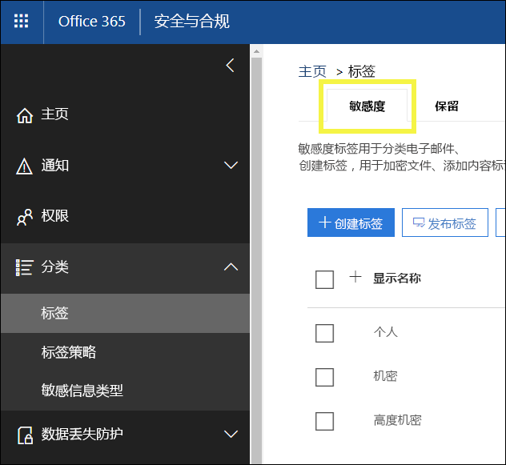

# 敏感度标签概述Overview of sensitivity labels

组织内人员需要与组织内外的其他人员协作，才能完成工作。也就是说，内容不再一直停留在防火墙后面，而是跨设备、应用和服务到处漫游。你希望内容的漫游方式不仅安全、受保护，还符合组织的业务和合规性策略。To get their work done, people in your organization need to collaborate with others both inside and outside the organization. This means that content no longer stays behind a firewall – it roams everywhere, across devices, apps, and services. And when it roams, you want it to do so in a secure, protected way that meets your organization’s business and compliance policies.

使用 Office 365 中的敏感度标签，可以对敏感内容进行分类和保护，同时确保组织内人员的工作效率和协作能力不受阻碍。With sensitivity labels in Office 365, you can classify and help protect your sensitive content, while making sure that your people’s productivity and ability to collaborate isn’t hindered.

借助敏感度标签，你可以：You can use sensitivity labels to:
  
- **强制执行保护设置，如对已标记内容设置加密或水印。** 例如，用户可以向文档或电子邮件应用“机密”标签，然后此标签便能加密相应内容，并应用“机密”水印。**Enforce protection settings such as encryption or watermarks on labeled content.** For example, your users can apply a Confidential label to a document or email, and that label can encrypt the content and apply a Confidential watermark.    

- **跨不同平台和设备保护 Office 应用中的内容。** 敏感度标签适用于 Windows、Mac、iOS 和 Android 上的 Office 应用。我们即将推出对 Office Web 应用的支持。**Protect content in Office apps across different platforms and devices.** Sensitivity labels work in Office apps on Windows, Mac, iOS, and Android. Support for Office web apps is coming soon.
    
- **利用 Microsoft Intune 终结点保护，防止在 Windows 设备上驻留的敏感内容从组织中泄露。** 当 Windows 设备上驻留的内容已应用有敏感度标签后，终结点保护可以阻止此类内容被复制到第三方应用（如 Twitter 或 Gmail），也可以阻止此类内容被复制到可移动存储（如 U 盘）。**Prevent sensitive content from leaving your organization on devices running Windows**, by using endpoint protection in Microsoft Intune. After a sensitivity label has been applied to content that resides on a Windows device, endpoint protection can prevent that content from being copied to a third-party app, such as Twitter or Gmail, or being copied to removable storage, such as a USB drive.

- **将敏感度标签扩展到第三方应用和服务。** 借助 Microsoft 信息保护 SDK，Windows、Mac 和 Linux 上的第三方应用可以读取敏感度标签，并应用保护设置。我们即将推出对 iOS 和 Android 上应用的支持。**Extend sensitivity labels to third-party apps and services.** With the Microsoft Information Protection SDK, third-party apps on Windows, Mac, and Linux can read sensitivity labels and apply protection settings. Support for apps on iOS and Android is coming soon.

- **对内容进行分类，而不使用任何保护设置。** 也可以只对内容进行分类（如不干胶标签），只要有人使用和共享内容，此分类就会随内容一起暂留和漫游。使用此分类，可生成使用情况报告，并查看敏感内容的活动数据。根据此类信息，稍后随时可以选择应用保护设置。**Classify content without using any protection settings.** You can also simply assign a classification to content (like a sticker) that persists and roams with the content as it's used and shared. You can use this classification to generate usage reports and see activity data for your sensitive content. Based on this information, you can always choose at a later time to apply protection settings.
    
无论是上述哪种用途，Office 365 中的敏感度标签都可有助于对正确的内容执行适当的操作。借助敏感度标签，可对整个组织中的数据进行分类，并根据此分类强制执行保护设置。In all of these cases, sensitivity labels in Office 365 can help you take the right actions on the right content. With sensitivity labels, you can classify data across your organization and enforce protection settings based on that classification.
  
敏感度标签是在 Office 365 安全与合规中心内创建。目前，安全与合规中心是跨 Azure 信息保护和 Office 365 配置敏感度标签和策略的唯一位置。这些敏感度标签可供 Azure 信息保护、Office 应用和 Office 365 服务使用。You create sensitivity labels in the Office 365 Security &amp; Compliance Center. The Security & Compliance Center is now the single place to configure sensitivity labels and policies across Azure Information Protection and Office 365. These sensitivity labels can be used by Azure Information Protection, Office apps, and Office 365 services.

Azure 信息保护客户可以在安全与合规中心内使用 Azure 信息保护标签。如果信息保护客户选择执行其他配置或高级配置，这些信息保护标签便会与 Azure 门户同步。Azure 信息保护标签和 Office 365 敏感度标签彼此完全相互兼容。\*\*\*\* 也就是说，例如，如果内容已有 Azure 信息保护标签，无需重新对此内容进行分类或标记。For Azure Information Protection customers, you can use your Azure Information Protection labels in the Security & Compliance center, and your labels will be synced with the Azure portal in case you choose to perform additional or advanced configuration. **Azure Information Protection labels and Office 365 sensitivity labels are fully compatible with each other.** This means, for example, if you have content labeled by Azure Information Protection, you won’t need to reclassify or relabel your content.

## 什么是敏感度标签What a sensitivity label is

向文档或电子邮件分配的敏感度标签就像是具有以下特征的标记：When you assign a sensitivity label to a document or email, it’s simply like a tag that is:

- **可自定义**：可以为组织中不同级别的敏感内容创建类别，如“个人”、“公开”、“常规”、“机密”和“高度机密”。**Customizable.** You can create categories for different levels of sensitive content in your organization, such as Personal, Public, General, Confidential, and Highly Confidential.

- **以明文形式显示**：由于敏感度标签以明文形式显示，因此第三方应用和服务可利用标签向已标记内容应用保护性操作。**Clear text.** Because the label is in clear text, it’s available for third-party apps and services to apply protective actions to labeled content.

- **永久性**：向内容应用的敏感度标签在相应电子邮件或文档的元数据中暂留。也就是说，标签（包括保护设置）随内容一起漫游，并成为应用和强制执行策略的基础。**Persistent.** After a sensitivity label is applied to content, it persists in the metadata of that email or document. This means the label roams with the content, including the protection settings, and becomes the basis for applying and enforcing policies.

在 Office 应用中，敏感度标签只显示为电子邮件或文档上的标记。In the Office apps, a sensitivity label simply appears as a tag on an email or document.

每个内容项都可以应用有一个敏感度标签。但请注意，一个内容项可以同时应用有一个敏感度标签和一个[保留标签](labels.md)。Each item of content can have a single sensitivity label applied to it. But note that an item can have both a single sensitivity label and a single [retention label](labels.md) applied to it.

## 敏感度标签有何用途What sensitivity labels can do

当电子邮件或文档应用有敏感度标签后，系统便会对内容强制执行相应标签的保护设置。敏感度标签可用于：After a sensitivity label is applied to an email or document, the protection settings for that label are enforced on the content. With a sensitivity label, you can:

- **加密**：仅加密电子邮件，或同时加密电子邮件和文档。可选择哪些用户或组在多长时间内有权执行哪些操作。例如，可选择允许组织外特定域中的用户，仅在内容应用有标签后的 7 天内有权查看相应内容。有关详细信息，请参阅[使用敏感度标签中的加密限制对内容的访问](encryption-sensitivity-labels.md)。**Encrypt** email only or both email and documents. You can choose which users or group have permissions to perform which actions and for how long. For example, you can choose to allow users in a specific domain outside your organization to have permissions to review the content for only 7 days after the content is labeled. For more information, see [Restrict access to content by using encryption in sensitivity labels](encryption-sensitivity-labels.md).

- **标记内容**：具体方法是将自定义水印、页眉或页脚添加到已应用有标签的电子邮件或文档中。请注意，水印只能应用于文档，不能应用于电子邮件。水印的长度上限为 255 个字符。此外，页眉和页脚的长度上限为 1024 个字符（但在 Excel 中除外，其中的长度上限为 255 个字符，具体取决于文档是否包含其他页眉或页脚和其他因素）。**Mark the content** by adding custom watermarks, headers, or footers to email or documents that have the label applied. Note that watermarks are applied only to documents, not email, and they're limited to 255 characters. Also, headers and footers are limited to 1024 characters (except in Excel, where they're limited to 255 characters or fewer, depending on whether the document contains other headers or footers and other factors.)

    

- 
  \*\*数据丢失防护\*\*：方法为启用 Intune 终结点保护。如果敏感内容已下载，可防止数据从 Windows 设备中丢失。例如，无法将已标记内容复制到 Dropbox、Gmail 或 U 盘。必须先在 Azure 门户中创建应用保护策略，敏感度标签才能使用 Windows 信息保护 (WIP)。有关详细信息，请参阅 [Windows 信息保护如何保护具有敏感度标签的文件](https://docs.microsoft.com/en-us/windows/security/information-protection/windows-information-protection/how-wip-works-with-labels?branch=vsts17546553)。**Prevent data loss** by turning on endpoint protection in Intune. If sensitive content gets downloaded, you can help prevent the loss of data from Windows devices. For example, you can’t copy labeled content into Dropbox, Gmail, or USB drive. Before your sensitivity labels can use Windows Information Protection (WIP), you first need to create an app protection policy in the Azure portal. For more information, see [How Windows Information Protection protects files with a sensitivity label](https://docs.microsoft.com/en-us/windows/security/information-protection/windows-information-protection/how-wip-works-with-labels?branch=vsts17546553).

- **将标签应用到包含敏感信息的内容。** 你可以选择要标记的敏感信息类型，标签可以自动应用，也可以提示用户应用你推荐的标签。如果你推荐标签，则提示会显示你选择的任何文本。有关详细信息，请参阅[自动将敏感标签应用于内容](apply_sensitivity_label_automatically.md)。**Apply the label automatically to content that contains sensitive information.** You can choose what types of sensitive information that you want labeled, and the label can either be applied automatically, or you can prompt users to apply the label that you recommend. If you recommend a label, the prompt displays whatever text you choose. For more information, see [Apply a sensitivity label to content automatically](apply_sensitivity_label_automatically.md).

    

在安全与合规中心内创建标签时，可使用以上所有选项。All of these options are available when you create a label in the Security & Compliance Center.

### 标签优先级（顺序非常重要）Label priority (order matters)

如果在安全与合规中心内创建敏感度标签，标签显示在“标签”\*\*\*\* 页上“敏感度”\*\*\*\* 选项卡中的列表内。此列表中的标签顺序非常重要，因为它反映了标签优先级。建议让限制最多的敏感度标签（如“高度机密”）显示在列表最下面\*\*\*\*，并让限制最少的敏感度标签（如“公开”）显示在列表最上面\*\*\*\*。When you create your sensitivity labels in the Security & Compliance Center, they appear in a list on the **Sensitivity** tab on the **Labels** page. In this list, the order of the labels is important because it reflects their priority. You want your most restrictive sensitivity label, such as Highly Confidential, to appear at the **bottom** of the list, and your least restrictive sensitivity label, such as Public, to appear at the **top**.

一个文档或电子邮件只能应用有一个敏感度标签。若有要求用户必须提供将标签更改为较低分类的理由，理由可以是此列表的排序，因为它决定了较低分类是什么。A document or email can have only a single sensitivity label applied to it. If you require your users to provide a justification for changing the label to a lower classification, the order of this list determines what's a lower classification.

### 子标签（对标签进行分组）Sublabels (grouping labels)

使用子标签，你可以对用户在 Office 应用中看到的页眉下的一个或多个标签进行分组。例如，在“保密”下，你的组织可能会对该分类的具体类型使用多种不同的标签。在本示例中，标签“保密”只是一个没有保护设置的文本标签，而且因为它具有子标签，因此无法应用于内容。相反，用户必须选择“保密”以查看子标签，然后他们可以选择要应用于内容的子标签。With sublabels, you can group one or more labels below a header that a user sees in an Office app. For example, under Confidential, your organization might use several different labels for specific types of that classification. In this example, the label Confidential is simply a text label with no protection settings, and because it has sublabels, it can’t be applied to content. Instead, users must choose Confidential to view the sublabels, and then they can choose a sublabel to apply to content.

子标签只是一种以逻辑组形式向用户呈现标签的方法。子标签不继承其父标签的任何设置。Sublabels are simply a way to present labels to users in logical groups. Sublabels don’t inherit any settings from the label they’re under.

### 编辑或删除敏感度标签Editing or deleting a sensitivity label

如果在安全与合规中心内删除敏感度标签，请注意标签并未从内容中删除，且对内容继续执行所有保护设置。If you delete a sensitivity label in the Security & Compliance Center, note that the label is not removed from content, and any protection settings continue to be enforced on the content.

如果在安全与合规中心内编辑敏感度标签，应用于内容的标签版本就是对相应内容强制执行的标签。If you edit a sensitivity label in the Security & Compliance Center, the version of the label that was applied to content is what’s enforced on that content.

## 标签策略有何用途What label policies can do

创建敏感度标签后，需要发布它们，以便组织内人员能够将标签应用于内容。与发布到所有 Exchange 邮箱等位置的保留标签不同，敏感度标签是发布到用户或组。然后，敏感度标签便会显示在这些用户或组的 Office 应用中。After you create your sensitivity labels, you need to publish them, to make them available to people in your organization, who can then apply the labels to content. Unlike retention labels, which are published to locations, such as all Exchange mailboxes, sensitivity labels are published to users or groups. Sensitivity labels then appear in Office apps for those users and groups.

借助标签策略，你可以：With a label policy, you can:

- **选择向哪些用户和组显示标签。** 可以将标签发布到任意启用电子邮件的安全组、通讯组、Office 365 组或动态通讯组。**Choose which users and groups see the labels.** Labels can be published to any email-enabled security group, distribution group, Office 365 group, or dynamic distribution group.

- **将默认标签应用于**标签策略包含的用户和组新建的所有文档和电子邮件。此默认标签可设置要对所有内容应用的保护设置的基本级别。**Apply a default label** to all new documents and email created by the users and groups included in the label policy. This default label can set a base level of protection settings that you want applied to all your content.

- **要求提供更改标签的理由。** 如果内容应用有“机密”标签，但用户要删除此标签或将它替换为较低分类（如“公开”标签），你可以要求用户必须在执行此操作时提供理由。这些理由可供管理员查看。目前，我们正在努力推出可供管理员查看用户理由的报告。**Require a justification for changing a label.** If content is marked Confidential and a user wants to remove that label or replace it with a lower classification, such as a label named Public, you can require that the user provide a justification when performing this action. These justifications will be available for the admin to review. We’re currently working on a report where admins can view the user justifications.

    

- **要求用户将标签应用于他们的电子邮件和文档。** 如果你希望标记用户的所有内容，则可以要求必须将标签应用于所有已保存的文档和已发送的电子邮件。标签可以由用户手动分配、按条件自动分配或者进行默认分配（上述默认标签选项）。以下是当要求用户分配标签时 Outlook 中显示的提示。**Require users to apply a label to their email and documents.** If you want all of a user's content to be labeled, you can require that a label must be applied to all of their saved documents and sent emails. The label can be assigned manually by the user, automatically as a result of a condition, or be assigned by default (the default label option described above). Here's the prompt shown in Outlook when a user is required to assign a label.

    

- **提供指向自定义帮助页的帮助链接。** 如果用户不确定敏感度标签的含义或应如何使用标签，你可以提供在 Office 应用中“敏感度”标签菜单底部显示的“了解更多”URL。**Provide help link to a custom help page.** If your users aren’t sure what your sensitivity labels mean or how they should be used, you can provide a Learn More URL that appears at the bottom of the Sensitivity label menu in the Office apps.

    

在你创建标签策略并将敏感度标签分配给用户和组后，这些人员会在不超过一小时的时间内在 Office 应用中看到这些标签。After you create a label policy and assign sensitivity labels to users and groups, those people will see those labels available in the Office apps in an hour or less.

## 如何开始使用How to get started

敏感度标签可快速上手：Getting started with sensitivity labels is a quick process:

1. **定义标签。** 首先要建立分类，用于定义各种敏感内容级别。应使用用户能理解的常见名称或术语。例如，可以从“个人”、“公开”、“常规”、“机密”和“高度机密”等标签入手。可利用子标签按类别对相似标签进行分组。此外，创建标签时，还需要提供工具提示，即用户将鼠标悬停在功能区中的某个标签选项时在 Office 应用中看到的提示。**Define the labels.** First, you want to establish your taxonomy for defining different levels of sensitive content. You should use common names or terms that make sense to your users. For example, you can start with labels such as Personal, Public, General, Confidential, and Highly Confidential. You can use sublabels to group similar labels by category. Also, when you create a label, a tool tip is required, which appears in the Office apps when a user hovers over a label option on the Ribbon.

1. **定义每个标签有何用途。** 然后，配置要与每个标签关联的保护设置。例如，较低敏感度内容（应用有“常规”标签）可以只应用有页眉或页脚，而较高敏感度内容（应用有“机密”标签）则可以应用有水印、加密和 WIP，这样有助于确保只有特权用户才能访问它。**Define what each label can do.** Then, configure the protection settings you want associated with each label. For example, lower sensitivity content (a “General” label) might simply have a header or footer applied to it, while higher sensitivity content (a “Confidential” label) may have a watermark, encryption, and WIP applied to it, to help ensure that only privileged users can access it.
 
1. **定义谁能获取标签。** 定义组织的标签后，通过标签策略发布它们。标签策略控制了哪些用户和组能看到这些标签。一个标签是可重用的。也就是说，定义标签一次后，可将它添加到分配给不同用户的多个标签策略。不过，必须先发布相应标签，使其显示在 Office 应用或其他服务中，然后才能将标签分配给内容。刚开始的时候，可尝试仅将敏感度标签分配给少数几个人员。**Define who gets the labels.** After you define your organization’s labels, you publish them in a label policy that controls which users and groups see those labels. A single label is reusable – you define it once, and then you can include it in several label policies assigned to different users. But in order for a label to be assigned to content, you must first publish that label so that it’s available in Office apps and other services. When just starting out, you can pilot your sensitivity labels by assigning them to just a few people.

下面的基本流展示了管理员、用户和 Office 应用为了让敏感度标签起作用所要执行的操作。Here’s the basic flow of what the admin, user, and Office app do to make sensitivity labels work.

## 敏感度标签可以显示在哪里Where sensitivity labels can appear

敏感度标签显示在 Office 应用 UI 中。若要查看敏感度标签对特定应用和平台的最新适用情况，请参阅**[此功能目前在何处适用？](https://support.office.com/zh-CN/article/apply-sensitivity-labels-to-your-documents-and-email-within-office-2f96e7cd-d5a4-403b-8bd7-4cc636bae0f9?ad=US&ui=en-US&rs=en-US#bkmk_whereavailable)**Sensitivity labels appear in the UI of Office apps. To view the current availability for specific apps and platforms, see **[Where is the feature available today?](https://support.office.com/zh-CN/article/apply-sensitivity-labels-to-your-documents-and-email-within-office-2f96e7cd-d5a4-403b-8bd7-4cc636bae0f9?ad=US&ui=en-US&rs=en-US#bkmk_whereavailable)**

### Windows 上的 Office 应用Office apps on Windows

在 Windows 设备上的 Office 应用中，敏感度标签显示在功能区上“开始”\*\*\*\* 选项卡的“敏感度”\*\*\*\* 按钮中。已应用的标签还显示在窗口底部的状态栏中。In Office apps on devices running Windows, sensitivity labels appear on the **Sensitivity** button, on the **Home** tab on the Ribbon. The label applied also appears in the Status bar at the bottom of the window.

我们即将推出对 Windows 上 Office 应用中敏感度标签的本机支持。Coming soon is native support for sensitivity labels in Office apps on Windows.

如果已是 Azure 信息保护客户，可以部署 Azure 信息保护统一标记客户端。此客户端支持敏感度标签。有关下载此客户端的更多信息，请参阅 [Azure 信息保护统一标记客户端：版本发布信息](https://docs.microsoft.com/zh-CN/azure/information-protection/rms-client/unifiedlabelingclient-version-release-history)目前，我们正在努力推出对 Windows 上 Office 应用中敏感度标签的本机支持，所以届时将无需再使用 Azure 信息保护统一标记客户端。If you're an existing Azure Information Protection customer, you can deploy the Azure Information Protection unified labeling client, which supports sensitivity labels. For more information about downloading the client, see [Azure Information Protection unified labeling client: Version release information](https://docs.microsoft.com/zh-CN/azure/information-protection/rms-client/unifiedlabelingclient-version-release-history). We’re currently working on native support for sensitivity labels in Office apps on Windows, so that the Azure Information Protection unified labeling client will no longer be required.

### Mac 上的 Office 应用Office apps on Mac

在 Mac 设备上的 Office 应用中，敏感度标签显示在功能区上“开始”\*\*\*\* 选项卡的“敏感度”\*\*\*\* 按钮中。已应用的标签还显示在窗口底部的状态栏中。In Office apps on Mac devices, sensitivity labels appear on the **Sensitivity** button, on the **Home** tab on the Ribbon. The label applied also appears in the Status bar at the bottom of the window.

### iOS 上的 Office 应用Office apps on iOS

在 iOS 设备上的 Office 应用中，敏感度标签显示在功能区上“开始”\*\*\*\* 选项卡的“敏感度”\*\*\*\* 按钮中。已应用的标签还显示在窗口底部的状态栏中。In Office apps on iOS devices, sensitivity labels appear on the **Sensitivity** button, on the **Home** tab on the Ribbon. The label applied also appears in the Status bar at the bottom of the window.

### Android 上的 Office 应用Office apps on Android

在 Android 设备上的 Office 应用中，敏感度标签显示在功能区上“开始”\*\*\*\* 选项卡的“敏感度”\*\*\*\* 按钮中。已应用的标签还显示在窗口底部的状态栏中。In Office apps on Android devices, sensitivity labels appear on the **Sensitivity** button, on the **Home** tab on the Ribbon. The label applied also appears in the Status bar at the bottom of the window.

### 详细了解 Office 应用中的敏感度标签More information on sensitivity labels in Office apps

- [将敏感度标签应用于 Office 文档和电子邮件Apply sensitivity labels to your documents and email within Office](https://support.office.com/zh-CN/article/apply-sensitivity-labels-to-your-documents-and-email-within-office-2f96e7cd-d5a4-403b-8bd7-4cc636bae0f9)
- [将敏感度标签应用于 Office 文件时的已知问题Known issues when you apply sensitivity labels to your Office files](https://support.office.com/zh-CN/article/known-issues-when-you-apply-sensitivity-labels-to-your-office-files-b169d687-2bbd-4e21-a440-7da1b2743edc)

## 如何结合使用敏感度标签与现有 Azure 信息保护标签How sensitivity labels work with existing Azure Information Protection labels

目前，Azure 信息保护用户可使用 Azure 信息保护统一标记客户端，对 Windows 上的内容进行分类和标记。可顺畅地结合使用现有 Azure 信息保护标签与新敏感度标签。也就是说，可执行下列操作：Azure Information Protection users are currently able to classify and label content on Windows by using the Azure Information Protection unified labeling client. Existing Azure Information Protection labels work seamlessly with new sensitivity labels. This means you can:

- 保留文档和电子邮件中的现有 Azure 信息保护标签。Keep your existing Azure Information Protection labels on documents and email.
- 保留现有 Azure 信息保护标签配置。Keep your existing Azure Information Protection label configuration.

若要使用 Azure 信息保护标签，目前的建议是，除非完成迁移，否则不要在安全与合规中心内新建标签。[Azure 信息保护迁移主题](https://docs.microsoft.com/zh-CN/azure/information-protection/configure-policy-migrate-labels)介绍了重要信息和一些具体注意事项。如果尚未准备好将生产租户迁移为使用敏感度标签，也无需担心，因为目前用户可继续使用 Azure 信息保护客户端，管理员也能继续使用 Azure 门户进行管理。If you are using Azure Information Protection labels, for now we recommend that you avoid creating new labels in Security & Compliance Center until after you’ve completed your migration. The [Azure Information Protection migration topic](https://docs.microsoft.com/zh-CN/azure/information-protection/configure-policy-migrate-labels) has important information and some specific caveats. If you are not yet ready to migrate your production tenants to sensitivity labels, there is no cause for concern: for the moment, your users can continue using the Azure Information Protection client, and admins can continue using the Azure portal for management.

## 使用 Microsoft Intune 终结点保护来保护 Windows 设备上的内容Protect content on Windows devices by using endpoint protection in Microsoft Intune

创建敏感度标签时，可视需要指示 Windows 具有此标签的文件是敏感内容，需要保护存储在 Windows 设备上的此类文件，以防发生数据泄露。此选项有助于确保具有此标签的内容只能共享或复制到批准的位置上，即使内容存储在终结点上，也不例外。实际上，如果对敏感度标签启用此选项，便是在指示 Windows 这是非常关键的数据，有必要施加额外使用限制。When you create a sensitivity label, you have the option to tell Windows that files with this label are sensitive and need to be protected against data leakage when stored on Windows devices. This option can help ensure that content with this label can be shared or copied only to sanctioned locations, even when it’s stored on an endpoint. In essence, turning on this option for a sensitivity label tells Windows that this is extra critical data that warrants additional usage constraints.

当你启用此选项后，Windows 便能读取、理解和处理文档中的敏感度标签，并自动对内容应用 Windows 信息保护 (WIP)，无论内容是以何种方式到达 Windows 托管设备的。这样有助于防止已标记文件发生意外数据泄露，无论是否应用加密。When you turn on this option, Windows can read, understand, and act on sensitivity labels in documents and automatically apply Windows Information Protection (WIP) on content, no matter how it reaches a managed Windows device. This helps protect labeled files from accidental leakage, with or without applying encryption.

例如，Windows 可知道驻留在用户计算机上的 Word 文档已应用有“机密”标签，WIP 可应用应用保护策略，以防相应设备中的数据被复制或共享到任何非工作位置（如个人 OneDrive、个人电子邮件帐户、社交媒体或 U 盘）。For example, Windows can understand that a Word document residing on a user’s machine has a Confidential label applied to it, and WIP can apply an app protection policy to prevent the copying or sharing of the data to any non-work location from that device (such as a personal OneDrive, personal email accounts, social media, or USB drives).

如果用户试图将已标记内容上传到个人 Gmail 帐户，便会看到以下消息。If a user attempts to upload labeled content to a personal Gmail account, they see this message.

此外，如果用户试图将已标记内容保存到 U 盘，还会看到以下消息。And if a user attempts to save labeled content to a USB drive, they see this message.

### 重要先决条件Important prerequisites

必须先满足 [Windows 信息保护如何保护具有敏感度标签的文件](https://docs.microsoft.com/en-us/windows/security/information-protection/windows-information-protection/how-wip-works-with-labels?branch=vsts17546553)中提及的先决条件，然后敏感度标签才能使用 WIP。这篇主题提及以下先决条件：Before your sensitivity labels can use WIP, you first need to do the prerequisites described here: [How Windows Information Protection protects files with a sensitivity label](https://docs.microsoft.com/en-us/windows/security/information-protection/windows-information-protection/how-wip-works-with-labels?branch=vsts17546553). This topic describes the following prerequisites:

- 确保运行的是 Windows 10 版本 1809 或更高版本。Make sure you're running Windows 10, version 1809 or later.
- [设置 Windows Defender 高级威胁防护 (WDATP)](https://docs.microsoft.com/zh-CN/windows/security/threat-protection/windows-defender-atp/get-started)，以扫描内容中是否有标签，并应用相应的 WIP 保护。ATP 与 WIP 分开执行一些操作，如报告异常。[Set up Windows Defender Advanced Threat Protection (WDATP)](https://docs.microsoft.com/zh-CN/windows/security/threat-protection/windows-defender-atp/get-started), which scans content for a label and applies the corresponding WIP protection. ATP performs some actions independently from WIP, such as reporting anomalies.
- 创建适用于终结点设备的 Windows 信息保护 (WIP) 策略。可以在下列两个位置之一执行此操作：Create a Windows Information Protection (WIP) policy that applies to endpoint devices. You can do this in either of these locations:
    - [使用适用于 Microsoft Intune 的 Azure 门户通过 MDM 创建 Windows 信息保护 (WIP) 策略Create a Windows Information Protection (WIP) policy with MDM using the Azure portal for Microsoft Intune](https://docs.microsoft.com/zh-CN/windows/security/information-protection/windows-information-protection/create-wip-policy-using-intune-azure)
    - [使用 System Center Configuration Manager 创建并部署 Windows 信息保护 (WIP) 策略Create and deploy a Windows Information Protection (WIP) policy using System Center Configuration Manager](https://docs.microsoft.com/zh-CN/windows/security/information-protection/windows-information-protection/create-wip-policy-using-sccm)

## 使用 Microsoft 信息保护 SDK 将敏感度标签扩展到第三方应用和服务Extend sensitivity labels to third-party apps and services by using the Microsoft Information Protection SDK

由于敏感度标签以明文形式暂留在文档的元数据中，因此第三方应用和服务可选择支持识别和保护包含此类标签的内容。我们会一直扩大对其他应用和服务的支持。Because a sensitivity label is persisted as clear text in the metadata of a document, third-party apps and services can choose to support identifying and protecting content that contains such a label. Support in other apps and services is always expanding.

借助 [Microsoft 信息保护 SDK](https://docs.microsoft.com/zh-CN/information-protection/develop/)，第三方应用和服务可读取敏感度标签，并向文档应用敏感度标签和保护设置。此 SDK 支持 Windows、Mac 和 Linux 上的应用。我们即将推出对 iOS 和 Android 上应用的支持。With the [Microsoft Information Protection SDK](https://docs.microsoft.com/zh-CN/information-protection/develop/), third-party apps and services can read and apply sensitivity labels and protection to documents. The SDK supports apps on Windows, Mac, and Linux. Coming soon is support for apps on iOS and Android.

借助此 SDK，可以标记和保护内容，且方式与其他 Microsoft 信息保护应用和服务（如 Office 应用、Office 365 服务、Azure 信息保护扫描程序、Microsoft Cloud App Security 及其他多个合作伙伴解决方案）兼容。有关示例，请详细了解 [Adobe Acrobat 中的敏感度标签支持](https://techcommunity.microsoft.com/t5/Azure-Information-Protection/Starting-October-use-Adobe-Acrobat-Reader-for-PDFs-protected-by/ba-p/262738)。Using the SDK, you can label and protect content in a way that works with other Microsoft Information Protection apps and services, such as Office apps, Office 365 services, the Azure Information Protection scanner, Microsoft Cloud App Security, and several other partner solutions. For example, learn more about [support for sensitivity labels in Adobe Acrobat](https://techcommunity.microsoft.com/t5/Azure-Information-Protection/Starting-October-use-Adobe-Acrobat-Reader-for-PDFs-protected-by/ba-p/262738).

若要详细了解 Microsoft 信息保护 SDK，请参阅[技术社区博客公告](https://techcommunity.microsoft.com/t5/Microsoft-Information-Protection/Microsoft-Information-Protection-SDK-Now-Generally-Available/ba-p/263144)。此外，还可以了解[与 Microsoft 信息保护集成的合作伙伴解决方案](https://techcommunity.microsoft.com/t5/Azure-Information-Protection/Microsoft-Information-Protection-showcases-integrated-partner/ba-p/262657)。To learn more about the Microsoft Information Protection SDK, see the [announcement on the Tech Community blog](https://techcommunity.microsoft.com/t5/Microsoft-Information-Protection/Microsoft-Information-Protection-SDK-Now-Generally-Available/ba-p/263144). You can also learn about [partner solutions that are integrated with Microsoft Information Protection](https://techcommunity.microsoft.com/t5/Azure-Information-Protection/Microsoft-Information-Protection-showcases-integrated-partner/ba-p/262657).

## 权限Permissions

若为创建敏感度标签的合规性团队成员，必须有权访问安全与合规中心。默认情况下，租户管理员有权访问此位置，并可向合规部主管及其他人员授予对安全与合规中心的访问权限，而不授予租户管理员的所有权限。为此，建议转到安全与合规中心内的“权限”\*\*\*\* 页，编辑“合规性管理员”\*\*\*\* 角色组，再向此角色组添加成员。Members of your compliance team who will create sensitivity labels need permissions to the Security & Compliance Center. By default, your tenant admin will have access to this location and can give compliance officers and other people access to the Security & Compliance Center, without giving them all of the permissions of a tenant admin. To do this, we recommend that you go to the **Permissions** page of the Security & Compliance Center, edit the **Compliance Administrator** role group, and add members to that role group.

有关详细信息，请参阅“向用户授予对 Office 365 安全与合规中心的访问权限”。For more information, see Give users access to the Office 365 Security & Compliance Center.

只有在创建和应用标签和标签策略时，才必须拥有这些权限。强制执行策略并不需要访问内容。These permissions are required only to create and apply labels and a label policy. Policy enforcement does not require access to the content.
