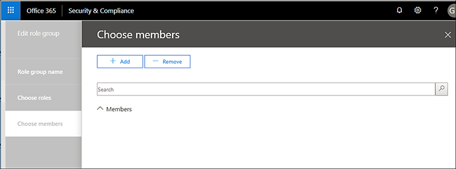

# 安全 & 合规中心中的服务保证Service assurance in the Security & Compliance Center

使用 Security & 合规中心中的服务保证访问描述各种主题的文档, 包括:Use Service assurance in the Security & Compliance Center to access documents that describe a variety of topics, including: 
  
- 存储在 Office 365 中的客户数据的 Microsoft 安全实践。Microsoft security practices for customer data that is stored in Office 365. 
    
- Office 365 的独立第三方审核报告。Independent third-party audit reports of Office 365. 
    
- Office 365 用来保护您的数据的安全、隐私和合规性控件的实施和测试详细信息。Implementation and testing details for security, privacy, and compliance controls that Office 365 uses to protect your data. 
    
您还可以了解 Office 365 如何帮助客户遵守各行业的标准、法律和法规, 例如:You can also find out how Office 365 can help customers comply with standards, laws, and regulations across industries, such as the:
  
-  国际标准化组织 (ISO) 27001 和27018International Organization for Standardization (ISO) 27001 and 27018 
    
- 1996 年的健康保险便利和义务法案 (HIPAA)Health Insurance Portability and Accountability Act of 1996 (HIPAA)
    
- 联邦风险和授权管理计划 (FedRAMP)Federal Risk and Authorization Management Program (FedRAMP)
    
## 谁可以访问 Office 365 服务保证？Who can access Office 365 Service assurance, and how?

 **新客户和评估 Microsoft online services 的客户**可以访问 Office 365 企业版 E3 和 E5 计划 (试用和付费订阅) 中包含的服务保证。**New customers, and customers evaluating Microsoft online services** can access Service assurance which is included with Office 365 Enterprise E3 and E5 plans (both trial and paid subscriptions). 如果你没有这些计划中的任何一个, 并且想要尝试服务保证, 可以[注册 Office 365 企业版 E5](https://go.microsoft.com/fwlink/p/?LinkID=698279)。If you don't have one of these plans and want to try Service assurance, you can [sign-up for a trial of Office 365 Enterprise E5](https://go.microsoft.com/fwlink/p/?LinkID=698279). 
  
 **Office 365 for business 的现有客户**可以访问服务保证。**Existing customers of Office 365 for business** can access Service assurance. 如果你是组织的 Office 365 全局管理员 (有时称为 "公司管理员"), 你将有权访问服务保证, 并且你可以为其他人提供服务。If you're the Office 365 global admin (sometimes called company administrator) for your organization, you'll already have access to Service assurance, and you can onboard others. 如果您不是组织的 Office 365 全局管理员, 并且需要对服务保证的访问权限, 请让管理员将您添加到服务保证用户角色组。If you're not the Office 365 global admin for your organization, and you need access to Service assurance, ask your admin to add you to the Service Assurance User role group. 
  
 如果尚未在订阅中实现基于服务保证角色的访问权限, 则**O365 订阅成员**在默认情况下可以访问 Office365 Protection Center 中的服务保证部分。**O365 Subscription Members** can access the Service assurance section in the Office365 Protection Center by default if Service assurance roles-based access has not been implemented in your subscription. 服务保证提供了报告和文档, 这些报告和文档描述了 Microsoft 在 Office 365 中存储的客户数据的安全实践。Service assurance provides reports and documents that describe Microsoft's security practices for customer data that's stored in Office 365. 此外, 它还提供了有关 Office 365 的独立第三方审核报告。It also provides independent third-party audit reports on Office 365. 
  
> [!NOTE]
> 注意: 如果贵公司在 Office 365 订阅中实施了基于服务保证角色的访问 (可能是您的组织已提供对自定义报告的访问权限), 并且您需要访问服务保证, 但它不包含在左侧窗格中的 "安全 & 合规中心", 请咨询 Office 365 管理员, 将您添加到 "**权限**" 页上的 "服务保证" 用户角色组中。Note: If your company has implemented Service Assurance Roles-Based Access in your Office 365 Subscription (which could be if your organization has been provided access to custom reports), and you need access to Service assurance but it is not included in the left pane of the Security & Compliance Center, ask your Office 365 administrator to add you to the Service Assurance User role group on the **Permissions** page. 有关详细信息, 请参阅板载其他服务保证用户或组。For more information, see Onboard other Service assurance users or groups. 
  
 **基于服务保证角色的访问预配的用户**如果贵公司实施了基于服务保证角色的访问, 则可以提供对所有安全和合规性人员的服务保证, 包括信息安全性、风险管理、合规性、审核团队以及你的人员组织.**Service assurance roles-based access-provisioned users** If your company has implemented Service assurance roles-based access, you can provide Service assurance access to all security and compliance personnel including information security, risk management, compliance, and audit teams and personnel within your organization. 有关详细信息, 请参阅[板载其他服务确定性用户或组](service-assurance.md#addother)。For details, see [Onboard other Service assurance users or groups](service-assurance.md#addother).
  
可以使用安全 & 合规性中心访问服务保证。Service assurance is accessible by using the Security & Compliance Center. 下面介绍了如何转到此处。Here's how to get to there.
  
1. 转到 [https://protection.office.com](https://protection.office.com)。Go to [https://protection.office.com](https://protection.office.com).
    
2. 使用工作或学校帐户登录到 Office 365。Sign in to Office 365 using your work or school account. 
    
3. 在左窗格中, 选择 "**服务保证**"。In the left pane, select **Service assurance**. 接下来,[选择你的行业和区域设置](service-assurance.md#Chooseyourindustryregional)以及[板载其他服务保证用户或组](service-assurance.md#addother)。Next, [Choose your industry and regional settings](service-assurance.md#Chooseyourindustryregional) and [Onboard other Service assurance users or groups](service-assurance.md#addother).
    
    > [!NOTE]
    > 如果您需要访问服务保证, 并且它不包含在安全 & 合规性中心的左窗格中, 请咨询您的 Office 365 管理员, 将您添加到 "**权限**" 页上的 "服务保证" 用户角色组中。If you need access to Service assurance, and it's not included in the left pane of the Security & Compliance Center, ask your Office 365 administrator to add you to the Service Assurance User role group on the **Permissions** page. 
  
## 选择你的行业和区域设置Choose your industry and regional settings

当您首次访问服务保证时, 第一步是配置您的行业和区域设置。When you access Service assurance for the first time, the first step is to configure your industry and regional settings. 您可以随时更改这些设置。You can change these settings at any time. 通过配置这些设置, 服务保证可以为您提供与您的组织最相关的内容。Configuring these settings enables Service assurance to provide you with content that is most relevant to your organization. 配置您的行业和区域设置:To configure your industry and region settings:
  
1. 在访问服务保证后, 选择 "**设置**", "区域和行业设置" 页将显示, 如以下屏幕截图中所示。After you access Service assurance, select **Settings** and the Region and industry settings page displays as shown in the following screenshot. 
    
    
  
2. 在 "**设置**" 页上, 选择 "**区域**" 旁边的向下箭头, 然后检查您的组织的相应区域。On the **Settings** page, select the down arrow next to **Region** and check the appropriate regions for your organization. 
    
3. 选择 "**行业**" 旁边的向下箭头, 然后检查贵组织的相应行业。Select the down arrow next to **Industry** and check the appropriate industries for your organization. 
    
4. 选择了区域和行业后, 请选择 "**保存**"。Once you have selected regions and industries, select **Save**.
    
## 查找、查看和下载合规性和信任内容Find, review, and download compliance and trust content

若要查看和下载内容, 请从导航窗格中选择一个选项:To review and download content, select an option from the navigation pane:
  
- **合规性报告**, 以查看 Office 365 和其他 Microsoft 云服务的独立审核和评估, 如以下屏幕截图所示。**Compliance reports** to view independent audits and assessments of Office 365 and other Microsoft cloud services as shown in the following screen shot. 
    
    
  
- **信任文档**以查看有关 Microsoft 如何操作 Office 365 的信息, 如以下屏幕截图所示。**Trust documents** to view information about how Microsoft operates Office 365 as shown in the following screen shot. 
    
    
  
- **经审核的控件**查看有关 Office 365 控件如何满足安全性、合规性和隐私要求的信息, 如以下屏幕截图所示。**Audited controls** to view information about how Office 365 controls meet security, compliance, and privacy requirements, as shown in the following screen shot. 
    
    
  
选择要下载的报告, 然后选择 "**保存**" 以将其下载到您的计算机。Select the report you want to download, and select **Save** to download it to your computer. 对于已审核的控件, 选择所需的报告, 然后选择 "**下载**"。For Audited controls, select the report you want and then select **Download**. 下表介绍了可以在每个服务保证页上找到的报告。The table below describes the reports you can find on each Service assurance page. 
  
> [!NOTE]
> 服务保证报告和文档可在发布后的12个月内下载, 或者在新版本的文档可用之前进行下载。Service assurance reports and documents are available to download for at least twelve months after publishing or until a new version of the document becomes available. 
  
|**服务保证页****Service assurance page**|**内容可用****Content available**|**Description****Description**|
|:-----|:-----|:-----|
|合规性报告Compliance reports    | FedRampFedRamp     GRC 评估GRC Assessment     ISOISO     SOC/SSAESOC/SSAE    |使用服务合规性报告可查看由 Office 365 服务交付操作的第三方独立审核员执行的审核评估。Use service compliance reports to review audit assessments performed by third-party independent auditors of Office 365 Service Delivery Operations.    |
|信任文档Trust documents    | 常见问题解答和白皮书FAQ and White Papers     风险管理报告Risk Management Reports    |使用在您的审查/风险评估的非公开协议下为您提供的白皮书、faq、年末报告和其他 Microsoft 机密资源。Use white papers, FAQs, end-of-year reports and other Microsoft Confidential resources that are made available to you under non-disclosure agreement for your review / risk assessments.    |
|已审核控件Audited controls    |Office 365 实施的全球标准和法规。Global standards and regulations that Office 365 has implemented.    | 评估、载入或使用 Office 365 服务时, 可帮助进行风险评估。Help with risk-assessment when you're evaluating, onboarding, or using Office 365 services. 找出：Find out:     -Office 365 控制措施如何满足安全性、合规性和隐私要求。- How Office 365 controls meet security, compliance, and privacy requirements.   -关于 Office 365 中的控件的测试、这些测试的结果以及它们何时完成。-  About testing of controls in Office 365, results of these tests, and when they were completed.    |
   
根据您的特定设置, 您的视图中包含的选项可能有一些差异。Depending on your specific set-up, options included in your view might have some differences.
  
## 其他板载服务保证用户或组Onboard other Service assurance users or groups

若要访问通常在所有 Microsoft 云订阅中可用的默认报告, 您无需实现基于服务保证角色的访问模型, 并且可以跳过此步骤。For accessing default reports that are generally available across all Microsoft Cloud subscriptions, you don't need to implement the Service Assurance roles-based access model and you can skip this step. 但是, 如果您的组织已提供对自定义报告的访问权限, 请将其他用户或组添加到服务确定性角色中。However, if your organization has been provided access to custom reports then please add other users or groups to the Service Assurance roles. 若要添加其他用户或组, 请执行以下操作:To add other users or groups:
  
1. 在安全 & 合规性中心中, 选择左窗格中的**权限**, 如下面的屏幕截图中所示。In the Security & Compliance Center, select **Permissions** in the left pane as shown in the following screenshot. 
    
    
  
2. 在右侧窗格中, 选择 "**服务保证用户**", 然后选择 "**编辑角色组**", 在 "**成员**" 部分下, 选择 "**编辑**" 以将成员添加到服务保证用户角色中, 如下面的屏幕截图中所示。In the right pane, select **Service Assurance User**, and then select **Edit Role Group**, and under the **Members** section, select **Edit** to add members to the Service Assurance User role as shown in the following screenshot. 
    
    
  
3. 在下一个对话框中, 搜索并选择需要查看服务保证合规性报告和信任资源的个人或组, 然后为所做的每个选择选择 "**添加**", 然后单击 "" 窗格右上角的 " **X** "已经完成。In the next dialog box, search for and choose individuals or groups that need to view Service assurance compliance reports and trust resources, then select **Add** for each selection you make and click the **X** in the upper right corner of the pane when you're finished. 
    
    
  
4. 您添加到服务保证用户角色中的每个用户或组现在都可以在 Security & 合规性中心中查找服务保证并下载报告和其他文档。Every user or group that you added to the Service Assurance User role can now find Service assurance and download reports and other documents in the Security & Compliance Center.
    
随时返回到 "**权限**" 页以添加更多用户, 或删除现有用户。Return to the **Permissions** page at any time to add more users, or remove existing ones. 
  
## 获取服务保证方面的帮助Get help with Service assurance

[联系商业版产品支持人员-管理员帮助](https://support.office.com/article/32a17ca7-6fa0-4870-8a8d-e25ba4ccfd4b)。[Contact support for business products - Admin Help](https://support.office.com/article/32a17ca7-6fa0-4870-8a8d-e25ba4ccfd4b).
  
## 常见问题解答Frequently Asked Questions

 **为什么我收到一条错误消息, 指出服务保证中的文档已损坏？****Why am I getting an error saying that documents from Service assurance are corrupted?**
  
大多数服务确定性文档都采用 PDF 格式。Most Service assurance documents are in PDF format. 选择 "**保存**" 将这些文件保存到, 然后从本地计算机上打开它们。Choose **Save** to save these files to, and then open them up from, your local computer. 
