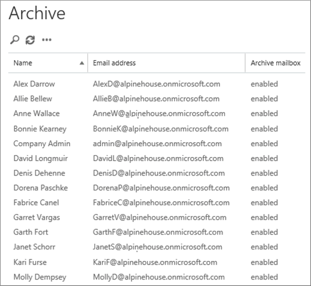

# <a name="set-up-an-archive-and-deletion-policy-for-mailboxes-in-your-office-365-organization"></a>为 Office 365 组织中的邮箱设置存档和删除策略

 在 Office 365 中, 管理员可以创建存档和删除策略, 以自动将项目移动到用户的存档邮箱, 并自动删除邮箱中的项目。 管理员通过创建分配给邮箱的保留策略, 并在一段时间后将项目移动到用户的存档邮箱来实现此功能, 并在达到一定期限后从邮箱中删除邮件。 确定要移动或删除的项目以及发生此问题的实际规则称为保留标记。 保留标记链接到保留策略, 后者又分配给用户的邮箱。 保留标记将保留设置应用于用户邮箱中的单个邮件和文件夹。 它定义邮件在邮箱中保留的时间, 以及当邮件达到指定的保留期限时采取的操作。 当邮件达到其保留期限时, 会将其移动到用户的存档邮箱或将其删除。 
  
本文中的步骤将设置名为 Alpine 房子的虚拟组织的存档和保留策略。 设置此策略包含以下任务:
  
- 为组织中的每个用户启用存档邮箱。 这样, 用户便可以添加邮箱存储, 并要求保留策略将项目移动到存档邮箱。 它还允许用户通过将项目移动到其存档邮箱来存储存档信息。 
    
- 创建三个用于执行以下操作的自定义保留标记: 
    
  - 自动将早于3年的项目移动到用户的存档邮箱中。 将项目移动到存档邮箱可释放用户主邮箱中的空间。
    
  - 自动从 "已删除邮件" 文件夹中删除5年以前的项目。 这还将释放用户的主邮箱中的空间。 如果需要, 用户将有机会恢复这些项目。 有关更多详细信息, 请参阅 "[详细信息](#more-information)" 部分中的脚注。 
    
  - 自动 (和永久) 从主邮箱和存档邮箱中删除7年以前的项目。 由于合规性管理法规的原因, 某些组织需要在一定时间内保留电子邮件。 此时间段到期后, 组织可能希望永久删除这些项目用户邮箱。 
    
- 创建新的保留策略并向其添加新的自定义保留标记。 此外, 还将向新的保留策略中添加内置保留标记。 这包括用户可分配给其邮箱中的项目的个人标记。 您还将添加保留标记, 将项目从用户主邮箱中的 "可恢复的项目" 文件夹移动到其存档邮箱中的 "可恢复的项目" 文件夹中。 这有助于在用户的 "可恢复的项目" 文件夹中的邮箱置于保留状态时释放这些空间。
    
您可以按照本文中的部分或全部步骤操作, 为自己组织中的邮箱设置存档和删除策略。 我们建议您先对几个邮箱测试此过程, 然后再在组织中的所有邮箱上实施此过程。
  
## <a name="before-you-begin"></a>开始之前

- 您必须是 Office 365 组织中的全局管理员才能执行本主题中的步骤。 
    
-  当您在 Office 365 中创建新用户帐户并为用户分配 Exchange Online 许可证时, 系统会自动为该用户创建一个邮箱。 创建邮箱后, 会自动为其分配一个名为 "默认 MRM 策略" 的默认保留策略。 在本文中, 您将创建一个新的保留策略, 然后将其分配给用户邮箱, 替换默认的 MRM 策略。 每次只能向一个邮箱分配一个保留策略。
    
- 若要了解有关 Exchange Online 中的保留标记和保留策略的详细信息, 请参阅[保留标记和保留策略](https://go.microsoft.com/fwlink/p/?LinkId=404424)。
    
## <a name="step-1-enable-archive-mailboxes-for-users"></a>步骤 1: 为用户启用存档邮箱

第一步是为组织中的每个用户启用存档邮箱。 必须启用用户的存档邮箱, 这样, 具有 "移动到存档" 保留操作的保留标记可以在保留期限到期后移动项目。 
  
> [!NOTE]
> 您可以在此过程中的任何时间启用存档邮箱, 只要在完成该过程之前在某个时刻启用了这些邮箱即可。 如果未启用存档邮箱, 则不会对分配有存档策略的任何项目执行任何操作。 
  
1. 转到 [https://protection.office.com](https://protection.office.com)。
    
2. Sign in to Office 365 using your global administrator account.
    
    
3. 在安全&amp;合规性中心中, 转到 "**数据调控** \> **存档**"。
    
    将显示组织中的邮箱列表以及相应的存档邮箱是否已启用或已禁用。 
    
4. 通过单击列表中的第一个邮箱来选择所有邮箱, 按住**Shift**键, 然后单击列表中的最后一个邮箱。 
    
    > [!TIP]
    > 此步骤假定未启用任何存档邮箱。 如果有任何邮箱启用了存档, 请按住**Ctrl**键, 然后单击每个具有已禁用的存档邮箱的邮箱。 或者, 可以单击 "**存档邮箱**" 列标题, 根据是否启用或禁用存档邮箱来对行进行排序, 以便更轻松地选择邮箱。 
  
5. 在详细信息窗格中的 "**批量编辑**" 下, 单击 "**启用**"。
    
    将显示一条警告, 指出早于两年的项目将移至新的存档邮箱。 这是因为, 在创建新的用户邮箱时, 为其分配的默认保留策略具有保留期为2年的存档默认策略标记。 您将在步骤2中创建的自定义存档默认策略标记的保留时间为3年。 这表示3年或更早的项目将移至存档邮箱。
    
6. 单击 **"是"** 关闭警告消息, 并启动启用每个所选邮箱的存档邮箱的过程。 
    
7. 完成该过程后, 单击 "**刷新**  " 以更新 "**存档**" 页上的列表。 
    
    为组织中的所有用户启用存档邮箱。
    
    
  
8. 保持 "安全&amp;合规性" 中心处于打开状态。 你将在下一步中使用它。
    
## <a name="step-2-create-new-retention-tags-for-the-archive-and-deletion-policies"></a>步骤 2: 为存档和删除策略创建新的保留标记

在此步骤中, 您将创建前面所述的三个自定义保留标记。
  
- Alpine 房屋3年后移动到存档 (自定义存档策略)
    
- Alpine 住宅7年永久删除 (自定义删除策略)
    
- Alpine 房子删除的项目5年删除并允许恢复 ("已删除邮件" 文件夹的自定义标记)
    
若要创建新的保留标记, 您将在 exchange Online 组织中使用 exchange 管理中心 (EAC)。
  
1. 在 "安全&amp;合规性中心" 中, 单击左上角的应用启动器, 然后单击 "**管理**" 磁贴。 
    
2. 在 Office 365 管理中心的左侧导航窗格中, 单击 "**管理中心**", 然后单击 " **Exchange**"。
    
    
  
3. 在 EAC 中, 转到 "**合规性管理** \> " "**保留标记**"
    
    将显示您的组织的保留标记列表。
    
### <a name="create-a-custom-archive-default-policy-tag"></a>创建自定义存档默认策略标记
  
首先, 创建一个自定义存档默认策略标记 (DPT), 该标记将在3年后将项目移动到存档邮箱。 
  
1. 在 "**保留标记**" 页上, 单击 "**新建标记**", 然后选择 "**自动应用于整个邮箱 (默认)**"。 
    
2. 在 "**自动应用于整个邮箱 (默认)** " 页上, 填写下列字段: 
    
    
  
1. **名称**为新的保留标记键入一个名称。 
    
2. **保留操作**选择 "**移动到存档**" 可在保留期到期时将项目移动到存档邮箱。 
    
3. **保留期**选择 **"当项目达到以下期限 (天)**", 然后输入保留期的持续时间。 在这种情况下, 项目将在1095天 (3 年) 后移至存档邮箱。
    
4. **注释**Optional键入说明自定义保留标记用途的注释。 
    
3. 单击 "**保存**" 以创建自定义存档 DPT。 
    
    新的存档 DPT 显示在保留标记列表中。
    
### <a name="create-a-custom-deletion-default-policy-tag"></a>创建自定义删除默认策略标记
  
接下来, 你将创建另一个自定义 DPT, 但此操作将成为一个删除策略, 该策略将在7年后永久删除项目。
  
1. 在 "**保留标记**" 页上, 单击 "**新建标记**", 然后选择 "**自动应用于整个邮箱 (默认)**"。 
    
2. 在 "**自动应用于整个邮箱 (默认)** " 页上, 填写下列字段: 
    
    
  
1. **名称**为新的保留标记键入一个名称。 
    
2. **保留操作**选择 "**永久删除**", 以便在保留期到期时清除邮箱中的项目。 
    
3. **保留期**选择 **"当项目达到以下期限 (天)**", 然后输入保留期的持续时间。 在这种情况下, 将在2555天 (7 年) 后清除项目。
    
4. **注释**Optional键入说明自定义保留标记用途的注释。 
    
3. 单击 "**保存**" 以创建自定义删除 DPT。 
    
    新的删除 DPT 将显示在保留标记列表中。
    
### <a name="create-a-custom-retention-policy-tag-for-the-deleted-items-folder"></a>为 "已删除邮件" 文件夹创建自定义保留策略标记
  
您要创建的最后一个保留标记是 "已删除邮件" 文件夹的自定义保留策略标记 (RPT)。 此标记将在5年后删除 "已删除邮件" 文件夹中的项目, 并在用户可以使用 "恢复已删除邮件" 工具恢复项目时提供恢复期。
  
1. 在 "**保留标记**" 页上, 单击 "**新建标记** ", 然后选择 "**自动应用到默认文件夹**"。 
    
2. 在 "**自动应用于默认文件夹**" 页上的 "新标记" 中, 填写下列字段: 
    
    
  
1. **名称**为新的保留标记键入一个名称。 
    
2. **将此标记应用于以下默认文件夹**在下拉列表中, 选择 "**已删除邮件**"。
    
3. **保留操作**选择 "**删除并允许恢复**" 在保留期到期时删除项目, 但允许用户恢复已删除项目保留期 (默认为14天) 内的已删除项目。 
    
4. **保留期**选择 **"当项目达到以下期限 (天)**", 然后输入保留期的持续时间。 在这种情况下, 将在1825天 (5 年) 后删除项目。
    
5. **注释**Optional键入说明自定义保留标记用途的注释。 
    
3. 单击 "**保存**" 为 "已删除邮件" 文件夹创建自定义 RPT。 
    
    新 RPT 将显示在保留标记列表中。

## <a name="step-3-create-a-new-retention-policy"></a>步骤 3: 创建新的保留策略

创建自定义保留标记后, 下一步是创建新的保留策略并添加保留标记。 您将添加您在步骤2中创建的三个自定义保留标记, 以及在第一节中提到的内置标记。 在步骤4中, 将此新的保留策略分配给用户邮箱。
  
1. 在 EAC 中, 转到 "**合规性管理** \> "**保留策略**。
    
2. 在 "**保留策略**" 页上**** 新建新图标"。
    
3. 在 "**名称**" 框中, 为新的保留策略键入一个名称;例如, **Alpine 房屋存档和删除策略**。 
    
4. 在 **"保留标记**" 下, 单击](media/457cd93f-22c2-4571-9f83-1b129bcfb58e.gif)"**添加** " 部分中将更详细地介绍这些标记)。 若要添加保留标记, 请将其选中, 然后单击 "**添加**"。 
    
    
  
    > [!TIP]
    > 您可以选择多个保留标记, 方法是按住**Ctrl**键, 然后单击每个标记。 
  
6. 添加保留标记后, 单击 **"确定"**。
    
7. 在 "**新建保留策略**" 页上, 单击 "**保存**" 以创建新策略。 
    
    新的保留策略将显示在列表中。 选择它可在详细信息窗格中显示链接到它的保留标记。
    
    
  
## <a name="step-4-assign-the-new-retention-policy-to-user-mailboxes"></a>步骤 4: 将新的保留策略分配给用户邮箱

创建新邮箱时, 默认情况下会为其分配一个名为 "默认 MRM 策略" 的保留策略。 在此步骤中, 您将替换此保留策略 (因为一个邮箱只能分配有一个保留策略), 方法是将您在步骤3中创建的新保留策略分配给组织中的用户邮箱。 此步骤假定您将新策略分配给组织中的所有邮箱。
  
1. 在 EAC 中, 转到 "**收件人** \> " "**邮箱**"。
    
    将显示组织中所有用户邮箱的列表。 
    
2. 通过单击列表中的第一个邮箱来选择所有邮箱, 按住**Shift**键, 然后单击列表中的最后一个邮箱。 
    
3. 在 EAC 右侧的 "详细信息" 窗格中的 "**批量编辑**" 下, 单击 "**更多选项**"。
    
4. 在“保留策略”**** 下，单击“更新”****。
    
5. 在 "**批量分配保留策略**" 页上的 "**选择保留策略"** 下拉列表中, 选择您在步骤3中创建的保留策略;例如, **Alpine 房子存档和保留策略**。
    
6. 单击 "**保存**" 以保存新的保留策略分配。 
    
7. 若要验证是否已将新的保留策略分配给邮箱, 您可以执行以下操作: 在 "邮箱" 页上选择一个邮箱, 然后单击 "编辑"。 
    
1. 在 "**邮箱**" 页上选择一个邮箱, 然后单击 "](media/d7dc7e5f-17a1-4eb9-b42d-487db59e2e21.png)**编辑** ![编辑"。 
    
2. 在所选用户的 "邮箱属性" 页上, 单击 "**邮箱功能**"。
    
    分配给邮箱的新策略的名称将显示在 "**保留策略**" 下拉列表中。 

## <a name="optional-step-5-run-the-managed-folder-assistant-to-apply-the-new-settings"></a>Optional步骤 5: 运行托管文件夹助理以应用新设置

在步骤4中对邮箱应用新的保留策略后, 在 Exchange Online 中最长可能需要7天, 才能将新的保留设置应用于邮箱。 这是因为称为 "托管文件夹助理" 的进程每7天处理一次邮箱。 您可以通过在 Exchange Online PowerShell 中运行**start-managedfolderassistant** cmdlet 来强制执行此操作, 而不是等待托管文件夹助理运行。 
  
 **运行托管文件夹助理时, 会发生什么情况？** 它通过检查邮箱中的项目并确定它们是否受保留, 来应用保留策略中的设置。 然后, 该示例使用适当的保留标记将受保留的项目标记为保留, 然后对超过保留期限的项目执行指定的保留操作。 
  
以下是连接到 Exchange Online PowerShell 的步骤, 然后在组织中的每个邮箱上运行托管文件夹助理。
  
1. 在本地计算机上，打开 Windows PowerShell 并运行以下命令。
    
    ```
    $UserCredential = Get-Credential
    ```

    在 " **Windows PowerShell 凭据请求**" 对话框中, 键入 Office 365 全局管理员帐户的用户名和密码, 然后单击 **"确定"**。
    
2. 运行以下命令。
    
    ```
    $Session = New-PSSession -ConfigurationName Microsoft.Exchange -ConnectionUri https://outlook.office365.com/powershell-liveid/ -Credential $UserCredential -Authentication Basic -AllowRedirection
    ```

3. 运行以下命令。
    
    ```
    Import-PSSession $Session
    ```

4. 要验证您是否已连接至您的 Exchange Online 组织，请运行以下命令获取组织中所有邮箱的列表。
    
    ```
    Get-Mailbox
    ```

    > [!NOTE]
    > 有关详细信息, 或者如果您在连接到 exchange online 组织时遇到问题, 请参阅[连接到 Exchange online PowerShell](https://go.microsoft.com/fwlink/p/?LinkId=517283)。 
  
5. 运行以下两个命令, 为组织中的所有用户邮箱启动托管文件夹助理。
    
    ```
    $Mailboxes = Get-Mailbox -ResultSize Unlimited -Filter {RecipientTypeDetails -eq "UserMailbox"}
    ```

    ```
    $Mailboxes.Identity | Start-ManagedFolderAssistant
    ```

就是这么简单。 您已为 Alpine 房子组织设置存档和删除策略。
  
## <a name="optional-step-6-make-the-new-retention-policy-the-default-for-your-organization"></a>Optional步骤 6: 将新的保留策略设为您的组织的默认策略

在步骤4中, 必须将新的保留策略分配给现有邮箱。 但您可以配置 Exchange Online, 以便将新的保留策略分配给将来创建的新邮箱。 可通过使用 Exchange Online PowerShell 更新组织的默认邮箱计划来执行此操作。 *邮箱计划*是一个模板, 可自动配置新邮箱的属性。  在此可选步骤中, 您可以使用您在步骤3中创建的保留策略替换分配给邮箱计划的当前保留策略 (默认情况下是默认的 MRM 策略)。 更新邮箱计划后, 新的保留策略将分配给新邮箱。

1. [连接到 Exchange Online PowerShell](https://go.microsoft.com/fwlink/p/?LinkId=517283)或参阅第5步。

2. 运行以下命令以显示组织中的邮箱计划的相关信息。

    ```
    Get-MailboxPlan | Format-Table DisplayName,RetentionPolicy,IsDefault
    ```
    记下设置为默认的邮箱计划。

3. 运行以下命令, 将您在步骤3中创建的新保留策略 (例如, **Alpine 房子存档和保留策略**) 分配给默认邮箱计划。 本示例假定默认邮箱计划的名称为**ExchangeOnlineEnterprise**。

    ```
    Set-MailboxPlan "ExchangeOnlineEnterprise" -RetentionPolicy "Alpine House Archive and Retention Policy"
    ```
4. 您可以在步骤2中重新运行该命令, 以验证分配给默认邮箱计划的保留策略是否已更改。

## <a name="more-information"></a>详细信息

- 保留期限是如何计算的？ 邮箱项目的保留期限是根据传递日期或邮件的创建日期计算的, 例如未发送但由用户创建的草稿邮件。 When the Managed Folder Assistant processes items in a mailbox, it stamps a start date and an expiration date for all items that have retention tags with the Delete and Allow Recovery or Permanently Delete retention action. 具有存档标记的项目标记有移动日期。 
    
- 下表提供了有关添加到自定义保留策略的每个保留标记的详细信息, 该保留策略是按照本主题中的步骤创建的。
    
    |**保留标记**|**此标记执行的操作**|**内置的还是自定义的？**|**类型**|
    |:-----|:-----|:-----|:-----|
    |Alpine 住宅3年后移动到存档  <br/> |将1095天 (3 年) 的项目移至存档邮箱。  <br/> |自定义 (请参阅[第2步: 为存档和删除策略创建新的保留标记](#step-2-create-new-retention-tags-for-the-archive-and-deletion-policies))  <br/> |默认策略标记 (存档);此标记将自动应用于整个邮箱。  <br/> |
    |Alpine 住宅7年永久删除  <br/> |将主邮箱或存档邮箱中的项目永久删除 (如果有7年)。  <br/> |自定义 (请参阅[第2步: 为存档和删除策略创建新的保留标记](#step-2-create-new-retention-tags-for-the-archive-and-deletion-policies))  <br/> |默认策略标记 (删除);此标记将自动应用于整个邮箱。  <br/> |
    |Alpine 房子删除的项目5年删除并允许恢复  <br/> |从 "已删除邮件" 文件夹中删除5年的项目。 用户在删除这些项目后, 可以在14天内恢复这些项目。<sup>\*</sup> <br/> |自定义 (请参阅[第2步: 为存档和删除策略创建新的保留标记](#step-2-create-new-retention-tags-for-the-archive-and-deletion-policies))  <br/> |保留策略标记 (已删除的项目);此标记将自动应用于 "已删除邮件" 文件夹中的项目。  <br/> |
    |可恢复的项目14天后移动到存档  <br/> |将 "可恢复的项目" 文件夹中已有14天的项目移动到存档邮箱中的 "可恢复的项目" 文件夹中。  <br/> |内置  <br/> |保留策略标记 (可恢复的项目);此标记将自动应用于 "可恢复的项目" 文件夹中的项目。  <br/> |
    |垃圾邮件  <br/> |将 "垃圾邮件" 文件夹中的项目永久删除30天。 用户在删除这些项目后, 可以在14天内恢复这些项目。<sup>\*</sup> <br/> |内置  <br/> |保留策略标记 (垃圾邮件);此标记将自动应用于 "垃圾邮件" 文件夹中的项目。  <br/> |
    |1 个月后删除  <br/> |永久删除30天之前的项目。 用户在删除这些项目后, 可以在14天内恢复这些项目。<sup>\*</sup> <br/> |内置  <br/> |Personal用户可以应用此标记。  <br/> |
    |1 年后删除  <br/> |永久删除365天以前的项目。 用户在删除这些项目后, 可以在14天内恢复这些项目。<sup>\*</sup> <br/> |内置  <br/> |Personal用户可以应用此标记。  <br/> |
    |从不删除  <br/> |此标记阻止保留策略删除项目。  <br/> |内置  <br/> |Personal用户可以应用此标记。  <br/> |
    |个人 1 年后移动到存档  <br/> |在1年后将项目移动到存档邮箱。  <br/> |内置  <br/> |Personal用户可以应用此标记。  <br/> |
   
    > <sup>\*</sup>用户可以使用 outlook 和 web 上的 outlook 中的 "恢复已删除邮件" 工具 (以前称为 "outlook web App") 在已删除项目的保留期内恢复已删除的项目, 这在 Exchange Online 中默认为14天。 管理员可以使用 Windows PowerShell 将已删除项目的保留期增加到最多30天。 有关详细信息, 请参阅:[在 Outlook for Windows 中恢复已删除项目](https://support.office.com/article/49e81f3c-c8f4-4426-a0b9-c0fd751d48ce)并[在 Exchange Online 中更改邮箱的已删除邮件保留期](https://go.microsoft.com/fwlink/p/?LinkId=286940)
  
- 使用**可恢复的项目14天后移动到存档**保留标记有助于释放用户主邮箱中的 "可恢复的项目" 文件夹中的存储空间。 当用户的邮箱置于保留状态时, 这很有用, 这意味着永远不会永久删除该用户的邮箱。 如果不将项目移动到存档邮箱, 则可能会达到主邮箱中的 "可恢复的项目" 文件夹的存储配额。 有关此操作以及如何避免此情况的详细信息, 请参阅[增大保留邮箱的可恢复邮件配额](https://go.microsoft.com/fwlink/p/?LinkId=786479)。
