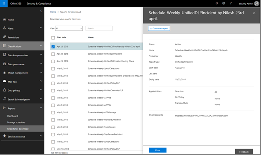

# 在安全&amp;合规中心中设置和下载自定义报告

在[安全&amp;合规性中心](https://protection.office.com)中, 有几个[报告和见解](reports-and-insights-in-security-and-compliance.md)可帮助您的组织的安全团队缓解和解决您的组织面临的威胁。如果您是组织的安全团队的成员, 则可以使用自定义日期范围和筛选器配置报表, 然后下载自定义报表。 
  
## 下载自定义报告

> [!IMPORTANT]
> 确保您对[Office 365 安全&amp;合规中心](permissions-in-the-security-and-compliance-center.md)具有必要的权限。通常情况下, Office 365 全局管理员、安全管理员和安全读者可以访问安全&amp;合规性中心中的报告。 
  
1. 在 "[安全&amp;合规性中心](https://protection.office.com)" 中, 转到 "**报告** \> "**仪表板**。
    
2. 选择报告。(在此示例中, 我们将使用邮件处置报表。) 
  
3. 在报表的左上角, 选择 "**请求报告**"。
    
4. 在 "**请求报告**" 对话框中, 指定报告的名称、开始日期和结束日期。然后选择 "**下一步**"。 
  
5. 指定要用于报表的任何筛选器。(例如, 您可以为邮件处置报告指定客户端 IP 地址。)然后选择 "**下一步**"。
    
6. 指定报表的电子邮件收件人, 然后选择 "**保存**"。
    
## 相关主题

[Office 365 安全&amp;合规中心中的报告和见解](reports-and-insights-in-security-and-compliance.md)
  
[在安全&amp;合规中心中创建报表的日程安排](create-a-schedule-for-a-report.md)
  
[管理安全&amp;合规中心中报告的日程安排](manage-schedules-for-multiple-reports.md)
  
[下载安全&amp;合规性中心中的现有报告](download-existing-reports.md)
  

