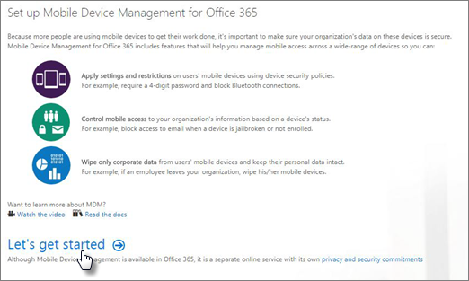
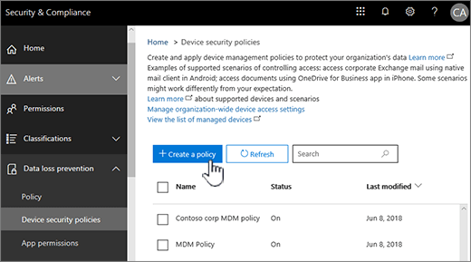

# 设置向上移动设备管理 (MDM) 在 Office 365 中Set up Mobile Device Management (MDM) in Office 365

Windows 电话和 Office 365 内置移动设备管理 (MDM) 可帮助您保护和管理 iPhones、 Ipad，Androids，如用户的移动设备。您可以创建和管理设备安全策略、 远程擦除设备和查看详细的设备报告。The built-in Mobile Device Management (MDM) for Office 365 helps you secure and manage your users' mobile devices like iPhones, iPads, Androids, and Windows phones. You can create and manage device security policies, remotely wipe a device, and view detailed device reports.
  
有问题？我们已将一起[常见问题，以帮助地址的常见问题](frequently-asked-questions-about-mdm.md)。请注意，不能使用[合作伙伴： 提供委派管理](https://support.office.com/article/26530dc0-ebba-415b-86b1-b55bc06b073e)for Office 365 中管理移动设备管理。Have questions? We've put together [a FAQ to help address common questions](frequently-asked-questions-about-mdm.md). Be aware that you cannot use a [Partners: Offer delegated administration](https://support.office.com/article/26530dc0-ebba-415b-86b1-b55bc06b073e) to manage Mobile Device Management for Office 365. 
  
设备管理是安全的一部分&amp;合规性中心，因此您将需要转那里以启动 MDM 安装程序。Device management is part of the Security &amp; Compliance Center so you'll need to go there to kick off MDM setup.
  
设置移动设备管理 Office 365 您将需要：To set up Mobile Device Management for Office 365 you'll need to:
  
1. [激活的移动设备管理服务Activate the Mobile Device Management service](#activate-the-mobile-device-management-service)  
2. [设置移动设备管理Set up Mobile Device Management](#set-up-mobile-device-management)
3. [确保用户注册其设备Make sure users enroll their devices](#step-4-recommended-manage-device-security-policies)
  
## 激活的移动设备管理服务Activate the Mobile Device Management service

1. 使用您的工作或学校帐户登录 Office 365。Sign in to Office 365 with your work or school account. 
    
2. 转到[安全&amp;合规性中心](https://protection.office.com)。Go to [Security &amp; Compliance Center](https://protection.office.com).
    
3. 导航到**数据丢失防护** \> **设备管理**，然后单击**让我们开始吧**以启动的激活过程。Navigate to **Data loss prevention** \> **Device management** and click **Let's get started** to kick off the activation process. 
    
    
  
4. 我们创建的默认安全策略，用于帮助您开始。更新在此页上的安全策略的名称，然后单击**启动安装程序**。We created a default security policy for you to help you get started. Update the name of the security policy on this page, and then click **Start setup**.
    
    
  
5. 您将看到的安装程序屏幕上显示进度设置服务。You'll see the setup screen that shows progress on setting up the service.
    
    
  
> [!TIP]
> 您还可以查找**MDM 安装**通过搜索。在 Office 365 管理中心\>**主页**上，在**搜索**框中键入移动设备管理。>You can also locate **MDM Setup** through Search. In the Office 365 admin center \> **Home** page, type mobile device management in the **Search** box. > 
  
它可以花一些时间来激活的 Office 365 的移动设备管理但完成后，您会收到电子邮件的说明要执行的下一个步骤。It can take some time to activate Mobile Device Management for Office 365, but when it finishes, you'll receive an email that explains the next steps to take.
  
## 设置移动设备管理Set up Mobile Device Management

服务准备就绪后，完成以下四个步骤以完成安装。您可能需要安全中**设备管理**页上单击[管理设置](https://portal.office.com/EAdmin/Device/IntuneInventory.aspx)&amp;合规性中心以查看以下设置。When the service is ready, complete the following four steps to finish setup. You may need to click [Manage settings](https://portal.office.com/EAdmin/Device/IntuneInventory.aspx) on the **Device management** page in the Security &amp; Compliance Center to see the following settings. 
  

  
### 步骤 1: MDM （必需） 配置域Step 1: (Required) Configure domains for MDM

如果您没有与 Office 365 关联的自定义域名，或者如果您不管理 Windows 设备，则可以跳过本节。否则，您需要添加您的 DNS 主机的域的 DNS 记录。如果您已设置您的域与 Office 365 的一部分已，添加记录所有正在您设置。添加记录之后，您的组织中使用您的自定义域的电子邮件地址与 Windows 设备上登录的 Office 365 用户将重定向以在 MDM 注册 Office 365。If you don't have a custom domain associated with Office 365 or if you're not managing Windows devices, you can skip this section. Otherwise, you'll need to add DNS records for the domain at your DNS host. If you've added the records already, as part of setting up your domain with Office 365, you're all set. After you add the records, Office 365 users in your organization who sign in on their Windows device with an email address that uses your custom domain are redirected to enroll in MDM for Office 365.
  
需要帮助设置记录？在[为 Office 365 管理 DNS 记录时创建 DNS 记录](https://support.office.com/article/b0f3fdca-8a80-4e8e-9ef3-61e8a2a9ab23)中提供的列表中找到域名注册机构，然后选择要转到有关创建 DNS 记录的分步帮助的注册器名称。使用这些指令添加以下两个记录：Need help setting up the records? Find your domain registrar in the list provided in [Create DNS records for Office 365 when you manage your DNS records](https://support.office.com/article/b0f3fdca-8a80-4e8e-9ef3-61e8a2a9ab23) and select the registrar name to go to step-by-step help for creating DNS records. Use those instructions to add the following two records: 
  
|**主机名****Host name**|**记录类型****Record type**|**地址****Address**|**TTL****TTL**|
|:-----|:-----|:-----|:-----|
|EnterpriseEnrollmentEnterpriseEnrollment    |CNAMECNAME    |EnterpriseEnrollment.manage.microsoft.comEnterpriseEnrollment.manage.microsoft.com    |36003600    |
|EnterpriseRegistrationEnterpriseRegistration    |CNAMECNAME    |EnterpriseRegistration.windows.netEnterpriseRegistration.windows.net    |36003600    |
   
添加两个记录后，返回到安全&amp;合规性中心并导航到**设备管理** \> **管理设置**以完成下一步。After you add the two records, go back to the Security &amp; Compliance Center and navigate to **Device management** \> **Manage settings** to complete the next step. 
  
### 步骤 2: （必需） 配置的 iOS 设备 APNs 证书Step 2: (Required) Configure an APNs Certificate for iOS devices

若要管理如 iPad 和 Iphone iOS 设备，您需要创建 APNs 证书。To manage iOS devices like iPad and iPhones, you need to create an APNs certificate.
  
为此，请**设置移动设备管理页面**上的**设置**链接从按照的步骤。To do this, follow the steps from the **Set up** links on the **Setup mobile device management page**.
  
1. 旁边**配置 iOS 设备 APNs 证书**，选择**设置**。Next to **Configure a APNs Certificate for iOS devices**, select **Set up**.
    
2. 选择**下载 CSR 文件**并保存到这二者的证书签名请求将请记住在计算机上。Select **Download your CSR file** and save the Certificate signing request to a somewhere on your computer that you'll remember. 
    
    
  
3. 选择**下一步**。Select **Next**.
    
4. 创建 APN 证书。Create an APN certificate.
    
  - 选择以打开 Apple 推送证书门户**Apple APNS 门户**。Select **Apple APNS Portal** to open the Apple Push Certificates Portal. 
    
    
  
  - 登录 Apple id。Sign in with an Apple ID.
    
    > [!IMPORTANT]
    > 使用 Apple ID 与即使管理帐户的用户离开将保持与您的组织的电子邮件帐户关联的公司。保存此 ID，因为您需要在需要时续订证书使用相同的 ID。Use a company Apple ID associated with an email account that will remain with your organization even if the user who manages the account leaves. Save this ID because you'll need to use the same ID when it's time to renew the certificate. 
  
  - 选择**创建的证书**，并接受**使用条款**。Select **Create a Certificate** and accept the **Terms of Use**.
    
  - **浏览**证书签名请求从 Office 365 下载到您的计算机，并选择**上载**。**Browse** to the Certificate signing request you downloaded to your computer from Office 365 and select **Upload**.
    
  - **下载**APN 证书创建 Apple 推送证书门户到您的计算机。**Download** the APN certificate created by the Apple Push Certificate Portal to your computer. 
    
    > [!TIP]
    > 如果您在遇到问题下载证书，请刷新浏览器。If you're having trouble downloading the certificate, refresh your browser. 
  
5. 返回到 Office 365，并选择**下一步**，转到**上载 APNS 证书**页。Go back to Office 365 and select **Next** to get to the **Upload APNS certificate** page. 
    
6. 浏览到从 Apple 推送证书门户下载 APN 证书。Browse to the APN certificate you downloaded from the Apple Push Certificates Portal.
    
    
  
7. 选择**完成**。Select **Finish**.
    
添加 APN 证书后，返回到安全&amp;合规性中心并导航到**设备管理** \> **管理设置**以完成下一步。After you add APN Certificate, go back to the Security &amp; Compliance Center and navigate to **Device management** \> **Manage settings** to complete the next step. 
  
### 步骤 3： 设置多因素身份验证的 （推荐）Step 3: (Recommended) Set up multi-factor authentication

如果您看不到下**推荐步骤**多因素身份验证 (MFA)，则可以跳过本节。如果列出了此选项，我们建议您在 Azure AD 门户以增加的 Office 365 注册过程移动设备管理安全性开启 MFA。默认情况下，它处于状态。If you don't see multi-factor authentication (MFA) under **Recommended steps**, you can skip this section. If this option is listed, we recommend you turn on MFA in the Azure AD portal to increase the security of the Mobile Device Management for Office 365 enrollment process. It is turned off by default.
  
MFA 有助于防止通过要求第二个窗体的身份验证的移动设备注册到 Office 365 中的注册。用户所需确认电话呼叫、 文本消息或在其移动设备上的应用程序通知后正确地输入其工作帐户密码。完成此第二个表单的身份验证后，他们可以仅注册其设备。Office 365 中移动设备管理注册用户的设备后，用户可以访问 Office 365 资源与他们显示工作的所有服务器的帐户。MFA helps secure the sign in to Office 365 for mobile device enrollment by requiring a second form of authentication. Users are required to acknowledge a phone call, text message, or app notification on their mobile device after correctly entering their work account password. They can only enroll their device after this second form of authentication is completed. After users' devices are enrolled in Mobile Device Management for Office 365, users can access Office 365 resources with just their work account.
  
旁边**设置多因素身份验证**，请选择**设置**。若要了解如何在 Azure AD 门户中打开 MFA，请参阅[设置多因素身份验证](https://go.microsoft.com/fwlink/p/?LinkId=519255)。Next to **Set up multi-factor authentication**, select **Set up**. To learn how to turn on MFA in the Azure AD portal, see [Set up multi-factor authentication](https://go.microsoft.com/fwlink/p/?LinkId=519255).
  
设置 MFA 后，返回到安全&amp;合规性中心并导航到**设备管理** \> **管理设置**以完成下一步。After you set up MFA, go back to the Security &amp; Compliance Center and navigate to **Device management** \> **Manage settings** to complete the next step. 
  
### 步骤 4: （推荐） 管理设备安全策略Step 4: (Recommended) Manage device security policies

下一步是创建和部署设备安全策略，以帮助保护您的 Office 365 组织的数据。例如，可以帮助防止数据丢失，如果用户通过 5 分钟无活动之后创建到锁定设备策略丢失其设备和设备擦除后 3 登录失败。The next step is to create and deploy device security policies to help protect your Office 365 organization's data. For example, you can help prevent data loss if a user loses their device by creating a policy to lock devices after 5 minutes of inactivity and have devices wiped after 3 sign-in failures.
  
在**安全&amp;合规性中心**，请转到**安全策略** \> **设备安全策略**创建设备安全策略和访问规则。In the **Security &amp; Compliance Center**, go to **Security policies** \> **Device security policies** to create device security policies and access rules. 
  

  
有关如何创建新策略的循序渐进说明，请参阅[创建和部署设备安全策略](create-device-security-policies.md)。For step by step instructions on how to create a new policy, see [Create and deploy device security policies](create-device-security-policies.md).
  
> [!TIP]
>  创建新策略时，您可能想要设置以允许访问和报告策略违规其中用户设备不符合策略的策略。这样可以看到多少个移动设备会受到不阻止对 Office 365 的访问的策略。> 在组织中所有人都部署一个新的策略之前，我们建议使用少量用户的设备上对其进行测试。> 此外，部署策略之前，让您知道注册 Office 365 中 MDM 的设备的潜在影响的组织。如何设置策略，根据设备不符合这些 （不兼容的设备） 都可访问 Office 365 被阻止。安装的应用程序、 照片和其他个人信息的注册在设备上，无法删除如果擦除设备后，还可能具有非标准的设备。更多信息：[擦除 Office 365 中的移动设备](wipe-a-mobile-device.md)。When you create a new policy, you might want to set the policy to allow access and report policy violation where a user's device isn't compliant with the policy. This lets you see how many mobile devices would be impacted by the policy without blocking access to Office 365. >  Before you deploy a new policy to everyone in your organization, we recommend you test it on the devices used by a small number of users. >  Also, before you deploy policies, let your organization know the potential impacts of enrolling a device in MDM for Office 365. Depending on how you set up the policies, devices that don't comply with them (non-compliant devices) could be blocked from accessing Office 365. Non-compliant devices might also have apps installed, photos, and other personal information which, on an enrolled device, could be deleted if the device is wiped. More info: [Wipe a mobile device in Office 365](wipe-a-mobile-device.md). 
  
## 确保用户注册其设备Make sure users enroll their devices

您已创建和部署的移动设备管理策略后，设备策略应用于您组织内的每个许可的 Office 365 用户将收到注册消息的下次他们登录到 Office 365 从其移动设备。他们可以访问 Office 365 电子邮件和文档之前，他们必须完成的注册和激活步骤。请参阅[注册移动设备有工作或学校](enroll-your-mobile-device.md)。After you've created and deployed a mobile device management policy, each licensed Office 365 user in your organization that the device policy applies to will receive an enrollment message the next time they sign into Office 365 from their mobile device. They must complete the enrollment and activation steps before they can access Office 365 email and documents. See [Enroll your mobile device for work or school](enroll-your-mobile-device.md).
  
> [!IMPORTANT]
> 如果注册过程不支持用户的首选的语言，用户可能会在另一种语言中收到注册通知和其移动设备上的步骤。为移动设备上注册过程当前支持不是所有 Office 365 中都支持的语言。If a user's preferred language isn't supported by the enrollment process, users may receive enrollment notification and steps on their mobile devices in another language. Not all languages supported in Office 365 are currently supported for the enrollment process on mobile devices. 
  
Android 或 iOS 设备的用户需要安装的公司门户应用程序注册过程的一部分。Users with Android or iOS devices are required to install the Company Portal app as part of the enrollment process.
  
## 相关主题Related Topics

[移动设备管理功能Capabilities of Mobile Device Management](capabilities-of-mobile-device-management.md)
  
[创建和部署设备安全策略Create and deploy device security policies](create-device-security-policies.md)
  

