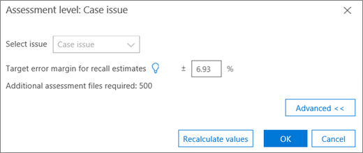

# Office 365 高级电子数据展示中的标记和评估

> [!NOTE]
> 若要使用高级电子数据展示，组织必须订阅随附高级合规性加载项的 Office 365 E3，或订阅 E5。如果没有此计划，但又要试用高级电子数据展示，可以[注册 Office 365 企业版 E5 试用版](https://go.microsoft.com/fwlink/p/?LinkID=698279)。 
  
本节介绍高级电子数据展示相关性评估模块的过程。 
  
## 执行评估培训和分析

1. 在 "**相关性\>跟踪**" 选项卡中, 单击 "**评估**以启动案例评估"。 
    
    例如, 在此过程中, 将创建一个包含500个文件的示例评估集, 并显示 "**标记**" 选项卡, 其中包含 "标记" 面板、显示的 "文件内容" 和 "其他标记" 选项。 
    
    
  
2. 查看示例中的每个文件, 为每个事例问题确定文件的相关性, 并使用 "**标记" 面板**窗格中的相关性 (R)、"不相关" ("NR") 和 "跳过" 按钮标记文件。 
    
    > [!NOTE]
    >  评估需要500带标记的文件。 如果文件被 "跳过", 您将收到更多文件以进行标记。 
  
3. 在示例中为所有文件添加标签后, 单击 "**计算**"。 
    
    评估当前错误边距和丰富程度将计算并显示在 "**相关性跟踪**" 选项卡中, 每个问题的详细信息都已展开, 如下所示。 有关此对话框的更多详细信息将在后面的 "审阅评估结果" 一节中介绍。 
    
    
  
    > [!TIP]
    > 默认情况下, 建议您在问题的评估进度指示器已完成时继续执行默认的下一步, 这表明评估示例已评审并标记了足够的相关文件。 > 否则, 如果要查看 "**跟踪**" 选项卡结果并控制错误和下一步的边距, 请依次单击 "**修改**至**下一步**" 和 "**继续评估**", 然后单击 **"确定"**。 
  
1. 单击 "**评估**" 复选框右侧的 "**修改**", 查看并指定每个问题的评估参数。 将显示每个问题的 "**评估级别**" 对话框, 如以下示例所示: 
    
    
  
    在 "**评估级**" 对话框中计算并显示问题的以下参数: 
    
    **撤回估计的目标误差**: 根据此值, 计算需要审阅的额外文件的估计数量。 用于撤回的边距大于 75%, 可信度为 95%。 
    
    **所需的其他评估文件**: 指示在当前错误边距的要求尚未满足时, 需要多少更多文件。 
    
2. 若要调整当前错误边距并查看不同误差边距的效果 (每个问题), 请执行以下操作:
    
1. 在 "**选择问题**" 列表中, 选择一个问题。 
    
2. 在 "**撤回估计的目标错误边距**" 中, 输入一个新值。
    
3. 单击 "**更新值**" 以查看调整的影响。 
    
3. 单击 "**评估级**" 对话框中的 "**高级**", 查看以下其他参数和详细信息: 
    
    
  
    **估计丰富**程度: 根据当前评估结果估计的丰富程度
    
    **对于 "假定撤回**:" 默认情况下, 目标错误边距适用于 75% 以上的召回。 如果要在不同的撤回值范围内更改此参数并控制错误的宽度, 请单击 "**编辑**"。 
    
    **置信度级别**: 默认情况下, 建议的误差边距为 95%。 如果要更改此参数, 请单击 "**编辑**"。 
    
    **预期丰富程度误差边距**: 如果已更新值, 则在审阅所有其他评估文件之后, 这是大量丰富的错误的预期边距。
    
    **所需的其他评估文件**: 根据已更新的值, 需要查看的其他评估文件的数量才能到达目标。
    
    **所需的评估文件总数**: 假设更新的值、检查所需的总评估文件。
    
    **评估中预期的相关文件数**: 在审阅所有其他评估文件后, 已知更新的值、整个评估中的预期相关文件数。
    
4. 如果更改了参数, 请单击 "**重新计算值**"。 完成后, 如果存在一个问题, 请单击 **"确定"** 保存更改 (如果有多个问题要查看或修改然后**完成**, 请单击 "**下一步**")。 
    
    如果存在多个问题, 在所有问题都经过评审或调整之后, 将显示一个**评估级别: 摘要**对话框, 如以下示例中所示。 
    
    
  
    在成功完成评估后, 请继续阅读相关培训中的下一阶段。
    
## 查看评估结果

在标记评估示例后, 评估结果将计算并显示在 "相关性跟踪" 选项卡中。
  
已展开的曲目显示中显示以下结果: 
  
- 评估撤回估计的当前错误边距
    
- 估计丰富程度
    
- 所需的其他评估文件 (审阅)
    
评估当前误差边距是高级电子数据展示建议的错误边距。 为 "所需的其他评估文件" 显示的数字对应于该建议。
  
评估进度指示器显示评估的完成级别, 在给定当前错误边距的情况下。 在进行评估时, 用户将标记另一个评估示例。
  
评估进度指示器显示评估为 "已完成" 时, 表示已完成评估示例评审并标记了足够的相关文件。 
  
展开的跟踪显示将显示建议的下一步、评估统计信息和对详细结果的访问权限。
  
当丰富程度极低时, 要生成有用的相关文件所需的额外评估文件数非常高。 然后, 高级电子数据展示将建议迁移到 "培训"。 评估进度指示器将带阴影显示, 并且不会有任何统计信息可用。 
  
如果没有基于统计的稳定性, 则会有较低级别的精确性和置信度的结果。 但是, 当您不需要知道找到的相关文件的百分比时, 可以使用这些结果查找相关文件。 同样, 此状态也可用于培训较低丰富的问题, 其中相关性分数可加快对与特定问题相关的文件的访问。
  
> [!TIP]
> 在 "**相关性\>跟踪**" 选项卡中, 展开 "问题显示" 中, 可以使用以下查看选项: > 建议的下一步, 如**下一步:** 通过单击 "**修改**" 按钮, 可以绕过标记 (每个问题)右键, 然后在**下一步**中选择不同的步骤。 如果评估进度指示器尚未完成, 则评估将是下一个推荐的选项, 以标记更多评估文件并提高统计信息准确性。 > 您可以通过单击 "**修改**", 并在 "**评估级别" 对话框**中更改 "**撤回估计" 的目标误差**, 然后单击 "**更新值**" 来更改错误边距并评估其影响。 此外, 在此对话框中, 可以通过单击 "**高级**" 来查看高级选项。 > 您可以通过单击 "**视图**" 来查看其他评估级别统计信息及其影响。 在显示的 "详细结果" 对话框中, 如果有至少500个标记的评估文件, 并且至少18个文件已标记为与问题相关, 则统计信息将可用于每个问题。 
  
## 另请参阅

[Office 365 高级电子数据展示](office-365-advanced-ediscovery.md)
  
[了解相关性方面的评估](assessment-in-relevance-in-advanced-ediscovery.md)
  
[标记和相关性培训](tagging-and-relevance-training-in-advanced-ediscovery.md)
  
[跟踪相关性分析](track-relevance-analysis-in-advanced-ediscovery.md)
  
[根据结果做出决定](decision-based-on-the-results-in-advanced-ediscovery.md)
  
[测试相关性分析](test-relevance-analysis-in-advanced-ediscovery.md)

