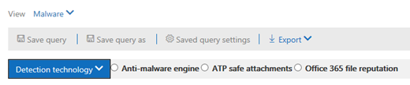
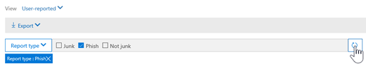

# 威胁资源管理器和实时检测Threat Explorer and real-time detections

如果您的组织具有[Office 365 高级威胁防护](office-365-atp.md)(OFFICE 365 ATP), 并且您拥有[必要的权限](#required-licenses-and-permissions), 则您可以使用**资源管理器**或**实时检测**(以前的*实时报告*)。[请参阅新增功能](#new-features-in-real-time-detections)!If your organization has [Office 365 Advanced Threat Protection](office-365-atp.md) (Office 365 ATP), and you have the [necessary permissions](#required-licenses-and-permissions), you have either **Explorer** or **real-time detections** (formerly *real-time reports* — [see what's new](#new-features-in-real-time-detections)!). 在安全 & 合规性中心中, 转到 "**威胁管理**", 然后选择 "**浏览器**" 或 "**实时检测**"。In the Security & Compliance Center, go to **Threat management**, and then choose **Explorer** OR **Real-time detections**. 

|在 ATP 计划2中, 您将看到:With ATP Plan 2, you see:  |在 ATP 计划1中, 您将看到:With ATP Plan 1, you see:  |
|---------|---------|
|      |         |

使用浏览器 (或实时检测) 时, 您将拥有一个强大的报告, 使安全操作团队能够有效地调查威胁并对其做出响应, 这与以下图像类似:With Explorer (or real-time detections), you have a powerful report that enables your Security Operations team to investigate and respond to threats effectively and efficiently, and it resembles the following image: 

使用此报告, 可以执行以下操作:With this report, you can:
- [查看 Office 365 安全功能检测到的恶意软件See malware detected by Office 365 security features](#see-malware-detected-in-email-by-technology)
- [查看有关仿冒 Url 的数据, 然后单击 "判定"View data about phishing URLs and click verdict](#view-data-about-phishing-urls-and-click-verdict)
- [从资源管理器中的视图启动自动调查和响应过程](#start-automated-investigation-and-response)(仅 ATP 计划 2)[Start an automated investigation and response process from a view in Explorer](#start-automated-investigation-and-response) (ATP Plan 2 only)
- ...[调查恶意电子邮件,](#more-ways-to-use-explorer-or-real-time-detections)等等!... [Investigate malicious email, and more](#more-ways-to-use-explorer-or-real-time-detections)!

## 实时检测中的新功能New features in real-time detections

下面概述了威胁资源管理器中新增的三个新功能。Three new features added into Threat Explorer are outlined below.

首先, 电子**邮件头预览和下载电子邮件正文**是威胁资源管理器中可用的新功能。First, **email header preview, and download of the email body** are new features available in Threat Explorer. 管理员将能够分析下载邮件头/电子邮件中的威胁。Admins will be able to analyse downloaded headers/emails for threats. 由于下载电子邮件可能会降低信息的暴露风险, 因此此过程由基于角色的访问控制 (RBAC) 控制。Because downloading emails can risk the exposure of information, this process is controlled by roles-based access control (RBAC). 必须将名为 "Preview" 的新角色添加到另一个 Office 365 角色组 (例如, 在 sec 操作 (或 sec 管理员) 中, 以授予在所有电子邮件视图中下载邮件和预览邮件头的功能。A new role, called 'Preview' must be added into another Office 365 role group (for example into sec operations, or sec admin) to grant the ability to download mails and preview headers in all-emails view.

但资源管理器 (和实时检测) 还添加了新的新字段, 旨在为你提供电子邮件领域中的位置的更完整了解。But Explorer (and real-time detections) also adds fresh new fields designed to give you a more complete picture of where your emails land. 此更改的目标部分是使搜索更易于进行安全操作人员, 但最终结果是了解问题电子邮件的位置。Part of the goal of this change is to make hunting easier for Security Ops people, but the net result is knowing the location of problem emails at a glance.

这是如何完成的？How is this done? 传递状态现已分为两列:Delivery Status is now broken out into two columns:

- **传递操作**-此电子邮件的状态是什么？**Delivery Action** - What is the status of this email?
- **送达位置**-此电子邮件的路由结果**Delivery Location** - Where was this email routed as a result?

传递操作是由于现有策略或检测而导致对电子邮件执行的操作。Delivery Action is the action taken on an email due to existing policies or detections. 以下是电子邮件可能执行的操作:Here are the possible actions an email can take:

|附带Delivered  |JunkedJunked  |BlockedBlocked  |代替Replaced  |
|---------|---------|---------|---------|
|电子邮件已传递到用户的收件箱或文件夹, 用户可以直接访问它。Email was delivered to Inbox or folder of a user and the user can directly access it.    | 电子邮件发送到用户的 "垃圾邮件" 文件夹或 "已删除" 文件夹, 并且用户有权访问这些文件夹中的电子邮件。Email was sent to either user’s Junk folder or Deleted folder, and the user has access to emails in those folders.       | 隔离的、失败的或已丢弃的任何电子邮件。Any emails that are quarantined, that  failed, or were dropped. 用户完全无法访问它!This is completely inaccessible by the user!     | 所有恶意附件都被替换为 .txt 文件的电子邮件, 以表明附件是恶意的。Any email where malicious attachments are replaced by .txt files that state the attachment was malicious.     |

用户可以看到的内容及其不能执行的操作:And here is what the user can see, and what they can't:

|最终用户可以访问Accessible to end users  |最终用户无法访问Inaccessible to end users  |
|---------|---------|
|附带Delivered     | BlockedBlocked        |
|JunkedJunked     | 代替Replaced        |

"送达位置" 显示运行送达后的策略和检测结果。Delivery location shows the results of policies and detections that run post-delivery. 它已链接到传递操作。It's linked to a Delivery Action. 添加此字段是为了深入了解在发现问题邮件时所采取的操作。This field was added to give insight into the action taken when a problem mail is found. 以下是送达位置的可能值:Here are the possible values of delivery location:

1. 收件箱或文件夹–电子邮件位于收件箱或文件夹中 (根据您的电子邮件规则)。Inbox or folder – The email is in inbox or a folder (according to your email rules).
2. 本地或外部–邮箱在云上不存在, 但在本地。On-prem or external – The mailbox doesn’t exist on cloud but is on-premises.
3. 垃圾邮件文件夹–在用户的 "垃圾邮件" 文件夹中的电子邮件。Junk folder – The email in in the Junk folder of a user.
4. "已删除邮件" 文件夹–用户的 "已删除邮件" 文件夹中的电子邮件。Deleted items folder – The email in the Deleted items folder of a user.
5. 隔离–隔离中的电子邮件, 并且不在用户的邮箱中。Quarantine – The email in quarantine, and is not in a user’s mailbox.
6. 失败–电子邮件无法访问邮箱。Failed – The email failed to reach the mailbox.
7. 丢弃–电子邮件在邮件流中的某个位置丢失。Dropped – The email gets lost somewhere in the Mailflow.

**电子邮件日程表**是另一个新的浏览器功能, 旨在提高管理员的求职体验。The **Email Timeline** is another new Explorer feature aimed at making the hunting experience better for admins. 它会在随机时减少, 因为检查不同位置以尝试了解事件的时间较少。It cuts down on randomization because there is less time spent checking different locations to try to understand the event. 当电子邮件上的多个事件发生时, 或在同一时间结束时, 这些事件将显示在 "日程表" 视图中。When multiple events happen at, or close to, the same time on an email, those events will show up in a timeline view. 事实上, 在传递给邮件的某些事件将在 "特殊操作" 列中捕获。In fact, some events that happen post-delivery to your mail will be captured in the 'Special action' column. 将该邮件的时间线中的信息与邮件投递后执行的特殊操作组合在一起, 管理员可以了解其策略的工作方式, 即最后路由邮件的位置, 在某些情况下, 最终评估是什么。Combining the information from the timeline of that mail with the special action taken on the mail post-delivery will give admins insight into how their policies work, where the mail was finally routed, and, in some cases, what the final assessment was.

有关调查恶意电子邮件的详细讨论, 请参阅[查找和调查 Office 365 中提供的恶意电子邮件](https://docs.microsoft.com/en-us/office365/securitycompliance/investigate-malicious-email-that-was-delivered)。For more discussion about investigating malicious emails see [Find and investigate malicious email that was delivered in Office 365](https://docs.microsoft.com/en-us/office365/securitycompliance/investigate-malicious-email-that-was-delivered).

## 查看电子邮件中的技术检测到恶意软件See malware detected in email by technology

假设您想要查看 Office 365 技术在电子邮件中检测到的恶意软件。Suppose you want to see malware detected in email, by Office 365 technology. 为此, 请使用[电子邮件 >](threat-explorer-views.md#email--malware)浏览器 (或实时检测) 的恶意软件视图。To do this, use the [Email > Malware](threat-explorer-views.md#email--malware) view of Explorer (or real-time detections).

1. 在 "安全性 & 合规性中心[https://protection.office.com](https://protection.office.com)() 中, 选择"**威胁管理** > **资源管理器**"(或"**实时检测**")。In the Security & Compliance Center ([https://protection.office.com](https://protection.office.com)), choose **Threat management** > **Explorer** (or **Real-time detections**). (此示例使用 Explorer。)(This example uses Explorer.)

2. 在 "**视图**" 菜单中, 选择 "**电子邮件** > **恶意软件**"。In the **View** menu, choose **Email** > **Malware**.  

3. 单击 "**发件人**", 然后选择 "**基本** > **检测技术**"。Click **Sender**, and then choose **Basic** > **Detection technology**. 您的检测技术现在可用作报告的筛选器。Your detection technologies are now available as filters for the report.   

4. 选择一个选项, 然后单击 "**刷新**" 按钮以应用该筛选器。Select an option, and then click the **Refresh** button to apply that filter.   

报告将刷新, 以显示使用您选择的技术选项在电子邮件中检测到恶意软件的结果。The report refreshes to show the results malware detected in email, using the technology option you selected. 在这里, 你可以进行进一步分析。From here, you can conduct further analysis.

## 查看有关仿冒 Url 的数据, 然后单击 "判定"View data about phishing URLs and click verdict

假定您要查看通过电子邮件中的 Url 进行的网络钓鱼尝试, 包括允许、阻止和重写的 Url 的列表。Suppose that you want to see phishing attempts through URLs in email, including a list of URLs that were allowed, blocked, and overridden. 标识所单击的 Url 需要配置[ATP 安全链接](atp-safe-links.md)。Identifying URLs that were clicked requires [ATP Safe links](atp-safe-links.md) to be configured. 确保已为单击时的保护设置了[Atp 安全链接策略](set-up-atp-safe-links-policies.md), 然后通过 ATP 安全链接单击 "verdicts" 进行日志记录。Make sure that you have set up [ATP Safe Links policies](set-up-atp-safe-links-policies.md) for time-of-click protection and logging of click verdicts by ATP Safe Links. 

若要查看邮件中的网络钓鱼 Url 并单击网络钓鱼邮件中的 Url, 请使用[电子邮件 >](threat-explorer-views.md#email--phish)浏览器 (或实时检测) 的网络钓鱼视图。To review phish URLs in messages and clicks on URLs in phish messages, use the [Email > Phish](threat-explorer-views.md#email--phish) view of Explorer (or real-time detections).

1. 在 "安全性 & 合规性中心[https://protection.office.com](https://protection.office.com)() 中, 选择"**威胁管理** > **资源管理器**"(或"**实时检测**")。In the Security & Compliance Center ([https://protection.office.com](https://protection.office.com)), choose **Threat management** > **Explorer** (or **Real-time detections**). (此示例使用 Explorer。)(This example uses Explorer.)

2. 在 "**视图**" 菜单中, 选择 "**电子邮件** > **网络钓鱼**"。In the **View** menu, choose **Email** > **Phish**.  

3. 单击 "**发件人**", 然后选择 " **url** > **" 单击 "判定"**。Click **Sender**, and then choose **URLs** > **Click verdict**.

4. 选择一个或多个选项 (如 "已**阻止**" 和 "**阻止被覆盖**"), 然后单击与应用该筛选器的选项位于同一行中的 "**刷新**" 按钮。Select one or more options, such as **Blocked** and **Block overridden**, and then click the **Refresh** button that is on the same line as the options to apply that filter. (不要刷新浏览器窗口。)(Don't refresh your browser window.)  

    报告将刷新, 以在报告下的 "URL" 选项卡上显示两个不同的 URL 表:The report refreshes to show two different URL tables on the URL tab under the report:

   - **上面的 url**是您已筛选出的邮件中包含的 url, 并且每个 URL 的电子邮件传递操作都会计数。**Top URLs** are the URLs contained in the messages you have filtered down to, and the email delivery action counts for each URL. 在网络钓鱼电子邮件视图中, 此列表通常包含合法的 Url。In the phish email view, this list typically will contain legitimate URLs. 攻击者在其邮件中加入了好和坏的 Url, 以尝试传递它们, 但它们会使用户更有趣地单击恶意链接。Attackers include a mix of good and bad URLs in their messages to try to get them delivered, but they will make the malicious links more interesting for the user to click. Url 表按总电子邮件计数进行排序 (注意: 此列不显示为简化视图)。The table of URLs is sorted by total email count (NOTE: This column is not shown to simplify the view).

   - 单击 "**上**一条" 可将已单击的安全链接包装的 url 按总点击次数排序 (此列也不显示为简化视图)。**Top clicks** are the Safe Links wrapped URLs that were clicked, sorted by total click count (this column is also not shown to simplify the view). "总计计数依据" 列指示安全链接单击每个单击的 URL 的 "已判定计数"。Total counts by column indicate the Safe Links click verdict count for each clicked URL. 在网络钓鱼电子邮件视图中, 这通常是可疑或恶意的 Url, 但可能包含网络钓鱼邮件中的干净 Url。In the phish email view, these are more often suspicious or malicious URLs, but could include clean URLs that are in phish messages. URL 单击未打开的链接将不会显示在此处。URL clicks on unwrapped links will not show up here.
   
   这两个 Url 表通过传递操作和位置显示网络钓鱼电子邮件中的前几个 Url, 并显示已阻止 (或在出现警告的情况下访问) 的 URL 单击, 以便您可以了解用户收到的潜在错误链接以及用户的交互情况。The two URLs tables show top URLs in phishing emails by delivery action and location, and they show URL clicks that were blocked (or visited despite a warning) so that you can understand what potential bad links were received by users and interacted with by users. 在这里, 你可以进行进一步分析。From here, you can conduct further analysis. 例如, 在图表下方, 您可以看到在组织的环境中被阻止的电子邮件中的最高 Url。For example, below the chart, you can see the top URLs in emails that were blocked in your organization's environment.
   
   
   
   选择一个 URL 以查看更详细的信息。Select a URL to view more detailed information. 请注意, 在 "URL 飞出" 对话框中, 将删除对电子邮件的筛选, 以向您显示在您的环境中 URL 公开的完整视图。Note that in the URL flyout dialog, the filtering on emails is removed to show you the full view of the URL's exposure in your environment. 这样, 您就可以在资源管理器中筛选出您关注的电子邮件, 查找潜在威胁的特定 Url, 然后展开您对环境中的 URL 公开的了解 (通过 URL 详细信息对话框), 而无需将 URL 筛选器添加到资源管理器视图本身。This lets you filter down emails in Explorer to ones you are concerned about, find specific URLs that are potential threats, then expand your understanding of the URL exposure in your environment (via the URL details dialog) without having to add URL filters to the Explorer view itself.

## 查看用户报告的电子邮件Review email messages reported by users

假设您想要查看您的组织中的用户使用[Outlook 和 web 上的 outlook 的报告邮件外接程序](enable-the-report-message-add-in.md)报告为垃圾邮件、非垃圾邮件或网络钓鱼的电子邮件。Suppose that you want to see email messages that users in your organization have reported as Junk, Not Junk, or Phishing by using the [Report Message add-in for Outlook and Outlook on the web](enable-the-report-message-add-in.md). 若要执行此操作, 请使用 "[电子邮件 > 提交](threat-explorer-views.md#email--submissions)" 浏览器 (或实时检测)。To do this, use the [Email > Submissions](threat-explorer-views.md#email--submissions) view of Explorer (or real-time detections).

1. 在 "安全性 & 合规性中心[https://protection.office.com](https://protection.office.com)() 中, 选择"**威胁管理** > **资源管理器**"(或"**实时检测**")。In the Security & Compliance Center ([https://protection.office.com](https://protection.office.com)), choose **Threat management** > **Explorer** (or **Real-time detections**). (此示例使用 Explorer。)(This example uses Explorer.)

2. 在 "**视图**" 菜单中, 选择 "**电子邮件** > **提交**"。In the **View** menu, choose **Email** > **Submissions**.  

3. 单击 "**发件人**", 然后选择 "**基本** > **报告类型**"。Click **Sender**, and then choose **Basic** > **Report type**.

4. 选择一个选项, 如 "**网络钓鱼**", 然后单击 "**刷新**" 按钮。Select an option, such as **Phish**, and then click the **Refresh** button.    

报告将刷新, 以显示组织中的人员已报告为网络钓鱼尝试的电子邮件的相关数据。The report refreshes to show data about email messages that people in your organization have reported as a phishing attempt. 您可以使用此信息进行进一步分析, 如有必要, 调整您的[ATP 反网络钓鱼策略](set-up-anti-phishing-policies.md)。You can use this information to conduct further analysis, and if necessary, adjust your [ATP anti-phishing policies](set-up-anti-phishing-policies.md).

## 启动自动调查和响应Start automated investigation and response

> [!NOTE]
> **Office 365 ATP 计划 2**和**Office 365 E5**中提供了自动调查和响应功能。Automated investigation and response capabilities are available in **Office 365 ATP Plan 2** and **Office 365 E5**.

(新!)[自动化调查和响应](automated-investigation-response-office.md)可在调查和缓解网络攻击方面为安全操作团队节省大量时间和精力。(NEW!) [Automated investigation and response](automated-investigation-response-office.md) can save your security operations team much time and effort in investigating and mitigating cyber attacks. 除了配置可触发安全行动手册的警报外, 还可以从资源管理器中的视图启动自动调查和响应过程。In addition to configuring alerts that can trigger a security playbook, you can start an automated investigation and response process from a view in Explorer. 

有关此操作的详细信息, 请参阅[示例: 安全管理员从资源管理器触发调查](automated-investigation-response-office.md#example-a-security-administrator-triggers-an-investigation-from-threat-explorer)。For details on this, see [Example: A security administrator triggers an investigation from Explorer](automated-investigation-response-office.md#example-a-security-administrator-triggers-an-investigation-from-threat-explorer).

## 使用资源管理器 (或实时检测) 的更多方法More ways to use Explorer (or real-time detections)

除了本文中介绍的方案之外, 您还可以使用浏览器 (或实时检测) 中提供的更多报告选项。In addition to the scenarios outlined in this article, you have many more reporting options available with Explorer (or real-time detections). 
- [查找和调查投递的恶意电子邮件Find and investigate malicious email that was delivered](investigate-malicious-email-that-was-delivered.md)
- [查看 SharePoint Online、OneDrive 和 Microsoft 团队中检测到的恶意文件View malicious files detected in SharePoint Online, OneDrive, and Microsoft Teams](malicious-files-detected-in-spo-odb-or-teams.md)
- [获取威胁资源管理器中的视图 (和实时检测) 的概述Get an overview of the views in Threat Explorer (and real-time detections)](threat-explorer-views.md)

## 必需的许可证和权限Required licenses and permissions

您必须具有[Office 365 ATP](office-365-atp.md)才能获取资源管理器或实时检测。You must have [Office 365 ATP](office-365-atp.md) to get Explorer or real-time detections.
- 资源管理器包含在 Office 365 ATP 计划2中。Explorer is included in Office 365 ATP Plan 2. 
- 实时检测报告包含在 Office 365 ATP 计划1中。The real-time detections report is included in Office 365 ATP Plan 1.
- 计划为应由 ATP 保护的所有用户分配许可证。Plan to assign licenses for all users who should be protected by ATP. (资源管理器或实时检测将显示许可用户的检测数据。)(Explorer or real-time detections will show detection data for licensed users.)

若要查看和使用资源管理器或实时检测, 您必须具有适当的权限, 例如, 授予安全管理员或安全阅读者的权限。To view and use Explorer or real-time detections, you must have appropriate permissions, such as those granted to a security administrator or security reader. 

- 对于安全&amp;合规中心, 您必须具有以下分配的角色之一:For the Security &amp; Compliance Center, you must have one of the following roles assigned:
    - 组织管理Organization Management
    - 安全管理员 (可在 Azure Active Directory 管理中心中分配 ([https://aad.portal.azure.com](https://aad.portal.azure.com)))Security Administrator (this can be assigned in the Azure Active Directory admin center ([https://aad.portal.azure.com](https://aad.portal.azure.com)))
    - 安全读者Security Reader

- 对于 Exchange Online, 必须在 Exchange 管理中心 ([https://outlook.office365.com/ecp](https://outlook.office365.com/ecp)) 或 PowerShell cmdlet 中分配以下角色之一 (请参阅[Exchange Online PowerShell](https://docs.microsoft.com/powershell/exchange/exchange-online/exchange-online-powershell?view=exchange-ps)):For Exchange Online, you must have one of the following roles assigned in either the Exchange admin center ([https://outlook.office365.com/ecp](https://outlook.office365.com/ecp)) or with PowerShell cmdlets (See [Exchange Online PowerShell](https://docs.microsoft.com/powershell/exchange/exchange-online/exchange-online-powershell?view=exchange-ps)):
    - 组织管理Organization Management
    - 仅限查看组织管理View-only Organization Management
    - “仅供查看收件人”角色View-Only Recipients role
    - 合规性管理Compliance Management

若要了解有关角色和权限的详细信息, 请参阅以下资源:To learn more about roles and permissions, see the following resources:

- [Permissions in the Office 365 Security &amp; Compliance CenterPermissions in the Office 365 Security &amp; Compliance Center](permissions-in-the-security-and-compliance-center.md)
- [Exchange Online 中的功能权限Feature permissions in Exchange Online](https://docs.microsoft.com/exchange/permissions-exo/feature-permissions)
  
## 威胁导出程序和实时检测的区别Some differences between Threat Exporter and real-time detections

 - Office 365 ATP 计划1中提供了**实时检测**报告, 而**威胁浏览器**在 office 365 atp 计划2中可用。The **real-time detections** report is available in Office 365 ATP Plan 1, whereas **Threat Explorer** is available in Office 365 ATP Plan 2.
 - **实时检测**报告允许你实时查看检测。The **real-time detections** report allows you to view detections in real-time. **威胁资源管理器**也会执行此功能, 但也允许您查看给定攻击的其他详细信息。**Threat Explorer** does this as well, but also allows you to view additional details for a given attack.
