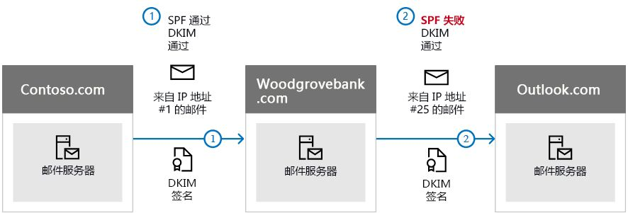

# <a name="use-dkim-to-validate-outbound-email-sent-from-your-custom-domain-in-office-365"></a>使用 DKIM 在 Office 365 中验证从自定义域发送的出站电子邮件

 **摘要:** 本文介绍如何使用域密钥识别的邮件 (DKIM) 和 Office 365, 以确保目标电子邮件系统信任从自定义域发送出站的邮件。 
  
除了使用 SPF 和 DMARC 之外，还应使用 DKIM，这样有助于防止欺骗程序假冒从你的域发送邮件。可以使用 DKIM 将数字签名添加到电子邮件的邮件头中。这听起来很复杂，其实不然。配置 DKIM 时，可以使用加密身份验证，授权你的域将域名与电子邮件相关联，或在电子邮件中签署域名。接收从你的域发送的电子邮件的电子邮件系统可以使用此数字签名来确定收到的传入电子邮件是否合法。
  
一般来说，可以使用私钥在域的传出电子邮件中加密邮件头。向域 DNS 记录发布公钥，然后接收服务器可用来解码签名。接收服务器使用公钥来确认邮件是否确实是你发送的，而不是假冒你的域的欺骗程序发送的。
  
Office 365 自动为初始域设置 DKIM。 初始域是指 Office 365 在你注册此服务时为你创建的域，例如 contoso.onmicrosoft.com。 无需执行任何操作，即可为初始域设置 DKIM。 有关域的详细信息, 请参阅[域 FAQ](https://support.office.com/article/Domains-FAQ-1272bad0-4bd4-4796-8005-67d6fb3afc5a#bkmk_whydoihaveanonmicrosoft.comdomain)。
  
也可以选择不为自定义域配置 DKIM。如果你没有为自定义域设置 DKIM，Office 365 会创建私钥和公钥对，启用 DKIM 签名，然后为自定义域配置 Office 365 默认策略。虽然这足以覆盖大多数 Office 365 客户，但在以下情况下，仍应为自定义域手动配置 DKIM：
  
- 在 Office 365 中拥有多个自定义域
    
- 您同时要设置 DMARC（推荐）
    
- 您想要控制您的私钥
    
- 您要自定义 CNAME 记录
    
- 你想为源自第三方域的电子邮件设置 DKIM 密钥，例如，如果你使用第三方群发邮件程序。
    
本文内容：
  
- [DKIM 如何能够比 SPF 更有效地防止 Office 365 中的恶意欺骗现象](use-dkim-to-validate-outbound-email.md#HowDKIMWorks)
    
- [在 Office 365 中手动设置 DKIM 需要执行的操作](use-dkim-to-validate-outbound-email.md#SetUpDKIMO365)
    
- [在 Office 365 中为多个自定义域配置 DKIM 的具体步骤](use-dkim-to-validate-outbound-email.md#DKIMMultiDomain)
    
- [在 Office 365 中为自定义域禁用 DKIM 签名策略](use-dkim-to-validate-outbound-email.md#DisableDKIMSigningPolicy)
    
- [DKIM 和 Office 365 的默认行为](use-dkim-to-validate-outbound-email.md#DefaultDKIMbehavior)
    
- [设置 DKIM 以便第三方服务可以代表自定义域发送或假冒电子邮件](use-dkim-to-validate-outbound-email.md#SetUp3rdPartyspoof)
    
- [后续步骤：为 Office 365 设置 DKIM 之后](use-dkim-to-validate-outbound-email.md#DKIMNextSteps)
    
## <a name="how-dkim-works-better-than-spf-alone-to-prevent-malicious-spoofing-in-office-365"></a>DKIM 如何能够比 SPF 更有效地防止 Office 365 中的恶意欺骗现象
<a name="HowDKIMWorks"> </a>

虽然 SPF 将信息添加到邮件信封中，但实际上是 DKIM 在邮件头中加密签名。当你转发邮件时，转发服务器可能会截除邮件信封部分。由于数字签名作为电子邮件头的一部分与电子邮件同时存在，因此即使当邮件进行了转发，DKIM 也仍在运行，如以下示例所示。
  

  
在此示例中，如果您只发布了域的一条 SPF TXT 记录，收件人的邮件服务器可能已将您的电子邮件标记为垃圾邮件，并生成一个误报结果。在这种情况下，添加 DKIM 可以减少误报垃圾邮件报告。由于 DKIM 依赖于公钥加密（而不仅仅对 IP 地址加密）进行身份验证，DKIM 被认为是比 SPF 更强大的身份验证形式。建议在部署中同时使用 SPF、DKIM 以及 DMARC。
  
具体功能：DKIM 使用私钥将加密的签名插入邮件头。在邮件头中，将签名域或出站域作为 **d =** 字段中的值插入。然后，验证域或收件人的域使用 **d =** 字段从 DNS 中查找公钥，对邮件进行身份验证。如果邮件已经过验证，则 DKIM 检查通过。 
  
## <a name="what-you-need-to-do-to-manually-set-up-dkim-in-office-365"></a>在 Office 365 中手动设置 DKIM 需要执行的操作
<a name="SetUpDKIMO365"> </a>

要配置 DKIM，您需要完成以下步骤：
  
- [在 DNS 中发布自定义域的两条 CNAME 记录](use-dkim-to-validate-outbound-email.md#Publish2CNAME)
    
- [在 Office 365 中为自定义域启用 DKIM 签名](use-dkim-to-validate-outbound-email.md#EnableDKIMinO365)
    
### <a name="publish-two-cname-records-for-your-custom-domain-in-dns"></a>在 DNS 中发布自定义域的两条 CNAME 记录
<a name="Publish2CNAME"> </a>

对于您要为其在 DNS 中添加 DKIM 签名的每个域，您需要发布两条 CNAME 记录。 DNS 使用 CNAME 记录指定域的 规范名称是否是其他域名的别名。 应在公开提供的 DNS 服务器上为自定义的域创建 CNAME 记录。 DNS 中的 CNAME 记录将指向已在 Microsoft DNS 服务器上的 Office 365 的 DNS 中创建的记录。
  
 Office 365 使用你创建的两条记录执行自动密钥轮替。如果在 Office 365 中除了初始域外你还预配了自定义域，必须为额外配置的每个域发布两条 CNAME 记录。因此，如果有两个域，就必须发布两条额外的 CNAME 记录，依此类推。
  
对 CNAME 记录使用以下格式。

> [!IMPORTANT]
> 如果你是我们的一家 GCC 高级客户, 则会以不同的方式计算_domainGuid_ ! 而不是查找您的_initialDomain_的 MX 记录来计算_domainGuid_, 而是直接从自定义域进行计算。 例如, 如果您的自定义域是 "contoso.com", 则 domainGuid 将变成 "contoso-com", 任何句点都将替换为短划线。 因此, 无论您的 initialDomain 指向什么 MX 记录, 您都将始终使用上面的方法来计算在您的 CNAME 记录中使用的 domainGuid。

  
```
Host name:          selector1._domainkey
Points to address or value: selector1-<domainGUID>._domainkey.<initialDomain> 
TTL:                3600

Host name:          selector2._domainkey
Points to address or value: selector2-<domainGUID>._domainkey.<initialDomain> 
TTL:                3600
```

其中：
  
- 对于 Office 365，选择器将始终为"selector1"或"selector2"。 
    
- _domainGUID_与在 mail.protection.outlook.com 之前出现的自定义域的自定义 MX 记录中的_domainGUID_相同。 例如, 在域 contoso.com 的以下 MX 记录中, _domainGUID_是 contoso-com: 
    
    ```
    contoso.com.  3600  IN  MX   5 contoso-com.mail.protection.outlook.com
    ```

- _initialDomain_ 是你注册 Office 365 时所使用的域。 初始域始终以 onmicrosoft.com 结束。 有关确定初始域的信息, 请参阅[域 FAQ](https://support.office.com/article/1272bad0-4bd4-4796-8005-67d6fb3afc5a#bkmk_whydoihaveanonmicrosoft.comdomain)。
    
例如，如果你有一个初始域 cohovineyardandwinery.onmicrosoft.com，以及两个自定义域 cohovineyard.com 和 cohowinery.com，那么你需要为额外配置的每个域设置两条 CNAME 记录，总共四条 CNAME 记录。
  
```
Host name:          selector1._domainkey
Points to address or value: **selector1-cohovineyard-com**._domainkey.cohovineyardandwinery.onmicrosoft.com
TTL:                3600

Host name:          selector2._domainkey
Points to address or value: **selector2-cohovineyard-com**._domainkey.cohovineyardandwinery.onmicrosoft.com
TTL:                3600

Host name:          selector1._domainkey
Points to address or value: **selector1-cohowinery-com**._domainkey.cohovineyardandwinery.onmicrosoft.com 
TTL:                3600
 
Host name:          selector2._domainkey
Points to address or value: **selector2-cohowinery-com**._domainkey.cohovineyardandwinery.onmicrosoft.com 
TTL:                3600
```

### <a name="enable-dkim-signing-for-your-custom-domain-in-office-365"></a>在 Office 365 中为自定义域启用 DKIM 签名
<a name="EnableDKIMinO365"> </a>

在 DNS 中发布了 CNAME 记录后，就可以通过 Office 365 启用 DKIM 签名。 您可以通过 Microsoft 365 管理中心或使用 PowerShell 执行此操作。
  
#### <a name="to-enable-dkim-signing-for-your-custom-domain-through-the-admin-center"></a>通过管理中心为您的自定义域启用 DKIM 签名

1. [登录到 Office 365](https://support.office.microsoft.com/article/e9eb7d51-5430-4929-91ab-6157c5a050b4) 
    
2. 依次选择左上角的应用启动器图标和" **管理员**"。
    
3. In the lower-left navigation, expand **Admin** and choose **Exchange**.
    
4. 依次转到" **保护**"\>" **dkim**"。
    
5. 选择要对其启用 DKIM 的域，然后对" **对此域的邮件进行 DKIM 签名**"选择" **启用**"。为每个自定义域重复执行这一步。
    
#### <a name="to-enable-dkim-signing-for-your-custom-domain-by-using-powershell"></a>使用 PowerShell 为自定义域启用 DKIM 签名

1. [连接到 Exchange Online PowerShell](https://technet.microsoft.com/library/jj984289.aspx)。
    
2. 运行以下命令：
    
    ```
    New-DkimSigningConfig -DomainName <domain> -Enabled $true
    ```

   其中, _domain_是您要为其启用 DKIM 签名的自定义域的名称。 
    
   例如，对于域 contoso.com：
    
    ```
    New-DkimSigningConfig -DomainName contoso.com -Enabled $true
    ```

#### <a name="to-confirm-dkim-signing-is-configured-properly-for-office-365"></a>确认已为 Office 365 正确配置 DKIM 签名

请等待几分钟，然后按以下步骤操作，确认是否已正确配置 DKIM。这样就有时间将域的 DKIM 信息分布到整个网络了。
  
- 从 Office 365 中启用了 DKIM 的域帐户发送一封邮件到其他电子邮件帐户（如 outlook.com 或 Hotmail.com）。
    
- 不要将 aol.com 帐户用于测试目的。如果 SPF 检查通过，AOL 可能会跳过 DKIM 检查。这会使测试无效。
    
- 打开邮件，然后查看邮件头。查看邮件头的说明因邮件客户端而异。有关在 Outlook 中查看邮件头的说明，请参阅[查看电子邮件头](https://support.office.com/article/CD039382-DC6E-4264-AC74-C048563D212C)。

  进行了 DKIM 签名的邮件将包含主机名以及您在发布 CNAME 条目时定义的域。该邮件如下例所示： 
    
    ```
    From: Example User <example@contoso.com> 
    DKIM-Signature: v=1; a=rsa-sha256; q=dns/txt; c=relaxed/relaxed; 
        s=selector1; d=contoso.com; t=1429912795; 
        h=From:To:Message-ID:Subject:MIME-Version:Content-Type; 
        bh=<body hash>; 
        b=<signed field>;
    ```

- 查找身份验证结果标头。尽管每个接收服务用于标记传入邮件的格式稍有不同，但结果应都包括以下类似内容： **DKIM=pass** 或 **DKIM=OK** 
    
## <a name="to-configure-dkim-for-more-than-one-custom-domain-in-office-365"></a>在 Office 365 中为多个自定义域配置 DKIM 的具体步骤
<a name="DKIMMultiDomain"> </a>

如果你在将来决定添加其他自定义域，并且想要为新域启用 DKIM，必须为每个域完成本文中介绍的步骤。尤其需要完成[在 Office 365 中手动设置 DKIM 需要执行的操作](use-dkim-to-validate-outbound-email.md#SetUpDKIMO365)中的所有步骤。
  
## <a name="disabling-the-dkim-signing-policy-for-a-custom-domain-in-office-365"></a>在 Office 365 中为自定义域禁用 DKIM 签名策略
<a name="DisableDKIMSigningPolicy"> </a>

禁用签名策略不会完全禁用 DKIM。一段时间后，Office 365 将自动为您的域应用默认的 Office 365 策略。有关详细信息，请参阅 [DKIM 和 Office 365 的默认行为](use-dkim-to-validate-outbound-email.md#DefaultDKIMbehavior)。
  
### <a name="to-disable-the-dkim-signing-policy-by-using-windows-powershell"></a>使用 Windows PowerShell 禁用 DKIM 签名策略

1. [连接到 Exchange Online PowerShell](https://technet.microsoft.com/library/jj984289.aspx)。
    
2. 为您要为其禁用 DKIM 签名的每个域运行以下命令之一。
    
    ```
    $p=Get-DkimSigningConfig -identity <domain>
    $p[0] | set-DkimSigningConfig -enabled $false
    ```

   例如：
    
    ```
    $p=Get-DkimSigningConfig -identity contoso.com
    $p[0] | set-DkimSigningConfig -enabled $false
    ```

   或
    
    ```
    Set-DkimSigningConfig -identity $p[<number>].identity -enabled $false
    ```

    其中, _number_是策略的索引。 例如： 
    
    ```
    Set-DkimSigningConfig -identity $p[0].identity -enabled $false
    ```

## <a name="default-behavior-for-dkim-and-office-365"></a>DKIM 和 Office 365 的默认行为
<a name="DefaultDKIMbehavior"> </a>

如果不启用 DKIM, Office 365 将自动为您的默认域创建1024位 DKIM 公钥, 以及在我们的数据中心内部存储的关联私钥。 默认情况下，Office 365 对没有合适策略的域使用默认签名配置。 也就是说，如果你未自行设置 DKIM，Office 365 将使用其默认策略，以及其为域启用 DKIM 所创建的密钥。
  
此外，如果在启用 DKIM 签名之后禁用它，一段时间后，Office 365 将自动为域应用 Office 365 默认策略。
  
在以下示例中，假定 fabrikam.com 的 DKIM 已由 Office 365（而不是域管理员）启用。这表明 DNS 中没有所需的 CNAME。来自此域的电子邮件的 DKIM 签名如下所示：
  
```
From: Second Example <second.example@fabrikam.com> 
DKIM-Signature: v=1; a=rsa-sha256; q=dns/txt; c=relaxed/relaxed; 
    s=selector1-fabrikam-com; d=contoso.onmicrosoft.com; t=1429912795; 
    h=From:To:Message-ID:Subject:MIME-Version:Content-Type; 
    bh=<body hash>; 
    b=<signed field>;
```

在此示例中，主机名和域包含在 fabrikam.com 的 DKIM 签名由域管理员启用情况下 CNAME 将指向的值。 发送自 Office 365 的每封邮件将最终进行 DKIM 签名。 如果自行启用 DKIM，该域将与发件人地址（此例中为 fabrikam.com）中的域相同。 如果不自行启用，该域将不同于发件人地址中的域，而是会使用组织的初始域。 有关确定初始域的信息, 请参阅[域 FAQ](https://support.office.com/article/1272bad0-4bd4-4796-8005-67d6fb3afc5a#bkmk_whydoihaveanonmicrosoft.comdomain)。
  
## <a name="set-up-dkim-so-that-a-third-party-service-can-send-or-spoof-email-on-behalf-of-your-custom-domain"></a>设置 DKIM 以便第三方服务可以代表自定义域发送或假冒电子邮件
<a name="SetUp3rdPartyspoof"> </a>

一些批量电子邮件服务提供商或服务型软件提供商允许你为来自其服务的电子邮件设置 DKIM 密钥。这需要你自己和第三方之间进行协调，从而设置必要的 DNS 记录。任何两个组织的操作过程都不会完全相同。相反，此过程完全因组织而异。
  
显示为 contoso.com 和 bulkemailprovider.com 正确配置了 DKIM 的示例邮件如下所示：
  
```
Return-Path: <communication@bulkemailprovider.com>
 From: <sender@contoso.com>
 DKIM-Signature: s=s1024; d=contoso.com
 Subject: Here is a message from Bulk Email Provider's infrastructure, but with a DKIM signature authorized by contoso.com
```

在此示例中，为了获得该结果：
  
1. 批量电子邮件提供商为 Contoso 提供一个 DKIM 公钥。
    
2. Contoso 将 DKIM 密钥发布到 DNS 记录。
    
3. 发送电子邮件时，批量电子邮件提供商使用相应的私钥对密钥进行签名。这样一来，批量电子邮件提供商可以将 DKIM 签名附加到邮件头中。
    
4. 接收电子邮件系统通过对 From 中的域进行 DKIM-Signature d=\<domain\> 值验证来执行 DKIM 检查：(5322.From) 邮件的地址。在此示例中，值匹配：
    
    发件人 @**contoso.com**
    
    d =**contoso.com**
    
## <a name="next-steps-after-you-set-up-dkim-for-office-365"></a>后续步骤：为 Office 365 设置 DKIM 之后
<a name="DKIMNextSteps"> </a>

尽管 DKIM 旨在帮助防止欺骗，但 DKIM 与 SPF 和 DMARC 协同工作效果更佳。 设置了 DKIM 后，如果你尚未设置 SPF，则应执行此操作。 有关 SPF 的快速介绍以及如何快速配置 SPF 的信息，请参阅[Set up SPF in Office 365 to help prevent spoofing](set-up-spf-in-office-365-to-help-prevent-spoofing.md)。 有关 Office 365 如何使用 SPF 的更深入了解，或者有关故障排除或非标准部署（如混合部署）的信息，请开始阅读[How Office 365 uses Sender Policy Framework (SPF) to prevent spoofing](how-office-365-uses-spf-to-prevent-spoofing.md)。 之后，请参阅[使用 DMARC 验证 Office 365 中的电子邮件](use-dmarc-to-validate-email.md)。 [反垃圾邮件邮件头](anti-spam-message-headers.md)包括 Office 365 用于 DKIM 检查的语法和标头字段。 
  

