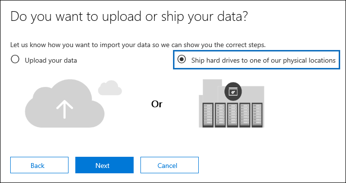
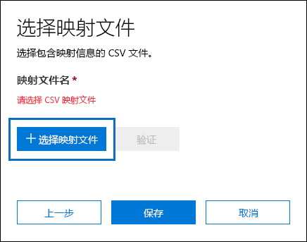
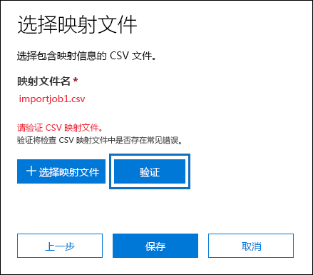
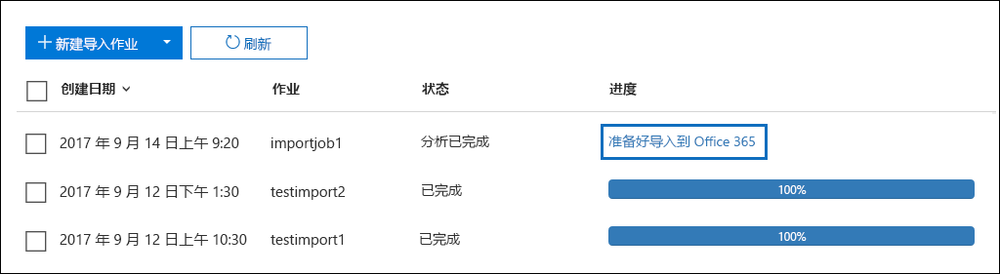
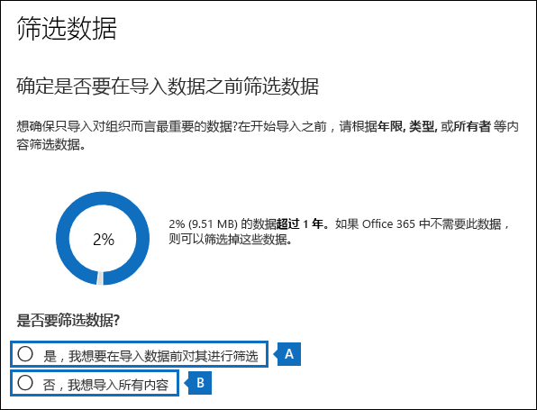
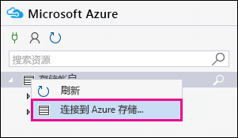
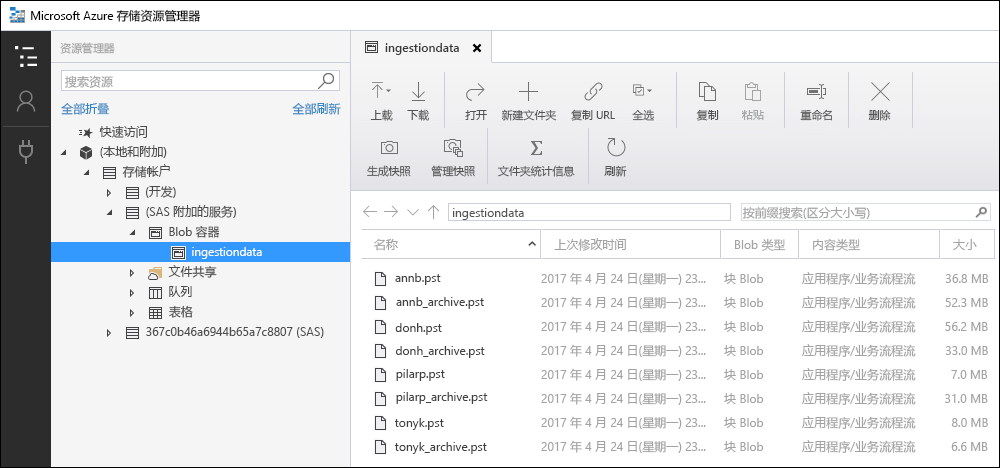
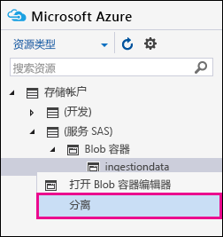

# <a name="use-drive-shipping-to-import-your-organization-pst-files-to-office-365"></a><span data-ttu-id="936e8-103">使用驱动器传送将组织的 PST 文件导入到 Office 365</span><span class="sxs-lookup"><span data-stu-id="936e8-103">Use drive shipping to import your organization PST files to Office 365</span></span>

<span data-ttu-id="936e8-104">**本文适用于管理员。您是否尝试将 PST 文件导入到自己的邮箱？请参阅[从 Outlook .pst 文件导入电子邮件、联系人和日历](https://go.microsoft.com/fwlink/p/?LinkID=785075)**</span><span class="sxs-lookup"><span data-stu-id="936e8-104">**This article is for administrators. Are you trying to import PST files to your own mailbox? See [Import email, contacts, and calendar from an Outlook .pst file](https://go.microsoft.com/fwlink/p/?LinkID=785075)**</span></span>
   
<span data-ttu-id="936e8-105">使用 Office 365 导入服务和驱动器传送将 PST 文件批量导入到用户邮箱。</span><span class="sxs-lookup"><span data-stu-id="936e8-105">Use the Office 365 Import service and drive shipping to bulk-import PST files to user mailboxes.</span></span> <span data-ttu-id="936e8-106">驱动器寄送意味着将 PST 文件复制到硬盘驱动器，然后按照实际方式将该驱动器寄到 Microsoft。</span><span class="sxs-lookup"><span data-stu-id="936e8-106">Drive shipping means that you copy the PST files to a hard disk drive and then physically ship the drive to Microsoft.</span></span> <span data-ttu-id="936e8-107">当 Microsoft 接收到您的硬盘驱动器时，数据中心工作人员会将数据从该硬盘驱动器复制到 Microsoft 云中的存储区域。</span><span class="sxs-lookup"><span data-stu-id="936e8-107">When Microsoft receives your hard drive, data center personnel will copy the data from the hard drive to a storage area in the Microsoft cloud.</span></span> <span data-ttu-id="936e8-108">然后, 您可以通过设置用于控制要导入哪些数据的筛选器来裁切实际导入到目标邮箱的 PST 数据。</span><span class="sxs-lookup"><span data-stu-id="936e8-108">Then you have the opportunity to trim the PST data that's actually imported to the target mailboxes by setting filters that control what data gets imported.</span></span> <span data-ttu-id="936e8-109">在您开始导入作业后, 导入服务会将 PST 数据从存储区域导入到用户邮箱。</span><span class="sxs-lookup"><span data-stu-id="936e8-109">After you start the import job, the Import service imports the PST data from the storage area to user mailboxes.</span></span> <span data-ttu-id="936e8-110">使用驱动器传送将 PST 文件导入到用户邮箱是将组织的电子邮件迁移到 Office 365 的一种方法。</span><span class="sxs-lookup"><span data-stu-id="936e8-110">Using drive shipping to import PST files to user mailboxes is one way to migrate your organization's email to Office 365.</span></span>
  
<span data-ttu-id="936e8-111">以下是使用驱动器发货将 PST 文件导入到 Office 365 邮箱所需的步骤:</span><span class="sxs-lookup"><span data-stu-id="936e8-111">Here are the steps required to use drive shipping to import PST files to Office 365 mailboxes:</span></span>
  
[<span data-ttu-id="936e8-112">步骤 1: 下载安全存储密钥和 PST 导入工具</span><span class="sxs-lookup"><span data-stu-id="936e8-112">Step 1: Download the secure storage key and PST Import tool</span></span>](#step-1-download-the-secure-storage-key-and-pst-import-tool)

[<span data-ttu-id="936e8-113">步骤 2: 将 PST 文件复制到硬驱</span><span class="sxs-lookup"><span data-stu-id="936e8-113">Step 2: Copy the PST files to the hard drive</span></span>](#step-2-copy-the-pst-files-to-the-hard-drive)

[<span data-ttu-id="936e8-114">步骤 3: 创建 PST 导入映射文件</span><span class="sxs-lookup"><span data-stu-id="936e8-114">Step 3: Create the PST Import mapping file</span></span>](#step-3-create-the-pst-import-mapping-file)

[<span data-ttu-id="936e8-115">步骤 4：在 Office 365 中创建 PST 导入作业</span><span class="sxs-lookup"><span data-stu-id="936e8-115">Step 4: Create a PST Import job in Office 365</span></span>](#step-4-create-a-pst-import-job-in-office-365)

[<span data-ttu-id="936e8-116">步骤 5：将硬盘驱动器寄送到 Microsoft</span><span class="sxs-lookup"><span data-stu-id="936e8-116">Step 5: Ship the hard drive to Microsoft</span></span>](#step-5-ship-the-hard-drive-to-microsoft)

[<span data-ttu-id="936e8-117">步骤 6: 筛选数据并启动 PST 导入作业</span><span class="sxs-lookup"><span data-stu-id="936e8-117">Step 6: Filter data and start the PST Import job</span></span>](#step-6-filter-data-and-start-the-pst-import-job)
  
> [!IMPORTANT]
> <span data-ttu-id="936e8-118">您必须执行步骤1一次, 以加载安全存储密钥和导入工具。</span><span class="sxs-lookup"><span data-stu-id="936e8-118">You have to perform Step 1 once to down load the secure storage key and the import tool.</span></span> <span data-ttu-id="936e8-119">执行这些步骤后, 请按照步骤2到步骤6操作, 每次要向 Microsoft 发送硬盘时。</span><span class="sxs-lookup"><span data-stu-id="936e8-119">After you perform these steps, follow Step 2 through Step 6 each time you want to ship a hard drive to Microsoft.</span></span> 
  
<span data-ttu-id="936e8-120">有关使用驱动器发货将 PST 文件导入到 Office 365 的常见问题, 请参阅[使用 drive 航运导入 pst 文件的常见问题解答](faqimporting-pst-files-to-office-365.md#using-drive-shipping-to-import-pst-files)。</span><span class="sxs-lookup"><span data-stu-id="936e8-120">For frequently asked questions about using drive shipping to import PST files to Office 365, see [FAQs for using drive shipping to import PST files](faqimporting-pst-files-to-office-365.md#using-drive-shipping-to-import-pst-files).</span></span> 
  
## <a name="before-you-begin"></a><span data-ttu-id="936e8-121">准备工作</span><span class="sxs-lookup"><span data-stu-id="936e8-121">Before you begin</span></span>

- <span data-ttu-id="936e8-122">您必须在 Exchange Online 中分配 "邮箱导入导出" 角色, 才能将 PST 文件导入到 Office 365 邮箱。</span><span class="sxs-lookup"><span data-stu-id="936e8-122">You have to be assigned the Mailbox Import Export role in Exchange Online to import PST files to Office 365 mailboxes.</span></span> <span data-ttu-id="936e8-123">默认情况下, 此角色不会分配给 Exchange Online 中的任何角色组。</span><span class="sxs-lookup"><span data-stu-id="936e8-123">By default, this role isn't assigned to any role group in Exchange Online.</span></span> <span data-ttu-id="936e8-124">You can add the Mailbox Import Export role to the Organization Management role group.</span><span class="sxs-lookup"><span data-stu-id="936e8-124">You can add the Mailbox Import Export role to the Organization Management role group.</span></span> <span data-ttu-id="936e8-125">Or you can create a new role group, assign the Mailbox Import Export role, and then add yourself as a member.</span><span class="sxs-lookup"><span data-stu-id="936e8-125">Or you can create a new role group, assign the Mailbox Import Export role, and then add yourself as a member.</span></span> <span data-ttu-id="936e8-126">有关详细信息, 请参阅[管理角色组](https://go.microsoft.com/fwlink/p/?LinkId=730688)中的 "向角色组添加角色" 或 "创建角色组" 部分。</span><span class="sxs-lookup"><span data-stu-id="936e8-126">For more information, see the "Add a role to a role group" or the "Create a role group" sections in [Manage role groups](https://go.microsoft.com/fwlink/p/?LinkId=730688).</span></span>
    
    <span data-ttu-id="936e8-127">此外, 若要在 Office 365 安全&amp;合规中心中创建导入作业, 必须满足以下条件之一:</span><span class="sxs-lookup"><span data-stu-id="936e8-127">Additionally, to create import jobs in the Office 365 Security &amp; Compliance Center, one of the following must be true:</span></span>
    
  - <span data-ttu-id="936e8-128">您必须在 Exchange Online 中向您分配 "邮件收件人" 角色。</span><span class="sxs-lookup"><span data-stu-id="936e8-128">You have to be assigned the Mail Recipients role in Exchange Online.</span></span> <span data-ttu-id="936e8-129">By default, this role is assigned to the Organization Management and Recipient Management roles groups.</span><span class="sxs-lookup"><span data-stu-id="936e8-129">By default, this role is assigned to the Organization Management and Recipient Management roles groups.</span></span>
    
    <span data-ttu-id="936e8-130">或者</span><span class="sxs-lookup"><span data-stu-id="936e8-130">Or</span></span>
    
  - <span data-ttu-id="936e8-131">您必须是 Office 365 组织中的全局管理员。</span><span class="sxs-lookup"><span data-stu-id="936e8-131">You have to be a global administrator in your Office 365 organization.</span></span>
    
    > [!TIP]
    > <span data-ttu-id="936e8-132">请考虑在 Exchange Online 中创建一个专门用于将 PST 文件导入到 Office 365 的新角色组。</span><span class="sxs-lookup"><span data-stu-id="936e8-132">Consider creating a new role group in Exchange Online that's specifically intended for importing PST files to Office 365.</span></span> <span data-ttu-id="936e8-133">若要获取导入 PST 文件所需的最低级别权限, 请将 "邮箱导入导出" 和 "邮件收件人" 角色分配给新的角色组, 然后添加成员。</span><span class="sxs-lookup"><span data-stu-id="936e8-133">For the minimum level of privileges required to import PST files, assign the Mailbox Import Export and Mail Recipients roles to the new role group, and then add members.</span></span> 
  
- <span data-ttu-id="936e8-134">您需要将要复制到硬盘中的 PST 文件存储在组织中的文件服务器或共享文件夹中。</span><span class="sxs-lookup"><span data-stu-id="936e8-134">You need to store the PST files that you want to copy to a hard drive on a file server or shared folder in your organization.</span></span> <span data-ttu-id="936e8-135">在步骤2中, 将运行 Azure 导入导出工具 (waimportexport.exe), 该工具会将存储在此文件服务器或共享文件夹上的 PST 文件复制到硬盘上。</span><span class="sxs-lookup"><span data-stu-id="936e8-135">In Step 2, you'll run the Azure Import Export tool (WAImportExport.exe) that will copy the PST files that are stored on this file server or shared folder to the hard drive.</span></span>
    
- <span data-ttu-id="936e8-136">仅2.5 英寸固态驱动器 (ssd) 或2.5 或3.5 英寸 SATA II/III 内置硬盘可与 Office 365 导入服务配合使用。</span><span class="sxs-lookup"><span data-stu-id="936e8-136">Only 2.5 inch solid-state drives (SSDs) or 2.5 or 3.5 inch SATA II/III internal hard drives are supported for use with the Office 365 Import service.</span></span> <span data-ttu-id="936e8-137">You can use hard drives up to 10 TB.</span><span class="sxs-lookup"><span data-stu-id="936e8-137">You can use hard drives up to 10 TB.</span></span> <span data-ttu-id="936e8-138">对于导入作业, 仅会处理硬盘上的第一个数据量。</span><span class="sxs-lookup"><span data-stu-id="936e8-138">For import jobs, only the first data volume on the hard drive will be processed.</span></span> <span data-ttu-id="936e8-139">The data volume must be formatted with NTFS.</span><span class="sxs-lookup"><span data-stu-id="936e8-139">The data volume must be formatted with NTFS.</span></span> <span data-ttu-id="936e8-140">将数据复制到硬盘时, 可以使用2.5 英寸 SSD 或2.5 或3.5 英寸 SATA ii/iii 连接器直接附加它, 也可以使用外部的2.5 英寸 ssd 或2.5 或3.5 英寸 sata ii/iii USB 适配器将其连接到外部。</span><span class="sxs-lookup"><span data-stu-id="936e8-140">When copying data to a hard drive, you can attach it directly using a 2.5 inch SSD or 2.5 or 3.5 inch SATA II/III connector or you can attach it externally using an external 2.5 inch SSD or 2.5 or 3.5 inch SATA II/III USB adaptor.</span></span>
    
    > [!IMPORTANT]
    > <span data-ttu-id="936e8-141">内置 USB 适配器附带的外部硬盘驱动器不受 Office 365 导入服务的支持。</span><span class="sxs-lookup"><span data-stu-id="936e8-141">External hard drives that come with an built-in USB adaptor aren't supported by the Office 365 Import service.</span></span> <span data-ttu-id="936e8-142">Additionally, the disk inside the casing of an external hard drive can't be used.</span><span class="sxs-lookup"><span data-stu-id="936e8-142">Additionally, the disk inside the casing of an external hard drive can't be used.</span></span> <span data-ttu-id="936e8-143">Please don't ship external hard drives.</span><span class="sxs-lookup"><span data-stu-id="936e8-143">Please don't ship external hard drives.</span></span> 
  
- <span data-ttu-id="936e8-144">包含 PST 文件副本的硬盘驱动器必须使用 BitLocker 进行加密。</span><span class="sxs-lookup"><span data-stu-id="936e8-144">The hard drive that you copy the PST files to must be encrypted with BitLocker.</span></span> <span data-ttu-id="936e8-145">您在步骤 2 中运行的 WAImportExport.exe 工具将帮助您设置 BitLocker。</span><span class="sxs-lookup"><span data-stu-id="936e8-145">The WAImportExport.exe tool that you run in Step 2 will help you set up BitLocker.</span></span> <span data-ttu-id="936e8-146">它还会生成一个 BitLocker 加密密钥, microsoft 数据中心人员将使用它来访问驱动器, 以将 PST 文件上载到 Microsoft 云中的 Azure 存储区域。</span><span class="sxs-lookup"><span data-stu-id="936e8-146">It also generates a BitLocker encryption key that Microsoft data center personnel will use to access the drive to upload the PST files to the Azure storage area in the Microsoft cloud.</span></span>
    
- <span data-ttu-id="936e8-147">通过 Microsoft 企业协议 (EA) 提供驱动器运输。</span><span class="sxs-lookup"><span data-stu-id="936e8-147">Drive shipping is available through a Microsoft Enterprise Agreement (EA).</span></span> <span data-ttu-id="936e8-148">无法通过 Microsoft 产品和服务协议 (MPSA) 获取驱动器发货。</span><span class="sxs-lookup"><span data-stu-id="936e8-148">Drive shipping isn't available through a Microsoft Products and Services Agreement (MPSA).</span></span>
    
- <span data-ttu-id="936e8-149">使用驱动器传送将 PST 文件导入到 Office 365 邮箱的成本是每 GB 数据的 $2 美元。</span><span class="sxs-lookup"><span data-stu-id="936e8-149">The cost to import PST files to Office 365 mailboxes using drive shipping is $2 USD per GB of data.</span></span> <span data-ttu-id="936e8-150">例如, 如果您发售的硬盘驱动器包含 1000 GB (1tb) 的 PST 文件, 则成本为 $2000 USD。</span><span class="sxs-lookup"><span data-stu-id="936e8-150">For example, if you ship a hard drive that contains 1,000 GB (1TB) of PST files, the cost is $2,000 USD.</span></span> <span data-ttu-id="936e8-151">You can work with a partner to pay the import fee.</span><span class="sxs-lookup"><span data-stu-id="936e8-151">You can work with a partner to pay the import fee.</span></span> <span data-ttu-id="936e8-152">有关查找合作伙伴的信息, 请参阅[查找 Office 365 合作伙伴或经销商](https://go.microsoft.com/fwlink/p/?LinkId=785197)。</span><span class="sxs-lookup"><span data-stu-id="936e8-152">For information about finding a partner, see [Find your Office 365 partner or reseller](https://go.microsoft.com/fwlink/p/?LinkId=785197).</span></span>
    
- <span data-ttu-id="936e8-153">您或您的组织必须拥有 FedEx 或 DHL 帐户。 </span><span class="sxs-lookup"><span data-stu-id="936e8-153">You or your organization must have an account with FedEx or DHL.</span></span>
    
  - <span data-ttu-id="936e8-154">美国、巴西和欧洲的组织必须具有 FedEx 帐户。</span><span class="sxs-lookup"><span data-stu-id="936e8-154">Organizations in the United States, Brazil, and Europe must have FedEx accounts.</span></span>
    
  - <span data-ttu-id="936e8-155">东亚、东南亚、日本、日本、韩国和澳大利亚的组织必须具有 DHL 帐户。</span><span class="sxs-lookup"><span data-stu-id="936e8-155">Organizations in East Asia, Southeast Asia, Japan, Republic of Korea, and Australia must have DHL accounts.</span></span>
    
    <span data-ttu-id="936e8-156">Microsoft 将使用（并收费）此帐户将硬盘驱动器返还给您。 </span><span class="sxs-lookup"><span data-stu-id="936e8-156">Microsoft will use (and charge) this account to return the hard drive back to you.</span></span>
    
- <span data-ttu-id="936e8-p112">您寄送到 Microsoft 的硬盘驱动器可能需要跨国际边界。如果出现这种情况，您要负责确保根据适用的法律导入和/或导出该硬盘驱动器及其所包含的数据。寄送硬盘驱动器之前，请联系您的顾问以验证您的驱动器和数据是否可以合法地寄送到确定的 Microsoft 数据中心。这将有助于确保该硬盘及时到达 Microsoft。</span><span class="sxs-lookup"><span data-stu-id="936e8-p112">The hard drive that you ship to Microsoft might have to cross international borders. If this is the case, you're responsible for ensuring that the hard drive and the data it contains are imported and/or exported in accordance with the applicable laws. Before shipping a hard drive, check with your advisors to verify that your drive and data can legally be shipped to the identified Microsoft data center. This will help to ensure that it reaches Microsoft in a timely manner.</span></span>
    
- <span data-ttu-id="936e8-161">此过程涉及复制并保存安全存储密钥和 BitLocker 加密密钥。</span><span class="sxs-lookup"><span data-stu-id="936e8-161">This procedure involves copying and saving a secure storage key and a BitLocker encryption key.</span></span> <span data-ttu-id="936e8-162">一定要采取预防措施来保护这些密钥，就像保护密码或其他与安全相关的信息一样。</span><span class="sxs-lookup"><span data-stu-id="936e8-162">Be sure to take precautions to protect these keys like you would protect passwords or other security-related information.</span></span> <span data-ttu-id="936e8-163">例如，您可能将它们保存到受密码保护的 Microsoft Word 文档，或者将它们保存到已加密的 USB 驱动器。</span><span class="sxs-lookup"><span data-stu-id="936e8-163">For example, you might save them to a password-protected Microsoft Word document or save them to an encrypted USB drive.</span></span> <span data-ttu-id="936e8-164">有关这些项的示例, 请参阅[详细信息](use-drive-shipping-to-import-pst-files-to-office-365.md#moreinfo)部分。</span><span class="sxs-lookup"><span data-stu-id="936e8-164">See the [More information](use-drive-shipping-to-import-pst-files-to-office-365.md#moreinfo) section for an example of these keys.</span></span> 
    
- <span data-ttu-id="936e8-165">将 PST 文件导入到 Office 365 邮箱后, 邮箱的保留挂起设置将处于无限期的期限内打开。</span><span class="sxs-lookup"><span data-stu-id="936e8-165">After PST files are imported to an Office 365 mailbox, the retention hold setting for the mailbox is turned on for an indefinite duration.</span></span> <span data-ttu-id="936e8-166">这意味着将不会处理分配给邮箱的保留策略, 除非您关闭保留挂起或设置关闭保留的日期。</span><span class="sxs-lookup"><span data-stu-id="936e8-166">This means that the retention policy assigned to the mailbox won't be processed until you turn off the retention hold or set a date to turn off the hold.</span></span> <span data-ttu-id="936e8-167">我们为什么要这么做呢？</span><span class="sxs-lookup"><span data-stu-id="936e8-167">Why do we do this?</span></span> <span data-ttu-id="936e8-168">如果导入到邮箱的邮件是旧邮件, 则可能会永久删除 (清除), 因为他们的保留期已过, 因为其保留期已根据邮箱配置的保留设置而过期。</span><span class="sxs-lookup"><span data-stu-id="936e8-168">If messages imported to a mailbox are old, they might be permanently deleted (purged) because their retention period has expired based on the retention settings configured for the mailbox.</span></span> <span data-ttu-id="936e8-169">将邮箱置于保留挂起状态将使邮箱所有者时间管理这些新导入的邮件, 或为您提供更改邮箱保留设置的时间。</span><span class="sxs-lookup"><span data-stu-id="936e8-169">Placing the mailbox on retention hold will give the mailbox owner time to manage these newly-imported messages or give you time to change the retention settings for the mailbox.</span></span> <span data-ttu-id="936e8-170">有关管理保留挂起的建议, 请参阅[详细信息](use-drive-shipping-to-import-pst-files-to-office-365.md#moreinfo)部分。</span><span class="sxs-lookup"><span data-stu-id="936e8-170">See the [More information](use-drive-shipping-to-import-pst-files-to-office-365.md#moreinfo) section for suggestions about managing the retention hold.</span></span> 
    
- <span data-ttu-id="936e8-171">默认情况下, Office 365 邮箱可以接收的最大邮件大小为 35 MB。</span><span class="sxs-lookup"><span data-stu-id="936e8-171">By default, the maximum message size that can be received by an Office 365 mailbox is 35 MB.</span></span> <span data-ttu-id="936e8-172">这是因为邮箱的*MaxReceiveSize*属性的默认值设置为 35 MB。</span><span class="sxs-lookup"><span data-stu-id="936e8-172">That's because the default value for the  *MaxReceiveSize*  property for a mailbox is set to 35 MB.</span></span> <span data-ttu-id="936e8-173">但是, Office 365 中最大邮件接收大小的限制是 150 MB。</span><span class="sxs-lookup"><span data-stu-id="936e8-173">However, the limit for the maximum message receive size in Office 365 is 150 MB.</span></span> <span data-ttu-id="936e8-174">因此, 如果您导入的 PST 文件中包含大于 35 MB 的项目, 则 Office 365 导入服务会将目标邮箱上的*MaxReceiveSize*属性值自动更改为 150 MB。</span><span class="sxs-lookup"><span data-stu-id="936e8-174">So if you import a PST file that contains an item larger than 35 MB, the Office 365 Import service we will automatically change the value of the  *MaxReceiveSize*  property on the target mailbox to 150 MB.</span></span> <span data-ttu-id="936e8-175">这将允许将最大为 150 MB 的邮件导入到用户邮箱。</span><span class="sxs-lookup"><span data-stu-id="936e8-175">This allows messages up to 150 MB to be imported to user mailboxes.</span></span> 
    
    > [!TIP]
    > <span data-ttu-id="936e8-176">若要标识邮箱的邮件接收大小, 可以在 Exchange Online PowerShell 中运行以下命令: `Get-Mailbox <user mailbox> | FL MaxReceiveSize`。</span><span class="sxs-lookup"><span data-stu-id="936e8-176">To identify the message receive size for a mailbox, you can run this command in Exchange Online PowerShell:  `Get-Mailbox <user mailbox> | FL MaxReceiveSize`.</span></span> 
  
- <span data-ttu-id="936e8-177">您可以将 PST 文件导入到 Office 365 中的非活动邮箱。</span><span class="sxs-lookup"><span data-stu-id="936e8-177">You can import PST files to an inactive mailbox in Office 365.</span></span> <span data-ttu-id="936e8-178">为此, 请在 PST 导入映射文件的`Mailbox`参数中指定非活动邮箱的 GUID。</span><span class="sxs-lookup"><span data-stu-id="936e8-178">You do this by specifying the GUID of the inactive mailbox in the  `Mailbox` parameter in the PST Import mapping file.</span></span> <span data-ttu-id="936e8-179">有关详细信息, 请参阅[步骤 3: 创建 PST 导入映射文件](use-drive-shipping-to-import-pst-files-to-office-365.md#step3)。</span><span class="sxs-lookup"><span data-stu-id="936e8-179">See [Step 3: Create the PST Import mapping file](use-drive-shipping-to-import-pst-files-to-office-365.md#step3) for more information.</span></span> 
    
- <span data-ttu-id="936e8-180">在 Exchange 混合部署中, 可以将 PST 文件导入到主邮箱位于本地的用户的基于云的存档邮箱。</span><span class="sxs-lookup"><span data-stu-id="936e8-180">In an Exchange hybrid deployment, you can import PST files to a cloud-based archive mailbox for a user whose primary mailbox is on-premises.</span></span> <span data-ttu-id="936e8-181">为此, 请在 PST 导入映射文件中执行以下操作:</span><span class="sxs-lookup"><span data-stu-id="936e8-181">You do this by doing the following in the PST Import mapping file:</span></span>
    
  - <span data-ttu-id="936e8-182">在`Mailbox`参数中指定用户的内部部署邮箱的电子邮件地址。</span><span class="sxs-lookup"><span data-stu-id="936e8-182">Specify the email address for the user's on-premises mailbox in the  `Mailbox` parameter.</span></span> 
    
  - <span data-ttu-id="936e8-183">在`IsArchive`参数中指定**TRUE**值。</span><span class="sxs-lookup"><span data-stu-id="936e8-183">Specify the **TRUE** value in the  `IsArchive` parameter.</span></span> 
    
    <span data-ttu-id="936e8-184">有关详细信息, 请参阅[步骤 3: 创建 PST 导入映射文件](use-drive-shipping-to-import-pst-files-to-office-365.md#step3)。</span><span class="sxs-lookup"><span data-stu-id="936e8-184">See [Step 3: Create the PST Import mapping file](use-drive-shipping-to-import-pst-files-to-office-365.md#step3) for more information.</span></span> 

## <a name="step-1-download-the-secure-storage-key-and-pst-import-tool"></a><span data-ttu-id="936e8-185">步骤 1: 下载安全存储密钥和 PST 导入工具</span><span class="sxs-lookup"><span data-stu-id="936e8-185">Step 1: Download the secure storage key and PST Import tool</span></span>

<span data-ttu-id="936e8-186">第一步是下载安全存储密钥和工具, 您将在步骤2中使用此工具将 PST 文件复制到硬盘驱动器。</span><span class="sxs-lookup"><span data-stu-id="936e8-186">The first step is to download the secure storage key and the tool and that you will use in Step 2 to copy PST files to the hard drive.</span></span>
  
> [!IMPORTANT]
> <span data-ttu-id="936e8-187">您必须使用 Azure 导入/导出工具版本 1 (WAimportExportV1), 才能使用驱动器货运方法成功导入 PST 文件。</span><span class="sxs-lookup"><span data-stu-id="936e8-187">You have to use Azure Import/Export tool version 1 (WAimportExportV1) to successfully import PST files by using the drive shipping method.</span></span> <span data-ttu-id="936e8-188">Azure 导入/导出工具的第2版不受支持, 使用它将导致为导入作业准备硬驱时出现错误。</span><span class="sxs-lookup"><span data-stu-id="936e8-188">Version 2 of the Azure Import/Export tool isn't supported and using it will result in incorrectly preparing the hard drive for the import job.</span></span> <span data-ttu-id="936e8-189">请按照此步骤中的过程操作, 确保从安全&amp;合规中心下载 Azure 导入/导出工具。</span><span class="sxs-lookup"><span data-stu-id="936e8-189">Be sure to download the Azure Import/Export tool from the Security &amp; Compliance Center by following the procedures in this step.</span></span> 
  
1. <span data-ttu-id="936e8-190">转到[https://protection.office.com/](https://protection.office.com/)并使用 Office 365 组织中的管理员帐户凭据登录。</span><span class="sxs-lookup"><span data-stu-id="936e8-190">Go to [https://protection.office.com/](https://protection.office.com/) and sign in using the credentials for an administrator account in your Office 365 organization.</span></span> 
    
2. <span data-ttu-id="936e8-191">在安全&amp;合规性中心的左侧窗格中, 单击 "**数据调控** \> **导入**"。</span><span class="sxs-lookup"><span data-stu-id="936e8-191">In the left pane of the Security &amp; Compliance Center, click **Data governance** \> **Import**.</span></span>
    
    > [!NOTE]
    > <span data-ttu-id="936e8-192">如前所述, 必须为您分配适当的权限以访问安全&amp;合规中心中的 "**导入**" 页。</span><span class="sxs-lookup"><span data-stu-id="936e8-192">As previously stated, you have to be assigned the appropriate permissions to access the **Import** page in the Security &amp; Compliance Center.</span></span> 
  
3. <span data-ttu-id="936e8-193">在 "**导入**" 页单击 "添加图标" "**新建导入作业**"。</span><span class="sxs-lookup"><span data-stu-id="936e8-193">On the **Import** page, click  **New import job**.</span></span>
    
4. <span data-ttu-id="936e8-194">在 "导入作业向导" 中, 键入 PST 导入作业的名称, 然后单击 "**下一步**"。</span><span class="sxs-lookup"><span data-stu-id="936e8-194">In the import job wizard, type a name for the PST import job, and then click **Next**.</span></span> <span data-ttu-id="936e8-195">使用小写字母、数字、连字符和下划线。</span><span class="sxs-lookup"><span data-stu-id="936e8-195">Use lowercase letters, numbers, hyphens, and underscores.</span></span> <span data-ttu-id="936e8-196">不能在名称中使用大写字母或包含空格。</span><span class="sxs-lookup"><span data-stu-id="936e8-196">You can't use uppercase letters or include spaces in the name.</span></span>
    
5. <span data-ttu-id="936e8-197">在 "**选择导入作业类型**" 页上, 单击 "**将硬盘驱动器运送到我们的物理位置之一**", 然后单击 "**下一步**"。</span><span class="sxs-lookup"><span data-stu-id="936e8-197">On the **Choose import job type** page, click **Ship hard drives to one of our physical locations** and then click **Next**.</span></span>
    
    
  
6. <span data-ttu-id="936e8-199">在 "**导入数据**" 页上, 执行以下两项操作:</span><span class="sxs-lookup"><span data-stu-id="936e8-199">On the **Import data** page, do the following two things:</span></span> 
    
    
  
    <span data-ttu-id="936e8-201">a.</span><span class="sxs-lookup"><span data-stu-id="936e8-201">a.</span></span> <span data-ttu-id="936e8-202">在步骤2中, 单击 "**复制安全存储密钥"**。</span><span class="sxs-lookup"><span data-stu-id="936e8-202">In step 2, click **Copy the secure storage key**.</span></span> <span data-ttu-id="936e8-203">显示存储密钥后, 单击 "**复制到剪贴板**" 并将其粘贴并保存到文件中, 以便稍后对其进行访问。</span><span class="sxs-lookup"><span data-stu-id="936e8-203">After the storage key is displayed, click **Copy to clipboard** and then paste it and save it to a file so you can access it later.</span></span>
    
    <span data-ttu-id="936e8-204">b.</span><span class="sxs-lookup"><span data-stu-id="936e8-204">b.</span></span> <span data-ttu-id="936e8-205">在步骤3中,**下载 azure 导入/导出工具**以下载并安装 azure 导入/导出 (版本 1) 工具。</span><span class="sxs-lookup"><span data-stu-id="936e8-205">In step 3, **Download the Azure Import/Export tool** to download and install the Azure Import/Export (version 1) tool.</span></span>
    
    - <span data-ttu-id="936e8-206">在弹出窗口中, 单击 "**保存** \> **另存为**", 将 WaImportExportV1 文件保存到本地计算机上的文件夹中。</span><span class="sxs-lookup"><span data-stu-id="936e8-206">In the pop-up window, click **Save** \> **Save as** to save the WaImportExportV1.zip file to a folder on your local computer.</span></span> 
    
    - <span data-ttu-id="936e8-207">提取 WaImportExportV1 文件。</span><span class="sxs-lookup"><span data-stu-id="936e8-207">Extract the WaImportExportV1.zip file.</span></span>
    
7. <span data-ttu-id="936e8-208">单击 "**取消**" 关闭该向导。</span><span class="sxs-lookup"><span data-stu-id="936e8-208">Click **Cancel** to close the wizard.</span></span> 
    
    <span data-ttu-id="936e8-209">当您在步骤4中创建导入作业时&amp; , 您将返回到安全合规性中心中的 "**导入**" 页。</span><span class="sxs-lookup"><span data-stu-id="936e8-209">You'll come back to the **Import** page in the Security &amp; Compliance Center when you create the import job in Step 4.</span></span> 

## <a name="step-2-copy-the-pst-files-to-the-hard-drive"></a><span data-ttu-id="936e8-210">步骤 2: 将 PST 文件复制到硬驱</span><span class="sxs-lookup"><span data-stu-id="936e8-210">Step 2: Copy the PST files to the hard drive</span></span>

<span data-ttu-id="936e8-211">下一步是使用 WAImportExport.exe 工具将 PST 文件复制到硬盘驱动器。</span><span class="sxs-lookup"><span data-stu-id="936e8-211">The next step is to use the WAImportExport.exe tool to copy PST files to the hard drive.</span></span> <span data-ttu-id="936e8-212">此工具使用 BitLocker 加密硬盘驱动器，将 PST 复制到硬盘驱动器，并创建存储有关复制过程的信息的日志文件。</span><span class="sxs-lookup"><span data-stu-id="936e8-212">This tool encrypts the hard drive with BitLocker, copies the PSTs to the hard drive, and creates a journal file that stores information about the copy process.</span></span> <span data-ttu-id="936e8-213">若要完成此步骤，PST 文件必须位于您的组织中的文件共享或文件服务器中。</span><span class="sxs-lookup"><span data-stu-id="936e8-213">To complete this step, the PST files have to be located in a file share or file server in your organization.</span></span> <span data-ttu-id="936e8-214">这在下面的过程中称为“源目录”。</span><span class="sxs-lookup"><span data-stu-id="936e8-214">This is known as the source directory in the following procedure.</span></span> 
  
> [!IMPORTANT]
> <span data-ttu-id="936e8-215">对硬盘驱动器首次运行 WAImportExport.exe 工具后，之后您每次必须使用不同的语法。</span><span class="sxs-lookup"><span data-stu-id="936e8-215">After you run the WAImportExport.exe tool the first time for a hard drive, you have to use a different syntax each time after that.</span></span> <span data-ttu-id="936e8-216">此语法在此过程的步骤4中对将 PST 文件复制到硬盘驱动器的步骤4进行了说明。</span><span class="sxs-lookup"><span data-stu-id="936e8-216">This syntax is explained in step 4 of this procedure to copy PST files to the hard drive.</span></span> 
  
1. <span data-ttu-id="936e8-217">在您的本地计算机上打开命令提示符。</span><span class="sxs-lookup"><span data-stu-id="936e8-217">Open a Command Prompt on your local computer.</span></span>
    
    > [!TIP]
    > <span data-ttu-id="936e8-p124">如果您以管理员身份运行命令提示符（打开命令提示符时选择“以管理员身份运行”），将在命令提示符窗口中显示错误消息。这可以帮助您解决运行 WAImportExport.exe 工具时出现的问题。</span><span class="sxs-lookup"><span data-stu-id="936e8-p124">If you run the command prompt as an administrator (by selecting "Run as administrator" when you open it) error messages will be displayed in the command prompt window. This can help you troubleshoot problems running the WAImportExport.exe tool.</span></span> 
  
2. <span data-ttu-id="936e8-220">转到您在步骤 1 中安装 WAImportExport.exe 工具的目录。</span><span class="sxs-lookup"><span data-stu-id="936e8-220">Go to the directory where you installed the WAImportExport.exe tool in Step 1.</span></span>
    
3. <span data-ttu-id="936e8-221">您首次使用 WAImportExport.exe 将 PST 文件复制到硬盘驱动器时，请运行以下命令。</span><span class="sxs-lookup"><span data-stu-id="936e8-221">Run the following command the first time that you use the WAImportExport.exe to copy PST files to a hard drive.</span></span>

    ```
    WAImportExport.exe PrepImport /j:<Name of journal file> /t:<Drive letter> /id:<Name of session> /srcdir:<Location of PST files> /dstdir:<PST file path> /sk:<Storage account key> /encrypt /logdir:<Log file location>
    ```

    <span data-ttu-id="936e8-222">下表描述了各个参数及其所需值。</span><span class="sxs-lookup"><span data-stu-id="936e8-222">The following table describes the parameters and their required values.</span></span>
    
    |<span data-ttu-id="936e8-223">**参数**</span><span class="sxs-lookup"><span data-stu-id="936e8-223">**Parameter**</span></span>|<span data-ttu-id="936e8-224">**说明**</span><span class="sxs-lookup"><span data-stu-id="936e8-224">**Description**</span></span>|<span data-ttu-id="936e8-225">**示例**</span><span class="sxs-lookup"><span data-stu-id="936e8-225">**Example**</span></span>|
    |:-----|:-----|:-----|
    | `/j:` <br/> |<span data-ttu-id="936e8-226">指定日志文件的名称。</span><span class="sxs-lookup"><span data-stu-id="936e8-226">Specifies the name of the journal file.</span></span> <span data-ttu-id="936e8-227">此文件保存到 WAImportExport.exe 工具所在的同一文件夹中。</span><span class="sxs-lookup"><span data-stu-id="936e8-227">This file is saved to the same folder where the WAImportExport.exe tool is located.</span></span> <span data-ttu-id="936e8-228">您寄送到 Microsoft 的每个硬盘驱动器必须有一个日志文件。</span><span class="sxs-lookup"><span data-stu-id="936e8-228">Each hard drive you ship to Microsoft must have one journal file.</span></span> <span data-ttu-id="936e8-229">每次您运行 WAImportTool.exe 将 PST 文件复制到硬盘驱动器时，相关信息将追加到该驱动器的日志文件中。</span><span class="sxs-lookup"><span data-stu-id="936e8-229">Every time you run the WAImportTool.exe to copy PST files to a hard drive, information will be appended to the journal file for that drive.</span></span>  <br/> <span data-ttu-id="936e8-230">Microsoft 数据中心人员将使用日记文件中的信息将硬驱与您在步骤4中创建的导入作业相关联, 并将 PST 文件上载到 Microsoft 云中的 Azure 存储区域。</span><span class="sxs-lookup"><span data-stu-id="936e8-230">Microsoft data center personnel will use the information in the journal file to associate the hard drive with the import job that you create in Step 4, and to upload the PST files to the Azure storage area in the Microsoft cloud.</span></span>  <br/> | `/j:PSTHDD1.jrn` <br/> |
    | `/t:` <br/> |<span data-ttu-id="936e8-231">连接到本地计算机时，请指定硬盘驱动器的驱动器号。</span><span class="sxs-lookup"><span data-stu-id="936e8-231">Specifies the drive letter of the hard drive when it's connected to your local computer.</span></span>  <br/> | `/t:h` <br/> |
    | `/id:` <br/> |<span data-ttu-id="936e8-p126">指定复制会话的名称。会话定义为每次运行 WAImportExport.exe 工具将文件复制到硬盘驱动器。PST 文件复制到使用此参数所指定的会话名称命名的文件夹中。 </span><span class="sxs-lookup"><span data-stu-id="936e8-p126">Specifies the name of the copy session. A session is defined as each time you run the WAImportExport.exe tool to copy files to the hard drive. The PST files are copied to a folder named with the session name specified by this parameter.</span></span>  <br/> | `/id:driveship1` <br/> |
    | `/srcdir:` <br/> |<span data-ttu-id="936e8-235">指定组织中包含在会话期间将复制的 PST 文件的源目录。</span><span class="sxs-lookup"><span data-stu-id="936e8-235">Specifies the source directory in your organization that contains the PST files that will be copied during the session.</span></span> <span data-ttu-id="936e8-236">请务必用双引号 (" ") 引住此参数的值。</span><span class="sxs-lookup"><span data-stu-id="936e8-236">Be sure to surround the value of this parameter with double-quotation marks (" ").</span></span>  <br/> | `/srcdir:"\\FILESERVER01\PSTs"` <br/> |
    | `/dstdir:` <br/> |<span data-ttu-id="936e8-237">指定将在其中上载 pst 的 Microsoft 云中 Azure 存储区域中的目标目录。</span><span class="sxs-lookup"><span data-stu-id="936e8-237">Specifies the destination directory in the Azure storage area in the Microsoft cloud where the PSTs will be uploaded.</span></span> <span data-ttu-id="936e8-238">必须使用值`ingestiondata/`。</span><span class="sxs-lookup"><span data-stu-id="936e8-238">You must use the value  `ingestiondata/`.</span></span> <span data-ttu-id="936e8-239">请务必用双引号 (" ") 引住此参数的值。</span><span class="sxs-lookup"><span data-stu-id="936e8-239">Be sure to surround the value of this parameter with double-quotation marks (" ").</span></span>  <br/> <span data-ttu-id="936e8-240">或者，您也可以向此参数的值添加其他文件路径。</span><span class="sxs-lookup"><span data-stu-id="936e8-240">Optionally, you can also add an additional file path to the value of this parameter.</span></span> <span data-ttu-id="936e8-241">例如, 您可以使用硬驱 (转换为 URL 格式) 的源目录的文件路径 (在`/srcdir:`参数中指定)。</span><span class="sxs-lookup"><span data-stu-id="936e8-241">For example, you can use the file path of the source directory on the hard drive (converted to a URL format) , which is specified in the  `/srcdir:` parameter.</span></span> <span data-ttu-id="936e8-242">例如, " `\\FILESERVER01\PSTs` " 更改为`FILESERVER01/PSTs`""。</span><span class="sxs-lookup"><span data-stu-id="936e8-242">For example,  `\\FILESERVER01\PSTs` is changed to  `FILESERVER01/PSTs`.</span></span> <span data-ttu-id="936e8-243">在这种情况下, 您仍`ingestiondata`必须包含在文件路径中。</span><span class="sxs-lookup"><span data-stu-id="936e8-243">In this case, you still must include  `ingestiondata` in the file path.</span></span> <span data-ttu-id="936e8-244">因此, 在此示例中, `/dstdir:`参数的值为。 `"ingestiondata/FILESERVER01/PSTs"`</span><span class="sxs-lookup"><span data-stu-id="936e8-244">So in this example, the value for the  `/dstdir:` parameter would be  `"ingestiondata/FILESERVER01/PSTs"`.</span></span>  <br/> <span data-ttu-id="936e8-245">添加其他文件路径的原因之一是如果您有具有相同文件名的 PST 文件。</span><span class="sxs-lookup"><span data-stu-id="936e8-245">One reason to add the additional file path is if you have PSTs files with the same filename.</span></span>  <br/> <span data-ttu-id="936e8-246">> [!NOTE]> 如果包括可选的路径名, 则将 pst 文件上传到 Azure 存储区域后的命名空间将包括该 pst 文件的路径名和名称;例如, `FILESERVER01/PSTs/annb.pst`。</span><span class="sxs-lookup"><span data-stu-id="936e8-246">> [!NOTE]> If you include the optional pathname, the namespace for a PST file after it's uploaded to the Azure storage area will include the pathname and the name of the PST file; for example,  `FILESERVER01/PSTs/annb.pst`.</span></span> <span data-ttu-id="936e8-247">如果不包含 pathname, 则命名空间仅为 PST 文件名;例如`annb.pst`。</span><span class="sxs-lookup"><span data-stu-id="936e8-247">If you don't include a pathname, the namespace is only the PST filename; for example  `annb.pst`.</span></span>           | `/dstdir:"ingestiondata/"` <br/> <span data-ttu-id="936e8-248">或者</span><span class="sxs-lookup"><span data-stu-id="936e8-248">Or</span></span>  <br/>  `/dstdir:"ingestiondata/FILESERVER01/PSTs"` <br/> |
    | `/sk:` <br/> |<span data-ttu-id="936e8-249">指定您在步骤 1 中获得的存储帐户密钥。</span><span class="sxs-lookup"><span data-stu-id="936e8-249">Specifies the storage account key that you obtained in Step 1.</span></span> <span data-ttu-id="936e8-250">请务必用双引号 (" ") 引住此参数的值。</span><span class="sxs-lookup"><span data-stu-id="936e8-250">Be sure to surround the value of this parameter with double-quotation marks (" ").</span></span>  <br/> | `"yaNIIs9Uy5g25Yoak+LlSHfqVBGOeNwjqtBEBGqRMoidq6/e5k/VPkjOXdDIXJHxHvNoNoFH5NcVUJXHwu9ZxQ=="` <br/> |
    | `/encrypt` <br/> |此开关对硬盘驱动器启用 BitLocker。 首次运行 WAImportExport.exe 工具时，此参数是必需的。  <br/> 如果使用`/logfile:`参数, 则将 BitLocker 加密密钥复制到日志文件和创建的日志文件中。 <span data-ttu-id="936e8-254">如前所述，日志文件保存到 WAImportExport.exe 工具所在的同一文件夹中。</span><span class="sxs-lookup"><span data-stu-id="936e8-254">As previously explained, the journal file is saved to the same folder where the WAImportExport.exe tool is located.</span></span>  <br/> | `/encrypt` <br/> |
    | `/logdir:` <br/> |<span data-ttu-id="936e8-255">此可选参数指定要保存日志文件的文件夹。</span><span class="sxs-lookup"><span data-stu-id="936e8-255">This optional parameter specifies a folder to save log files to.</span></span> <span data-ttu-id="936e8-256">如果未指定，日志文件保存到 WAImportExport.exe 工具所在的同一文件夹中。</span><span class="sxs-lookup"><span data-stu-id="936e8-256">If not specified, the log files are save to the same folder where the WAImportExport.exe tool is located.</span></span> <span data-ttu-id="936e8-257">请务必用双引号 (" ") 引住此参数的值。</span><span class="sxs-lookup"><span data-stu-id="936e8-257">Be sure to surround the value of this parameter with double-quotation marks (" ").</span></span>  <br/> | `/logdir:"c:\users\admin\desktop\PstImportLogs"` <br/> |
   
    <span data-ttu-id="936e8-258">以下是对每个参数使用实际值的 WAImportExport.exe 工具的语法示例：</span><span class="sxs-lookup"><span data-stu-id="936e8-258">Here's an example of the syntax for the WAImportExport.exe tool using actual values for each parameter:</span></span>
    
    ```
    WAImportExport.exe PrepImport /j:PSTHDD1.jrn /t:f /id:driveship1 /srcdir:"\\FILESERVER01\PSTs" /dstdir:"ingestiondata/" /sk:"yaNIIs9Uy5g25Yoak+LlSHfqVBGOeNwjqtBEBGqRMoidq6/e5k/VPkjOXdDIXJHxHvNoNoFH5NcVUJXHwu9ZxQ==" /encrypt /logdir:"c:\users\admin\desktop\PstImportLogs"
    ```

    <span data-ttu-id="936e8-p135">运行该命令后，显示的状态消息会显示将 PST 文件复制到硬盘驱动器的进度。最终状态消息显示已成功复制的文件总数。 </span><span class="sxs-lookup"><span data-stu-id="936e8-p135">After you run the command, status messages are displayed that show the progress of copying the PST files to the hard drive. A final status message shows the total number of files that were successfully copied.</span></span>
    
4. <span data-ttu-id="936e8-261">以后每次运行 WAImportExport.ext 工具将 PST 文件复制到同一个硬盘驱动器时运行此命令。</span><span class="sxs-lookup"><span data-stu-id="936e8-261">Run this command each subsequent time you run the WAImportExport.ext tool to copy PST files to the same hard drive.</span></span>

    ```
    WAImportExport.exe PrepImport /j:<Name of journal file> /id:<Name of new session> /srcdir:<Location of PST files> /dstdir:<PST file path> 
    ```

    <span data-ttu-id="936e8-262">下面是运行后续会话将 PST 文件复制到同一个硬盘驱动器的语法示例。  </span><span class="sxs-lookup"><span data-stu-id="936e8-262">Here's an example of the syntax for running subsequent sessions to copy PST files to the same hard drive.</span></span>

    ```
    WAImportExport.exe PrepImport /j:PSTHDD1.jrn /id:driveship2 /srcdir:"\\FILESERVER01\PSTs\SecondBatch" /dstdir:"ingestiondata/"
    ```

## <a name="step-3-create-the-pst-import-mapping-file"></a><span data-ttu-id="936e8-263">步骤 3: 创建 PST 导入映射文件</span><span class="sxs-lookup"><span data-stu-id="936e8-263">Step 3: Create the PST Import mapping file</span></span>

<span data-ttu-id="936e8-264">在 Microsoft 数据中心人员将 pst 文件从硬盘上传到 Azure 存储区域后, 导入服务将使用 PST 导入映射文件中的信息, 该文件是一个逗号分隔值 (CSV) 文件, 该文件指定 pst 的用户邮箱文件将导入到。</span><span class="sxs-lookup"><span data-stu-id="936e8-264">After Microsoft data center personnel upload the PST files from the hard drive to the Azure storage area, the Import service will use the information in the PST Import mapping file, which is a comma separated value (CSV) file, that specifies which user mailboxes the PST files will be imported to.</span></span> <span data-ttu-id="936e8-265">在下一步中，创建 PST 导入作业时，将提交此 CSV 文件。</span><span class="sxs-lookup"><span data-stu-id="936e8-265">You will submit this CSV file in the next step when you create a PST Import job.</span></span>
  
1. <span data-ttu-id="936e8-266">[下载 PST 导入映射文件的副本](https://go.microsoft.com/fwlink/p/?LinkId=544717)。</span><span class="sxs-lookup"><span data-stu-id="936e8-266">[Download a copy of the PST Import mapping file](https://go.microsoft.com/fwlink/p/?LinkId=544717).</span></span>
    
2. <span data-ttu-id="936e8-p137">打开或将 CSV 文件保存到您的本地计算机。下面的示例显示已完成的 PST 导入映射文件（在记事本中打开）。使用 Microsoft Excel 编辑 CSV 文件变得容易得多。</span><span class="sxs-lookup"><span data-stu-id="936e8-p137">Open or save the CSV file to your local computer. The following example shows a completed PST Import mapping file (opened in NotePad). It's much easier to use Microsoft Excel to edit the CSV file.</span></span>

    ```
    Workload,FilePath,Name,Mailbox,IsArchive,TargetRootFolder,ContentCodePage,SPFileContainer,SPManifestContainer,SPSiteUrl
    Exchange,FILESERVER01/PSTs,annb.pst,annb@contoso.onmicrosoft.com,FALSE,/,,,,
    Exchange,FILESERVER01/PSTs,annb_archive.pst,annb@contoso.onmicrosoft.com,TRUE,/ImportedPst,,,,
    Exchange,FILESERVER01/PSTs,donh.pst,donh@contoso.onmicrosoft.com,FALSE,/,,,,
    Exchange,FILESERVER01/PSTs,donh_archive.pst,donh@contoso.onmicrosoft.com,TRUE,/ImportedPst,,,,
    Exchange,FILESERVER01/PSTs,pilarp.pst,pilarp@contoso.onmicrosoft.com,FALSE,/,,,,
    Exchange,FILESERVER01/PSTs,pilarp_archive.pst,pilarp@contoso.onmicrosoft.com,TRUE,/ImportedPst,,,,
    Exchange,,tonyk.pst,tonyk@contoso.onmicrosoft.com,FALSE,/,,,,
    Exchange,,tonyk_archive.pst,tonyk@contoso.onmicrosoft.com,TRUE,,,,,
    Exchange,,zrinkam.pst,zrinkam@contoso.onmicrosoft.com,FALSE,/,,,,
    Exchange,,zrinkam_archive.pst,zrinkam@contoso.onmicrosoft.com,TRUE,,,,,
    ```

    <span data-ttu-id="936e8-270">该 CSV 文件的第一行（或者说标题行）列出了 PST 导入服务将用于将 PST 文件导入到用户邮箱中的参数。</span><span class="sxs-lookup"><span data-stu-id="936e8-270">The first row, or header row, of the CSV file lists the parameters that will be used by the PST Import service to import the PST files to user mailboxes.</span></span> <span data-ttu-id="936e8-271">每个参数名称都用逗号分隔开。</span><span class="sxs-lookup"><span data-stu-id="936e8-271">Each parameter name is separated by a comma.</span></span> <span data-ttu-id="936e8-272">标题行下的每一行代表将 PST 文件导入到特定邮箱所对应的参数值。</span><span class="sxs-lookup"><span data-stu-id="936e8-272">Each row under the header row represents the parameter values for importing a PST file to a specific mailbox.</span></span> <span data-ttu-id="936e8-273">您将需要已复制到硬盘驱动器的每个 PST 文件的一行。</span><span class="sxs-lookup"><span data-stu-id="936e8-273">You will need a row for each PST file that was copied to the hard drive.</span></span> <span data-ttu-id="936e8-274">一定要用实际数据替换映射文件中的占位符数据。</span><span class="sxs-lookup"><span data-stu-id="936e8-274">Be sure to replace the placeholder data in the mapping file with your actual data.</span></span>

    > [!NOTE]
    > <span data-ttu-id="936e8-275">不要更改标题行中的任何内容，包括 SharePoint 参数；这些内容会在 PST 导入过程中被忽略。</span><span class="sxs-lookup"><span data-stu-id="936e8-275">Don't change anything in the header row, including the SharePoint parameters; they will be ignored during the PST Import process.</span></span> 
  
3. <span data-ttu-id="936e8-276">使用下表中的信息来填充附有所需信息的 CSV 文件。</span><span class="sxs-lookup"><span data-stu-id="936e8-276">Use the information in the following table to populate the CSV file with the required information.</span></span>
    
    |<span data-ttu-id="936e8-277">**参数**</span><span class="sxs-lookup"><span data-stu-id="936e8-277">**Parameter**</span></span>|<span data-ttu-id="936e8-278">**说明**</span><span class="sxs-lookup"><span data-stu-id="936e8-278">**Description**</span></span>|<span data-ttu-id="936e8-279">**示例**</span><span class="sxs-lookup"><span data-stu-id="936e8-279">**Example**</span></span>|
    |:-----|:-----|:-----|
    | `Workload` <br/> |<span data-ttu-id="936e8-280">指定要将数据导入到的 Office 365 服务。</span><span class="sxs-lookup"><span data-stu-id="936e8-280">Specifies the Office 365 service that data will be imported to.</span></span> <span data-ttu-id="936e8-281">若要将 PST 文件导入到用户`Exchange`邮箱, 请使用。</span><span class="sxs-lookup"><span data-stu-id="936e8-281">To import PST files to user mailboxes, use  `Exchange`.</span></span>  <br/> | `Exchange` <br/> |
    | `FilePath` <br/> | <span data-ttu-id="936e8-282">指定在将硬盘驱动器发送到 Microsoft 时, 在 Azure 存储区域中将 PST 文件复制到的文件夹位置。</span><span class="sxs-lookup"><span data-stu-id="936e8-282">Specifies the folder location in the Azure storage area that PST files will be copied to when the hard drive is shipped to Microsoft.</span></span>  <br/>  <span data-ttu-id="936e8-283">您在 CSV 文件的此列中添加的内容取决于您在中为上`/dstdir:`一步中的参数指定的内容。</span><span class="sxs-lookup"><span data-stu-id="936e8-283">What you add in this column in the CSV file depends on what you specified in for the  `/dstdir:` parameter in the previous step.</span></span> <span data-ttu-id="936e8-284">如果源位置上有子文件夹, 则`FilePath`参数中的值必须包含子文件夹的相对路径;例如,/folder1/user1/。</span><span class="sxs-lookup"><span data-stu-id="936e8-284">If you have subfolders on the source location, then the value in the `FilePath` parameter must contain the relative path for the subfolder; for example, /folder1/user1/.</span></span>  <br/>  <span data-ttu-id="936e8-285">如果使用`/dstdir:"ingestiondata/"`的是, 则在 CSV 文件中将此参数留空。</span><span class="sxs-lookup"><span data-stu-id="936e8-285">If you used  `/dstdir:"ingestiondata/"`, then leave this parameter blank in the CSV file.</span></span>  <br/>  <span data-ttu-id="936e8-286">如果包含`/dstdir:`参数值的可选路径名 (例如`/dstdir:"ingestiondata/FILESERVER01/PSTs"`, 则在 CSV 文件中对此参数使用该路径名 (不包括 "ingestiondata")。</span><span class="sxs-lookup"><span data-stu-id="936e8-286">If you included an optional pathname for the value of the  `/dstdir:` parameter (for example,  `/dstdir:"ingestiondata/FILESERVER01/PSTs"`, then use that pathname (not including "ingestiondata") for this parameter in the CSV file.</span></span> <span data-ttu-id="936e8-287">此参数的值区分大小写。</span><span class="sxs-lookup"><span data-stu-id="936e8-287">The value for this parameter is case sensitive.</span></span>  <br/>  <span data-ttu-id="936e8-288">无论采用哪种方式, 都*不要*在`FilePath`参数的值中包含 "ingestiondata"。</span><span class="sxs-lookup"><span data-stu-id="936e8-288">Either way,  *don't*  include "ingestiondata" in the value for the  `FilePath` parameter.</span></span> <span data-ttu-id="936e8-289">将此参数留空或仅指定可选路径名。</span><span class="sxs-lookup"><span data-stu-id="936e8-289">Leave this parameter blank or specify only the optional pathname.</span></span>  <br/> <span data-ttu-id="936e8-290">> [!IMPORTANT]> 文件路径名称的大小写必须与您在上一步中的`/dstdir:`参数中指定的大小写相同。</span><span class="sxs-lookup"><span data-stu-id="936e8-290">> [!IMPORTANT]>  The case for the file path name must be the same case that you specified in the  `/dstdir:` parameter in the previous step .</span></span> <span data-ttu-id="936e8-291">例如, 如果您在上`"ingestiondata/FILESERVER01/PSTs"`一步中使用了子文件夹名称, 但随后在`fileserver01/psts` CSV 文件`FilePath`的参数中使用, 则 PST 文件的导入将失败。</span><span class="sxs-lookup"><span data-stu-id="936e8-291">For example, if you used  `"ingestiondata/FILESERVER01/PSTs"` for the subfolder name in the previous step, but then used  `fileserver01/psts` in the  `FilePath` parameter in CSV file, the import for the PST file will fail.</span></span> <span data-ttu-id="936e8-292">请务必在两个实例中使用相同的大小写。</span><span class="sxs-lookup"><span data-stu-id="936e8-292">Be sure to use the same case in both instances.</span></span>           |<span data-ttu-id="936e8-293">（保留为空白）</span><span class="sxs-lookup"><span data-stu-id="936e8-293">(leave blank)</span></span>  <br/> <span data-ttu-id="936e8-294">或者</span><span class="sxs-lookup"><span data-stu-id="936e8-294">Or</span></span>  <br/>  `FILESERVER01/PSTs` <br/> |
    | `Name` <br/> |<span data-ttu-id="936e8-295">指定要导入到用户邮箱的 PST 文件的名称。 </span><span class="sxs-lookup"><span data-stu-id="936e8-295">Specifies the name of the PST file that will be imported to the user mailbox.</span></span> <span data-ttu-id="936e8-296">此参数的值区分大小写。</span><span class="sxs-lookup"><span data-stu-id="936e8-296">The value for this parameter is case sensitive.</span></span>  <br/> <span data-ttu-id="936e8-297">> [!IMPORTANT]> CSV 文件中的 pst 文件名的大小写必须与上载到步骤2中的 Azure 存储位置的 pst 文件相同。</span><span class="sxs-lookup"><span data-stu-id="936e8-297">> [!IMPORTANT]> The case for the PST file name in the CSV file must be the same as the PST file that was uploaded to the Azure storage location in Step 2.</span></span> <span data-ttu-id="936e8-298">例如, 如果在 CSV 文件`annb.pst`的`Name`参数中使用, 但实际的 pst 文件的名称是`AnnB.pst`, 则该 pst 文件的导入将失败。</span><span class="sxs-lookup"><span data-stu-id="936e8-298">For example, if you use  `annb.pst` in the  `Name` parameter in the CSV file, but the name of the actual PST file is  `AnnB.pst`, the import for that PST file will fail.</span></span> <span data-ttu-id="936e8-299">请确保 CSV 文件中的 PST 名称使用与实际 pst 文件相同的大小写。</span><span class="sxs-lookup"><span data-stu-id="936e8-299">Be sure that the name of the PST in the CSV file uses the same case as the actual PST file.</span></span>           | `annb.pst` <br/> |
    | `Mailbox` <br/> |<span data-ttu-id="936e8-300">指定要将 PST 文件导入到其中的邮箱的电子邮件地址。 </span><span class="sxs-lookup"><span data-stu-id="936e8-300">Specifies the email address of the mailbox that the PST file will be imported to.</span></span> <span data-ttu-id="936e8-301">请注意，不能指定公用文件夹，因为 PST 导入服务不支持将 PST 文件导入公用文件夹。</span><span class="sxs-lookup"><span data-stu-id="936e8-301">Note that you can't specify a public folder because the PST Import Service doesn't support importing PST files to public folders.</span></span>  <br/> <span data-ttu-id="936e8-302">若要将 PST 文件导入到非活动邮箱, 您必须为此参数指定邮箱 GUID。</span><span class="sxs-lookup"><span data-stu-id="936e8-302">To import a PST file to an inactive mailbox, you have to specify the mailbox GUID for this parameter.</span></span> <span data-ttu-id="936e8-303">若要获取此 GUID, 请在 Exchange Online 中运行以下 PowerShell 命令:`Get-Mailbox <identity of inactive mailbox> -InactiveMailboxOnly | FL Guid`</span><span class="sxs-lookup"><span data-stu-id="936e8-303">To obtain this GUID, run the following PowerShell command in Exchange Online:  `Get-Mailbox <identity of inactive mailbox> -InactiveMailboxOnly | FL Guid`</span></span> <br/> <span data-ttu-id="936e8-304">> [!NOTE]> 在某些情况下, 可能会有多个邮箱具有相同的电子邮件地址, 其中一个邮箱是活动邮箱, 另一个邮箱处于软删除 (或非活动) 状态。</span><span class="sxs-lookup"><span data-stu-id="936e8-304">> [!NOTE]> In some cases, you might have multiple mailboxes with the same email address, where one mailbox is an active mailbox and the other mailbox is in a soft-deleted (or inactive) state.</span></span> <span data-ttu-id="936e8-305">在这些情况下, 您必须指定邮箱 GUID, 以唯一标识要将 PST 文件导入到的邮箱。</span><span class="sxs-lookup"><span data-stu-id="936e8-305">In these situations, you have to specify the mailbox GUID to uniquely identify the mailbox to import the PST file to.</span></span> <span data-ttu-id="936e8-306">若要获取活动邮箱的此 GUID, 请运行以下 PowerShell 命令`Get-Mailbox <identity of active mailbox> | FL Guid`:。</span><span class="sxs-lookup"><span data-stu-id="936e8-306">To obtain this GUID for active mailboxes, run the following PowerShell command:  `Get-Mailbox <identity of active mailbox> | FL Guid`.</span></span> <span data-ttu-id="936e8-307">若要获取软删除 (或非活动) 邮箱的 GUID, 请运行以下命令`Get-Mailbox <identity of soft-deleted or inactive mailbox> -SoftDeletedMailbox | FL Guid`:。</span><span class="sxs-lookup"><span data-stu-id="936e8-307">To obtain the GUID for soft-deleted (or inactive) mailboxes, run this command:  `Get-Mailbox <identity of soft-deleted or inactive mailbox> -SoftDeletedMailbox | FL Guid`.</span></span>           | `annb@contoso.onmicrosoft.com` <br/> <span data-ttu-id="936e8-308">或者</span><span class="sxs-lookup"><span data-stu-id="936e8-308">Or</span></span>  <br/>  `2d7a87fe-d6a2-40cc-8aff-1ebea80d4ae7` <br/> |
    | `IsArchive` <br/> | <span data-ttu-id="936e8-309">指定是否要将 PST 文件导入到用户的存档邮箱。</span><span class="sxs-lookup"><span data-stu-id="936e8-309">Specifies whether or not to import the PST file to the user's archive mailbox.</span></span> <span data-ttu-id="936e8-310">有两个选项：</span><span class="sxs-lookup"><span data-stu-id="936e8-310">There are two options:</span></span>  <br/> <span data-ttu-id="936e8-311">**FALSE**将 PST 文件导入到用户的主邮箱。</span><span class="sxs-lookup"><span data-stu-id="936e8-311">**FALSE** Imports the PST file to the user's primary mailbox.</span></span>  <br/> <span data-ttu-id="936e8-312">**TRUE**将 PST 文件导入到用户的存档邮箱。</span><span class="sxs-lookup"><span data-stu-id="936e8-312">**TRUE** Imports the PST file to the user's archive mailbox.</span></span> <span data-ttu-id="936e8-313">This assumes that the [user's archive mailbox is enabled](enable-archive-mailboxes.md).</span><span class="sxs-lookup"><span data-stu-id="936e8-313">This assumes that the [user's archive mailbox is enabled](enable-archive-mailboxes.md).</span></span> <span data-ttu-id="936e8-314">如果将此参数设置为`TRUE`且用户的存档邮箱未启用, 则该用户的导入将失败。</span><span class="sxs-lookup"><span data-stu-id="936e8-314">If you set this parameter to  `TRUE` and the user's archive mailbox isn't enabled, the import for that user will fail.</span></span> <span data-ttu-id="936e8-315">请注意, 如果一个用户的导入失败 (因为未启用其存档, 并且此属性设置`TRUE`为), 则导入作业中的其他用户将不会受到影响。</span><span class="sxs-lookup"><span data-stu-id="936e8-315">Note that if an import fails for one user (because their archive isn't enabled and this property is set to  `TRUE`), the other users in the import job won't be affected.</span></span>  <br/>  <span data-ttu-id="936e8-316">If you leave this parameter blank, the PST file is imported to the user's primary mailbox.</span><span class="sxs-lookup"><span data-stu-id="936e8-316">If you leave this parameter blank, the PST file is imported to the user's primary mailbox.</span></span>  <br/> <span data-ttu-id="936e8-317">**注意:** 若要将 PST 文件导入到其主邮箱是本地邮箱的用户的基于云的存档邮箱, 只需`TRUE`为此参数指定, 并为该`Mailbox`参数指定用户的内部部署邮箱的电子邮件地址。</span><span class="sxs-lookup"><span data-stu-id="936e8-317">**Note:** To import a PST file to a cloud-based archive mailbox for a user whose primary mailbox is on-premises, just specify  `TRUE` for this parameter and specify the email address for the user's on-premises mailbox for the  `Mailbox` parameter.</span></span>  <br/> | `FALSE` <br/> <span data-ttu-id="936e8-318">或者</span><span class="sxs-lookup"><span data-stu-id="936e8-318">Or</span></span>  <br/>  `TRUE` <br/> |
    | `TargetRootFolder` <br/> | <span data-ttu-id="936e8-319">指定将 PST 文件导入到的邮箱文件夹。</span><span class="sxs-lookup"><span data-stu-id="936e8-319">Specifies the mailbox folder that the PST file is imported to.</span></span>  <br/>  <span data-ttu-id="936e8-320">如果将此参数留空, 则会将 PST 导入到位于邮箱根级别 (与 "收件箱" 文件夹和其他默认邮箱文件夹相同的级别) 的名为 "**导入**" 的新文件夹中。</span><span class="sxs-lookup"><span data-stu-id="936e8-320">If you leave this parameter blank, the PST will be imported to a new folder named **Imported** located at the root level of the mailbox (the same level as the Inbox folder and the other default mailbox folders).</span></span>  <br/>  <span data-ttu-id="936e8-321">如果指定`/`, 则 PST 文件中的项目将直接导入到用户的 "收件箱" 文件夹中。</span><span class="sxs-lookup"><span data-stu-id="936e8-321">If you specify  `/`, items in the PST file will be imported directly in to the user's Inbox folder.</span></span>  <br/>  <span data-ttu-id="936e8-322">如果指定`/<foldername>`, 则 PST 文件中的项目将被导入到名为\* \<"\> \*文件夹名称" 的文件夹中。</span><span class="sxs-lookup"><span data-stu-id="936e8-322">If you specify  `/<foldername>`, items in the PST file will be imported to a folder named  *\<foldername\>*  .</span></span> <span data-ttu-id="936e8-323">例如, 如果使用`/ImportedPst`, 则会将项目导入到名为**ImportedPst**的文件夹中。</span><span class="sxs-lookup"><span data-stu-id="936e8-323">For example, if you use  `/ImportedPst`, items would be imported to a folder named **ImportedPst**.</span></span> <span data-ttu-id="936e8-324">此文件夹将位于与 "收件箱" 文件夹相同级别的用户邮箱中。</span><span class="sxs-lookup"><span data-stu-id="936e8-324">This folder will be located in the user's mailbox at the same level as the Inbox folder.</span></span>  <br/> |<span data-ttu-id="936e8-325">（保留为空白）</span><span class="sxs-lookup"><span data-stu-id="936e8-325">(leave blank)</span></span>  <br/> <span data-ttu-id="936e8-326">或者</span><span class="sxs-lookup"><span data-stu-id="936e8-326">Or</span></span>  <br/>  `/` <br/> <span data-ttu-id="936e8-327">或者</span><span class="sxs-lookup"><span data-stu-id="936e8-327">Or</span></span>  <br/>  `/ImportedPst` <br/> |
    | `ContentCodePage` <br/> |<span data-ttu-id="936e8-328">此可选参数指定用于以 ANSI 文件格式导入 PST 文件的代码页的数值。</span><span class="sxs-lookup"><span data-stu-id="936e8-328">This optional parameter specifies a numeric value for the code page to use for importing PST files in the ANSI file format.</span></span> <span data-ttu-id="936e8-329">此参数用于从中文、日语和朝鲜语 (CJK) 组织导入 PST 文件, 这是因为这些语言通常使用双字节字符集 (DBCS) 进行字符编码。</span><span class="sxs-lookup"><span data-stu-id="936e8-329">This parameter is used for importing PST files from Chinese, Japanese, and Korean (CJK) organizations because these languages typically use a double byte character set (DBCS) for character encoding.</span></span> <span data-ttu-id="936e8-330">如果未使用此参数导入使用 DBCS 作为邮箱文件夹名称的语言的 PST 文件, 则在导入这些文件夹名称时通常会出现乱码。</span><span class="sxs-lookup"><span data-stu-id="936e8-330">If this parameter isn't used to import PST files for languages that use DBCS for mailbox folder names, the folder names are often garbled after they're imported.</span></span>  <br/> <span data-ttu-id="936e8-331">有关要用于此参数的受支持值的列表, 请参阅[代码页标识符](https://go.microsoft.com/fwlink/p/?LinkId=328514)。</span><span class="sxs-lookup"><span data-stu-id="936e8-331">For a list of supported values to use for this parameter, see [Code Page Identifiers](https://go.microsoft.com/fwlink/p/?LinkId=328514).</span></span>  <br/> <span data-ttu-id="936e8-332">> [!NOTE]> 如前所述, 这是一个可选参数, 无需将其包含在 CSV 文件中。</span><span class="sxs-lookup"><span data-stu-id="936e8-332">> [!NOTE]> As previously stated, this is an optional parameter and you don't have to include it in the CSV file.</span></span> <span data-ttu-id="936e8-333">或者, 可以将其包含在一个或多个行中, 并为其保留值为空。</span><span class="sxs-lookup"><span data-stu-id="936e8-333">Or you can include it and leave the value blank for one or more rows.</span></span>           |<span data-ttu-id="936e8-334">（保留为空白）</span><span class="sxs-lookup"><span data-stu-id="936e8-334">(leave blank)</span></span>  <br/> <span data-ttu-id="936e8-335">或者</span><span class="sxs-lookup"><span data-stu-id="936e8-335">Or</span></span>  <br/>  <span data-ttu-id="936e8-336">`932`(ANSI/OEM 日语的代码页标识符)</span><span class="sxs-lookup"><span data-stu-id="936e8-336">`932` (which is the code page identifier for ANSI/OEM Japanese)</span></span>  <br/> |
    | `SPFileContainer` <br/> |<span data-ttu-id="936e8-337">对于 PST 导入，将该参数留空。 </span><span class="sxs-lookup"><span data-stu-id="936e8-337">For PST Import, leave this parameter blank.</span></span>  <br/> |<span data-ttu-id="936e8-338">不适用</span><span class="sxs-lookup"><span data-stu-id="936e8-338">Not applicable</span></span>  <br/> |
    | `SPManifestContainer` <br/> |<span data-ttu-id="936e8-339">对于 PST 导入，将该参数留空。 </span><span class="sxs-lookup"><span data-stu-id="936e8-339">For PST Import, leave this parameter blank.</span></span>  <br/> |<span data-ttu-id="936e8-340">不适用</span><span class="sxs-lookup"><span data-stu-id="936e8-340">Not applicable</span></span>  <br/> |
    | `SPSiteUrl` <br/> |<span data-ttu-id="936e8-341">对于 PST 导入，将该参数留空。 </span><span class="sxs-lookup"><span data-stu-id="936e8-341">For PST Import, leave this parameter blank.</span></span>  <br/> |<span data-ttu-id="936e8-342">不适用</span><span class="sxs-lookup"><span data-stu-id="936e8-342">Not applicable</span></span>  <br/> |

## <a name="step-4-create-a-pst-import-job-in-office-365"></a><span data-ttu-id="936e8-343">步骤 4：在 Office 365 中创建 PST 导入作业</span><span class="sxs-lookup"><span data-stu-id="936e8-343">Step 4: Create a PST Import job in Office 365</span></span>

<span data-ttu-id="936e8-344">下一步是在 Office 365 中的 "导入服务" 中创建 PST 导入作业。</span><span class="sxs-lookup"><span data-stu-id="936e8-344">The next step is to create the PST Import job in the Import service in Office 365.</span></span> <span data-ttu-id="936e8-345">如前所述，您将提交在步骤 3 中创建的 PST 导入映射文件。</span><span class="sxs-lookup"><span data-stu-id="936e8-345">As previously explained, you will submit the PST Import mapping file that you created in Step 3.</span></span> <span data-ttu-id="936e8-346">在创建新作业后, 导入服务将使用映射文件中的信息将 pst 文件从硬盘复制到 Azure 存储区域之后将 pst 文件导入到指定的用户邮箱, 并创建并启动导入作业。</span><span class="sxs-lookup"><span data-stu-id="936e8-346">After you create the new job, the Import service will use the information in the mapping file to import the PST files to the specified user mailbox after the PST files are copied from the hard drive to the Azure storage area and you create and start the import job.</span></span>
  
1. <span data-ttu-id="936e8-347">转到[https://protection.office.com](https://protection.office.com)并使用 Office 365 组织中的管理员帐户凭据登录。</span><span class="sxs-lookup"><span data-stu-id="936e8-347">Go to [https://protection.office.com](https://protection.office.com) and sign in using the credentials for an administrator account in your Office 365 organization.</span></span> 
    
2. <span data-ttu-id="936e8-348">在安全&amp;合规性中心的左侧窗格中, 单击 "**数据管理**", 然后单击 "**导入**"。</span><span class="sxs-lookup"><span data-stu-id="936e8-348">In the left pane of the Security &amp; Compliance Center, click **Data governance** and then click **Import**.</span></span>
    
3. <span data-ttu-id="936e8-349">在 "**导入**" 页单击 "添加图标" "**新建导入作业**"。</span><span class="sxs-lookup"><span data-stu-id="936e8-349">On the **Import** page, click  **New import job**.</span></span>
    
    > [!NOTE]
    > <span data-ttu-id="936e8-350">如前所述, 必须为您分配适当的权限以访问安全&amp;合规中心中的 "**导入**" 页。</span><span class="sxs-lookup"><span data-stu-id="936e8-350">As previously stated, you have to be assigned the appropriate permissions to access the **Import** page in the Security &amp; Compliance Center.</span></span> 
  
4. <span data-ttu-id="936e8-351">键入 PST 导入作业的名称, 然后单击 "**下一步**"。</span><span class="sxs-lookup"><span data-stu-id="936e8-351">Type a name for the PST import job, and then click **Next**.</span></span> <span data-ttu-id="936e8-352">使用小写字母、数字、连字符和下划线。</span><span class="sxs-lookup"><span data-stu-id="936e8-352">Use lowercase letters, numbers, hyphens, and underscores.</span></span> <span data-ttu-id="936e8-353">不能在名称中使用大写字母或包含空格。</span><span class="sxs-lookup"><span data-stu-id="936e8-353">You can't use uppercase letters or include spaces in the name.</span></span>
    
5. <span data-ttu-id="936e8-354">在 "**选择导入作业类型**" 页上, 单击 "**将硬盘驱动器运送到我们的物理位置之一**", 然后单击 "**下一步**"。</span><span class="sxs-lookup"><span data-stu-id="936e8-354">On the **Choose import job type** page, click **Ship hard drives to one of our physical locations** and then click **Next**.</span></span>
    
    
  
6. <span data-ttu-id="936e8-356">在步骤6中, 单击 "**我已准备好硬盘", 并有权访问必要的驱动器日志文件**, 并有**权访问 "映射文件"** 复选框, 然后单击 "**下一步**"。</span><span class="sxs-lookup"><span data-stu-id="936e8-356">In step 6, click the **I've prepared my hard drives and have access to the necessary drive journal files** and **I have access to the mapping file** check boxes, and then click **Next**.</span></span>
    
    
  
7. <span data-ttu-id="936e8-358">在 "**选择驱动器文件**" 页上, 单击 "**选择驱动器文件**", 然后转到 waimportexport.exe 工具所在的同一文件夹。</span><span class="sxs-lookup"><span data-stu-id="936e8-358">On the **Select the drive file** page, click **Select drive file**, and then go to the same folder where the WAImportExport.exe tool is located.</span></span> <span data-ttu-id="936e8-359">在步骤 2 中创建的日志文件被复制到此文件夹中。</span><span class="sxs-lookup"><span data-stu-id="936e8-359">The journal file that was created in Step 2 was copied to this folder.</span></span>
    
    
  
8. <span data-ttu-id="936e8-361">选择日志文件;例如, `PSTHDD1.jrn`。</span><span class="sxs-lookup"><span data-stu-id="936e8-361">Select the journal file; for example, `PSTHDD1.jrn`.</span></span>
    
    > [!TIP]
    > <span data-ttu-id="936e8-362">当您在步骤2中运行 waimportexport.exe 工具时, 该日记文件的名称由`/j:`参数指定。</span><span class="sxs-lookup"><span data-stu-id="936e8-362">When you ran the WAImportExport.exe tool in Step 2, the name of the journal file was specified by the  `/j:` parameter.</span></span> 
  
9. <span data-ttu-id="936e8-363">在驱动器文件名下显示驱动器文件的名称\*\*\*\* 后, 单击 "**验证**" 以检查驱动器文件是否存在错误。</span><span class="sxs-lookup"><span data-stu-id="936e8-363">After the name of the drive file appears under **Drive file name**, click **Validate** to check your drive file for errors.</span></span> 
    
    
  
    <span data-ttu-id="936e8-365">必须成功验证驱动器文件, 才能创建 PST 导入作业。</span><span class="sxs-lookup"><span data-stu-id="936e8-365">The drive file has to be successfully validated to create a PST Import job.</span></span> <span data-ttu-id="936e8-366">注释成功验证后, 文件名更改为绿色。</span><span class="sxs-lookup"><span data-stu-id="936e8-366">Note the file name is changed to green after it's successfully validated.</span></span> <span data-ttu-id="936e8-367">如果验证失败, 请单击 "**查看日志**" 链接。</span><span class="sxs-lookup"><span data-stu-id="936e8-367">If the validation fails, click the **View log** link.</span></span> <span data-ttu-id="936e8-368">将打开一个验证错误报告, 其中包含错误消息, 其中包含有关文件失败原因的信息。</span><span class="sxs-lookup"><span data-stu-id="936e8-368">A validation error report is opened, with a error message with information about why the file failed.</span></span> 
    
    > [!NOTE]
    > <span data-ttu-id="936e8-369">您必须为发布到 Microsoft 的每个硬盘添加和验证日记文件。</span><span class="sxs-lookup"><span data-stu-id="936e8-369">You must add and validate a journal file for each hard drive you ship to Microsoft.</span></span> 
  
10. <span data-ttu-id="936e8-370">为你将发送到 Microsoft 的每个硬盘添加并验证日志文件后, 单击 "**下一步**"。</span><span class="sxs-lookup"><span data-stu-id="936e8-370">After adding and validating a journal file for each hard drive that you'll ship to Microsoft, click **Next**.</span></span>
    
11. <span data-ttu-id="936e8-371">单击图标" "**选择映射文件**" 以提交您在步骤3中创建的 PST 导入映射文件。</span><span class="sxs-lookup"><span data-stu-id="936e8-371">Click  **Select mapping file** to submit the PST Import mapping file that you created in Step 3.</span></span> 
    
    
  
12. <span data-ttu-id="936e8-373">在 "**映射**文件名" 下显示 csv 文件的名称后, 单击 "**验证**" 以检查 CSV 文件中的错误。</span><span class="sxs-lookup"><span data-stu-id="936e8-373">After the name of the CSV file appears under **Mapping file name**, click **Validate** to check your CSV file for errors.</span></span> 
    
    
  
    <span data-ttu-id="936e8-375">CSV 文件必须经过成功验证才能创建 PST 导入作业。</span><span class="sxs-lookup"><span data-stu-id="936e8-375">The CSV file has to be successfully validated to create a PST Import job.</span></span> <span data-ttu-id="936e8-376">注释成功验证后, 文件名更改为绿色。</span><span class="sxs-lookup"><span data-stu-id="936e8-376">Note the file name is changed to green after it's successfully validated.</span></span> <span data-ttu-id="936e8-377">如果验证失败, 请单击 "**查看日志**" 链接。</span><span class="sxs-lookup"><span data-stu-id="936e8-377">If the validation fails, click the **View log** link.</span></span> <span data-ttu-id="936e8-378">打开验证错误报告, 并对文件中每个失败的行提供错误消息。</span><span class="sxs-lookup"><span data-stu-id="936e8-378">A validation error report is opened, with a error message for each row in the file that failed.</span></span> 
    
13. <span data-ttu-id="936e8-379">成功验证了 PST 映射文件后, 单击 "**下一步**"。</span><span class="sxs-lookup"><span data-stu-id="936e8-379">After the PST mapping file is successfully validated, click **Next**.</span></span>
    
14. <span data-ttu-id="936e8-380">在 "**提供联系人信息**" 页上, 在相应的框中键入您的联系人信息。</span><span class="sxs-lookup"><span data-stu-id="936e8-380">On the **Provide contact information** page, type your contact information in the applicable boxes.</span></span> 
    
    <span data-ttu-id="936e8-381">请注意, 将显示您将向其交付硬盘驱动器的 Microsoft 位置的地址。</span><span class="sxs-lookup"><span data-stu-id="936e8-381">Note that the address for the Microsoft location that you will ship your hard drives to is displayed.</span></span> <span data-ttu-id="936e8-382">此地址是基于您的 Office 365 数据中心位置自动生成的。</span><span class="sxs-lookup"><span data-stu-id="936e8-382">This address is auto-generated based on your Office 365 data center location.</span></span> <span data-ttu-id="936e8-383">将此地址复制到文件中或进行屏幕截图。</span><span class="sxs-lookup"><span data-stu-id="936e8-383">Copy this address to a file or take a screenshot.</span></span>
    
15. <span data-ttu-id="936e8-384">阅读条款和条件文档, 单击复选框, 然后单击 "**保存**" 以提交导入作业。</span><span class="sxs-lookup"><span data-stu-id="936e8-384">Read the terms and conditions document, click the checkbox, and then click **Save** to submit the import job.</span></span> 
    
    <span data-ttu-id="936e8-385">成功创建导入作业时, 将显示一个状态页面, 说明驱动器发货过程的后续步骤。</span><span class="sxs-lookup"><span data-stu-id="936e8-385">When the import job is successfully created, a status page is displayed that explains the next steps of the drive shipping process.</span></span>
    
16. <span data-ttu-id="936e8-386">在 "**导入**" 页面单击 "刷新图标**刷新**" 以在导入作业列表中显示新的驱动器运输导入作业。</span><span class="sxs-lookup"><span data-stu-id="936e8-386">On the **Import** page, click  **Refresh** to displayed the new drive shipping import job in the list of import jobs.</span></span> <span data-ttu-id="936e8-387">请注意, 状态设置为 "**等待跟踪号码**"。</span><span class="sxs-lookup"><span data-stu-id="936e8-387">Note that the status is set to **Waiting for tracking number**.</span></span> <span data-ttu-id="936e8-388">您还可以单击 "导入作业" 以显示 "状态弹出页面", 其中包含有关导入作业的更多详细信息。</span><span class="sxs-lookup"><span data-stu-id="936e8-388">You can also click the import job to display the status flyout page, which contains more detailed information about the import job.</span></span>
 
## <a name="step-5-ship-the-hard-drive-to-microsoft"></a><span data-ttu-id="936e8-389">步骤 5：将硬盘驱动器寄送到 Microsoft</span><span class="sxs-lookup"><span data-stu-id="936e8-389">Step 5: Ship the hard drive to Microsoft</span></span>

<span data-ttu-id="936e8-390">下一步是将硬盘驱动器运送到 Microsoft, 然后提供发货的跟踪号码, 并返回驱动器运输作业的发货信息。</span><span class="sxs-lookup"><span data-stu-id="936e8-390">The next step is to ship the hard drive to Microsoft, and then provide the tracking number for the shipment and return shipment information for the drive shipping job.</span></span> <span data-ttu-id="936e8-391">在 Microsoft 收到该驱动器后, 数据中心人员需要7到10个工作日内将 PST 文件上传到您的组织的 Azure 存储区。</span><span class="sxs-lookup"><span data-stu-id="936e8-391">After the drive is received by Microsoft, it will take between 7 and 10 business days for data center personnel to upload your PST files to the Azure storage area for your organization.</span></span>
  
> [!NOTE]
> <span data-ttu-id="936e8-392">如果您在创建导入作业的14天内未提供跟踪号码并返回发货信息, 导入作业将会过期。</span><span class="sxs-lookup"><span data-stu-id="936e8-392">If you don't provide the tracking number and return shipment information within 14 days of creating the import job, the import job will be expired.</span></span> <span data-ttu-id="936e8-393">如果发生这种情况, 您必须创建一个新的驱动器运输导入作业 (请参阅[步骤 4: 在 Office 365 中创建 PST 导入作业](use-drive-shipping-to-import-pst-files-to-office-365.md#step4)), 然后重新提交驱动器文件和 PST 导入映射文件。</span><span class="sxs-lookup"><span data-stu-id="936e8-393">If this happens, you'll have to create a new drive shipping import job (see [Step 4: Create a PST Import job in Office 365](use-drive-shipping-to-import-pst-files-to-office-365.md#step4)) and re-submit the drive file and the PST import mapping file.</span></span> 
  
### <a name="ship-the-hard-drive"></a><span data-ttu-id="936e8-394">寄送硬盘驱动器</span><span class="sxs-lookup"><span data-stu-id="936e8-394">Ship the hard drive</span></span>

<span data-ttu-id="936e8-395">将硬盘驱动器寄送到 Microsoft 时，请记住以下几点：</span><span class="sxs-lookup"><span data-stu-id="936e8-395">Keep the following things in mind when you ship hard drives to Microsoft:</span></span>
  
- <span data-ttu-id="936e8-396">请勿发售 SATA 到 USB 适配器;您只需运送硬盘。</span><span class="sxs-lookup"><span data-stu-id="936e8-396">Don't ship the SATA-to-USB adapter; you only have to ship the hard drive.</span></span>
    
- <span data-ttu-id="936e8-397">妥善打包硬盘驱动器，例如，使用防静电袋或泡沫包装。</span><span class="sxs-lookup"><span data-stu-id="936e8-397">Package the hard drive properly; for example, use an anti-static bag or bubble wrap.</span></span>
    
- <span data-ttu-id="936e8-398">使用您所选择的交付承运人将硬盘驱动器寄送到 Microsoft。</span><span class="sxs-lookup"><span data-stu-id="936e8-398">Use a delivery carrier of your choice to ship the hard drive to Microsoft.</span></span>
    
- <span data-ttu-id="936e8-399">将硬盘驱动器寄送到您在步骤 4 中创建导入作业时所显示的 Microsoft 位置的地址。</span><span class="sxs-lookup"><span data-stu-id="936e8-399">Ship the hard drive to the address for the Microsoft location that was displayed when you created the import job in Step 4.</span></span> <span data-ttu-id="936e8-400">请务必将“Office 365 导入服务”包括在收货人地址中。</span><span class="sxs-lookup"><span data-stu-id="936e8-400">Be sure to include "Office 365 Import Service" in the ship-to address.</span></span>
    
- <span data-ttu-id="936e8-p164">寄送硬盘驱动器之后，请务必记下交付承运人的名称和跟踪号。您将在下一步中提供这些信息。</span><span class="sxs-lookup"><span data-stu-id="936e8-p164">After you ship the hard drive, be sure to write down the name of the delivery carrier and the tracking number. You'll provide these in the next step.</span></span>
    
### <a name="enter-the-tracking-number-and-other-shipping-information"></a><span data-ttu-id="936e8-403">输入跟踪号和其他寄送信息</span><span class="sxs-lookup"><span data-stu-id="936e8-403">Enter the tracking number and other shipping information</span></span>

<span data-ttu-id="936e8-404">将硬盘驱动器寄送到 Microsoft 后，在导入服务页上完成以下过程。</span><span class="sxs-lookup"><span data-stu-id="936e8-404">After you've shipped the hard drive to Microsoft, complete the following procedure on the Import service page.</span></span>
  
1. <span data-ttu-id="936e8-405">转到[https://protection.office.com](https://protection.office.com)并使用 Office 365 组织中的管理员帐户凭据登录。</span><span class="sxs-lookup"><span data-stu-id="936e8-405">Go to [https://protection.office.com](https://protection.office.com) and sign in using the credentials for an administrator account in your Office 365 organization.</span></span> 
    
2. <span data-ttu-id="936e8-406">在左窗格中, 单击 "**数据管理**", 然后单击 "**导入**"。</span><span class="sxs-lookup"><span data-stu-id="936e8-406">In the left pane, click **Data governance** and then click **Import**.</span></span>
    
3. <span data-ttu-id="936e8-407">在 "**导入**" 页上, 单击要为其输入跟踪号码的驱动器货运的作业。</span><span class="sxs-lookup"><span data-stu-id="936e8-407">On the **Import** page, click the job for the drive shipment that you want to enter the tracking number for.</span></span> 
    
4. <span data-ttu-id="936e8-408">在 "状态弹出" 页上, 单击 "**输入跟踪号**"。</span><span class="sxs-lookup"><span data-stu-id="936e8-408">On the status flyout page, click **Enter tracking number**.</span></span>
    
5. <span data-ttu-id="936e8-409">请提供下列发货信息：</span><span class="sxs-lookup"><span data-stu-id="936e8-409">Provide the following shipping information:</span></span>
    
1. <span data-ttu-id="936e8-410">**交货承运人**键入您用于将硬盘驱动器运送到 Microsoft 的传递载体的名称。</span><span class="sxs-lookup"><span data-stu-id="936e8-410">**Delivery carrier** Type the name of the delivery carrier that you used to ship the hard drive to Microsoft.</span></span> 
    
2. <span data-ttu-id="936e8-411">**跟踪号码**键入硬驱发货的跟踪号码。</span><span class="sxs-lookup"><span data-stu-id="936e8-411">**Tracking number** Type the tracking number for the hard drive shipment.</span></span> 
    
3. <span data-ttu-id="936e8-412">**返回承运人帐号**为在 "**退货承运人**" 下列出的运营商键入您的组织的帐户号码。</span><span class="sxs-lookup"><span data-stu-id="936e8-412">**Return carrier account number** Type your organization's account number for the carrier that listed under **Return carrier**.</span></span> <span data-ttu-id="936e8-413">Microsoft 将使用 (和收费) 此帐户将你的硬盘送回给你。</span><span class="sxs-lookup"><span data-stu-id="936e8-413">Microsoft will use (and charge) this account to ship your hard drive back to you.</span></span> <span data-ttu-id="936e8-414">请注意, 美国和欧洲的组织必须具有具有 FedEx 的帐户。</span><span class="sxs-lookup"><span data-stu-id="936e8-414">Note that organizations in the USA and Europe, must have an account with FedEx.</span></span> <span data-ttu-id="936e8-415">亚洲的组织和世界各地的组织都必须具有 DHL 的帐户。</span><span class="sxs-lookup"><span data-stu-id="936e8-415">Organizations in Asia and the rest of the world, must have an account with DHL.</span></span>
    
6. <span data-ttu-id="936e8-416">单击“保存”\*\*\*\* 以保存导入作业的此类信息。</span><span class="sxs-lookup"><span data-stu-id="936e8-416">Click **Save** to save this information for the import job.</span></span> 
    
    <span data-ttu-id="936e8-417">在 "**导入**" 页单击 "刷新图标**刷新**" 以更新驱动器传送导入作业的信息。</span><span class="sxs-lookup"><span data-stu-id="936e8-417">On the **Import** page, click  **Refresh** to update the information for your drive shipping import job.</span></span> <span data-ttu-id="936e8-418">请注意，现在将状态设置为“在途驱动器”\*\*\*\*。</span><span class="sxs-lookup"><span data-stu-id="936e8-418">Notice that status is now set to **Drives in transit**.</span></span>

## <a name="step-6-filter-data-and-start-the-pst-import-job"></a><span data-ttu-id="936e8-419">步骤 6: 筛选数据并启动 PST 导入作业</span><span class="sxs-lookup"><span data-stu-id="936e8-419">Step 6: Filter data and start the PST Import job</span></span>

<span data-ttu-id="936e8-420">Microsoft 在收到你的硬盘后,**导入**页面上的导入作业的状态将更改为 "**已接收的驱动器**"。</span><span class="sxs-lookup"><span data-stu-id="936e8-420">After your hard drive is received by Microsoft, the status for the import job on the **Import** page will change to **Drives received**.</span></span> <span data-ttu-id="936e8-421">数据中心人员将使用日记文件中的信息将 PST 文件上传到组织的 Azure 存储区域。</span><span class="sxs-lookup"><span data-stu-id="936e8-421">Data center personnel will use the information in the journal file to upload your PST files to the Azure storage area for your organization.</span></span> <span data-ttu-id="936e8-422">在这种情况下，状态将更改为“正在导入”\*\*\*\*。</span><span class="sxs-lookup"><span data-stu-id="936e8-422">At this point, the status will change to **Import in-progress**.</span></span> <span data-ttu-id="936e8-423">如前所述, 接收到硬盘以上载 PST 文件后, 将需要7到10个工作日。</span><span class="sxs-lookup"><span data-stu-id="936e8-423">As previously stated, it will take between 7 to 10 business days after receiving your hard drive to upload the PST files.</span></span>
  
<span data-ttu-id="936e8-424">将 PST 文件上传到 Azure 后, 状态将更改为**正在进行分析**。</span><span class="sxs-lookup"><span data-stu-id="936e8-424">After PST files are uploaded to Azure, the status is changed to **Analysis in progress**.</span></span> <span data-ttu-id="936e8-425">这表明 Office 365 正在分析 pst 文件中的数据 (以安全和安全的方式), 以标识这些项目的年龄和 pst 文件中包含的不同邮件类型。</span><span class="sxs-lookup"><span data-stu-id="936e8-425">This indicates that Office 365 is analyzing the data in the PST files (in a safe and secure manner) to identify the age of the items and the different message types included in the PST files.</span></span> <span data-ttu-id="936e8-426">分析完成并准备导入数据后, 导入作业的状态将更改为 "**分析已完成**"。</span><span class="sxs-lookup"><span data-stu-id="936e8-426">When the analysis is completed and the data is ready to import, the status for the import job is changed to **Analysis completed**.</span></span> <span data-ttu-id="936e8-427">此时, 您可以选择导入 PST 文件中包含的所有数据, 也可以通过设置用于控制导入数据的筛选器来裁切导入的数据。</span><span class="sxs-lookup"><span data-stu-id="936e8-427">At this point, you have the option to import all the data contained in the PST files or you can trim the data that's imported by setting filters that control what data gets imported.</span></span>
  
1. <span data-ttu-id="936e8-428">转到[https://protection.office.com](https://protection.office.com)并使用 Office 365 组织中的管理员帐户凭据登录。</span><span class="sxs-lookup"><span data-stu-id="936e8-428">Go to [https://protection.office.com](https://protection.office.com) and sign in using the credentials for an administrator account in your Office 365 organization.</span></span> 
    
2. <span data-ttu-id="936e8-429">在左窗格中, 单击 "**数据调控** > **导入**"。</span><span class="sxs-lookup"><span data-stu-id="936e8-429">In the left pane, click **Data governance** > **Import**.</span></span>
    
3. <span data-ttu-id="936e8-430">在 "**导入**" 页上, 单击 "已准备好为您在步骤4中创建的导入作业**导入 Office 365** "。</span><span class="sxs-lookup"><span data-stu-id="936e8-430">On the **Import** page, click **Ready to import to Office 365** for the import job that you created in Step 4.</span></span> 
    
    
  
    <span data-ttu-id="936e8-432">将显示一个 "飞出" 页面, 其中包含有关 PST 文件的信息以及有关导入作业的其他信息。</span><span class="sxs-lookup"><span data-stu-id="936e8-432">A fly out page is displayed with information about the PST files and other information about the import job.</span></span>
    
4. <span data-ttu-id="936e8-433">单击 "**导入到 Office 365**"。</span><span class="sxs-lookup"><span data-stu-id="936e8-433">Click **Import to Office 365**.</span></span>
    
5. <span data-ttu-id="936e8-434">将显示 "**筛选数据**" 页。</span><span class="sxs-lookup"><span data-stu-id="936e8-434">The **Filter your data** page is displayed.</span></span> <span data-ttu-id="936e8-435">它包含由 Office 365 对 PST 文件执行的分析生成的数据见解, 包括有关数据期限的信息。</span><span class="sxs-lookup"><span data-stu-id="936e8-435">It contains the data insights resulting from the analysis performed on the PST files by Office 365, including information about the age of the data.</span></span> <span data-ttu-id="936e8-436">此时, 您可以选择筛选将导入的数据, 也可以按自己的方式导入所有数据。</span><span class="sxs-lookup"><span data-stu-id="936e8-436">At this point, you have the option to filter the data that will be imported or import all the data as is.</span></span> 
    
    
  
6. <span data-ttu-id="936e8-438">执行下列操作之一：</span><span class="sxs-lookup"><span data-stu-id="936e8-438">Do one of the following:</span></span>
    
    <span data-ttu-id="936e8-439">a.</span><span class="sxs-lookup"><span data-stu-id="936e8-439">a.</span></span> <span data-ttu-id="936e8-440">若要修整您导入的数据, 请单击 **"是, 我想在导入前筛选它**"。</span><span class="sxs-lookup"><span data-stu-id="936e8-440">To trim the data that you import, click **Yes, I want to filter it before importing**.</span></span>
    
    <span data-ttu-id="936e8-441">有关筛选 PST 文件中的数据, 然后启动导入作业的详细分步说明, 请参阅[在将 pst 文件导入到 Office 365 时筛选数据](filter-data-when-importing-pst-files.md)。</span><span class="sxs-lookup"><span data-stu-id="936e8-441">For detailed step-by-step instructions about filtering the data in the PST files and then starting the import job, see [Filter data when importing PST files to Office 365](filter-data-when-importing-pst-files.md).</span></span>
    
    <span data-ttu-id="936e8-442">或者</span><span class="sxs-lookup"><span data-stu-id="936e8-442">Or</span></span>
    
    <span data-ttu-id="936e8-443">b.</span><span class="sxs-lookup"><span data-stu-id="936e8-443">b.</span></span> <span data-ttu-id="936e8-444">若要导入 PST 文件中的所有数据, 请单击 "**否, 我想导入所有内容",** 然后单击 "**下一步**"。</span><span class="sxs-lookup"><span data-stu-id="936e8-444">To import all data in the PST files, click **No, I want to import everything,** and click **Next**.</span></span>
    
7. <span data-ttu-id="936e8-445">如果选择导入所有数据, 请单击 "**导入数据**" 以启动导入作业。</span><span class="sxs-lookup"><span data-stu-id="936e8-445">If you chose to import all the data, click **Import data** to start the import job.</span></span> 
    
    <span data-ttu-id="936e8-446">导入作业的状态将显示在 "**导入**" 页上。</span><span class="sxs-lookup"><span data-stu-id="936e8-446">The status of the import job is displayed on the **Import** page.</span></span> <span data-ttu-id="936e8-447">单击图标**刷新**" 以更新显示在 "**状态**" 列中的状态信息。</span><span class="sxs-lookup"><span data-stu-id="936e8-447">Click  **Refresh** to update the status information that's displayed in the **Status** column.</span></span> <span data-ttu-id="936e8-448">单击 "导入作业" 以显示 "状态弹出页面", 其中显示有关导入的每个 PST 文件的状态信息。</span><span class="sxs-lookup"><span data-stu-id="936e8-448">Click the import job to display the status flyout page, which displays status information about each PST file being imported.</span></span> <span data-ttu-id="936e8-449">导入完成且已将 PST 文件导入到用户邮箱后，状态将更改为“已完成”\*\*\*\*。</span><span class="sxs-lookup"><span data-stu-id="936e8-449">When the import is complete and PST files have been imported to user mailboxes, the status will be changed to **Completed**.</span></span>

## <a name="view-a-list-of-the-pst-files-uploaded-to-office-365"></a><span data-ttu-id="936e8-450">查看上传到 Office 365 的 PST 文件的列表</span><span class="sxs-lookup"><span data-stu-id="936e8-450">View a list of the PST files uploaded to Office 365</span></span>

<span data-ttu-id="936e8-451">您可以安装并使用 Microsoft Azure 存储资源管理器 (它是免费的开源工具), 以查看我们将上载的 PST 文件的列表 (由 Microsoft 数据中心人员) 到您的组织的 Azure 存储区域。</span><span class="sxs-lookup"><span data-stu-id="936e8-451">You can install and use the Microsoft Azure Storage Explorer (which is a free, open source tool) to view the list of the PST files that we're uploaded (by Microsoft data center personnel) to the Azure storage area for your organization.</span></span> <span data-ttu-id="936e8-452">您可以执行此操作, 以验证发送到 Microsoft 的硬盘驱动器中的 PST 文件是否已成功上载到 Azure 存储区。</span><span class="sxs-lookup"><span data-stu-id="936e8-452">You can do this to verify that PST files from the hard drives that you sent to Microsoft were successfully uploaded to the Azure storage area.</span></span>
  
<span data-ttu-id="936e8-453">Microsoft Azure 存储资源管理器处于预览阶段。</span><span class="sxs-lookup"><span data-stu-id="936e8-453">The Microsoft Azure Storage Explorer is in Preview.</span></span>
  
 <span data-ttu-id="936e8-454">**重要说明:** 无法使用 Azure 存储资源管理器上传或修改 PST 文件。</span><span class="sxs-lookup"><span data-stu-id="936e8-454">**Important:** You can't use the Azure Storage Explorer to upload or modify PST files.</span></span> <span data-ttu-id="936e8-455">将 PST 文件导入到 Office 365 的唯一受支持的方法是使用 AzCopy。</span><span class="sxs-lookup"><span data-stu-id="936e8-455">The only supported method for importing PST files to Office 365 is to use AzCopy.</span></span> <span data-ttu-id="936e8-456">此外, 也不能删除已上载到 Azure blob 的 PST 文件。</span><span class="sxs-lookup"><span data-stu-id="936e8-456">Also, you can't delete PST files that you've uploaded to the Azure blob.</span></span> <span data-ttu-id="936e8-457">如果尝试删除 PST 文件，将看到提示没有所需权限的错误消息。</span><span class="sxs-lookup"><span data-stu-id="936e8-457">If you try to delete a PST file, you'll receive an error about not having the required permissions.</span></span> <span data-ttu-id="936e8-458">请注意, 所有 PST 文件都将自动从 Azure 存储区域中删除。</span><span class="sxs-lookup"><span data-stu-id="936e8-458">Note that all PST files are automatically deleted from your Azure storage area.</span></span> <span data-ttu-id="936e8-459">如果没有正在进行的导入作业, 则在创建最近的导入作业30天后, \* \* ingestiondata \* \* 容器中的所有 PST 文件都会被删除。</span><span class="sxs-lookup"><span data-stu-id="936e8-459">If there are no import jobs in progress, then all PST files in the \*\* ingestiondata \*\* container are deleted 30 days after the most recent import job was created.</span></span> 
  
<span data-ttu-id="936e8-460">若要安装 azure 存储资源管理器并连接到 Azure 存储区, 请执行以下操作:</span><span class="sxs-lookup"><span data-stu-id="936e8-460">To install the Azure Storage Explorer and connect to your Azure storage area:</span></span>
  
1. <span data-ttu-id="936e8-461">执行以下步骤可获取组织的共享访问签名 (SAS) URL。</span><span class="sxs-lookup"><span data-stu-id="936e8-461">Perform the following steps to get the Shared Access Signature (SAS) URL for your organization.</span></span> <span data-ttu-id="936e8-462">此 URL 是用于组织的 Microsoft 云中的 Azure 存储位置的网络 URL 和 SAS 密钥的组合。</span><span class="sxs-lookup"><span data-stu-id="936e8-462">This URL is a combination of the network URL for the Azure storage location in the Microsoft cloud for your organization and an SAS key.</span></span> <span data-ttu-id="936e8-463">此项为你提供访问组织的 Azure 存储位置所需的权限。</span><span class="sxs-lookup"><span data-stu-id="936e8-463">This key provides you with the necessary permissions to access your organization's Azure storage location.</span></span>
    
1. <span data-ttu-id="936e8-464">转到[https://protection.office.com/](https://protection.office.com/)并使用 Office 365 组织中的管理员帐户凭据登录。</span><span class="sxs-lookup"><span data-stu-id="936e8-464">Go to [https://protection.office.com/](https://protection.office.com/) and sign in using the credentials for an administrator account in your Office 365 organization.</span></span> 
    
2. <span data-ttu-id="936e8-465">在安全&amp;合规性中心的左侧窗格中, 单击 "**数据调控** \> **导入**"。</span><span class="sxs-lookup"><span data-stu-id="936e8-465">In the left pane of the Security &amp; Compliance Center, click **Data governance** \> **Import**.</span></span>
    
3. <span data-ttu-id="936e8-466">在 "**导入**" 页单击 "添加图标" "**新建导入作业**"。</span><span class="sxs-lookup"><span data-stu-id="936e8-466">On the **Import** page, click  **New import job**.</span></span>
    
4. <span data-ttu-id="936e8-467">在 "导入作业向导" 中, 键入 PST 导入作业的名称, 然后单击 "**下一步**"。</span><span class="sxs-lookup"><span data-stu-id="936e8-467">In the import job wizard, type a name for the PST import job, and then click **Next**.</span></span> <span data-ttu-id="936e8-468">使用小写字母、数字、连字符和下划线。</span><span class="sxs-lookup"><span data-stu-id="936e8-468">Use lowercase letters, numbers, hyphens, and underscores.</span></span> <span data-ttu-id="936e8-469">不能在名称中使用大写字母或包含空格。</span><span class="sxs-lookup"><span data-stu-id="936e8-469">You can't use uppercase letters or include spaces in the name.</span></span>
    
5. <span data-ttu-id="936e8-470">在 "**选择导入作业类型**" 页上, 单击 "**上载数据**", 然后单击 "**下一步**"。</span><span class="sxs-lookup"><span data-stu-id="936e8-470">On the **Choose import job type** page, click **Upload your data** and then click **Next**.</span></span>
    
6. <span data-ttu-id="936e8-471">在步骤2中, 单击 "**显示网络上载 SAS URL**"。</span><span class="sxs-lookup"><span data-stu-id="936e8-471">In step 2, click **Show network upload SAS URL**.</span></span>
    
7. <span data-ttu-id="936e8-472">显示 URL 后, 将其复制并保存到文件中。</span><span class="sxs-lookup"><span data-stu-id="936e8-472">After the URL is displayed, copy it and save it to a file.</span></span> <span data-ttu-id="936e8-473">请务必复制整个 URL。</span><span class="sxs-lookup"><span data-stu-id="936e8-473">Be sure to copy the entire URL.</span></span>
    
    > [!IMPORTANT]
    > <span data-ttu-id="936e8-474">请务必采取预防措施来保护 SAS URL。</span><span class="sxs-lookup"><span data-stu-id="936e8-474">Be sure to take precautions to protect the SAS URL.</span></span> <span data-ttu-id="936e8-475">任何人都可以使用它来访问您的组织的 Azure 存储区域。</span><span class="sxs-lookup"><span data-stu-id="936e8-475">This can be used by anyone to access the Azure storage area for your organization.</span></span> 
  
8. <span data-ttu-id="936e8-476">单击 "**取消**" 以关闭 "导入作业向导"。</span><span class="sxs-lookup"><span data-stu-id="936e8-476">Click **Cancel** to close the import job wizard.</span></span> 
    
2. <span data-ttu-id="936e8-477">下载并安装[Microsoft Azure 存储资源管理器工具](https://go.microsoft.com/fwlink/p/?LinkId=544842)。</span><span class="sxs-lookup"><span data-stu-id="936e8-477">Download and install the [Microsoft Azure Storage Explorer tool](https://go.microsoft.com/fwlink/p/?LinkId=544842).</span></span>
    
3. <span data-ttu-id="936e8-478">启动 Microsoft Azure 存储资源管理器, 在左窗格中右键单击 "**存储帐户**", 然后单击 "**连接到 Azure 存储**"。</span><span class="sxs-lookup"><span data-stu-id="936e8-478">Start the Microsoft Azure Storage Explorer, right-click **Storage Accounts** in the left pane, and then click **Connect to Azure storage**.</span></span>
    
    
  
4. <span data-ttu-id="936e8-480">单击 "**使用共享访问签名 (SAS) URI 或连接字符串**", 然后单击 "**下一步**"。</span><span class="sxs-lookup"><span data-stu-id="936e8-480">Click **Use a shared access signature (SAS) URI or connection string** and click **Next**.</span></span>
    
5. <span data-ttu-id="936e8-481">单击 "**使用 sas URI**", 将您在中的步骤1中获取的 sas URL 粘贴到 " **URI**" 下的框中, 然后单击 "**下一步**"。</span><span class="sxs-lookup"><span data-stu-id="936e8-481">Click **Use a SAS URI**, paste the SAS URL that you obtained in step 1 in to in the box under **URI**, and then click **Next**.</span></span>
    
6. <span data-ttu-id="936e8-482">在 "**连接摘要**" 页上, 您可以查看连接信息, 然后单击 "**连接**"。</span><span class="sxs-lookup"><span data-stu-id="936e8-482">On the **Connection summary** page, you can review the connection information, and then click **Connect**.</span></span>
    
    <span data-ttu-id="936e8-483">打开**ingestiondata**容器;它包含硬盘中的 PST 文件。</span><span class="sxs-lookup"><span data-stu-id="936e8-483">The **ingestiondata** container is opened; it contains the PST files from your hard drive.</span></span> <span data-ttu-id="936e8-484">**ingestiondata**容器位于**存储帐户** \> **(SAS 附加服务)** \> **Blob 容器**下。</span><span class="sxs-lookup"><span data-stu-id="936e8-484">The **ingestiondata** container is located under **Storage Accounts** \> **(SAS-Attached Services)** \> **Blob Containers**.</span></span>
    
    
  
7. <span data-ttu-id="936e8-486">使用 Microsoft Azure 存储资源管理器完成后, 右键单击 " **ingestiondata**", 然后单击 "**分离**" 断开与 Azure 存储区域的连接。</span><span class="sxs-lookup"><span data-stu-id="936e8-486">When you're finished using the Microsoft Azure Storage Explorer, right-click **ingestiondata**, and then click **Detach** to disconnect from your Azure storage area.</span></span> <span data-ttu-id="936e8-487">否则，下次尝试附加时您会收到错误消息。</span><span class="sxs-lookup"><span data-stu-id="936e8-487">Otherwise, you'll receive an error the next time you try to attach.</span></span> 
    
    
  

  
## <a name="troubleshooting-tips"></a><span data-ttu-id="936e8-489">疑难解答提示</span><span class="sxs-lookup"><span data-stu-id="936e8-489">Troubleshooting tips</span></span>
<span data-ttu-id="936e8-490"><a name="troubleshootingtips"> </a></span><span class="sxs-lookup"><span data-stu-id="936e8-490"></span></span>

- <span data-ttu-id="936e8-491">**如果由于 PST 导入 CSV 映射文件中的错误而导致导入作业失败, 会发生什么情况？**</span><span class="sxs-lookup"><span data-stu-id="936e8-491">**What happens if the import job fails because of errors in the PST Import CSV mapping file?**</span></span> <span data-ttu-id="936e8-492">如果导入作业由于映射文件中的错误而失败, 则无需将硬盘重新传送到 Microsoft, 即可创建新的导入作业。</span><span class="sxs-lookup"><span data-stu-id="936e8-492">If an import job fails because of errors in the mapping file, you don't have to re-ship the hard drive to Microsoft in order to create a new import job.</span></span> <span data-ttu-id="936e8-493">这是因为您为驱动器运输导入作业提交的硬盘驱动器上的 PST 文件已上传到您的组织的 Azure 存储区。</span><span class="sxs-lookup"><span data-stu-id="936e8-493">That's because the PST files from the hard drive that you submitted for the drive shipping import job have already been uploaded to the Azure storage area for your organization.</span></span> <span data-ttu-id="936e8-494">在这种情况下, 只需修复 PST 导入 CSV 映射文件中的错误, 然后创建一个新的 "网络上载" 导入作业并提交修订后的 CSV 映射文件。</span><span class="sxs-lookup"><span data-stu-id="936e8-494">In this case, you just have to fix the errors in the PST Import CSV mapping file, and then create a new "network upload" import job and submit the revised CSV mapping file.</span></span> <span data-ttu-id="936e8-495">若要创建和启动新的网络上载导入作业, 请参阅[第5步: 在 Office 365 中创建 PST 导入作业](use-network-upload-to-import-pst-files.md#step-5-create-a-pst-import-job-in-office-365)和[步骤 6: 筛选数据并启动 pst 导入作业](use-network-upload-to-import-pst-files.md#step-6-filter-data-and-start-the-pst-import-job)主题 "使用网络上载将 pst 文件导入到 Office 365"。</span><span class="sxs-lookup"><span data-stu-id="936e8-495">To create and start a new network upload import job, see [Step 5: Create a PST Import job in Office 365](use-network-upload-to-import-pst-files.md#step-5-create-a-pst-import-job-in-office-365) and [Step 6: Filter data and start the PST Import job](use-network-upload-to-import-pst-files.md#step-6-filter-data-and-start-the-pst-import-job) in the topic "Use network upload to import PST files to Office 365."</span></span> 
    
    > [!NOTE]
    > <span data-ttu-id="936e8-496">若要帮助您对 pst 导入 CSV 映射文件进行故障排除, 请使用[Azure 存储资源管理器](#view-a-list-of-the-pst-files-uploaded-to-office-365)工具在**ingestiondata**容器中查看已上载到 Azure 存储区域的硬驱中的 PST 文件的文件夹结构。</span><span class="sxs-lookup"><span data-stu-id="936e8-496">To help you troubleshoot the PST Import CSV mapping file, use the [Azure Storage Explorer](#view-a-list-of-the-pst-files-uploaded-to-office-365) tool to view the folder structure in the **ingestiondata** container for the PST files from your hard drive that were uploaded to the Azure storage area.</span></span> <span data-ttu-id="936e8-497">映射文件错误通常是由于 FilePath 参数中的值不正确而导致的。</span><span class="sxs-lookup"><span data-stu-id="936e8-497">Mapping file errors are typically caused by an incorrect value in the FilePath parameter.</span></span> <span data-ttu-id="936e8-498">此参数指定 PST 文件在 Azure 存储区域中的位置。</span><span class="sxs-lookup"><span data-stu-id="936e8-498">This parameter specifies the location of a PST file in the Azure storage area.</span></span> <span data-ttu-id="936e8-499">请参阅[第3步](#step-3-create-the-pst-import-mapping-file)中表中的 FilePath 参数的说明。</span><span class="sxs-lookup"><span data-stu-id="936e8-499">See the description of the FilePath parameter in table in [Step 3](#step-3-create-the-pst-import-mapping-file).</span></span> <span data-ttu-id="936e8-500">如前所述, 当您在`/dstdir:` [步骤 2](#step-2-copy-the-pst-files-to-the-hard-drive)中运行 waimportexport.exe 工具时, 由参数指定在 Azure 存储区域中 PST 文件的位置。</span><span class="sxs-lookup"><span data-stu-id="936e8-500">As previously explained, the location of PST files in the Azure storage area was specified by the  `/dstdir:` parameter when you ran the WAImportExport.exe tool in [Step 2](#step-2-copy-the-pst-files-to-the-hard-drive).</span></span> 
  

  
## <a name="more-information"></a><span data-ttu-id="936e8-501">更多信息</span><span class="sxs-lookup"><span data-stu-id="936e8-501">More information</span></span>

- <span data-ttu-id="936e8-502">驱动器运输是一种将大量存档邮件数据导入到 Office 365 以利用对您的组织可用的合规性功能的有效方法。</span><span class="sxs-lookup"><span data-stu-id="936e8-502">Drive shipping is an effective way to import large amounts of archival messaging data to Office 365 to take advantage of the compliance features that are available to your organization.</span></span> <span data-ttu-id="936e8-503">将存档数据导入到用户邮箱后, 可以执行以下操作:</span><span class="sxs-lookup"><span data-stu-id="936e8-503">After archival data is imported to user mailboxes, you can:</span></span>
    
  - <span data-ttu-id="936e8-504">启用[存档邮箱](enable-archive-mailboxes.md)和[自动扩展存档](enable-unlimited-archiving.md)以向用户提供额外的邮箱存储空间来存储数据。</span><span class="sxs-lookup"><span data-stu-id="936e8-504">Enable [archive mailboxes](enable-archive-mailboxes.md) and [auto-expanding archiving](enable-unlimited-archiving.md) to give users additional mailbox storage space for the data.</span></span> 
    
  - <span data-ttu-id="936e8-505">将邮箱置于[诉讼保留状态](https://go.microsoft.com/fwlink/?linkid=856286)以保留数据。</span><span class="sxs-lookup"><span data-stu-id="936e8-505">Place mailboxes on [Litigation Hold](https://go.microsoft.com/fwlink/?linkid=856286) to retain the data.</span></span> 
    
  - <span data-ttu-id="936e8-506">使用 Microsoft[电子数据展示工具](search-for-content.md)搜索数据。</span><span class="sxs-lookup"><span data-stu-id="936e8-506">Use Microsoft [eDiscovery tools](search-for-content.md) to search the data.</span></span> 
    
  - <span data-ttu-id="936e8-507">应用[Office 365 保留策略](retention-policies.md)以控制保留数据的时间长度, 以及保留期过期后要执行的操作。</span><span class="sxs-lookup"><span data-stu-id="936e8-507">Apply [Office 365 retention policies](retention-policies.md) to control how long the data is retained, and what action to take after the retention period expires.</span></span> 
    
  - <span data-ttu-id="936e8-508">在[Office 365 审核日志](search-the-audit-log-in-security-and-compliance.md)中搜索与此数据相关的事件。</span><span class="sxs-lookup"><span data-stu-id="936e8-508">Search the [Office 365 audit log](search-the-audit-log-in-security-and-compliance.md) for events related to this data.</span></span> 
    
  - <span data-ttu-id="936e8-509">出于合规目的将数据导入到[非活动邮箱](create-and-manage-inactive-mailboxes.md)以存档数据。</span><span class="sxs-lookup"><span data-stu-id="936e8-509">Import data to [inactive mailboxes](create-and-manage-inactive-mailboxes.md) to archive data for compliance purposes.</span></span> 
    
  - <span data-ttu-id="936e8-510">保护您的组织不受敏感信息的[数据丢失](data-loss-prevention-policies.md)。</span><span class="sxs-lookup"><span data-stu-id="936e8-510">Protect your organization against [data loss](data-loss-prevention-policies.md) of sensitive information.</span></span> 
    
- <span data-ttu-id="936e8-p184">以下是安全存储帐户密钥和 BitLocker 加密密钥的示例。此示例还包含 WAImportExport.exe 命令的语法，运行此命令可将 PST 文件复制到硬盘驱动器。一定要采取预防措施来保护这些文件，就像保护密码或其他与安全相关的信息一样。</span><span class="sxs-lookup"><span data-stu-id="936e8-p184">Here's an example of the secure storage account key and a BitLocker encryption key. This example also contains the syntax for the WAImportExport.exe command that you run to copy PST files to a hard drive. Be sure to take precautions to protect these just like you would protect passwords or other security-related information.</span></span>
    

    ```
    Secure storage account key: 

    yaNIIs9Uy5g25Yoak+LlSHfqVBGOeNwjqtBEBGqRMoidq6/e5k/VPkjOXdDIXJHxHvNoNoFH5NcVUJXHwu9ZxQ==

    BitLocker encryption key:

    397386-221353-718905-535249-156728-127017-683716-083391

  COMMAND SYNTAX

  First time:

  WAImportExport.exe PrepImport /j:<Name of journal file> /t:<Drive letter> /id:<Name of session> /srcdir:<Location of PST files> /dstdir:<PST file path> /sk:<Storage account key> /encrypt /logdir:<Log file location>

  Subsequent times:

  WAImportExport.exe PrepImport /j:<Name of journal file> /id:<Name of new session> /srcdir:<Location of PST files> /dstdir:<PST file path> 

  EXAMPLES

  First time:

  WAImportExport.exe PrepImport /j:PSTHDD1.jrn /t:f /id:driveship1 /srcdir:"\\FILESERVER1\PSTs" /dstdir:"ingestiondata/" /sk:"yaNIIs9Uy5g25Yoak+LlSHfqVBGOeNwjqtBEBGqRMoidq6/e5k/VPkjOXdDIXJHxHvNoNoFH5NcVUJXHwu9ZxQ==" /encrypt /logdir:"c:\users\admin\desktop\PstImportLogs"

  Subsequent times:

  WAImportExport.exe PrepImport /j:PSTHDD1.jrn /id:driveship2 /srcdir:"\\FILESERVER1\PSTs\SecondBatch" /dstdir:"ingestiondata/"
    ```
   
- <span data-ttu-id="936e8-514">如前所述, Office 365 导入服务在将 PST 文件导入邮箱后, 将启用保留挂起设置 (无限期)。</span><span class="sxs-lookup"><span data-stu-id="936e8-514">As previously explained, the Office 365 Import service turns on the retention hold setting (for an indefinite duration) after PST files are imported to a mailbox.</span></span> <span data-ttu-id="936e8-515">这意味着*RentionHoldEnabled*属性设置为`True` , 因此不会处理分配给邮箱的保留策略。</span><span class="sxs-lookup"><span data-stu-id="936e8-515">This means the  *RentionHoldEnabled*  property is set to  `True` so that the retention policy assigned to the mailbox won't be processed.</span></span> <span data-ttu-id="936e8-516">这使邮箱所有者可以通过阻止删除或存档策略来删除或存档较旧的邮件来管理新导入的邮件。</span><span class="sxs-lookup"><span data-stu-id="936e8-516">This gives the mailbox owner time to manage the newly-imported messages by preventing a deletion or archive policy from deleting or archiving older messages.</span></span> <span data-ttu-id="936e8-517">若要管理此保留挂起, 可以执行以下步骤:</span><span class="sxs-lookup"><span data-stu-id="936e8-517">Here are some steps you can take to manage this retention hold:</span></span> 
    
  - <span data-ttu-id="936e8-518">在特定时间段后, 可以通过运行`Set-Mailbox -RetentionHoldEnabled $false`命令关闭保留挂起。</span><span class="sxs-lookup"><span data-stu-id="936e8-518">After a certain period of time, you can turn off the retention hold by running the  `Set-Mailbox -RetentionHoldEnabled $false` command.</span></span> <span data-ttu-id="936e8-519">有关说明, 请参阅[将邮箱放在保留挂起](https://go.microsoft.com/fwlink/p/?LinkId=544749)中。</span><span class="sxs-lookup"><span data-stu-id="936e8-519">For instructions, see [Place a mailbox on retention hold](https://go.microsoft.com/fwlink/p/?LinkId=544749).</span></span>
    
  - <span data-ttu-id="936e8-520">您可以配置保留挂起, 使其在将来某个日期处于关闭状态。</span><span class="sxs-lookup"><span data-stu-id="936e8-520">You can configure the retention hold so that it's turned off on some date in the future.</span></span> <span data-ttu-id="936e8-521">可以通过运行`Set-Mailbox -EndDateForRetentionHold <date>`命令来执行此操作。</span><span class="sxs-lookup"><span data-stu-id="936e8-521">You do this by running the  `Set-Mailbox -EndDateForRetentionHold <date>` command.</span></span> <span data-ttu-id="936e8-522">例如, 假定今天的日期为2016年7月1日, 并且您希望在30天内关闭保留挂起功能, 请运行以下命令: `Set-Mailbox -EndDateForRetentionHold 8/1/2016`。</span><span class="sxs-lookup"><span data-stu-id="936e8-522">For example, assuming that today's date is July 1, 2016 and you want the retention hold turned off in 30 days, you would run the following command:  `Set-Mailbox -EndDateForRetentionHold 8/1/2016`.</span></span> <span data-ttu-id="936e8-523">在这种情况下, 您可以将*RentionHoldEnabled*属性设置为*True* 。</span><span class="sxs-lookup"><span data-stu-id="936e8-523">In this scenario, you would leave the  *RentionHoldEnabled*  property set to  *True*  .</span></span> <span data-ttu-id="936e8-524">有关详细信息, 请参阅[设置邮箱](https://go.microsoft.com/fwlink/p/?LinkId=150317)。</span><span class="sxs-lookup"><span data-stu-id="936e8-524">For more information, see [Set-Mailbox](https://go.microsoft.com/fwlink/p/?LinkId=150317).</span></span>
    
  - <span data-ttu-id="936e8-525">您可以更改已分配给邮箱的保留策略的设置, 以便不会立即删除导入的旧项目, 也不会将其移动到用户的存档邮箱。</span><span class="sxs-lookup"><span data-stu-id="936e8-525">You can change the settings for the retention policy that's assigned to the mailbox so that older items that were imported won't be immediately deleted or moved to the user's archive mailbox.</span></span> <span data-ttu-id="936e8-526">例如, 您可以延长分配给邮箱的删除或存档策略的保留期限。</span><span class="sxs-lookup"><span data-stu-id="936e8-526">For example, you could lengthen the retention age for a deletion or archive policy that's assigned to the mailbox.</span></span> <span data-ttu-id="936e8-527">在这种情况下, 您可以在更改保留策略的设置后关闭邮箱的保留挂起。</span><span class="sxs-lookup"><span data-stu-id="936e8-527">In this scenario, you would turn off the retention hold on the mailbox after you changed the settings of the retention policy.</span></span> <span data-ttu-id="936e8-528">有关详细信息, 请参阅为[Office 365 组织中的邮箱设置存档和删除策略](set-up-an-archive-and-deletion-policy-for-mailboxes.md)。</span><span class="sxs-lookup"><span data-stu-id="936e8-528">For more information, see [Set up an archive and deletion policy for mailboxes in your Office 365 organization](set-up-an-archive-and-deletion-policy-for-mailboxes.md).</span></span>
    

  

