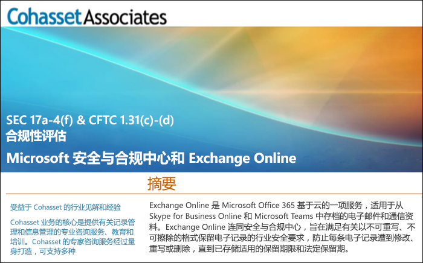

# 使用 Exchange Online 和安全与合规中心来遵守 SEC 规则 17a-4Use Exchange Online and the Security & Compliance Center to comply with SEC Rule 17a-4

如果组织需要遵守保留数据的相关法规标准，Office 365 安全与合规中心将提供一些功能来管理 Exchange Online 中数据的生命周期。包括保留、审核、搜索和导出数据的功能。这些功能足以满足大多数组织的需求。If your organization needs to comply with regulatory standards for retaining your data, the Office 365 Security & Compliance Center provides features to manage the lifecycle of your data in Exchange Online. This includes the ability to retain, audit, search, and export your data. These capabilities are sufficient to meet the needs of most organizations.

然而，高度监管行业中的某些组织会受到更严格的法规要求。例如，银行或经纪交易商等金融机构必须遵守美国证券交易委员会 (SEC) 颁布的规则 17a-4。这条规则对电子数据存储有特定要求，包括记录管理的许多方面，如记录保留的持续时间、格式、质量、可用性和责任。However, some organizations in highly regulated industries are subject to more stringent regulatory requirements. For example, financial institutions such as banks or broker dealers are subject to Rule 17a-4 issued by the Securities and Exchange Commission (SEC). Rule 17a-4 has specific requirements for electronic data storage, including many aspects of record management, such as the duration, format, quality, availability, and accountability of records retention.

为了帮助这些组织更好地了解如何利用安全与合规中心来履行其对 Exchange Online 的监管义务，特别是与规则 17a-4 要求相关的监管义务，我们已与 Cohasset Associates 合作发布了一份评估报告。To help these organizations better understand how the Security & Compliance Center can be leveraged to meet their regulatory obligations for Exchange Online, specifically in relation to Rule 17a-4 requirements, we have released an assessment in partnership with Cohasset Associates.

Cohasset 验证了当 Exchange Online 和安全与合规中心按照建议进行配置时，它们将符合 CFTC 规则 1.31(c)-(d)、FINRA 规则 4511 和 SEC 规则 17a-4 的相关存储要求。我们以这组规则为准绳，因为它们代表了针对金融机构保留记录的最为规范的全球性指导。Cohasset validated that when Exchange Online and the Security & Compliance Center are configured as recommended, they meet the relevant storage requirements of CFTC Rule 1.31(c)-(d), FINRA Rule 4511, and SEC Rule 17a-4.  We targeted this set of rules because they represent the most prescriptive guidance globally for records retention for financial institutions.

## 下载 Cohasset 评估报告Download the Cohasset assessment

可[在此处下载 Cohasset 评估报告](https://servicetrust.microsoft.com/ViewPage/TrustDocuments?command=Download&downloadType=Document&downloadId=9fa8349d-a0c9-47d9-93ad-472aa0fa44ec&docTab=6d000410-c9e9-11e7-9a91-892aae8839ad_FAQ_and_White_Papers)。You can [download the Cohasset assessment here](https://servicetrust.microsoft.com/ViewPage/TrustDocuments?command=Download&downloadType=Document&downloadId=9fa8349d-a0c9-47d9-93ad-472aa0fa44ec&docTab=6d000410-c9e9-11e7-9a91-892aae8839ad_FAQ_and_White_Papers).

## 此评估专门针对 Exchange OnlineThis assessment is specific to Exchange Online

请注意，此评估专门针对 Exchange Online。该评估不包括其他 Office 365 服务，如 SharePoint Online 或 OneDrive for Business（尽管我们计划在未来就 SEC 17a-4 对这些服务提供支持）。Note that this assessment is specific to Exchange Online. The assessment does not include other Office 365 services such as SharePoint Online or OneDrive for Business, although we are planning support for those services with respect to SEC 17a-4 in the future.

请务必知晓 Skype for Business 和 Teams 也会在 Exchange Online 中存储数据。因此，评估涵盖了 Skype for Business 和频道的消息，以及 Teams 的聊天消息。It’s important to understand that Skype for Business and Teams also store data in Exchange Online.  Therefore, the assessment does cover messages from Skype for Business and channel and chat messages from Teams.

## 使用保留锁定是推荐配置的关键Using Preservation Lock is key to the recommended configuration

高度监管行业通常需要存储电子通信来满足 WORM（一次写入，多次读取）要求。WORM 要求规定了一个存储解决方案，其中的记录必须：Highly regulated industries are often required to store electronic communications to meet the WORM (write once, read many) requirement. The WORM requirement dictates a storage solution in which a record must be:

- 在规定的保留期内保留，不能缩短，只能增加。Retained for a required retention period that cannot be shortened, only increased.
- 不可变，即在要求的保留期间，不能覆盖、删除或更改记录。Immutable, meaning that the record cannot be overwritten, erased, or altered during the required retention period.

在 Exchange Online 中，当将[保留策略](retention-policies.md)应用于用户邮箱时，用户的所有内容都将根据策略标准进行保留。实际上，如果用户试图删除或修改电子邮件，更改前的电子邮件副本将保留在用户邮箱中的安全、隐藏位置。保留策略可确保组织保留电子通信，但可以修改这些策略。In Exchange Online, when a [retention policy](retention-policies.md) is applied to a user's mailbox, all of the user's content will be retained based on the criteria of the policy. In fact, if a user attempts to delete or modify an email, a copy of the email before the change is made will be preserved in a secure, hidden location in the user's mailbox. Retention polices can ensure that an organization retains electronic communications, but those policies can be modified.

通过对保留策略实施保留锁定，组织可确保策略不会遭到修改。实际上，在将保留锁定应用于保留策略后，以下操作将受到限制：By placing a Preservation Lock on a retention policy, an organization ensures that the policy cannot be modified. In fact, after a Preservation Lock is applied to a retention policy, the following actions are restricted:

- 策略的保留期限只能增加，不能缩短。The retention period of the policy can only be increased, not shortened.
- 可以将用户添加到策略，但不能删除用户。Users can be added to the policy, but no user can be removed.
- 管理员无法删除保留策略。The retention policy cannot be deleted by an administrator.

保留锁定可有助于满足 SEC 17a-4 法规要求。Preservation Lock can help you meet the SEC 17a-4 regulatory requirements.

## 如何设置保留锁定How to set up Preservation Lock

可以使用 PowerShell 锁定保留策略。有关详细信息，请参阅[锁定保留策略](retention-policies.md#locking-a-retention-policy)。You can lock a retention policy by using PowerShell. For more information, see [Locking a retention policy](retention-policies.md#locking-a-retention-policy).

## 已知限制Known limitations

我们注意到，Exchange Online 中存在一些限制。目前正在积极处理，并希望在 2019 年 7 月发布对以下场景的支持：We’re aware of a few limitations in Exchange Online. We’re actively working on these and expect to release support for these scenarios in July 2019:

- 项目级审核在 Office 365 组邮箱中不可用。Item-level auditing is not available in Office 365 Group mailboxes.
- 线程通信不适用于 Teams 聊天和频道消息。Threaded communications are not available for Teams chat and channel messages.
- 不会为 Teams 聊天和频道消息保留赞。Likes are not retained for Teams chat and channel messages.
