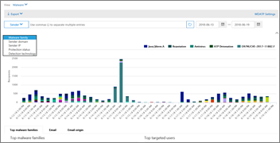

# 在安全中使用资源管理器&amp;合规性中心Use Explorer in the Security &amp; Compliance Center

如果您的组织具有[Office 365 威胁智能](office-365-ti.md)，并且您所需的[Office 365 安全性和合规性中心的权限](permissions-in-the-security-and-compliance-center.md)，您可以使用资源管理器确定和分析威胁。例如，您可以确定和删除恶意已发送的电子邮件或请参阅 Office 365 安全功能由已捕获的恶意软件。资源管理器 （也称为威胁资源管理器） 是强大的近乎实时报告安全中&amp;合规性中心。If your organization has [Office 365 Threat Intelligence](office-365-ti.md), and you have the necessary [permissions in the Office 365 Security and Compliance Center](permissions-in-the-security-and-compliance-center.md), you can use Explorer to identify and analyze threats. For example, you can identify and delete malicious email that was delivered, or see malware that was caught by Office 365 security features. Explorer (also referred to as Threat Explorer) is a powerful near real-time report in the Security &amp; Compliance Center.
  

  
安全中使用资源管理器，&amp;合规性中心中，转到**威胁管理** \> **资源管理器**。To use Explorer, in the Security &amp; Compliance Center, go to **Threat management** \> **Explorer**.
      
## 资源管理器概述Explorer overview

资源管理器显示您的组织的信息可疑电子邮件中的恶意软件和 Office 365 中的文件，以及其他安全威胁和风险。当您首次打开资源管理器中时，默认视图显示了从防病毒的恶意软件检测。资源管理器还可以显示安全保护功能在 Office 365 中，包括[安全链接](atp-safe-links.md)和[安全的附件](atp-safe-attachments.md)。Explorer displays information about suspected malware in email and files in Office 365, as well as other security threats and risks to your organization. When you first open Explorer, the default view shows malware detections from antivirus. Explorer can also show security protection features in Office 365, including [Safe Links](atp-safe-links.md) and [Safe Attachments](atp-safe-attachments.md).
  

  
使用视图菜单来更改显示的信息。Use the View menu to change what information is displayed.
  

  
资源管理器具有多个筛选和查询功能，使您能够深入了解详细信息，如顶部目标用户、 流行恶意软件家庭和详细信息。下表中所述，每种类型的报告提供了多种方式查看和浏览数据。Explorer has several filtering and querying capabilities that enable you to drill into details, such as top targeted users, top malware families, and more. Each kind of report offers a variety of ways to view and explore data, as described in the following table.
  
|**选择此选项****Choose this option**|**若要查看此数据****To view this data**|
|:-----|:-----|
|**电子邮件**\> **恶意软件****Email** \> **Malware**   |标识为包含恶意软件的邮件。Email messages identified as containing malware.    查看由恶意软件系列、 发件人域、 发件人 IP、 保护状态 （您威胁保护功能和 Office 365 中的策略所采取的操作） 和检测技术 （如何恶意软件检测到） 图表中的信息。View information in the chart by malware family, sender domain, sender IP, protection status (actions taken by your threat protection features and policies in Office 365), and detection technology (how the malware was detected).                 下面的图表，查看有关流行恶意软件系列详细信息顶部目标用户和有关特定消息的更多详细信息。Below the chart, view details about top malware families, top targeted users, and more details about specific messages.    |
|**电子邮件**\> **网络钓鱼****Email** \> **Phish**   |电子邮件标识为网络钓鱼尝试。Email messages identified as phishing attempts.    查看由发件人域、 发件人 IP 和保护状态 （您威胁保护功能和 Office 365 中的策略执行的操作） 的信息。View information by sender domain, sender IP, and protection status (actions taken by your threat protection features and policies in Office 365).                 下面的图表，查看有关特定消息的更多详细信息。Below the chart, view more details about specific messages.    |
|**电子邮件**\> **用户报告****Email** \> **User-reported**   |用户报告为垃圾、 不是垃圾邮件或网络钓鱼的电子邮件的电子邮件。Email that users have reported as junk, not junk, or phishing email.    通过报表类型 （电子邮件已垃圾、 不是垃圾邮件或网络钓鱼诈骗用户确定） 并传递原因 （原因电子邮件进入特定位置，如的垃圾邮件筛选器策略、 邮件流规则、 被阻止的发件人列表、 安全的发件人列表中，查看信息等）。View information by report type (the user's determination that the email was junk, not junk, or phish), and by delivery reason (reasons why email went to a specific location, such as a spam filter policy, a mail flow rule, a blocked-senders list, a safe-senders list, etc.).                 下面的图表，查看有关特定电子邮件，如主题行、 发件人的 IP 地址、 报告为垃圾邮件、 未垃圾，或网络钓鱼诈骗、 等的邮件的用户的详细信息。Below the chart, view more details about specific email messages, such as subject line, the sender's IP address, the user that reported the message as junk, not junk, or phish, and more.    |
|**电子邮件**\> **的所有邮件****Email** \> **All mail**   |电子邮件活动，包括为标识为恶意由于网络钓鱼或恶意软件、 电子邮件的所有向上视图以及所有非恶意邮件 （普通电子邮件、 垃圾邮件、 和批量邮件）。An all-up view of email activity, including email identified as malicious due to phishing or malware, as well all non-malicious mail (normal email, spam, and bulk mail).    > [!NOTE]> 如果您收到一条错误，读取**太多的数据以显示**、 添加筛选器，如有必要，缩小范围正在查看的日期范围。要应用筛选器，请选择**发件人**，在列表中，选择一个项目，然后单击刷新按钮。在我们的示例，我们使用**检测技术**为筛选器 （有几个选项可用）。          查看按发件人、 发件人的域、 收件人、 主题、 附件的文件名、 恶意软件系列、 保护状态 （您威胁保护功能和 Office 365 中的策略执行的操作）、 （如何恶意软件检测到），检测技术信息和更多。> [!NOTE]> If you get an error that reads **Too much data to display**, add a filter and, if necessary, narrow the date range you're viewing. To apply a filter, choose **Sender**, select an item in the list, and then click the Refresh button. In our example, we used **Detection technology** as a filter (there are several options available).           View information by sender, sender's domain, recipients, subject, attachment filename, malware family, protection status (actions taken by your threat protection features and policies in Office 365), detection technology (how the malware was detected), and more.                 下面的图表，查看有关特定电子邮件，如主题行、 收件人、 发件人、 状态和等等的详细信息。Below the chart, view more details about specific email messages, such as subject line, recipient, sender, status, and so on.    |
|**内容**\> **恶意软件****Content** \> **Malware**   |标识为恶意在 SharePoint Online、 OneDrive for Business 和 Microsoft 团队的文件。Files that were identified as malicious in SharePoint Online, OneDrive for Business, and Microsoft Teams.    由恶意软件系列，检测技术，（如何恶意软件检测到），查看信息和工作负荷 （OneDrive、 SharePoint、 或团队）。View information by malware family, detection technology (how the malware was detected), and workload (OneDrive, SharePoint, or Teams).                 下面的图表，查看有关特定的文件，如附件的文件名、 工作负荷、 文件大小，上次修改文件和更多详细信息。Below the chart, view more details about specific files, such as attachment filename, workload, file size, who last modified the file, and more.    |
  
## （新） ！单击到筛选器功能(New!) Click-to-filter capabilities

新增到资源管理器中是单击以筛选的能力。开始在后期年 5 月 2018，当您单击图例中的项目，该项目将成为报表的筛选器。例如，假设我们要看资源管理器中的恶意软件视图：New to Explorer is the ability to click to filter. Beginning in late May 2018, when you click an item in the legend, that item becomes a filter for the report. For example, suppose we are looking at the Malware view in Explorer:
  

  
此图表导致类似的视图中，单击**ATP Detonation** :Clicking **ATP Detonation** in this chart results in a view like this: 
  

  
在此视图中，我们现在在看过 detonated 通过[Office 365 ATP 安全附件](atp-safe-attachments.md)的文件的数据。下面的图表，我们可以看到有关具有检测 ATP 安全附件的附件的特定的电子邮件消息的详细信息。In this view, we are now looking at data for files that were detonated by [Office 365 ATP Safe Attachments](atp-safe-attachments.md). Below the chart, we can see details about specific email messages that had attachments that were detected by ATP Safe Attachments.
  

  
选择一个或多个项激活**操作**菜单，它提供了可供选择的选定项的多个选项。Selecting one or more items activates the **Actions** menu, which offers several choices from which to choose for the selected item(s). 
  

  
在单击筛选器并导航到具体的详细信息的功能可以将您大量时间调查威胁。The ability to filter in a click and navigate to specific details can save you a lot of time in investigating threats.
  
## 如何获取资源管理器？How do I get Explorer?

[Office 365 威胁智能](office-365-ti.md)包含资源管理器。您必须具有适当[权限分配中的 Office 365 安全性和合规性中心](permissions-in-the-security-and-compliance-center.md)，如 security 管理员程序或安全读取器才能查看和使用资源管理器。Explorer is included in [Office 365 Threat Intelligence](office-365-ti.md). You must have appropriate [permissions assigned in the Office 365 Security and Compliance Center](permissions-in-the-security-and-compliance-center.md), such as security administrator or security reader, in order to view and use Explorer.
  
## 相关主题Related topics

[报告和 Office 365 安全性见解&amp;合规性中心Reports and insights in the Office 365 Security &amp; Compliance Center](reports-and-insights-in-security-and-compliance.md)
  
[查找并调查恶意电子邮件已送达 （Office 365 威胁智能）Find and investigate malicious email that was delivered (Office 365 Threat Intelligence)](investigate-malicious-email-that-was-delivered.md)
  
[Office 365 中的反垃圾邮件和反恶意软件保护Anti-spam and anti-malware protection in Office 365](anti-spam-and-anti-malware-protection.md)
  

