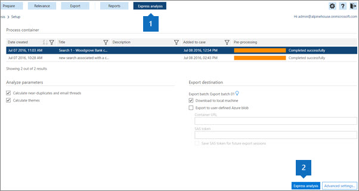

# 在 Office 365 高级电子数据展示中使用快速分析

> [!NOTE]
> 若要使用高级电子数据展示，组织必须订阅随附高级合规性加载项的 Office 365 E3，或订阅 E5。如果没有此计划，但又要试用高级电子数据展示，可以[注册 Office 365 企业版 E5 试用版](https://go.microsoft.com/fwlink/p/?LinkID=698279)。 
  
可以使用**快速分析**快速分析事例并导出结果。 
  
可以使用快速分析来计算临近的重复和电子邮件线索, 并计算主题。 您还可以在 "快速分析" 的 "[高级设置](use-express-analysis-in-advanced-ediscovery.md#BK_AdvancedSettings)" 中为主题、文档相似性和导出文件设置某些参数。
  
## 运行快速分析

1. 在 "**快速分析**(1)" 选项卡中, 选择要启用 * * Express 分析 * * (2) 和**高级设置**按钮的容器。 
    
    
  
2. 在 "**分析参数**" 下:
    
  - 如果要运行分析, 请选中 "**计算临近的重复项和电子邮件线程**"。 默认情况下选中此选项。 
    
  - 选中 "**计算主题**" 以处理所有文件并为其分配主题。 默认情况下选中此选项。 
    
3. 在 "**导出目标**:" 下:
    
  - 检查 "**下载到本地**计算机" 以下载到本地计算机。 
    
  - 如果选中 "**导出到用户定义的 Azure blob** ", 则还可以指定容器 URL 和 SAS 令牌。 
    
    > [!NOTE]
    > 将导出包存储到用户定义的 Azure blob 后, 数据将不再由高级电子数据展示进行管理。 它由 Azure blob 管理。 这意味着, 如果删除了该案例, 导出的文件仍将保留在 Azure blob 上。 
  
  - **保存 sas 令牌以供将来导出会话**: 如果选中此选项, 则会在高级电子数据展示的内部数据库中对 sas 令牌进行加密, 以供将来使用。
    
    > [!NOTE]
    > 目前, SAS 令牌在一个月后过期。 如果您在多个月后尝试下载, 您必须撤消上次会话, 然后再次导出。 
  
4. 若要使用默认设置启动 express 分析, 请选择 "**快速分析**", "**任务状态**" 页将显示 
    
    在 "**任务状态**" 页上, 可以**** 展开 "**分析**和**导出**" 选项卡, 以显示有关 express 运行的详细信息。 
    
    
  
5. 选择 "**快速分析摘要**" 页, 列出有关运行的详细信息。 
    
    在 " **Express 分析摘要**" 页面的底部, 选择 "**下载上次会话**" 以下载分析文件 tp 您的本地计算机。 您首先必须下载电子数据展示导出工具, 并将导出密钥粘贴到电子数据展示导出工具。 
    
## 快速分析的高级设置

您可以选择设置**高级设置**来更改默认的快速分析参数。 
  
1. 在 "**分析**" 部分: 
    
  - 在**临近的重复和电子邮件线程**中, 输入 "**文档相似性**" 值, 或接受默认值 "65%"。 
    
  - 在 "**最大主题数**" 中, 输入或选择要创建的主题数的值。 默认值为 200。 
    
    > [!NOTE]
    > 增加主题的数量将影响性能, 并使主题能够通用化。 主题的数量越高, 它们的粒度就越多。 例如, 如果一组50主题包含一个主题, 如 "篮球、Spurs、Clippers、Lakers", 则300主题可能包含单独的主题: "Spurs"、"Clippers"、"Lakers"。 如果您不知道主题 "篮球" 并对 ECA 使用此功能, 则查看主题 "篮球" 可能有用。 但是, 如果处理的主题过多, 则您可能永远无法看到 "篮球" 一词, 也可能不知道 Spurs 和 Clippers 是要查看的理想的篮球主题, 而不是执行启动并用于头发的项目。 
  
  - 在**建议的主题**中, 选择 "**修改**" 以建议主题词来控制主题处理。 高级电子数据展示将重点放在这些建议的单词上, 并根据 "最大主题数" 设置尝试创建一个或多个相关主题。 
    
    例如, 如果建议的单词是 "computer", 并且您将 "2" 指定为 "最大主题数", 高级电子数据展示将尝试生成与 "computer" 一词相关的两个主题。 例如, 这两个主题可能是 "计算机软件" 和 "计算机硬件"。
    
    
  
  - **模式**从下拉列表中, 选择 "**主题**" 选项: 
    
  - **创建和应用模型**: 从一段文件的模型计算主题, 然后在它们之间分发文件。
    
  - **创建模型**: 计算来自一段文件的主题模型。 拆分文件的应用过程是在其他时间单独完成的。
    
  - **应用模型**: 仅当以前创建且尚未应用模型时, 才会显示此选项。 这将根据主题划分这些文件。
    
2. 在 "**导出**" 部分: 
    
1. 在 "**选择导出批处理**" 中:
    
  - 从 "**导出批处理**" 列表中, 选择 "批次名称" 或 "导出结果" 以导出批处理 01 (默认批处理)。 
    
  - 若要导出添加到现有事例中的新文件的结果, 请继续使用当前批处理。 若要在批处理中创建会话, 请选择同一批次号码并单击 "**创建导出会话**" 可以使用此选项以增量方式导出与上一批次相同的参数。 
    
  - 若要导出到新批次, **** 添加添加图标", 并在 "批**次名称**" 中输入新名称 (或接受默认值) 和 "**批处理说明**" 中的说明。 单击“**确定**”。
    
  - 若要编辑批次名称或说明, 请在 "**导出批次**" **** , 单击 "编辑编辑图标", 然后修改字段。
    
    > [!NOTE]
    > 在为导出批处理运行会话之后, 将无法删除它们。 此外, 在第一次运行会话后, 仅可编辑某些参数。 
  
  - 若要创建重复的导出批处理, 请选择 "**重复导出批处理** 重复的导出批处理图标, 并在面板中输入重复批次的名称和说明。 
    
  - 若要删除导出批处理, 请选择 "**删除** 次图标"。
    
  - 若要查看批次的历史记录, 请选择 "**批次历史** 。
    
2. 在 "定义 p **opulation** " 下, 选择 "**仅包括相关性截止分数**和/或**优化导出批次**以上的文件" (如果要微调导出批处理的设置)。 如果选择 "**仅包括相关性截止分数以上的文件**", 则会启用该**问题**, 如果文件的相关性分数高于所选问题的截止分数, 则导出文件。 除非 " **For 审阅**" 筛选器排除了该文件, 否则将导出该文件。 如果选择 "**优化导出批处理**", 则将启用 "**重复数据消除**和**按 ' 审阅 ' 筛选" 字段**单选按钮。 如果选择 "**重复**消除", 则将根据定义的策略将重复文件筛选掉: [事例级别 (默认): 从整个事例中的每一组重复文件中, 除一个文件之外的所有文件都将 duped。 保管人级别: 从同一个保管人的每组重复文件中, 除一个文件之外的所有文件都将 duped。 导出输出中提供了所有重复文件的记录。 如果选择 **"按 ' 审阅 ' 筛选"** 字段, 请选择 "**元数据" 下**的 "修改" 以输入 **"审阅"** 字段设置。 选择 "**包括输入文件**" 以将源文件包含在程序包内容中。 您可以清除此选项以加快导出过程。 请注意, 在任何情况下都会导出本地文件。
    
3. 在 "**定义元数据**" 下, 从 "**导出模板**" 列表中的以下选项中进行选择 (每个会话一次)。 
    
  - **Standard**: 数据项目、元数据和属性的基本集合。 如果已在高级电子数据展示中处理导入数据, 并将导出数据上载到已包含文件的系统, 请使用此选项。 默认情况下, 将创建并填充 "导出模板" 列。
    
  - **All**: 完整的标准元数据集, 包括所有处理数据, 以及分析和相关性分数。 当高级电子数据展示执行首次将文件数据上传到外部系统时, 此模板是必需的。
    
  - **问题**: 选择**所有问题**或选择你创建的特定问题。 
    
选择 **"确定"** 以保存 "高级设置"、"**还原默认**值以使用默认值" 或 "**取消**" 取消设置高级设置。 
  
## 另请参阅

[Office 365 高级电子数据展示](office-365-advanced-ediscovery.md)

