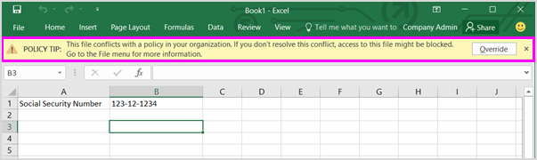

# 发送电子邮件通知并显示 DLP 策略的策略提示Send email notifications and show policy tips for DLP policies

数据丢失防护 (DLP) 策略可用于跨 Office 365 识别、监视和保护敏感信息。You can use a data loss prevention (DLP) policy to identify, monitor, and protect sensitive information across Office 365. 您希望组织中使用这些敏感信息的人员保持与您的 DLP 策略兼容, 但不希望在不必要的情况下阻止他们完成其工作。You want people in your organization who work with this sensitive information to stay compliant with your DLP policies, but you don't want to block them unnecessarily from getting their work done. 这是电子邮件通知和策略提示可以提供帮助的情况。This is where email notifications and policy tips can help.
  

  
策略提示是当有人使用与 DLP 策略冲突的内容 (例如, 包含个人身份信息 (PII) 的 OneDrive for Business 网站上的 Excel 工作簿等内容) 时显示的通知或警告。与外部用户共享。A policy tip is a notification or warning that appears when someone is working with content that conflicts with a DLP policy—for example, content like an Excel workbook on a OneDrive for Business site that contains personally identifiable information (PII) and is shared with an external user.
  
您可以使用电子邮件通知和策略提示来提高知名度并帮助人们了解组织的策略。You can use email notifications and policy tips to increase awareness and help educate people about your organization's policies. 您还可以为用户提供替代策略的选项, 以便它们不会被阻止, 如果他们具有有效的业务需求, 或者如果策略检测到误报也是如此。You can also give people the option to override the policy, so that they're not blocked if they have a valid business need or if the policy is detecting a false positive.
  
在 Office 365 安全&amp;合规中心中, 当您创建 DLP 策略时, 您可以将用户通知配置为:In the Office 365 Security &amp; Compliance Center, when you create a DLP policy, you can configure the user notifications to:
  
- 向你选择的可描述问题的人员发送电子邮件通知。Send an email notification to the people you choose that describes the issue.
    
- 显示与 DLP 策略冲突的内容的策略提示:Display a policy tip for content that conflicts with the DLP policy:
    
  - 对于 web 上的 Outlook 和 Outlook 2013 及更高版本中的电子邮件, 策略提示将显示在撰写邮件的收件人上方的邮件的顶部。For email in Outlook on the web and Outlook 2013 and later, the policy tip appears at the top of a message above the recipients while the message is being composed.
    
  - 对于 OneDrive for business 帐户或 SharePoint Online 网站中的文档, 策略提示由显示在项目上的警告图标指示。For documents in a OneDrive for Business account or SharePoint Online site, the policy tip is indicated by a warning icon that appears on the item. 若要查看详细信息, 可以选择一个项目, 然后在\*\*\*\*选择 "信息信息窗格" 图标以打开 "详细信息" 窗格。To view more information, you can select an item and then choose **Information** in the upper-right corner of the page to open the details pane. 
    
  - 对于存储在 DLP 策略中包含的 OneDrive for business 网站或 SharePoint Online 网站上的 Excel 2016、PowerPoint 2016 和 Word 2016 文档, 策略提示将显示在消息栏和 Backstage 视图 ("**文件**" 菜单\> **信息**)。For Excel 2016, PowerPoint 2016, and Word 2016 documents that are stored on a OneDrive for Business site or SharePoint Online site that's included in the DLP policy, the policy tip appears on the Message Bar and the Backstage view ( **File** menu \> **Info**).
    
## 向 DLP 策略添加用户通知Add user notifications to a DLP policy

创建 DLP 策略时, 电子邮件通知和策略提示都是 "**用户通知**" 部分的一部分。When you create a DLP policy, both email notifications and policy tips are part of the **User notifications** section. 
  
1. 转到 [https://protection.office.com](https://protection.office.com)。Go to [https://protection.office.com](https://protection.office.com).
    
2. 使用工作或学校帐户登录到 Office 365。Sign in to Office 365 using your work or school account. 现在你已处于 Office 365 安全&amp;合规中心。You're now in the Office 365 Security &amp; Compliance Center.
    
3. 在安全&amp;合规\>中心左侧导航\> **数据丢失防护** \> **策略** \>中,**创建一个策略**。In the Security &amp; Compliance Center \> left navigation \> **Data loss prevention** \> **Policy** \> **+ Create a policy**.
    
    
  
4. 选择保护您\> **接下来**需要的敏感信息类型的 DLP 策略模板。Choose the DLP policy template that protects the types of sensitive information that you need \> **Next**.
    
    若要从空模板开始, 请选择 "**自** \> **定义策略** \> "**下一步**。To start with an empty template, choose **Custom** \> **Custom policy** \> **Next**.
    
5. 将策略\>命名为**Next**。Name the policy \> **Next**.
    
6. 若要选择要保护 DLP 策略的位置, 请执行下列操作之一:To choose the locations that you want the DLP policy to protect, do one of the following:
    
  - 选择\> **下一步\*\*\*\*中的 "Office 365 中的所有位置"** 。Choose **All locations in Office 365** \> **Next**.
    
  - 选择 "**让我选择** \> **下一处**的特定位置"。Choose **Let me choose specific locations** \> **Next**.
    
    若要包括或排除整个位置 (如所有 Exchange 电子邮件或所有 OneDrive 帐户), 请打开或关闭该位置的**状态**。To include or exclude an entire location such as all Exchange email or all OneDrive accounts, switch the **Status** of that location on or off. 
    
    若要仅包含特定的 SharePoint 网站或 OneDrive 帐户, 请将**状态**切换到 "打开", 然后单击 "**包括**" 下的链接以选择 "特定网站或帐户"。To include only specific SharePoint sites or OneDrive accounts, switch the **Status** to on, and then click the links under **Include** to choose specific sites or accounts. 
    
7. 选择 "**使用高级设置** \> "**下一步**。Choose **Use advanced settings** \> **Next**.
    
8. 选择 " **+ 新建规则**"。Choose **+ New rule**.
    
9. 在规则编辑器中的 "**用户通知**" 下, 切换状态 "开启"。In the rule editor, under **User notifications**, switch the status on.
    
    
  
## 用于配置电子邮件通知的选项Options for configuring email notifications

对于 DLP 策略中的每个规则，您可以：For each rule in a DLP policy, you can:
  
- 将通知发送给您选择的人员。这些人员可以包含内容的所有者、最后一次修改内容的人员、存储内容的网站所有者或特定用户。Send the notification to the people you choose. These people can include the owner of the content, the person who last modified the content, the owner of the site where the content is stored, or a specific user.
    
- 使用 HTML 或标记自定义通知中包含的文本。Customize the text that's included in the notification by using HTML or tokens. 有关详细信息, 请参阅下面的部分。See the section below for more information.
    
> [!NOTE]
>  电子邮件通知只能发送给各个收件人, 而不是组或通讯组列表。Email notifications can be sent only to individual recipients—not groups or distribution lists. 只有新内容才会触发电子邮件通知。Only new content will trigger an email notification. 编辑现有内容将触发策略提示，但不会触发电子邮件通知。Editing existing content will trigger policy tips but not an email notification. 
  

  
### 默认电子邮件通知Default email notification

通知包含以所执行的操作开头的主题行, 例如 "通知"、"邮件被阻止" 或 "拒绝访问" 文档。Notifications have a Subject line that begins with the action taken, such as "Notification", "Message Blocked" for email, or "Access Blocked" for documents. 如果通知与文档有关, 则通知邮件正文包含一个链接, 该链接将转到文档存储的网站并打开文档的策略提示, 您可以在其中解决任何问题 (请参阅下面关于策略提示的部分)。If the notification is about a document, the notification message body includes a link that takes you to the site where the document's stored and opens the policy tip for the document, where you can resolve any issues (see the section below about policy tips). 如果通知是关于邮件的通知, 则通知将包含与 DLP 策略匹配的邮件附件。If the notification is about a message, the notification includes as an attachment the message that matches a DLP policy.
  

  
默认情况下，通知显示类似于网站上以下项的文本。通知文本针对每个规则单独配置，因此根据匹配的规则，显示的文本有所不同。By default, notifications display text similar to the following for an item on a site. The notification text is configured separately for each rule, so the text that's displayed differs depending on which rule is matched.

|**如果 DLP 策略规则也是如此...****If the DLP policy rule does this…**|**然后, SharePoint 或 OneDrive for business 文档的默认通知如下所说 .。。****Then the default notification for SharePoint or OneDrive for Business documents says this…**|**然后, Outlook 邮件的默认通知说 .。。****Then the default notification for Outlook messages says this…**|
|:-----|:-----|:-----|
|发送通知但不允许替代Sends a notification but doesn't allow override    |此项与您的组织中的策略相冲突。This item conflicts with a policy in your organization.    |您的电子邮件与组织中的策略相冲突。Your email message conflicts with a policy in your organization.    |
|阻止访问，发送通知，并允许重写Blocks access, sends a notification, and allows override    |此项与您的组织中的策略相冲突。This item conflicts with a policy in your organization. 如果不解决此冲突, 则可能会阻止对此文件的访问。If you don't resolve this conflict, access to this file might be blocked.    |您的电子邮件与组织中的策略相冲突。Your email message conflicts with a policy in your organization. 邮件未传递给所有收件人。The message wasn't delivered to all recipients.    |
|阻止访问，并向发送通知Blocks access and sends a notification    |此项与您的组织中的策略相冲突。除非是项目的所有者、最后一次修改内容的用户以及网站集主管理员，否则其他人对此项目的访问将受到阻止。This item conflicts with a policy in your organization. Access to this item is blocked for everyone except its owner, last modifier, and the primary site collection administrator.    |您的电子邮件与组织中的策略相冲突。Your email message conflicts with a policy in your organization. 邮件未传递给所有收件人。The message wasn't delivered to all recipients.    |
   
### 自定义电子邮件通知Custom email notification

您可以创建自定义电子邮件通知, 而不是将默认电子邮件通知发送给最终用户或管理员。You can create a custom email notification instead of sending the default email notification to your end users or admins. 自定义电子邮件通知支持 HTML, 且具有5000个字符的限制。The custom email notification supports HTML and has a 5,000-character limit. 您可以使用 HTML 在通知中包含图像、格式和其他品牌打造。You can use HTML to include images, formatting, and other branding in the notification.
  
您还可以使用以下令牌帮助自定义电子邮件通知。You can also use the following tokens to help customize the email notification. 这些令牌是由发送的通知中的特定信息替换的变量。These tokens are variables that are replaced by specific information in the notification that's sent.

|**标记****Token**|**说明****Description**|
|:-----|:-----|
|%%AppliedActions%%%%AppliedActions%%    |应用于内容的操作。The actions applied to the content.    |
|%% ContentURL%%%%ContentURL%%    |SharePoint Online 网站或 OneDrive for business 网站上的文档的 URL。The URL of the document on the SharePoint Online site or OneDrive for Business site.    |
|%%MatchedConditions%%%%MatchedConditions%%    |内容所匹配的条件。The conditions that were matched by the content. 使用此令牌可告知用户可能存在的内容问题。Use this token to inform people of possible issues with the content.    |
   

  
## 用于配置策略提示的选项Options for configuring policy tips

对于 DLP 策略中的每个规则，您可以配置策略提示用于：For each rule in a DLP policy, you can configure policy tips to:
  
- 简单地通知该用户此项内容与 DLP 策略相冲突，以便用户可以执行相应的操作来解决此冲突。Simply notify the person that the content conflicts with a DLP policy, so that they can take action to resolve the conflict. 您可以使用默认文本 (请参阅下表) 或输入有关您的组织的特定策略的自定义文本。You can use the default text (see the tables below) or enter custom text about your organization's specific policies.
    
- 允许用户替换 DLP 策略。Allow the person to override the DLP policy. （可选） 您可以：Optionally, you can:
    
  - 要求用户输入替换该策略的业务理由。Require the person to enter a business justification for overriding the policy. 将记录此信息, 您可以在安全&amp;合规性中心的 "**报告**" 部分的 "DLP 报告" 中查看此信息。This information is logged and you can view it in the DLP reports in the **Reports** section of the Security &amp; Compliance Center. 
    
  - 允许用户报告误报并替换 DLP 策略。此信息还被记录下来用于报告，以便您可以使用误报来微调您的规则。Allow the person to report a false positive and override the DLP policy. This information is also logged for reporting, so that you can use false positives to fine tune your rules.
    

  
例如, 您可以将 DLP 策略应用于检测个人身份信息 (PII) 的 OneDrive for Business 网站, 并且此策略具有三个规则:For example, you may have a DLP policy applied to OneDrive for Business sites that detects personally identifiable information (PII), and this policy has three rules:
  
1. 第一个规则：如果在文档中检测到包含此敏感信息的实例少于五个，并且该文档与组织内部的人员共享，则“发送通知”\*\*\*\* 操作将显示策略提示。对于策略提示，无需提供任何替换选项，因为此规则只是通知相关人员，但不会阻止访问。First rule: If fewer than five instances of this sensitive information are detected in a document, and the document is shared with people inside the organization, the **Send a notification** action displays a policy tip. For policy tips, no override options are necessary because this rule is simply notifying people and not blocking access. 
    
2. 第二个规则：如果在文档中检测到包含此敏感信息的实例多于五个，并且该文档与组织内部的人员共享，则“阻止访问内容”\*\*\*\* 操作将限制文件权限，并且“发送通知”\*\*\*\* 操作会允许用户通过提供业务理由来替换该规则中的操作。Second rule: If greater than five instances of this sensitive information are detected in a document, and the document is shared with people inside the organization, the **Block access to content** action restricts the permissions for the file, and the **Send a notification** action allows people to override the actions in this rule by providing a business justification. 您的组织的业务有时需要内部人员共享 PII 数据, 并且您不希望您的 DLP 策略阻止此工作。Your organization's business sometimes requires internal people to share PII data, and you don't want your DLP policy to block this work. 
    
3. 第三个规则：如果在文档中检测到包含此敏感信息的实例多于五个，并且该文档与组织外部的人员共享，则“阻止访问内容”\*\*\*\* 操作将限制文件权限，并且“发送通知”\*\*\*\* 操作将不允许用户替换该规则中的操作，因为该信息是与外部共享的。决不允许您组织中的用户在组织外部共享 PII 数据。Third rule: If greater than five instances of this sensitive information are detected in a document, and the document is shared with people outside the organization, the **Block access to content** action restricts the permissions for the file, and the **Send a notification** action does not allow people to override the actions in this rule because the information is shared externally. Under no circumstances should people in your organization be allowed to share PII data outside the organization. 
    
以下几点有助于您对使用策略提示替换规则的理解：Here are some fine points to understand about using a policy tip to override a rule:
  
- 替代的选项是 "按规则", 它将覆盖规则中的所有操作 (发送不能覆盖的通知除外)。The option to override is per rule, and it overrides all of the actions in the rule (except sending a notification, which can't be overridden).
    
- 可以将内容与 DLP 策略中的多个规则相匹配, 但只会显示来自最严格的最高优先级规则的策略提示。It's possible for content to match several rules in a DLP policy, but only the policy tip from the most restrictive, highest-priority rule will be shown. 例如，阻止访问内容的规则所提供的策略提示比起只是发送通知的规则所提供的策略提示，前者的显示优先级高于后者。For example, a policy tip from a rule that blocks access to content will be shown over a policy tip from a rule that simply sends a notification. 这会让用户看不到策略提示的级联方式。This prevents people from seeing a cascade of policy tips.
    
- 如果限制最严格的规则中的策略提示允许用户替换规则，那么替换此规则还会替换与此内容相匹配的所有其他规则。If the policy tips in the most restrictive rule allow people to override the rule, then overriding this rule also overrides any other rules that the content matched.
    
## OneDrive for Business 网站或 SharePoint Online 网站上的策略提示Policy tips on OneDrive for Business sites and SharePoint Online sites

当 OneDrive for business 网站或 SharePoint Online 网站上的文档与 DLP 策略中的规则相匹配, 并且该规则使用策略提示时, 策略提示会在文档中显示特殊图标:When a document on a OneDrive for Business site or SharePoint Online site matches a rule in a DLP policy, and that rule uses policy tips, the policy tips display special icons on the document:
  
1. 如果该规则发送有关该文件的通知，则会显示警告图标。If the rule sends a notification about the file, the warning icon appears.
    
2. 如果该规则阻止访问该文档，则会显示阻止图标。If the rule blocks access to the document, the blocked icon appears.
    

  
若要对文档执行操作, 您可以选择一个项目\> 。在页面的右上](media/50b6d51b-92b4-4c5f-bb4b-4ca2d4aa3d04.png)角选择 "**信息** in the upper-right corner of the page to open the details pane \> **View policy tip**.
  
策略提示会列出问题及其内容，如果对策略提示配置了这些选项，则您可以选择“解决”\*\*\*\*，然后选择“替换”\*\*\*\* 策略提示或“报告”\*\*\*\* 误报。The policy tip lists the issues with the content, and if the policy tips are configured with these options, you can choose **Resolve**, and then **Override** the policy tip or **Report** a false positive. 
  

  

  
将 DLP 策略同步到网站，并定期以异步方式根据这些策略对内容进行评估，因此，您创建 DLP 策略的时间与开始看到策略提示的时间之间可能出现短暂的延迟。类似延迟还有可能出现在从您解决或替换策略提示到网站的文档上的图标消失的这段时间里。DLP policies are synced to sites and contented is evaluated against them periodically and asynchronously, so there may be a short delay between the time you create the DLP policy and the time you begin to see policy tips. There may be a similar delay from when you resolve or override a policy tip to when the icon on the document on the site goes away.
  
### 网站上的策略提示的默认文本Default text for policy tips on sites

默认情况下，策略提示显示在网站上类似于以下项的文本。通知文本针对每个规则单独配置，因此根据匹配的规则，显示的文本有所不同。By default, policy tips display text similar to the following for an item on a site. The notification text is configured separately for each rule, so the text that's displayed differs depending on which rule is matched.

|**如果 DLP 策略规则也是如此...****If the DLP policy rule does this…**|**然后默认策略提示的说明如下...****Then the default policy tip says this…**|
|:-----|:-----|
|发送通知但不允许替代Sends a notification but doesn't allow override    |此项与您的组织中的策略相冲突。This item conflicts with a policy in your organization.    |
|阻止访问，发送通知，并允许重写Blocks access, sends a notification, and allows override    |此项与您的组织中的策略相冲突。This item conflicts with a policy in your organization. 如果不解决此冲突, 则可能会阻止对此文件的访问。If you don't resolve this conflict, access to this file might be blocked.    |
|阻止访问，并向发送通知Blocks access and sends a notification    |此项与您的组织中的策略相冲突。除非是项目的所有者、最后一次修改内容的用户以及网站集主管理员，否则其他人对此项目的访问将受到阻止。This item conflicts with a policy in your organization. Access to this item is blocked for everyone except its owner, last modifier, and the primary site collection administrator.    |
   
### 网站上的策略提示的自定义文本Custom text for policy tips on sites

您可以独立于电子邮件通知自定义策略提示的文本。You can customize the text for policy tips separately from the email notification. 与电子邮件通知的自定义文本不同 (请参阅上文) 时, 策略提示的自定义文本不接受 HTML 或标记。Unlike custom text for email notifications (see above section), custom text for policy tips does not accept HTML or tokens. 相反, 策略提示的自定义文本是纯文本, 只有256个字符的限制。Instead, custom text for policy tips is plain text only with a 256-character limit.
  
## Outlook 网页和 Outlook 2013 及更高版本中的策略提示Policy tips in Outlook on the web and Outlook 2013 and later

在 web 上的 Outlook 和 Outlook 2013 及更高版本中撰写新电子邮件时, 如果添加了与 DLP 策略中的规则匹配的内容, 并且该规则使用策略提示, 则会看到策略提示。When you compose a new email in Outlook on the web and Outlook 2013 and later, you'll see a policy tip if you add content that matches a rule in a DLP policy, and that rule uses policy tips. 在撰写邮件时, 策略提示将显示在邮件顶部的收件人上方。The policy tip appears at the top of the message, above the recipients, while the message is being composed.
  

  
策略提示可用于敏感信息是显示在邮件正文、主题行中还是邮件附件中, 如下所示。Policy tips work whether the sensitive information appears in the message body, subject line, or even a message attachment as shown here.
  

  
如果将策略提示配置为允许替代, 则可以选择 "**显示详细信息** \> **" 替代** \> "输入业务理由" 或报告\> "误报肯定**替代**"。If the policy tips are configured to allow override, you can choose **Show Details** \> **Override** \> enter a business justification or report a false positive \> **Override**.
  

  

  
请注意, 在将敏感信息添加到电子邮件时, 在添加敏感信息和显示策略提示之间可能存在延迟。Note that when you add sensitive information to an email, there may be latency between when the sensitive information is added and when the policy tip appears.

### Outlook 2013 及更高版本支持仅显示某些条件的策略提示Outlook 2013 and later supports showing policy tips for only some conditions

目前, Outlook 2013 及更高版本支持仅显示这些条件的策略提示:Currently, Outlook 2013 and later supports showing policy tips only for these conditions:

- 内容包含Content contains
- 共享内容Content is shared

我们目前正在努力为其他条件显示策略提示。We're currently working on support for showing policy tips for additional conditions. 具体包括：These include:

- 无法扫描任何电子邮件附件的内容Any email attachment's content could not be scanned
- 任何电子邮件附件的内容未完成扫描Any email attachment's content didn't complete scanning
- 附件文件扩展名为Attachment file extension is
- 附件受密码保护Attachment is password protected
- Document 属性为Document property is
- 收件人域为Recipient domain is
- 发件人 IP 地址为Sender IP address is

请注意, 所有这些条件在 Outlook 中都有效, 在这里, 它们将与内容相匹配, 并对内容强制实施保护操作。Note that all of these conditions work in Outlook, where they will match content and enforce protective actions on content. 但尚不支持向用户显示策略提示。But showing policy tips to users is not yet supported.
  
### Exchange 管理中心中的策略提示与 Office 365 安全&amp;合规中心Policy tips in the Exchange admin center vs. the Office 365 Security &amp; Compliance Center

策略提示可使用在 Exchange 管理中心中创建的 DLP 策略和邮件流规则, 或使用在 Office 365 安全&amp;合规中心中创建的 dlp 策略, 但不能同时使用这两种策略。Policy tips can work either with DLP policies and mail flow rules created in the Exchange admin center, or with DLP policies created in the Office 365 Security &amp; Compliance Center, but not both. 这是因为这些策略存储在不同的位置, 但策略提示只能从一个位置进行绘制。This is because these policies are stored in different locations, but policy tips can draw only from a single location.
  
如果已在 Exchange 管理中心中配置了策略提示, 则在 Office 365 安全&amp;合规中心中配置的任何策略提示都不会显示在 outlook 网页和 outlook 2013 及更高版本的 outlook 中, 直到您关闭 Exchange 中的提示。管理中心。If you've configured policy tips in the Exchange admin center, any policy tips that you configure in the Office 365 Security &amp; Compliance Center won't appear to users in Outlook on the web and Outlook 2013 and later until you turn off the tips in the Exchange admin center. 这样可确保当前的 Exchange 邮件流规则 (也称为传输规则) 在您选择切换到 "Office 365 安全&amp;合规中心" 之前仍有效。This ensures that your current Exchange mail flow rules (also known as transport rules) will continue to work until you choose to switch over to the Office 365 Security &amp; Compliance Center.
  
请注意, 虽然策略提示只能从一个位置进行绘制, 但总是发送电子邮件通知, 即使您在 Office 365 安全&amp;合规中心和 Exchange 管理中心中使用的是 DLP 策略也是如此。Note that while policy tips can draw only from a single location, email notifications are always sent, even if you're using DLP policies in both the Office 365 Security &amp; Compliance Center and the Exchange admin center.
  
### 电子邮件中的策略提示的默认文本Default text for policy tips in email

默认情况下, 策略提示显示类似于电子邮件的以下文本。By default, policy tips display text similar to the following for email.

|**如果 DLP 策略规则也是如此...****If the DLP policy rule does this…**|**然后默认策略提示的说明如下...****Then the default policy tip says this…**|
|:-----|:-----|
|发送通知但不允许替代Sends a notification but doesn't allow override    |您的电子邮件与组织中的策略相冲突。Your email conflicts with a policy in your organization.    |
|阻止访问，发送通知，并允许重写Blocks access, sends a notification, and allows override    |您的电子邮件与组织中的策略相冲突。Your email conflicts with a policy in your organization.    |
|阻止访问，并向发送通知Blocks access and sends a notification    |您的电子邮件与组织中的策略相冲突。Your email conflicts with a policy in your organization.    |
   
## Excel 2016、PowerPoint 2016 和 Word 2016 中的策略提示Policy tips in Excel 2016, PowerPoint 2016, and Word 2016

当用户在桌面版本的 Excel 2016、PowerPoint 2016 和 Word 2016 中使用敏感内容时，策略提示可以实时通知用户，告知内容与 DLP 策略之间发生冲突。这要求：When people work with sensitive content in the desktop versions of Excel 2016, PowerPoint 2016, and Word 2016, policy tips can notify them in real time that the content conflicts with a DLP policy. This requires that:
  
- Office 文档存储在 OneDrive for Business 网站或 SharePoint Online 网站上。The Office document is stored on a OneDrive for Business site or SharePoint Online site.
    
- 该网站包含在配置为使用策略提示的 DLP 策略中。The site is included in a DLP policy that's configured to use policy tips.
    
这些 Office 2016 桌面程序将自动从 Office 365 中直接同步 DLP 策略, 然后扫描您的文档以确保它们不会与您的 DLP 策略冲突并实时显示策略提示。These Office 2016 desktop programs automatically sync DLP policies directly from Office 365, and then scan your documents to ensure that they don't conflict with your DLP policies and display policy tips in real time.
  
根据您在 DLP 策略中对策略提示的配置方式，用户可以选择忽略策略提示、使用或不使用业务理由替换策略或报告误报。Depending on how you configure the policy tips in the DLP policy, people can choose to simply ignore the policy tip, override the policy with or without a business justification, or report a false positive.
  
在消息栏上显示策略提示。Policy tips appear on the Message Bar.
  

  
策略提示也显示在 Backstage 视图（“文件”\*\*\*\* 选项卡上）中。And policy tips also appear in the Backstage view (on the **File** tab). 
  

  
如果对 DLP 策略中的策略提示配置了这些选项，您可以选择“解决”\*\*\*\* 以“替换”\*\*\*\* 策略提示或“报告”\*\*\*\* 误报。If policy tips in the DLP policy are configured with these options, you can choose **Resolve** to **Override** a policy tip or **Report** a false positive. 
  

  
在每一个这些 Office 2016 桌面程序中，用户可以选择关闭策略提示。如果已关闭，则只是简单通知的策略提示将不会显示在消息栏或 Backstage 视图（“文件”\*\*\*\* 选项卡上）上。但是，仍会显示有关阻止和替换的策略提示，并且仍将收到电子邮件通知。此外，关闭策略提示并不会将文档从任何已对其应用的 DLP 策略中予以免除。In each of these Office 2016 desktop programs, people can choose to turn off policy tips. If turned off, policy tips that are simple notifications will not appear on the Message Bar or Backstage view (on the **File** tab). However, policy tips about blocking and overriding will still appear, and they will still receive the email notification. In addition, turning off policy tips does not exempt the document from any DLP policies that have been applied to it. 
  
### Excel 2016、PowerPoint 2016 和 Word 2016 中的策略提示的默认文本Default text for policy tips in Excel 2016, PowerPoint 2016, and Word 2016

默认情况下，策略提示将在打开文档的消息栏和 Backstage 视图中显示类似于以下的文本。通知文本针对每个规则单独配置，因此根据匹配的规则，显示的文本有所不同。By default, policy tips display text similar to the following on the Message Bar and Backstage view of an open document. The notification text is configured separately for each rule, so the text that's displayed differs depending on which rule is matched.

|**如果 DLP 策略规则也是如此...****If the DLP policy rule does this…**|**然后默认策略提示的说明如下...****Then the default policy tip says this…**|
|:-----|:-----|
|发送通知但不允许替代Sends a notification but doesn't allow override    |此文件与您的组织中的策略相冲突。This file conflicts with a policy in your organization. 有关详细信息, 请转到 "**文件**" 菜单。Go to the **File** menu for more information.    |
|阻止访问，发送通知，并允许重写Blocks access, sends a notification, and allows override    |此文件与您的组织中的策略相冲突。This file conflicts with a policy in your organization. 如果不解决此冲突, 则可能会阻止对此文件的访问。If you don't resolve this conflict, access to this file might be blocked. 有关详细信息, 请转到 "**文件**" 菜单。Go to the **File** menu for more information.    |
|阻止访问，并向发送通知Blocks access and sends a notification    |此文件与您的组织中的策略相冲突。This file conflicts with a policy in your organization. 如果不解决此冲突, 则可能会阻止对此文件的访问。If you don't resolve this conflict, access to this file might be blocked. 有关详细信息, 请转到 "**文件**" 菜单。Go to the **File** menu for more information.    |
   
### Excel 2016、PowerPoint 2016 和 Word 2016 中的策略提示的自定义文本Custom text for policy tips in Excel 2016, PowerPoint 2016, and Word 2016

您可以独立于电子邮件通知自定义策略提示的文本。You can customize the text for policy tips separately from the email notification. 与电子邮件通知的自定义文本不同 (请参阅上文) 时, 策略提示的自定义文本不接受 HTML 或标记。Unlike custom text for email notifications (see above section), custom text for policy tips does not accept HTML or tokens. 相反, 策略提示的自定义文本是纯文本, 只有256个字符的限制。Instead, custom text for policy tips is plain text only with a 256-character limit.
  
## 更多信息More information

- [数据丢失防护策略概述Overview of data loss prevention policies](data-loss-prevention-policies.md)
    
- [从模板创建 DLP 策略Create a DLP policy from a template](create-a-dlp-policy-from-a-template.md)
    
- [创建 DLP 策略来保护具有 FCI 或其他属性的文档Create a DLP policy to protect documents with FCI or other properties](protect-documents-that-have-fci-or-other-properties.md)
    
- [DLP 策略模板包含的内容What the DLP policy templates include](what-the-dlp-policy-templates-include.md)
    
- [敏感信息类型查找的内容What the sensitive information types look for](what-the-sensitive-information-types-look-for.md)
    

