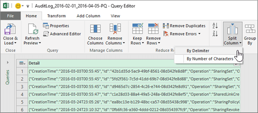

# 审核共享以查找与外部用户共享的资源Use sharing auditing in the Office 365 audit log

共享是 SharePoint Online 和 OneDrive for business 中的关键活动, 并在 Office 365 组织中广泛使用。管理员现在可以在 Office 365 审核日志中使用共享审核来确定如何在组织中使用共享。Sharing is a key activity in SharePoint Online and OneDrive for Business, and it's widely used in Office 365 organizations. Administrators can now use sharing auditing in the Office 365 audit log to determine how sharing is being used in their organization. 
  
## SharePoint 共享架构The SharePoint Sharing schema

共享事件 (不包括共享策略和共享链接事件) 与文件和文件夹相关的事件有一个主要的不同之处: 一个用户正在采取对另一个用户有影响的操作。例如, 用户 A 向用户 B 授予对文件的访问权限。在此示例中, 用户 A 是*作用用户*, 而用户 B 是*目标用户*。在 SharePoint 文件架构中, 作用用户的操作仅影响文件本身。当用户 A 打开文件时, **FileAccessed**事件中所需的唯一信息是操作用户。为了解决这种差异, 有一个称为*SharePoint 共享架构*的单独架构, 可捕获有关共享事件的详细信息。这可确保管理员能够更好地了解共享资源的人员和共享资源的用户。Sharing events (excluding sharing policy and sharing link events) are different from file- and folder-related events in one primary way: one user is taking an action that has some effect on another user. For example, User A gives User B access to a file. In this example, User A is the  *acting user*  and User B is the  *target user*. In the SharePoint File schema, the acting user's action only affects the file itself. When User A opens a file, the only information needed in the **FileAccessed** event is the acting user. To address this difference, there is a separate schema, called the  *SharePoint Sharing schema*, that captures more information about sharing events. This ensures that administrators have more insight into who shared a resource and the user the resource was shared with. 
  
共享架构在与共享事件相关的审核日志中提供了两个附加字段:The Sharing schema provides two additional fields in the audit log related to sharing events: 
  
- **TargetUserOrGroupName** -存储与之共享资源的目标用户或组的 UPN 或名称 (上一示例中的用户 B)。**TargetUserOrGroupName** - Stores the UPN or name of the target user or group that a resource was shared with (User B in the previous example). 
    
- **TargetUserOrGroupType** -确定目标用户或组是否为成员、来宾、组或合作伙伴。**TargetUserOrGroupType** - Identifies whether the target user or group is a Member, Guest, Group, or Partner. 
    
除了 Office 365 审核日志架构 (如用户、操作和日期) 以外的其他属性, 这两个字段还可以详细说明*哪些*用户共享了哪些用户与*谁*共享了*哪些*资源。 \*\*These two fields, in addition to other properties from the Office 365 audit log schema such as User, Operation, and Date can tell the full story about  *which*  user shared  *what*  resource with  *whom*  and  *when*. 
  
还有另一个架构属性, 对共享情景很重要。**EventData**属性存储有关共享事件的其他信息。例如, 当用户与其他用户共享网站时, 可以通过将目标用户添加到 SharePoint 组来实现此目的。**EventData**属性捕获此附加信息, 以便为管理员提供上下文。There's another schema property that's important to the sharing story. The **EventData** property stores additional information about sharing events. For example, when a user shares a site with another user, this is accomplished by adding the target user to a SharePoint group. The **EventData** property captures this additional information to provide context for administrators. 

## SharePoint 共享模型和共享事件The SharePoint Sharing model and sharing events

共享实际上是由三个单独的事件定义的: **SharingSet**、 **SharingInvitationCreated**和**SharingInvitaitonAccepted**。下面介绍了如何在 Office 365 审核日志中记录共享事件的工作流。Sharing is actually defined by three separate events: **SharingSet**, **SharingInvitationCreated**, and **SharingInvitaitonAccepted**. Here's the work flow for how sharing events are logged in the Office 365 audit log. 
  

  
当用户 (用户) 想要与其他用户 (目标用户) 共享资源时, SharePoint (或 OneDrive for business) 先检查目标用户的电子邮件地址是否已与组织目录中的用户帐户相关联。如果目标用户在组织的目录中, 则 SharePoint 将执行以下操作:When a user (the acting user) wants to share a resource with another user (the target user), SharePoint (or OneDrive for Business) first checks if the email address of the target user is already associated with a user account in the organization's directory. If the target user is in the organization's directory, SharePoint does the following:
  
-  立即向目标用户分配访问资源的权限。Immediately assigns the target user permissions to access the resource. 
    
- 向目标用户的电子邮件地址发送共享通知。Sends a sharing notification to the email address of the target user.
    
- 记录**SharingSet**事件。Logs a **SharingSet** event. 
    
 如果目标用户的用户帐户不在组织的目录中, 则 SharePoint 将执行以下操作:If a user account for the target user isn't in the organization's directory, SharePoint does the following: 
  
- 创建共享邀请, 并将其发送到目标用户的电子邮件地址。Creates a sharing invitation and sends it to the email address of the target user.
    
- 记录**SharingInvitationCreated**事件。Logs a **SharingInvitationCreated** event. 
    
    > [!NOTE]
    > 当目标用户没有访问共享资源的权限时, **SharingInvitationCreated**事件最常与外部共享或来宾共享关联。The **SharingInvitationCreated** event is most always associated with external or guest sharing when the target user doesn't have access to the resource that was shared. 
  
当目标用户接受发送给他们的共享邀请 (通过单击邀请中的链接) 时, SharePoint 会记录一个**SharingInvitationAccepted**事件并为目标用户分配访问资源的权限。还会记录有关目标用户的其他信息, 例如向其发送邀请的用户的标识以及实际接受邀请的用户。在某些情况下, 这些用户 (或电子邮件地址) 可能会有所不同。When the target user accepts the sharing invitation that's sent to them (by clicking the link in the invitation), SharePoint logs a **SharingInvitationAccepted** event and assigns the target user permissions to access the resource. Additional information about the target user is also logged, such as the identity of the user that the invitation was sent to and the user who actually accepted the invitation. In some case, these users (or email addresses) might be different. 
  

  
## 如何识别与外部用户共享的资源How to identify resources shared with external users

管理员的常见要求是创建已与组织外部的用户共享的所有资源的列表。通过使用 Office 365 中的共享审核, 管理员现在可以生成此列表。操作方法如下。A common requirement for administrators is creating a list of all resources that have been shared with users outside of the organization. By using sharing auditing in Office 365, administrators can now generate this list. Here's how.
  
### 步骤 1: 搜索共享事件并将结果导出到 CSV 文件Step 1: Search for sharing events and export the results to a CSV file

第一步是在 Office 365 审核日志中搜索共享事件。有关搜索审核日志的更多详细信息 (包括所需的权限), 请参阅[在 Office 365 安全&amp;合规中心中搜索审核日志](search-the-audit-log-in-security-and-compliance.md)。The first step is to search the Office 365 audit log for sharing events. For more details (including the required permissions) about searching the audit log, see [Search the audit log in the Office 365 Security &amp; Compliance Center](search-the-audit-log-in-security-and-compliance.md).
  
1. 转到 [https://protection.office.com](https://protection.office.com)。Go to [https://protection.office.com](https://protection.office.com).
    
2. 使用工作或学校帐户登录到 Office 365。Sign in to Office 365 using your work or school account.
    
3. 在安全&amp;合规性中心的左侧窗格中, 单击 **" &amp;搜索调查**", 然后单击 "**审核日志搜索**"。In the left pane of the Security &amp; Compliance Center, click **Search &amp; investigation**, and then click **Audit log search**.
    
    将显示 "**审核日志搜索**" 页。The **Audit log search** page is displayed. 
    
4. 在 "**活动**" 下, 单击 "**共享活动**以仅搜索共享事件"。Under **Activities**, click **Sharing activities** to search only for sharing events. 
    
    
  
5.  选择日期和时间范围以查找在该时间段内发生的共享事件。Select a date and time range to find the sharing events that occurred within that period. 
    
6. 单击 "**搜索**" 以运行搜索。Click **Search** to run the search. 
    
7. 当搜索运行完成并显示结果后, 单击 "**导出结果** \> " "**下载所有结果**"。When the search is finished running and the results are displayed , click **Export results** \> **Download all results**.
    
    选择 "导出" 选项后, 会在窗口底部显示一条消息, 提示您打开或保存 CSV 文件。After you select the export option, a message is displayed at the bottom of the window that prompts you to open or save the CSV file.
    
8. 单击 "**另** \>存**为**", 然后将 CSV 文件保存到本地计算机上的文件夹中。Click **Save** \> **Save as** and save the CSV file to a folder on your local computer. 
    

  
### 步骤 2: 筛选 CSV 文件, 以获取与外部用户共享的资源Step 2: Filter the CSV file for resources shared with external users

下一步是筛选**SharingSet**和**SharingInvitationCreated**事件的 CSV, 并显示**TargetUserOrGroupType**属性为 "**来宾**" 的那些事件。您将使用 Excel 中的 Power Query 功能执行此操作。以下过程在 Excel 2016 中执行。The next step is to filter the CSV for the **SharingSet** and **SharingInvitationCreated** events, and to display those events where the **TargetUserOrGroupType** property is **Guest**. You'll use the Power Query feature in Excel to do this. The following procedure is performed in Excel 2016. 
  
1. 在 Excel 2016 中, 打开一个空白工作簿。In Excel 2016, open a blank workbook.
    
2. 单击“数据”\*\*\*\* 选项卡。Click the **Data** tab. 
    
3. 单击 "从**CSV\*\*\*\*文件** \> **新建查询** \> "。Click **New Query** \> **From file** \> **From CSV**.
    
    
  
4. 打开您在步骤1中下载的 CSV 文件。Open the CSV file that you downloaded in Step 1.
    
    CSV 文件将在查询编辑器中打开。请注意, 有四列:**时间**、**用户**、**操作**和**详细信息**。**详细信息**列是一个多属性字段。下一步是为 "**详细信息**" 列中的每个属性创建一个新列。The CSV file is opened in the Query Editor. Note that there are four columns: **Time**, **User**, **Action**, and **Detail**. The **Detail** column is a multi-property field. The next step is to create a new column for each of the properties in the **Detail** column. 
    
5. 选择 "**详细信息**" 列, 然后在 "**开始**" 选项卡上, 单击 "**按分隔符\*\*\*\*拆分列** \> "。Select the **Detail** column, and then on the **Home** tab, click **Split Column** \> **By Delimiter**.
    
    
  
6. 在 "**拆分列 (按分隔符**)" 窗口中, 执行下列操作:In the **Split Column by Delimiter** window, do the following: 
    
      - 在 "**选择或输入分隔符**" 下, 选择 "**逗号**"。Under **Select or enter delimiter**, select **Comma**.
    
      - 在 "**拆分**" 下, 在**分隔符的每次出现时**选择。Under **Split**, select **At each occurrence of the delimiter**.
    
7. 单击“确定”\*\*\*\*。Click **OK**.
    
    **详细信息**列拆分为多个列。每个新列的名称分别为**详细信息. 1**、**详细信息. 2**、**详细信息. 3**等。您会注意到详细信息中每个单元格中的值 **。 n**个列以属性名称作为前缀;例如,**操作: SharingSet**、 **operation: SharingInvitationAccepted**和**Operation: SharingInvitationCreated**。The **Detail** column is split into multiple columns. Each new column is named **Detail.1**, **Detail.2**, **Detail.3**, and so on. You'll notice the values in each cell in the **Detail.n** columns are prefixed with the name of the property; for example, **Operation:SharingSet**, **Operation:SharingInvitationAccepted**, and **Operation:SharingInvitationCreated**.
    
    
  
8. 在 "**文件**" 选项卡上, 单击 "**关闭&amp;加载**" 以关闭查询编辑器并在 Excel 工作簿中打开该文件。On the **File** tab, click **Close &amp; Load** to close the Query Editor and open the file in an Excel workbook. 
    
    下一步是筛选文件以仅显示**SharingSet**和**SharingInvitationCreated**事件。The next step is to filter the file to only display the **SharingSet** and **SharingInvitationCreated** events. 
    
9. 转到 "**开始**" 选项卡, 然后选择 "**操作**" 列。Go to the **Home** tab, and then select the **Action** column. 
    
10. 在 "**排序&amp;筛选器**" 下拉列表中, 清除所有选择, 然后选择 " **SharingSet** " 和 " **SharingInvitationCreated**", 然后单击 **"确定"**。In the **Sort &amp; Filter** drop-down list, clear all selections, then select **SharingSet** and **SharingInvitationCreated**, and click **OK**.
    
    Excel 显示**SharingSet**和**SharingInvitationCreated**事件的行。Excel displays the rows for the **SharingSet** and **SharingInvitationCreated** events. 
    
11. 转到名为**Detail. 17** (或任何列包含**TargetUserOrGroupType**属性) 的列并将其选中。Go to the column named **Detail.17** (or whichever column contains the **TargetUserOrGroupType** property) and select it. 
    
12. 在 "**排序&amp;筛选器**" 下拉列表中, 清除 "所有选择", 然后选择 " **TargetUserOrGroupType: Guest**", 然后单击 **"确定"**。In the **Sort &amp; Filter** drop-down list, clear all selections, then select **TargetUserOrGroupType:Guest**, and click **OK**.
    
    现在, Excel 将显示**SharingInvitationCreated**和**SharingSet**事件的行, 以及目标用户在组织外部的位置, 因为外部用户由值**TargetUserOrGroupType: Guest**标识。Now Excel displays the rows for **SharingInvitationCreated** and **SharingSet** events AND where the target user is outside of your organization, because external users are identified by the value **TargetUserOrGroupType:Guest**. 
    
下表显示在指定日期范围内与来宾用户共享资源的组织中的所有用户。The following table shows all users in the organization who shared resources with a guest user within a specified date range.
  

  
[! 注意] 尽管它不包含在上表中, 但第**10**列 (或任何包含**ObjectId**属性的列) 标识与目标用户共享的资源;例如`ObjectId:https:\/\/contoso-my.sharepoint.com\/personal\/sarad_contoso_com\/Documents\/Southwater Proposal.docx`。Although it's not included in the previous table, the **Detail.10** column (or whichever column contains the **ObjectId** property) identifies the resource that was shared with the target user; for example  `ObjectId:https:\/\/contoso-my.sharepoint.com\/personal\/sarad_contoso_com\/Documents\/Southwater Proposal.docx`.
  
> [!TIP]
> 如果要标识来宾用户实际何时被分配访问资源的权限 (而不只是与他们共享的资源), 请重复步骤10、11和 12, 并在**SharingInvitationAccepted**和 SharingSet 上进行筛选。 \*\*\*\* 步骤10中的事件。If you want to identify when a guest user was actually assigned permissions to access a resource (as opposed to just the resources that where shared with them), repeat Steps 10, 11, and 12, and filter on the **SharingInvitationAccepted** and **SharingSet** events in Step 10. 
