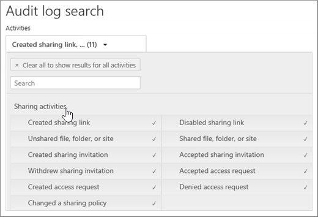

# 审核共享以查找与外部用户共享的资源

共享是 SharePoint Online 和 OneDrive for business 中的关键活动, 并在 Office 365 组织中广泛使用。 管理员可以使用 Office 365 审核日志中的共享审核来确定如何在组织中使用共享。 
  
## SharePoint 共享架构

共享事件 (不包括与共享策略和共享链接相关的事件) 与文件和文件夹相关的事件有一个主要方式不同: 一个用户执行的操作对另一个用户有影响。 例如, 当资源用户 A 向用户 B 授予对文件的访问权限时。 在此示例中, 用户 A 是*作用用户*, 而用户 B 是*目标用户*。 在 SharePoint 文件架构中, 作用用户的操作仅影响文件本身。 当用户 A 打开文件时, **FileAccessed**事件中所需的唯一信息是操作用户。 为了解决这种差异, 有一个称为*SharePoint 共享架构*的单独架构, 可捕获有关共享事件的详细信息。 这可确保管理员可以查看共享资源的人员以及共享资源的用户。 
  
共享架构在与共享事件相关的审核记录中提供了两个附加字段: 
  
- **TargetUserOrGroupType:** 标识目标用户或组是成员、来宾、SharePointGroup、SecurityGroup 还是合作伙伴。

- **TargetUserOrGroupName:** 存储与之共享资源的目标用户或组的 UPN 或名称 (上一示例中的用户 B)。 

除了 Office 365 审核日志架构 (如用户、操作和日期) 以外的其他属性, 这两个字段还可以详细说明*哪些*用户共享了哪些用户与*谁*共享了*哪些*资源。 ** 
  
还有另一个架构属性, 对共享情景很重要。 当您导出审核日志搜索结果时, 导出的 CSV 文件中的 " **AuditData** " 列存储有关共享事件的信息。 例如, 当用户与其他用户共享网站时, 可以通过将目标用户添加到 SharePoint 组来实现此目的。 **AuditData**列捕获此信息, 以便为管理员提供上下文。 有关如何分析**AuditData**列中的信息的说明, 请参阅[步骤 2](#step-2-use-the-powerquery-editor-to-format-the-exported-audit-log) 。

## SharePoint 共享事件

当用户 (用户) 要与其他用户** 共享资源 (*目标*用户) 时, 将定义共享。 与外部用户共享资源的审核记录 (组织外部的用户, 在组织的 Azure Active Directory 中没有来宾帐户) 由以下事件标识, 这些事件记录在 Office 365 中。审核日志:

- **SharingInvitationCreated:** 您的组织中的用户尝试与外部用户共享资源 (可能是网站)。 这将导致向目标用户发送外部共享邀请。 此时不授予对资源的访问权限。

- **SharingInvitationAccepted:** 外部用户接受了由操作用户发送的共享邀请, 现在有权访问该资源。

- **AnonymousLinkCreated:** 为资源创建匿名链接 (也称为 "任何人" 链接)。 由于可以创建匿名链接, 然后复制它, 因此假定具有匿名链接的任何文档已与目标用户共享, 这是合理的。

- **AnonymousLinkUsed:** 顾名思义, 当使用匿名链接访问资源时, 将记录此事件。 

- **SecureLinkCreated:** 用户已创建 "特定人员链接" 以与特定人员共享资源。 此目标用户可能是你的组织外部的人员。

- **AddedToSecureLink:** 向特定人员链接添加了用户。 此目标用户可能是你的组织外部的人员。

## 共享审核工作流
  
当用户 (用户) 想要与其他用户 (目标用户) 共享资源时, SharePoint (或 OneDrive for Business) 先检查目标用户的电子邮件地址是否已与组织目录中的用户帐户相关联。 如果目标用户位于目录中 (并具有相应的来宾用户帐户), SharePoint 将执行以下操作:
  
-  通过将目标用户添加到相应的 SharePoint 组, 立即为目标用户分配访问资源的权限, 并记录**AddedToGroup**事件。 
    
- 向目标用户的电子邮件地址发送共享通知。
    
- 记录**SharingSet**事件。 此事件在审核日志搜索工具的活动选取器中的 "共享**和访问请求" 活动**下有一个友好名称 "共享文件、文件夹或站点"。 请参阅[第1步](#step-1-search-for-sharing-events-and-export-the-results-to-a-csv-file)中的屏幕截图。 
    
如果目标用户的用户帐户不在目录中, 则 SharePoint 将执行以下操作: 
    
   - 根据资源的共享方式, 记录以下事件之一:
   
      - **AnonymousLinkCreated**
   
      - **SecureLinkCreated**
   
      - **AddedToSecureLink** 

      - **SharingInvitationCreated**(仅当共享资源是网站时, 才会记录此事件)
    
   - 当目标用户接受发送给他们的共享邀请 (通过单击邀请中的链接) 时, SharePoint 会记录一个**SharingInvitationAccepted**事件并为目标用户分配访问资源的权限。 如果向目标用户发送匿名链接, 则在目标用户使用该链接访问资源后记录**AnonymousLinkUsed**事件。 对于安全链接, 当外部用户使用链接访问资源时, 将记录**FileAccessed**事件。

还会记录有关目标用户的其他信息, 如邀请的用户的标识和实际接受邀请的用户。 在某些情况下, 这些用户 (或电子邮件地址) 可以不同。 

## 如何识别与外部用户共享的资源

管理员的常见要求是创建已与组织外部的用户共享的所有资源的列表。 通过使用 Office 365 中的共享审核, 管理员可以生成此列表。 方法如下：
  
### 步骤 1: 搜索共享事件并将结果导出到 CSV 文件

第一步是在 Office 365 审核日志中搜索共享事件。 有关搜索审核日志的详细信息 (包括所需的权限), 请参阅[在安全 & 合规性中心中搜索审核日志](search-the-audit-log-in-security-and-compliance.md)。
  
1. 转到 [https://protection.office.com](https://protection.office.com)。
    
2. 使用工作或学校帐户登录到 Office 365。
    
3. 在安全性 & 合规性中心的左侧窗格中, 单击 "**搜索**  > **审核日志搜索**"。
    
    将显示 "**审核日志搜索**" 页。 
    
4. 在 "**活动**" 下, 单击 "**共享和访问请求活动**" 以搜索与共享相关的事件。 
    
    
  
5.  选择日期和时间范围以查找在该时间段内发生的共享事件。 
    
6. 单击 "**搜索**" 以运行搜索。 
    
7. 当搜索运行完成并显示结果后, 单击 "**导出结果** \> " "**下载所有结果**"。
    
    选择 "导出" 选项后, 会在窗口底部显示一条消息, 提示您打开或保存 CSV 文件。
    
8. 单击 "**另** \>存**为**", 然后将 CSV 文件保存到本地计算机上的文件夹中。 

### 步骤 2: 使用 PowerQuery 编辑器设置导出的审核日志的格式

下一步是在 Excel 的 Power Query 编辑器中使用 JSON 转换功能, 以将**AuditData**列中的每个属性 (由多属性 JSON 对象组成) 拆分为自己的列。 这样, 您就可以筛选列以查看与共享相关的记录

有关分步说明, 请参阅[导出、配置和查看审核日志记录](export-view-audit-log-records.md#step-2-format-the-exported-audit-log-using-the-power-query-editor)中的 "步骤 2: 使用 Power Query Editor 格式化导出的审核日志"。

### 步骤 3: 筛选 CSV 文件, 以获取与外部用户共享的资源

下一步是筛选 CSV, 以获取之前在 " [SharePoint 共享事件](#sharepoint-sharing-events)" 部分中描述的与共享相关的不同事件。 或者, 可以筛选**TargetUserOrGroupType**列以显示此属性的值为 "**来宾**" 的所有记录。 

按照上一步中的说明操作, 使用 PowerQuery 编辑器准备 CSV 文件后, 请执行以下操作:
    
1. 打开您在步骤2中创建的 Excel 文件。 

2. 在 "**开始**" 选项卡上, 单击 "**排序 & 筛选**", 然后单击 "**筛选**"。
    
3. 在 "**操作**" 列上的 "**排序 & 筛选**" 下拉列表中, 清除所有选择, 然后选择一个或多个以下与共享相关的事件, 然后单击 **"确定"**。
 
   - **SharingInvitationCreated**
   
   - **AnonymousLinkCreated**
   
   - **SecureLinkCreated**
   
   - **AddedToSecureLink** 
    
    Excel 将显示所选事件的行。
    
4. 转到名为**TargetUserOrGroupType**的列, 然后选择它。 
    
5. 在 "**排序 & 筛选**" 下拉列表中, 清除 "所有选择", 然后选择 " **TargetUserOrGroupType: Guest**", 然后单击 **"确定"**。
    
    现在, Excel 将显示共享事件的行以及目标用户在组织外部的位置, 因为外部用户由值**TargetUserOrGroupType: Guest**标识。 
  
> [!TIP]
> 对于显示的审核记录, **ObjectId**列标识与目标用户共享的资源;例如`ObjectId:https:\/\/contoso-my.sharepoint.com\/personal\/sarad_contoso_com\/Documents\/Southwater Proposal.docx`。
