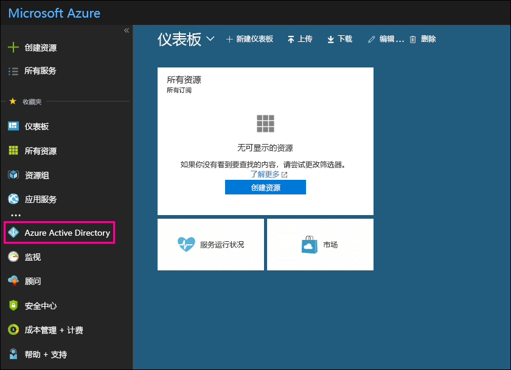

# 使用 Office 365 中的免费 Azure Active Directory 订阅Use your free Azure Active Directory subscription in Office 365

如果组织已购买 Office 365、Microsoft Dynamics CRM Online、企业移动性套件或其他 Microsoft 服务的付费订阅，表明你已免费订阅 Microsoft Azure Active Directory。你和其他管理员可使用 Azure AD 创建并管理用户和组帐户。若要使用 Azure AD，只需转到 Azure 门户，并使用 Office 365 帐户登录即可。If your organization has a paid subscription to Office 365, Microsoft Dynamics CRM Online, Enterprise Mobility Suite, or other Microsoft services, you have a free subscription to Microsoft Azure Active Directory. You and other admins can use Azure AD to create and manage user and group accounts. To use Azure AD, just go to the Azure portal and sign in using your Office 365 account.
  
## 准备工作Before you begin

使用专用浏览会话（而不是常规会话）访问 Azure 门户（即下面的第 1 步），因为这会阻止将当前登录所用的凭据传递到 Azure。若要在 Internet Explorer 中打开 InPrivate 浏览会话，或在 Mozilla FireFox 中打开专用浏览会话，只需按 CTRL+SHIFT+P 即可。若要在 Google Chrome 中打开专用浏览会话（称为“隐身窗口”），请按 CTRL+SHIFT+N。Use a private browsing session (not a regular session) to access the Azure portal (in step 1 below) because this will prevent the credential that you are currently logged on with from being passed to Azure. To open an InPrivate Browsing session in Internet Explorer or a Private Browsing session in Mozilla FireFox, just press CTRL+SHIFT+P. To open a private browsing session in Google Chrome (called an incognito window), press CTRL+SHIFT+N.
  
## 访问 Azure Active DirectoryAccess Azure Active Directory

1. 转到 [portal.azure.com](https://portal.azure.com)，再使用 Office 365 工作或学生帐户登录。Go to [portal.azure.com](https://portal.azure.com) and sign in with your Office 365 work or student account. 
    
2. 在 Azure 门户内的左侧导航窗格中，单击“Azure Active Directory”\*\*\*\*。In the left navigation pane in the Azure portal, click **Azure Active Directory**.
    
    
  
    此时，**Azure Active Directory** 管理中心显示。The **Azure Active Directory** admin center is displayed. 
    
## 更多信息More information

- 您还可以从 Microsoft 365 管理中心访问**Azure Active Directory**管理中心。You can also access the **Azure Active Directory** admin center from the Microsoft 365 admin center. 在 Microsoft 365 管理中心的左侧导航窗格中, 单击 "**管理中心** \> **Azure Active Directory**"。In the left navigation pane of the Microsoft 365 admin center , click **Admin centers** \> **Azure Active Directory**.
    
- 若要了解如何管理用户和组，并执行其他目录管理任务，请参阅[管理 Azure AD 目录](https://docs.microsoft.com/azure/active-directory/active-directory-administer)。For information about managing users and groups and performing other directory management tasks, see [Manage your Azure AD directory](https://docs.microsoft.com/azure/active-directory/active-directory-administer).
