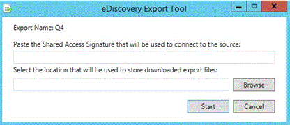

# 在 Office 365 高级电子数据展示中查看批处理历史记录和导出过去的结果View batch history and export past results in Office 365 Advanced eDiscovery

> [!NOTE]
> 高级电子数据展示需要为您的组织使用的高级合规性加载项或 E5 订阅 Office 365 E3。如果您不具有该计划，并且想要尝试高级电子数据展示，您还可以[注册试用版的 Office 365 企业 E5](https://go.microsoft.com/fwlink/p/?LinkID=698279)。Advanced eDiscovery requires an Office 365 E3 with the Advanced Compliance add-on or an E5 subscription for your organization. If you don't have that plan and want to try Advanced eDiscovery, you can [sign up for a trial of Office 365 Enterprise E5](https://go.microsoft.com/fwlink/p/?LinkID=698279). 
  
以下部分介绍用于批处理查看和导出的高级电子数据展示中的数据的其他选项。The following section describes additional options for batch viewing and export of data in Advanced eDiscovery. 
  
## 查看导出批处理历史记录和导出上一批次Viewing Export batch history and exporting previous batches

导出历史记录对话框中提供的所选的导出批次会话的详细的信息，并提供撤消最后一个会话的能力。The Export history dialog provides detailed information of selected export batch sessions and also provides the ability to undo the last session.
  
1. 在**导出\>安装**，从**导出批处理**下拉列表中选择批处理名称。In **Export \> Setup**, select the batch name from the **Export batch** drop-down list. 
    
2. 右侧的导出批处理名称，选择**批处理历史记录**图标：To the right of the export batch name, select the **Batch history** icon: 
    
    
  
    显示批处理历史记录对话框。The Batch history dialog is displayed.
    
    
  
3. 如果需要回滚以前会话，请单击**撤消最后一个会话**。回滚可以执行多次，其取消最后一个会话。If it is necessary to roll back a previous session, click **Undo last session**. Rollback can be performed multiple times, which cancels the last session.
    
4. 如果您希望从以前执行的导出批次会话的任何时候下载数据时，单击**下载**图标旁边要导出的所需的导出批次。If you want to download data at any time from a previously executed export batch session, click the **Download** icon  next to the desired export batch to be exported. 
    
5. 当显示**共享访问签名**对话框中时，单击**复制到剪贴板**以将导出会话数据复制到本地计算机，，然后单击**关闭**。Office 365 安全性&amp;，就显示合规性中心**电子数据展示导出工具**对话框。When the **Shared access signature** dialog is displayed, click **Copy to clipboard** to copy the export session data to the local machine, and then click **Close**. The Office 365 Security &amp; Compliance Center **eDiscovery Export Tool** dialog is displayed. 
    
    
  
6. 在**电子数据展示导出工具**对话框中：In the **eDiscovery Export Tool** dialog: 
    
1. 在**粘贴将用于连接到源的共享访问签名**，粘贴**共享访问签名**值，该值以前将复制到剪贴板。In **Paste the Shared Access Signature that will be used to connect to the source**, paste the **Shared access signature** value, which was previously copied to the clipboard. 
    
2. 单击**浏览**，选择用于存储在本地计算机上下载的导出文件的目标位置。Click **Browse** to select the target location for storing the downloaded export files on a local machine. 
    
3. 单击**启动**。导出文件下载到本地计算机。Click **Start**. The export files are downloaded to the local machine. 
    
## 另请参阅See also

[Office 365 高级电子数据展示Office 365 Advanced eDiscovery](office-365-advanced-ediscovery.md)
  
[导出结果Exporting results ](export-results-in-advanced-ediscovery.md)

[导出报表字段Export report fields](export-report-fields-in-advanced-ediscovery.md)

