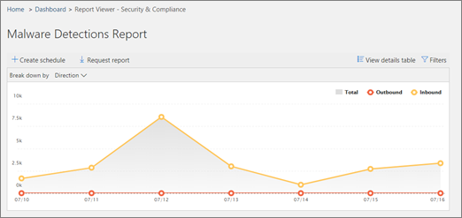

# 查看安全中的电子邮件安全报告&amp;合规性中心View email security reports in the Security &amp; Compliance Center

安全中可用的各种电子邮件安全报告&amp;合规性中心，以帮助您查看 Office 365 中的反垃圾邮件和反恶意软件功能如何保护您的组织。如果您拥有[所需的权限](#what-permissions-are-needed-to-view-these-reports)，则可以安全中查看这些报告&amp;，转到**报告**的合规性中心\>**仪表板**。A variety of email security reports are available in the Security &amp; Compliance Center to help you see how anti-spam and anti-malware features in Office 365 are protecting your organization. If you have the [necessary permissions](#what-permissions-are-needed-to-view-these-reports), you can view these reports in the Security &amp; Compliance Center by going to **Reports** \> **Dashboard**.
  

  
您的电子邮件安全报告包括：Your email security reports include the following:
  
- [威胁保护状态报告](view-email-security-reports.md#tps)（新） ！[Threat protection status report](view-email-security-reports.md#tps) (new!) 
    
- [恶意软件检测报告Malware Detections report](view-email-security-reports.md#maldet)
    
- [顶部的恶意软件报告Top Malware report](#top-malware-report)
    
- [顶部的发件人和收件人报告Top Senders and Recipients report](view-email-security-reports.md#topsenders)
    
- [欺骗邮件报告Spoof Mail report](#spoof-mail-report)
    
- [垃圾邮件检测报告Spam Detections report](#spam-detections-report)
    
- [发送和接收电子邮件报告Sent and received email report](view-email-security-reports.md#sentreceivedemail)
    
- [用户报告的邮件报告](view-email-security-reports.md#userreported)（新） ！[User-reported messages report](view-email-security-reports.md#userreported) (new!) 
    
## 威胁保护状态报告 （新） ！Threat protection status report (new!)

新的**威胁保护状态**报告是显示的已检测和阻止的 Exchange Online Protection 恶意电子邮件的智能报告。此报表显示有关标识为恶意软件或网络钓鱼尝试的电子邮件的信息。The new **Threat protection status** report is a smart report that shows malicious email that was detected and blocked by Exchange Online Protection. This report shows information about email identified as malware or a phishing attempt. 
  
若要查看此报告中，安全中&amp;合规性中心中，转到**报告** \> **仪表板** \> **威胁保护状态**。To view this report, in the Security &amp; Compliance Center, go to **Reports** \> **Dashboard** \> **Threat protection status**.
  

  
当您首次打开威胁保护状态报告时，报告将显示数据的过去七天默认设置。但是，您可以单击**筛选器**，更改为 90 天的详细信息的日期范围。用于查看的有效性和影响组织的 Exchange Online Protection 功能，以及长期趋势分析此报告。When you first open the Threat protection status report, the report shows data for the past seven days by default; however, you can click **Filters** and change the date range for up to 90 days of detail. This report is useful for viewing the effectiveness and impact of your organization's Exchange Online Protection features, and for longer-term trending. 
  

  
您还可以选择是否要查看的电子邮件标识为恶意数据，电子邮件标识为网络钓鱼尝试或电子邮件标识为包含恶意软件。You can also choose whether to view data for email identified as malicious, email identified as a phishing attempts, or email identified as containing malware.
  

  
## 恶意软件检测报告Malware Detections report

**恶意软件检测**报告将显示多少传入和传出邮件检测为包含恶意软件为您的组织。The **Malware Detections** report shows how many incoming and outgoing messages were detected as containing malware for your organization. 
  
若要查看此报告中，安全中&amp;合规性中心中，转到**报告** \> **仪表板** \> **恶意软件检测**。To view this report, in the Security &amp; Compliance Center, go to **Reports** \> **Dashboard** \> **Malware Detections**.
  

  
类似于其他报表，如威胁保护状态报告，报告显示数据的过去七天默认情况下。但是，您可以选择要更改的日期范围的**筛选器**。Similar to other reports, like the Threat protection status report, the report displays data for the past seven days by default. However, you can choose **Filters** to change the date range. 
  
## 顶部的恶意软件报告Top Malware report

**顶部恶意软件**报告将显示的各种通过 Exchange Online 中检测到的恶意软件。The **Top Malware** report shows the various kinds of malware that was detected by Exchange Online. 
  
若要查看此报告中，安全中&amp;合规性中心中，转到**报告** \> **仪表板** \> **顶部恶意软件**。To view this report, in the Security &amp; Compliance Center, go to **Reports** \> **Dashboard** \> **Top Malware**.
  

  
当鼠标悬停在楔入饼图图表中时，您可以看到的一种恶意软件和多少邮件检测为具有该恶意软件的名称。When you hover over a wedge in the pie chart, you can see the name of a kind of malware and how many messages were detected as having that malware.
  
单击 （或点击） 报表以在新浏览器窗口中，您可以在哪里找到报告的更详细的视图中打开它。Click (or tap) the report to open it in a new browser window, where you can get a more detailed view of the report.
  

  
下面的图表中，您将看到检测到恶意软件和消息数量为具有该恶意软件检测到的列表。Below the chart, you'll see a list of detected malware and how many messages were detected as having that malware.
  
## 顶部的发件人和收件人报告Top Senders and Recipients report

**前发件人和收件人**报告是显示在顶部的电子邮件发件人饼图。The **Top Senders and Recipients** report is a pie chart showing your top email senders. 
  
若要查看此报告中，安全中&amp;合规性中心中，转到**报告** \> **仪表板** \> **前发件人和收件人**。To view this report, in the Security &amp; Compliance Center, go to **Reports** \> **Dashboard** \> **Top Senders and Recipients**.
  

  
当鼠标悬停在楔入饼图图表中时，您可以看到发送或接收邮件的计数。When you hover over a wedge in the pie chart, you can see a count of messages sent or received.
  
单击 （或点击） 报表以在新浏览器窗口中，您可以在哪里找到报告的更详细的视图中打开它。Click (or tap) the report to open it in a new browser window, where you can get a more detailed view of the report.
  
使用**显示的数据**列表选择是否查看数据的顶级发件人、 接收器、 垃圾邮件收件人和垃圾邮件收件人。您还可以查看者收到的高级威胁保护由检测到恶意软件。Use the **Show data for** list to choose whether to view data for top senders, receivers, spam recipients, and malware recipients. You can also see who received malware that was detected by Advanced Threat Protection. 
  

  
下面的图表，您将看到用户的主要电子邮件发件人或收件人已，以及发送或接收的给定的时间段邮件的计数。Below the chart, you'll see who the top email senders or recipients were, along with a count of messages sent or received for the given time period.
  
## 欺骗邮件报告Spoof Mail report

**欺骗邮件**报告将显示多少欺骗邮件检测到，，其中，哪些已被视为"好"（欺骗邮件完成合法的业务原因）。The **Spoof Mail** report shows how many spoof mail messages were detected, and of those, which ones were considered "good" (spoof mail done for legitimate business reasons). 
  
若要查看此报告中，安全中&amp;合规性中心中，转到**报告** \> **仪表板** \> **欺骗邮件**。To view this report, in the Security &amp; Compliance Center, go to **Reports** \> **Dashboard** \> **Spoof Mail**.
  

  
当鼠标悬停在一天在图表中时，您可以看到多少欺骗邮件一起提供。When you hover over a day in the chart, you can see how many spoof mail messages came through.
  
单击 （或点击） 报表以在新浏览器窗口中，您可以在哪里找到报告的更详细的视图中打开它。Click (or tap) the report to open it in a new browser window, where you can get a more detailed view of the report.
  
## 垃圾邮件检测报告Spam Detections report

**垃圾邮件检测**报告将显示阻止的 Exchange Online 的所有垃圾邮件内容。The **Spam Detections** report shows all the spam content blocked by Exchange Online. 
  
若要查看此报告中，安全中&amp;合规性中心中，转到**报告** \> **仪表板** \> **垃圾邮件检测**。To view this report, in the Security &amp; Compliance Center, go to **Reports** \> **Dashboard** \> **Spam Detections**.
  

  
当鼠标悬停在一天在图表中时，您可以看到多少项目已阻止该天，以及如何根据这些项目进行分类。例如，您可以看到多少垃圾邮件已筛选，和项数来自已阻止的 Internet 协议 (IP) 地址。When you hover over a day in the chart, you can see how many items were blocked that day, as well as how those items are categorized. For example, you can see how many spam messages were filtered, and how many items came from a blocked Internet Protocol (IP) address.
  
单击 （或点击） 报表以在新浏览器窗口中，您可以在哪里找到报告的更详细的视图中打开它。Click (or tap) the report to open it in a new browser window, where you can get a more detailed view of the report.
  

  
下面的图表中，您将看到检测到的垃圾邮件项目的列表。选择一个项目以查看其他信息，如入站或出站垃圾邮件项是否、 邮件 ID、 和其收件人。Below the chart, you'll see a list of spam items that were detected. Select an item to view additional information, such as whether the spam item was inbound or outbound, its message ID, and its recipient.
  
## 发送和接收电子邮件报告Sent and received email report

**发送和接收电子邮件**报告是智能报表的显示信息传入和传出电子邮件，其中包括垃圾邮件检测、 恶意软件和电子邮件标识为"良好"。The **Sent and received email** report is a smart report that shows information about incoming and outgoing email, including spam detections, malware, and email identified as "good." 
  
若要查看此报告中，安全中&amp;合规性中心中，转到**报告** \> **仪表板** \> **发送和接收电子邮件**。To view this report, in the Security &amp; Compliance Center, go to **Reports** \> **Dashboard** \> **Sent and received email**.
  

  
当鼠标悬停在一天在图表中时，您可以看到多少邮件发自中，并根据这些邮件进行分类。例如，您可以看到多少邮件检测为包含恶意软件、 和多少已标识为垃圾邮件。When you hover over a day in the chart, you can see how many messages came in, and how those messages are categorized. For example, you can see how many messages were detected as containing malware, and how many were identified as spam.
  
单击 （或点击） 报表以在新浏览器窗口中，您可以在哪里找到报告的更详细的视图中打开它。Click (or tap) the report to open it in a new browser window, where you can get a more detailed view of the report.
  
**按**列表可用于查看由类型或方向 （传入和传出） 的信息。You can use the **Break down by** list to view information by type or by direction (incoming and outgoing). 
  

  
下面的图表，您将看到电子邮件类别，例如**GoodMail**、 **SpamContentFiltered**，等的列表。选择要查看其他信息，如的恶意软件、 所采取的操作和是否电子邮件类别的传入或传出。Below the chart, you'll see a list of email categories, such as **GoodMail**, **SpamContentFiltered**, and so on. Select a category to view additional information, such as actions that were taken for malware, and whether email was incoming or outgoing.
  

  
## 用户报告的邮件报告 （新） ！User-reported messages report (new!)

**用户报告的邮件**报告将显示有关用户报告为垃圾邮件、 网络钓鱼诈骗或良好的邮件使用[邮件报告加载项](enable-the-report-message-add-in.md)的电子邮件的信息。The **User-reported messages** report shows information about email messages that users have reported as junk, phishing attempts, or good mail by using the [Report Message add-in](enable-the-report-message-add-in.md).
  
为每个邮件，包括传递原因，这样的垃圾邮件策略异常或为组织配置的邮件流规则提供了详细信息。若要查看详细信息，在用户报告列表中，选择一个项目，然后查看**摘要**和**详细信息**选项卡上的信息。Details are available for each message, including the delivery reason, such a spam policy exception or mail flow rule configured for your organization. To view details, select an item in the user-reports list, and then view the information on the **Summary** and **Details** tabs. 
  

  
若要查看此报告中，安全中&amp;合规性中心中，执行下列选项之一：To view this report, in the Security &amp; Compliance Center, do one of the following:
  
- 转到**威胁管理** \> **仪表板** \> **用户报告的邮件**。Go to **Threat management** \> **Dashboard** \> **User-reported messages**.
    
- 转到**威胁管理** \> **审阅** \> **用户报告的邮件**。Go to **Threat management** \> **Review** \> **User-reported messages**.
    

  
> [!IMPORTANT]
> 为了让用户报告的邮件报告正常工作，为您的 Office 365 环境**必须打开审核日志记录**。这通常是具有审核日志角色分配在 Exchange Online 的人。有关详细信息，请参阅[打开或关闭，打开 Office 365 审核日志搜索](turn-audit-log-search-on-or-off.md)。In order for the User-reported messages report to work correctly, **audit logging must be turned on** for your Office 365 environment. This is typically done by someone who has the Audit Logs role assigned in Exchange Online. For more information, see [Turn Office 365 audit log search on or off](turn-audit-log-search-on-or-off.md). 
  
## 查看这些报告需要哪些权限？What permissions are needed to view these reports?

为了查看和使用本文中所述的电子邮件安全报告，您必须具有安全中分配相应角色&amp;合规性中心和 Exchange Admin Center。In order to view and use the email security reports described in this article, you must have an appropriate role assigned in the Security &amp; Compliance Center and in the Exchange Admin Center.
  
|**角色组****Role group**|**其中分配****Where assigned**|**了解更多****Learn more**|
|:-----|:-----|:-----|
| 以下各项之一：One of the following:     组织管理Organization Management     Security AdministratorSecurity Administrator     安全读者Security Reader    |安全&amp;合规性中心Security &amp; Compliance Center    |[Office 365 安全性权限&amp;合规性中心Permissions in the Office 365 Security &amp; Compliance Center](permissions-in-the-security-and-compliance-center.md)   |
| 以下各项之一：One of the following:     组织管理Organization Management     仅查看组织管理View-only Organization Management     仅查看收件人角色View-Only Recipients role     遵从性管理Compliance Management    |Exchange 管理中心Exchange Admin Center    |[Exchange Online 中的功能权限Feature permissions in Exchange Online](https://technet.microsoft.com/library/jj200673%28v=exchg.150%29.aspx)   |
   
## 如果报表不显示数据？What if the reports aren't showing data?

如果您不会在报表中看到数据，请仔细检查您的策略设置正确。若要了解详细信息，请参阅[Office 365 中的反垃圾邮件和反恶意软件保护](anti-spam-and-anti-malware-protection.md)。If you are not seeing data in your reports, double-check that your policies are set up correctly. To learn more, see [Anti-spam and anti-malware protection in Office 365](anti-spam-and-anti-malware-protection.md).
  
## 相关主题Related topics

[Office 365 反垃圾邮件保护Office 365 Email Anti-Spam Protection](anti-spam-protection.md)
  
[报告和 Office 365 安全性见解&amp;合规性中心Reports and insights in the Office 365 Security &amp; Compliance Center](reports-and-insights-in-security-and-compliance.md)
  
[在安全中创建报表的计划&amp;合规性中心Create a schedule for a report in the Security &amp; Compliance Center](create-a-schedule-for-a-report.md)
  
[设置和下载安全中的自定义报表&amp;合规性中心Set up and download a custom report in the Security &amp; Compliance Center](set-up-and-download-a-custom-report.md)
  

