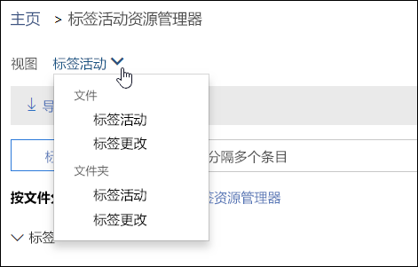
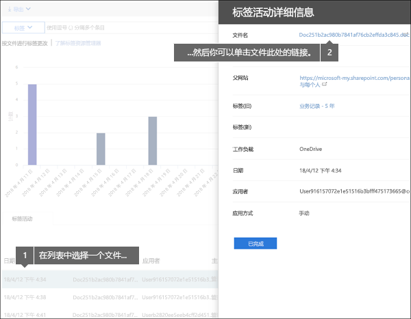
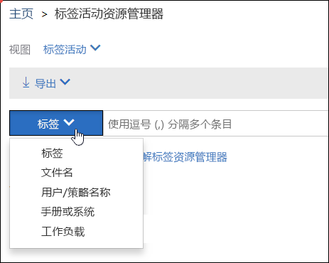

# 查看文档的标签活动

建议在创建标签后验证这些标签是否已按预期应用于内容。使用 Office 365 安全与合规中心内的标签活动资源管理器，可快速搜索和查看过去 30 天内 SharePoint 和 OneDrive for Business 中所有内容的标签活动。此为实时数据，可便于你明确了解租户中发生了什么。
  
例如，标签活动资源管理器可用于：
  
- 查看每个标签每天应用多少次（最多查看 30 天的应用次数）。
    
- 查看谁在哪天标记了哪个文件（其中还提供指向文件驻留网站的链接）。
    
- 查看哪些文件的标签已变更或遭删除、新旧标签分别是什么，以及更改者是谁。
    
- 筛选数据，以查看特定标签、文件或用户的所有标签活动。还可以按位置（SharePoint 还是 OneDrive for Business）以及标签是手动应用还是自动应用来筛选标签活动。
    
- 查看文件夹或各个文档的标签活动。即将可以查看文件夹中有多少个文件继承文件夹的标签。
    
要查找标签活动资源管理器，可访问安全与合规中心 >“**数据管理**” >  **标签活动资源管理器**。
  
请注意，必须有 Office 365 企业版 E5 订阅，才能使用标签活动资源管理器。
  

  
## 查看文件或文件夹的标签活动

在标签活动资源管理器的顶部，可选择是查看文件的标签活动，还是查看文件夹的标签活动。请注意，文件夹活动只包含文件夹本身的活动，并不包含文件夹内文件的活动。
  
建议查看文件夹的标签活动，因为文件夹中的所有文件都会继承文件夹的标签（已显式应用有标签的文件除外）。因此，标记文件夹可能会影响大量文件。有关详细信息，请参阅[向 SharePoint 库、文件夹或文档集中的所有内容应用默认保留标签](labels.md#applying-a-default-retention-label-to-all-content-in-a-sharepoint-library-folder-or-document-set)。
  

  
### 标签活动

 “标签活动”**** 包括所有标签操作：**添加**、**删除**或**更改**标签。使用此视图，可全面了解每个标签每天应用于多少个文件。 
  
### 标签更改

 “标签更改”**** 包括可能存在风险的标签**删除**或**更改**操作。使用此视图，可快速查看这类存在风险的操作，以及谁执行了这些操作。在图表下面的活动列表中，可选择一个文件，再单击此文件在右侧细节窗格中的链接。 
  

  
## 筛选标签活动

可快速筛选数据，以查看特定标签、文件或用户的所有标签活动。也可以按位置（SharePoint 还是 OneDrive for Business）以及标签是手动应用还是自动应用来筛选标签活动。
  

  

