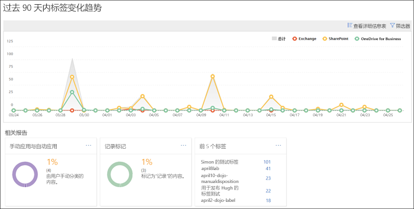
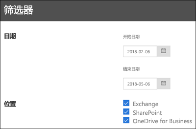

# 查看数据管理报告View the data governance reports

建议在创建标签后，验证它们是否按预期应用于内容。借助 Office 365 安全与合规中心内的数据管理报告，可快速查看：After you create your labels, you'll want to verify that they're being applied to content as you intended. With the data governance reports in the Office 365 Security &amp; Compliance Center, you can quickly view:
  
- **前 5 大标签**：此报告显示已应用于内容的前 5 大标签的应用次数。单击此报告，可查看最近应用于内容的所有标签列表，其中包括每个标签的应用次数、位置、应用方式、保留操作、是否是记录及其处置类型。**Top 5 labels** This report shows the count of the top 5 labels that have been applied to content. Click this report to view a list of all labels that have been recently applied to content. You can see each label's count, location, how it was applied, its retention actions, whether it's a record, and its disposition type. 
    
- **手动应用与自动应用**：此报告显示所有已手动或自动标记的内容量，以及手动标记与自动标记的内容百分比。**Manual vs Auto apply** This report shows the count of all content that's been labeled manually or automatically, and the percentage of content that's been labeled manually vs automatically. 
    
- **记录标记**：此报告显示所有已标记为记录或非记录的内容量，以及已标记为记录与非记录的内容百分比。**Records tagging** This report shows the count of all content that's been tagged as a record or non-record, and the percentage of content that's been tagged as a record vs. non-record. 
    
- **过去 90 天内标签趋势**：此报告显示过去 90 天内应用的所有标签的应用次数和位置。**Labels trend over the past 90 days** This report shows the count and location of all labels that have been applied in the last 90 days. 
    
所有这些报告显示的都是 Exchange、SharePoint 和 OneDrive for Business 中的已标记内容。All these reports show labeled content from Exchange, SharePoint, and OneDrive for Business.
  
若要查找这些报告，可以在安全与合规中心内依次单击“数据管理”\*\*\*\* 和“仪表板”\*\*\*\*。You can find these reports in the Security &amp; Compliance Center \> **Data Governance** \> **Dashboard**.
  

  
可以按日期（最多 90 天）和位置（Exchange、SharePoint 和 OneDrive for Business）筛选数据管理报告。最新数据最长可能需要 24 小时，才能显示在报告中。You can filter the data governance reports by date (up to 90 days) and location (Exchange, SharePoint, and OneDrive for Business). The most recent data can take up to 24 hours to appear in the reports.
  

  

