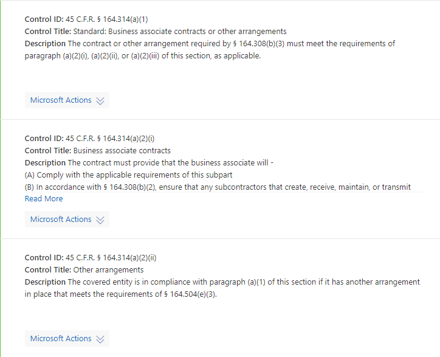
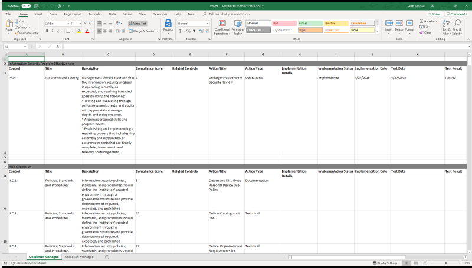

# <a name="work-with-microsoft-compliance-manager-preview"></a>使用 Microsoft 合规性管理器 (预览)

> [!IMPORTANT]
> Microsoft 合规性管理器是一个仪表板和管理工具, 提供了有关数据保护和合规性的摘要 stature 以及改进数据保护和合规性的建议。 合规性管理器中提供的客户操作是建议;在实现之前, 你的组织可以评估这些建议在其各自的法规环境中的有效性。 在合规性管理器中找到的建议不应解释为合规性保证。

## <a name="access-compliance-manager"></a>Access 合规性管理器

合规性管理器是从服务信任门户进行访问。任何拥有 Microsoft 帐户或 Azure Active Directory 组织帐户的人，都可以访问合规性管理器。
  
1. 转到 [https://servicetrust.microsoft.com](https://servicetrust.microsoft.com/)。

2. 使用 Microsoft 服务帐户登录。 这是你的 Office 365、Microsoft 365 或 Azure Active Directory (Azure AD) 用户帐户。

3. 在服务信任门户中, 选择 "**合规性管理器**"。 这是合规性管理器的预览版本。 **合规性管理器 (经典)** 是指向早期版本的合规性管理器的链接。

4. 在显示非公开协议时, 请阅读并选择 "**同意**继续"。 您必须同意一次, 然后才会显示合规性管理器仪表板。

为实现入门, 默认情况下, Office 365 的 ISO/IEC 27001:2103 评估会显示在您的组织中。

## <a name="administration"></a>管理

只有租户管理员可以使用特定的管理功能, 并且只有在使用全局管理员帐户登录时才可见。 但是, 在管理员向用户分配合规性管理器角色后, 组织中的所有用户都可以看到合规性管理器中的数据。 我们建议实现基于角色的访问控制, 以确定可在合规性管理器中访问和执行操作的人员。
  
### <a name="assigning-compliance-manager-roles-to-users"></a>向用户分配合规性管理器角色

每个合规性管理器角色都具有略有不同的权限。 您可以查看分配给每个角色的权限, 查看哪些用户是哪些角色, 以及通过服务信任门户在该角色中添加或删除用户。 选择 "**管理**" 菜单项, 然后选择 "要查看的**设置**"。
  

  
若要在合规性管理器角色中添加或删除用户，请执行以下操作。
  
1. 转到 [https://servicetrust.microsoft.com](https://servicetrust.microsoft.com)。

2. 使用 Azure Active Directory 全局管理员帐户登录。

3. 在 "服务信任门户" 顶部菜单栏上, 选择 "**管理员**", 然后选择 "**设置**"。

4. 在 "**选择角色**" 下拉列表中, 选择要管理的角色。

5. 在 "**选择角色**" 页上列出了添加到每个角色的用户。

6. 若要将用户添加到此角色, 请选择 "**添加**"。 在 "**添加用户**" 对话框中, 选择 "用户" 字段。 您可以在可用用户列表中滚动, 也可以开始键入用户名, 以根据您的搜索词筛选列表。 选择要将该帐户添加到使用该角色预配的 "**添加用户**" 列表中的用户。 如果要同时添加多个用户, 请开始键入用户名以筛选列表, 然后选择要添加到列表中的用户。 选择 "**保存**" 将所选角色设置给这些用户。 

    
  
7. 若要从此角色中删除用户, 请选择 "用户", 然后选择 "**删除**"。

    

## <a name="groups"></a>组

组允许您以逻辑方式组织评估, 并在评估之间共享公共信息和工作流任务, 这些评估与客户托管的控件相同或相关。 您可以按组织中的年、标准、服务、团队、部门或机构对评估进行分组, 以帮助最大限度地减少客户管理的操作:
  
- **FFIEC 是评估2019**
  - Office 365 + FFIEC 是
  - Intune + FFIEC 为
- **“数据安全和隐私”评估**
  - Office 365 + ISO 27001:2013
  - Office 365 + ISO 27018:2014

当您创建新的评估时, 您必须为评估创建一个新组, 或将评估分配给现有组。 不能将组创建为独立的实体。 建议您在添加新评估*之前*为您的组织确定一个分组策略。 默认情况下, 在初始评估中可使用名为 "默认组" 的组。 组没有任何安全属性。 所有权限都与评估相关联。

使用组时, 请记住:
  
- 在同一组中的不同评估中的相关评估控件在完成后将自动更新。
- 当您创建新的评估时, 新组可以复制现有组中的信息。 从进行复制的组中的客户托管控件的 "实现详细信息" 和 "测试计划和管理响应" 字段中添加的任何信息都将复制到 "新建" 中的 "客户托管" 控件中的相同 (或相关)。因素. 如果要将新评估添加到现有组中, 则会将该组中评估的常见信息复制到新评估中。
- 组名 (也称为*组 id*) 在您的组织中必须是唯一的。
- 组可以包含对同一认证/法规的评估, 但每个组只能包含针对特定云服务/证书对的一个评估。 例如, 组不能包含针对 Office 365 和 NIST CSF 的两个评估。 仅当一个组与同一个云服务的对应证书/法规不同时, 该组才能包含对同一个云服务的多个评估。
- 在将评估添加到评估组后, 不能更改此分组。 您可以重命名评估组, 这将更改与该组关联的所有评估的评估分组的名称。 您可以创建评估和新的评估组, 并从现有评估中复制信息, 这样可有效地在不同的评估组中创建该评估的重复项。
- 存档评估会破坏该评估与组之间的关系。 任何进一步的相关评估更新将不再反映在存档评估中。

## <a name="tenant-management"></a>租户管理

合规性管理器 (预览版) 包括用于管理名为**租户管理**的新数据元素的新接口。 此接口使您能够管理租户范围内的设置:

- **维:** 查看、添加和自定义模板、评估和操作项的元数据, 以允许您为筛选器创建自定义透视。
- **所有者:** 为每个即席项目指定一个所有者。
- **客户操作:** 管理合规性管理器 (预览版) 中包含的操作项的完整列表, 并为与安全得分集成的操作启用/禁用安全分数监视。

选择 "**租户管理**" 以打开管理界面, 并使用以下步骤来管理**维度**、**所有者**和**客户操作**。

### <a name="dimensions"></a>Dimensions

维度是提供有关模板、评估或措施项的信息的元数据的集合。 维度使用键和值的概念, 其中维度键表示属性, 维度值表示属性的有效值。 例如, 在合规性管理器中有三种类型的操作。 它们由**操作类型**的维度键和**文档**、**运营**和**技术**的维度值定义。 您可以修改现有维度或添加自己的维度。 在导入自定义模板时, 通常需要添加维度。

#### <a name="add-a-dimension"></a>添加维度

1. 打开 "**租户管理**" 并选择 "**维度**"。
2. 选择 " **+ 添加维度**"。
3. 在 "**键**" 字段中输入一个唯一的名称。
4. (可选) 允许对同一键同时使用多个值, 请将开关滑动到 "**允许将维度多重选择**为打开"。
5. 选择 " **+ 添加**" 通过提供唯一名称并单击 "保存" 图标来添加值。
6. 对要添加的每个值重复步骤5。
7. 选择 "**保存**" 以保存新的维度。

#### <a name="edit-a-dimension"></a>编辑维度

您可以重命名维度键, 但您可以修改自定义维度的值。

1. 打开 "**租户管理**" 并选择 "**维度**"。
2. 找到要编辑的维度, 选择旁边的省略号 (...), 然后选择 "**编辑**"。
3. 选择 " **+ 添加**" 以添加一个值, 方法是提供一个唯一的名称, 然后单击 "保存" 图标, 或选择要编辑或删除的值, 然后选择 "**删除**" 或 "**编辑**"。
4. 完成更改后, 请选择 "**保存**"。

#### <a name="delete-a-dimension"></a>删除维度

如果需要, 可以删除自定义维度。

1. 打开 "**租户管理**" 并选择 "**维度**"。
2. 找到要删除的维度, 选择其旁边的省略号 (...), 然后选择 "**删除**"。
3. 当出现确认消息时, 选择 "**删除**"。

### <a name="owners"></a>Owners

所有者用于标识每个控件的负责方。 所有内置控件由 Microsoft、客户或这两者拥有。 您可以创建可用于在组织中指定更精确的职责的所有者的自定义值。 例如, 可以创建代表组织中的特定组、团队或业务单位的所有者。

#### <a name="add-an-owner"></a>添加所有者

1. 打开 "**租户管理**" 并选择 "**所有者**"。
2. 选择 " **+ 添加所有者**"。
3. 提供所有者的名称和说明, 然后选择 "**保存**"。 说明显示在 "所有者" 列中。

#### <a name="edit-an-owner"></a>编辑所有者

您不能编辑所有者名称, 但可以修改 "Owner" 列中显示的说明。

1. 打开 "**租户管理**" 并选择 "**所有者**"。
2. 找到要编辑的所有者, 选择其旁边的省略号 (...), 然后选择 "**编辑**"。
3. 根据需要修改说明, 然后选择 "**保存**"。

#### <a name="delete-an-owner"></a>删除所有者

1. 打开 "**租户管理**" 并选择 "**所有者**"。
2. 找到要删除的所有者, 选择其旁边的省略号 (...), 然后选择 "**删除**"。
3. 当出现确认消息时, 选择 "**删除**"。

### <a name="customer-actions"></a>客户操作

"客户操作" 区域显示合规性管理器中所有模板和评估的所有客户操作 (预览)。


一览, 您可以查看操作的标题、所有者、类别、强制和分数, 并确定它是否与安全得分集成。 您可以展开操作并选择 "**读取更多**", 以读取操作说明并访问说明中的任何链接。 您还可以使用此接口基于每个操作启用和禁用安全得分集成, 并添加自定义操作。 具有安全得分集成功能的操作旁边有一个省略号 (...) (请注意, 自定义操作旁边还有一个省略号)。

#### <a name="enable-or-disable-secure-score-integration"></a>启用或禁用安全分数集成

1. 选择要修改的操作的省略号 (...), 然后选择 "**编辑**"。
2. 切换交换机以确保安全分数连续更新为 "开" 或 "关", 以通过安全分数启用或禁用连续监控。
3. 选择“保存”****。

#### <a name="add-a-customer-action"></a>添加客户操作

1. 选择 " **+ 添加客户操作**"。
2. 在 "**标题**" 字段中为操作提供唯一的标题。
3. 在 "**最大合规性分数**" 字段中提供操作的合规性分数 (可以是1-99 中的任何数字)。
4. 使用 "**操作类型**" 下拉列表来指定要添加的操作的类型。 如果操作类型不存在, 则可以通过将值添加到 "操作类型" 维度键来添加它。
5. 使用 "**维度**" 下拉列表可指定或添加操作的维度键和值。
6. 使用 "**所有者**" 下拉列表指定操作的所有者。
7. 选择**+** 以添加操作的说明和说明标题。
8. 选择**X**以关闭说明边栏。
9. 选择 "**保存**" 以保存客户操作。

#### <a name="edit-a-customer-action"></a>编辑客户操作

1. 选择要修改的操作的省略号 (...), 然后选择 "**编辑**"。
2. 根据需要编辑操作, 然后选择 "**保存**"。

#### <a name="delete-a-customer-action"></a>删除客户操作

1. 选择要修改的操作的省略号 (...), 然后选择 "**删除**"。
2. 当出现确认消息时, 选择 "**删除**"。

## <a name="assessments"></a>评估

### <a name="add-an-assessment"></a>添加评估
  
1. 在 "评估" 仪表板中, 选择 " **+ 添加评估**"。

2. 当边栏打开时, 请输入以下信息:

    - **标题 (必需):** 输入评估的标题
    - **请选择一个模板 (必需):** 选择标准或自定义模板
    - **请选择组或添加新组 (必需):** 选择现有组或选择添加新组, 并提供唯一的组名称
    - **是否要复制现有组中的数据？(可选):** 切换控件以启用组副本, 然后执行以下操作:
        - **选择一个组 (可选):** 如果已启用组副本, 请选择要复制的组
            - **实现详细信息 (可选):** 选择以将实现详细信息复制到新组
            - **测试计划 & 其他信息 (可选):** 选择以将测试计划和其他信息详细信息复制到新组
            - **文档 (可选):** 选择以将文档复制到新组

3. 选择 "**保存**" 以创建评估。

 新评估显示在评估仪表板上, 并显示以下信息:

- 评估的标题。
- 评估的维度, 包括认证、环境和应用于评估的产品。
- 创建日期的日期和上次修改日期的日期。
- 评估分数显示为百分比。
- 进度指示器, 显示已评估的 Microsoft 托管和客户 manged 控件的数量。

### <a name="copying-information-from-existing-assessments"></a>从现有评估复制信息

创建评估时, 可以选择从现有组复制信息。 这使您可以将输入到复制的评估中的信息应用于新评估中的相同控件。 例如, 如果您的组织中有与 FFIEC 相关的所有评估的组, 则可以从现有评估中复制以下信息:

- 实现详细信息
- 测试计划 & 其他信息
- Documents

#### <a name="copy-information-from-an-existing-assessment-to-a-new-assessment"></a>将信息从现有评估复制到新评估
  
1. 在 "评估" 仪表板中, 选择 " **+ 添加评估**"。
    
2. 在 "**添加评估**" 窗口中, 填写以下信息

    - **标题 (必需):** 输入评估的标题。
    - **请选择一个模板 (必需):** 选择标准或自定义模板。
    - **请选择组或添加新组 (必需):** 选择 "**添加新组**" 并提供一个唯一的组名称。
    - **是否要复制现有组中的数据？(可选):** 将控件切换到 "打开" 以启用组副本, 然后:-**选择一个组 (可选):** 如果已启用组副本, 请从组中选择要复制的组。
            - **实现详细信息 (可选):** 选择将实现详细信息复制到新组。
            - **测试计划 & 其他信息 (可选):** 选择以将测试计划和其他信息详细信息复制到新组。
            - **文档 (可选):** 选择以将文档复制到新组。

3. 选择 "**保存**" 以创建评估。

### <a name="viewing-assessments"></a>查看评估

#### <a name="view-an-assessment"></a>查看评估
  
1. 在 "评估" 仪表板中, 选择要打开的评估名称, 并查看 "操作项" 和 "控件信息"。

下面的示例展示了 Office 365 和 ISO 27001 的评估。 第一个视图演示合规性管理器 (预览版) 中的新操作项视图。


操作按字母顺序列出, 并为每个操作分配一个分数和一个所有者。 选择 "**阅读更多**" 链接以阅读每个操作的详细信息。 


选择 "**查看**" 链接以管理、分配、实现和测试操作。 下面是一个操作示例。


在早期版本的合规性管理器中, 实现要求的工作流是在控件级别执行的。 合规性监察官会将控件分配给某人以实现该控件。 这有两个缺点:

- 控件通常具有与它们相关联的多个操作, 并且分配了控件的用户可能不是完成实现该控件所需的所有操作的正确人员
- 将单独的任务组合到单个操作中阻止了用于在合规性管理器 (预览版) 中自动记录租户配置更改的信号和遥测的收集。

在合规性管理器 (预览) 中, 工作流过程已从控制级别移至操作级别。 检查操作时, 可使用以下字段来管理操作工作流:

- **为用户分配:** 选择此字段以选择或输入应为其分配此操作的用户。 您可以在列表中滚动, 或键入名称以查找它, 然后选择它。
- **管理文档:** 您可以在 Office 文档、图像文件和屏幕截图、CSV 或 TXT 中的 PowerShell 输出以及 Pdf 中上载实现证据。
- **实现状态:** 用于指示操作的当前实现状态。 可能的值尚未实现、实现、替代实施、规划且不在范围内。
- **实施日期:** 执行操作的日期。
- **测试结果:** 用于指示实现验证的结果。 可能的值未评估、传递、失败-低风险、失败-中等风险、失败-高风险以及不在范围内。
- **测试日期:** 验证发生的日期。
- **实现说明:** 输入您的组织的实现详细信息, 以及您想要包括的任何注释。
- **测试计划:** 输入此操作的测试计划详细信息, 以及要包括的任何注释。
- **其他信息:** 输入有关此操作或在组织中实现此操作的方式的任何其他信息, 以及要包括的任何注释。

合规性管理器 (预览版) 还包括在早期版本中找到的基于控件的数据透视。 选择 "**控件信息**" 仪表板以查看它。 您可以在评估和模板级别查看控件的信息。 下面是用于评估的控件信息仪表板的一个示例。


对于评估, "控件信息" 仪表板将显示:

- 一个**组**下拉列表, 用于选择要查看的组 (使用多个组时)。
- 一个**评估**下拉列表, 用于选择要查看的评估。
- 有关所选评估的元数据, 包括:
    - **评估的控制措施**的进度指示器, 其中显示了已评估的控制总数的控制次数。
    - 评估的当前**合规性分数**, 显示为百分比。
    - 有关评估中使用的**认证**和**产品**的详细信息。
    - 评估的当前**状态**和上次**修改**日期。
- 用于评估的**范围内的服务**的列表。
- 控件的详细信息, 按控件系列分组, 并提供指向客户操作和 Microsoft 实现详细信息的链接:
    - **您的操作**将显示您可以执行以满足部分或全部控件要求的客户操作。 许多控件具有与之关联的多个操作, 并且与控件关联的所有操作都显示在此处。 此处的操作与操作仪表板中列出的 UI 相同。
    - **Microsoft 操作**显示 microsoft 内部框架中应用于所选证书控制的控件列表。 对于每个内部控件, 选择 "已**实施**" 以查看 Microsoft 的实施和测试详细信息, 以及测试结果和测试日期, 如下所示。


### <a name="export-an-assessment"></a>导出评估

您可以将评估导出到您组织中的合规性利益干系人或外部审计员和主管机构的 Excel 文件。 报告是在创建报告的日期和时间的评估的快照。 该报告包含有关评估、控制实施状态、控制测试日期、测试结果的所有 Microsoft 和客户托管控件的详细信息, 并提供了指向已上载证据文档的链接。 应在存档评估之前导出评估报告, 因为存档的评估不会保留指向已上载文档的链接。
  
### <a name="export-an-assessment-report"></a>导出评估报告
  
1. 在合规性管理器仪表板中, 选择 "**控件信息**" 选项卡。
2. 在要导出的评估的下拉菜单中, 选择 "**组**和**评估**"。
3. 选择 "**导出**" 按钮。

在浏览器会话中, 会将评估报告作为 Excel 文件下载。 Excel 文件的文件名称默认为评估的标题。

### <a name="archive-a-template-or-an-assessment"></a>存档模板或评估

如果你完成了模板或评估, 并且不再出于合规性目的而需要它, 则可以对其进行存档。 当存档一个模板或评估时, 它将从默认视图中删除, 您必须选中 "显示已存档" 复选框以显示它。


  
> [!IMPORTANT]
> 存档的评估不会保留其到上传的证据文档的链接。 强烈建议您在存档前导出评估, 以保留指向报告中的证据文档的链接。
  
#### <a name="archive-a-template"></a>存档模板

1. 打开 "**模板**" 仪表板。
2. 找到要存档的模板, 然后选择 "存档" 图标。
3. 当您看到确认消息时, 请选择 "**存档**"。

#### <a name="archive-an-assessment"></a>存档评估

1. 打开 "**评估**" 仪表板。
2. 从下拉列表中选择包含您要存档的评估的**组**。
3. 找到要存档的评估, 然后选择 "存档" 图标。
4. 当您看到确认消息时, 请选择 "**存档**"。

#### <a name="view-archived-assessments"></a>查看存档的评估
  
1. 打开 "**评估**仪表板" 选项卡并选中 "**显示已存档**" 复选框。
2. 存档的评估显示在 "**存档评估**" 部分中。
3. 选择评估名称以打开并查看评估。

#### <a name="activate-an-archived-assessment"></a>激活存档评估

1. 在 "**评估**" 选项卡上, 选中 "**显示已存档**" 复选框。
2. 存档的评估显示在 "**存档评估**" 部分中。
3. 找到要激活的评估, 然后选择激活图标。
4. 当您看到确认消息时, 请选择 "**激活**"。

## <a name="controls-and-actions"></a>控件和操作

控件和操作是合规性管理器 (预览版) 中使用的主要数据透视。 在早期版本的合规性管理器中存在的控制轴已得到增强, 可在相同的控制系列中显示 Microsoft 和 customer 控件。 此 "合并" 视图使以每个控件为基础查看完整的共享职责模型变得更加容易。 操作透视是合规性管理器 (预览版) 中的新操作, 旨在提供 Microsoft 建议的所有操作的简化视图。

### <a name="controls"></a>控件

可以从 "控件信息" 仪表板查看控件。 控件表示标准、认证、法规或框架中的要求。 若要跨多个标准、法规等满足这些要求, 并将它们与操作相关联, 则所有内容都被视为控制框架。 例如, 像控制框架一样, 法规 (如 HIPAA) 已按节细分, 合规性管理器中的 HIPAA 控件使用与这些节相同的编号方案, 如下所示:



有三种类型的控件。 两个由 Microsoft 在内置模板中提供, 第三个由自定义模板中的客户创建和管理。 这三种类型为:

1. **Microsoft 托管控件 (MM):** 这些控件只是 Microsoft 有责任的控件。 它们显示在 "现成" 模板中, 并已添加到 Microsoft 的合规性管理器中。
2. **客户管理的控件 (CM):** 这些控件只是客户有责任的控件。 它们显示在 "现成" 模板中, 由 Microsoft 或客户添加到合规性管理器中。 客户还可以编辑或禁用 Microsoft 提供的客户托管的控件。
3. **共享控件 (SM):** 这些是在 Microsoft 和客户之间共享责任的控制措施。 这些模板显示在 "现成" 模板中, 由 Microsoft 添加到合规性管理器中。

### <a name="actions-items"></a>Actions 项

操作项目是实施标准或法规要求的建议任务, 或者用于测试、验证和记录组织的实现要求的任务。 操作与一个或多个控件相关联。 每个控件都有一个或多个与之关联的操作, 并且每个操作都可以与一个或多个控件相关联。 操作是合规性管理器 (预览版) 中核心工作流的一部分, 因为它们是由组织分配、跟踪和验证的对象。

#### <a name="assign-action-items"></a>分配操作项
  
1. 在 "**操作项**" 仪表板上, 选择包含要分配其操作的评估的**组**。
2. 在 "**评估**" 下拉列表中, 选择要为其分配操作的评估, 或从下拉列表中选择 "**全部**" 以查看所有可用操作。
3. 找到要分配的操作, 并在 "**所有者**" 列中选择要**查看**、已**实现**或**测试**的链接。
4. 选择 "**分配用户**" 字段, 将显示组织中的用户列表。 滚动列表并选择 "用户" 或 "筛选列表" 以通过键入用户的名称来选择用户。
5. 在 "实施说明" 字段中, 输入您希望向分配的用户传达的任何注释。
6. 选择 "**保存**" 以分配操作。

#### <a name="reassign-action-items"></a>重新分配操作项

通过此函数, 组织可以通过将操作重新分配给新用户, 删除对用户帐户的任何活动的或未完成的依赖项。

1. 在 "**操作项**" 仪表板上, 选择包含要重新分配其操作的评估的**组**。
2. 在 "**评估**" 下拉列表中, 选择要重新分配其操作的评估, 或从下拉列表中选择 "**全部**" 以查看所有可用操作。
3. 找到要重新分配的操作, 并在 "**所有者**" 列中选择要**查看**、**实现**或**测试**的链接。
4. 从 "**分配用户**" 字段中删除现有用户, 然后从用户列表中选择其他用户, 或通过键入用户名称来筛选列表以选择用户。
5. 在 "实施说明" 字段中, 输入您希望向用户传达的任何注释。
6. 选择 "**保存**" 以重新分配该操作。

## <a name="templates"></a>模板

模板是合规性管理器 (预览) 中与产品和证书 (例如, 标准、法规、控制框架等) 相关联的基本对象。 可以从 "模板" 仪表板中查看和添加模板。


 
仪表板将显示每个模板以及与模板关联的证书和产品、创建模板的日期和上次修改的日期、客户和 Microsoft 托管控件的数量以及最大符合性分数模板, 以及模板的状态 (例如, "已批准"、"待定审批"、"已导入")。

内置模板都具有与之关联的内置评估, 但您可以根据内置模板创建其他评估, 也可以导入自己的模板, 并根据这些模板创建自定义评估。

### <a name="create-a-template"></a>创建模板

您可以通过复制现有模板或导入自定义模板来创建模板。 存在必须用于模板数据的特定格式和架构, 或者不会将其导入到合规性管理器中。 可以从此处下载具有正确架构和示例数据的文件。
每个自定义模板应位于一个单独的 Excel 工作簿 (.xls 或 .xlsx 格式) 中, 其中包含五个选项卡:

1. 模板-评估
2. ControlFamily
3. 操作
4. Ownership
5. Dimensions

下面详细说明了每个选项卡中使用的架构。

#### <a name="template-assessment-tab"></a>模板-"评估" 选项卡

此选项卡包含一个列:

- **inScopeServices**: 模板的范围内的产品或服务的逗号分隔列表。

#### <a name="controlfamily-tab"></a>ControlFamily 选项卡

此选项卡包含的列定义映射到 "操作" 选项卡上列出的操作的控件, 并包含控件名称、系列、标题和说明等详细信息。  此选项卡的列必须按下面列出的顺序在 Excel 中进行排序, 如下所示: 

- **controlName:** 来自证书/标准/法规等的控制名称。
- **controlFamily:** 根据认证/标准、法规等控制家人。
- **controlTitle:** 控制证书/标准/法规等的标题。
- **controlDescription:** 来自认证/标准/法规等的控制说明。
- **controlVersion:** 可选的控制版本信息。  示例: 对于 NIST 800-53, 当前值为修订版 4, 因此 controlVersion 为4。  对于 CSA CCM, 它是3.0.1。
- **isDisabled:** 使用 TRUE 或 FALSE 可指示控件是否已被禁用。
- **controlType:** 使用 CM 表示这些控件是客户托管的控件。
- **controlComplianceScore:** 分配给控件的所有操作分数的总和。
- **controlActionTitle:** 此控件的所有 actionTitles 的双分号分隔的列表, 如 "操作" 选项卡上所列。 

#### <a name="actions-tab"></a>操作选项卡

此选项卡包含定义各个操作的列, 并且包含操作标题、所有权和维度等详细信息。 此选项卡的列必须按下面列出的顺序在 Excel 中进行排序, 如下所示: 

- **actionTitle:** 操作的标题。 每个标题都必须是唯一的, 我们建议使用 Pascal 大小写。
- **actionRelatedODVs:** 以分号分隔的 actionTitles 列表, 它们是 actionTitle 列中列出的子元素的父项。 在父/子关系中, 父项代表高水位线。 因此, 如果完成父操作, 还将完成所有子操作。 例如, 如果您具有类似的要求, 但具有不同的标准定义值 (如密码长度), 其中一个标准/法规至少需要15个字符, 而另一个标准/要求至少需要12个或10个。 15是此示例中的父级, 如果至少配置15个字符, 则还应满足在其他评估中建议的12个或10个字符的操作。

    > [!NOTE]
    > ActionRelatedODVs 列是架构的必需列;但是, 功能 (相关操作) 在合规性管理器 (预览) 中不可用。  计划在更高版本中添加它。

- **actionDimensionValues:** 使用以下格式的 "维" 选项卡中的适用维度的两个以分号分隔的列表:

    ```
    Dimension Key::Dimension Value;;Dimension Key::Dimension Value.
    ```
    
    例如：

    ```
    Product::Office 365;;Certification::NIST CSF
    ```

    自定义模板中使用的所有维度都必须在导入文件的 "维度" 选项卡上列出, 即使它们已列在 "维度" 仪表板上也是如此。 如果要添加新的维度键或值, 则必须首先将其添加到 "维度" 仪表板。
- **actionScore:** 每个操作的数字值, 表示该操作的分数。 我们建议遵循内置评估使用的记分模型, 这取决于每个操作的用途和实施。
- **actionOwnership:** 以分号分隔的所有者列表。 所有列出的所有者都必须包含在 "所有权" 选项卡上。
- **actionDescription:** 每个操作的文本, 必须是唯一的。 此字段支持 Markdown 语言, 如下所述。

#### <a name="ownership-tab"></a>所有权选项卡

此选项卡包含用于定义每个操作的所有者的列。  此选项卡的列必须按下面列出的顺序在 Excel 中进行排序, 如下所示:

- **ownershipName:** 所有者/责任方的唯一名称。
- **ownershipDescription:** 所有者/责任方的说明。

#### <a name="dimensions-tab"></a>维度选项卡

此选项卡包含定义可与操作相关联的维度的列。  此选项卡的列必须按下面列出的顺序在 Excel 中进行排序, 如下所示:

- **dimensionKey:** 用于维度的键的列表。 例如, 产品、认证等。
- **dimensionValue:** 每个维度键的唯一值。 例如, Office 365、Intune、Azure、自定义产品等。
- **allowMultiSelect:** 使用 TRUE 或 FALSE 可指示可以为单个维度键选择多个维度值。

#### <a name="using-markdown-language-in-description-fields"></a>在 "说明" 字段中使用 Markdown 语言

模板和评估支持对某些文本元素和格式使用 Markdown 语言。  在合规性管理器中使用的 Markdown 语言有三个格式元素:

- 项目符号和编号列表
- Hyperlinks
- 粗体

项目符号表示为星号而不是 Word 或 Excel 项目符号。 例如：

```
* Item A
* Item B
* Item C
```

数字表示为数字, 但在缩进 (每个级别三个空格) 和仅用于所有子级别的数字 (例如, 不带字母) 之间使用空格。  例如：
   1. Item A
   2. 项目 B
      1. 子项目 A
      2. 子项目 B
   3. 项目 C
   4. 项目 D
      1. 子项目 A
      2. 子项目 B
   5. Item E

通过在超链接文本周围加上括号并将超链接本身放在右方括号旁边的括号中来构造超链接。  例如：

```
Click [here](https://www.microsoft.com) to go to Microsoft’s home page.
```
此文本呈现如下: 单击[此处](https://www.microsoft.com)转到 Microsoft 主页。
如上面的示例中所示, 合规性管理器不呈现带下划线的 Url。

粗体文本只是文本的每一侧都加粗的两个星号。  例如：

```
**This text will render in bold**
```
**此文本以粗体呈现**

### <a name="create-a-template"></a>创建模板

您可以通过复制现有模板或从 Excel 导入模板数据来创建模板。 从 Excel 导入数据时, 模板需要两个不同的合规性管理器管理员发布数据 (一个发布, 另一个用于审批)。

#### <a name="create-a-template-by-copying-an-existing-template"></a>通过复制现有模板创建模板

1. 打开 "**模板**" 仪表板, 然后选择 " **+ 添加模板**"。
2. 在 "**输入模板名称**" 字段中, 为模板提供一个唯一的名称。
3. 选中 "**从现有模板复制**" 复选框, 然后从下拉列表中选择要复制的模板。
4. (可选) 添加任何其他维度。
5. 选择 "**添加到仪表板**"。

#### <a name="create-a-template-by-importing-data"></a>通过导入数据创建模板

1. 打开 "**模板**" 仪表板, 然后选择 " **+ 添加模板**"。
2. 在 "**输入模板名称**" 字段中, 为模板提供一个唯一的名称。
3. 添加一个或多个维度。 即使您使用的尺寸已列在维度仪表板中, 它们仍必须在导入文件中列出。
4. 选择 "**浏览**" 导航到导入文件的位置, 选择该文件, 然后选择 "**打开**"。
5. 将验证导入文件, 并指示检测到的控件和控件系列的数量。 如果有错误, 则会向包含错误详细信息的导入文件的修改版本提供链接。 必须先解决所有错误, 然后才会导入数据。
6. 数据通过验证后, 选择 "**添加到仪表板**"。
7. 导入的模板将显示在 "**模板**" 仪表板上, 其状态为 "已**导入**"。 选择省略号 (...), 然后选择 "**发布**" 以发布模板。 当出现确认消息时, 请选择 "**发布**"。 模板状态将更改为 "**待审批**"。
8. 另一个具有合规性管理器管理员角色的用户必须批准模板仪表板中的模板。 他们必须选择省略号 (...), 然后选择 "**批准**"。 当出现确认消息时, 选择 "**批准**"。 现在即可使用该模板。

### <a name="customize-a-template"></a>自定义模板

可以通过其他自定义控件自定义模板。 所有自定义控件都被视为客户托管的控件。

#### <a name="add-a-custom-control-to-a-template"></a>向模板中添加自定义控件

1. 打开要修改的**模板**。
2. 选择 " **+ 添加**自定义控件"。
3. 从下拉列表中选择一个**控制族**, 或输入一个新的控制族 (如果不存在)。
4. 为 "**控件 ID** " 字段中的控件提供一个唯一的名称或 ID。
5. 在 "**标题**" 字段中提供控件标题。
6. 提供 "**说明**" 字段中控件的要求和其他信息。
7. 选择 "**分配客户**操作"。
8. 找到要分配给控件的操作:
    - 使用 "**按维度筛选**" 以使用分配给操作的维度来查找和列出它们。
    - 使用 "**按所有者筛选**" 以使用分配给操作的所有者来查找和列出它们。
    - 从下拉列表中选择**操作类型**以按类型列出操作。
    - 输入要查找的操作的标题并将其列出。
9. 使用步骤8中的条件, 将显示**匹配操作**的列表。 选择要分配给控件的第一个操作。
10. 将显示操作的详细信息。 选择要使用的**说明**, 然后选择 "**完成**"。
11. 对每个要分配的其他操作重复步骤9和10。
12. 选择所有适用的操作后, 选择 "**分配**"。
13. 选择 "**保存**" 以保存新控件。

### <a name="export-a-template-to-json"></a>将模板导出到 JSON

合规性管理器 (预览版) 还支持将模板导出为 JavaScript 对象表示法 (JSON) 格式。 这使您可以与支持 JSON 的其他系统交换合规性管理器数据。

## <a name="reports"></a>报表

您可以将评估导出到您组织中的合规性利益干系人或外部审计员和主管机构的 Excel 文件。 报告是在导出的日期和时间进行评估的快照。 该报告包含 Microsoft 和客户托管的控件的详细信息, 用于评估、控制实施状态、控制测试日期、测试结果以及指向已上载证据文档的链接。 应在存档评估之前将其导出, 因为存档的评估不会保留指向已上载文档的链接。

### <a name="export-an-assessment"></a>导出评估

1. 在合规性管理器仪表板中, 选择 "**控件信息**" 选项卡。
2. 在下拉菜单中选择要导出的评估的组和评估。
3. 选择 "导出"。 将评估导出作为 Excel 文件下载。



## <a name="permissions"></a>权限

下表介绍了每个合规性管理器权限及其允许用户执行的操作。 该表还指示分配了每个权限的角色。

||**合规性管理器读者**|**合规性管理器参与者**|**合规性管理器评估员**|**合规性管理器管理员**|**门户管理员**|
|:-----|:-----|:-----|:-----|:-----|:-----|
|**读取数据:** 用户可以读取但不能编辑数据 (模板数据和租户管理除外)。  <br> | X | X | X | X  | X |
|**编辑数据:** 除了 "测试结果" 和 "测试日期" 字段 ("模板数据" 和 "租户管理" 除外) 之外, 用户可以编辑所有字段。  <br> || X | X  | X | X |
|**编辑测试结果:** 用户可以编辑 "测试结果" 和 "测试日期" 字段。  <br> ||| X | X | X |
|**管理评估:** 用户可以创建、存档和删除评估。  <br> |||| X | X |
|**管理主数据:** 用户可以查看、编辑和删除模板数据和租户管理数据。  <br> |||| X | X |
|**管理用户:** 用户可以将组织中的其他用户添加到 Reader、投稿人、评估员和管理员角色。 只有组织中具有全局管理员角色的用户才可以在门户管理员角色中添加或删除用户。  <br> ||||| X |

### <a name="guest-access"></a>来宾访问权限
  
配置合规性管理器访问后, 默认情况下, 任何没有预配角色的用户都在**来宾访问**角色中 (也是任何非组织预配帐户 (如个人 Microsoft 帐户) 的体验)。 来宾访问用户不具有对所有合规性管理器功能的完全访问权限。 他们不能看到组织的任何合规性评估数据, 但他们能够使用合规性管理器查看 Microsoft 的合规性评估报告和服务信任文档。